# LangChain-01-Runnables-时序图

## 文档说明

本文档通过详细的时序图展示 **Runnables 模块**在各种典型场景下的执行流程，包括同步/异步调用、批处理、流式输出、组合链执行、错误重试和回退等。每张时序图均配备详细的文字说明。

---

## 1. 基础调用场景

### 1.1 同步 invoke 调用

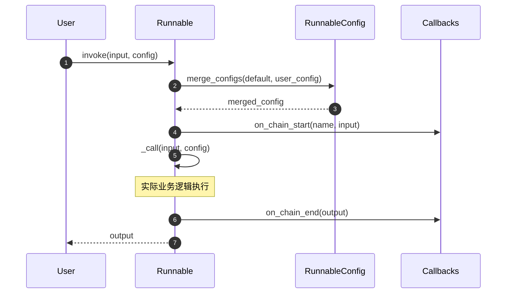

**图解说明**：

1. **配置合并**（步骤 2-3）：
   - 合并默认配置和用户传入配置
   - 优先级：用户配置 > 绑定配置 > 默认配置
   - 合并策略：`tags` 和 `metadata` 为合并，其他字段为覆盖

2. **回调触发**（步骤 4、6）：
   - `on_chain_start`：记录输入和开始时间
   - `on_chain_end`：记录输出和执行耗时
   - 异常时触发 `on_chain_error`

3. **实际执行**（步骤 5）：
   - 调用子类实现的 `_call` 方法
   - 支持同步和异步两种实现
   - 异常会被捕获并传递给回调

**边界条件**：
- 超时控制：通过 `signal.alarm()` 实现（仅 Unix 系统）
- 递归限制：通过 `recursion_limit` 配置防止无限递归
- 线程安全：使用 ContextVar 隔离配置

**性能特征**：
- 单次调用开销：约 0.1-0.5ms（不含业务逻辑）
- 回调开销：每个回调约 0.05ms
- 配置合并开销：O(n) 其中 n 为配置项数量

---

### 1.2 异步 ainvoke 调用

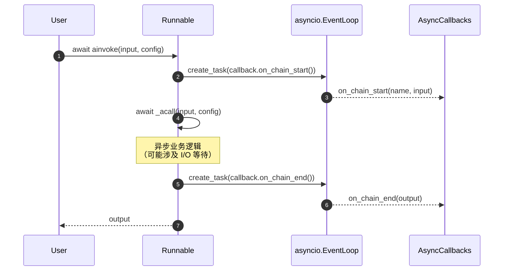

**图解说明**：

1. **异步回调**（步骤 2-3、5-6）：
   - 回调以 `asyncio.Task` 形式并发执行
   - 不阻塞主执行路径
   - 异常不影响主流程（仅记录日志）

2. **异步执行**（步骤 4）：
   - 使用 `await` 等待 I/O 操作
   - 事件循环可调度其他任务
   - 支持超时控制（`asyncio.wait_for`）

**与同步版本的差异**：
- 异步版本可并发处理多个请求
- 适合 I/O 密集型任务（如 API 调用）
- 不适合 CPU 密集型任务（无法绕过 GIL）

**性能优势**：
- 单核心可处理 1000+ 并发请求
- I/O 等待时间不占用 CPU
- 内存开销：每个任务约 2KB

---

## 2. 批处理场景

### 2.1 batch 批量调用

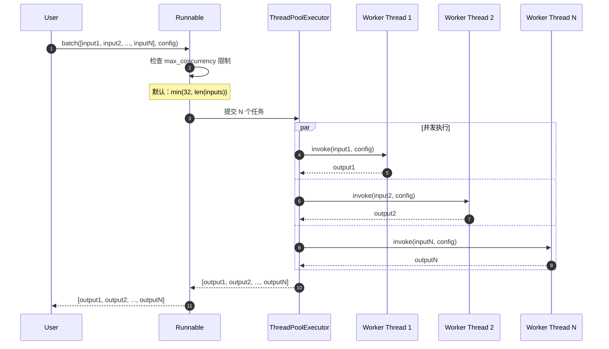

**图解说明**：

1. **并发控制**（步骤 2）：
   - `max_concurrency` 限制同时执行的任务数
   - 超出部分排队等待
   - 信号量（Semaphore）实现限流

2. **并行执行**（步骤 4-7）：
   - 使用线程池避免创建开销
   - 每个输入独立执行
   - 异常不影响其他任务

3. **结果收集**（步骤 8）：
   - 保持输入顺序
   - 任一任务失败抛出异常
   - 其他任务会被取消

**性能特征**：
- 吞吐量提升：N * 单任务耗时 / 并发数
- 适用场景：I/O 密集型任务
- 不适用：CPU 密集型任务（GIL 限制）

**最佳实践**：
- 批量大小：建议 10-100
- 并发数：根据下游服务限制调整
- 超时：设置合理的单任务超时

---

### 2.2 abatch 异步批量调用

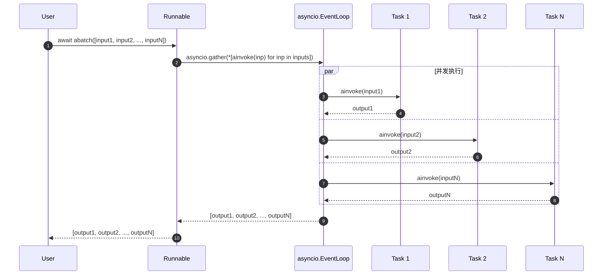

**与同步 batch 的差异**：
- 使用 `asyncio.gather` 代替线程池
- 单线程事件循环调度
- 内存开销更小（无线程栈）
- 适合大规模并发（1000+）

**异常处理**：
- `return_exceptions=False`：任一失败立即抛出
- `return_exceptions=True`：返回异常对象

---

## 3. 流式输出场景

### 3.1 stream 流式调用

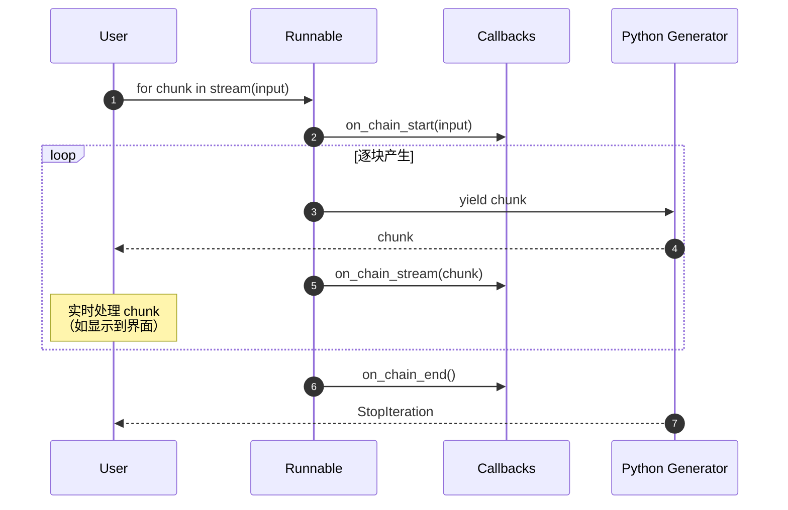

**图解说明**：

1. **生成器模式**（步骤 3-7）：
   - Python 生成器实现惰性求值
   - 背压控制：用户未消费时暂停
   - 内存高效：不累积全部输出

2. **实时回调**（步骤 5）：
   - 每个块产生时触发 `on_chain_stream`
   - 用于实时监控和日志
   - 异步回调不阻塞流

3. **完成通知**（步骤 8）：
   - `on_chain_end` 在流结束时触发
   - 包含完整输出（如需要）
   - 异常时触发 `on_chain_error`

**适用场景**：
- LLM 逐 token 输出
- 大文件处理
- 实时数据流

**性能优势**：
- 首字节延迟（TTFB）降低 90%+
- 内存峰值降低 10-100 倍
- 用户体验提升（即时反馈）

---

### 3.2 astream_events 事件流

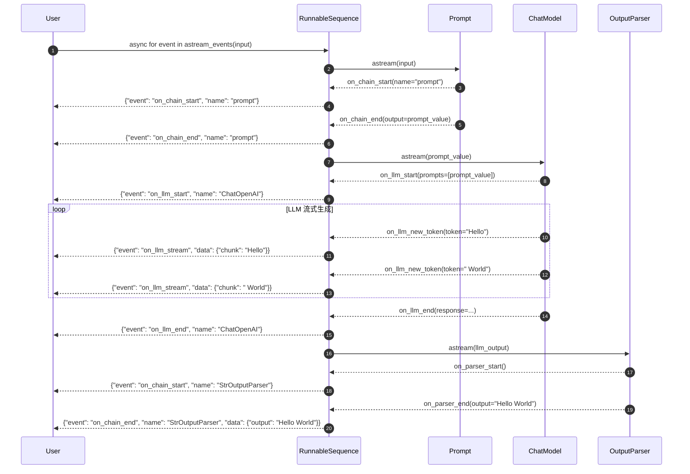

**图解说明**：

1. **事件层次**（步骤 2-17）：
   - 顶层链事件（`on_chain_*`）
   - 子步骤事件（`on_llm_*`、`on_tool_*`）
   - 嵌套深度无限制

2. **事件过滤**：
   ```python
   async for event in chain.astream_events(
       input_data,
       version="v2",
       include_names=["ChatOpenAI"],  # 仅 LLM 事件
       include_types=["llm"]           # 仅 llm 类型
   ):
       ...
   ```

3. **事件结构**：
   - `event`: 事件类型（如 `"on_llm_stream"`）
   - `name`: 组件名称
   - `run_id`: 唯一运行 ID
   - `tags`: 标签列表
   - `metadata`: 元数据
   - `data`: 事件数据

**应用场景**：
- 构建实时调试 UI
- 细粒度性能分析
- 自定义流式响应格式

**性能考虑**：
- 每个事件约 500 字节
- 使用过滤减少网络传输
- 事件队列大小限制：1000 个

---

## 4. 组合链执行场景

### 4.1 RunnableSequence 顺序执行

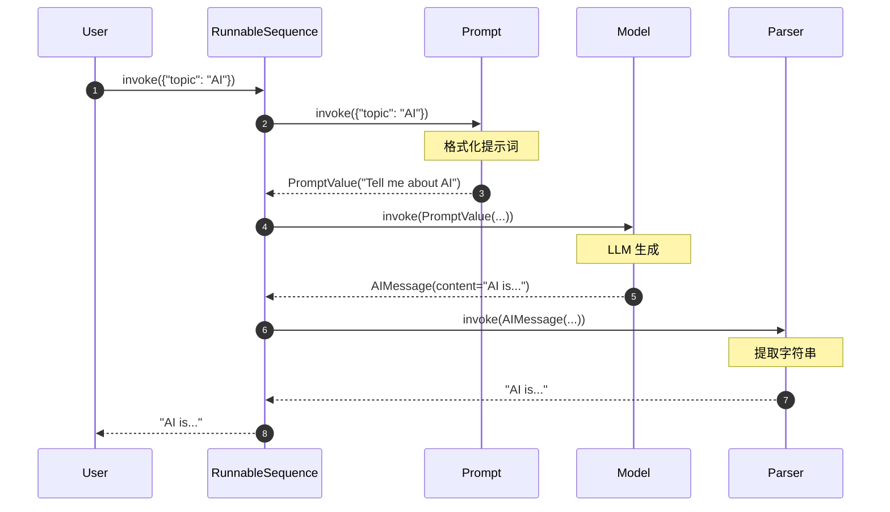

**图解说明**：

1. **类型转换链**（步骤 2-7）：
   - dict → PromptValue
   - PromptValue → AIMessage
   - AIMessage → str
   - 每步输出是下一步输入

2. **错误传播**：
   - 任一步骤失败，整个链失败
   - 异常包含完整调用栈
   - 中间结果可通过回调获取

**等价代码**：
```python
chain = prompt | model | parser  # 使用 | 操作符
output = chain.invoke({"topic": "AI"})
```

---

### 4.2 RunnableParallel 并行执行

```mermaid
sequenceDiagram
    autonumber
    participant User
    participant Par as RunnableParallel
    participant Joke as JokeChain
    participant Poem as PoemChain
    participant Summary as SummaryChain

    User->>Par: invoke({"topic": "cats"})

    par 并发执行
        Par->>Joke: invoke({"topic": "cats"})
        Note over Joke: 生成笑话
        Joke-->>Par: "Why did the cat..."
    and
        Par->>Poem: invoke({"topic": "cats"})
        Note over Poem: 生成诗歌
        Poem-->>Par: "Cats are graceful..."
    and
        Par->>Summary: invoke({"topic": "cats"})
        Note over Summary: 生成摘要
        Summary-->>Par: "Cats are small felines..."
    end

    Par->>Par: 合并结果
    Note over Par: {"joke": "...", "poem": "...", "summary": "..."}

    Par-->>User: {"joke": "...", "poem": "...", "summary": "..."}
```

**图解说明**：

1. **并发策略**（步骤 2-7）：
   - 使用 `asyncio.gather` 或 `ThreadPoolExecutor`
   - 所有步骤同时启动
   - 等待全部完成后返回

2. **结果合并**（步骤 8）：
   - 键名保持不变
   - 顺序无关
   - 任一失败则整体失败

**等价代码**：
```python
chain = RunnableParallel(
    joke=joke_chain,
    poem=poem_chain,
    summary=summary_chain
)
# 或使用字典字面量
chain = {
    "joke": joke_chain,
    "poem": poem_chain,
    "summary": summary_chain
}
```

**性能提升**：
- 执行时间 ≈ max(各步骤时间)
- 适合独立任务
- 注意下游限流

---

### 4.3 嵌套组合链

```mermaid
sequenceDiagram
    autonumber
    participant User
    participant Outer as RunnableSequence
    participant Par as RunnableParallel
    participant Chain1
    participant Chain2
    participant Final as FinalStep

    User->>Outer: invoke(input)

    Outer->>Par: invoke(input)

    par 并行分支
        Par->>Chain1: invoke(input)
        Chain1-->>Par: output1
    and
        Par->>Chain2: invoke(input)
        Chain2-->>Par: output2
    end

    Par-->>Outer: {"branch1": output1, "branch2": output2}

    Outer->>Final: invoke({"branch1": ..., "branch2": ...})
    Final-->>Outer: final_output

    Outer-->>User: final_output
```

**图解说明**：

1. **嵌套结构**：
   ```python
   chain = (
       RunnableParallel(branch1=chain1, branch2=chain2) |
       final_step
   )
   ```

2. **执行顺序**：
   - 先并行执行 branch1 和 branch2
   - 再顺序执行 final_step

3. **错误处理**：
   - 内层异常向外传播
   - 可在每层使用 `with_fallbacks`

---

## 5. 错误处理场景

### 5.1 with_retry 重试机制

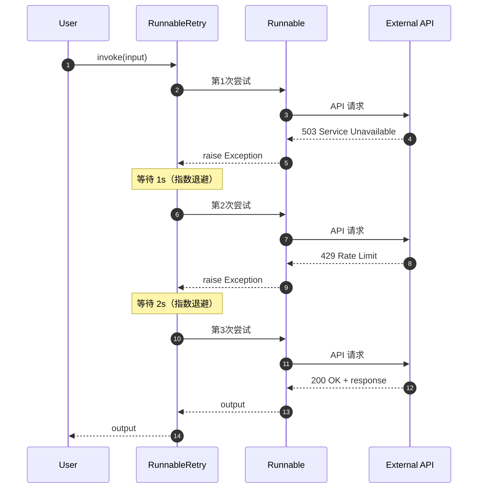

**图解说明**：

1. **重试策略**（步骤 2-11）：
   - 最大尝试次数：默认 3 次
   - 退避策略：指数退避 + 随机抖动
   - 可重试异常：可配置（默认所有）

2. **退避计算**：
   ```python
   wait_time = min(
       max_wait,
       base_wait * (2 ** (attempt - 1)) + random.uniform(0, jitter)
   )
   ```

3. **配置示例**：
   ```python
   chain = base_chain.with_retry(
       retry_if_exception_type=(HTTPError, TimeoutError),
       max_attempt_number=5,
       wait_exponential_jitter=True,
       stop_after_delay=60  # 60秒后停止重试
   )
   ```

**适用场景**：
- 网络请求不稳定
- 下游服务偶发错误
- 速率限制（Rate Limit）

**注意事项**：
- 确保操作幂等
- 设置合理的超时时间
- 记录重试次数（用于监控）

---

### 5.2 with_fallbacks 回退机制

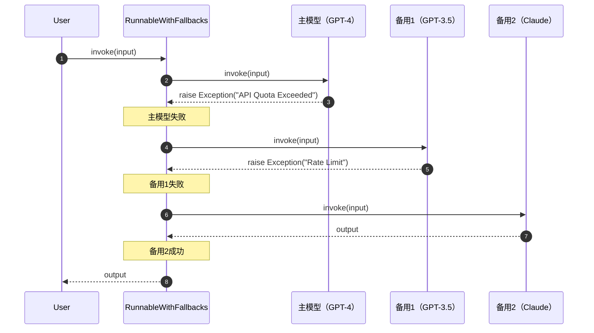

**图解说明**：

1. **回退链**（步骤 2-8）：
   - 按顺序尝试主模型和备用模型
   - 任一成功即返回
   - 全部失败抛出最后异常

2. **异常过滤**：
   ```python
   chain = primary_model.with_fallbacks(
       [backup_model1, backup_model2],
       exceptions_to_handle=(RateLimitError, QuotaError),
       exception_key="__exception__"  # 保留异常信息
   )
   ```

3. **异常记录**：
   - `exception_key` 指定的键存储前序异常
   - 用于分析失败原因
   - 不影响正常输出

**适用场景**：
- 多模型降级策略
- 高可用性需求
- 成本优化（主模型贵，备用便宜）

**最佳实践**：
- 主备模型功能对等
- 设置超时避免等待过久
- 监控回退触发频率

---

## 6. 配置化场景

### 6.1 bind 参数绑定

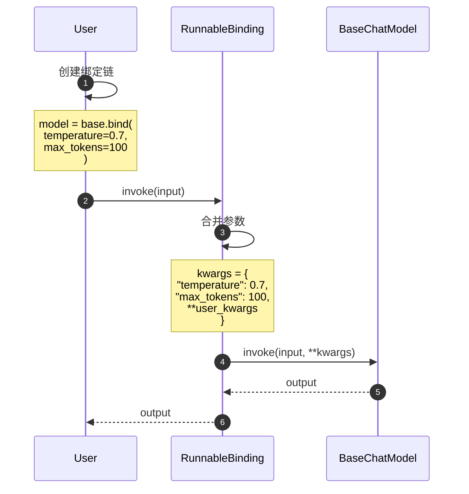

**图解说明**：

1. **参数合并**（步骤 3）：
   - 绑定参数作为默认值
   - 用户参数可覆盖
   - 支持嵌套合并（如 `model_kwargs`）

2. **应用示例**：
   ```python
   # 绑定温度参数
   creative_model = base_model.bind(temperature=0.9)
   factual_model = base_model.bind(temperature=0.1)

   # 绑定工具
   tool_calling_model = model.bind_tools([search_tool, calculator_tool])
   ```

**适用场景**：
- 固定部分参数
- 创建专用变体
- 工具绑定

---

### 6.2 configurable_fields 可配置字段

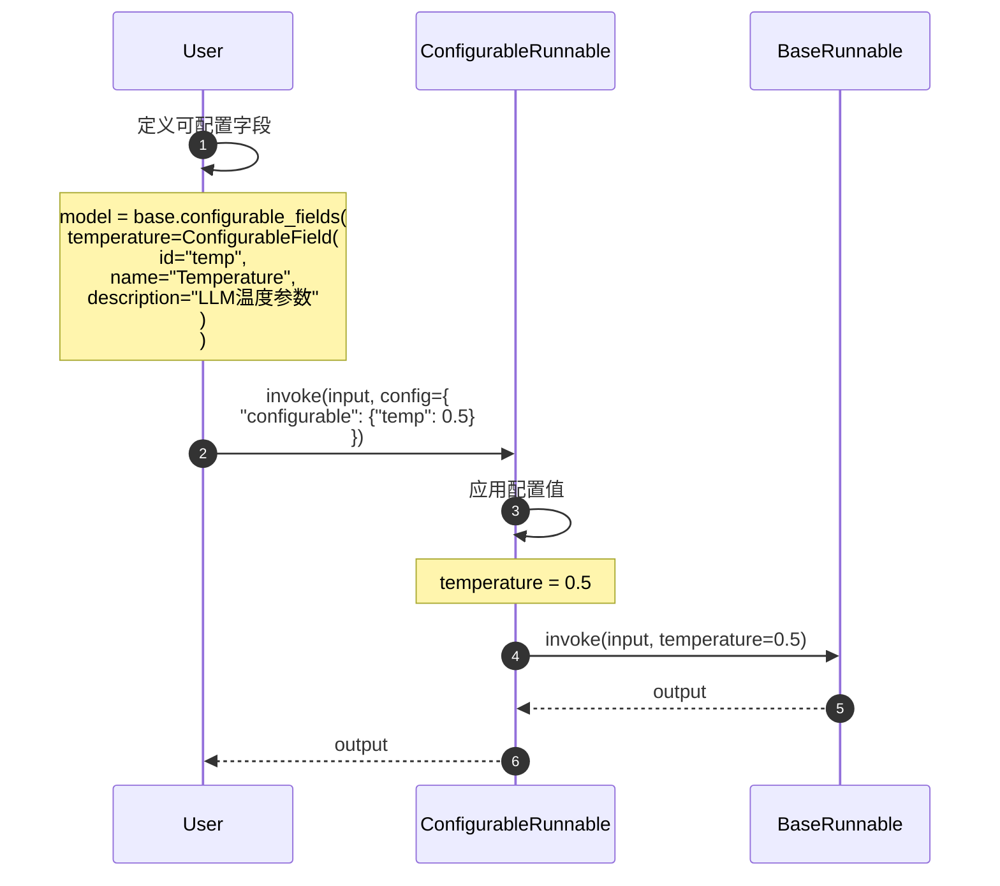

**图解说明**：

1. **动态配置**（步骤 2-5）：
   - 运行时指定参数值
   - 支持默认值
   - 类型验证

2. **应用示例**：
   ```python
   configurable_model = model.configurable_fields(
       temperature=ConfigurableField(id="temp", default=0.7),
       model_name=ConfigurableField(id="model", default="gpt-4")
   )

   # 使用不同配置
   output1 = configurable_model.invoke(
       input_data,
       config={"configurable": {"temp": 0.1, "model": "gpt-3.5-turbo"}}
   )
   ```

**适用场景**：
- A/B 测试
- 用户自定义参数
- 多租户配置

---

## 7. 性能分析场景

### 7.1 astream_log 执行追踪

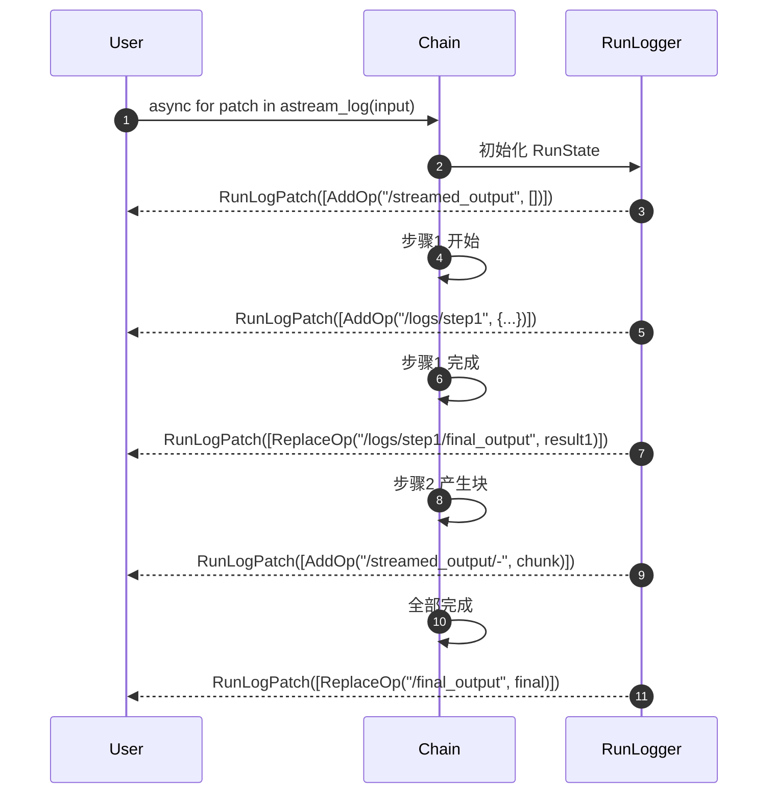

**图解说明**：

1. **增量更新**（步骤 2-9）：
   - 每个状态变更产生一个 Patch
   - Patch 包含操作列表（Add/Replace/Remove）
   - 客户端应用 Patch 重建状态

2. **路径格式**：
   - `/streamed_output/-`：数组末尾
   - `/logs/step1/final_output`：嵌套字段
   - 符合 JSON Pointer 规范（RFC 6901）

3. **应用示例**：
   ```python
   run_log = RunLog()

   async for patch in chain.astream_log(input_data):
       run_log = run_log.concat(patch)

       # 显示进度
       print(f"Progress: {len(run_log.state.logs)} steps completed")
   ```

**适用场景**：
- 实时调试界面
- 性能瓶颈分析
- 执行历史回放

---

## 8. 总结

本文档详细展示了 **Runnables 模块**在各种典型场景下的执行时序，包括：

1. **基础调用**：同步/异步 invoke 的完整流程
2. **批处理**：batch/abatch 的并发执行机制
3. **流式输出**：stream/astream_events 的实时数据流
4. **组合链**：顺序/并行/嵌套组合的执行逻辑
5. **错误处理**：重试和回退的恢复策略
6. **配置化**：参数绑定和动态配置的实现
7. **性能分析**：执行追踪和日志记录

每张时序图均包含：
- 详细的步骤编号和参与者
- 关键决策点和数据流转
- 边界条件和性能特征
- 实际应用示例和最佳实践

这些时序图帮助开发者深入理解 Runnables 的内部执行机制，为构建高性能、高可用的 LLM 应用提供指导。

