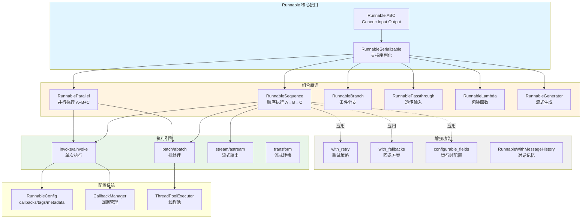

# LangChain-01-Runnables-概览

## 模块基本信息

**模块名称**: langchain-core-runnables
**模块路径**: `libs/core/langchain_core/runnables/`
**核心职责**: 提供 LangChain Expression Language (LCEL) 的核心实现，定义统一的可执行组件接口和组合原语

## 1. 模块职责

### 1.1 核心职责

Runnables 模块是 LangChain 框架的基石，提供以下核心能力：

1. **统一执行协议**: 定义 `Runnable` 抽象基类，所有可执行组件（模型、提示词、解析器等）都实现此接口
2. **LCEL 组合语法**: 通过 `|` 操作符和字典字面量实现声明式的组件组合
3. **多执行模式**: 自动支持同步（`invoke`）、异步（`ainvoke`）、批处理（`batch`）、流式（`stream`）
4. **组合原语**: 提供顺序执行（`RunnableSequence`）、并行执行（`RunnableParallel`）、条件分支（`RunnableBranch`）等组合模式
5. **增强功能**: 支持重试（`with_retry`）、回退（`with_fallbacks`）、配置化（`configurable_fields`）等

### 1.2 输入/输出

- **输入**: 泛型 `Input` 类型，由具体 Runnable 实现决定（如字符串、字典、消息列表等）
- **输出**: 泛型 `Output` 类型，由具体 Runnable 实现决定
- **配置**: 可选的 `RunnableConfig`，包含回调、标签、元数据、并发控制等

### 1.3 上下游依赖

**上游调用者**:
- 用户应用代码
- LangChain 主包中的 Chains、Agents
- 其他 Runnable 组件（组合场景）

**下游依赖**:
- `langchain_core.callbacks`: 回调系统，追踪执行过程
- `langchain_core.load`: 序列化与反序列化
- `langchain_core.tracers`: LangSmith 集成
- Python 标准库: `concurrent.futures`（线程池）、`asyncio`（异步执行）

### 1.4 生命周期

Runnable 本身是无状态的，生命周期简单：

1. **实例化**: 创建 Runnable 对象（如通过 `|` 组合）
2. **配置**: 可选地设置运行时配置（回调、标签等）
3. **执行**: 调用 `invoke`/`ainvoke`/`batch`/`stream` 方法
4. **回调触发**: 在执行前后触发 `on_chain_start`、`on_chain_end` 等回调
5. **结果返回**: 同步返回结果或通过生成器/异步生成器流式返回

无需显式释放资源，Python GC 自动管理。

## 2. 模块级架构图



### 架构图详细说明

**1. 核心接口层**

- **Runnable ABC**: 抽象基类，定义所有可执行组件的标准接口
  - 泛型参数 `Input` 和 `Output` 确保类型安全
  - 强制实现 `invoke` 方法，其他方法有默认实现
  - 通过 `InputType` 和 `OutputType` 属性推断类型

- **RunnableSerializable**: 继承自 `Runnable`，添加序列化能力
  - 实现 `to_json`、`save` 等方法
  - 支持持久化和跨进程传输

**2. 组合原语层**

- **RunnableSequence**: 链式顺序执行
  - 通过 `__or__` 运算符重载实现 `|` 语法
  - 优化：合并连续的 `RunnableSequence` 避免嵌套
  - 流式支持：如果所有步骤支持 `transform`，则整体支持流式

- **RunnableParallel**: 并发执行多个分支
  - 通过字典字面量自动创建（LCEL 语法糖）
  - 同步模式使用线程池，异步模式使用 `asyncio.gather`
  - 返回字典，键为分支名，值为各分支输出

- **RunnableBranch**: 条件路由
  - 根据输入选择执行哪个分支
  - 类似 if-elif-else 逻辑

- **RunnablePassthrough**: 透传输入
  - 用于并行场景中保留原始输入
  - 可选地执行赋值（`RunnableAssign`）

- **RunnableLambda**: 包装普通函数
  - 自动推断输入输出类型
  - 支持同步和异步函数
  - `@chain` 装饰器是其语法糖

- **RunnableGenerator**: 流式生成
  - 用于逐块产生输出的场景
  - 支持生成器和异步生成器

**3. 增强功能层**

这些不是独立的类，而是返回包装后 Runnable 的方法：

- **with_retry**: 返回带重试逻辑的 Runnable
  - 支持指数退避、最大重试次数等配置
  - 仅重试可恢复的错误

- **with_fallbacks**: 返回带回退方案的 Runnable
  - 主 Runnable 失败时尝试备选方案
  - 可指定多个回退模型

- **configurable_fields**: 返回可配置字段的 Runnable
  - 运行时动态修改 Runnable 的属性

- **RunnableWithMessageHistory**: 包装 Runnable 添加对话记忆
  - 自动管理历史消息的存储和检索

**4. 执行引擎层**

- **invoke/ainvoke**: 单次同步/异步执行
  - 触发 `on_chain_start` → 执行逻辑 → `on_chain_end` 回调
  - 异步版本默认使用 `run_in_executor` 委托给同步版本

- **batch/abatch**: 批量执行
  - 同步版本使用 `ThreadPoolExecutor.map`
  - 异步版本使用 `asyncio.gather`
  - 支持 `max_concurrency` 限制并发数
  - 支持 `return_exceptions` 返回异常而非抛出

- **stream/astream**: 流式输出
  - 基于 `transform` 方法实现
  - 逐块产生输出，减少首字节延迟
  - 异步版本通过 `astream_events` 提供更细粒度控制

- **transform**: 流式转换
  - 接收输入流（`Iterator`），产生输出流
  - 核心方法，其他流式方法基于此实现

**5. 配置系统**

- **RunnableConfig**: 配置字典
  - `callbacks`: 回调处理器列表
  - `tags`: 用于追踪的标签
  - `metadata`: 自定义元数据
  - `max_concurrency`: 批处理最大并发数
  - `recursion_limit`: 防止无限递归

- **CallbackManager**: 回调管理器
  - 聚合多个回调处理器
  - 在执行各阶段触发相应回调

- **ThreadPoolExecutor**: 线程池
  - 用于 `batch` 方法的并发执行
  - 默认最大工作线程数由系统决定

## 3. 边界条件与扩展点

### 3.1 边界条件

**并发限制**:
- `max_concurrency` 可限制批处理的并发线程数
- 默认无限制，可能导致资源耗尽
- 建议生产环境设置合理值（如 10-50）

**超时控制**:
- 框架本身不强制超时，由具体 Runnable 实现
- 可通过回调或包装 Runnable 添加超时逻辑

**递归深度**:
- `recursion_limit` 防止无限递归（默认 25）
- 主要用于自引用的 Runnable

**流式限制**:
- 并非所有 Runnable 都支持流式（需实现 `transform`）
- `RunnableLambda` 默认不支持流式，会阻塞直到完成
- 流式链中存在阻塞组件时，流式输出会延迟

### 3.2 扩展点

**自定义 Runnable**:
```python
from langchain_core.runnables import Runnable

class MyRunnable(Runnable[str, str]):
    def invoke(self, input: str, config: RunnableConfig = None) -> str:
        # 自定义逻辑
        return input.upper()

    # 可选：实现流式支持
    def transform(self, input: Iterator[str], config: RunnableConfig = None):
        for chunk in input:
            yield chunk.upper()
```

**自定义回调**:
```python
from langchain_core.callbacks import BaseCallbackHandler

class MyCallback(BaseCallbackHandler):
    def on_chain_start(self, serialized, inputs, **kwargs):
        print(f"Chain started with inputs: {inputs}")

    def on_chain_end(self, outputs, **kwargs):
        print(f"Chain ended with outputs: {outputs}")
```

## 4. 异常处理与状态管理

### 4.1 异常处理策略

**默认行为**:
- 执行过程中的异常会向上抛出
- 批处理中的异常默认中断整个批次

**with_retry**:
- 自动重试可恢复的异常（如网络错误）
- 不重试逻辑错误（如参数错误）

**with_fallbacks**:
- 主 Runnable 抛出异常时，尝试回退方案
- 所有回退都失败才抛出最后一个异常

**return_exceptions**:
- `batch` 方法可设置 `return_exceptions=True`
- 异常作为列表元素返回，而非中断

### 4.2 状态管理

**无状态设计**:
- Runnable 本身无状态，可安全并发执行
- 状态通过输入传递（如对话历史）

**有状态扩展**:
- `RunnableWithMessageHistory`: 自动管理对话历史
- 状态存储在外部（内存、数据库等）
- 通过 `session_id` 隔离不同会话

## 5. 性能特征

### 5.1 延迟分析

**单次执行（invoke）**:
- 延迟 = 各步骤延迟之和（顺序执行）
- 回调开销可忽略（纳秒级）

**批处理（batch）**:
- 延迟 = max(各输入的执行时间)（并行执行）
- 线程切换开销：微秒级
- 受 `max_concurrency` 影响

**流式（stream）**:
- 首字节延迟 = 第一个组件的首字节延迟
- 总延迟可能略高于 invoke（迭代开销）
- 优势在于用户体验（渐进式展示）

### 5.2 吞吐量

**同步模式**:
- 受 GIL 影响，CPU 密集型任务受限
- I/O 密集型任务（如 LLM API）可充分利用线程池

**异步模式**:
- 单线程事件循环，无 GIL 限制
- 更高的并发能力（数千并发请求）
- 需要底层 API 支持原生异步

### 5.3 内存占用

**顺序执行**:
- 内存占用 = 单个输入的内存占用
- 中间结果在步骤间传递，不累积

**并行执行**:
- 内存占用 = 并发数 × 单个输入的内存占用
- 批处理需要同时保存所有输入和输出

**流式执行**:
- 内存占用更小（逐块处理）
- 但需要保持连接状态

## 6. 最佳实践

### 6.1 组合模式选择

**优先使用 LCEL 语法**:
```python
# ✅ 推荐
chain = prompt | model | parser

# ❌ 不推荐
chain = RunnableSequence(prompt, model, parser)
```

**并行执行独立任务**:
```python
# ✅ 并发执行翻译和摘要
chain = {
    "translation": translation_chain,
    "summary": summary_chain
}
```

**条件路由**:
```python
from langchain_core.runnables import RunnableBranch

# 根据输入语言选择不同处理逻辑
branch = RunnableBranch(
    (lambda x: x["language"] == "en", english_chain),
    (lambda x: x["language"] == "zh", chinese_chain),
    default_chain  # 默认分支
)
```

### 6.2 性能优化

**批处理聚合请求**:
```python
# 一次调用处理多个输入
results = chain.batch([input1, input2, input3], config={"max_concurrency": 5})
```

**使用流式减少感知延迟**:
```python
# 逐块展示结果
for chunk in chain.stream(input):
    print(chunk, end="", flush=True)
```

**异步提升吞吐量**:
```python
# 高并发场景使用异步
results = await chain.abatch(inputs, config={"max_concurrency": 100})
```

### 6.3 错误处理

**添加重试策略**:
```python
chain_with_retry = chain.with_retry(
    stop_after_attempt=3,
    wait_exponential_jitter=True
)
```

**配置回退模型**:
```python
chain_with_fallbacks = primary_chain.with_fallbacks(
    [fallback_chain_1, fallback_chain_2]
)
```

### 6.4 调试与追踪

**启用详细日志**:
```python
from langchain_core.globals import set_debug, set_verbose

set_debug(True)  # 打印所有回调事件
set_verbose(True)  # 打印执行细节
```

**使用 LangSmith 追踪**:
```python
import os

os.environ["LANGCHAIN_TRACING_V2"] = "true"
os.environ["LANGCHAIN_API_KEY"] = "your-api-key"

# 自动追踪所有 Runnable 执行
chain.invoke(input)
```

**自定义回调监控**:
```python
class LatencyCallback(BaseCallbackHandler):
    def on_chain_start(self, serialized, inputs, **kwargs):
        self.start_time = time.time()

    def on_chain_end(self, outputs, **kwargs):
        latency = time.time() - self.start_time
        print(f"Latency: {latency:.2f}s")

chain.invoke(input, config={"callbacks": [LatencyCallback()]})
```

## 7. 与其他模块的协作

### 7.1 与 Language Models 协作

所有语言模型（`BaseChatModel`、`BaseLLM`）都实现 Runnable 接口：

```python
from langchain_openai import ChatOpenAI

model = ChatOpenAI()  # 本质是一个 Runnable
result = model.invoke("Hello")  # 统一的 invoke 接口
```

### 7.2 与 Prompts 协作

提示词模板也是 Runnable：

```python
from langchain_core.prompts import ChatPromptTemplate

prompt = ChatPromptTemplate.from_messages([...])
# 可以直接组合
chain = prompt | model
```

### 7.3 与 Output Parsers 协作

输出解析器同样实现 Runnable 接口：

```python
from langchain_core.output_parsers import StrOutputParser

parser = StrOutputParser()
chain = prompt | model | parser  # 三者无缝组合
```

### 7.4 与 Agents 协作

Agent 执行器内部使用 Runnable 组合推理链：

```python
# AgentExecutor 内部将 Agent 逻辑封装为 Runnable
agent_executor = AgentExecutor(agent=agent, tools=tools)
result = agent_executor.invoke({"input": "query"})  # 统一接口
```

## 8. 关键源码位置

| 功能 | 文件路径 | 核心类/函数 |
|------|----------|------------|
| 基础接口 | `runnables/base.py` | `Runnable`, `RunnableSerializable` |
| 顺序执行 | `runnables/base.py` | `RunnableSequence` |
| 并行执行 | `runnables/base.py` | `RunnableParallel` |
| 函数包装 | `runnables/base.py` | `RunnableLambda`, `@chain` |
| 条件分支 | `runnables/branch.py` | `RunnableBranch` |
| 透传输入 | `runnables/passthrough.py` | `RunnablePassthrough`, `RunnableAssign` |
| 重试逻辑 | `runnables/retry.py` | `RunnableRetry` |
| 回退方案 | `runnables/fallbacks.py` | `RunnableWithFallbacks` |
| 配置系统 | `runnables/config.py` | `RunnableConfig`, `ensure_config` |
| 对话记忆 | `runnables/history.py` | `RunnableWithMessageHistory` |
| 路由选择 | `runnables/router.py` | `RouterRunnable` |

## 9. 总结

Runnables 模块是 LangChain 的核心抽象，通过以下设计实现高度的可组合性和灵活性：

1. **统一接口**: 所有组件实现相同的 `Runnable` 接口，可无缝组合
2. **声明式语法**: LCEL 提供简洁的 `|` 和字典语法，表达力强
3. **自动优化**: 批处理、流式等特性自动支持，无需额外代码
4. **类型安全**: 泛型和类型推断确保编译时类型检查
5. **可扩展**: 易于添加自定义 Runnable 和回调

这种设计使得构建复杂的 LLM 应用变得简单直观，同时保持了高性能和可维护性。

---

**文档版本**: v1.0
**最后更新**: 2025-10-03
**相关文档**:
- LangChain-00-总览.md
- LangChain-02-Runnables-API.md（待生成）
- LangChain-03-Runnables-数据结构.md（待生成）
- LangChain-04-Runnables-时序图.md（待生成）

