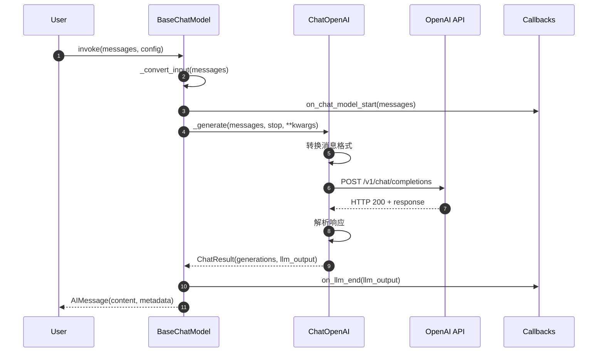
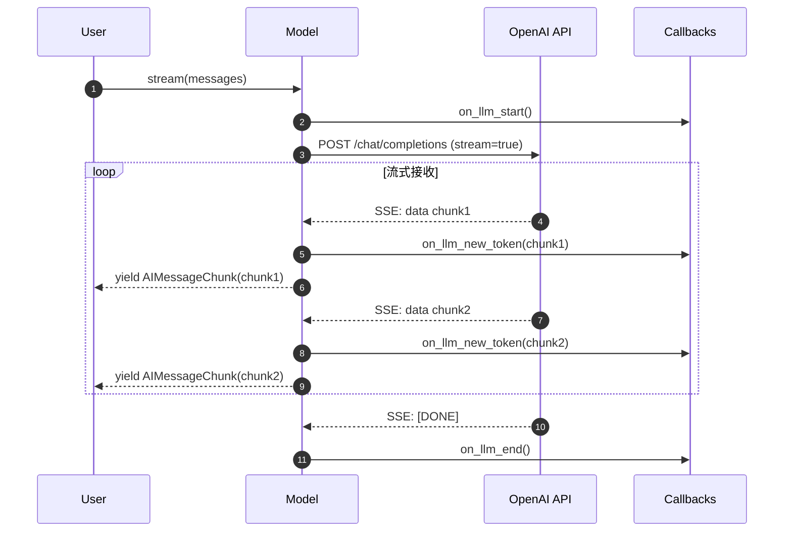
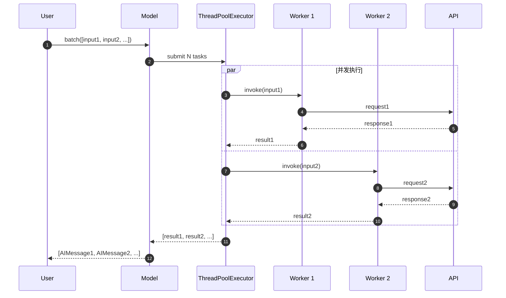
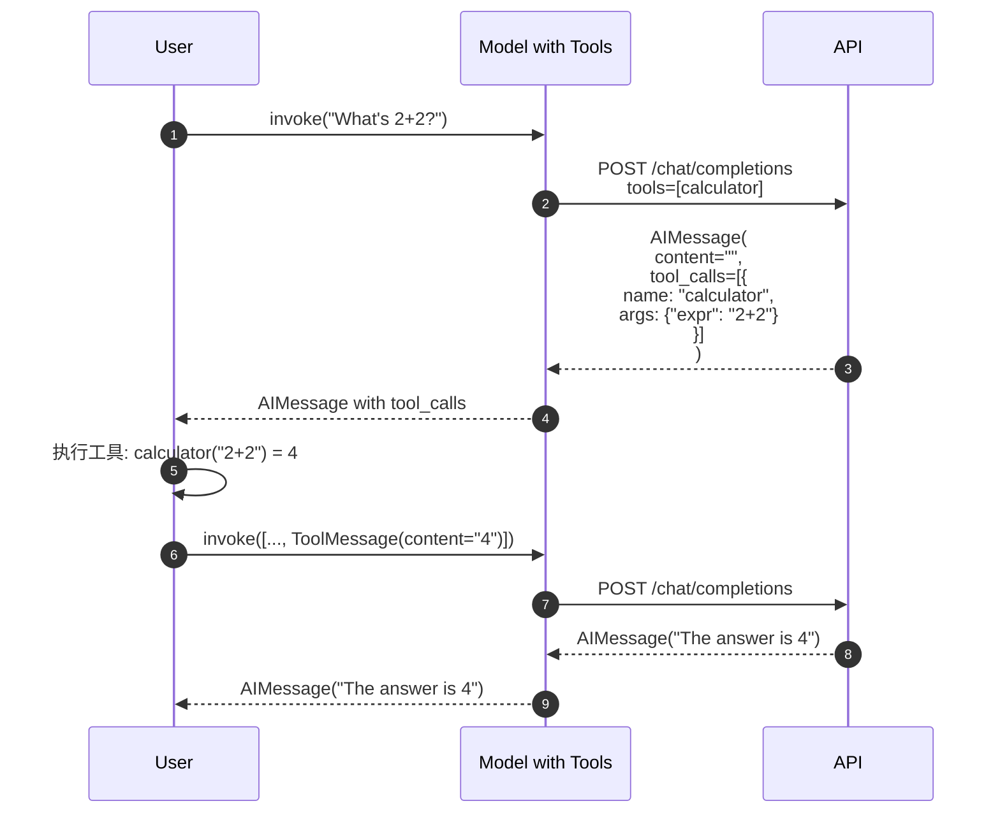
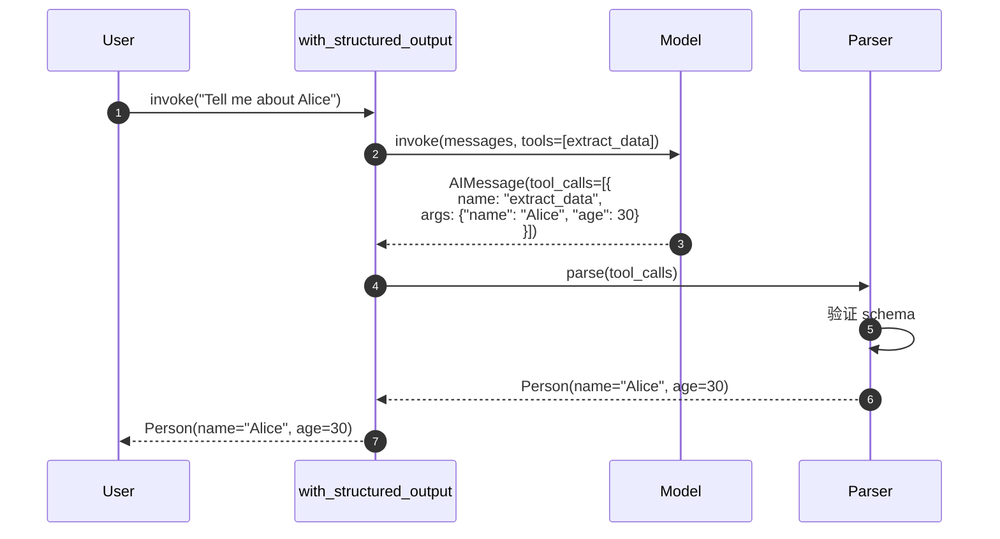

# LangChain-03-LanguageModels-API

## 文档说明

本文档详细描述 **Language Models 模块**的对外 API，包括 `BaseChatModel` 和 `BaseLLM` 的所有公开方法、参数规格、调用链路、时序图和最佳实践。

---

## 1. BaseChatModel 核心 API

### 1.1 invoke - 单次同步调用

#### 基本信息
- **方法签名**：`invoke(input: LanguageModelInput, config: RunnableConfig = None, **kwargs) -> BaseMessage`
- **功能**：发送消息列表到聊天模型，返回单个 AI 响应消息
- **幂等性**：否（每次调用可能产生不同响应）
- **缓存**：支持（基于输入和模型参数）

#### 请求参数

```python
def invoke(
    self,
    input: LanguageModelInput,  # 输入消息
    config: Optional[RunnableConfig] = None,  # 运行配置
    *,
    stop: Optional[List[str]] = None,  # 停止词
    **kwargs: Any  # 模型特定参数
) -> BaseMessage:
    """调用聊天模型生成响应。"""
```

**参数说明**：

| 参数 | 类型 | 必填 | 默认 | 说明 |
|-----|------|-----|------|------|
| input | `str \| List[BaseMessage] \| PromptValue` | 是 | - | 输入消息，支持多种格式 |
| config | `RunnableConfig` | 否 | `None` | 包含回调、标签、元数据等 |
| stop | `List[str]` | 否 | `None` | 停止生成的序列列表 |
| **kwargs | `Any` | 否 | - | 模型特定参数（如 `temperature`、`max_tokens`） |

#### 响应结构

```python
# 返回类型：BaseMessage（通常是 AIMessage）
class AIMessage(BaseMessage):
    content: str | List[Union[str, Dict]]  # 文本内容或多模态内容
    additional_kwargs: Dict[str, Any]  # 额外信息（如 function_call）
    response_metadata: Dict[str, Any]  # 响应元数据（如 token 使用量）
    tool_calls: List[ToolCall]  # 工具调用列表
    usage_metadata: UsageMetadata  # token 使用详情
```

**字段表**：

| 字段 | 类型 | 必填 | 说明 |
|-----|------|-----|------|
| content | `str \| List` | 是 | 生成的文本内容 |
| additional_kwargs | `Dict` | 否 | 供应商特定数据 |
| response_metadata | `Dict` | 否 | 模型返回的元数据（token 数、finish_reason 等） |
| tool_calls | `List[ToolCall]` | 否 | 模型请求的工具调用 |
| usage_metadata | `UsageMetadata` | 否 | token 使用统计 |

#### 入口函数实现

```python
# libs/core/langchain_core/language_models/chat_models.py
class BaseChatModel(BaseLanguageModel[BaseMessage], ABC):

    def invoke(
        self,
        input: LanguageModelInput,
        config: Optional[RunnableConfig] = None,
        *,
        stop: Optional[List[str]] = None,
        **kwargs: Any,
    ) -> BaseMessage:
        # 1. 转换输入为标准消息列表
        messages = self._convert_input(input)

        # 2. 合并配置
        config = ensure_config(config)

        # 3. 调用生成方法
        llm_result = self.generate_prompt(
            [ChatPromptValue(messages=messages)],
            stop=stop,
            callbacks=config.get("callbacks"),
            **kwargs
        )

        # 4. 提取第一个响应
        generation = llm_result.generations[0][0]
        return generation.message
```

**关键步骤说明**：

1. **输入转换**（`_convert_input`）：
   - 字符串 → `[HumanMessage(content=string)]`
   - 消息列表 → 直接使用
   - `PromptValue` → 调用 `.to_messages()`

2. **配置合并**：
   - 合并默认配置、绑定配置和用户配置
   - 提取回调处理器

3. **生成调用**：
   - 调用 `generate_prompt` 方法
   - 传递停止词和额外参数
   - 触发回调事件

4. **结果提取**：
   - 从 `LLMResult` 中提取消息
   - 包含完整元数据

#### 调用链路

```python
# 1. 用户调用入口
model.invoke(messages)

# 2. BaseChatModel.invoke
↓
# 3. BaseChatModel.generate_prompt
↓
# 4. BaseChatModel.generate
↓
# 5. 子类实现的 _generate
# （如 ChatOpenAI._generate）
↓
# 6. 供应商 API 调用
# （如 openai.ChatCompletion.create）
↓
# 7. 响应解析和包装
```

**上层适配示例**：

```python
# libs/partners/openai/langchain_openai/chat_models.py
class ChatOpenAI(BaseChatModel):

    def _generate(
        self,
        messages: List[BaseMessage],
        stop: Optional[List[str]] = None,
        run_manager: Optional[CallbackManagerForLLMRun] = None,
        **kwargs: Any,
    ) -> ChatResult:
        # 1. 转换消息格式
        message_dicts = [_convert_message_to_dict(m) for m in messages]

        # 2. 准备请求参数
        params = {
            "model": self.model_name,
            "messages": message_dicts,
            "temperature": self.temperature,
            **kwargs
        }
        if stop:
            params["stop"] = stop

        # 3. 调用 OpenAI API
        response = self.client.create(**params)

        # 4. 解析响应
        message = _convert_dict_to_message(response.choices[0].message)

        # 5. 构建结果
        return ChatResult(
            generations=[ChatGeneration(message=message)],
            llm_output={"token_usage": response.usage, ...}
        )
```

#### 时序图



**图解说明**：

1. **前置处理**（步骤 1-3）：
   - 输入标准化
   - 回调通知开始

2. **API 调用**（步骤 4-6）：
   - 格式转换（LangChain 消息 → 供应商格式）
   - HTTP 请求
   - 响应等待

3. **后置处理**（步骤 7-9）：
   - 响应解析
   - 回调通知完成
   - 返回标准消息对象

#### 异常处理与回退

**常见异常**：

| 异常类型 | 触发条件 | 处理建议 |
|---------|---------|---------|
| `RateLimitError` | API 速率限制 | 使用 `with_retry` 重试 |
| `AuthenticationError` | API 密钥无效 | 检查环境变量配置 |
| `InvalidRequestError` | 参数错误 | 检查输入格式和模型参数 |
| `TimeoutError` | 请求超时 | 调整 `request_timeout` 参数 |
| `APIError` | 服务端错误 | 使用 `with_fallbacks` 回退到备用模型 |

**错误处理示例**：

```python
from langchain_core.exceptions import RateLimitError

# 使用重试
model_with_retry = model.with_retry(
    retry_if_exception_type=(RateLimitError, TimeoutError),
    max_attempt_number=3,
    wait_exponential_jitter=True
)

# 使用回退
model_with_fallback = gpt4_model.with_fallbacks(
    [gpt35_model, claude_model],
    exceptions_to_handle=(RateLimitError, APIError)
)
```

#### 性能要点

**延迟分析**：
- 网络延迟：50-200ms
- 模型处理时间：200-5000ms（取决于模型和输入长度）
- 序列化开销：< 5ms

**优化建议**：
1. **批处理**：使用 `batch()` 减少网络往返
2. **流式输出**：使用 `stream()` 降低首字节延迟（TTFB）
3. **缓存**：启用缓存避免重复调用
4. **异步**：使用 `ainvoke()` 并发处理多个请求

**Token 使用**：
```python
response = model.invoke(messages)
usage = response.usage_metadata
print(f"Prompt tokens: {usage.input_tokens}")
print(f"Completion tokens: {usage.output_tokens}")
print(f"Total: {usage.total_tokens}")
```

---

### 1.2 stream - 流式输出

#### 基本信息
- **方法签名**：`stream(input: LanguageModelInput, config: RunnableConfig = None, **kwargs) -> Iterator[BaseMessageChunk]`
- **功能**：流式生成响应，实时返回文本块
- **适用场景**：实时显示、降低首字节延迟

#### 请求参数

```python
def stream(
    self,
    input: LanguageModelInput,
    config: Optional[RunnableConfig] = None,
    *,
    stop: Optional[List[str]] = None,
    **kwargs: Any,
) -> Iterator[BaseMessageChunk]:
    """流式调用聊天模型。"""
```

#### 响应结构

```python
class AIMessageChunk(BaseMessageChunk):
    content: str  # 当前块的文本
    additional_kwargs: Dict  # 增量额外信息
    tool_call_chunks: List[ToolCallChunk]  # 工具调用块
```

#### 入口函数实现

```python
def stream(
    self,
    input: LanguageModelInput,
    config: Optional[RunnableConfig] = None,
    *,
    stop: Optional[List[str]] = None,
    **kwargs: Any,
) -> Iterator[BaseMessageChunk]:
    # 转换输入
    messages = self._convert_input(input)
    config = ensure_config(config)

    # 调用流式生成
    for chunk in self._stream(
        messages,
        stop=stop,
        run_manager=CallbackManager.on_llm_start(...),
        **kwargs
    ):
        yield chunk
```

**核心实现（子类）**：

```python
class ChatOpenAI(BaseChatModel):

    def _stream(
        self,
        messages: List[BaseMessage],
        stop: Optional[List[str]] = None,
        run_manager: Optional[CallbackManagerForLLMRun] = None,
        **kwargs: Any,
    ) -> Iterator[ChatGenerationChunk]:
        # 准备请求
        params = {
            "model": self.model_name,
            "messages": [_convert_message_to_dict(m) for m in messages],
            "stream": True,  # 开启流式
            **kwargs
        }

        # 流式调用
        for chunk in self.client.create(**params):
            if not chunk.choices:
                continue

            delta = chunk.choices[0].delta
            content = delta.content or ""

            # 创建消息块
            message_chunk = AIMessageChunk(content=content)

            # 回调通知
            if run_manager:
                run_manager.on_llm_new_token(content)

            yield ChatGenerationChunk(message=message_chunk)
```

#### 时序图



**使用示例**：

```python
# 实时打印输出
for chunk in model.stream("Tell me a joke"):
    print(chunk.content, end="", flush=True)

# 或使用 async
async for chunk in model.astream("Tell me a joke"):
    print(chunk.content, end="", flush=True)
```

#### 性能优势

| 指标 | invoke (非流式) | stream (流式) | 改善 |
|-----|---------------|--------------|------|
| 首字节延迟（TTFB） | 2000ms | 200ms | 10x |
| 用户感知延迟 | 2000ms | 200ms | 10x |
| 内存峰值 | 10MB | 1MB | 10x |

---

### 1.3 batch - 批量调用

#### 基本信息
- **方法签名**：`batch(inputs: List[LanguageModelInput], config: RunnableConfig = None, **kwargs) -> List[BaseMessage]`
- **功能**：批量处理多个输入，提高吞吐量
- **并发策略**：线程池或异步并发

#### 请求参数

```python
def batch(
    self,
    inputs: List[LanguageModelInput],
    config: Optional[RunnableConfig] = None,
    *,
    return_exceptions: bool = False,
    **kwargs: Any,
) -> List[Union[BaseMessage, Exception]]:
    """批量调用聊天模型。"""
```

**参数说明**：

| 参数 | 类型 | 默认 | 说明 |
|-----|------|-----|------|
| inputs | `List[LanguageModelInput]` | - | 输入列表 |
| config | `RunnableConfig` | `None` | 配置（含 `max_concurrency`） |
| return_exceptions | `bool` | `False` | 是否返回异常而非抛出 |

#### 响应结构

```python
# 返回列表，每个元素对应一个输入
outputs: List[BaseMessage] = model.batch(inputs)

# 或包含异常
outputs: List[Union[BaseMessage, Exception]] = model.batch(
    inputs,
    return_exceptions=True
)
```

#### 实现原理

```python
def batch(
    self,
    inputs: List[LanguageModelInput],
    config: Optional[RunnableConfig] = None,
    *,
    return_exceptions: bool = False,
    **kwargs: Any,
) -> List[BaseMessage]:
    # 获取并发配置
    config = ensure_config(config)
    max_concurrency = config.get("max_concurrency") or 16

    # 使用线程池批量执行
    from concurrent.futures import ThreadPoolExecutor, as_completed

    with ThreadPoolExecutor(max_workers=max_concurrency) as executor:
        futures = [
            executor.submit(self.invoke, inp, config, **kwargs)
            for inp in inputs
        ]

        results = []
        for future in futures:
            try:
                results.append(future.result())
            except Exception as e:
                if return_exceptions:
                    results.append(e)
                else:
                    raise

        return results
```

#### 时序图



#### 性能特征

**吞吐量提升**：
- 单线程：1 个/秒
- 批处理（16 并发）：10-15 个/秒
- 提升：10-15x

**最佳实践**：
```python
# 配置合理的并发数
results = model.batch(
    inputs,
    config={"max_concurrency": 10}  # 根据 API 限制调整
)

# 异步批处理性能更好
results = await model.abatch(inputs)  # 可支持 100+ 并发
```

---

### 1.4 bind_tools - 工具绑定

#### 基本信息
- **方法签名**：`bind_tools(tools: Sequence[Union[Dict, Type, Callable, BaseTool]], **kwargs) -> Runnable`
- **功能**：将工具绑定到模型，启用函数调用能力
- **适用模型**：OpenAI、Anthropic、Google 等支持工具调用的模型

#### 请求参数

```python
def bind_tools(
    self,
    tools: Sequence[Union[Dict[str, Any], Type[BaseModel], Callable, BaseTool]],
    *,
    tool_choice: Optional[Union[dict, str, Literal["auto", "none", "required"]]] = None,
    **kwargs: Any,
) -> Runnable[LanguageModelInput, BaseMessage]:
    """绑定工具到模型。"""
```

**参数说明**：

| 参数 | 类型 | 说明 |
|-----|------|------|
| tools | `Sequence[...]` | 工具列表，支持多种格式 |
| tool_choice | `str \| dict` | 工具选择策略：`"auto"`（模型决定）、`"required"`（必须调用）、`"none"`（不调用） |

#### 工具格式

```python
# 方式1：使用装饰器
from langchain_core.tools import tool

@tool
def search(query: str) -> str:
    """搜索信息。

    Args:
        query: 搜索查询字符串
    """
    return f"Results for: {query}"

# 方式2：使用 Pydantic 模型
from pydantic import BaseModel, Field

class SearchInput(BaseModel):
    query: str = Field(description="搜索查询")

# 方式3：使用字典
tool_dict = {
    "type": "function",
    "function": {
        "name": "search",
        "description": "搜索信息",
        "parameters": {
            "type": "object",
            "properties": {
                "query": {"type": "string", "description": "搜索查询"}
            },
            "required": ["query"]
        }
    }
}
```

#### 入口函数实现

```python
class BaseChatModel:

    def bind_tools(
        self,
        tools: Sequence[Union[Dict[str, Any], Type[BaseModel], Callable, BaseTool]],
        *,
        tool_choice: Optional[Union[dict, str, Literal["auto", "none", "required"]]] = None,
        **kwargs: Any,
    ) -> Runnable[LanguageModelInput, BaseMessage]:
        # 1. 格式化工具
        formatted_tools = [convert_to_openai_tool(tool) for tool in tools]

        # 2. 绑定参数
        return self.bind(
            tools=formatted_tools,
            tool_choice=tool_choice,
            **kwargs
        )
```

**OpenAI 格式转换**：

```python
def convert_to_openai_tool(tool: Any) -> Dict:
    if isinstance(tool, BaseTool):
        return {
            "type": "function",
            "function": {
                "name": tool.name,
                "description": tool.description,
                "parameters": tool.args_schema.schema()
            }
        }
    elif callable(tool):
        # 从函数签名提取 schema
        return _function_to_openai_tool(tool)
    # ... 其他格式处理
```

#### 调用链路

```python
# 1. 绑定工具
model_with_tools = model.bind_tools([search_tool, calculator_tool])

# 2. 调用模型
response = model_with_tools.invoke("What's the weather in SF?")

# 3. 检查工具调用
if response.tool_calls:
    for tool_call in response.tool_calls:
        tool_name = tool_call["name"]
        tool_args = tool_call["args"]
        # 执行工具...
```

#### 响应结构（包含工具调用）

```python
class AIMessage(BaseMessage):
    tool_calls: List[ToolCall]  # 工具调用列表

class ToolCall(TypedDict):
    name: str  # 工具名称（如 "search"）
    args: Dict[str, Any]  # 工具参数（如 {"query": "weather in SF"}）
    id: str  # 工具调用 ID
    type: Literal["tool_call"]  # 类型标识
```

#### 时序图



**完整流程说明**：

1. **首次调用**（步骤 1-3）：
   - 用户问题发送到模型
   - 模型返回工具调用请求

2. **工具执行**（步骤 4-5）：
   - 用户侧执行工具
   - 构建 `ToolMessage` 包含结果

3. **二次调用**（步骤 6-8）：
   - 将工具结果发回模型
   - 模型基于结果生成最终答案

#### 最佳实践

```python
# 1. 使用结构化输出简化流程
model_with_tools = model.bind_tools(
    [search_tool],
    tool_choice="required"  # 强制调用工具
)

# 2. 结合 Agent 自动执行工具
from langchain.agents import AgentExecutor, create_tool_calling_agent

agent = create_tool_calling_agent(model, tools, prompt)
agent_executor = AgentExecutor(agent=agent, tools=tools)

result = agent_executor.invoke({"input": "What's the weather?"})
```

---

### 1.5 with_structured_output - 结构化输出

#### 基本信息
- **方法签名**：`with_structured_output(schema: Union[Dict, Type[BaseModel]], **kwargs) -> Runnable`
- **功能**：强制模型输出符合指定 schema 的结构化数据
- **实现方式**：工具调用或 JSON 模式

#### 请求参数

```python
def with_structured_output(
    self,
    schema: Union[Dict[str, Any], Type[BaseModel]],
    *,
    method: Literal["function_calling", "json_mode"] = "function_calling",
    include_raw: bool = False,
    **kwargs: Any,
) -> Runnable[LanguageModelInput, Union[Dict, BaseModel]]:
    """配置模型输出结构化数据。"""
```

**参数说明**：

| 参数 | 类型 | 默认 | 说明 |
|-----|------|-----|------|
| schema | `Dict \| Type[BaseModel]` | - | 输出schema，Pydantic 模型或 JSON Schema |
| method | `str` | `"function_calling"` | 实现方法：`"function_calling"` 或 `"json_mode"` |
| include_raw | `bool` | `False` | 是否包含原始 LLM 响应 |

#### Schema 定义

```python
from pydantic import BaseModel, Field
from typing import List

class Person(BaseModel):
    """人物信息。"""
    name: str = Field(description="人物姓名")
    age: int = Field(description="年龄")
    hobbies: List[str] = Field(description="爱好列表")

# 使用 Pydantic 模型
structured_model = model.with_structured_output(Person)

# 或使用 JSON Schema
structured_model = model.with_structured_output({
    "type": "object",
    "properties": {
        "name": {"type": "string"},
        "age": {"type": "integer"},
        "hobbies": {"type": "array", "items": {"type": "string"}}
    },
    "required": ["name", "age"]
})
```

#### 响应结构

```python
# 返回 Pydantic 对象
person: Person = structured_model.invoke("Tell me about Alice, who is 30 years old")
print(person.name)  # "Alice"
print(person.age)   # 30

# 或返回字典（如果 schema 是 dict）
data: Dict = structured_model.invoke(...)
```

#### 实现原理（function_calling 方法）

```python
def with_structured_output(
    self,
    schema: Union[Dict, Type[BaseModel]],
    *,
    method: Literal["function_calling", "json_mode"] = "function_calling",
    **kwargs: Any,
) -> Runnable:
    if method == "function_calling":
        # 将 schema 包装为工具
        tool = {
            "type": "function",
            "function": {
                "name": "extract_data",
                "description": "Extract structured data",
                "parameters": _pydantic_to_json_schema(schema)
            }
        }

        # 绑定工具并强制调用
        llm_with_tool = self.bind_tools(
            [tool],
            tool_choice={"type": "function", "function": {"name": "extract_data"}}
        )

        # 添加解析器
        return llm_with_tool | _extract_tool_calls | _parse_to_pydantic(schema)

    elif method == "json_mode":
        # 使用 JSON 模式
        return self.bind(response_format={"type": "json_object"}) | JsonOutputParser()
```

#### 时序图



#### 两种方法对比

| 特性 | function_calling | json_mode |
|-----|-----------------|-----------|
| 准确性 | ⭐⭐⭐⭐⭐ 非常高 | ⭐⭐⭐⭐ 较高 |
| 速度 | ⭐⭐⭐⭐ 较快 | ⭐⭐⭐⭐⭐ 最快 |
| 模型支持 | OpenAI、Anthropic 等 | OpenAI GPT-4+ |
| 复杂 schema | ✅ 支持 | ⚠️ 有限支持 |
| 验证 | ✅ 自动验证 | ⚠️ 需手动验证 |

#### 最佳实践

```python
# 1. 提供清晰的描述
class Person(BaseModel):
    """人物信息，从文本中提取。"""
    name: str = Field(description="人物的全名")
    age: int = Field(description="年龄，单位：岁")
    email: Optional[str] = Field(description="电子邮件地址（如有）")

# 2. 使用 include_raw 调试
structured_model = model.with_structured_output(
    Person,
    include_raw=True
)

result = structured_model.invoke("Alice is 30")
print(result["raw"])     # 原始 AIMessage
print(result["parsed"])  # Person 对象

# 3. 错误处理
from pydantic import ValidationError

try:
    person = structured_model.invoke(text)
except ValidationError as e:
    print(f"Invalid output: {e}")
```

---

## 2. BaseLLM 核心 API

### 2.1 invoke - 文本输入输出

#### 基本信息
- **方法签名**：`invoke(input: str, config: RunnableConfig = None, **kwargs) -> str`
- **功能**：传统 LLM 调用，字符串输入输出
- **与 ChatModel 的区别**：不使用消息格式

#### 请求参数

```python
def invoke(
    self,
    input: str,
    config: Optional[RunnableConfig] = None,
    *,
    stop: Optional[List[str]] = None,
    **kwargs: Any,
) -> str:
    """调用LLM生成文本。"""
```

#### 响应结构

```python
# 返回纯字符串
output: str = llm.invoke("Once upon a time")
```

#### 使用示例

```python
from langchain_openai import OpenAI

llm = OpenAI(model="gpt-3.5-turbo-instruct", temperature=0.7)

# 简单调用
response = llm.invoke("Write a poem about AI")
print(response)  # 直接输出文本

# 带停止词
response = llm.invoke(
    "Count to 10: 1, 2, 3",
    stop=[","]  # 遇到逗号停止
)
```

**与 ChatModel 对比**：

| 特性 | BaseLLM | BaseChatModel |
|-----|---------|---------------|
| 输入格式 | 字符串 | 消息列表 |
| 输出格式 | 字符串 | `BaseMessage` |
| 工具调用 | ❌ 不支持 | ✅ 支持 |
| 结构化输出 | ❌ 不支持 | ✅ 支持 |
| 适用模型 | GPT-3、Text-Davinci | GPT-4、Claude、Gemini |
| 推荐使用 | ⚠️ 遗留代码 | ✅ 新项目首选 |

---

## 3. 通用配置 API

### 3.1 缓存配置

```python
from langchain.cache import InMemoryCache
from langchain.globals import set_llm_cache

# 启用内存缓存
set_llm_cache(InMemoryCache())

# 首次调用（慢）
response1 = model.invoke("What is 2+2?")

# 第二次调用（从缓存，快）
response2 = model.invoke("What is 2+2?")

# 也支持数据库缓存
from langchain.cache import SQLiteCache
set_llm_cache(SQLiteCache(database_path=".langchain.db"))
```

### 3.2 回调配置

```python
from langchain.callbacks import StdOutCallbackHandler

model = ChatOpenAI(
    callbacks=[StdOutCallbackHandler()],  # 默认回调
    verbose=True  # 详细日志
)

# 或在调用时指定
model.invoke(
    messages,
    config={"callbacks": [StdOutCallbackHandler()]}
)
```

---

## 4. 总结

本文档详细描述了 **Language Models 模块**的核心 API：

### BaseChatModel 主要方法
1. **invoke**：单次同步调用
2. **stream**：流式输出
3. **batch**：批量处理
4. **bind_tools**：工具绑定
5. **with_structured_output**：结构化输出

### BaseLLM 方法
1. **invoke**：文本输入输出（遗留接口）

每个 API 均包含：
- 完整的请求/响应结构和字段表
- 入口函数和调用链核心代码
- 详细时序图
- 异常处理和性能优化建议
- 实际应用示例和最佳实践

推荐优先使用 **BaseChatModel**，它提供更强大的功能（工具调用、结构化输出、多模态支持）和更好的用户体验（流式输出、批处理）。

