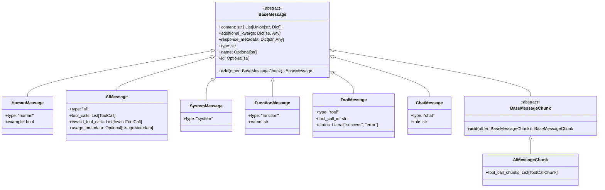

# LangChain-03-LanguageModels-数据结构

## 文档说明

本文档详细描述 **Language Models 模块**的核心数据结构，包括消息类型、生成结果、工具调用、Token 使用统计等。所有结构均配备 UML 类图和详细的字段说明。

---

## 1. 消息体系类层次

### 1.1 消息类 UML



**图解说明**：

1. **消息角色**：
   - `HumanMessage`：用户输入
   - `AIMessage`：AI 响应
   - `SystemMessage`：系统提示
   - `ToolMessage`：工具执行结果
   - `FunctionMessage`：函数调用结果（遗留）

2. **流式消息**：
   - `BaseMessageChunk`：流式消息块基类
   - 支持 `+` 操作符合并块

3. **类型标识**：
   - `type` 字段用于序列化和反序列化
   - 区分不同消息类型

---

## 2. BaseMessage 核心字段

### 2.1 字段详解

```python
class BaseMessage(Serializable):
    """所有消息的基类。"""

    content: Union[str, List[Union[str, Dict[str, Any]]]]
    additional_kwargs: Dict[str, Any]
    response_metadata: Dict[str, Any]
    type: str
    name: Optional[str]
    id: Optional[str]
```

**字段表**：

| 字段 | 类型 | 必填 | 默认 | 说明 |
|-----|------|-----|------|------|
| content | `str \| List` | 是 | - | 消息内容，支持文本或多模态 |
| additional_kwargs | `Dict` | 否 | `{}` | 供应商特定数据（如 OpenAI 的 `function_call`） |
| response_metadata | `Dict` | 否 | `{}` | 响应元数据（token 使用、模型版本等） |
| type | `str` | 是 | - | 消息类型标识（`"human"`, `"ai"` 等） |
| name | `str` | 否 | `None` | 消息发送者名称 |
| id | `str` | 否 | 自动生成 | 消息唯一标识符 |

**content 字段详解**：

```python
# 1. 纯文本
message = HumanMessage(content="Hello")

# 2. 多模态（文本 + 图片）
message = HumanMessage(content=[
    {"type": "text", "text": "What's in this image?"},
    {"type": "image_url", "image_url": {"url": "https://..."}}
])

# 3. 结构化内容
message = AIMessage(content=[
    {"type": "text", "text": "The image shows"},
    {"type": "tool_use", "id": "123", "name": "analyze"}
])
```

---

### 2.2 AIMessage 扩展字段

```python
class AIMessage(BaseMessage):
    """AI 生成的消息。"""

    tool_calls: List[ToolCall] = []
    invalid_tool_calls: List[InvalidToolCall] = []
    usage_metadata: Optional[UsageMetadata] = None
```

**扩展字段表**：

| 字段 | 类型 | 说明 |
|-----|------|------|
| tool_calls | `List[ToolCall]` | 有效的工具调用列表 |
| invalid_tool_calls | `List[InvalidToolCall]` | 解析失败的工具调用 |
| usage_metadata | `UsageMetadata` | Token 使用统计 |

---

## 3. 工具调用数据结构

### 3.1 ToolCall 结构


**字段说明**：

#### ToolCall

| 字段 | 类型 | 说明 | 示例 |
|-----|------|------|------|
| name | `str` | 工具名称 | `"web_search"` |
| args | `Dict` | 工具参数 | `{"query": "weather"}` |
| id | `str` | 工具调用唯一 ID | `"call_abc123"` |
| type | `Literal` | 类型标识 | `"tool_call"` |

#### InvalidToolCall

| 字段 | 类型 | 说明 |
|-----|------|------|
| name | `Optional[str]` | 部分解析的工具名 |
| args | `Optional[str]` | 原始参数字符串（未解析） |
| id | `Optional[str]` | ID（如有） |
| error | `Optional[str]` | 错误信息 |

**使用示例**：

```python
response = model_with_tools.invoke("Search for Python tutorials")

if response.tool_calls:
    for tool_call in response.tool_calls:
        tool_name = tool_call["name"]
        tool_args = tool_call["args"]
        tool_id = tool_call["id"]

        # 执行工具
        result = execute_tool(tool_name, tool_args)

        # 构建工具消息
        tool_message = ToolMessage(
            content=result,
            tool_call_id=tool_id
        )
```

---

### 3.2 流式工具调用

```python
class ToolCallChunk(TypedDict):
    """流式工具调用块。"""
    name: Optional[str]    # 增量工具名
    args: Optional[str]    # 增量参数 JSON
    id: Optional[str]      # 工具调用 ID
    index: Optional[int]   # 工具索引（并行调用时）
```

**合并逻辑**：

```python
# 流式接收多个块
chunk1 = AIMessageChunk(tool_call_chunks=[
    {"name": "search", "args": '{"qu', "id": "call_1", "index": 0}
])

chunk2 = AIMessageChunk(tool_call_chunks=[
    {"args": 'ery": "', "index": 0}
])

chunk3 = AIMessageChunk(tool_call_chunks=[
    {"args": 'Python"}', "index": 0}
])

# 累积合并
accumulated = chunk1 + chunk2 + chunk3
# 结果: tool_call_chunks=[{"name": "search", "args": '{"query": "Python"}', "id": "call_1", "index": 0}]
```

---

## 4. 生成结果数据结构

### 4.1 LLMResult 层次


**字段说明**：

#### LLMResult

| 字段 | 类型 | 说明 |
|-----|------|------|
| generations | `List[List[Generation]]` | 二维列表：外层对应输入，内层对应每个输入的多个候选 |
| llm_output | `Dict` | 模型输出元数据（如 token 使用、模型版本） |
| run | `List[RunInfo]` | 运行信息列表 |

**示例**：

```python
# 批量调用
results = model.generate(
    [
        [HumanMessage(content="Hi")],
        [HumanMessage(content="Bye")]
    ],
    n=2  # 每个输入生成2个候选
)

# 结构：
# results.generations = [
#     [Generation(text="Hello"), Generation(text="Hi there")],  # 第1个输入的2个候选
#     [Generation(text="Goodbye"), Generation(text="See you")]   # 第2个输入的2个候选
# ]
```

---

#### ChatGeneration

```python
class ChatGeneration(Generation):
    """聊天模型的单个生成结果。"""
    text: str  # 从 message.content 提取
    message: BaseMessage  # 完整消息对象
    generation_info: Optional[Dict[str, Any]] = None
```

| 字段 | 类型 | 说明 |
|-----|------|------|
| text | `str` | 文本内容（便捷访问） |
| message | `BaseMessage` | 完整消息（包含工具调用等） |
| generation_info | `Dict` | 生成信息（finish_reason、logprobs 等） |

---

## 5. Token 使用统计

### 5.1 UsageMetadata 结构


**字段说明**：

| 字段 | 类型 | 说明 |
|-----|------|------|
| input_tokens | `int` | 输入 token 数（提示词） |
| output_tokens | `int` | 输出 token 数（生成内容） |
| total_tokens | `int` | 总 token 数 |
| input_token_details | `InputTokenDetails` | 输入 token 细节 |
| output_token_details | `OutputTokenDetails` | 输出 token 细节 |

**使用示例**：

```python
response = model.invoke("Hello")
usage = response.usage_metadata

print(f"Prompt tokens: {usage.input_tokens}")
print(f"Completion tokens: {usage.output_tokens}")
print(f"Total: {usage.total_tokens}")

# 计算成本（示例：GPT-4）
input_cost = usage.input_tokens * 0.03 / 1000   # $0.03 per 1K tokens
output_cost = usage.output_tokens * 0.06 / 1000  # $0.06 per 1K tokens
total_cost = input_cost + output_cost
print(f"Cost: ${total_cost:.4f}")
```

---

## 6. 提示值数据结构

### 6.1 PromptValue 层次


**字段说明**：

#### ChatPromptValue

```python
class ChatPromptValue(PromptValue):
    """聊天提示值，包含消息列表。"""
    messages: List[BaseMessage]

    def to_string(self) -> str:
        """转换为字符串（用于非聊天模型）。"""
        return get_buffer_string(self.messages)

    def to_messages(self) -> List[BaseMessage]:
        """返回消息列表。"""
        return self.messages
```

**转换示例**：

```python
from langchain.prompts import ChatPromptTemplate

prompt = ChatPromptTemplate.from_messages([
    ("system", "You are a helpful assistant"),
    ("human", "{input}")
])

# 格式化产生 PromptValue
prompt_value = prompt.invoke({"input": "Hello"})

# 类型：ChatPromptValue
print(type(prompt_value))  # <class 'ChatPromptValue'>

# 转换为消息
messages = prompt_value.to_messages()
# [SystemMessage(content="..."), HumanMessage(content="Hello")]

# 转换为字符串
text = prompt_value.to_string()
# "System: You are a helpful assistant\nHuman: Hello"
```

---

## 7. 模型参数数据结构

### 7.1 ModelConfig


**字段表**：

| 字段 | 类型 | 默认 | 说明 |
|-----|------|-----|------|
| model_name | `str` | - | 模型名称（如 `"gpt-4"`） |
| temperature | `float` | `0.7` | 采样温度（0-2） |
| max_tokens | `int` | `None` | 最大生成 token 数 |
| timeout | `float` | `None` | 请求超时时间（秒） |
| max_retries | `int` | `2` | 最大重试次数 |
| streaming | `bool` | `False` | 是否默认流式输出 |
| cache | `BaseCache` | `None` | 缓存后端 |
| callbacks | `Callbacks` | `None` | 回调处理器列表 |
| metadata | `Dict` | `None` | 元数据 |
| tags | `List[str]` | `None` | 标签列表 |
| verbose | `bool` | `False` | 详细日志 |

**配置示例**：

```python
from langchain_openai import ChatOpenAI

model = ChatOpenAI(
    model_name="gpt-4",
    temperature=0.7,
    max_tokens=1000,
    timeout=30.0,
    max_retries=3,
    streaming=False,
    verbose=True,
    tags=["production", "chatbot"],
    metadata={"version": "1.0"}
)
```

---

## 8. 序列化格式

### 8.1 消息序列化

```python
# 消息序列化为 JSON
message = AIMessage(
    content="Hello",
    tool_calls=[{
        "name": "search",
        "args": {"query": "Python"},
        "id": "call_123"
    }],
    usage_metadata=UsageMetadata(
        input_tokens=10,
        output_tokens=5,
        total_tokens=15
    )
)

serialized = message.dict()
# {
#     "type": "ai",
#     "content": "Hello",
#     "tool_calls": [...],
#     "usage_metadata": {
#         "input_tokens": 10,
#         "output_tokens": 5,
#         "total_tokens": 15
#     },
#     "additional_kwargs": {},
#     "response_metadata": {}
# }

# 反序列化
from langchain_core.messages import messages_from_dict
message = messages_from_dict([serialized])[0]
```

---

## 9. 数据流转关系

### 9.1 输入转换流程

```mermaid
flowchart LR
    Input[User Input] --> Check{检查类型}
    Check -->|str| ToHuman[HumanMessage]
    Check -->|List[BaseMessage]| Direct[直接使用]
    Check -->|PromptValue| ToMessages[to_messages]
    Check -->|Dict| ParseDict[解析字典]

    ToHuman --> Messages[List[BaseMessage]]
    Direct --> Messages
    ToMessages --> Messages
    ParseDict --> Messages

    Messages --> Model[BaseChatModel]
    Model --> Response[AIMessage]
```

**转换规则**：

| 输入类型 | 转换结果 |
|---------|---------|
| `"Hello"` | `[HumanMessage(content="Hello")]` |
| `[HumanMessage(...), AIMessage(...)]` | 直接使用 |
| `ChatPromptValue(...)` | `prompt_value.to_messages()` |
| `{"role": "user", "content": "Hi"}` | `[HumanMessage(content="Hi")]` |

---

### 9.2 输出流转


---

## 10. 内存模型与性能

### 10.1 对象大小估算

| 对象类型 | 典型大小 | 说明 |
|---------|---------|------|
| `HumanMessage` | 200 bytes + content | 基础开销 + 内容 |
| `AIMessage` | 500 bytes + content | 包含元数据和工具调用 |
| `ToolCall` | 100 bytes + args | 工具调用对象 |
| `UsageMetadata` | 50 bytes | Token 统计 |
| `LLMResult` | 1KB + generations | 批量结果 |

**内存优化**：

```python
# 1. 避免累积大量消息
messages = messages[-10:]  # 只保留最近10条

# 2. 清理不需要的元数据
message.response_metadata = {}

# 3. 使用流式避免缓冲
async for chunk in model.astream(input):
    process(chunk)  # 即时处理，不累积
```

---

## 11. 版本兼容性

### 11.1 消息格式演进

| 版本 | 变更 | 兼容性 |
|-----|------|--------|
| v0.1 | 引入 `BaseMessage` | - |
| v0.2 | 增加 `tool_calls` 字段 | 向后兼容 |
| v0.3 | 增加 `usage_metadata` | 向后兼容 |
| v0.3 | `additional_kwargs` → 结构化字段 | 部分迁移 |

**迁移策略**：

```python
# 旧代码（使用 additional_kwargs）
tool_call = message.additional_kwargs.get("function_call")

# 新代码（使用 tool_calls）
if message.tool_calls:
    tool_call = message.tool_calls[0]

# 兼容性检查
if hasattr(message, "tool_calls") and message.tool_calls:
    # 使用新格式
else:
    # 回退到旧格式
```

---

## 12. 总结

本文档详细描述了 **Language Models 模块**的核心数据结构：

1. **消息体系**：`BaseMessage` 及其子类（Human、AI、System、Tool 等）
2. **工具调用**：`ToolCall`、`InvalidToolCall`、`ToolCallChunk`
3. **生成结果**：`LLMResult`、`ChatGeneration`
4. **Token 统计**：`UsageMetadata`
5. **提示值**：`PromptValue` 及其实现
6. **模型配置**：`BaseChatModel` 参数
7. **序列化**：JSON 格式和反序列化
8. **数据流转**：输入转换和输出解析

所有数据结构均包含：
- 完整的 UML 类图
- 详细的字段表和说明
- 实际使用示例
- 性能特征和优化建议
- 版本兼容性说明

