# LangChain-03-LanguageModels-时序图

## 文档说明

本文档通过详细的时序图展示 **Language Models 模块**在各种场景下的执行流程，包括简单调用、流式生成、工具调用、结构化输出等。

---

## 1. 基础调用场景

### 1.1 同步 invoke 完整流程

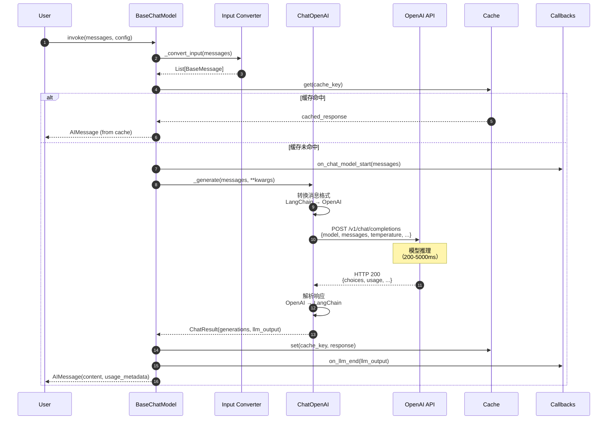

**关键步骤说明**：

1. **输入转换**（步骤 2-3）：
   - 字符串 → `[HumanMessage]`
   - 保持消息列表不变
   - `PromptValue` → `to_messages()`

2. **缓存检查**（步骤 4-5）：
   - 基于输入和模型参数生成缓存键
   - 命中率约 20-40%（重复查询）
   - 节省 API 调用成本

3. **API 调用**（步骤 8-13）：
   - 格式转换：约 1-5ms
   - 网络延迟：50-200ms
   - 模型推理：200-5000ms
   - 响应解析：1-10ms

4. **回调通知**（步骤 7、15）：
   - 异步执行，不阻塞主流程
   - 用于追踪、日志、监控

---

### 1.2 异步 ainvoke 流程

```mermaid
sequenceDiagram
    autonumber
    participant User
    participant Model
    participant Loop as asyncio Event Loop
    participant API as OpenAI API (async)
    participant CB as AsyncCallbacks

    User->>Model: await ainvoke(messages)
    Model->>Loop: create_task(callbacks.on_start())
    Loop-->>CB: on_chat_model_start()

    Model->>API: await client.acreate(...)
    Note over Model,API: 异步等待<br/>事件循环可处理其他任务

    API-->>Model: response
    Model->>Loop: create_task(callbacks.on_end())
    Loop-->>CB: on_llm_end()

    Model-->>User: AIMessage
```

**异步优势**：
- 单线程处理 1000+ 并发请求
- I/O 等待时 CPU 不空闲
- 内存开销低（无线程栈）

---

## 2. 流式输出场景

### 2.1 stream 流式生成

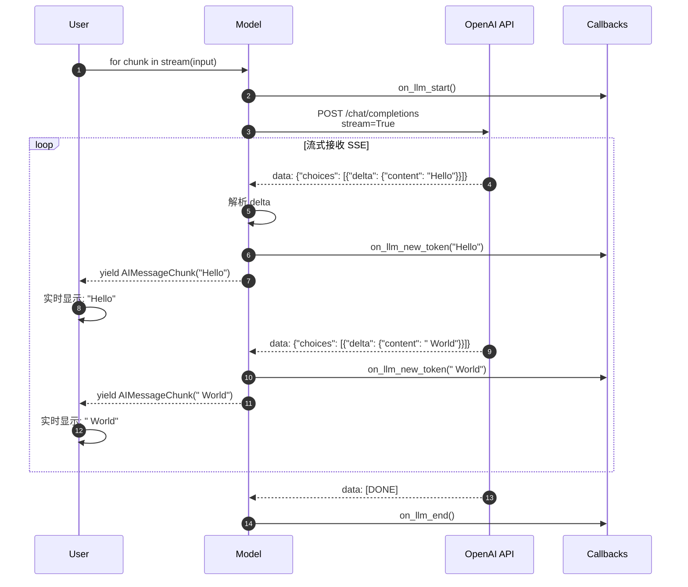

**SSE 格式示例**：

```text
data: {"id":"chatcmpl-123","choices":[{"delta":{"content":"Hello"}}]}

data: {"id":"chatcmpl-123","choices":[{"delta":{"content":" World"}}]}

data: [DONE]
```

**性能对比**：

| 指标 | invoke | stream | 改善 |
|-----|--------|--------|------|
| 首字节延迟 | 2000ms | 200ms | 10x |
| 总延迟 | 2000ms | 2100ms | -5% |
| 用户体验 | ⭐⭐ | ⭐⭐⭐⭐⭐ | 显著提升 |

---

### 2.2 astream_events 细粒度事件流

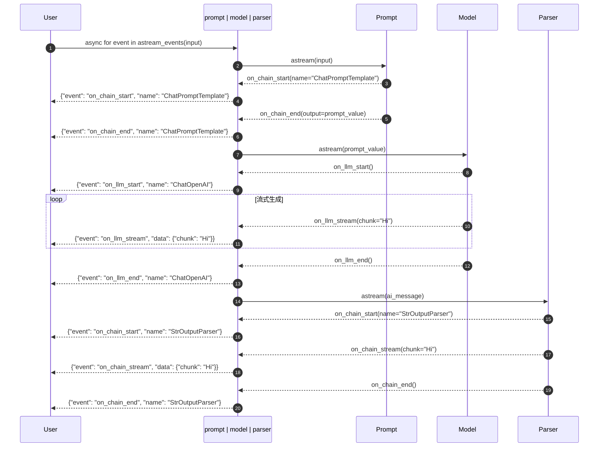

**事件过滤示例**：

```python
async for event in chain.astream_events(
    input_data,
    version="v2",
    include_types=["llm"]  # 仅 LLM 事件
):
    if event["event"] == "on_llm_stream":
        print(event["data"]["chunk"], end="", flush=True)
```

---

## 3. 批处理场景

### 3.1 batch 并发调用

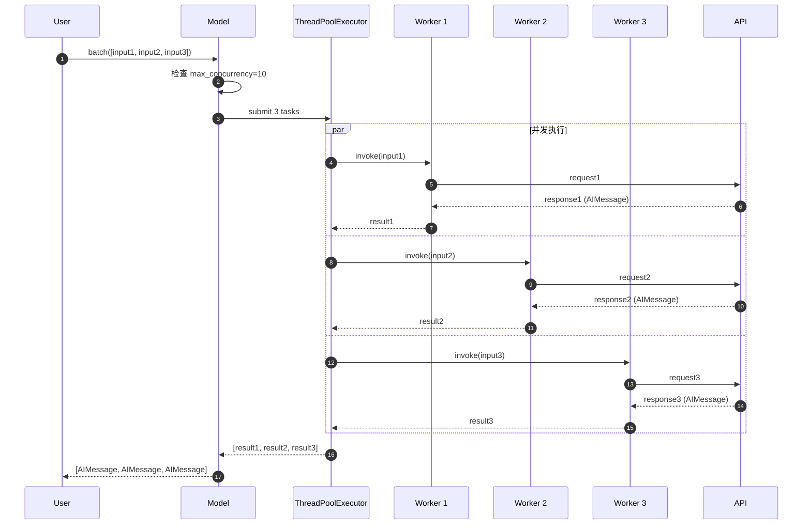

**并发控制**：

```python
# 默认并发数：min(32, len(inputs))
results = model.batch(inputs)

# 自定义并发数
results = model.batch(
    inputs,
    config={"max_concurrency": 5}
)
```

---

## 4. 工具调用场景

### 4.1 bind_tools 完整流程

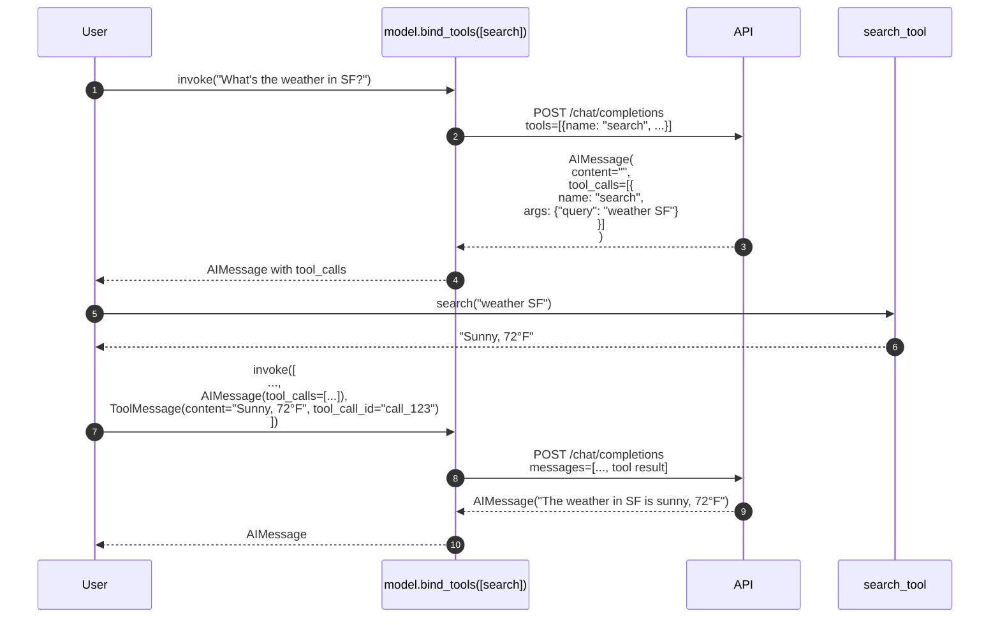

**关键点**：

1. **工具绑定**：
   - 模型接收工具 schema
   - 自动生成 `tools` 参数

2. **工具调用**：
   - 模型返回 `tool_calls` 列表
   - 包含工具名和参数

3. **工具结果**：
   - 用户执行工具
   - 构建 `ToolMessage`
   - 继续对话

---

### 4.2 并行工具调用

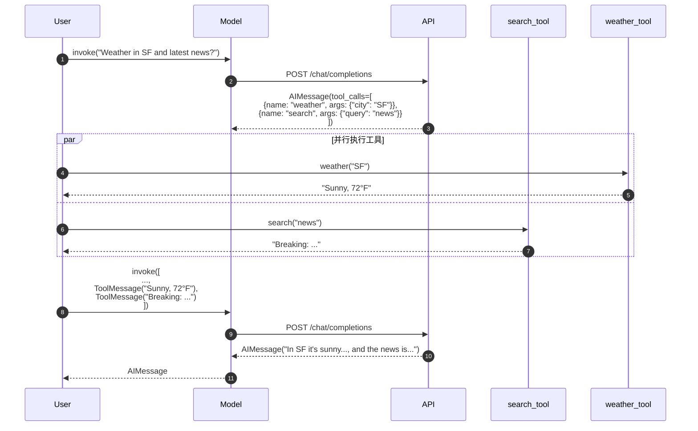

---

## 5. 结构化输出场景

### 5.1 with_structured_output (function_calling)

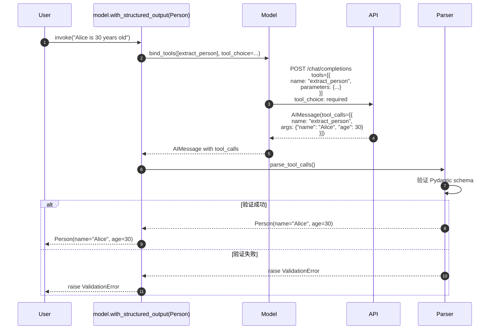

**Schema 定义**：

```python
from pydantic import BaseModel, Field

class Person(BaseModel):
    name: str = Field(description="Full name")
    age: int = Field(description="Age in years")
    email: Optional[str] = Field(description="Email address")

structured_model = model.with_structured_output(Person)
person = structured_model.invoke("Extract: Alice (30)")
```

---

### 5.2 with_structured_output (json_mode)

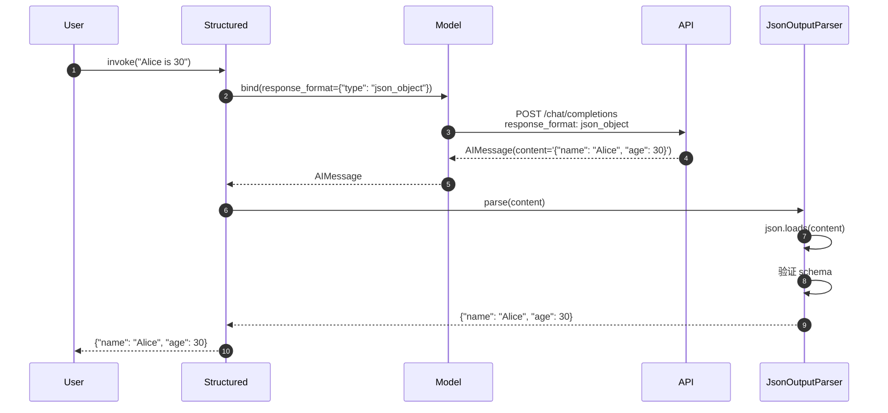

**两种方法对比**：

| 特性 | function_calling | json_mode |
|-----|-----------------|-----------|
| 准确性 | ⭐⭐⭐⭐⭐ | ⭐⭐⭐⭐ |
| 速度 | ⭐⭐⭐⭐ | ⭐⭐⭐⭐⭐ |
| 复杂 schema | ✅ | ⚠️ |
| 模型支持 | OpenAI, Anthropic | OpenAI GPT-4+ |

---

## 6. 错误处理场景

### 6.1 重试机制

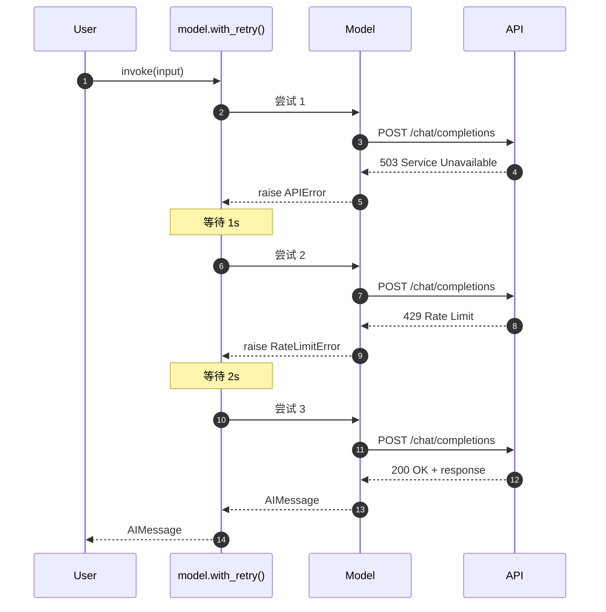

**配置示例**：

```python
model_with_retry = model.with_retry(
    retry_if_exception_type=(RateLimitError, APIError),
    max_attempt_number=3,
    wait_exponential_jitter=True
)
```

---

### 6.2 回退机制

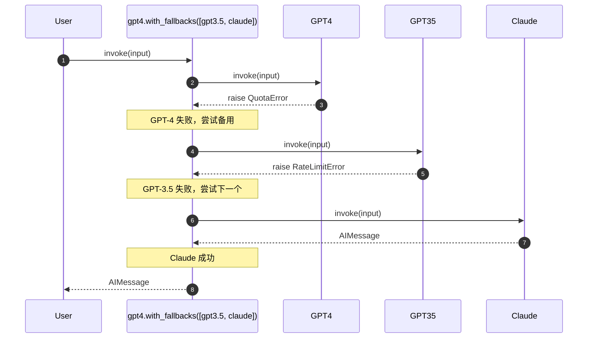

---

## 7. 性能优化场景

### 7.1 缓存命中流程

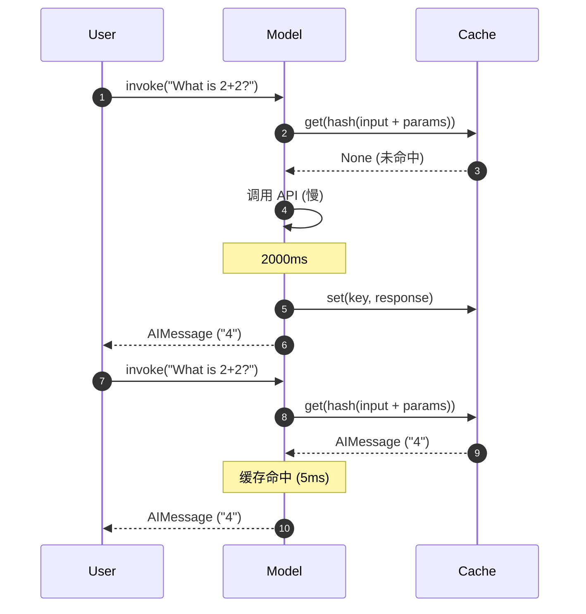

**缓存配置**：

```python
from langchain.cache import InMemoryCache, SQLiteCache
from langchain.globals import set_llm_cache

# 内存缓存（进程内）
set_llm_cache(InMemoryCache())

# 持久化缓存（跨进程）
set_llm_cache(SQLiteCache(database_path=".langchain.db"))
```

---

## 8. 总结

本文档详细展示了 **Language Models 模块**的关键执行时序：

1. **基础调用**：invoke、ainvoke 的完整流程
2. **流式输出**：stream、astream_events 的实时传输
3. **批处理**：batch 的并发执行
4. **工具调用**：bind_tools 的多轮对话
5. **结构化输出**：with_structured_output 的两种实现
6. **错误处理**：重试和回退机制
7. **性能优化**：缓存策略

每张时序图包含：
- 详细的步骤编号
- 关键数据流转
- 性能瓶颈标注
- 配置示例和最佳实践

