# LangChain-03-LanguageModels-概览

## 模块基本信息

**模块名称**: langchain-core-language-models
**模块路径**: `libs/core/langchain_core/language_models/`
**核心职责**: 定义语言模型的统一抽象接口，支持聊天模型（Chat Models）和文本补全模型（LLMs）

## 1. 模块职责

### 1.1 核心职责

Language Models 模块提供以下核心能力：

1. **统一模型接口**: 定义 `BaseLanguageModel` 抽象基类，所有语言模型实现此接口
2. **聊天模型抽象**: `BaseChatModel` 支持多轮对话，输入输出为消息列表
3. **LLM 抽象**: `BaseLLM` 支持文本补全，输入输出为字符串
4. **流式生成**: 统一的流式输出接口（`stream`、`astream`）
5. **批处理优化**: 支持批量调用以提升吞吐量
6. **缓存机制**: 可选的 LLM 响应缓存以降低成本
7. **工具调用**: 聊天模型支持函数/工具调用（Function Calling）
8. **结构化输出**: 通过 `with_structured_output` 生成符合 schema 的输出

### 1.2 架构层次

```
BaseLanguageModel (通用语言模型抽象)
├── BaseChatModel (聊天模型)
│   ├── ChatOpenAI
│   ├── ChatAnthropic
│   └── ...其他聊天模型
└── BaseLLM (文本补全模型)
    ├── OpenAI (遗留)
    └── ...其他 LLM
```

### 1.3 输入/输出

**聊天模型**:
- **输入**:
  - `list[BaseMessage]`: 消息列表（`HumanMessage`、`AIMessage`、`SystemMessage`等）
  - `str`: 单个字符串（自动转换为 `HumanMessage`）
  - `PromptValue`: 提示词值对象
- **输出**:
  - `BaseMessage`: 单个消息（通常是 `AIMessage`）
  - `Iterator[BaseMessageChunk]`: 流式输出（消息块）

**文本补全模型**:
- **输入**: `str` 或 `list[str]`
- **输出**: `str` 或 `list[str]`

### 1.4 上下游依赖

**上游调用者**:
- 用户应用代码
- LCEL 链（作为链中的一个组件）
- Agents（使用模型进行推理）

**下游依赖**:
- `langchain_core.messages`: 消息类型定义
- `langchain_core.outputs`: 生成结果封装（`ChatGeneration`、`LLMResult`）
- `langchain_core.callbacks`: 回调系统
- `langchain_core.caches`: 缓存接口
- `langchain_core.rate_limiters`: 速率限制
- 第三方 API 客户端（OpenAI SDK、Anthropic SDK 等）

## 2. 模块级架构图


### 架构图详细说明

**1. 基础抽象层**

- **BaseLanguageModel**: 所有语言模型的根基类
  - 继承自 `RunnableSerializable`，自动获得 LCEL 能力
  - 定义通用属性：`cache`、`verbose`、`callbacks`、`tags`、`metadata`
  - 强制实现 `generate_prompt` 和 `agenerate_prompt` 方法
  - 提供 `invoke`/`ainvoke` 的默认实现

- **BaseChatModel**: 聊天模型抽象
  - 输入输出为消息对象（`BaseMessage`）
  - 强制实现 `_generate` 方法（生成单个响应）
  - 可选实现 `_stream` 方法（流式生成）
  - 提供工具调用相关方法：`bind_tools`、`bind_functions`
  - 提供结构化输出方法：`with_structured_output`

- **BaseLLM**: 文本补全模型抽象
  - 输入输出为字符串
  - 强制实现 `_generate` 方法
  - 可选实现 `_stream` 方法
  - 逐渐被聊天模型取代（新项目推荐使用聊天模型）

**2. 实现层**

所有具体模型实现都位于独立的集成包中（如 `langchain-openai`），遵循以下模式：

```python
from langchain_core.language_models import BaseChatModel

class ChatOpenAI(BaseChatModel):
    # 模型特定配置
    model_name: str = "gpt-3.5-turbo"
    temperature: float = 0.7
    max_tokens: Optional[int] = None

    # 实现核心方法
    def _generate(self, messages, stop, run_manager, **kwargs):
        # 调用 OpenAI API
        pass

    def _stream(self, messages, stop, run_manager, **kwargs):
        # 流式调用 OpenAI API
        pass
```

**3. 核心功能**

- **缓存系统**:
  - 通过 `cache` 属性启用
  - 支持内存缓存（`InMemoryCache`）和外部缓存（Redis等）
  - 基于输入的哈希值匹配缓存
  - 仅对非流式调用生效

- **回调系统**:
  - `on_llm_start`: LLM 调用开始
  - `on_llm_end`: LLM 调用结束
  - `on_llm_error`: LLM 调用失败
  - `on_llm_new_token`: 流式生成新 token

- **流式生成**:
  - 逐 token 生成结果
  - 减少首字节延迟（TTFB）
  - 通过 `_stream` 方法实现
  - 返回 `BaseMessageChunk` 或字符串块

- **工具调用** (仅聊天模型):
  - `bind_tools`: 绑定工具定义到模型
  - 模型在响应中返回工具调用指令
  - 支持 OpenAI Function Calling 格式

- **结构化输出**:
  - `with_structured_output`: 强制输出符合 Pydantic schema
  - 内部使用工具调用或输出解析器
  - 确保类型安全

**4. 外部服务交互**

具体模型通过 HTTP API 与 LLM 服务通信：

```python
# OpenAI 调用示例
response = await self.client.chat.completions.create(
    model=self.model_name,
    messages=self._convert_messages(messages),
    temperature=self.temperature,
    stream=self.streaming,
    tools=self.tools if self.tools else None
)
```

## 3. 核心 API 详解

### 3.1 invoke - 生成单个响应

```python
from langchain_openai import ChatOpenAI
from langchain_core.messages import HumanMessage

model = ChatOpenAI(model="gpt-4")

# 方式1: 直接传递字符串
response = model.invoke("What is LangChain?")
print(response.content)  # AIMessage.content

# 方式2: 传递消息列表
messages = [
    SystemMessage(content="You are a helpful assistant."),
    HumanMessage(content="What is LangChain?")
]
response = model.invoke(messages)

# 方式3: 结合 LCEL
chain = prompt | model | parser
result = chain.invoke({"question": "What is LangChain?"})
```

### 3.2 stream - 流式生成

```python
model = ChatOpenAI(model="gpt-4", streaming=True)

# 逐块打印
for chunk in model.stream("Tell me a long story"):
    print(chunk.content, end="", flush=True)

# 异步流式
async def async_stream():
    async for chunk in model.astream("Tell me a long story"):
        print(chunk.content, end="", flush=True)
```

### 3.3 batch - 批量调用

```python
model = ChatOpenAI()

# 批量生成
inputs = ["Question 1", "Question 2", "Question 3"]
responses = model.batch(inputs, config={"max_concurrency": 5})

for i, response in enumerate(responses):
    print(f"Response {i}: {response.content}")
```

### 3.4 bind_tools - 绑定工具

```python
from langchain_core.tools import tool

@tool
def search(query: str) -> str:
    """Search the web for information."""
    return f"Results for: {query}"

# 绑定工具到模型
model_with_tools = model.bind_tools([search])

# 模型可以决定是否调用工具
response = model_with_tools.invoke("Search for LangChain documentation")
print(response.tool_calls)  # [ToolCall(name="search", args={"query": "..."})]
```

### 3.5 with_structured_output - 结构化输出

```python
from pydantic import BaseModel, Field

class Person(BaseModel):
    name: str = Field(description="The person's name")
    age: int = Field(description="The person's age")

# 强制输出符合 schema
structured_model = model.with_structured_output(Person)

person = structured_model.invoke("John is 30 years old")
print(person)  # Person(name="John", age=30)
print(type(person))  # <class 'Person'>
```

## 4. 关键数据结构

### 4.1 BaseMessage 及其子类


**字段说明**:

| 字段 | 类型 | 说明 |
|------|------|------|
| `content` | `str | list[dict]` | 消息内容，可以是文本或多模态内容 |
| `type` | `str` | 消息类型标识符 |
| `additional_kwargs` | `dict` | 额外的模型特定参数 |
| `example` | `bool` | 是否为示例消息（用于少样本学习） |
| `tool_calls` | `list[ToolCall]` | AI 消息的工具调用列表 |
| `tool_call_id` | `str` | 工具消息对应的调用 ID |

### 4.2 ChatGeneration 与 ChatResult

```python
@dataclass
class ChatGeneration:
    """单个聊天生成结果"""
    message: BaseMessage  # 生成的消息
    generation_info: Optional[dict] = None  # 生成信息（如finish_reason）

@dataclass
class ChatResult:
    """完整的聊天响应"""
    generations: list[ChatGeneration]  # 可能有多个候选
    llm_output: Optional[dict] = None  # 模型输出元数据（如token使用量）
```

### 4.3 ToolCall

```python
class ToolCall(TypedDict):
    """工具调用定义"""
    name: str  # 工具名称
    args: dict[str, Any]  # 工具参数
    id: Optional[str]  # 调用ID
    type: Literal["tool_call"]  # 类型标识
```

## 5. 核心流程时序图

### 5.1 简单聊天调用流程

```mermaid
sequenceDiagram
    autonumber
    participant User as 用户代码
    participant Model as ChatModel
    participant Cache as 缓存层
    participant CB as 回调管理器
    participant API as LLM API

    User->>Model: invoke(messages)
    activate Model

    Model->>CB: on_llm_start(prompts)
    Model->>Cache: get_cache(key)

    alt 缓存命中
        Cache-->>Model: cached_result
        Model->>CB: on_llm_end(result)
        Model-->>User: AIMessage
    else 缓存未命中
        Model->>API: HTTP POST /chat/completions
        activate API
        API-->>Model: {id, choices, usage}
        deactivate API

        Model->>Model: _create_chat_result(response)
        Model->>Cache: update_cache(key, result)
        Model->>CB: on_llm_end(result)
        Model-->>User: AIMessage
    end

    deactivate Model
```



**流程说明**:

1. **调用入口**: 用户通过 `invoke` 方法传入消息列表
2. **回调触发**: 触发 `on_llm_start` 回调，记录输入
3. **缓存检查**: 如果启用缓存，计算输入哈希并查询缓存
4. **API 调用**: 缓存未命中时，调用 LLM API
5. **响应解析**: 将 API 响应转换为 `AIMessage`
6. **缓存更新**: 将结果写入缓存
7. **回调结束**: 触发 `on_llm_end` 回调，记录输出和延迟
8. **返回结果**: 返回 `AIMessage` 给调用方

### 5.2 流式生成流程


**流程说明**:

1. **启用流式**: 设置 `stream=True` 参数
2. **SSE 连接**: 建立 Server-Sent Events 连接
3. **逐块接收**: 服务器逐 token 推送数据
4. **实时回调**: 每个 token 触发 `on_llm_new_token` 回调
5. **逐块返回**: 通过生成器 `yield` 返回消息块
6. **连接关闭**: 收到 `[DONE]` 信号后结束
7. **最终回调**: 触发 `on_llm_end`，记录完整结果

### 5.3 工具调用流程


**流程说明**:

1. **绑定工具**: 通过 `bind_tools` 将工具定义传给模型
2. **首次调用**: 模型收到用户查询和工具列表
3. **工具决策**: LLM 决定需要调用哪个工具及参数
4. **返回调用指令**: 返回 `AIMessage` 包含 `tool_calls`
5. **执行工具**: 用户代码执行工具并获得结果
6. **二次调用**: 将工具结果作为 `ToolMessage` 传回模型
7. **最终答案**: 模型基于工具结果生成最终回复

## 6. 配置与优化

### 6.1 关键配置参数

| 参数名 | 类型 | 默认值 | 说明 |
|--------|------|--------|------|
| `model` / `model_name` | `str` | 模型特定 | 模型标识符（如 `gpt-4`、`claude-3-opus`） |
| `temperature` | `float` | 0.7 | 生成随机性，0 = 确定性，2 = 最大随机 |
| `max_tokens` | `int` | `None` | 最大生成 token 数 |
| `top_p` | `float` | 1.0 | 核采样参数 |
| `frequency_penalty` | `float` | 0.0 | 频率惩罚（减少重复） |
| `presence_penalty` | `float` | 0.0 | 存在惩罚（鼓励新话题） |
| `streaming` | `bool` | `False` | 是否启用流式输出 |
| `cache` | `bool | BaseCache` | `None` | 响应缓存 |
| `request_timeout` | `float` | 60.0 | API 请求超时（秒） |
| `max_retries` | `int` | 2 | API 调用失败重试次数 |

### 6.2 性能优化建议

**1. 启用缓存**:

```python
from langchain.cache import InMemoryCache
from langchain.globals import set_llm_cache

# 全局缓存
set_llm_cache(InMemoryCache())

# 或单个模型缓存
model = ChatOpenAI(cache=True)
```

**2. 批处理聚合**:

```python
# ❌ 低效：循环调用
results = [model.invoke(q) for q in questions]

# ✅ 高效：批量调用
results = model.batch(questions, config={"max_concurrency": 10})
```

**3. 流式提升体验**:

```python
# 用户立即看到输出
model = ChatOpenAI(streaming=True)
for chunk in model.stream(query):
    display(chunk.content)
```

**4. 异步提升吞吐量**:

```python
async def process_many():
    tasks = [model.ainvoke(q) for q in questions]
    results = await asyncio.gather(*tasks)
    return results
```

**5. 调整并发度**:

```python
# 避免 API 速率限制
model.batch(inputs, config={"max_concurrency": 5})
```

## 7. 最佳实践

### 7.1 选择合适的模型类型

**使用聊天模型（推荐）**:
- 新项目优先选择聊天模型
- 更好的多轮对话支持
- 支持系统消息和工具调用
- 更现代的 API 设计

**使用文本补全模型**:
- 仅当特定模型不支持聊天 API 时
- 简单的文本生成任务
- 逐渐被淘汰

### 7.2 提示词工程

```python
from langchain_core.prompts import ChatPromptTemplate

# ✅ 使用系统消息设置角色
prompt = ChatPromptTemplate.from_messages([
    ("system", "You are an expert {domain} assistant."),
    ("human", "{question}")
])

chain = prompt | model
result = chain.invoke({"domain": "Python", "question": "..."})
```

### 7.3 错误处理

```python
from langchain_core.exceptions import OutputParserException

try:
    result = model.invoke(query, config={"request_timeout": 30})
except asyncio.TimeoutError:
    # 处理超时
    result = fallback_model.invoke(query)
except Exception as e:
    # 处理其他错误
    logger.error(f"LLM call failed: {e}")
    raise
```

### 7.4 成本控制

```python
# 1. 限制 token 使用
model = ChatOpenAI(model="gpt-3.5-turbo", max_tokens=500)

# 2. 使用更便宜的模型
cheap_model = ChatOpenAI(model="gpt-3.5-turbo")  # 而非 gpt-4

# 3. 启用缓存避免重复调用
model = ChatOpenAI(cache=True)

# 4. 监控 token 使用量
response = model.generate([[message]])
print(response.llm_output["token_usage"])
```

## 8. 与其他模块的协作

### 8.1 与 Prompts 协作

```python
prompt = ChatPromptTemplate.from_template("Tell me about {topic}")
chain = prompt | model
result = chain.invoke({"topic": "AI"})
```

### 8.2 与 Output Parsers 协作

```python
from langchain_core.output_parsers import JsonOutputParser

parser = JsonOutputParser()
chain = prompt | model | parser
structured_result = chain.invoke(input)
```

### 8.3 与 Agents 协作

```python
from langchain.agents import AgentExecutor, create_openai_functions_agent

agent = create_openai_functions_agent(model, tools, prompt)
agent_executor = AgentExecutor(agent=agent, tools=tools)
result = agent_executor.invoke({"input": "query"})
```

### 8.4 与 Retrievers 协作（RAG）

```python
from langchain_core.runnables import RunnablePassthrough

chain = (
    {"context": retriever, "question": RunnablePassthrough()}
    | prompt
    | model
    | StrOutputParser()
)
```

## 9. 测试与调试

### 9.1 使用假模型测试

```python
from langchain_core.language_models import FakeChatModel

# 预定义响应
fake_model = FakeChatModel(responses=["Response 1", "Response 2"])

# 用于单元测试
result = fake_model.invoke("test")
assert result.content == "Response 1"
```

### 9.2 启用详细日志

```python
from langchain.globals import set_verbose, set_debug

set_verbose(True)  # 打印中间步骤
set_debug(True)  # 打印所有回调

model.invoke(query)  # 查看详细执行过程
```

### 9.3 LangSmith 追踪

```python
import os

os.environ["LANGCHAIN_TRACING_V2"] = "true"
os.environ["LANGCHAIN_API_KEY"] = "..."

# 自动追踪所有 LLM 调用
model.invoke(query)
# 在 LangSmith UI 查看执行轨迹、延迟、token 使用等
```

## 10. 总结

Language Models 模块是 LangChain 的核心，通过统一的抽象接口支持各种 LLM 提供商。关键特性包括：

1. **统一接口**: 轻松切换不同模型，无需修改业务代码
2. **LCEL 集成**: 作为 Runnable 可无缝组合到链中
3. **流式支持**: 提升用户体验，降低感知延迟
4. **工具调用**: 赋予模型使用外部工具的能力
5. **结构化输出**: 确保输出符合预期格式
6. **缓存优化**: 降低成本和延迟

使用时应注意成本控制、错误处理和性能优化，充分利用批处理和异步能力提升吞吐量。

---

**文档版本**: v1.0
**最后更新**: 2025-10-03
**相关文档**:
- LangChain-00-总览.md
- LangChain-01-Runnables-概览.md
- LangChain-04-Prompts-概览.md（待生成）
- LangChain-05-OutputParsers-概览.md（待生成）

