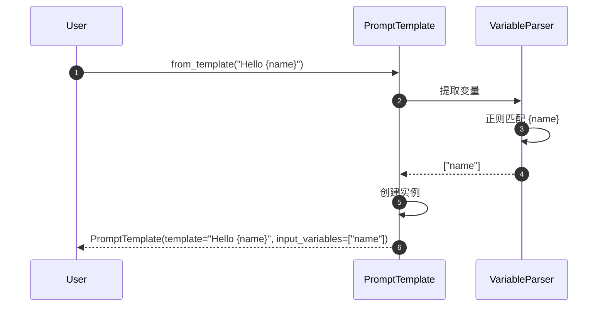
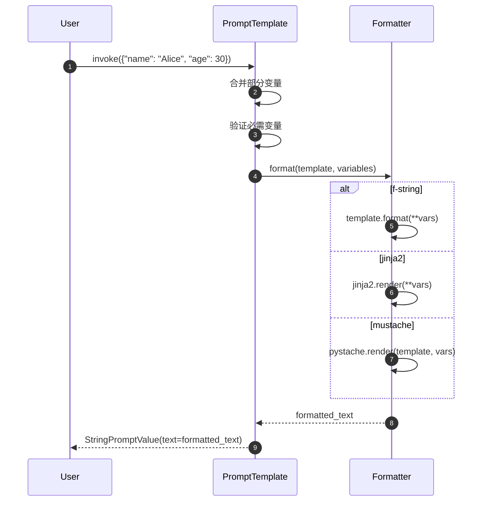
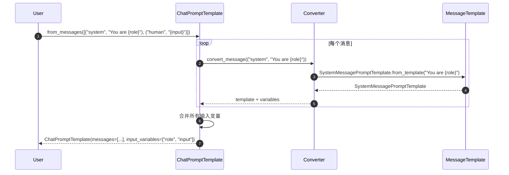
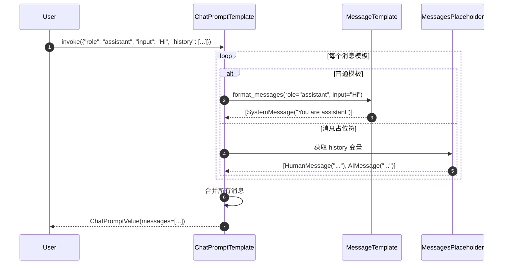

# LangChain-04-Prompts-API

## 文档说明

本文档详细描述 **Prompts 模块**的对外 API，包括 `PromptTemplate`、`ChatPromptTemplate`、`FewShotPromptTemplate` 等核心类的所有公开方法、参数规格、调用链路和最佳实践。

---

## 1. PromptTemplate 核心 API

### 1.1 from_template - 创建提示模板

#### 基本信息
- **方法签名**：`from_template(template: str, **kwargs) -> PromptTemplate`
- **功能**：从模板字符串创建提示模板
- **模板语法**：支持 f-string、Jinja2、Mustache

#### 请求参数

```python
@classmethod
def from_template(
    cls,
    template: str,
    *,
    template_format: str = "f-string",
    partial_variables: Optional[Dict[str, Any]] = None,
    **kwargs: Any,
) -> PromptTemplate:
    """从模板字符串创建提示模板。"""
```

**参数说明**：

| 参数 | 类型 | 必填 | 默认 | 说明 |
|-----|------|-----|------|------|
| template | `str` | 是 | - | 模板字符串，包含变量占位符 |
| template_format | `str` | 否 | `"f-string"` | 模板格式：`"f-string"`, `"jinja2"`, `"mustache"` |
| partial_variables | `Dict[str, Any]` | 否 | `None` | 部分变量的固定值 |
| **kwargs | `Any` | 否 | - | 其他配置参数 |

#### 模板格式示例

```python
# 1. f-string 格式（默认）
template = PromptTemplate.from_template(
    template="Tell me a {adjective} joke about {topic}."
)

# 2. Jinja2 格式
template = PromptTemplate.from_template(
    template="Tell me a {{ adjective }} joke about {{ topic }}.",
    template_format="jinja2"
)

# 3. Mustache 格式
template = PromptTemplate.from_template(
    template="Tell me a {{adjective}} joke about {{topic}}.",
    template_format="mustache"
)
```

#### 入口函数实现

```python
# libs/core/langchain_core/prompts/prompt.py
class PromptTemplate(StringPromptTemplate):

    @classmethod
    def from_template(
        cls,
        template: str,
        *,
        template_format: str = "f-string",
        partial_variables: Optional[Dict[str, Any]] = None,
        **kwargs: Any,
    ) -> PromptTemplate:
        # 1. 提取输入变量
        if template_format == "f-string":
            input_variables = _get_jinja2_variables_from_template(template)
        elif template_format == "jinja2":
            input_variables = _get_jinja2_variables_from_template(template)
        elif template_format == "mustache":
            input_variables = _get_mustache_variables_from_template(template)
        else:
            raise ValueError(f"Unsupported template format: {template_format}")

        # 2. 排除部分变量
        if partial_variables:
            input_variables = [
                var for var in input_variables
                if var not in partial_variables
            ]

        # 3. 创建实例
        return cls(
            template=template,
            input_variables=input_variables,
            template_format=template_format,
            partial_variables=partial_variables or {},
            **kwargs
        )
```

**变量提取逻辑**：

```python
def _get_jinja2_variables_from_template(template: str) -> List[str]:
    """从 f-string 模板提取变量。"""
    import re
    # 匹配 {variable} 格式
    pattern = r'\{([^}]+)\}'
    variables = re.findall(pattern, template)
    return list(set(variables))
```

#### 时序图



#### 最佳实践

```python
# 1. 使用描述性变量名
template = PromptTemplate.from_template(
    "Analyze the {document_type} and provide {analysis_depth} insights about {topic}."
)

# 2. 避免变量名冲突
template = PromptTemplate.from_template(
    "User query: {user_input}\nSystem context: {system_context}"
)

# 3. 使用部分变量减少重复
template = PromptTemplate.from_template(
    template="You are a {role}. Answer the question: {question}",
    partial_variables={"role": "helpful assistant"}
)
```

---

### 1.2 invoke - 格式化提示

#### 基本信息
- **方法签名**：`invoke(input: Dict[str, Any], config: RunnableConfig = None) -> StringPromptValue`
- **功能**：使用输入变量格式化模板，返回提示值
- **返回类型**：`StringPromptValue`（可转换为字符串或消息）

#### 请求参数

```python
def invoke(
    self,
    input: Dict[str, Any],
    config: Optional[RunnableConfig] = None,
) -> StringPromptValue:
    """格式化提示模板。"""
```

**参数说明**：

| 参数 | 类型 | 必填 | 说明 |
|-----|------|-----|------|
| input | `Dict[str, Any]` | 是 | 变量名到值的映射 |
| config | `RunnableConfig` | 否 | 运行配置（用于回调等） |

#### 响应结构

```python
class StringPromptValue(PromptValue):
    """字符串提示值。"""
    text: str

    def to_string(self) -> str:
        """转换为字符串。"""
        return self.text

    def to_messages(self) -> List[BaseMessage]:
        """转换为消息列表。"""
        return [HumanMessage(content=self.text)]
```

#### 入口函数实现

```python
def invoke(
    self,
    input: Dict[str, Any],
    config: Optional[RunnableConfig] = None,
) -> StringPromptValue:
    # 1. 合并部分变量
    merged_input = {**self.partial_variables, **input}

    # 2. 验证所需变量
    missing_vars = set(self.input_variables) - set(merged_input.keys())
    if missing_vars:
        raise KeyError(f"Missing variables: {missing_vars}")

    # 3. 格式化模板
    if self.template_format == "f-string":
        formatted = self.template.format(**merged_input)
    elif self.template_format == "jinja2":
        import jinja2
        template = jinja2.Template(self.template)
        formatted = template.render(**merged_input)
    elif self.template_format == "mustache":
        import pystache
        formatted = pystache.render(self.template, merged_input)

    return StringPromptValue(text=formatted)
```

#### 时序图



#### 使用示例

```python
template = PromptTemplate.from_template(
    "Hello {name}, you are {age} years old."
)

# 格式化
result = template.invoke({"name": "Alice", "age": 30})
print(result.text)  # "Hello Alice, you are 30 years old."

# 转换为消息
messages = result.to_messages()
# [HumanMessage(content="Hello Alice, you are 30 years old.")]
```

---

### 1.3 partial - 部分变量绑定

#### 基本信息
- **方法签名**：`partial(**kwargs) -> PromptTemplate`
- **功能**：绑定部分变量，返回新的模板实例
- **用途**：创建专用模板变体

#### 请求参数

```python
def partial(self, **kwargs: Any) -> PromptTemplate:
    """绑定部分变量。"""
```

#### 实现原理

```python
def partial(self, **kwargs: Any) -> PromptTemplate:
    # 1. 合并现有部分变量
    new_partial_variables = {**self.partial_variables, **kwargs}

    # 2. 更新输入变量列表
    new_input_variables = [
        var for var in self.input_variables
        if var not in new_partial_variables
    ]

    # 3. 创建新实例
    return self.__class__(
        template=self.template,
        input_variables=new_input_variables,
        partial_variables=new_partial_variables,
        template_format=self.template_format,
        **self._get_init_kwargs()
    )
```

#### 使用示例

```python
# 原始模板
base_template = PromptTemplate.from_template(
    "You are a {role}. Answer the {question_type} question: {question}"
)

# 创建专用模板
assistant_template = base_template.partial(role="helpful assistant")
expert_template = base_template.partial(
    role="domain expert",
    question_type="technical"
)

# 使用专用模板
result1 = assistant_template.invoke({
    "question_type": "general",
    "question": "What is AI?"
})

result2 = expert_template.invoke({
    "question": "Explain transformer architecture"
})
```

---

## 2. ChatPromptTemplate 核心 API

### 2.1 from_messages - 创建聊天模板

#### 基本信息
- **方法签名**：`from_messages(messages: Sequence[MessageLikeRepresentation]) -> ChatPromptTemplate`
- **功能**：从消息列表创建聊天提示模板
- **支持格式**：元组、字符串、消息对象、模板对象

#### 请求参数

```python
@classmethod
def from_messages(
    cls,
    messages: Sequence[MessageLikeRepresentation],
    template_format: str = "f-string",
) -> ChatPromptTemplate:
    """从消息列表创建聊天模板。"""
```

**消息格式支持**：

```python
# 1. 元组格式
messages = [
    ("system", "You are a helpful assistant"),
    ("human", "Hello {name}"),
    ("ai", "Hello! How can I help you today?"),
    ("human", "{user_input}")
]

# 2. 消息对象
messages = [
    SystemMessage(content="You are a helpful assistant"),
    HumanMessage(content="Hello {name}"),
]

# 3. 模板对象
messages = [
    SystemMessagePromptTemplate.from_template("You are a {role}"),
    HumanMessagePromptTemplate.from_template("Question: {question}"),
]

# 4. 混合格式
messages = [
    ("system", "You are a {role}"),
    HumanMessagePromptTemplate.from_template("Question: {question}"),
    MessagesPlaceholder(variable_name="chat_history"),
]
```

#### 入口函数实现

```python
@classmethod
def from_messages(
    cls,
    messages: Sequence[MessageLikeRepresentation],
    template_format: str = "f-string",
) -> ChatPromptTemplate:
    # 1. 转换消息格式
    message_templates = []
    input_variables = set()

    for message in messages:
        if isinstance(message, tuple):
            # 元组格式：("role", "content")
            role, content = message
            template = _message_template_from_role_and_content(
                role, content, template_format
            )
        elif isinstance(message, BaseMessage):
            # 消息对象
            template = _message_template_from_message(message)
        elif isinstance(message, BaseMessagePromptTemplate):
            # 模板对象
            template = message
        else:
            raise ValueError(f"Unsupported message type: {type(message)}")

        message_templates.append(template)
        input_variables.update(template.input_variables)

    # 2. 创建实例
    return cls(
        messages=message_templates,
        input_variables=list(input_variables),
        template_format=template_format,
    )
```

**消息模板转换**：

```python
def _message_template_from_role_and_content(
    role: str,
    content: str,
    template_format: str
) -> BaseMessagePromptTemplate:
    """从角色和内容创建消息模板。"""
    if role == "system":
        return SystemMessagePromptTemplate.from_template(content, template_format=template_format)
    elif role == "human" or role == "user":
        return HumanMessagePromptTemplate.from_template(content, template_format=template_format)
    elif role == "ai" or role == "assistant":
        return AIMessagePromptTemplate.from_template(content, template_format=template_format)
    else:
        return ChatMessagePromptTemplate.from_template(content, role=role, template_format=template_format)
```

#### 时序图



---

### 2.2 invoke - 格式化聊天提示

#### 基本信息
- **方法签名**：`invoke(input: Dict[str, Any], config: RunnableConfig = None) -> ChatPromptValue`
- **功能**：格式化聊天模板，返回消息列表
- **返回类型**：`ChatPromptValue`

#### 请求参数

```python
def invoke(
    self,
    input: Dict[str, Any],
    config: Optional[RunnableConfig] = None,
) -> ChatPromptValue:
    """格式化聊天提示模板。"""
```

#### 响应结构

```python
class ChatPromptValue(PromptValue):
    """聊天提示值。"""
    messages: List[BaseMessage]

    def to_string(self) -> str:
        """转换为字符串。"""
        return get_buffer_string(self.messages)

    def to_messages(self) -> List[BaseMessage]:
        """返回消息列表。"""
        return self.messages
```

#### 入口函数实现

```python
def invoke(
    self,
    input: Dict[str, Any],
    config: Optional[RunnableConfig] = None,
) -> ChatPromptValue:
    # 1. 格式化每个消息模板
    messages = []
    for message_template in self.messages:
        if isinstance(message_template, MessagesPlaceholder):
            # 消息占位符
            placeholder_messages = input.get(message_template.variable_name, [])
            if isinstance(placeholder_messages, BaseMessage):
                placeholder_messages = [placeholder_messages]
            messages.extend(placeholder_messages)
        else:
            # 普通消息模板
            formatted_message = message_template.format_messages(**input)[0]
            messages.append(formatted_message)

    return ChatPromptValue(messages=messages)
```

#### 时序图



#### 使用示例

```python
template = ChatPromptTemplate.from_messages([
    ("system", "You are a {role}"),
    MessagesPlaceholder(variable_name="chat_history"),
    ("human", "{input}")
])

# 格式化
result = template.invoke({
    "role": "helpful assistant",
    "chat_history": [
        HumanMessage(content="Hi"),
        AIMessage(content="Hello!")
    ],
    "input": "How are you?"
})

# 结果消息
print(result.messages)
# [
#   SystemMessage(content="You are a helpful assistant"),
#   HumanMessage(content="Hi"),
#   AIMessage(content="Hello!"),
#   HumanMessage(content="How are you?")
# ]
```

---

### 2.3 partial - 部分变量绑定

#### 基本信息
- **功能**：与 `PromptTemplate.partial` 类似，但支持消息级别的部分绑定

#### 使用示例

```python
base_template = ChatPromptTemplate.from_messages([
    ("system", "You are a {role} specializing in {domain}"),
    ("human", "{user_input}")
])

# 创建专用模板
ai_assistant = base_template.partial(
    role="AI assistant",
    domain="general knowledge"
)

# 使用
result = ai_assistant.invoke({"user_input": "What is Python?"})
```

---

## 3. FewShotPromptTemplate 核心 API

### 3.1 构造方法

#### 基本信息
- **功能**：创建少样本学习提示模板
- **适用场景**：需要提供示例的任务

#### 请求参数

```python
class FewShotPromptTemplate(BasePromptTemplate):
    def __init__(
        self,
        examples: Optional[List[Dict[str, str]]] = None,
        example_selector: Optional[BaseExampleSelector] = None,
        example_prompt: PromptTemplate,
        suffix: str,
        input_variables: List[str],
        example_separator: str = "\n\n",
        prefix: str = "",
        **kwargs: Any,
    ):
        """少样本提示模板。"""
```

**参数说明**：

| 参数 | 类型 | 必填 | 说明 |
|-----|------|-----|------|
| examples | `List[Dict]` | 否 | 固定示例列表 |
| example_selector | `BaseExampleSelector` | 否 | 动态示例选择器 |
| example_prompt | `PromptTemplate` | 是 | 单个示例的格式模板 |
| suffix | `str` | 是 | 后缀模板（包含实际问题） |
| input_variables | `List[str]` | 是 | 输入变量列表 |
| example_separator | `str` | 否 | 示例间分隔符 |
| prefix | `str` | 否 | 前缀模板 |

#### 使用示例

```python
# 定义示例
examples = [
    {"input": "happy", "output": "sad"},
    {"input": "tall", "output": "short"},
    {"input": "hot", "output": "cold"},
]

# 定义示例模板
example_prompt = PromptTemplate.from_template(
    "Input: {input}\nOutput: {output}"
)

# 创建少样本模板
few_shot_template = FewShotPromptTemplate(
    examples=examples,
    example_prompt=example_prompt,
    prefix="Find the opposite of the given word:",
    suffix="Input: {word}\nOutput:",
    input_variables=["word"],
    example_separator="\n\n"
)

# 使用
result = few_shot_template.invoke({"word": "big"})
print(result.text)
# Find the opposite of the given word:
#
# Input: happy
# Output: sad
#
# Input: tall
# Output: short
#
# Input: hot
# Output: cold
#
# Input: big
# Output:
```

---

### 3.2 动态示例选择

#### 使用示例选择器

```python
from langchain.prompts.example_selector import SemanticSimilarityExampleSelector
from langchain.vectorstores import Chroma
from langchain.embeddings import OpenAIEmbeddings

# 创建示例选择器
example_selector = SemanticSimilarityExampleSelector.from_examples(
    examples,
    OpenAIEmbeddings(),
    Chroma,
    k=2  # 选择最相似的2个示例
)

# 使用选择器的少样本模板
dynamic_template = FewShotPromptTemplate(
    example_selector=example_selector,
    example_prompt=example_prompt,
    suffix="Input: {word}\nOutput:",
    input_variables=["word"],
)

# 使用（会自动选择最相关的示例）
result = dynamic_template.invoke({"word": "joyful"})
```

---

## 4. MessagesPlaceholder API

### 4.1 基本用法

#### 基本信息
- **功能**：在聊天模板中插入动态消息列表
- **适用场景**：聊天历史、多轮对话

#### 构造方法

```python
class MessagesPlaceholder(BaseMessagePromptTemplate):
    def __init__(
        self,
        variable_name: str,
        *,
        optional: bool = False,
        **kwargs: Any,
    ):
        """消息占位符。"""
```

**参数说明**：

| 参数 | 类型 | 必填 | 说明 |
|-----|------|-----|------|
| variable_name | `str` | 是 | 变量名（在输入中的键） |
| optional | `bool` | 否 | 是否可选（True时变量可以不存在） |

#### 使用示例

```python
template = ChatPromptTemplate.from_messages([
    ("system", "You are a helpful assistant"),
    MessagesPlaceholder(variable_name="chat_history"),
    ("human", "{input}"),
    MessagesPlaceholder(variable_name="agent_scratchpad", optional=True)
])

# 使用
result = template.invoke({
    "chat_history": [
        HumanMessage(content="Hi"),
        AIMessage(content="Hello!")
    ],
    "input": "How are you?",
    # agent_scratchpad 可选，可以不提供
})
```

---

## 5. 模板组合与链式调用

### 5.1 模板管道

```python
# 创建模板链
prompt_chain = (
    ChatPromptTemplate.from_messages([
        ("system", "You are a translator"),
        ("human", "Translate '{text}' to {language}")
    ])
    | model
    | StrOutputParser()
)

# 使用
result = prompt_chain.invoke({
    "text": "Hello world",
    "language": "French"
})
```

### 5.2 条件模板

```python
from langchain.prompts import PipelinePromptTemplate

# 定义不同场景的模板
casual_template = PromptTemplate.from_template("Hey! {input}")
formal_template = PromptTemplate.from_template("Dear Sir/Madam, {input}")

# 创建条件逻辑
def select_template(input_vars):
    if input_vars.get("formal", False):
        return formal_template
    return casual_template

# 使用
casual_result = select_template({"formal": False}).invoke({"input": "How are you?"})
formal_result = select_template({"formal": True}).invoke({"input": "How are you?"})
```

---

## 6. 最佳实践

### 6.1 模板设计原则

```python
# ✅ 好的模板设计
template = ChatPromptTemplate.from_messages([
    ("system", """You are an expert {domain} assistant. Your role is to:
    1. Provide accurate information
    2. Explain complex concepts clearly
    3. Ask clarifying questions when needed

    Current context: {context}"""),

    MessagesPlaceholder(variable_name="chat_history", optional=True),

    ("human", """Question: {question}

    Please provide a comprehensive answer.""")
])

# ❌ 避免的模板设计
bad_template = PromptTemplate.from_template(
    "Answer {q}"  # 太简洁，缺少上下文
)
```

### 6.2 性能优化

```python
# 1. 缓存常用模板
template_cache = {}

def get_template(template_key: str) -> ChatPromptTemplate:
    if template_key not in template_cache:
        template_cache[template_key] = ChatPromptTemplate.from_messages([...])
    return template_cache[template_key]

# 2. 使用部分变量减少重复
base_template = ChatPromptTemplate.from_messages([
    ("system", "You are a {role} with expertise in {domain}"),
    ("human", "{input}")
])

# 创建专用模板
python_expert = base_template.partial(
    role="software engineer",
    domain="Python programming"
)

# 3. 预编译复杂模板
if template_format == "jinja2":
    # Jinja2 会自动缓存编译后的模板
    pass
```

### 6.3 错误处理

```python
try:
    result = template.invoke(input_vars)
except KeyError as e:
    print(f"Missing required variable: {e}")
except Exception as e:
    print(f"Template formatting error: {e}")
```

---

## 7. 总结

本文档详细描述了 **Prompts 模块**的核心 API：

### 主要类和方法
1. **PromptTemplate**：基础字符串模板
   - `from_template`：创建模板
   - `invoke`：格式化
   - `partial`：部分变量绑定

2. **ChatPromptTemplate**：聊天消息模板
   - `from_messages`：从消息列表创建
   - `invoke`：格式化为消息列表

3. **FewShotPromptTemplate**：少样本学习模板
   - 支持固定示例和动态选择

4. **MessagesPlaceholder**：动态消息插入

每个 API 均包含：
- 完整的请求/响应结构
- 入口函数核心代码
- 详细时序图
- 实际使用示例
- 最佳实践建议

推荐使用 **ChatPromptTemplate** 构建现代 LLM 应用，支持多角色对话和复杂提示工程需求。
