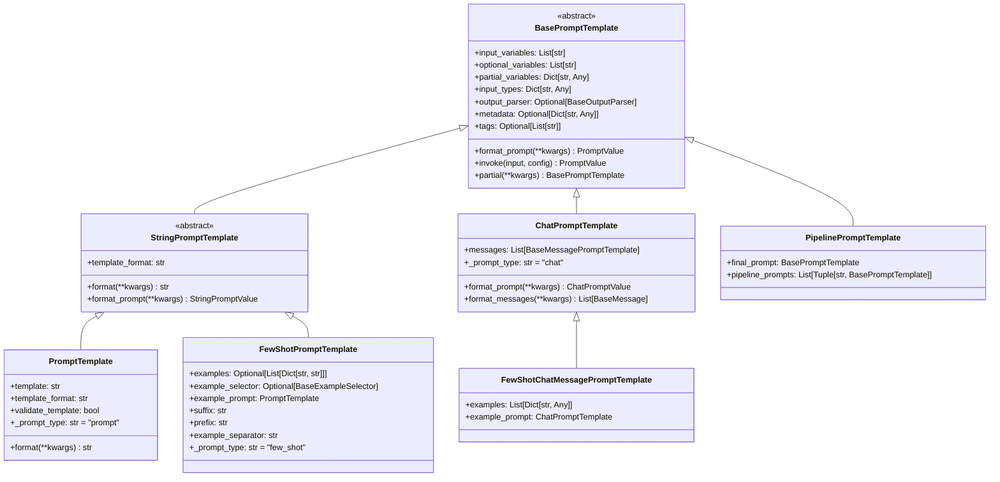
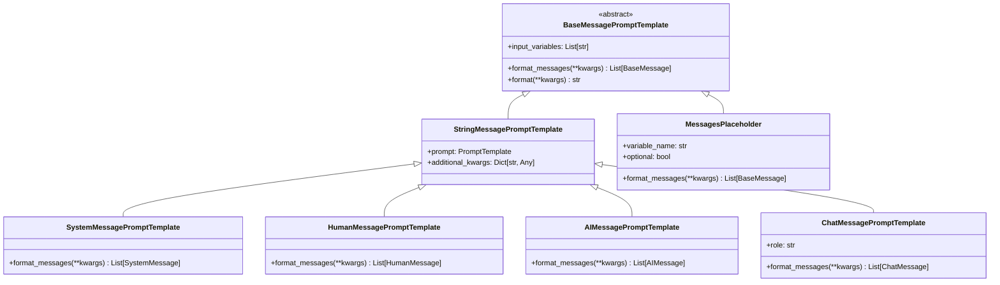
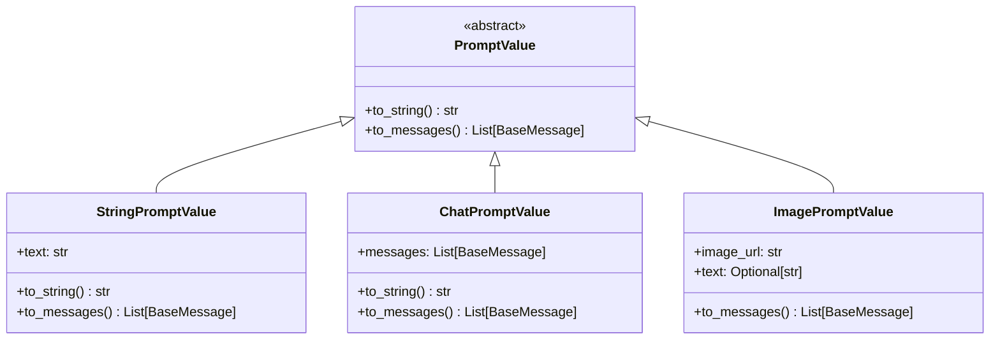
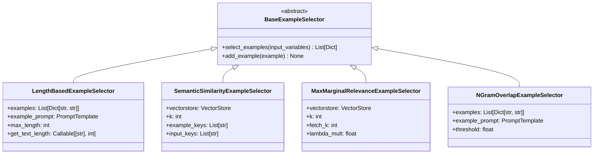
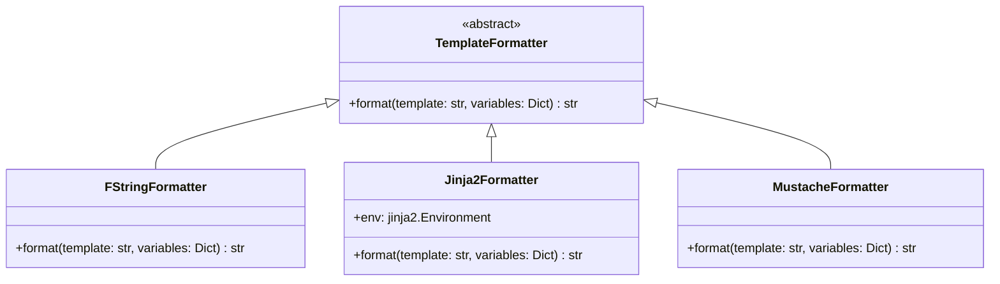

# LangChain-04-Prompts-数据结构

## 文档说明

本文档详细描述 **Prompts 模块**的核心数据结构，包括提示模板类层次、消息模板、变量管理、示例选择器等。所有结构均配备 UML 类图和详细的字段说明。

---

## 1. 提示模板类层次

### 1.1 BasePromptTemplate 层次结构



**图解说明**：

1. **抽象基类**：
   - `BasePromptTemplate`：所有提示模板的基类，定义通用接口
   - `StringPromptTemplate`：字符串类提示模板的基类

2. **具体实现**：
   - `PromptTemplate`：基础字符串模板
   - `ChatPromptTemplate`：聊天消息模板
   - `FewShotPromptTemplate`：少样本学习模板

3. **扩展类**：
   - `FewShotChatMessagePromptTemplate`：聊天模式的少样本模板
   - `PipelinePromptTemplate`：模板管道

---

## 2. BasePromptTemplate 核心字段

### 2.1 字段详解

```python
class BasePromptTemplate(RunnableSerializable[Dict, PromptValue]):
    """提示模板基类。"""

    input_variables: List[str]  # 必需输入变量
    optional_variables: List[str] = []  # 可选输入变量
    partial_variables: Dict[str, Any] = {}  # 部分变量（预设值）
    input_types: Dict[str, Any] = {}  # 输入类型约束
    output_parser: Optional[BaseOutputParser] = None  # 输出解析器
    metadata: Optional[Dict[str, Any]] = None  # 元数据
    tags: Optional[List[str]] = None  # 标签
```

**字段表**：

| 字段 | 类型 | 必填 | 默认 | 说明 |
|-----|------|-----|------|------|
| input_variables | `List[str]` | 是 | - | 必需的输入变量名列表 |
| optional_variables | `List[str]` | 否 | `[]` | 可选的输入变量名列表 |
| partial_variables | `Dict[str, Any]` | 否 | `{}` | 已绑定的部分变量 |
| input_types | `Dict[str, Any]` | 否 | `{}` | 输入变量的类型约束 |
| output_parser | `BaseOutputParser` | 否 | `None` | 输出解析器 |
| metadata | `Dict[str, Any]` | 否 | `None` | 附加元数据 |
| tags | `List[str]` | 否 | `None` | 分类标签 |

**使用示例**：

```python
template = PromptTemplate(
    template="Translate {text} to {language}",
    input_variables=["text", "language"],
    metadata={"task": "translation", "version": "1.0"},
    tags=["translation", "multilingual"]
)

# 部分变量绑定
chinese_template = template.partial(language="Chinese")
# 现在只需要提供 text 变量
```

---

### 2.2 输入类型约束

```python
class TypedPromptTemplate(BasePromptTemplate):
    """带类型约束的提示模板。"""

    input_types: Dict[str, Any] = {
        "user_age": int,
        "user_email": str,
        "preferences": List[str],
        "metadata": Dict[str, Any]
    }

    def _validate_input(self, input_data: Dict[str, Any]) -> None:
        """验证输入类型。"""
        for var_name, expected_type in self.input_types.items():
            if var_name in input_data:
                value = input_data[var_name]
                if not isinstance(value, expected_type):
                    raise TypeError(
                        f"Variable '{var_name}' expected {expected_type}, got {type(value)}"
                    )
```

---

## 3. 消息模板数据结构

### 3.1 BaseMessagePromptTemplate 层次



**字段说明**：

#### SystemMessagePromptTemplate

```python
class SystemMessagePromptTemplate(StringMessagePromptTemplate):
    """系统消息模板。"""

    @classmethod
    def from_template(
        cls,
        template: str,
        template_format: str = "f-string",
        **kwargs: Any,
    ) -> SystemMessagePromptTemplate:
        """从模板字符串创建系统消息模板。"""
        prompt = PromptTemplate.from_template(template, template_format=template_format)
        return cls(prompt=prompt, **kwargs)

    def format_messages(self, **kwargs: Any) -> List[SystemMessage]:
        """格式化为系统消息。"""
        content = self.prompt.format(**kwargs)
        return [SystemMessage(content=content, **self.additional_kwargs)]
```

#### MessagesPlaceholder

```python
class MessagesPlaceholder(BaseMessagePromptTemplate):
    """消息占位符，用于插入动态消息列表。"""

    variable_name: str  # 变量名
    optional: bool = False  # 是否可选

    def format_messages(self, **kwargs: Any) -> List[BaseMessage]:
        """从输入中获取消息列表。"""
        messages = kwargs.get(self.variable_name, [])

        if not self.optional and not messages:
            raise KeyError(f"Missing required variable: {self.variable_name}")

        # 确保返回消息列表
        if isinstance(messages, BaseMessage):
            return [messages]
        return messages or []
```

**使用示例**：

```python
# 创建消息模板
template = ChatPromptTemplate.from_messages([
    SystemMessagePromptTemplate.from_template("You are a {role}"),
    MessagesPlaceholder(variable_name="chat_history", optional=True),
    HumanMessagePromptTemplate.from_template("{user_input}")
])

# 格式化
messages = template.format_messages(
    role="helpful assistant",
    user_input="Hello",
    chat_history=[
        HumanMessage(content="Hi"),
        AIMessage(content="Hello there!")
    ]
)
```

---

## 4. 提示值数据结构

### 4.1 PromptValue 层次



**字段说明**：

#### StringPromptValue

```python
class StringPromptValue(PromptValue):
    """字符串提示值。"""
    text: str

    def to_string(self) -> str:
        """返回字符串内容。"""
        return self.text

    def to_messages(self) -> List[BaseMessage]:
        """转换为消息列表。"""
        return [HumanMessage(content=self.text)]
```

#### ChatPromptValue

```python
class ChatPromptValue(PromptValue):
    """聊天提示值。"""
    messages: List[BaseMessage]

    def to_string(self) -> str:
        """转换为字符串（用于传统LLM）。"""
        return get_buffer_string(self.messages)

    def to_messages(self) -> List[BaseMessage]:
        """返回消息列表。"""
        return self.messages
```

**转换示例**：

```python
# 聊天模板
chat_template = ChatPromptTemplate.from_messages([
    ("system", "You are helpful"),
    ("human", "Hello")
])

chat_value = chat_template.invoke({})
print(chat_value.to_messages())
# [SystemMessage(content="You are helpful"), HumanMessage(content="Hello")]

print(chat_value.to_string())
# "System: You are helpful\nHuman: Hello"

# 字符串模板
string_template = PromptTemplate.from_template("Hello {name}")
string_value = string_template.invoke({"name": "Alice"})

print(string_value.to_string())
# "Hello Alice"

print(string_value.to_messages())
# [HumanMessage(content="Hello Alice")]
```

---

## 5. 少样本学习数据结构

### 5.1 示例选择器层次



**字段说明**：

#### LengthBasedExampleSelector

```python
class LengthBasedExampleSelector(BaseExampleSelector):
    """基于长度的示例选择器。"""

    examples: List[Dict[str, str]]  # 示例列表
    example_prompt: PromptTemplate  # 示例格式模板
    max_length: int = 2048  # 最大长度限制
    get_text_length: Callable[[str], int] = len  # 长度计算函数

    def select_examples(self, input_variables: Dict[str, Any]) -> List[Dict[str, str]]:
        """基于长度选择示例。"""
        selected = []
        current_length = 0

        for example in self.examples:
            # 计算添加此示例后的长度
            example_text = self.example_prompt.format(**example)
            example_length = self.get_text_length(example_text)

            if current_length + example_length <= self.max_length:
                selected.append(example)
                current_length += example_length
            else:
                break

        return selected
```

#### SemanticSimilarityExampleSelector

```python
class SemanticSimilarityExampleSelector(BaseExampleSelector):
    """基于语义相似度的示例选择器。"""

    vectorstore: VectorStore  # 向量存储
    k: int = 4  # 选择的示例数量
    example_keys: List[str]  # 示例中用于相似度计算的键
    input_keys: List[str]  # 输入中用于相似度计算的键

    @classmethod
    def from_examples(
        cls,
        examples: List[Dict[str, str]],
        embeddings: Embeddings,
        vectorstore_cls: Type[VectorStore],
        k: int = 4,
        input_keys: Optional[List[str]] = None,
        **vectorstore_kwargs: Any,
    ) -> SemanticSimilarityExampleSelector:
        """从示例创建选择器。"""
        # 构建文档
        string_examples = [
            " ".join(sorted([f"{k}: {v}" for k, v in eg.items()]))
            for eg in examples
        ]

        # 创建向量存储
        vectorstore = vectorstore_cls.from_texts(
            string_examples,
            embeddings,
            metadatas=examples,
            **vectorstore_kwargs,
        )

        return cls(
            vectorstore=vectorstore,
            k=k,
            input_keys=input_keys or list(examples[0].keys()),
        )

    def select_examples(self, input_variables: Dict[str, Any]) -> List[Dict[str, str]]:
        """基于语义相似度选择示例。"""
        # 构建查询字符串
        query = " ".join(
            sorted([f"{k}: {v}" for k, v in input_variables.items() if k in self.input_keys])
        )

        # 相似度搜索
        docs = self.vectorstore.similarity_search(query, k=self.k)

        # 返回示例
        return [doc.metadata for doc in docs]
```

**使用示例**：

```python
# 示例数据
examples = [
    {"input": "happy", "output": "joyful"},
    {"input": "sad", "output": "sorrowful"},
    {"input": "angry", "output": "furious"},
]

# 语义相似度选择器
selector = SemanticSimilarityExampleSelector.from_examples(
    examples,
    OpenAIEmbeddings(),
    Chroma,
    k=2
)

# 选择相关示例
selected = selector.select_examples({"input": "excited"})
# 可能返回 [{"input": "happy", "output": "joyful"}, ...]
```

---

## 6. 模板格式支持

### 6.1 模板格式类型

```python
class TemplateFormat(str, Enum):
    """支持的模板格式。"""
    F_STRING = "f-string"      # Python f-string：{variable}
    JINJA2 = "jinja2"          # Jinja2：{{ variable }}
    MUSTACHE = "mustache"      # Mustache：{{variable}}
```

### 6.2 格式化引擎



**实现细节**：

```python
class FStringFormatter(TemplateFormatter):
    """f-string 格式化器。"""

    def format(self, template: str, variables: Dict[str, Any]) -> str:
        """使用 str.format() 格式化。"""
        try:
            return template.format(**variables)
        except KeyError as e:
            raise ValueError(f"Missing variable: {e}")

class Jinja2Formatter(TemplateFormatter):
    """Jinja2 格式化器。"""

    def __init__(self):
        import jinja2
        self.env = jinja2.Environment(
            undefined=jinja2.StrictUndefined  # 严格模式，未定义变量会报错
        )

    def format(self, template: str, variables: Dict[str, Any]) -> str:
        """使用 Jinja2 格式化。"""
        template_obj = self.env.from_string(template)
        return template_obj.render(**variables)
```

**格式对比**：

| 特性 | f-string | Jinja2 | Mustache |
|-----|----------|--------|----------|
| 语法 | `{var}` | `{{ var }}` | `{{var}}` |
| 条件 | ❌ | ✅ `` | ✅ `{{#if}}` |
| 循环 | ❌ | ✅ `` | ✅ `{{#each}}` |
| 过滤器 | ❌ | ✅ `{{ var\|upper }}` | ❌ |
| 性能 | ⭐⭐⭐⭐⭐ | ⭐⭐⭐⭐ | ⭐⭐⭐ |
| 安全性 | ⚠️ 代码注入风险 | ✅ 沙箱环境 | ✅ 逻辑分离 |

---

## 7. 变量管理系统

### 7.1 变量提取器

```python
class VariableExtractor:
    """变量提取器，从模板中提取变量名。"""

    @staticmethod
    def extract_f_string_variables(template: str) -> List[str]:
        """提取 f-string 变量。"""
        import re
        pattern = r'\{([^}]+)\}'
        matches = re.findall(pattern, template)

        # 处理格式化选项 {var:format}
        variables = []
        for match in matches:
            # 去除格式化部分
            var_name = match.split(':')[0].split('!')[0]
            variables.append(var_name)

        return list(set(variables))

    @staticmethod
    def extract_jinja2_variables(template: str) -> List[str]:
        """提取 Jinja2 变量。"""
        import jinja2
        from jinja2 import meta

        env = jinja2.Environment()
        ast = env.parse(template)
        variables = meta.find_undeclared_variables(ast)

        return list(variables)
```

### 7.2 变量验证器

```python
class VariableValidator:
    """变量验证器。"""

    @staticmethod
    def validate_required_variables(
        template_variables: List[str],
        provided_variables: Dict[str, Any],
        partial_variables: Dict[str, Any]
    ) -> None:
        """验证必需变量是否提供。"""
        all_provided = set(provided_variables.keys()) | set(partial_variables.keys())
        required = set(template_variables)
        missing = required - all_provided

        if missing:
            raise KeyError(f"Missing required variables: {missing}")

    @staticmethod
    def validate_no_extra_variables(
        template_variables: List[str],
        provided_variables: Dict[str, Any],
        allow_extra: bool = True
    ) -> None:
        """验证是否有多余变量。"""
        if allow_extra:
            return

        required = set(template_variables)
        provided = set(provided_variables.keys())
        extra = provided - required

        if extra:
            raise ValueError(f"Extra variables provided: {extra}")
```

---

## 8. 序列化与持久化

### 8.1 序列化格式

```python
# 提示模板序列化示例
template = PromptTemplate.from_template("Hello {name}, you are {age} years old.")

serialized = template.dict()
# {
#     "input_variables": ["name", "age"],
#     "optional_variables": [],
#     "partial_variables": {},
#     "template": "Hello {name}, you are {age} years old.",
#     "template_format": "f-string",
#     "validate_template": True,
#     "_type": "prompt"
# }

# 聊天模板序列化
chat_template = ChatPromptTemplate.from_messages([
    ("system", "You are a {role}"),
    ("human", "{input}")
])

chat_serialized = chat_template.dict()
# {
#     "input_variables": ["role", "input"],
#     "messages": [
#         {
#             "_type": "system",
#             "prompt": {
#                 "template": "You are a {role}",
#                 "input_variables": ["role"],
#                 "_type": "prompt"
#             }
#         },
#         {
#             "_type": "human",
#             "prompt": {
#                 "template": "{input}",
#                 "input_variables": ["input"],
#                 "_type": "prompt"
#             }
#         }
#     ],
#     "_type": "chat"
# }
```

### 8.2 文件格式支持

```python
# 保存到 YAML
template.save("template.yaml")

# 保存到 JSON
template.save("template.json")

# 从文件加载
loaded_template = load_prompt("template.yaml")
```

---

## 9. 性能优化数据结构

### 9.1 模板缓存

```python
class TemplateCache:
    """模板缓存系统。"""

    def __init__(self, max_size: int = 128):
        self._cache: Dict[str, BasePromptTemplate] = {}
        self._access_order: List[str] = []
        self.max_size = max_size

    def get(self, template_key: str) -> Optional[BasePromptTemplate]:
        """获取缓存的模板。"""
        if template_key in self._cache:
            # 更新访问顺序（LRU）
            self._access_order.remove(template_key)
            self._access_order.append(template_key)
            return self._cache[template_key]
        return None

    def put(self, template_key: str, template: BasePromptTemplate) -> None:
        """缓存模板。"""
        if len(self._cache) >= self.max_size:
            # 移除最久未使用的
            oldest_key = self._access_order.pop(0)
            del self._cache[oldest_key]

        self._cache[template_key] = template
        self._access_order.append(template_key)

# 全局缓存实例
_template_cache = TemplateCache()
```

### 9.2 预编译模板

```python
class PrecompiledTemplate:
    """预编译模板（Jinja2）。"""

    def __init__(self, template_string: str):
        import jinja2
        self.env = jinja2.Environment()
        self.template = self.env.from_string(template_string)  # 预编译

    def render(self, **kwargs) -> str:
        """快速渲染（无需重新编译）。"""
        return self.template.render(**kwargs)
```

---

## 10. 内存使用分析

### 10.1 对象大小估算

| 对象类型 | 基础大小 | 内容开销 | 说明 |
|---------|---------|---------|------|
| `PromptTemplate` | 500 bytes | 模板字符串长度 | 基础模板对象 |
| `ChatPromptTemplate` | 800 bytes | 消息数量 × 400 bytes | 聊天模板 |
| `FewShotPromptTemplate` | 1KB | 示例数量 × 200 bytes | 少样本模板 |
| `StringPromptValue` | 200 bytes | 文本长度 | 字符串提示值 |
| `ChatPromptValue` | 300 bytes | 消息数量 × 消息大小 | 聊天提示值 |

### 10.2 内存优化策略

```python
# 1. 共享模板实例
shared_template = PromptTemplate.from_template("Hello {name}")

# 2. 使用部分变量减少模板数量
specialized_templates = {
    "greeting": shared_template.partial(name="User"),
    "farewell": shared_template.partial(name="Goodbye")
}

# 3. 清理大型示例集合
if len(few_shot_template.examples) > 1000:
    # 定期清理或使用示例选择器
    few_shot_template.example_selector = LengthBasedExampleSelector(...)
```

---

## 11. 版本兼容性

### 11.1 数据结构演进

| 版本 | 变更内容 | 兼容性影响 |
|-----|---------|-----------|
| v0.1 | 基础 `PromptTemplate` | - |
| v0.2 | 增加 `ChatPromptTemplate` | 向后兼容 |
| v0.3 | 增加 `MessagesPlaceholder` | 向后兼容 |
| v0.3 | `input_types` 字段 | 向后兼容，默认为空 |
| v0.4 | `optional_variables` 字段 | 向后兼容 |

### 11.2 迁移策略

```python
# 检查版本兼容性
def check_template_compatibility(template_dict: Dict) -> bool:
    """检查模板版本兼容性。"""
    template_type = template_dict.get("_type", "unknown")

    if template_type == "prompt":
        # 检查 PromptTemplate 字段
        required_fields = {"template", "input_variables"}
        return all(field in template_dict for field in required_fields)

    elif template_type == "chat":
        # 检查 ChatPromptTemplate 字段
        required_fields = {"messages", "input_variables"}
        return all(field in template_dict for field in required_fields)

    return False

# 旧版本兼容
def load_legacy_template(template_dict: Dict) -> BasePromptTemplate:
    """加载旧版本模板。"""
    if "optional_variables" not in template_dict:
        template_dict["optional_variables"] = []

    if "input_types" not in template_dict:
        template_dict["input_types"] = {}

    return BasePromptTemplate.parse_obj(template_dict)
```

---

## 12. 总结

本文档详细描述了 **Prompts 模块**的核心数据结构：

1. **类层次**：从 `BasePromptTemplate` 到具体实现的完整继承关系
2. **消息模板**：聊天场景下的消息格式化系统
3. **提示值**：模板输出的统一抽象
4. **示例选择器**：少样本学习的动态示例管理
5. **模板格式**：多种模板语法的支持
6. **变量管理**：变量提取、验证和类型约束
7. **序列化**：模板的持久化和版本兼容
8. **性能优化**：缓存、预编译等优化策略

所有数据结构均包含：
- 完整的 UML 类图
- 详细的字段表和约束
- 实际使用示例
- 性能特征分析
- 版本兼容性说明

这些结构为构建复杂的提示工程系统提供了坚实的基础。
