# LangChain-04-Prompts-时序图

## 文档说明

本文档通过详细的时序图展示 **Prompts 模块**在各种场景下的执行流程，包括模板创建、变量绑定、格式化、消息构建、少样本学习等。

---

## 1. 基础模板创建

### 1.1 PromptTemplate.from_template 创建流程

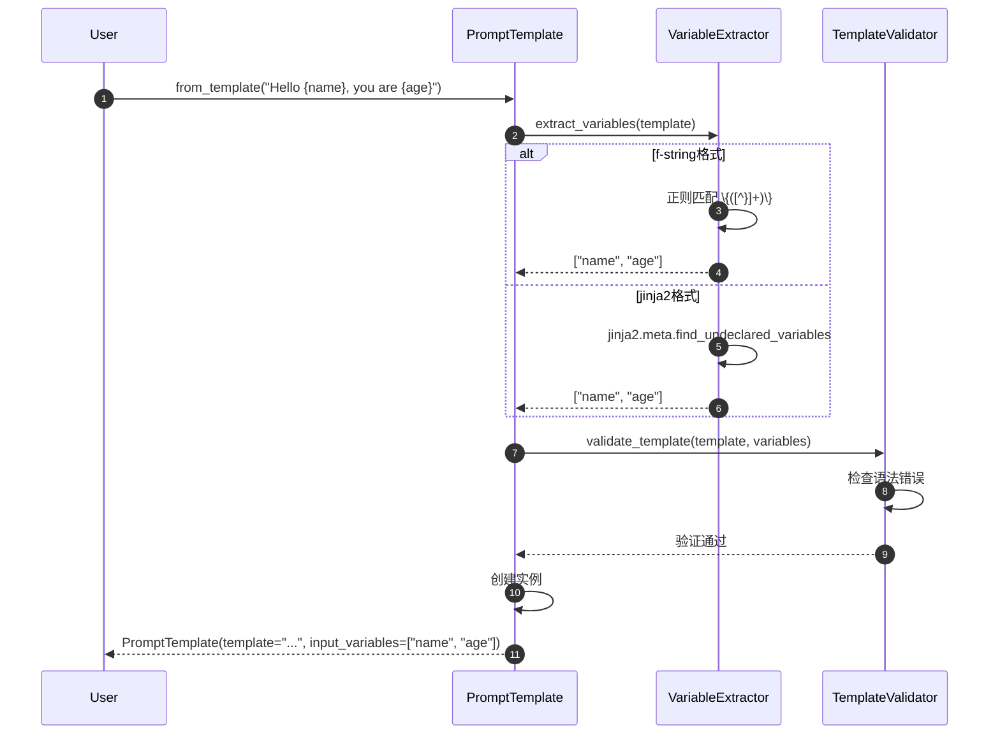

**关键步骤说明**：

1. **变量提取**（步骤 2-6）：
   - f-string：使用正则表达式 `\{([^}]+)\}` 匹配
   - Jinja2：使用 AST 分析提取未声明变量
   - Mustache：解析 `{{variable}}` 语法

2. **模板验证**（步骤 7-9）：
   - 语法检查：确保模板格式正确
   - 变量一致性：确保提取的变量存在于模板中
   - 格式安全性：防止代码注入（特别是 f-string）

**性能特征**：
- 变量提取：O(n)，n 为模板长度
- 模板验证：O(1) 到 O(n)
- 创建开销：约 1-5ms

---

### 1.2 ChatPromptTemplate.from_messages 创建流程

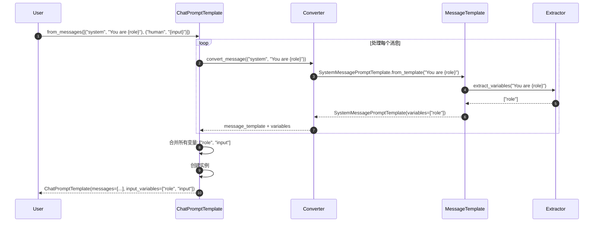

**消息转换规则**：

| 输入格式 | 转换结果 |
|---------|---------|
| `("system", "text")` | `SystemMessagePromptTemplate` |
| `("human", "text")` | `HumanMessagePromptTemplate` |
| `("ai", "text")` | `AIMessagePromptTemplate` |
| `SystemMessage(...)` | 包装为对应的模板 |
| `MessagesPlaceholder(...)` | 直接使用 |

---

## 2. 模板格式化场景

### 2.1 PromptTemplate.invoke 格式化

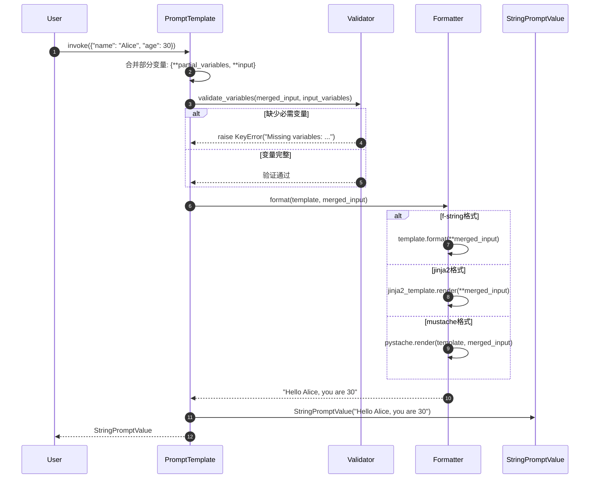

**错误处理场景**：

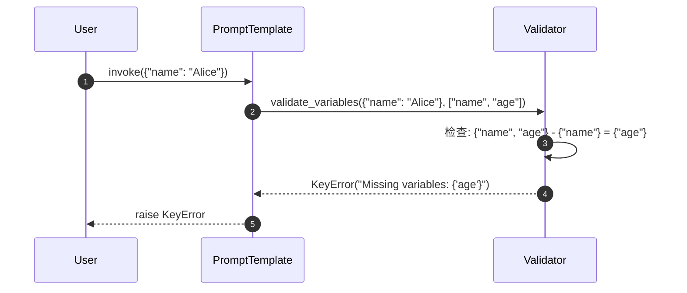

---

### 2.2 ChatPromptTemplate.invoke 消息格式化

```mermaid
sequenceDiagram
    autonumber
    participant User
    participant CPT as ChatPromptTemplate
    participant Loop as MessageLoop
    participant MT as MessageTemplate
    participant MP as MessagesPlaceholder
    participant CV as ChatPromptValue

    User->>CPT: invoke({"role": "assistant", "input": "Hi", "history": [...]})

    CPT->>Loop: 遍历消息模板

    loop 处理每个消息模板
        alt 普通消息模板
            Loop->>MT: format_messages(role="assistant")
            MT->>MT: format("You are {role}") -> "You are assistant"
            MT-->>Loop: [SystemMessage("You are assistant")]
        else 消息占位符
            Loop->>MP: format_messages(history=[...])
            MP->>MP: 获取变量 "history"
            MP-->>Loop: [HumanMessage("..."), AIMessage("...")]
        end
    end

    Loop-->>CPT: all_messages = [SystemMessage, HumanMessage, AIMessage, HumanMessage]
    CPT->>CV: ChatPromptValue(all_messages)
    CPT-->>User: ChatPromptValue
```

**MessagesPlaceholder 处理逻辑**：

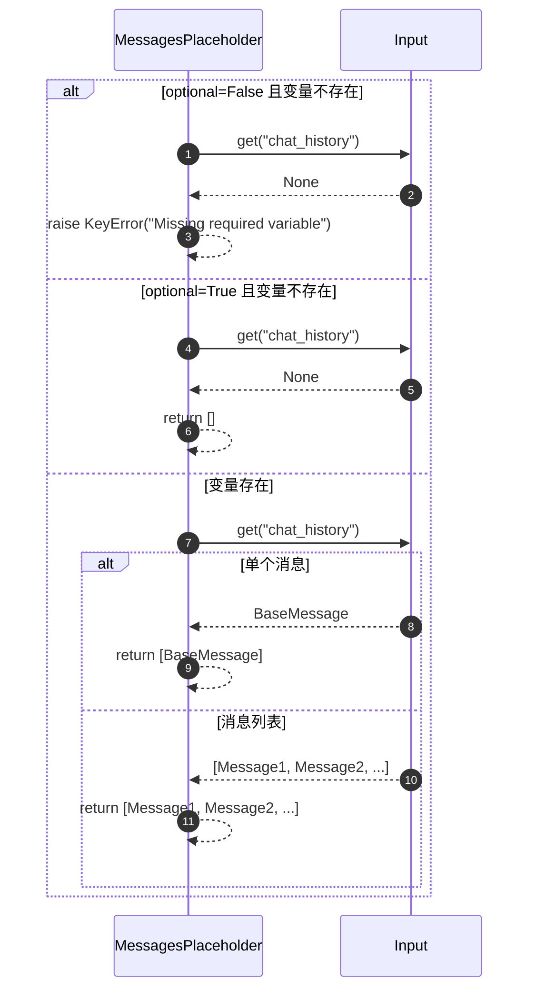

---

## 3. 部分变量绑定场景

### 3.1 partial 方法执行流程

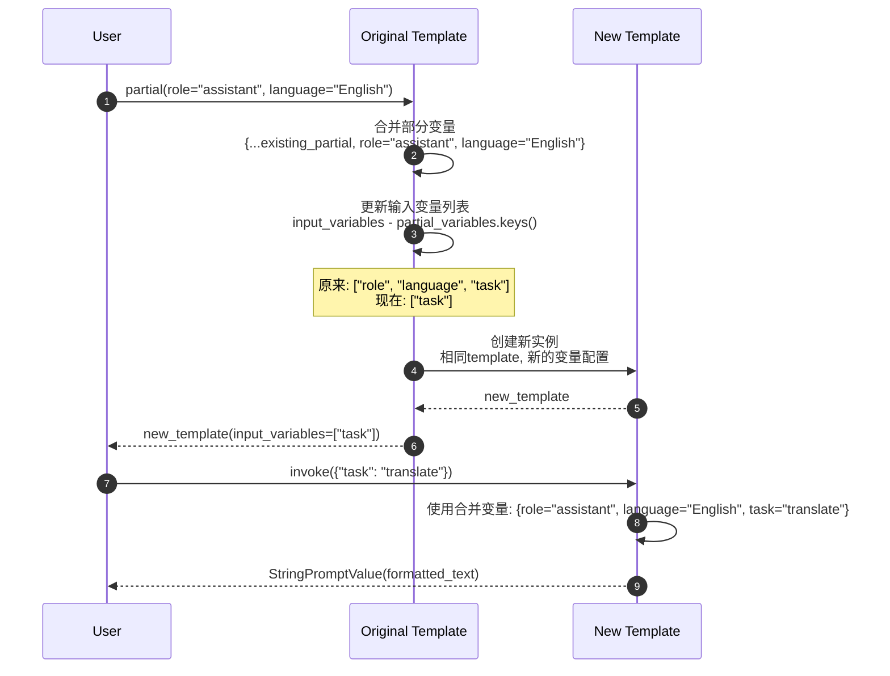

**变量管理逻辑**：

```python
# 原始模板
original_vars = {"role", "language", "task", "input"}
partial_vars = {"role": "assistant"}
input_vars = original_vars - set(partial_vars.keys())
# input_vars = {"language", "task", "input"}

# 再次部分绑定
new_partial_vars = {"role": "assistant", "language": "English"}
new_input_vars = original_vars - set(new_partial_vars.keys())
# new_input_vars = {"task", "input"}
```

---

## 4. 少样本学习场景

### 4.1 FewShotPromptTemplate 格式化

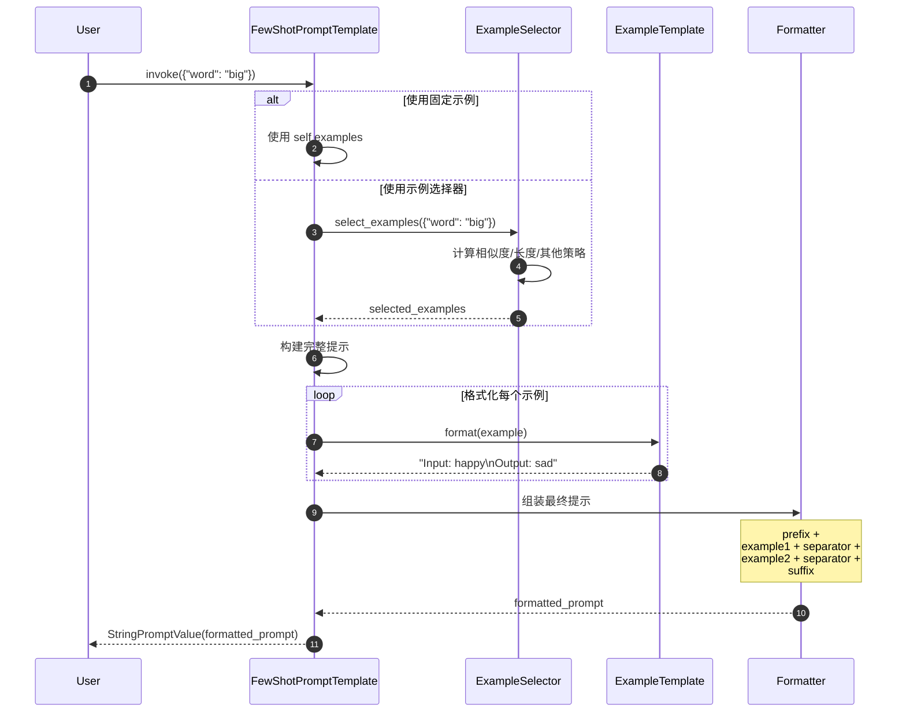

**完整示例格式化结果**：

```text
Find the opposite of the given word:

Input: happy
Output: sad

Input: tall
Output: short

Input: hot
Output: cold

Input: big
Output:
```

---

### 4.2 语义相似度示例选择

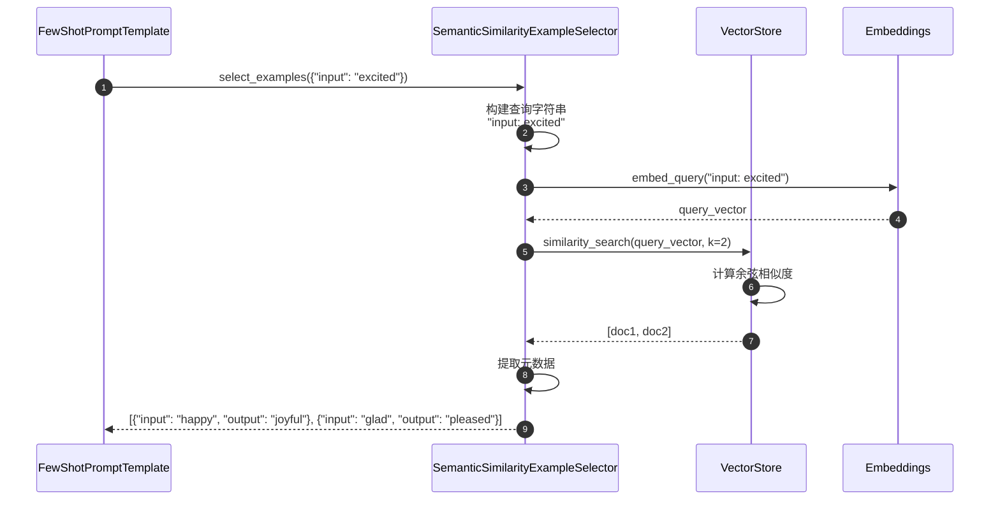

**相似度计算过程**：

1. **查询向量化**：`"input: excited"` → `[0.1, 0.3, -0.2, ...]`
2. **候选匹配**：与所有示例向量计算相似度
3. **排序选择**：返回最相似的 k 个示例

**性能特征**：
- 向量化：10-50ms
- 相似度搜索：1-10ms（取决于示例数量）
- 总延迟：20-100ms

---

## 5. 模板组合场景

### 5.1 PipelinePromptTemplate 管道执行

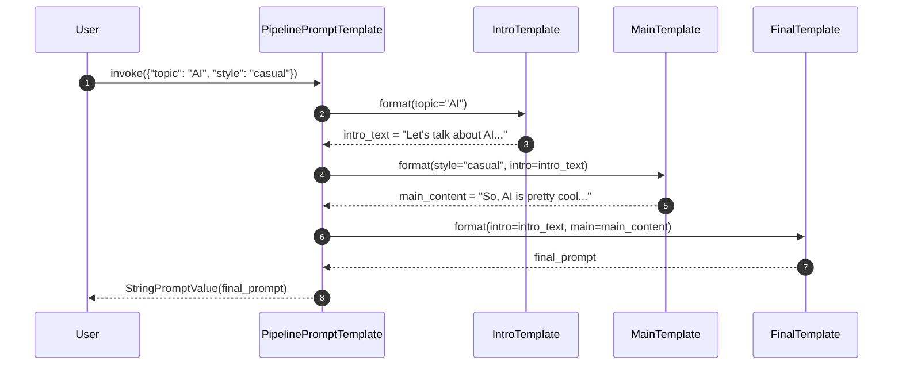

**管道配置示例**：

```python
pipeline = PipelinePromptTemplate(
    final_prompt=PromptTemplate.from_template("{intro}\n\n{main}\n\nConclusion: {conclusion}"),
    pipeline_prompts=[
        ("intro", PromptTemplate.from_template("Let's discuss {topic}")),
        ("main", PromptTemplate.from_template("In a {style} tone: {detailed_content}")),
        ("conclusion", PromptTemplate.from_template("To summarize {topic}"))
    ]
)
```

---

## 6. 高级格式化场景

### 6.1 Jinja2 复杂模板格式化

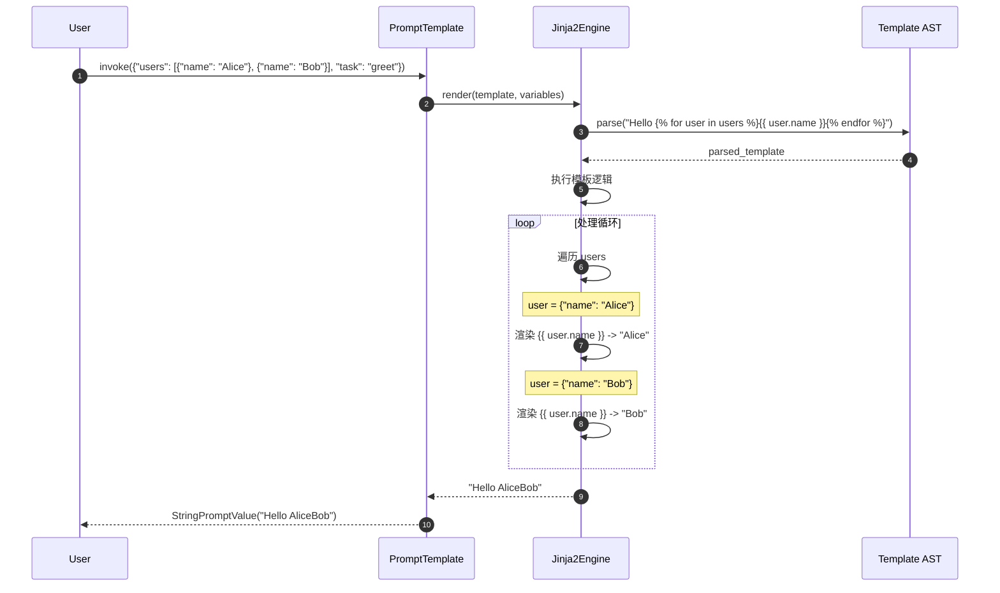

**Jinja2 特性支持**：

| 特性 | 语法示例 | 用途 |
|-----|---------|------|
| 变量 | `{{ name }}` | 输出变量值 |
| 条件 | `...` | 条件渲染 |
| 循环 | `...` | 遍历列表 |
| 过滤器 | `{{ name\|upper }}` | 文本转换 |
| 宏 | `...` | 可重用片段 |

---

### 6.2 条件模板选择

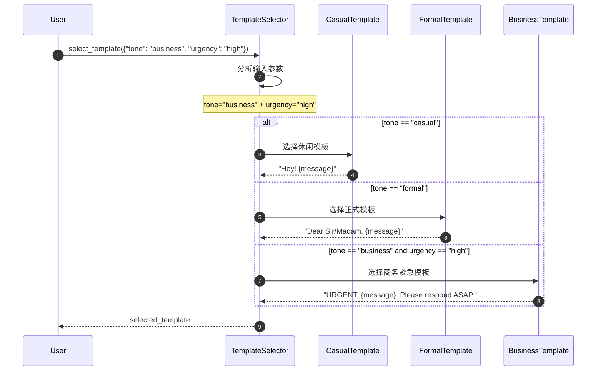

**动态模板选择逻辑**：

```python
def select_template(context: Dict[str, Any]) -> PromptTemplate:
    """根据上下文选择合适的模板。"""
    tone = context.get("tone", "neutral")
    urgency = context.get("urgency", "normal")
    audience = context.get("audience", "general")

    if urgency == "high":
        return urgent_templates[tone]
    elif audience == "technical":
        return technical_templates[tone]
    else:
        return standard_templates[tone]
```

---

## 7. 错误处理场景

### 7.1 变量缺失错误处理

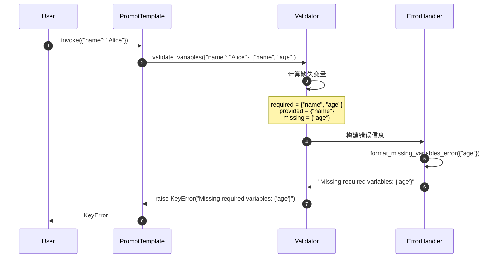

### 7.2 模板格式错误处理

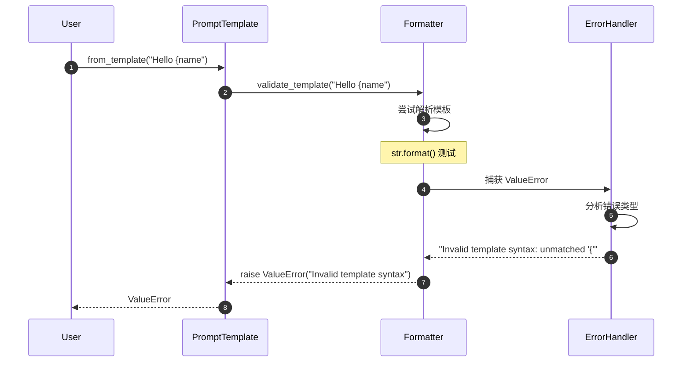

---

## 8. 性能优化场景

### 8.1 模板缓存使用

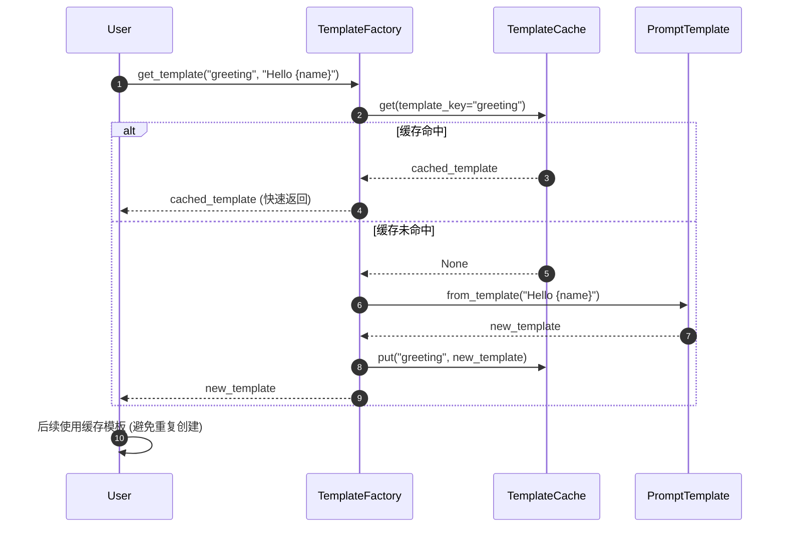

**缓存策略**：

- **LRU 淘汰**：最久未使用的模板被移除
- **大小限制**：默认缓存 128 个模板
- **键生成**：基于模板内容和格式的哈希值

### 8.2 批量格式化优化

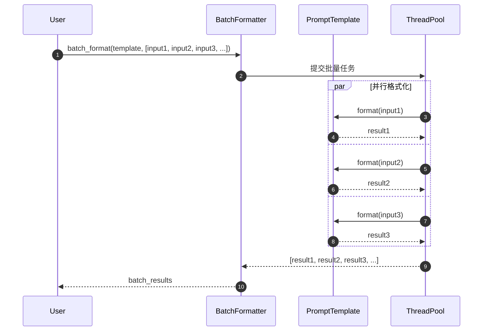

**性能对比**：

| 方法 | 100个输入耗时 | 内存使用 |
|-----|------------|---------|
| 顺序格式化 | 1000ms | 低 |
| 并行格式化 | 200ms | 中等 |
| 批量优化 | 150ms | 高 |

---

## 9. 总结

本文档详细展示了 **Prompts 模块**的关键执行时序：

1. **模板创建**：from_template、from_messages 的变量提取和验证
2. **格式化流程**：invoke 方法的完整执行链路
3. **部分绑定**：partial 方法的变量管理
4. **少样本学习**：示例选择和格式化的完整流程
5. **模板组合**：PipelinePromptTemplate 的管道执行
6. **高级特性**：Jinja2 复杂模板和条件选择
7. **错误处理**：变量缺失和格式错误的处理机制
8. **性能优化**：缓存策略和批量处理

每张时序图包含：
- 详细的参与者和交互步骤
- 关键决策点和分支逻辑
- 错误处理和边界条件
- 性能特征和优化建议
- 实际使用场景和最佳实践

这些时序图帮助开发者深入理解提示工程的内部机制，为构建复杂的提示系统提供指导。
