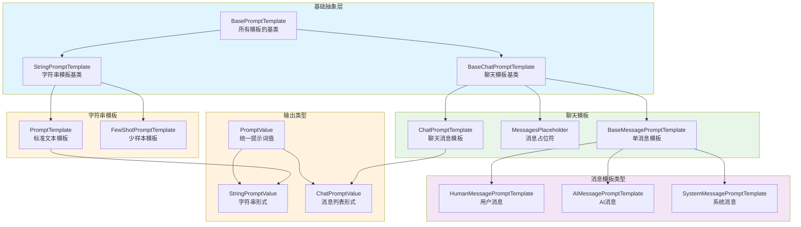
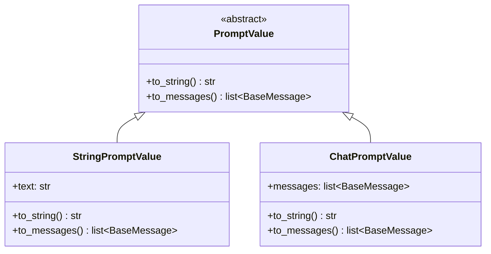
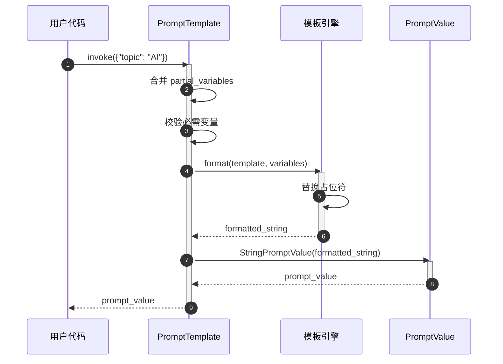
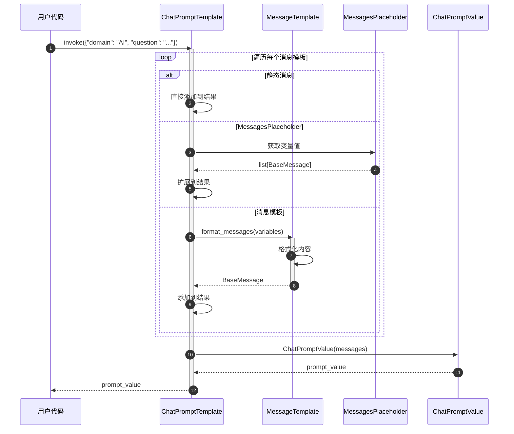
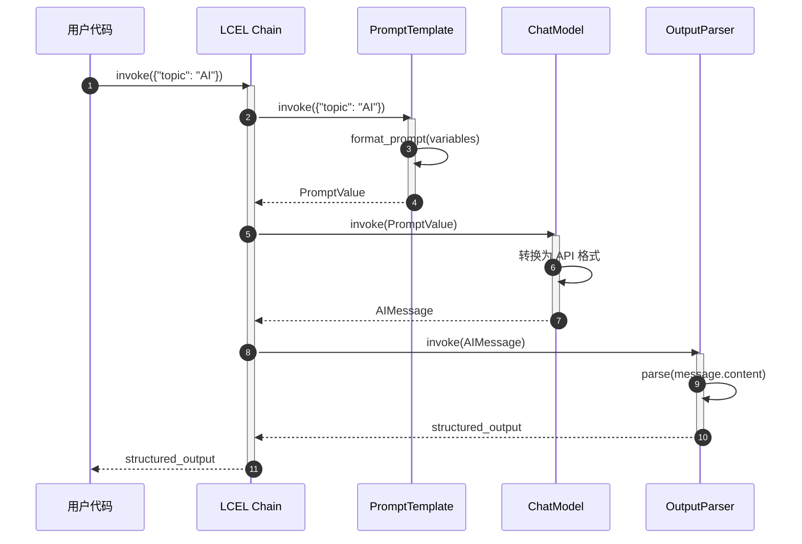

# LangChain-04-Prompts-概览

## 模块基本信息

**模块名称**: langchain-core-prompts
**模块路径**: `libs/core/langchain_core/prompts/`
**核心职责**: 提供灵活的提示词模板系统，支持变量插值、消息构建、少样本学习等功能

## 1. 模块职责

### 1.1 核心职责

Prompts 模块是 LangChain 应用的入口，提供以下核心能力：

1. **模板定义**: 支持 f-string、Jinja2、Mustache 三种模板语法
2. **变量插值**: 动态插入变量到模板中
3. **消息构建**: 为聊天模型构建结构化消息列表
4. **少样本学习**: 通过示例提升模型表现（Few-Shot Learning）
5. **部分变量**: 预填充部分变量，创建可复用模板
6. **消息占位符**: 动态插入对话历史或任意消息列表
7. **管道组合**: 作为 Runnable 可无缝组合到 LCEL 链中

### 1.2 架构层次

```
BasePromptTemplate (所有提示词模板的基类)
├── StringPromptTemplate (字符串模板)
│   ├── PromptTemplate (标准提示词模板)
│   └── FewShotPromptTemplate (少样本提示词模板)
└── BaseChatPromptTemplate (聊天提示词模板)
    ├── ChatPromptTemplate (标准聊天模板)
    └── MessagesPlaceholder (消息占位符)
```

### 1.3 输入/输出

**输入**:
- **格式化参数**: 字典形式的变量值 `{"var1": "value1", "var2": "value2"}`
- **配置**: 可选的 `RunnableConfig`

**输出**:
- **PromptValue**: 统一的提示词值对象
  - `StringPromptValue`: 字符串形式（用于 LLM）
  - `ChatPromptValue`: 消息列表形式（用于聊天模型）

**转换**:
```python
prompt = ChatPromptTemplate.from_template("Hello {name}")
prompt_value = prompt.invoke({"name": "Alice"})

# 可转换为不同格式
str_output = prompt_value.to_string()  # "Hello Alice"
messages = prompt_value.to_messages()  # [HumanMessage(content="Hello Alice")]
```

### 1.4 上下游依赖

**上游调用者**:
- 用户应用代码
- LCEL 链（作为链的第一个组件）

**下游依赖**:
- `langchain_core.messages`: 消息类型（`HumanMessage`、`AIMessage` 等）
- `langchain_core.runnables`: Runnable 协议
- `langchain_core.prompt_values`: PromptValue 类型
- 模板引擎: Jinja2（可选）、`string.Formatter`（内置）

## 2. 模块级架构图



### 架构图详细说明

**1. 基础抽象层**

- **BasePromptTemplate**: 所有提示词模板的根基类
  - 继承自 `RunnableSerializable`，自动支持 LCEL
  - 定义 `input_variables`（必需变量）和 `optional_variables`（可选变量）
  - 强制实现 `format_prompt` 方法返回 `PromptValue`
  - 提供 `invoke` 方法，调用 `format_prompt`

- **StringPromptTemplate**: 字符串模板基类
  - 输出为 `StringPromptValue`
  - 提供 `format` 方法返回字符串
  - 支持三种模板格式：f-string（默认）、jinja2、mustache

- **BaseChatPromptTemplate**: 聊天模板基类
  - 输出为 `ChatPromptValue`（消息列表）
  - 提供 `format_messages` 方法返回 `list[BaseMessage]`
  - 支持消息级别的模板化

**2. 字符串模板实现**

- **PromptTemplate**: 最常用的文本模板
  - 使用 f-string 语法：`"Hello {name}"`
  - 自动推断 `input_variables`
  - 支持部分变量（partial variables）

  ```python
  prompt = PromptTemplate.from_template("Tell me about {topic}")
  # input_variables = ["topic"]
  ```

- **FewShotPromptTemplate**: 少样本学习模板
  - 包含多个示例（examples）
  - 每个示例使用 `example_prompt` 格式化
  - 支持示例选择器（ExampleSelector）动态选择示例

  ```python
  examples = [
      {"input": "happy", "output": "😊"},
      {"input": "sad", "output": "😢"}
  ]
  prompt = FewShotPromptTemplate(
      examples=examples,
      example_prompt=PromptTemplate.from_template("Q: {input}\nA: {output}"),
      suffix="Q: {input}\nA:"
  )
  ```

**3. 聊天模板实现**

- **ChatPromptTemplate**: 聊天消息模板
  - 由多个消息模板组成
  - 支持元组简写：`("system", "You are a helpful assistant")`
  - 支持消息占位符（MessagesPlaceholder）

  ```python
  prompt = ChatPromptTemplate.from_messages([
      ("system", "You are an expert in {domain}"),
      ("human", "{question}")
  ])
  ```

- **MessagesPlaceholder**: 动态插入消息列表
  - 用于插入对话历史
  - 变量值必须是 `list[BaseMessage]`

  ```python
  prompt = ChatPromptTemplate.from_messages([
      ("system", "You are helpful"),
      MessagesPlaceholder(variable_name="history"),
      ("human", "{question}")
  ])
  ```

- **BaseMessagePromptTemplate**: 单个消息的模板
  - 子类：`HumanMessagePromptTemplate`、`AIMessagePromptTemplate`、`SystemMessagePromptTemplate`
  - 格式化后生成对应类型的 `BaseMessage`

**4. 输出类型**

- **PromptValue**: 统一的提示词值抽象
  - 可转换为字符串或消息列表
  - 解耦模板和模型类型

- **StringPromptValue**: 用于文本补全模型
  ```python
  value.to_string()  # "Tell me about AI"
  value.to_messages()  # [HumanMessage(content="Tell me about AI")]
  ```

- **ChatPromptValue**: 用于聊天模型
  ```python
  value.to_messages()  # [SystemMessage(...), HumanMessage(...)]
  value.to_string()  # "System: ...\nHuman: ..."
  ```

## 3. 核心 API 详解

### 3.1 PromptTemplate.from_template - 创建文本模板

**基本信息**:
- **方法**: 类方法
- **签名**: `PromptTemplate.from_template(template: str, template_format: str = "f-string") -> PromptTemplate`

**功能**: 从模板字符串创建提示词模板，自动推断变量。

**参数**:

| 参数名 | 类型 | 默认值 | 说明 |
|--------|------|--------|------|
| `template` | `str` | 必填 | 模板字符串，包含 `{variable}` 占位符 |
| `template_format` | `str` | `"f-string"` | 模板格式：`"f-string"`, `"jinja2"`, `"mustache"` |

**返回值**: `PromptTemplate` 对象

**核心代码**:

```python
class PromptTemplate(StringPromptTemplate):
    template: str
    template_format: str = "f-string"

    @classmethod
    def from_template(
        cls,
        template: str,
        *,
        template_format: str = "f-string",
        **kwargs: Any
    ) -> PromptTemplate:
        """
        从模板字符串创建 PromptTemplate

        参数:
            template: 模板字符串
            template_format: 模板格式
            **kwargs: 额外参数（如 partial_variables）

        返回:
            PromptTemplate 实例
        """
        # 自动推断输入变量
        input_variables = get_template_variables(template, template_format)

        return cls(
            template=template,
            input_variables=input_variables,
            template_format=template_format,
            **kwargs
        )

    def format(self, **kwargs: Any) -> str:
        """
        格式化模板为字符串

        参数:
            **kwargs: 变量值

        返回:
            格式化后的字符串
        """
        # 合并部分变量和运行时变量
        kwargs = self._merge_partial_and_user_variables(**kwargs)

        # 根据模板格式选择格式化方法
        if self.template_format == "f-string":
            return self.template.format(**kwargs)
        elif self.template_format == "jinja2":
            return self._render_jinja2(self.template, kwargs)
        elif self.template_format == "mustache":
            return self._render_mustache(self.template, kwargs)
```

**使用示例**:

```python
from langchain_core.prompts import PromptTemplate

# 基础用法
prompt = PromptTemplate.from_template("Tell me about {topic}")
result = prompt.format(topic="AI")
print(result)  # "Tell me about AI"

# 多变量
prompt = PromptTemplate.from_template(
    "You are a {role}. Answer the question: {question}"
)
result = prompt.format(role="teacher", question="What is Python?")

# 在 LCEL 链中使用
chain = prompt | model | parser
output = chain.invoke({"topic": "Machine Learning"})

# Jinja2 模板
prompt = PromptTemplate.from_template(
    "{{ item }}",
    template_format="jinja2"
)
```

### 3.2 ChatPromptTemplate.from_messages - 创建聊天模板

**基本信息**:
- **方法**: 类方法
- **签名**: `ChatPromptTemplate.from_messages(messages: list[MessageLike]) -> ChatPromptTemplate`

**功能**: 从消息列表创建聊天提示词模板。

**参数**:

| 参数名 | 类型 | 说明 |
|--------|------|------|
| `messages` | `list[MessageLike]` | 消息列表，支持多种格式 |

**MessageLike 类型**:
1. **元组简写**: `("role", "content")`
   - role: `"system"`, `"human"`, `"ai"`, `"placeholder"`
2. **消息对象**: `HumanMessage(content="...")`, `SystemMessage(content="...")`
3. **消息模板**: `HumanMessagePromptTemplate.from_template("...")`
4. **占位符**: `MessagesPlaceholder(variable_name="history")`

**核心代码**:

```python
class ChatPromptTemplate(BaseChatPromptTemplate):
    messages: list[MessageLike]

    @classmethod
    def from_messages(
        cls,
        messages: list[MessageLike]
    ) -> ChatPromptTemplate:
        """
        从消息列表创建聊天模板

        参数:
            messages: 消息列表，支持元组、消息对象、模板等

        返回:
            ChatPromptTemplate 实例
        """
        # 转换为标准消息模板
        _messages = []
        for message in messages:
            _messages.append(_convert_to_message(message))

        return cls(messages=_messages)

    def format_messages(self, **kwargs: Any) -> list[BaseMessage]:
        """
        格式化为消息列表

        参数:
            **kwargs: 变量值

        返回:
            格式化后的消息列表
        """
        result = []
        for message_template in self.messages:
            # 格式化每个消息模板
            if isinstance(message_template, MessagesPlaceholder):
                # 占位符：直接插入消息列表
                messages = kwargs[message_template.variable_name]
                result.extend(messages)
            elif isinstance(message_template, BaseMessage):
                # 静态消息：直接添加
                result.append(message_template)
            else:
                # 消息模板：格式化后添加
                result.extend(message_template.format_messages(**kwargs))

        return result
```

**使用示例**:

```python
from langchain_core.prompts import ChatPromptTemplate, MessagesPlaceholder

# 基础用法：元组简写
prompt = ChatPromptTemplate.from_messages([
    ("system", "You are an expert in {domain}"),
    ("human", "{question}")
])

messages = prompt.format_messages(domain="Python", question="What is a decorator?")
# [
#   SystemMessage(content="You are an expert in Python"),
#   HumanMessage(content="What is a decorator?")
# ]

# 带对话历史
prompt = ChatPromptTemplate.from_messages([
    ("system", "You are helpful"),
    MessagesPlaceholder(variable_name="history"),
    ("human", "{question}")
])

history = [
    HumanMessage(content="Hi"),
    AIMessage(content="Hello! How can I help?")
]
messages = prompt.format_messages(history=history, question="Tell me more")

# 在 LCEL 链中使用
chain = prompt | model | parser
result = chain.invoke({"domain": "AI", "question": "What is ML?"})
```

### 3.3 partial - 部分变量填充

**功能**: 预填充部分变量，创建可复用的模板。

**使用场景**:
- 固定某些变量（如系统提示）
- 延迟注入动态值（如当前时间）

**核心代码**:

```python
def partial(self, **kwargs: Any) -> BasePromptTemplate:
    """
    创建部分填充的模板副本

    参数:
        **kwargs: 要预填充的变量

    返回:
        新的模板实例
    """
    prompt_dict = self.__dict__.copy()
    prompt_dict["input_variables"] = [
        v for v in self.input_variables if v not in kwargs
    ]
    prompt_dict["partial_variables"] = {
        **self.partial_variables,
        **kwargs
    }
    return self.__class__(**prompt_dict)
```

**使用示例**:

```python
# 预填充固定变量
base_prompt = PromptTemplate.from_template(
    "You are a {role}. Answer: {question}"
)
teacher_prompt = base_prompt.partial(role="teacher")
result = teacher_prompt.format(question="What is Python?")
# "You are a teacher. Answer: What is Python?"

# 延迟注入动态值
from datetime import datetime

def get_current_time():
    return datetime.now().strftime("%Y-%m-%d %H:%M:%S")

prompt = PromptTemplate.from_template(
    "Current time: {time}. Question: {question}"
)
prompt_with_time = prompt.partial(time=get_current_time)

# 每次调用时，time 会自动获取当前时间
result = prompt_with_time.format(question="What's the weather?")
```

### 3.4 FewShotPromptTemplate - 少样本学习

**功能**: 通过提供示例来引导模型生成。

**核心组件**:
- **examples**: 示例列表
- **example_prompt**: 单个示例的格式化模板
- **prefix**: 示例前的说明
- **suffix**: 示例后的提示（通常包含新问题）
- **example_selector**: 动态选择示例（可选）

**使用示例**:

```python
from langchain_core.prompts import FewShotPromptTemplate, PromptTemplate

# 定义示例
examples = [
    {"word": "happy", "antonym": "sad"},
    {"word": "tall", "antonym": "short"},
    {"word": "hot", "antonym": "cold"}
]

# 单个示例的格式
example_prompt = PromptTemplate.from_template("Word: {word}\nAntonym: {antonym}")

# 创建少样本模板
few_shot_prompt = FewShotPromptTemplate(
    examples=examples,
    example_prompt=example_prompt,
    prefix="Give the antonym of each word:",
    suffix="Word: {input}\nAntonym:",
    input_variables=["input"]
)

result = few_shot_prompt.format(input="big")
# Give the antonym of each word:
#
# Word: happy
# Antonym: sad
#
# Word: tall
# Antonym: short
#
# Word: hot
# Antonym: cold
#
# Word: big
# Antonym:

# 使用示例选择器（动态选择最相关的示例）
from langchain_core.example_selectors import SemanticSimilarityExampleSelector
from langchain_openai import OpenAIEmbeddings
from langchain_chroma import Chroma

example_selector = SemanticSimilarityExampleSelector.from_examples(
    examples,
    OpenAIEmbeddings(),
    Chroma,
    k=2  # 选择最相关的 2 个示例
)

few_shot_prompt = FewShotPromptTemplate(
    example_selector=example_selector,
    example_prompt=example_prompt,
    suffix="Word: {input}\nAntonym:",
    input_variables=["input"]
)
```

## 4. 关键数据结构

### 4.1 PromptValue 及其子类



**字段说明**:

| 类 | 字段 | 类型 | 说明 |
|---|------|------|------|
| `StringPromptValue` | `text` | `str` | 字符串形式的提示词 |
| `ChatPromptValue` | `messages` | `list[BaseMessage]` | 消息列表形式的提示词 |

**转换方法**:

```python
# StringPromptValue
value = StringPromptValue(text="Hello World")
value.to_string()  # "Hello World"
value.to_messages()  # [HumanMessage(content="Hello World")]

# ChatPromptValue
value = ChatPromptValue(messages=[
    SystemMessage(content="You are helpful"),
    HumanMessage(content="Hi")
])
value.to_messages()  # [SystemMessage(...), HumanMessage(...)]
value.to_string()  # "System: You are helpful\nHuman: Hi"
```

### 4.2 BasePromptTemplate 配置

```python
class BasePromptTemplate(RunnableSerializable):
    input_variables: list[str]  # 必需变量
    optional_variables: list[str] = []  # 可选变量
    partial_variables: dict[str, Any] = {}  # 部分变量
    metadata: Optional[dict[str, Any]] = None  # 元数据
    tags: Optional[list[str]] = None  # 标签
    output_parser: Optional[BaseOutputParser] = None  # 输出解析器
```

## 5. 核心流程时序图

### 5.1 PromptTemplate 格式化流程



**流程说明**:

1. **调用入口**: 用户通过 `invoke` 方法传入变量字典
2. **变量合并**: 合并 `partial_variables` 和运行时变量
3. **变量校验**: 检查所有必需变量是否提供
4. **模板格式化**:
   - f-string: 使用 Python `str.format()`
   - Jinja2: 使用 Jinja2 模板引擎
   - Mustache: 使用 Mustache 解析器
5. **创建 PromptValue**: 封装为 `StringPromptValue`
6. **返回结果**: 返回 `PromptValue` 对象

### 5.2 ChatPromptTemplate 格式化流程



**流程说明**:

1. **调用入口**: 传入所有变量（包括占位符变量）
2. **遍历消息模板**: 依次处理每个消息
3. **处理静态消息**: 无需格式化，直接添加
4. **处理占位符**:
   - 从变量中获取消息列表
   - 展开（extend）到结果列表
5. **处理消息模板**:
   - 调用 `format_messages` 格式化内容
   - 生成对应类型的 `BaseMessage`
6. **创建 PromptValue**: 封装为 `ChatPromptValue`
7. **返回结果**: 返回包含完整消息列表的 `PromptValue`

### 5.3 LCEL 链中的提示词流程



**流程说明**:

1. **链式调用**: `prompt | model | parser`
2. **提示词格式化**: Prompt 将输入转换为 PromptValue
3. **模型调用**: Model 接收 PromptValue 并转换为 API 格式
4. **输出解析**: Parser 解析模型输出
5. **类型安全**: PromptValue 解耦了提示词和模型类型

## 6. 模板格式对比

### 6.1 三种模板格式

| 特性 | f-string | Jinja2 | Mustache |
|------|----------|--------|----------|
| **语法** | `{variable}` | `{{ variable }}` | `{{variable}}` |
| **条件** | ❌ 不支持 | ✅ `` | ✅ `{{#condition}}` |
| **循环** | ❌ 不支持 | ✅ `` | ✅ `{{#items}}` |
| **过滤器** | ❌ 不支持 | ✅ `{{ var\|upper }}` | ❌ 不支持 |
| **性能** | ⚡ 最快 | 🐢 较慢 | 🐌 最慢 |
| **安全性** | ✅ 安全 | ⚠️ 沙箱模式 | ✅ 安全 |
| **推荐场景** | 简单变量替换 | 复杂逻辑 | 跨语言模板 |

### 6.2 使用示例

**f-string（推荐）**:
```python
prompt = PromptTemplate.from_template(
    "You are a {role}. Answer: {question}"
)
```

**Jinja2（复杂逻辑）**:
```python
prompt = PromptTemplate.from_template(
    """
    
    You have access to advanced features.
    
    You have access to basic features.
    

    Question: {{ question }}
    """,
    template_format="jinja2"
)
```

**Mustache（跨平台）**:
```python
prompt = PromptTemplate.from_template(
    """
    Hello {{name}}!
    {{#items}}
      - {{.}}
    {{/items}}
    """,
    template_format="mustache"
)
```

## 7. 最佳实践

### 7.1 选择合适的模板类型

**使用 PromptTemplate（文本模板）**:
- ❌ 不推荐：新项目不应使用（推荐聊天模型）
- ✅ 适用场景：
  - 遗留代码维护
  - 特定的文本补全任务
  - 简单的模板测试

**使用 ChatPromptTemplate（聊天模板）**:
- ✅ 推荐：新项目首选
- 优势：
  - 结构化消息管理
  - 支持系统提示
  - 更好的多轮对话支持
  - 工具调用友好

### 7.2 提示词工程技巧

**明确角色和任务**:
```python
prompt = ChatPromptTemplate.from_messages([
    ("system", "You are an expert {domain} tutor. Explain concepts clearly with examples."),
    ("human", "{question}")
])
```

**使用少样本学习**:
```python
# 通过示例引导输出格式
examples = [
    {"input": "2+2", "output": "4"},
    {"input": "3*5", "output": "15"}
]
few_shot_prompt = FewShotPromptTemplate(...)
```

**拆分复杂提示词**:
```python
# ❌ 不推荐：全部塞在一个字符串
prompt = "You are... Do this... Consider that... Output format..."

# ✅ 推荐：结构化拆分
prompt = ChatPromptTemplate.from_messages([
    ("system", "You are a helpful assistant."),
    ("human", "Context: {context}"),
    ("human", "Task: {task}"),
    ("human", "Output format: {format}"),
    ("human", "Question: {question}")
])
```

### 7.3 部分变量的有效使用

**固定系统提示**:
```python
base_prompt = ChatPromptTemplate.from_messages([
    ("system", "{system_message}"),
    ("human", "{question}")
])

# 为不同角色创建专用提示
teacher_prompt = base_prompt.partial(
    system_message="You are a patient teacher."
)
expert_prompt = base_prompt.partial(
    system_message="You are a domain expert."
)
```

**动态时间戳**:
```python
def get_timestamp():
    return datetime.now().isoformat()

prompt = PromptTemplate.from_template(
    "[{timestamp}] User query: {query}"
).partial(timestamp=get_timestamp)

# 每次调用时自动获取当前时间
```

### 7.4 消息占位符管理对话历史

```python
from langchain_core.runnables import RunnableWithMessageHistory
from langchain.memory import ChatMessageHistory

prompt = ChatPromptTemplate.from_messages([
    ("system", "You are helpful"),
    MessagesPlaceholder(variable_name="history"),
    ("human", "{question}")
])

chain = prompt | model

# 手动管理历史
history = ChatMessageHistory()
history.add_user_message("Hi")
history.add_ai_message("Hello!")

result = chain.invoke({
    "history": history.messages,
    "question": "What's the weather?"
})

# 或使用 RunnableWithMessageHistory 自动管理
chain_with_history = RunnableWithMessageHistory(
    chain,
    get_session_history=lambda session_id: ChatMessageHistory(),
    input_messages_key="question",
    history_messages_key="history"
)
```

### 7.5 输出解析器集成

```python
from langchain_core.output_parsers import PydanticOutputParser
from pydantic import BaseModel, Field

class Person(BaseModel):
    name: str = Field(description="Person's name")
    age: int = Field(description="Person's age")

parser = PydanticOutputParser(pydantic_object=Person)

prompt = ChatPromptTemplate.from_messages([
    ("system", "Extract person information."),
    ("human", "{text}"),
    ("human", "Format instructions: {format_instructions}")
])

chain = (
    prompt.partial(format_instructions=parser.get_format_instructions())
    | model
    | parser
)

result = chain.invoke({"text": "John is 30 years old"})
# Person(name="John", age=30)
```

### 7.6 避免的反模式

**❌ 硬编码变量值**:
```python
# 不推荐
prompt = PromptTemplate.from_template("You are a teacher. Answer: {question}")
```

**✅ 使用变量和部分变量**:
```python
# 推荐
prompt = PromptTemplate.from_template("You are a {role}. Answer: {question}")
teacher_prompt = prompt.partial(role="teacher")
```

**❌ 字符串拼接构建提示词**:
```python
# 不推荐
prompt_str = "System: " + system_msg + "\nUser: " + user_msg
```

**✅ 使用 ChatPromptTemplate**:
```python
# 推荐
prompt = ChatPromptTemplate.from_messages([
    ("system", system_msg),
    ("human", user_msg)
])
```

**❌ 忽略输入验证**:
```python
# 可能抛出 KeyError
result = prompt.format(wrong_key="value")
```

**✅ 使用 invoke 自动验证**:
```python
# 自动验证必需变量
result = prompt.invoke({"correct_key": "value"})
```

## 8. 与其他模块的协作

### 8.1 与 Language Models 协作

```python
# 提示词 → 模型
chain = prompt | model
result = chain.invoke({"question": "What is AI?"})
```

### 8.2 与 Output Parsers 协作

```python
# 提示词 → 模型 → 解析器
chain = prompt | model | JsonOutputParser()
structured_result = chain.invoke(input)
```

### 8.3 与 Retrievers 协作（RAG）

```python
from langchain_core.runnables import RunnablePassthrough

# 检索 → 格式化 → 提示词 → 模型
rag_chain = (
    {"context": retriever, "question": RunnablePassthrough()}
    | prompt
    | model
    | StrOutputParser()
)
```

### 8.4 与 Agents 协作

```python
# Agents 使用提示词构建推理提示
agent = create_openai_functions_agent(
    llm=model,
    tools=tools,
    prompt=prompt  # 包含工具描述和推理指导
)
```

## 9. 总结

Prompts 模块是 LangChain 应用的入口，通过灵活的模板系统实现：

1. **声明式定义**: 使用模板语法而非字符串拼接
2. **类型安全**: PromptValue 解耦提示词和模型类型
3. **可复用性**: 部分变量和模板组合
4. **结构化**: 聊天模板支持多角色消息
5. **少样本学习**: FewShotPromptTemplate 提升模型表现
6. **LCEL 集成**: 作为 Runnable 无缝组合

**关键原则**:
- 优先使用 `ChatPromptTemplate`
- 使用变量而非硬编码
- 结构化拆分复杂提示词
- 利用部分变量提高复用性
- 通过示例引导模型输出

---

**文档版本**: v1.0
**最后更新**: 2025-10-03
**相关文档**:
- LangChain-00-总览.md
- LangChain-03-LanguageModels-概览.md
- LangChain-05-OutputParsers-概览.md（待生成）

