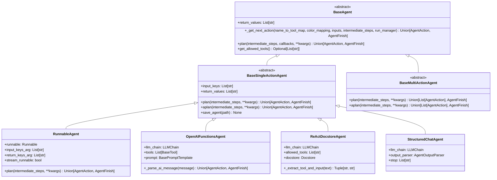
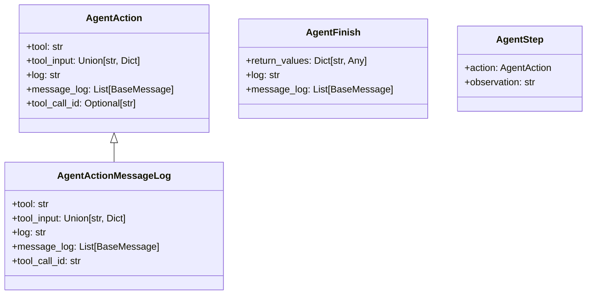
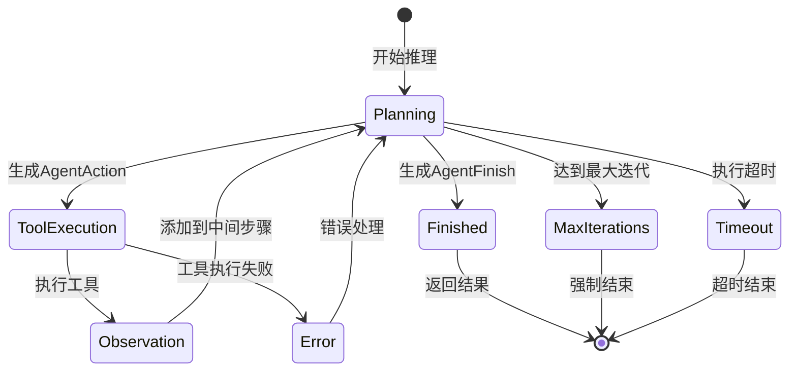

# LangChain-05-Agents-数据结构

## 文档说明

本文档详细描述 **Agents 模块**的核心数据结构，包括Agent类层次、执行状态、动作表示、工具管理、推理循环等。所有结构均配备 UML 类图和详细的字段说明。

---

## 1. Agent 类层次结构

### 1.1 Agent 基类层次



**图解说明**：

1. **抽象基类**：
   - `BaseAgent`：所有Agent的根基类
   - `BaseSingleActionAgent`：单动作Agent（每次返回一个动作）
   - `BaseMultiActionAgent`：多动作Agent（每次返回多个动作）

2. **具体实现**：
   - `RunnableAgent`：基于Runnable的现代Agent
   - `OpenAIFunctionsAgent`：使用OpenAI函数调用
   - `ReActDocstoreAgent`：ReAct模式的文档存储Agent
   - `StructuredChatAgent`：结构化聊天Agent

3. **核心方法**：
   - `plan()`：规划下一步动作的核心方法
   - `_parse_ai_message()`：解析AI消息为动作

---

## 2. AgentExecutor 数据结构

### 2.1 核心字段

```python
class AgentExecutor(Chain):
    """Agent执行器，管理推理-行动循环。"""
    
    agent: Union[BaseSingleActionAgent, BaseMultiActionAgent, Runnable]
    tools: Sequence[BaseTool]
    return_intermediate_steps: bool = False
    max_iterations: Optional[int] = 15
    max_execution_time: Optional[float] = None
    early_stopping_method: str = "force"
    handle_parsing_errors: Union[bool, str, Callable[[OutputParserException], str]] = False
    trim_intermediate_steps: Union[int, Callable[[List[Tuple[AgentAction, str]]], List[Tuple[AgentAction, str]]]] = -1
    
    # 内部状态
    _intermediate_steps: List[Tuple[AgentAction, str]]
    _iterations: int = 0
    _time_elapsed: float = 0.0
```

**字段表**：

| 字段 | 类型 | 必填 | 默认 | 说明 |
|-----|------|-----|------|------|
| agent | `Union[BaseSingleActionAgent, BaseMultiActionAgent, Runnable]` | 是 | - | Agent实例 |
| tools | `Sequence[BaseTool]` | 是 | - | 可用工具列表 |
| return_intermediate_steps | `bool` | 否 | `False` | 是否返回中间步骤 |
| max_iterations | `int` | 否 | `15` | 最大迭代次数 |
| max_execution_time | `float` | 否 | `None` | 最大执行时间（秒） |
| early_stopping_method | `str` | 否 | `"force"` | 早停方法：`"force"` 或 `"generate"` |
| handle_parsing_errors | `Union[bool, str, Callable]` | 否 | `False` | 解析错误处理策略 |
| trim_intermediate_steps | `Union[int, Callable]` | 否 | `-1` | 中间步骤修剪策略 |

### 2.2 执行状态管理

```python
class AgentExecutionState:
    """Agent执行状态。"""
    
    def __init__(self):
        self.intermediate_steps: List[Tuple[AgentAction, str]] = []
        self.iterations: int = 0
        self.time_elapsed: float = 0.0
        self.start_time: float = time.time()
        self.is_finished: bool = False
        self.final_output: Optional[AgentFinish] = None
        self.error: Optional[Exception] = None
    
    def add_step(self, action: AgentAction, observation: str) -> None:
        """添加执行步骤。"""
        self.intermediate_steps.append((action, observation))
        self.iterations += 1
        self.time_elapsed = time.time() - self.start_time
    
    def should_continue(self, max_iterations: int, max_time: float) -> bool:
        """检查是否应该继续执行。"""
        if self.is_finished:
            return False
        
        if max_iterations and self.iterations >= max_iterations:
            return False
        
        if max_time and self.time_elapsed >= max_time:
            return False
        
        return True
    
    def get_execution_info(self) -> Dict[str, Any]:
        """获取执行信息。"""
        return {
            "iterations": self.iterations,
            "time_elapsed": self.time_elapsed,
            "steps_count": len(self.intermediate_steps),
            "is_finished": self.is_finished,
            "has_error": self.error is not None
        }
```

---

## 3. Agent 动作数据结构

### 3.1 动作类型层次



**字段详解**：

#### AgentAction

```python
class AgentAction(NamedTuple):
    """Agent决定执行的动作。"""
    tool: str                           # 工具名称
    tool_input: Union[str, Dict]        # 工具输入参数
    log: str                           # 推理过程日志
    message_log: List[BaseMessage] = [] # 消息历史
    tool_call_id: Optional[str] = None  # 工具调用ID（用于追踪）
```

**字段说明**：

| 字段 | 类型 | 说明 |
|-----|------|------|
| tool | `str` | 要调用的工具名称，必须在可用工具列表中 |
| tool_input | `Union[str, Dict]` | 工具输入，可以是字符串或结构化字典 |
| log | `str` | Agent的推理过程记录 |
| message_log | `List[BaseMessage]` | 完整的消息交互历史 |
| tool_call_id | `str` | 工具调用的唯一标识符 |

#### AgentFinish

```python
class AgentFinish(NamedTuple):
    """Agent完成任务的最终结果。"""
    return_values: Dict[str, Any]       # 返回值字典
    log: str                           # 推理过程日志
    message_log: List[BaseMessage] = [] # 消息历史
```

**使用示例**：

```python
# 创建Agent动作
action = AgentAction(
    tool="web_search",
    tool_input={"query": "LangChain tutorials", "max_results": 5},
    log="I need to search for LangChain tutorials to help the user",
    tool_call_id="call_abc123"
)

# 创建Agent完成
finish = AgentFinish(
    return_values={
        "output": "Based on my search, here are the best LangChain tutorials..."
    },
    log="I have found the information requested and can provide a comprehensive answer"
)

# 创建Agent步骤
step = AgentStep(
    action=action,
    observation="Found 5 tutorials about LangChain on various websites..."
)
```

---

## 4. 工具管理数据结构

### 4.1 工具名称映射

```python
class ToolNameMapping:
    """工具名称映射管理。"""
    
    def __init__(self, tools: Sequence[BaseTool]):
        self.tools = tools
        self.name_to_tool_map = {tool.name: tool for tool in tools}
        self.tool_names = list(self.name_to_tool_map.keys())
    
    def get_tool(self, name: str) -> Optional[BaseTool]:
        """根据名称获取工具。"""
        return self.name_to_tool_map.get(name)
    
    def validate_tool_name(self, name: str) -> bool:
        """验证工具名称是否有效。"""
        return name in self.name_to_tool_map
    
    def get_tool_description(self, name: str) -> str:
        """获取工具描述。"""
        tool = self.get_tool(name)
        return tool.description if tool else f"Unknown tool: {name}"
    
    def to_dict(self) -> Dict[str, str]:
        """转换为字典格式。"""
        return {
            name: tool.description 
            for name, tool in self.name_to_tool_map.items()
        }
```

### 4.2 工具调用结果

```python
class ToolCallResult:
    """工具调用结果。"""
    
    def __init__(
        self,
        tool_name: str,
        tool_input: Union[str, Dict],
        result: Any,
        execution_time: float,
        success: bool = True,
        error: Optional[Exception] = None
    ):
        self.tool_name = tool_name
        self.tool_input = tool_input
        self.result = result
        self.execution_time = execution_time
        self.success = success
        self.error = error
        self.timestamp = time.time()
    
    def to_observation(self) -> str:
        """转换为观察字符串。"""
        if self.success:
            return str(self.result)
        else:
            return f"Error: {self.error}"
    
    def to_dict(self) -> Dict[str, Any]:
        """转换为字典。"""
        return {
            "tool_name": self.tool_name,
            "tool_input": self.tool_input,
            "result": self.result,
            "execution_time": self.execution_time,
            "success": self.success,
            "error": str(self.error) if self.error else None,
            "timestamp": self.timestamp
        }
```

---

## 5. 推理循环数据结构

### 5.1 循环状态机



### 5.2 推理循环控制器

```python
class ReasoningLoopController:
    """推理循环控制器。"""
    
    def __init__(
        self,
        agent: Union[BaseSingleActionAgent, BaseMultiActionAgent],
        tools: Sequence[BaseTool],
        max_iterations: int = 15,
        max_execution_time: Optional[float] = None
    ):
        self.agent = agent
        self.tools = tools
        self.max_iterations = max_iterations
        self.max_execution_time = max_execution_time
        self.tool_mapping = ToolNameMapping(tools)
        
    def execute_loop(self, inputs: Dict[str, Any]) -> Dict[str, Any]:
        """执行推理循环。"""
        state = AgentExecutionState()
        
        while state.should_continue(self.max_iterations, self.max_execution_time or float('inf')):
            try:
                # Agent推理
                next_step = self.agent.plan(
                    intermediate_steps=state.intermediate_steps,
                    **inputs
                )
                
                # 检查是否完成
                if isinstance(next_step, AgentFinish):
                    state.final_output = next_step
                    state.is_finished = True
                    break
                
                # 执行动作
                if isinstance(next_step, AgentAction):
                    observation = self._execute_action(next_step)
                    state.add_step(next_step, observation)
                
            except Exception as e:
                state.error = e
                if not self._handle_error(e, state):
                    break
        
        return self._build_result(state, inputs)
    
    def _execute_action(self, action: AgentAction) -> str:
        """执行Agent动作。"""
        tool = self.tool_mapping.get_tool(action.tool)
        if not tool:
            return f"Error: Tool '{action.tool}' not found"
        
        try:
            start_time = time.time()
            result = tool.invoke(action.tool_input)
            execution_time = time.time() - start_time
            
            # 记录工具调用结果
            call_result = ToolCallResult(
                tool_name=action.tool,
                tool_input=action.tool_input,
                result=result,
                execution_time=execution_time,
                success=True
            )
            
            return call_result.to_observation()
            
        except Exception as e:
            call_result = ToolCallResult(
                tool_name=action.tool,
                tool_input=action.tool_input,
                result=None,
                execution_time=0.0,
                success=False,
                error=e
            )
            return call_result.to_observation()
```

---

## 6. 提示构建数据结构

### 6.1 Scratchpad 管理器

```python
class AgentScratchpadManager:
    """Agent草稿纸管理器，构建中间步骤的文本表示。"""
    
    def __init__(self, format_type: str = "default"):
        self.format_type = format_type
        self.formatters = {
            "default": self._format_default,
            "react": self._format_react,
            "openai_tools": self._format_openai_tools,
            "structured": self._format_structured
        }
    
    def format_steps(self, intermediate_steps: List[Tuple[AgentAction, str]]) -> str:
        """格式化中间步骤为文本。"""
        formatter = self.formatters.get(self.format_type, self._format_default)
        return formatter(intermediate_steps)
    
    def _format_default(self, steps: List[Tuple[AgentAction, str]]) -> str:
        """默认格式化。"""
        if not steps:
            return ""
        
        formatted_steps = []
        for action, observation in steps:
            formatted_steps.append(f"Action: {action.tool}")
            formatted_steps.append(f"Action Input: {action.tool_input}")
            formatted_steps.append(f"Observation: {observation}")
        
        return "\n".join(formatted_steps)
    
    def _format_react(self, steps: List[Tuple[AgentAction, str]]) -> str:
        """ReAct格式化。"""
        if not steps:
            return ""
        
        formatted_steps = []
        for i, (action, observation) in enumerate(steps):
            formatted_steps.append(f"Thought {i+1}: {action.log}")
            formatted_steps.append(f"Action {i+1}: {action.tool}")
            formatted_steps.append(f"Action Input {i+1}: {action.tool_input}")
            formatted_steps.append(f"Observation {i+1}: {observation}")
        
        return "\n".join(formatted_steps)
    
    def _format_openai_tools(self, steps: List[Tuple[AgentAction, str]]) -> List[BaseMessage]:
        """OpenAI工具格式化（返回消息列表）。"""
        messages = []
        
        for action, observation in steps:
            # 工具调用消息
            if hasattr(action, 'message_log') and action.message_log:
                messages.extend(action.message_log)
            else:
                messages.append(AIMessage(
                    content="",
                    tool_calls=[{
                        "id": action.tool_call_id or f"call_{hash(action.tool)}",
                        "function": {
                            "name": action.tool,
                            "arguments": json.dumps(action.tool_input)
                        },
                        "type": "function"
                    }]
                ))
            
            # 工具响应消息
            messages.append(ToolMessage(
                content=observation,
                tool_call_id=action.tool_call_id or f"call_{hash(action.tool)}"
            ))
        
        return messages
```

---

## 7. 配置与策略数据结构

### 7.1 Agent配置

```python
class AgentConfig:
    """Agent配置。"""
    
    def __init__(
        self,
        max_iterations: int = 15,
        max_execution_time: Optional[float] = None,
        early_stopping_method: str = "force",
        return_intermediate_steps: bool = False,
        trim_intermediate_steps: int = -1,
        handle_parsing_errors: bool = False,
        verbose: bool = False
    ):
        self.max_iterations = max_iterations
        self.max_execution_time = max_execution_time
        self.early_stopping_method = early_stopping_method
        self.return_intermediate_steps = return_intermediate_steps
        self.trim_intermediate_steps = trim_intermediate_steps
        self.handle_parsing_errors = handle_parsing_errors
        self.verbose = verbose
    
    def validate(self) -> None:
        """验证配置。"""
        if self.max_iterations <= 0:
            raise ValueError("max_iterations must be positive")
        
        if self.max_execution_time is not None and self.max_execution_time <= 0:
            raise ValueError("max_execution_time must be positive")
        
        if self.early_stopping_method not in ["force", "generate"]:
            raise ValueError("early_stopping_method must be 'force' or 'generate'")
    
    def to_dict(self) -> Dict[str, Any]:
        """转换为字典。"""
        return {
            "max_iterations": self.max_iterations,
            "max_execution_time": self.max_execution_time,
            "early_stopping_method": self.early_stopping_method,
            "return_intermediate_steps": self.return_intermediate_steps,
            "trim_intermediate_steps": self.trim_intermediate_steps,
            "handle_parsing_errors": self.handle_parsing_errors,
            "verbose": self.verbose
        }
```

### 7.2 早停策略

```python
class EarlyStoppingStrategy:
    """早停策略。"""
    
    @staticmethod
    def force_stop(
        agent: BaseSingleActionAgent,
        intermediate_steps: List[Tuple[AgentAction, str]],
        **kwargs
    ) -> AgentFinish:
        """强制停止策略。"""
        return AgentFinish(
            return_values={"output": "Agent达到最大迭代次数，强制停止"},
            log="达到最大迭代次数或执行时间限制"
        )
    
    @staticmethod  
    def generate_stop(
        agent: BaseSingleActionAgent,
        intermediate_steps: List[Tuple[AgentAction, str]],
        **kwargs
    ) -> AgentFinish:
        """生成式停止策略。"""
        # 让Agent基于当前信息生成最终答案
        try:
            # 构建特殊提示要求Agent总结
            summary_input = {
                **kwargs,
                "instruction": "请基于已有信息给出最终答案"
            }
            
            result = agent.plan(intermediate_steps, **summary_input)
            
            if isinstance(result, AgentFinish):
                return result
            else:
                # 如果仍然返回动作，则强制转换为完成
                return AgentFinish(
                    return_values={"output": "基于当前信息，我无法提供更多帮助"},
                    log="Agent无法在限制条件下完成任务"
                )
        except Exception:
            return EarlyStoppingStrategy.force_stop(agent, intermediate_steps, **kwargs)
```

---

## 8. 序列化与持久化

### 8.1 Agent状态序列化

```python
class AgentStateSerializer:
    """Agent状态序列化器。"""
    
    @staticmethod
    def serialize_action(action: AgentAction) -> Dict[str, Any]:
        """序列化Agent动作。"""
        return {
            "tool": action.tool,
            "tool_input": action.tool_input,
            "log": action.log,
            "tool_call_id": action.tool_call_id,
            "message_log": [msg.dict() for msg in action.message_log] if action.message_log else []
        }
    
    @staticmethod
    def deserialize_action(data: Dict[str, Any]) -> AgentAction:
        """反序列化Agent动作。"""
        return AgentAction(
            tool=data["tool"],
            tool_input=data["tool_input"],
            log=data["log"],
            tool_call_id=data.get("tool_call_id"),
            message_log=[BaseMessage.parse_obj(msg) for msg in data.get("message_log", [])]
        )
    
    @staticmethod
    def serialize_finish(finish: AgentFinish) -> Dict[str, Any]:
        """序列化Agent完成。"""
        return {
            "return_values": finish.return_values,
            "log": finish.log,
            "message_log": [msg.dict() for msg in finish.message_log] if finish.message_log else []
        }
    
    @staticmethod
    def serialize_intermediate_steps(steps: List[Tuple[AgentAction, str]]) -> List[Dict[str, Any]]:
        """序列化中间步骤。"""
        return [
            {
                "action": AgentStateSerializer.serialize_action(action),
                "observation": observation
            }
            for action, observation in steps
        ]
```

---

## 9. 性能监控数据结构

### 9.1 Agent性能指标

```python
class AgentPerformanceMetrics:
    """Agent性能指标。"""
    
    def __init__(self):
        self.execution_count = 0
        self.total_iterations = 0
        self.total_execution_time = 0.0
        self.success_count = 0
        self.tool_usage_stats = defaultdict(int)
        self.error_stats = defaultdict(int)
        self.execution_history = []
    
    def record_execution(
        self,
        iterations: int,
        execution_time: float,
        success: bool,
        tools_used: List[str],
        error_type: Optional[str] = None
    ) -> None:
        """记录执行结果。"""
        self.execution_count += 1
        self.total_iterations += iterations
        self.total_execution_time += execution_time
        
        if success:
            self.success_count += 1
        
        for tool in tools_used:
            self.tool_usage_stats[tool] += 1
        
        if error_type:
            self.error_stats[error_type] += 1
        
        self.execution_history.append({
            "timestamp": time.time(),
            "iterations": iterations,
            "execution_time": execution_time,
            "success": success,
            "tools_used": tools_used,
            "error_type": error_type
        })
    
    def get_statistics(self) -> Dict[str, Any]:
        """获取统计信息。"""
        return {
            "execution_count": self.execution_count,
            "success_rate": self.success_count / self.execution_count if self.execution_count > 0 else 0,
            "average_iterations": self.total_iterations / self.execution_count if self.execution_count > 0 else 0,
            "average_execution_time": self.total_execution_time / self.execution_count if self.execution_count > 0 else 0,
            "most_used_tools": dict(sorted(self.tool_usage_stats.items(), key=lambda x: x[1], reverse=True)[:5]),
            "common_errors": dict(sorted(self.error_stats.items(), key=lambda x: x[1], reverse=True)[:5])
        }
```

---

## 10. 内存管理与优化

### 10.1 中间步骤修剪器

```python
class IntermediateStepsTrimmer:
    """中间步骤修剪器。"""
    
    @staticmethod
    def trim_by_count(steps: List[Tuple[AgentAction, str]], max_count: int) -> List[Tuple[AgentAction, str]]:
        """按数量修剪。"""
        if max_count <= 0:
            return steps
        return steps[-max_count:]
    
    @staticmethod
    def trim_by_relevance(steps: List[Tuple[AgentAction, str]], max_count: int = 5) -> List[Tuple[AgentAction, str]]:
        """按相关性修剪。"""
        if len(steps) <= max_count:
            return steps
        
        # 保留最近的步骤和包含重要工具的步骤
        important_tools = {"search", "calculator", "database_query"}
        important_steps = []
        recent_steps = steps[-max_count//2:]
        
        for action, observation in steps[:-max_count//2]:
            if action.tool in important_tools:
                important_steps.append((action, observation))
        
        # 合并并去重
        all_steps = important_steps + recent_steps
        seen_actions = set()
        unique_steps = []
        
        for action, observation in all_steps:
            action_key = (action.tool, str(action.tool_input))
            if action_key not in seen_actions:
                seen_actions.add(action_key)
                unique_steps.append((action, observation))
        
        return unique_steps[-max_count:]
    
    @staticmethod
    def trim_by_token_count(steps: List[Tuple[AgentAction, str]], max_tokens: int = 4000) -> List[Tuple[AgentAction, str]]:
        """按token数量修剪。"""
        def estimate_tokens(text: str) -> int:
            return len(text.split()) * 1.3  # 粗略估算
        
        trimmed_steps = []
        current_tokens = 0
        
        for action, observation in reversed(steps):
            step_text = f"{action.log} {action.tool_input} {observation}"
            step_tokens = estimate_tokens(step_text)
            
            if current_tokens + step_tokens <= max_tokens:
                trimmed_steps.insert(0, (action, observation))
                current_tokens += step_tokens
            else:
                break
        
        return trimmed_steps
```

---

## 11. 总结

本文档详细描述了 **Agents 模块**的核心数据结构：

1. **Agent类层次**：从基类到具体实现的完整继承关系
2. **执行器结构**：AgentExecutor的字段配置和状态管理
3. **动作表示**：AgentAction、AgentFinish、AgentStep的数据结构
4. **工具管理**：工具映射和调用结果的管理机制
5. **推理循环**：状态机和循环控制器的实现
6. **提示构建**：Scratchpad管理和格式化策略
7. **配置策略**：Agent配置和早停策略
8. **序列化**：状态持久化和恢复机制
9. **性能监控**：执行指标收集和分析
10. **内存优化**：中间步骤修剪和资源管理

所有数据结构均包含：
- 完整的UML类图和字段说明
- 详细的使用示例和配置方法
- 性能考虑和优化建议
- 序列化格式和持久化方案

这些结构为构建复杂的智能代理系统提供了完整的数据模型基础。
