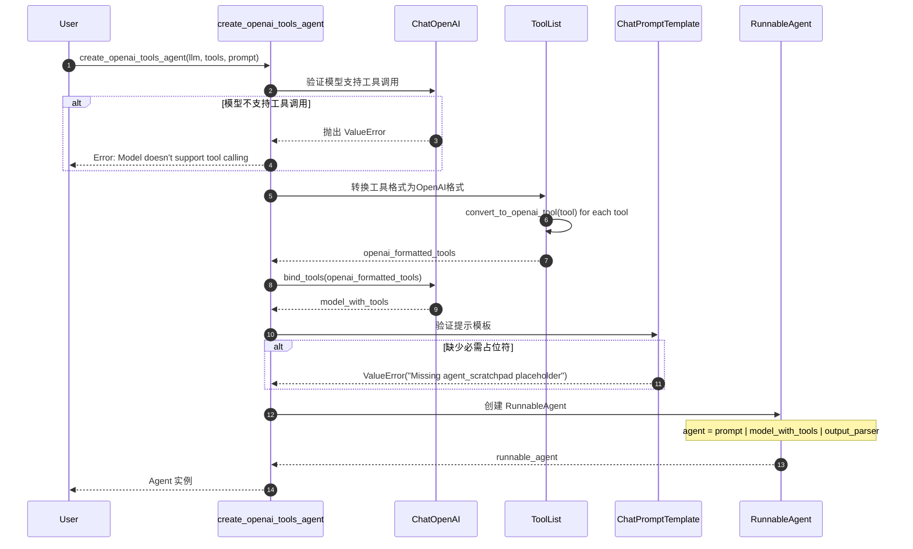
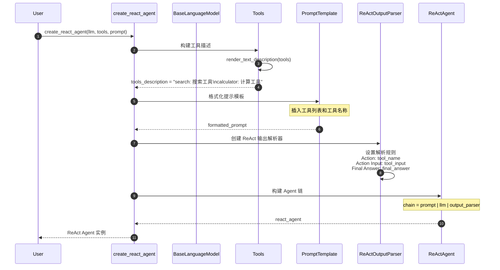
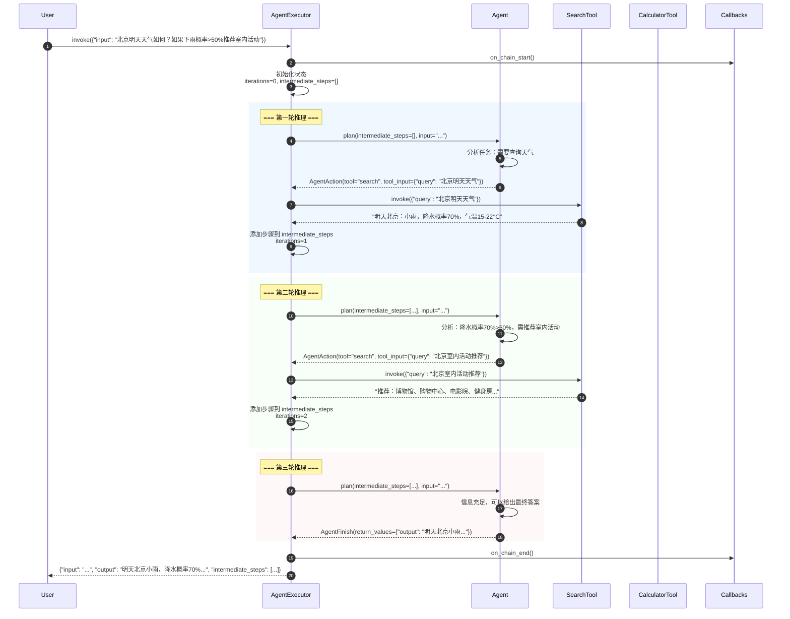
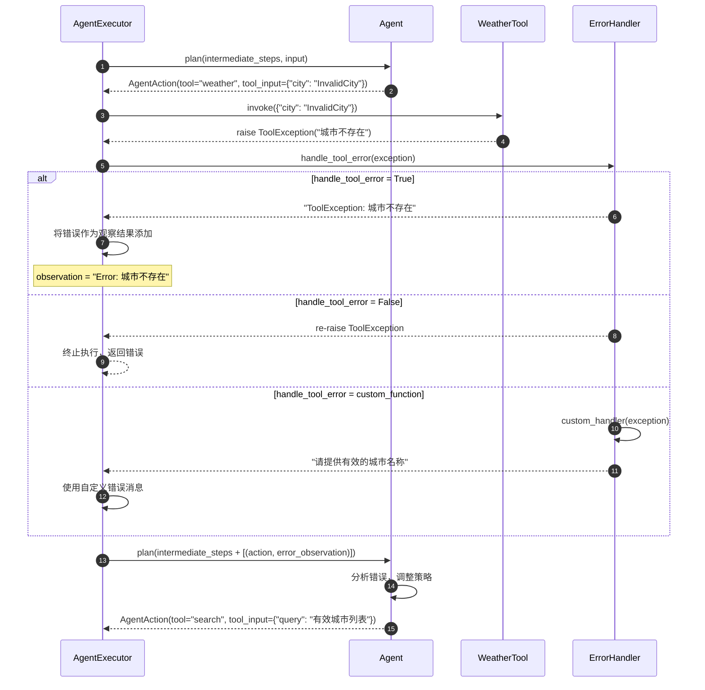
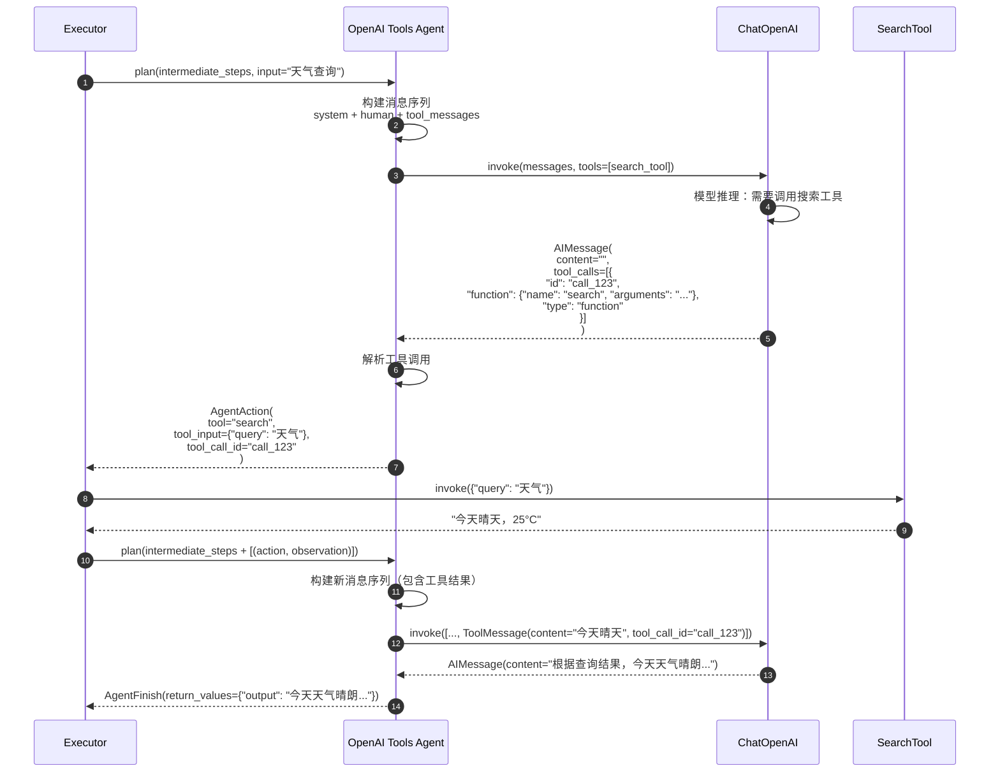
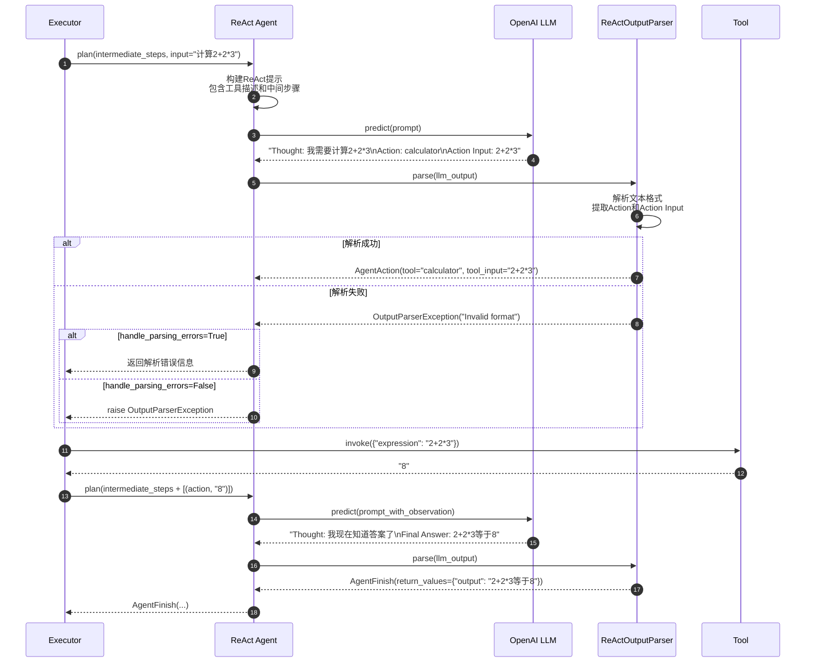
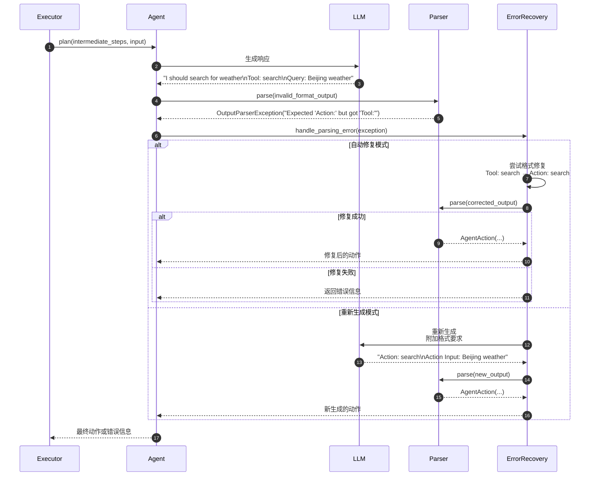
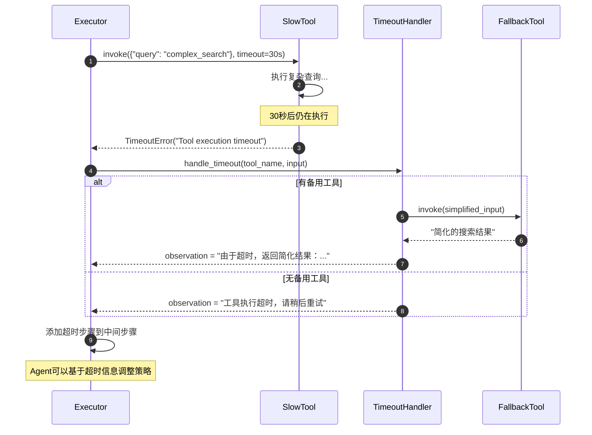
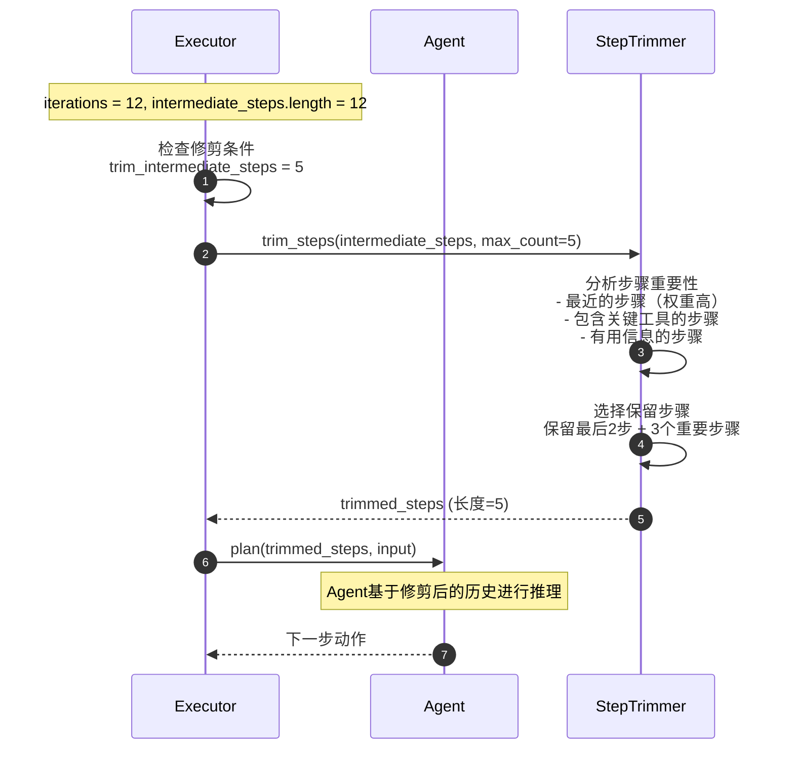
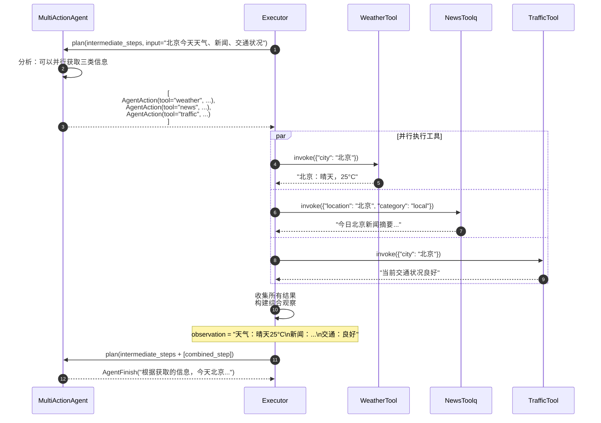

# LangChain-05-Agents-时序图

## 文档说明

本文档通过详细的时序图展示 **Agents 模块**在各种场景下的执行流程，包括Agent创建、推理-行动循环、工具调用、错误处理、早停机制等复杂交互过程。

---

## 1. Agent 创建场景

### 1.1 create_openai_tools_agent 创建流程



**关键验证步骤**：

1. **模型验证**（步骤 3-5）：
   - 检查模型是否支持 `bind_tools` 方法
   - 验证模型类型（必须是 `BaseChatModel`）
   - 确认工具调用能力

2. **工具格式转换**（步骤 6-8）：
   - 将 LangChain 工具转换为 OpenAI 格式
   - 生成工具的 JSON Schema
   - 处理工具描述和参数验证

3. **提示模板验证**（步骤 11-13）：
   - 检查 `{agent_scratchpad}` 占位符
   - 验证输入变量完整性
   - 确保模板格式正确

---

### 1.2 create_react_agent 创建流程



**ReAct 格式说明**：

```text
Question: 用户问题
Thought: 我需要思考如何解决这个问题
Action: search
Action Input: "Python tutorial"
Observation: 找到了相关教程...
Thought: 现在我有了足够信息
Final Answer: 基于搜索结果，这里是Python教程推荐...
```

---

## 2. AgentExecutor 执行场景

### 2.1 完整推理-行动循环



**执行步骤详解**：

1. **状态初始化**（步骤 3）：
   - 重置迭代计数器
   - 清空中间步骤列表
   - 记录开始时间

2. **推理循环**（步骤 4-18）：
   - 每轮调用 `agent.plan()` 方法
   - 根据当前状态决定下一步动作
   - 执行动作并收集观察结果

3. **循环终止条件**：
   - Agent 返回 `AgentFinish`
   - 达到最大迭代次数
   - 超过最大执行时间

---

### 2.2 工具调用错误处理



**错误处理策略**：

| 策略 | 行为 | 适用场景 |
|-----|------|---------|
| `False` | 抛出异常，终止执行 | 严格模式，不容忍错误 |
| `True` | 返回错误字符串 | 让Agent学习错误信息 |
| 自定义函数 | 智能错误处理 | 复杂错误恢复逻辑 |

---

### 2.3 早停机制触发

```mermaid
sequenceDiagram
    autonumber
    participant Executor as AgentExecutor
    participant Agent
    participant StopHandler as EarlyStoppingHandler
    participant Timer
    
    loop 推理循环 (最多15次)
        Executor->>Timer: 检查执行时间
        Timer-->>Executor: time_elapsed = 45秒
        
        alt 达到时间限制 (max_execution_time=60s)
            Note over Executor: 45s < 60s，继续执行
        else 达到迭代限制 (max_iterations=15)
            Executor->>Executor: iterations = 15，触发早停
            break
        end
        
        Executor->>Agent: plan(intermediate_steps, input)
        Agent-->>Executor: AgentAction(...)
        Note over Executor: 继续执行...
    end
    
    Executor->>StopHandler: 处理早停 (early_stopping_method)
    
    alt method = "force"
        StopHandler-->>Executor: AgentFinish(<br/>  return_values={"output": "达到最大迭代次数"},<br/>  log="强制停止"<br/>)
    else method = "generate"  
        StopHandler->>Agent: plan(..., force_final_answer=True)
        Agent->>Agent: 基于现有信息生成最终答案
        Agent-->>StopHandler: AgentFinish(...)
        StopHandler-->>Executor: 生成的最终答案
    end
    
    Executor-->>Executor: 返回结果 (可能不完整)
```

**早停方法对比**：

| 方法 | 优点 | 缺点 | 适用场景 |
|-----|------|------|---------|
| `"force"` | 确定性，快速 | 可能丢失信息 | 严格时间控制 |  
| `"generate"` | 尽力给出答案 | 可能不准确 | 用户体验优先 |

---

## 3. 不同Agent类型的执行流程

### 3.1 OpenAI Tools Agent 执行



**工具调用格式**：

```json
{
  "tool_calls": [{
    "id": "call_abc123",
    "type": "function", 
    "function": {
      "name": "search",
      "arguments": "{\"query\": \"weather Beijing\"}"
    }
  }]
}
```

---

### 3.2 ReAct Agent 执行



**ReAct解析规则**：

```python
# 解析器查找的模式
patterns = {
    "action": r"Action: (.+)",
    "action_input": r"Action Input: (.+)",
    "final_answer": r"Final Answer: (.+)",
    "thought": r"Thought: (.+)"
}
```

---

## 4. 流式执行场景

### 4.1 Agent 流式输出

```mermaid
sequenceDiagram
    autonumber
    participant User
    participant Executor
    participant Agent
    participant Tool
    
    User->>Executor: stream({"input": "查询天气并推荐活动"})
    
    loop 推理循环
        Executor->>Agent: plan(...)
        
        alt Agent返回动作
            Agent-->>Executor: AgentAction(tool="search", ...)
            Executor-->>User: yield {"actions": [AgentAction(...)]}
            
            Executor->>Tool: invoke(...)
            Tool-->>Executor: observation
            Executor-->>User: yield {"steps": [AgentStep(action, observation)]}
            
        else Agent返回完成
            Agent-->>Executor: AgentFinish(...)
            Executor-->>User: yield {"output": "最终答案..."}
            break
        end
    end
```

**流式输出示例**：

```python
for chunk in agent_executor.stream({"input": "天气查询"}):
    if "actions" in chunk:
        print(f"🤖 准备执行: {chunk['actions'][0].tool}")
    elif "steps" in chunk:
        print(f"📋 工具返回: {chunk['steps'][0].observation}")
    elif "output" in chunk:
        print(f"✅ 最终答案: {chunk['output']}")
```

---

## 5. 错误恢复场景

### 5.1 解析错误恢复



**错误恢复策略**：

1. **格式修复**：识别常见格式错误并自动修复
2. **重新生成**：提供更详细的格式说明重新请求
3. **降级处理**：使用简化的解析规则
4. **人工干预**：记录错误等待人工处理

---

### 5.2 工具超时恢复



---

## 6. 性能优化场景

### 6.1 中间步骤修剪



**修剪策略**：

```python
def intelligent_trim(steps, max_count):
    if len(steps) <= max_count:
        return steps
    
    # 按重要性评分
    scored_steps = []
    for i, (action, obs) in enumerate(steps):
        score = 0
        
        # 最近的步骤权重更高
        score += (i / len(steps)) * 10
        
        # 关键工具权重更高
        if action.tool in ["search", "calculator"]:
            score += 5
            
        # 有用观察权重更高
        if "error" not in obs.lower() and len(obs) > 10:
            score += 3
            
        scored_steps.append((score, (action, obs)))
    
    # 选择得分最高的步骤
    scored_steps.sort(key=lambda x: x[0], reverse=True)
    return [step for score, step in scored_steps[:max_count]]
```

---

### 6.2 并行工具调用优化



**并行执行优势**：
- 减少总执行时间
- 提高信息获取效率
- 更好的用户体验

---

## 7. 总结

本文档详细展示了 **Agents 模块**的关键执行时序：

1. **Agent创建**：不同类型Agent的创建和验证流程
2. **推理循环**：完整的思考-行动-观察循环
3. **工具调用**：同步和异步工具执行机制
4. **错误处理**：解析错误、工具错误的恢复策略
5. **早停机制**：达到限制时的处理方法
6. **流式执行**：实时输出中间步骤和结果
7. **性能优化**：步骤修剪和并行执行

每张时序图包含：
- 详细的参与者交互过程
- 关键决策点和分支逻辑
- 错误处理和恢复机制
- 性能优化点和最佳实践

这些时序图帮助开发者深入理解Agent系统的复杂执行机制，为构建高效、可靠的智能代理应用提供指导。Agent系统是LangChain中最复杂但也最强大的组件，正确理解其执行流程对成功构建AI应用至关重要。
