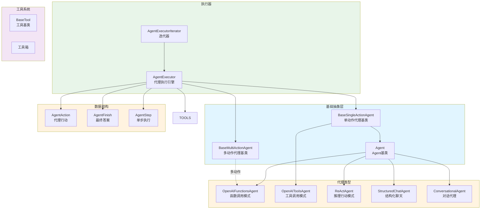
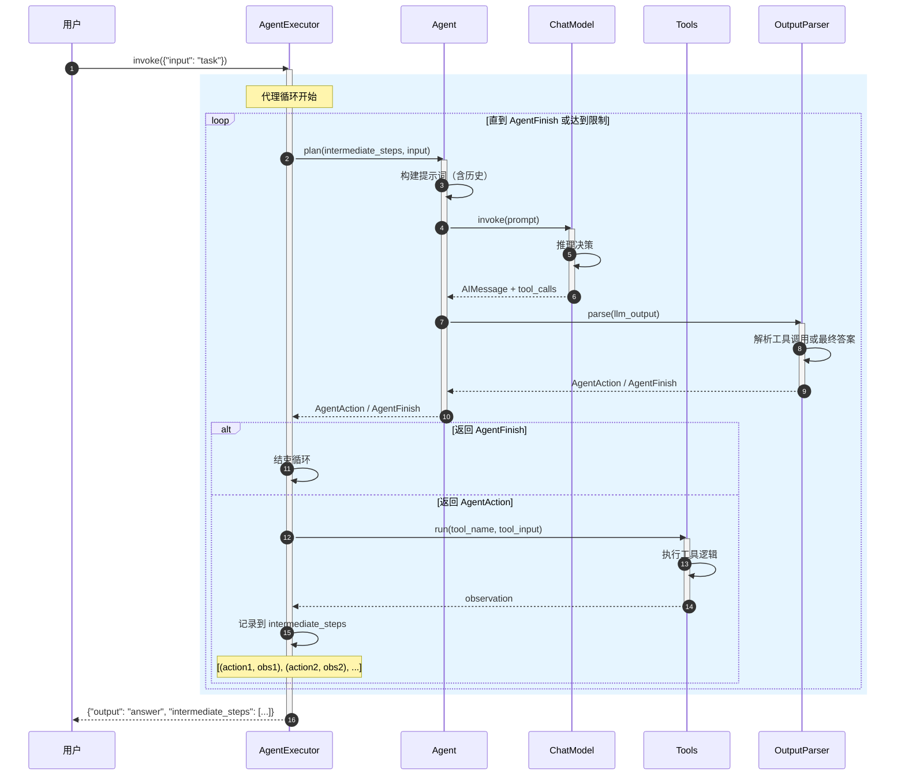
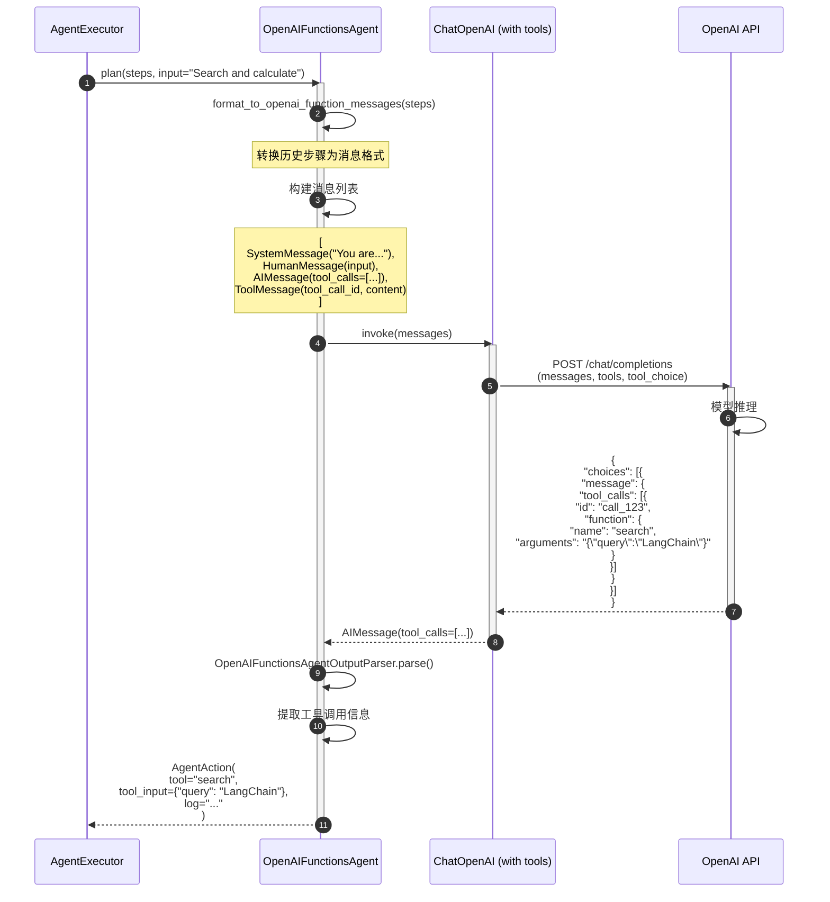
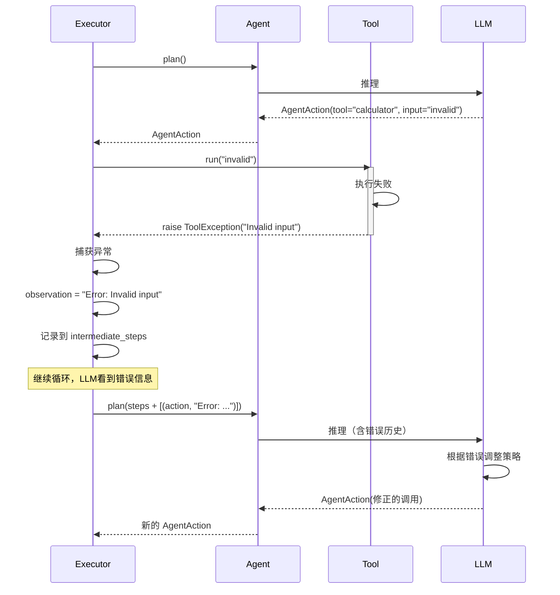

# LangChain-05-Agents-概览

## 模块基本信息

**模块名称**: langchain-agents
**模块路径**: `libs/langchain/langchain/agents/`
**核心职责**: 实现代理（Agent）框架，通过推理-行动-观察循环让 LLM 自主选择工具和执行步骤

## 1. 模块职责

### 1.1 核心职责

Agents 模块是 LangChain 最强大的功能之一，提供以下核心能力：

1. **自主决策**: LLM 根据任务动态选择使用哪些工具
2. **推理-行动循环**: 迭代执行"思考 → 行动 → 观察 → 再思考"直到完成任务
3. **多步推理**: 将复杂任务分解为多个步骤逐步完成
4. **工具调用**: 执行外部工具并将结果反馈给 LLM
5. **错误恢复**: 处理工具执行失败，让 LLM 重新规划
6. **多种代理类型**: 支持 OpenAI Functions、ReAct、Structured Chat 等模式

### 1.2 核心概念

```
任务输入
  ↓
代理推理（LLM 决策）
  ↓
工具调用（执行操作）
  ↓
观察结果（获取反馈）
  ↓
继续推理 或 返回最终答案
```

**关键术语**:
- **Agent**: 代理核心逻辑，负责根据历史步骤决定下一步动作
- **AgentExecutor**: 代理执行器，管理推理-行动循环
- **AgentAction**: 代理决定的行动（工具名称 + 参数）
- **AgentFinish**: 代理决定的最终答案
- **AgentStep**: 单个步骤（行动 + 观察结果）
- **intermediate_steps**: 中间步骤列表，记录所有历史行动和观察

### 1.3 代理类型

| 代理类型 | 适用场景 | 工具输入格式 | 推荐度 |
|---------|---------|------------|--------|
| **OpenAI Functions Agent** | 使用 OpenAI 模型，结构化工具调用 | JSON | ⭐⭐⭐⭐⭐ |
| **OpenAI Tools Agent** | OpenAI 新版工具调用 API | JSON | ⭐⭐⭐⭐⭐ |
| **Structured Chat Agent** | 多参数工具，需要复杂输入 | JSON | ⭐⭐⭐⭐ |
| **ReAct Agent** | 通用，基于思考-行动模式 | 文本 | ⭐⭐⭐ |
| **Self-ask with Search** | 问答任务，需要搜索 | 文本 | ⭐⭐⭐ |
| **Conversational Agent** | 对话场景，带记忆 | 文本 | ⭐⭐ |

### 1.4 输入/输出

**输入**:
- **input**: 用户任务描述（字符串或字典）
- **intermediate_steps**: 历史步骤（可选，用于恢复）
- **tools**: 可用工具列表

**输出**:
- **output**: 最终答案（字符串或字典）
- **intermediate_steps**: 完整的执行步骤记录

### 1.5 上下游依赖

**上游调用者**:
- 用户应用代码
- 更高层的代理编排系统（如 LangGraph）

**下游依赖**:
- `langchain_core.tools`: 工具抽象
- `langchain_core.language_models`: LLM 调用
- `langchain_core.prompts`: 提示词构建
- `langchain_core.output_parsers`: 解析 LLM 输出
- `langchain_core.callbacks`: 回调系统

## 2. 模块级架构图



### 架构图详细说明

**1. 基础抽象层**

- **BaseSingleActionAgent**: 单动作代理基类
  - 每次推理返回单个动作或最终答案
  - 核心方法: `plan()` - 决定下一步动作
  - 大部分代理使用此模式

- **BaseMultiActionAgent**: 多动作代理基类
  - 一次推理可返回多个动作（并发执行）
  - 核心方法: `plan()` - 返回动作列表
  - 适合需要并发执行多个工具的场景

- **Agent**: 标准代理基类（继承自 `BaseSingleActionAgent`）
  - 提供提示词构建辅助方法
  - 实现输出解析逻辑
  - 是大多数代理实现的基类

**2. 代理类型实现**

- **OpenAIFunctionsAgent**:
  - 使用 OpenAI Function Calling API
  - LLM 输出结构化的工具调用指令
  - 最可靠和推荐的方式

  ```python
  # LLM 输出格式
  {
      "name": "search",
      "arguments": {"query": "LangChain"}
  }
  ```

- **OpenAIToolsAgent**:
  - 使用 OpenAI 新版 Tools API
  - 支持并行工具调用
  - 性能更好

- **ReActAgent**:
  - 推理（Reasoning）+ 行动（Acting）模式
  - 基于文本的思考和工具调用
  - LLM 输出格式:

  ```
  Thought: I need to search for information
  Action: search
  Action Input: LangChain documentation
  ```

- **StructuredChatAgent**:
  - 支持复杂的结构化输入
  - 工具参数可以是嵌套的 JSON
  - 适合需要多个参数的工具

- **ConversationalAgent**:
  - 为对话场景优化
  - 内置对话记忆
  - 适合聊天机器人

**3. 执行器**

- **AgentExecutor**: 核心执行引擎
  - 管理推理-行动循环
  - 控制最大迭代次数和超时
  - 处理工具执行和错误
  - 收集中间步骤

  ```python
  class AgentExecutor:
      agent: Agent  # 代理逻辑
      tools: list[BaseTool]  # 可用工具
      max_iterations: int = 15  # 最大循环次数
      max_execution_time: Optional[float] = None  # 超时
      early_stopping_method: str = "force"  # 停止策略
      return_intermediate_steps: bool = False  # 是否返回中间步骤
  ```

- **AgentExecutorIterator**:
  - 提供迭代器接口
  - 逐步返回每个步骤
  - 适合需要实时反馈的场景

**4. 数据结构**

- **AgentAction**: 代理决定的行动
  ```python
  @dataclass
  class AgentAction:
      tool: str  # 工具名称
      tool_input: Union[str, dict]  # 工具输入
      log: str  # LLM 原始输出日志
  ```

- **AgentFinish**: 代理决定的最终答案
  ```python
  @dataclass
  class AgentFinish:
      return_values: dict  # 返回值（包含 output 键）
      log: str  # LLM 原始输出日志
  ```

- **AgentStep**: 单个执行步骤
  ```python
  @dataclass
  class AgentStep:
      action: AgentAction  # 执行的行动
      observation: str  # 观察到的结果
  ```

**5. 工具系统**

代理通过工具与外部世界交互：
- 搜索引擎（Google Search、Wikipedia）
- 数据库查询（SQL、NoSQL）
- API 调用（REST、GraphQL）
- 计算工具（Calculator、Python REPL）
- 文件操作（Read、Write）

## 3. 核心 API 详解

### 3.1 AgentExecutor.invoke - 执行代理任务

**基本信息**:
- **方法**: `invoke`
- **签名**: `def invoke(self, inputs: dict[str, Any], config: Optional[RunnableConfig] = None) -> dict[str, Any]`

**功能**: 执行代理任务，进行推理-行动循环直到完成或达到限制。

**参数**:

| 参数名 | 类型 | 必填 | 说明 |
|--------|------|------|------|
| `inputs` | `dict[str, Any]` | 是 | 输入字典，通常包含 `"input"` 键 |
| `config` | `Optional[RunnableConfig]` | 否 | 运行时配置 |

**返回值**:

| 类型 | 说明 |
|------|------|
| `dict[str, Any]` | 输出字典，包含 `"output"` 键和可选的 `"intermediate_steps"` |

**核心代码**:

```python
class AgentExecutor(Chain):
    agent: BaseSingleActionAgent
    tools: list[BaseTool]
    max_iterations: int = 15
    max_execution_time: Optional[float] = None
    early_stopping_method: str = "force"
    return_intermediate_steps: bool = False

    def _call(
        self,
        inputs: dict[str, str],
        run_manager: Optional[CallbackManagerForChainRun] = None
    ) -> dict[str, Any]:
        """
        运行代理循环
        """
        # 构建工具名称到工具的映射
        name_to_tool_map = {tool.name: tool for tool in self.tools}

        # 初始化中间步骤列表
        intermediate_steps: list[tuple[AgentAction, str]] = []

        # 迭代计数器和计时器
        iterations = 0
        time_elapsed = 0.0
        start_time = time.time()

        # 代理循环
        while self._should_continue(iterations, time_elapsed):
            # 1. 代理推理：决定下一步动作
            next_step_output = self._take_next_step(
                name_to_tool_map,
                inputs,
                intermediate_steps,
                run_manager=run_manager
            )

            # 2. 检查是否完成
            if isinstance(next_step_output, AgentFinish):
                # 返回最终答案
                return self._return(
                    next_step_output,
                    intermediate_steps,
                    run_manager=run_manager
                )

            # 3. 记录中间步骤
            intermediate_steps.extend(next_step_output)

            # 4. 检查工具是否直接返回
            if len(next_step_output) == 1:
                next_step_action = next_step_output[0]
                tool_return = self._get_tool_return(next_step_action)
                if tool_return is not None:
                    return self._return(
                        tool_return,
                        intermediate_steps,
                        run_manager=run_manager
                    )

            # 更新迭代计数
            iterations += 1
            time_elapsed = time.time() - start_time

        # 达到最大迭代次数或超时
        output = self._return_stopped_response(
            self.early_stopping_method,
            intermediate_steps,
            **inputs
        )
        return self._return(output, intermediate_steps, run_manager=run_manager)

    def _take_next_step(
        self,
        name_to_tool_map: dict[str, BaseTool],
        inputs: dict[str, str],
        intermediate_steps: list[tuple[AgentAction, str]],
        run_manager: Optional[CallbackManagerForChainRun] = None
    ) -> Union[AgentFinish, list[tuple[AgentAction, str]]]:
        """
        执行单步：推理 + 工具调用
        """
        # 1. 代理推理
        output = self.agent.plan(
            intermediate_steps=intermediate_steps,
            callbacks=run_manager.get_child() if run_manager else None,
            **inputs
        )

        # 2. 如果是最终答案，直接返回
        if isinstance(output, AgentFinish):
            return output

        # 3. 执行工具
        actions = [output] if isinstance(output, AgentAction) else output
        result = []
        for agent_action in actions:
            # 获取工具
            tool = name_to_tool_map[agent_action.tool]

            # 执行工具
            observation = tool.run(
                agent_action.tool_input,
                verbose=self.verbose,
                callbacks=run_manager.get_child() if run_manager else None
            )

            # 记录步骤
            result.append((agent_action, observation))

        return result
```

**使用示例**:

```python
from langchain.agents import AgentExecutor, create_openai_functions_agent
from langchain_openai import ChatOpenAI
from langchain_core.tools import tool
from langchain_core.prompts import ChatPromptTemplate, MessagesPlaceholder

# 1. 定义工具
@tool
def search(query: str) -> str:
    """Search the web for information."""
    return f"Search results for: {query}"

@tool
def calculator(expression: str) -> str:
    """Calculate a mathematical expression."""
    try:
        return str(eval(expression))
    except:
        return "Invalid expression"

tools = [search, calculator]

# 2. 定义提示词
prompt = ChatPromptTemplate.from_messages([
    ("system", "You are a helpful assistant with access to tools."),
    ("human", "{input}"),
    MessagesPlaceholder(variable_name="agent_scratchpad")
])

# 3. 创建代理
llm = ChatOpenAI(model="gpt-4", temperature=0)
agent = create_openai_functions_agent(llm, tools, prompt)

# 4. 创建执行器
agent_executor = AgentExecutor(
    agent=agent,
    tools=tools,
    verbose=True,
    max_iterations=5,
    return_intermediate_steps=True
)

# 5. 执行任务
result = agent_executor.invoke({
    "input": "Search for LangChain and calculate 25 * 4"
})

print(result["output"])
print("\nIntermediate steps:")
for action, observation in result["intermediate_steps"]:
    print(f"Tool: {action.tool}")
    print(f"Input: {action.tool_input}")
    print(f"Output: {observation}\n")
```

### 3.2 create_openai_functions_agent - 创建函数调用代理

**基本信息**:
- **函数**: `create_openai_functions_agent`
- **签名**: `def create_openai_functions_agent(llm: BaseLanguageModel, tools: Sequence[BaseTool], prompt: ChatPromptTemplate) -> Runnable`

**功能**: 创建使用 OpenAI Function Calling 的代理。

**返回**: 一个 Runnable 代理（实际是 RunnableSequence）

**核心代码**:

```python
def create_openai_functions_agent(
    llm: BaseLanguageModel,
    tools: Sequence[BaseTool],
    prompt: ChatPromptTemplate
) -> Runnable:
    """
    创建 OpenAI Functions 代理

    要求:
    - prompt 必须包含 'agent_scratchpad' 占位符
    - llm 必须支持 bind_tools 方法
    """
    # 验证提示词
    if "agent_scratchpad" not in prompt.input_variables:
        raise ValueError("Prompt must have 'agent_scratchpad' placeholder")

    # 绑定工具到模型
    llm_with_tools = llm.bind_tools(tools)

    # 构建代理链
    agent = (
        RunnablePassthrough.assign(
            agent_scratchpad=lambda x: format_to_openai_function_messages(
                x["intermediate_steps"]
            )
        )
        | prompt
        | llm_with_tools
        | OpenAIFunctionsAgentOutputParser()
    )

    return agent
```

### 3.3 Agent.plan - 代理推理

**基本信息**:
- **方法**: `plan`（抽象方法，由子类实现）
- **签名**: `def plan(self, intermediate_steps: list[tuple[AgentAction, str]], callbacks: Callbacks = None, **kwargs: Any) -> Union[AgentAction, AgentFinish]`

**功能**: 根据历史步骤决定下一步动作或返回最终答案。

**参数**:

| 参数名 | 类型 | 说明 |
|--------|------|------|
| `intermediate_steps` | `list[tuple[AgentAction, str]]` | 历史步骤（行动-观察对） |
| `callbacks` | `Callbacks` | 回调处理器 |
| `**kwargs` | `Any` | 用户输入和其他参数 |

**返回值**:
- `AgentAction`: 下一步要执行的工具调用
- `AgentFinish`: 最终答案

**实现示例（ReActAgent）**:

```python
class ReActAgent(Agent):
    def plan(
        self,
        intermediate_steps: list[tuple[AgentAction, str]],
        callbacks: Callbacks = None,
        **kwargs: Any
    ) -> Union[AgentAction, AgentFinish]:
        """
        ReAct 代理的推理逻辑
        """
        # 1. 构建完整提示词（包含历史步骤）
        full_inputs = self.get_full_inputs(intermediate_steps, **kwargs)
        prompt = self.llm_chain.prompt.format(**full_inputs)

        # 2. 调用 LLM
        llm_output = self.llm_chain.predict(callbacks=callbacks, **full_inputs)

        # 3. 解析输出
        return self.output_parser.parse(llm_output)
```

**输出解析器**:

```python
class ReActOutputParser:
    def parse(self, text: str) -> Union[AgentAction, AgentFinish]:
        """
        解析 ReAct 格式的输出

        格式:
        Thought: <reasoning>
        Action: <tool_name>
        Action Input: <tool_input>

        或:
        Thought: <reasoning>
        Final Answer: <answer>
        """
        # 检查是否包含 Final Answer
        if "Final Answer:" in text:
            return AgentFinish(
                return_values={"output": text.split("Final Answer:")[-1].strip()},
                log=text
            )

        # 解析工具调用
        action_match = re.search(r"Action: (.*?)[\n]", text)
        action_input_match = re.search(r"Action Input: (.*)", text, re.DOTALL)

        if not action_match or not action_input_match:
            raise ValueError(f"Could not parse output: {text}")

        return AgentAction(
            tool=action_match.group(1).strip(),
            tool_input=action_input_match.group(1).strip(),
            log=text
        )
```

## 4. 核心流程时序图

### 4.1 完整代理执行流程



**流程详细说明**:

1. **初始化**:
   - 用户提交任务
   - 初始化 `intermediate_steps = []`
   - 设置迭代计数器和计时器

2. **代理循环**:
   - **检查终止条件**:
     - 迭代次数 < `max_iterations`（默认 15）
     - 执行时间 < `max_execution_time`（如果设置）

3. **代理推理**:
   - 构建提示词，包含:
     - 系统提示（角色、任务描述）
     - 工具描述（工具列表及用法）
     - 历史步骤（`intermediate_steps` 格式化）
     - 用户输入
   - 调用 LLM 生成决策

4. **输出解析**:
   - **OpenAI Functions**: 解析 `tool_calls` 字段
   - **ReAct**: 解析 "Action:" 和 "Action Input:"
   - **Structured Chat**: 解析 JSON 格式的动作

5. **执行分支**:
   - **AgentFinish**: 包含最终答案，结束循环
   - **AgentAction**: 包含工具调用指令，继续执行

6. **工具执行**:
   - 根据工具名称查找工具
   - 传入参数执行工具
   - 捕获执行结果（observation）
   - 处理异常（返回错误信息作为 observation）

7. **记录步骤**:
   - 将 `(AgentAction, observation)` 添加到 `intermediate_steps`
   - 下一轮推理时，LLM 可以看到所有历史

8. **终止处理**:
   - **正常终止**: LLM 返回 AgentFinish
   - **达到限制**: 返回截断响应或强制结束
   - **错误终止**: 抛出异常或返回错误

### 4.2 OpenAI Functions Agent 详细流程



**OpenAI Functions 格式说明**:

**工具定义（发送给 API）**:
```json
{
  "tools": [
    {
      "type": "function",
      "function": {
        "name": "search",
        "description": "Search the web",
        "parameters": {
          "type": "object",
          "properties": {
            "query": {
              "type": "string",
              "description": "Search query"
            }
          },
          "required": ["query"]
        }
      }
    }
  ]
}
```

**API 响应（工具调用）**:
```json
{
  "choices": [{
    "message": {
      "role": "assistant",
      "content": null,
      "tool_calls": [{
        "id": "call_abc123",
        "type": "function",
        "function": {
          "name": "search",
          "arguments": "{\"query\": \"LangChain\"}"
        }
      }]
    }
  }]
}
```

**工具结果（反馈给 LLM）**:
```json
{
  "role": "tool",
  "tool_call_id": "call_abc123",
  "content": "LangChain is a framework for building LLM applications..."
}
```

### 4.3 错误处理流程



**错误恢复策略**:

1. **工具异常**: 捕获并将错误信息作为 observation
2. **解析失败**: 重试或返回解析错误
3. **超时**: 强制停止或返回部分结果
4. **最大迭代**: 根据 `early_stopping_method` 处理:
   - `"force"`: 返回默认响应
   - `"generate"`: 让 LLM 生成基于当前信息的答案

## 5. 配置与优化

### 5.1 关键配置参数

| 参数名 | 类型 | 默认值 | 说明 |
|--------|------|--------|------|
| `max_iterations` | `int` | `15` | 最大推理-行动循环次数 |
| `max_execution_time` | `Optional[float]` | `None` | 最大执行时间（秒） |
| `early_stopping_method` | `str` | `"force"` | 达到限制时的策略: `"force"` 或 `"generate"` |
| `return_intermediate_steps` | `bool` | `False` | 是否返回中间步骤 |
| `handle_parsing_errors` | `Union[bool, Callable]` | `False` | 如何处理解析错误 |
| `verbose` | `bool` | `False` | 是否打印详细日志 |

### 5.2 性能优化

**1. 减少迭代次数**:
```python
agent_executor = AgentExecutor(
    agent=agent,
    tools=tools,
    max_iterations=5,  # 降低上限
    verbose=True
)
```

**2. 设置超时**:
```python
agent_executor = AgentExecutor(
    agent=agent,
    tools=tools,
    max_execution_time=60.0  # 60 秒超时
)
```

**3. 优化提示词**:
```python
# ✅ 明确的指令
prompt = ChatPromptTemplate.from_messages([
    ("system", """You are a helpful assistant.
    Use tools efficiently:
    - Search for factual information
    - Calculate for math problems
    - Combine tools when needed

    Provide final answer as soon as you have enough information."""),
    ("human", "{input}"),
    MessagesPlaceholder("agent_scratchpad")
])
```

**4. 工具优化**:
```python
@tool
def search(query: str) -> str:
    """
    Search for information.

    Args:
        query: Specific search query (not too broad)

    Returns:
        Relevant information (concise)
    """
    # 返回简洁结果，避免大量文本
    results = search_api(query)
    return results[:500]  # 截断过长结果
```

## 6. 最佳实践

### 6.1 选择合适的代理类型

**使用 OpenAI Functions/Tools Agent（推荐）**:
- ✅ 最可靠和结构化
- ✅ 支持复杂工具调用
- ✅ 错误率最低
- ❌ 仅限 OpenAI 模型

**使用 ReAct Agent**:
- ✅ 通用，支持任何 LLM
- ✅ 可解释性强（显式思考过程）
- ❌ 解析可能不稳定
- ❌ 性能略低

### 6.2 工具设计原则

**1. 单一职责**:
```python
# ❌ 工具过于复杂
@tool
def do_everything(action: str, params: dict) -> str:
    if action == "search": ...
    elif action == "calculate": ...
    elif action == "translate": ...

# ✅ 每个工具专注一个功能
@tool
def search(query: str) -> str: ...

@tool
def calculate(expression: str) -> str: ...
```

**2. 清晰的描述**:
```python
@tool
def search(query: str) -> str:
    """
    Search the web for current information.

    Use this tool when you need:
    - Up-to-date facts
    - Recent news
    - Real-world data

    Args:
        query: Specific search query. Be precise.
               Example: "LangChain latest features 2024"

    Returns:
        Search results as concise text
    """
```

**3. 错误处理**:
```python
@tool
def api_call(endpoint: str) -> str:
    """Call an external API."""
    try:
        response = requests.get(endpoint, timeout=10)
        response.raise_for_status()
        return response.text
    except requests.Timeout:
        return "Error: Request timed out"
    except requests.HTTPError as e:
        return f"Error: HTTP {e.response.status_code}"
    except Exception as e:
        return f"Error: {str(e)}"
```

### 6.3 提示词工程

**包含明确指令**:
```python
system_message = """You are an assistant with access to tools.

Guidelines:
1. Use search for factual questions
2. Use calculator for math
3. Combine tools when needed
4. Provide final answer when you have enough info
5. If tools fail, explain and try alternative approach

Always explain your reasoning briefly."""
```

### 6.4 调试技巧

**启用详细日志**:
```python
agent_executor = AgentExecutor(
    agent=agent,
    tools=tools,
    verbose=True,  # 打印每步
    return_intermediate_steps=True  # 返回历史
)
```

**使用回调追踪**:
```python
from langchain.callbacks import StdOutCallbackHandler

result = agent_executor.invoke(
    {"input": "task"},
    config={"callbacks": [StdOutCallbackHandler()]}
)
```

**分析中间步骤**:
```python
result = agent_executor.invoke({"input": "task"})

print("Steps taken:")
for i, (action, observation) in enumerate(result["intermediate_steps"]):
    print(f"\nStep {i+1}:")
    print(f"  Tool: {action.tool}")
    print(f"  Input: {action.tool_input}")
    print(f"  Output: {observation[:100]}...")
```

## 7. 与其他模块的协作

- **Prompts**: 构建代理提示词
- **Language Models**: LLM 推理引擎
- **Tools**: 执行外部操作
- **Output Parsers**: 解析 LLM 输出
- **Memory**: 维护对话历史（ConversationalAgent）

## 8. 总结

Agents 是 LangChain 最强大的功能，实现了 LLM 的自主决策和多步推理能力。关键特性：

1. **推理-行动循环**: 迭代决策和执行
2. **工具编排**: 动态选择和组合工具
3. **错误恢复**: 处理失败并调整策略
4. **多种模式**: OpenAI Functions、ReAct、Structured Chat

**成功使用代理的关键**:
- 选择合适的代理类型
- 设计清晰的工具接口
- 编写明确的提示词
- 合理配置限制（迭代次数、超时）
- 充分测试和调试

---

**文档版本**: v1.0
**最后更新**: 2025-10-03
**相关文档**:
- LangChain-00-总览.md
- LangChain-03-LanguageModels-概览.md
- LangChain-04-Prompts-概览.md
- LangChain-06-Tools-概览.md（待生成）

