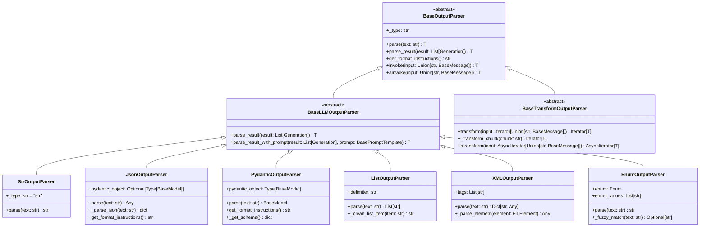

# LangChain-06-OutputParsers-数据结构

## 文档说明

本文档详细描述 **Output Parsers 模块**的核心数据结构，包括解析器类层次、输出格式、错误处理、流式解析等。所有结构均配备 UML 类图和详细的字段说明。

---

## 1. 解析器类层次结构

### 1.1 核心解析器继承体系



**图解说明**：

1. **抽象基类**：
   - `BaseOutputParser`：所有解析器的根基类，定义核心接口
   - `BaseLLMOutputParser`：专门处理LLM输出的解析器基类
   - `BaseTransformOutputParser`：支持流式转换的解析器基类

2. **具体实现**：
   - `StrOutputParser`：最简单的字符串解析器
   - `JsonOutputParser`：JSON格式解析器
   - `PydanticOutputParser`：强类型Pydantic对象解析器
   - `ListOutputParser`：列表格式解析器
   - `XMLOutputParser`：XML格式解析器
   - `EnumOutputParser`：枚举值解析器

3. **核心能力**：
   - 类型安全的解析转换
   - 格式说明生成
   - 错误处理和恢复
   - 流式处理支持

---

## 2. BaseOutputParser 核心字段

### 2.1 基础字段结构

```python
class BaseOutputParser(Generic[T], Runnable[Union[str, BaseMessage], T]):
    """输出解析器基类。"""

    # 抽象属性
    _type: str                              # 解析器类型标识

    # 可选配置
    return_values_key: str = "output"       # 返回值键名
    format_instructions: Optional[str] = None  # 格式说明缓存

    # 内部状态
    _parsed_count: int = 0                  # 解析次数计数
    _error_count: int = 0                   # 错误次数计数
    _last_error: Optional[Exception] = None # 最后一个错误
```

**字段详解**：

| 字段 | 类型 | 必填 | 说明 |
|-----|------|-----|------|
| _type | `str` | 是 | 解析器类型标识，用于序列化和调试 |
| return_values_key | `str` | 否 | 在Chain中使用时的返回值键名 |
| format_instructions | `str` | 否 | 缓存的格式说明，避免重复生成 |
| _parsed_count | `int` | 否 | 成功解析的次数，用于统计 |
| _error_count | `int` | 否 | 解析错误的次数，用于监控 |
| _last_error | `Exception` | 否 | 最后一次解析错误，用于调试 |

---

## 3. 具体解析器数据结构

### 3.1 JsonOutputParser 结构

```python
class JsonOutputParser(BaseLLMOutputParser[Any]):
    """JSON输出解析器。"""

    def __init__(self, pydantic_object: Optional[Type[BaseModel]] = None):
        self.pydantic_object = pydantic_object
        self._schema_cache: Optional[dict] = None
        self._format_instructions_cache: Optional[str] = None

    # 核心字段
    pydantic_object: Optional[Type[BaseModel]]  # 可选的Pydantic模型
    _schema_cache: Optional[dict]               # 缓存的JSON Schema
    _format_instructions_cache: Optional[str]   # 缓存的格式说明

    # 解析配置
    parse_json_markdown: bool = True            # 是否解析markdown中的JSON
    return_dict: bool = True                    # 是否返回字典而非Pydantic对象
```

**字段使用示例**：

```python
from pydantic import BaseModel, Field

class UserProfile(BaseModel):
    name: str = Field(description="用户姓名")
    age: int = Field(description="年龄", ge=0, le=150)
    email: str = Field(description="邮箱地址")

# 创建解析器
parser = JsonOutputParser(pydantic_object=UserProfile)

# 字段访问
print(f"解析器类型: {parser._type}")                    # "json"
print(f"关联模型: {parser.pydantic_object.__name__}")    # "UserProfile"
print(f"Schema缓存: {parser._schema_cache is None}")    # True (未生成)

# 生成格式说明时会缓存schema
instructions = parser.get_format_instructions()
print(f"Schema已缓存: {parser._schema_cache is not None}")  # True
```

---

### 3.2 PydanticOutputParser 结构

```python
class PydanticOutputParser(BaseLLMOutputParser[T]):
    """Pydantic输出解析器。"""

    def __init__(self, pydantic_object: Type[T]):
        if not issubclass(pydantic_object, BaseModel):
            raise ValueError("pydantic_object must be a Pydantic BaseModel")

        self.pydantic_object = pydantic_object
        self._schema: dict = pydantic_object.schema()
        self._field_info: Dict[str, Any] = self._extract_field_info()

    # 核心字段
    pydantic_object: Type[BaseModel]           # Pydantic模型类
    _schema: dict                              # 模型的JSON Schema
    _field_info: Dict[str, Any]                # 字段信息摘要

    # 验证配置
    strict_validation: bool = True             # 是否严格验证
    allow_extra_fields: bool = False           # 是否允许额外字段
```

**字段信息提取**：

```python
def _extract_field_info(self) -> Dict[str, Any]:
    """提取字段信息。"""
    field_info = {}

    for field_name, field in self.pydantic_object.__fields__.items():
        field_info[field_name] = {
            "type": field.type_,
            "required": field.required,
            "default": field.default if field.default is not ... else None,
            "description": field.field_info.description,
            "constraints": {
                "min_length": getattr(field.field_info, "min_length", None),
                "max_length": getattr(field.field_info, "max_length", None),
                "ge": getattr(field.field_info, "ge", None),
                "le": getattr(field.field_info, "le", None),
                "regex": getattr(field.field_info, "regex", None),
            }
        }

    return field_info
```

---

### 3.3 ListOutputParser 结构

```python
class ListOutputParser(BaseLLMOutputParser[List[str]]):
    """列表输出解析器。"""

    def __init__(self, delimiter: str = "\n"):
        self.delimiter = delimiter
        self._list_patterns = self._compile_patterns()
        self._clean_patterns = self._compile_clean_patterns()

    # 核心字段
    delimiter: str                             # 列表项分隔符
    _list_patterns: List[Pattern]              # 编译的列表格式正则
    _clean_patterns: List[Pattern]             # 编译的清理正则

    # 解析配置
    strip_whitespace: bool = True              # 是否去除空白
    remove_empty_items: bool = True            # 是否移除空项
    max_items: Optional[int] = None            # 最大项目数限制
```

**模式编译**：

```python
def _compile_patterns(self) -> List[Pattern]:
    """编译列表识别模式。"""
    patterns = [
        re.compile(r'^\d+\.\s*(.+)$'),          # "1. 项目"
        re.compile(r'^[a-zA-Z]\)\s*(.+)$'),     # "a) 项目"
        re.compile(r'^[-*+•]\s*(.+)$'),         # "- 项目"
        re.compile(r'^>\s*(.+)$'),              # "> 项目"
        re.compile(r'^\(\d+\)\s*(.+)$'),        # "(1) 项目"
    ]
    return patterns

def _compile_clean_patterns(self) -> List[Pattern]:
    """编译清理模式。"""
    return [
        re.compile(r'^\s*[-*+•]\s*'),           # 移除列表符号
        re.compile(r'^\s*\d+[.)]\s*'),          # 移除数字编号
        re.compile(r'^\s*[a-zA-Z][.)]\s*'),     # 移除字母编号
        re.compile(r'^\s*[>\s]+'),              # 移除引用符号
    ]
```

---

## 4. 错误处理数据结构

### 4.1 OutputParserException 结构

```python
class OutputParserException(ValueError):
    """输出解析异常。"""

    def __init__(
        self,
        error: str,
        observation: str = "",
        llm_output: str = "",
        send_to_llm: bool = False
    ):
        super().__init__(error)
        self.error = error                      # 错误描述
        self.observation = observation          # 观察信息（给Agent）
        self.llm_output = llm_output           # 原始LLM输出
        self.send_to_llm = send_to_llm         # 是否发送给LLM重试

        # 扩展信息
        self.parser_type: Optional[str] = None  # 解析器类型
        self.expected_format: Optional[str] = None  # 期望格式
        self.actual_format: Optional[str] = None    # 实际格式
        self.suggestions: List[str] = []        # 修复建议
        self.timestamp: float = time.time()     # 错误时间戳
```

**异常使用示例**：

```python
def parse_with_detailed_error(parser, text: str):
    """带详细错误信息的解析。"""
    try:
        return parser.parse(text)
    except json.JSONDecodeError as e:
        raise OutputParserException(
            error=f"JSON解析失败: {e.msg}",
            observation="输出不是有效的JSON格式",
            llm_output=text,
            send_to_llm=True
        )
    except ValidationError as e:
        suggestions = []
        for error in e.errors():
            field = error['loc'][0] if error['loc'] else 'unknown'
            suggestions.append(f"字段 '{field}': {error['msg']}")

        raise OutputParserException(
            error=f"数据验证失败: {len(e.errors())}个错误",
            observation="输出数据不符合要求的格式",
            llm_output=text,
            send_to_llm=True,
            suggestions=suggestions
        )
```

---

### 4.2 解析结果包装器

```python
class ParseResult(Generic[T]):
    """解析结果包装器。"""

    def __init__(
        self,
        value: Optional[T] = None,
        success: bool = True,
        error: Optional[Exception] = None,
        metadata: Optional[Dict[str, Any]] = None
    ):
        self.value = value                      # 解析结果值
        self.success = success                  # 是否成功
        self.error = error                      # 错误信息
        self.metadata = metadata or {}          # 元数据

        # 统计信息
        self.parse_time: Optional[float] = None # 解析耗时
        self.retry_count: int = 0               # 重试次数
        self.parser_type: Optional[str] = None  # 解析器类型

    def is_success(self) -> bool:
        """检查是否成功。"""
        return self.success and self.value is not None

    def get_value_or_default(self, default: T) -> T:
        """获取值或默认值。"""
        return self.value if self.is_success() else default

    def to_dict(self) -> Dict[str, Any]:
        """转换为字典。"""
        return {
            "value": self.value,
            "success": self.success,
            "error": str(self.error) if self.error else None,
            "metadata": self.metadata,
            "parse_time": self.parse_time,
            "retry_count": self.retry_count,
            "parser_type": self.parser_type
        }

# 使用示例
def safe_parse(parser: BaseOutputParser, text: str) -> ParseResult:
    """安全解析，返回包装结果。"""
    start_time = time.time()

    try:
        value = parser.parse(text)
        parse_time = time.time() - start_time

        return ParseResult(
            value=value,
            success=True,
            metadata={"original_text_length": len(text)},
            parse_time=parse_time,
            parser_type=parser._type
        )
    except Exception as e:
        parse_time = time.time() - start_time

        return ParseResult(
            success=False,
            error=e,
            metadata={"original_text_length": len(text)},
            parse_time=parse_time,
            parser_type=parser._type
        )
```

---

## 5. 流式解析数据结构

### 5.1 流式解析状态

```python
class StreamParseState:
    """流式解析状态。"""

    def __init__(self):
        self.buffer: str = ""                   # 累积缓冲区
        self.partial_results: List[Any] = []    # 部分结果
        self.complete_objects: List[Any] = []   # 完整对象
        self.parse_errors: List[Exception] = [] # 解析错误

        # 状态标记
        self.is_parsing: bool = False           # 是否正在解析
        self.last_update: float = time.time()   # 最后更新时间
        self.chunk_count: int = 0               # 块计数

        # JSON特定状态
        self.brace_depth: int = 0               # 大括号深度
        self.bracket_depth: int = 0             # 中括号深度
        self.in_string: bool = False            # 是否在字符串中
        self.escape_next: bool = False          # 下一个字符是否转义

    def add_chunk(self, chunk: str) -> None:
        """添加新的文本块。"""
        self.buffer += chunk
        self.chunk_count += 1
        self.last_update = time.time()

    def get_statistics(self) -> Dict[str, Any]:
        """获取解析统计。"""
        return {
            "buffer_length": len(self.buffer),
            "partial_results_count": len(self.partial_results),
            "complete_objects_count": len(self.complete_objects),
            "error_count": len(self.parse_errors),
            "chunk_count": self.chunk_count,
            "parsing_duration": time.time() - self.last_update
        }
```

---

### 5.2 JSON流式解析器状态

```python
class JsonStreamState(StreamParseState):
    """JSON流式解析状态。"""

    def __init__(self):
        super().__init__()
        self.json_stack: List[Union[dict, list]] = []  # JSON对象栈
        self.current_key: Optional[str] = None         # 当前键
        self.key_buffer: str = ""                      # 键缓冲区
        self.value_buffer: str = ""                    # 值缓冲区

    def update_json_state(self, char: str) -> None:
        """更新JSON解析状态。"""
        if self.escape_next:
            self.escape_next = False
            return

        if char == '\\' and self.in_string:
            self.escape_next = True
            return

        if char == '"' and not self.escape_next:
            self.in_string = not self.in_string
            return

        if not self.in_string:
            if char == '{':
                self.brace_depth += 1
                self.json_stack.append({})
            elif char == '}':
                self.brace_depth -= 1
                if self.json_stack:
                    obj = self.json_stack.pop()
                    if self.brace_depth == 0:
                        self.complete_objects.append(obj)
            elif char == '[':
                self.bracket_depth += 1
                self.json_stack.append([])
            elif char == ']':
                self.bracket_depth -= 1
                if self.json_stack:
                    arr = self.json_stack.pop()
                    if self.bracket_depth == 0:
                        self.complete_objects.append(arr)

    def is_complete_json(self) -> bool:
        """检查是否有完整的JSON对象。"""
        return (self.brace_depth == 0 and
                self.bracket_depth == 0 and
                not self.in_string and
                len(self.complete_objects) > 0)
```

---

## 6. 解析器配置数据结构

### 6.1 解析器配置类

```python
class ParserConfig:
    """解析器配置。"""

    def __init__(
        self,
        # 基础配置
        strict_mode: bool = False,              # 严格模式
        max_retries: int = 3,                   # 最大重试次数
        timeout: Optional[float] = None,        # 解析超时

        # 错误处理
        handle_errors: bool = True,             # 是否处理错误
        fallback_to_string: bool = False,       # 是否回退到字符串
        log_errors: bool = True,                # 是否记录错误

        # 性能配置
        enable_caching: bool = True,            # 是否启用缓存
        cache_size: int = 100,                  # 缓存大小
        enable_streaming: bool = False,         # 是否启用流式处理

        # 格式配置
        auto_fix_format: bool = True,           # 是否自动修复格式
        preserve_order: bool = False,           # 是否保持顺序
        allow_partial: bool = False,            # 是否允许部分解析
    ):
        self.strict_mode = strict_mode
        self.max_retries = max_retries
        self.timeout = timeout
        self.handle_errors = handle_errors
        self.fallback_to_string = fallback_to_string
        self.log_errors = log_errors
        self.enable_caching = enable_caching
        self.cache_size = cache_size
        self.enable_streaming = enable_streaming
        self.auto_fix_format = auto_fix_format
        self.preserve_order = preserve_order
        self.allow_partial = allow_partial

    def validate(self) -> None:
        """验证配置。"""
        if self.max_retries < 0:
            raise ValueError("max_retries must be non-negative")

        if self.timeout is not None and self.timeout <= 0:
            raise ValueError("timeout must be positive")

        if self.cache_size <= 0:
            raise ValueError("cache_size must be positive")

    def to_dict(self) -> Dict[str, Any]:
        """转换为字典。"""
        return {
            "strict_mode": self.strict_mode,
            "max_retries": self.max_retries,
            "timeout": self.timeout,
            "handle_errors": self.handle_errors,
            "fallback_to_string": self.fallback_to_string,
            "log_errors": self.log_errors,
            "enable_caching": self.enable_caching,
            "cache_size": self.cache_size,
            "enable_streaming": self.enable_streaming,
            "auto_fix_format": self.auto_fix_format,
            "preserve_order": self.preserve_order,
            "allow_partial": self.allow_partial
        }
```

---

## 7. 缓存和性能数据结构

### 7.1 解析缓存

```python
class ParseCache:
    """解析结果缓存。"""

    def __init__(self, max_size: int = 100):
        self.max_size = max_size
        self._cache: Dict[str, CacheEntry] = {}
        self._access_order: List[str] = []      # LRU跟踪
        self._hit_count: int = 0                # 命中次数
        self._miss_count: int = 0               # 未命中次数

    def get(self, key: str) -> Optional[Any]:
        """获取缓存值。"""
        if key in self._cache:
            entry = self._cache[key]
            if not entry.is_expired():
                # 更新访问顺序
                if key in self._access_order:
                    self._access_order.remove(key)
                self._access_order.append(key)

                self._hit_count += 1
                return entry.value
            else:
                # 已过期，删除
                del self._cache[key]
                if key in self._access_order:
                    self._access_order.remove(key)

        self._miss_count += 1
        return None

    def put(self, key: str, value: Any, ttl: int = 3600) -> None:
        """存储缓存值。"""
        # 检查容量限制
        if len(self._cache) >= self.max_size and key not in self._cache:
            # 删除最久未使用的项
            if self._access_order:
                oldest_key = self._access_order.pop(0)
                self._cache.pop(oldest_key, None)

        # 存储新值
        self._cache[key] = CacheEntry(value, ttl)

        # 更新访问顺序
        if key in self._access_order:
            self._access_order.remove(key)
        self._access_order.append(key)

    def get_stats(self) -> Dict[str, Any]:
        """获取缓存统计。"""
        total_requests = self._hit_count + self._miss_count
        hit_rate = self._hit_count / total_requests if total_requests > 0 else 0

        return {
            "size": len(self._cache),
            "max_size": self.max_size,
            "hit_count": self._hit_count,
            "miss_count": self._miss_count,
            "hit_rate": hit_rate,
            "usage_ratio": len(self._cache) / self.max_size
        }

class CacheEntry:
    """缓存条目。"""

    def __init__(self, value: Any, ttl: int = 3600):
        self.value = value
        self.created_at = time.time()
        self.ttl = ttl
        self.access_count = 0

    def is_expired(self) -> bool:
        """检查是否过期。"""
        return time.time() - self.created_at > self.ttl

    def touch(self) -> None:
        """更新访问时间。"""
        self.access_count += 1
```

---

## 8. 解析器注册表

### 8.1 解析器工厂

```python
class ParserRegistry:
    """解析器注册表。"""

    def __init__(self):
        self._parsers: Dict[str, Type[BaseOutputParser]] = {}
        self._instances: Dict[str, BaseOutputParser] = {}
        self._configs: Dict[str, ParserConfig] = {}

        # 注册默认解析器
        self._register_defaults()

    def register(
        self,
        name: str,
        parser_class: Type[BaseOutputParser],
        config: Optional[ParserConfig] = None
    ) -> None:
        """注册解析器。"""
        self._parsers[name] = parser_class
        if config:
            self._configs[name] = config

    def create(self, name: str, **kwargs) -> BaseOutputParser:
        """创建解析器实例。"""
        if name not in self._parsers:
            raise ValueError(f"Unknown parser: {name}")

        parser_class = self._parsers[name]
        config = self._configs.get(name)

        # 合并配置
        if config:
            kwargs = {**config.to_dict(), **kwargs}

        return parser_class(**kwargs)

    def get_or_create(self, name: str, **kwargs) -> BaseOutputParser:
        """获取或创建单例解析器。"""
        cache_key = f"{name}_{hash(str(sorted(kwargs.items())))}"

        if cache_key not in self._instances:
            self._instances[cache_key] = self.create(name, **kwargs)

        return self._instances[cache_key]

    def list_parsers(self) -> List[str]:
        """列出所有注册的解析器。"""
        return list(self._parsers.keys())

    def _register_defaults(self) -> None:
        """注册默认解析器。"""
        self.register("str", StrOutputParser)
        self.register("json", JsonOutputParser)
        self.register("pydantic", PydanticOutputParser)
        self.register("list", ListOutputParser)
        self.register("xml", XMLOutputParser)
        self.register("enum", EnumOutputParser)

# 全局注册表
parser_registry = ParserRegistry()

# 使用示例
def create_parser(parser_type: str, **config):
    """创建解析器的便捷函数。"""
    return parser_registry.create(parser_type, **config)

# 创建不同类型的解析器
str_parser = create_parser("str")
json_parser = create_parser("json", pydantic_object=UserProfile)
list_parser = create_parser("list", delimiter=",")
```

---

## 9. 性能监控数据结构

### 9.1 解析器性能指标

```python
class ParserMetrics:
    """解析器性能指标。"""

    def __init__(self, parser_type: str):
        self.parser_type = parser_type
        self.parse_count = 0                    # 解析次数
        self.success_count = 0                  # 成功次数
        self.error_count = 0                    # 错误次数
        self.total_parse_time = 0.0             # 总解析时间
        self.parse_times: List[float] = []      # 解析时间列表
        self.error_types: Dict[str, int] = defaultdict(int)  # 错误类型统计

        # 输入统计
        self.total_input_length = 0             # 总输入长度
        self.input_lengths: List[int] = []      # 输入长度列表

        # 输出统计
        self.output_type_counts: Dict[str, int] = defaultdict(int)  # 输出类型统计

    def record_parse(
        self,
        success: bool,
        parse_time: float,
        input_length: int,
        output_type: Optional[str] = None,
        error_type: Optional[str] = None
    ) -> None:
        """记录解析结果。"""
        self.parse_count += 1
        self.total_parse_time += parse_time
        self.parse_times.append(parse_time)
        self.total_input_length += input_length
        self.input_lengths.append(input_length)

        if success:
            self.success_count += 1
            if output_type:
                self.output_type_counts[output_type] += 1
        else:
            self.error_count += 1
            if error_type:
                self.error_types[error_type] += 1

    def get_statistics(self) -> Dict[str, Any]:
        """获取统计信息。"""
        if self.parse_count == 0:
            return {"parser_type": self.parser_type, "no_data": True}

        return {
            "parser_type": self.parser_type,
            "parse_count": self.parse_count,
            "success_rate": self.success_count / self.parse_count,
            "error_rate": self.error_count / self.parse_count,
            "average_parse_time": self.total_parse_time / self.parse_count,
            "median_parse_time": self._calculate_median(self.parse_times),
            "p95_parse_time": self._calculate_percentile(self.parse_times, 0.95),
            "average_input_length": self.total_input_length / self.parse_count,
            "max_input_length": max(self.input_lengths) if self.input_lengths else 0,
            "min_input_length": min(self.input_lengths) if self.input_lengths else 0,
            "common_errors": dict(sorted(self.error_types.items(), key=lambda x: x[1], reverse=True)[:5]),
            "output_types": dict(self.output_type_counts)
        }

    def _calculate_median(self, values: List[float]) -> float:
        """计算中位数。"""
        if not values:
            return 0.0
        sorted_values = sorted(values)
        n = len(sorted_values)
        if n % 2 == 0:
            return (sorted_values[n//2 - 1] + sorted_values[n//2]) / 2
        else:
            return sorted_values[n//2]

    def _calculate_percentile(self, values: List[float], percentile: float) -> float:
        """计算百分位数。"""
        if not values:
            return 0.0
        sorted_values = sorted(values)
        index = int(percentile * len(sorted_values))
        return sorted_values[min(index, len(sorted_values) - 1)]
```

---

## 10. 总结

本文档详细描述了 **Output Parsers 模块**的核心数据结构：

1. **类层次结构**：从基类到具体实现的完整继承关系
2. **解析器字段**：各种解析器的核心字段和配置选项
3. **错误处理**：异常类型和错误恢复机制
4. **流式解析**：流式处理的状态管理和缓冲机制
5. **配置管理**：解析器配置和注册表系统
6. **缓存系统**：性能优化的缓存机制
7. **性能监控**：解析器执行的指标收集

所有数据结构均包含：
- 完整的字段定义和类型说明
- 详细的使用示例和配置方法
- 性能特征和优化策略
- 错误处理和恢复机制

这些结构为构建高效、可靠的输出解析系统提供了完整的数据模型基础，支持从简单文本解析到复杂结构化数据转换的各种需求。
