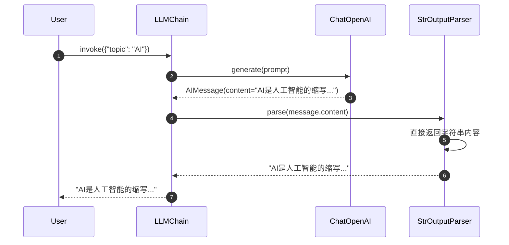
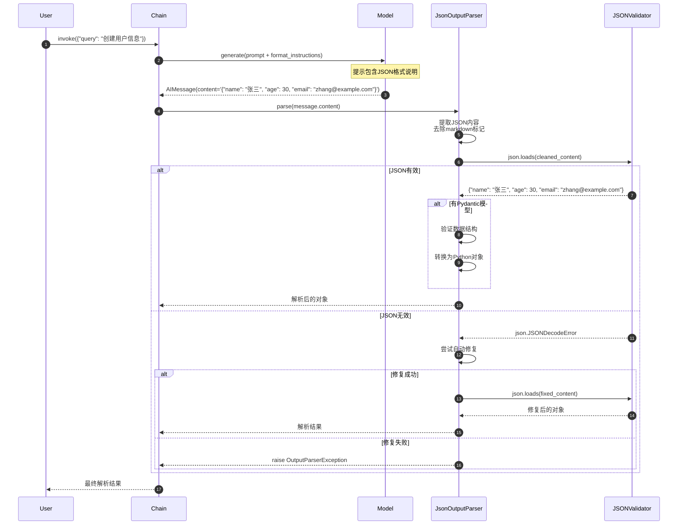
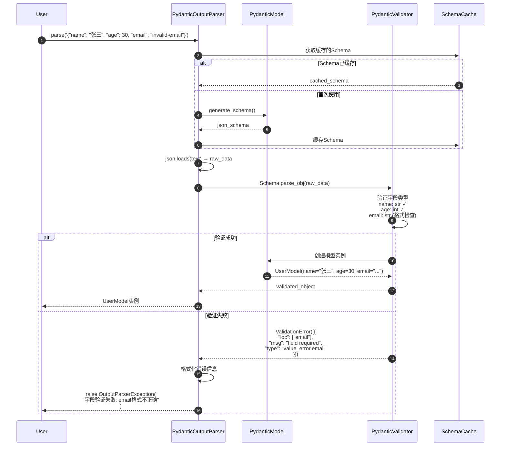
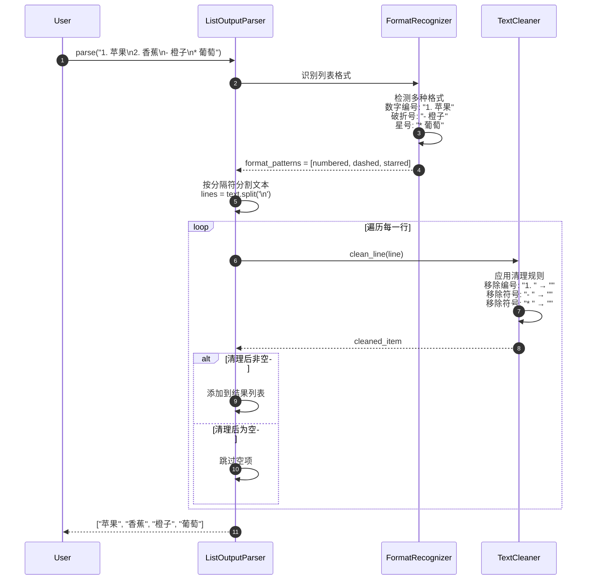
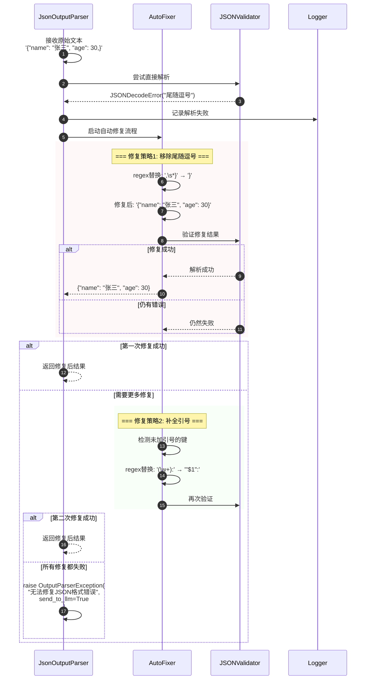
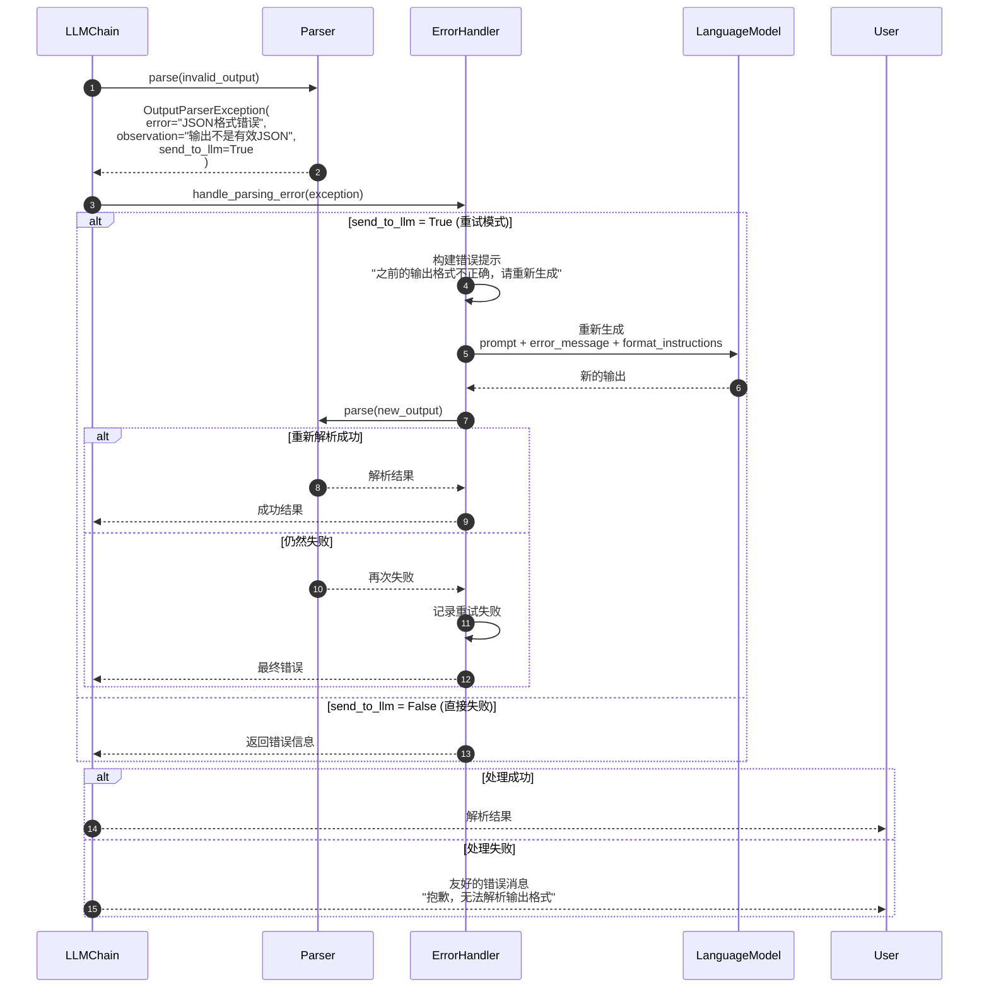
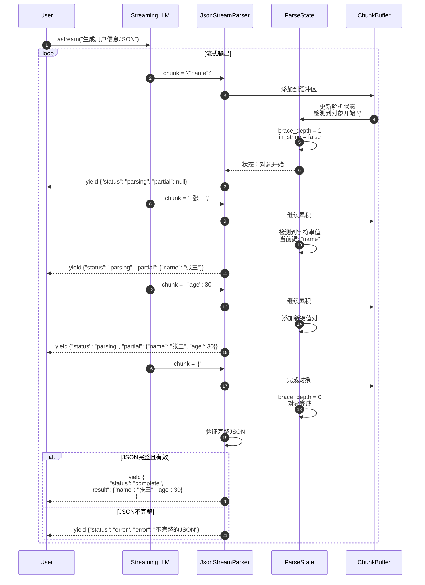
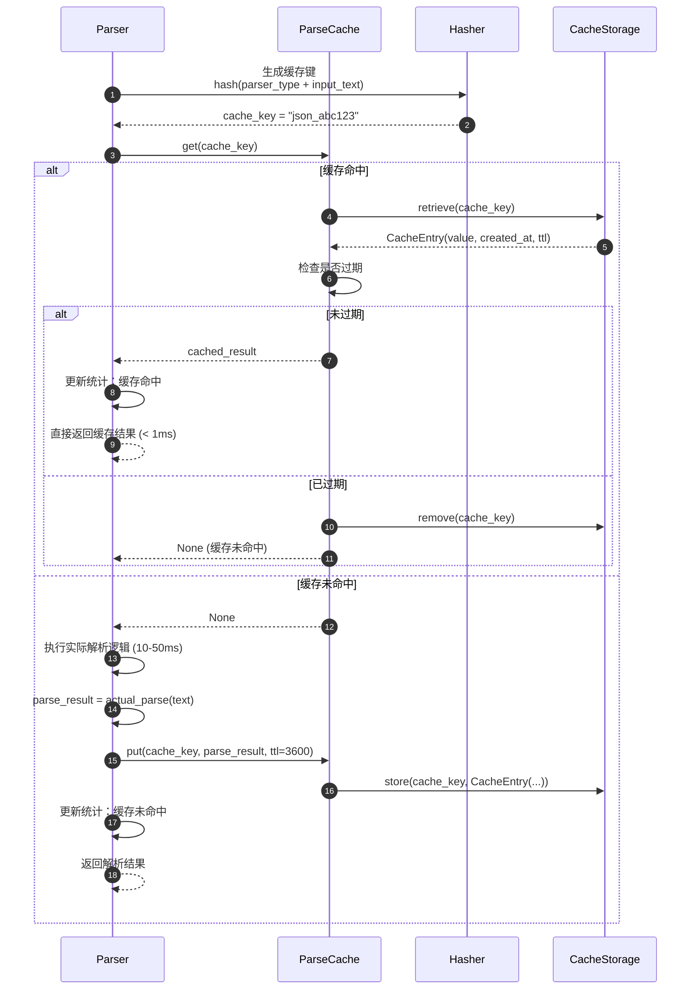
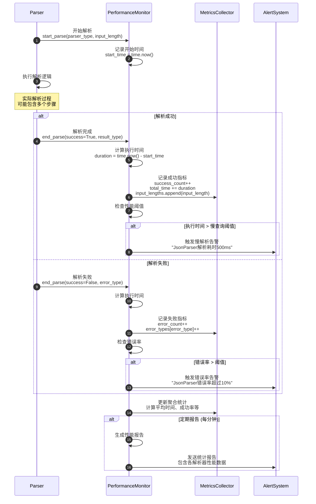
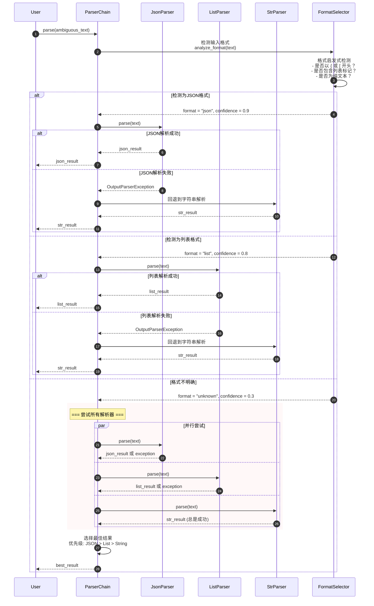

# LangChain-06-OutputParsers-时序图

## 文档说明

本文档通过详细的时序图展示 **Output Parsers 模块**在各种场景下的执行流程，包括不同解析器的工作机制、错误处理、流式解析、缓存优化等复杂交互过程。

---

## 1. 基础解析场景

### 1.1 StrOutputParser 简单解析流程



**关键特点**：
- 最简单的解析器，无需任何转换
- 直接返回LLM输出的文本内容
- 解析时间 < 1ms，几乎无性能开销
- 适用于不需要结构化的文本输出场景

---

### 1.2 JsonOutputParser 标准解析流程



**解析步骤详解**：

1. **内容清理**（步骤 5）：
   - 移除markdown代码块标记（```json）
   - 去除前后空白字符
   - 处理转义字符

2. **JSON验证**（步骤 6-7）：
   - 使用标准`json.loads()`解析
   - 检查语法正确性
   - 验证数据类型

3. **错误修复**（步骤 12-17）：
   - 修复尾随逗号
   - 补全缺失的引号
   - 修复常见格式错误

---

## 2. Pydantic解析场景

### 2.1 PydanticOutputParser 强类型解析



**验证过程详解**：

```python
# 示例Pydantic模型
class UserProfile(BaseModel):
    name: str = Field(min_length=1, max_length=50)
    age: int = Field(ge=0, le=150)
    email: str = Field(regex=r'^[^@]+@[^@]+\.[^@]+$')

    @validator('name')
    def validate_name(cls, v):
        if not v.strip():
            raise ValueError('姓名不能为空')
        return v.strip()

# 验证流程
# 1. 类型检查：确保字段类型正确
# 2. 约束验证：检查Field中定义的约束
# 3. 自定义验证：执行@validator装饰的方法
# 4. 对象构造：创建最终的Pydantic实例
```

---

## 3. 列表解析场景

### 3.1 ListOutputParser 多格式识别



**格式识别规则**：

```python
# 支持的列表格式
PATTERNS = [
    r'^\s*\d+[.)]\s*(.+)$',      # "1. 项目" 或 "1) 项目"
    r'^\s*[a-zA-Z][.)]\s*(.+)$', # "a. 项目" 或 "a) 项目"
    r'^\s*[-*+•]\s*(.+)$',       # "- 项目", "* 项目", "+ 项目", "• 项目"
    r'^\s*>\s*(.+)$',            # "> 项目" (引用格式)
    r'^\s*\(\d+\)\s*(.+)$',      # "(1) 项目"
]

# 清理步骤
# 1. 去除前后空白
# 2. 移除列表标记符号
# 3. 再次去除空白
# 4. 检查是否为空项
```

---

## 4. 错误处理与恢复场景

### 4.1 JSON解析错误自动修复



**自动修复策略**：

```python
class JsonAutoFixer:
    """JSON自动修复器。"""

    FIXES = [
        # 1. 移除尾随逗号
        (r',(\s*[}\]])', r'\1'),

        # 2. 为键添加引号
        (r'(\w+):', r'"\1":'),

        # 3. 修复单引号为双引号
        (r"'([^']*)'", r'"\1"'),

        # 4. 移除注释
        (r'//.*', ''),
        (r'/\*.*?\*/', ''),

        # 5. 修复布尔值
        (r'\bTrue\b', 'true'),
        (r'\bFalse\b', 'false'),
        (r'\bNone\b', 'null'),
    ]

    def fix(self, text: str) -> str:
        """应用所有修复策略。"""
        for pattern, replacement in self.FIXES:
            text = re.sub(pattern, replacement, text, flags=re.DOTALL)
        return text
```

---

### 4.2 解析异常处理流程



**错误处理配置**：

```python
# 不同的错误处理策略
class ErrorHandlingStrategy:
    STRICT = "strict"        # 严格模式，直接抛出异常
    RETRY = "retry"          # 重试模式，重新请求LLM
    FALLBACK = "fallback"    # 回退模式，返回原始文本
    IGNORE = "ignore"        # 忽略模式，返回None

# 配置示例
parser = JsonOutputParser(
    error_handling=ErrorHandlingStrategy.RETRY,
    max_retries=3,
    fallback_to_string=True
)
```

---

## 5. 流式解析场景

### 5.1 JsonStreamOutputParser 实时解析



**流式解析状态管理**：

```python
class StreamParseState:
    def __init__(self):
        self.buffer = ""
        self.brace_depth = 0      # 大括号深度
        self.bracket_depth = 0    # 中括号深度
        self.in_string = False    # 是否在字符串中
        self.escape_next = False  # 下一个字符是否转义
        self.current_objects = [] # 当前解析的对象栈

    def process_char(self, char: str) -> Optional[dict]:
        """处理单个字符，返回完成的对象（如果有）。"""
        self.buffer += char

        if self.escape_next:
            self.escape_next = False
            return None

        if char == '\\' and self.in_string:
            self.escape_next = True
            return None

        if char == '"':
            self.in_string = not self.in_string
            return None

        if not self.in_string:
            if char == '{':
                self.brace_depth += 1
            elif char == '}':
                self.brace_depth -= 1
                if self.brace_depth == 0:
                    # 尝试解析完整对象
                    try:
                        obj = json.loads(self.buffer)
                        self.buffer = ""  # 清空缓冲区
                        return obj
                    except json.JSONDecodeError:
                        pass  # 继续累积

        return None
```

---

## 6. 缓存优化场景

### 6.1 解析结果缓存机制



**缓存性能优化**：

```python
class ParseCache:
    def __init__(self, max_size: int = 1000):
        self.max_size = max_size
        self._cache = {}
        self._access_order = []  # LRU跟踪
        self._stats = {
            "hits": 0,
            "misses": 0,
            "evictions": 0
        }

    def _generate_key(self, parser_type: str, text: str) -> str:
        """生成缓存键。"""
        # 对长文本进行哈希以节省内存
        if len(text) > 1000:
            text_hash = hashlib.md5(text.encode()).hexdigest()
            return f"{parser_type}:{text_hash}"
        else:
            return f"{parser_type}:{text}"

    def _evict_lru(self) -> None:
        """淘汰最久未使用的缓存项。"""
        if self._access_order:
            lru_key = self._access_order.pop(0)
            self._cache.pop(lru_key, None)
            self._stats["evictions"] += 1
```

---

## 7. 性能监控场景

### 7.1 解析器性能追踪



**性能指标收集**：

```python
class ParserPerformanceMonitor:
    def __init__(self):
        self.metrics = defaultdict(ParserMetrics)
        self.alert_thresholds = {
            "slow_parse_ms": 1000,      # 慢解析阈值
            "error_rate": 0.1,          # 错误率阈值
            "memory_usage_mb": 100      # 内存使用阈值
        }

    def record_parse(self, parser_type: str, duration: float,
                    success: bool, input_length: int, **kwargs):
        """记录解析性能。"""
        metrics = self.metrics[parser_type]
        metrics.record_parse(duration, success, input_length, **kwargs)

        # 检查告警条件
        self._check_alerts(parser_type, metrics)

    def _check_alerts(self, parser_type: str, metrics: ParserMetrics):
        """检查告警条件。"""
        # 慢解析告警
        if metrics.last_parse_time > self.alert_thresholds["slow_parse_ms"]:
            self._send_alert(f"慢解析: {parser_type} 耗时 {metrics.last_parse_time}ms")

        # 错误率告警
        if metrics.error_rate > self.alert_thresholds["error_rate"]:
            self._send_alert(f"高错误率: {parser_type} 错误率 {metrics.error_rate:.2%}")
```

---

## 8. 解析器组合场景

### 8.1 多解析器链式处理



---

## 9. 总结

本文档详细展示了 **Output Parsers 模块**的关键执行时序：

1. **基础解析**：StrOutputParser、JsonOutputParser的标准解析流程
2. **强类型解析**：PydanticOutputParser的验证和类型转换机制
3. **列表解析**：ListOutputParser的多格式识别和清理过程
4. **错误处理**：自动修复、重试机制、降级策略
5. **流式解析**：实时处理流式输出的状态管理
6. **缓存优化**：解析结果缓存的命中和淘汰机制
7. **性能监控**：解析器执行的指标收集和告警
8. **解析器组合**：多解析器的智能选择和回退策略

每张时序图包含：
- 详细的执行步骤和参与者交互
- 关键决策点和分支处理逻辑
- 错误处理和恢复机制
- 性能优化点和监控策略

这些时序图帮助开发者深入理解输出解析系统的内部工作机制，为构建高效、可靠的LLM输出处理管道提供指导。Output Parsers是连接原始LLM输出和结构化应用数据的关键桥梁，正确理解其执行流程对提高应用程序的稳定性和用户体验至关重要。
