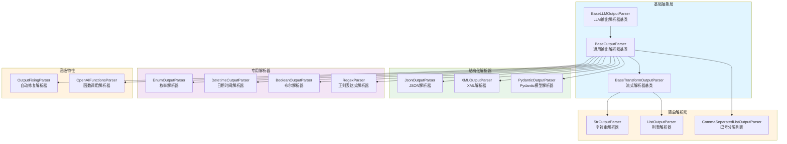
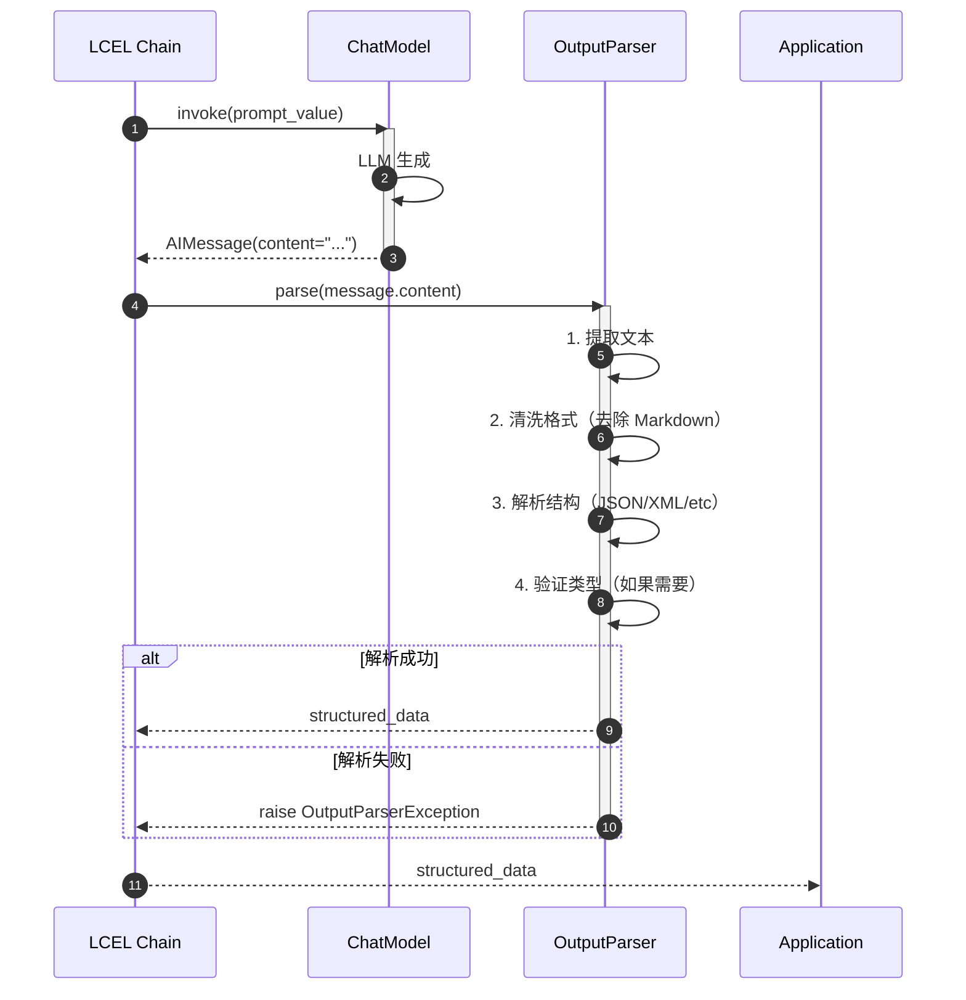
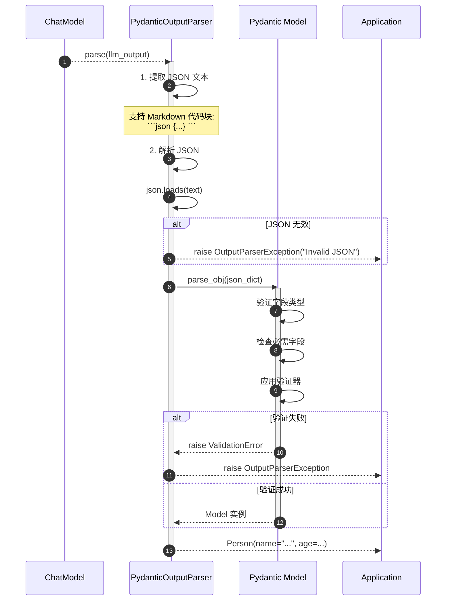
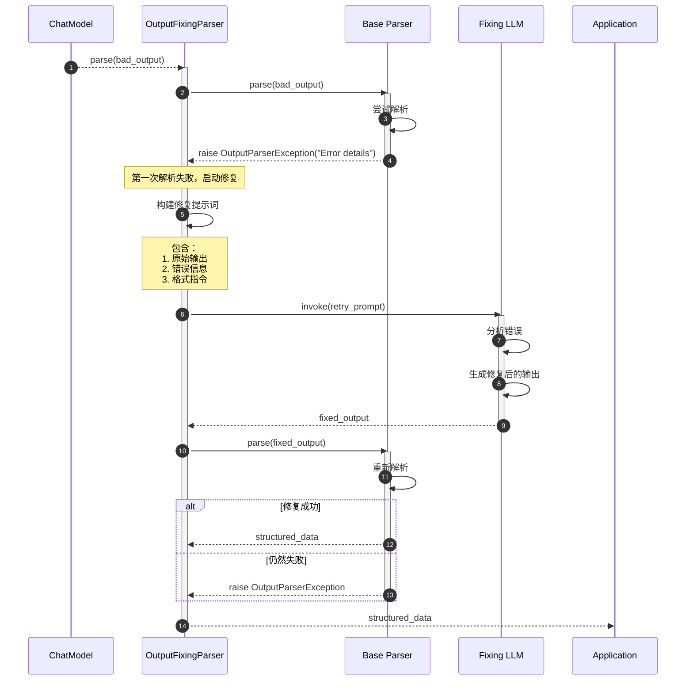

# LangChain-06-OutputParsers-概览

## 模块基本信息

**模块名称**: langchain-core-output-parsers
**模块路径**: `libs/core/langchain_core/output_parsers/`
**核心职责**: 将 LLM 的文本输出解析为结构化数据（JSON、Pydantic 对象、列表等）

## 1. 模块职责

### 1.1 核心职责

Output Parsers 模块负责将 LLM 的非结构化输出转换为应用可用的结构化数据，提供以下能力：

1. **格式化解析**: 将文本解析为 JSON、XML、CSV 等格式
2. **类型安全**: 使用 Pydantic 模型验证输出结构
3. **流式解析**: 支持流式输出的增量解析
4. **错误处理**: 提供格式错误修复机制
5. **指令生成**: 自动生成格式化指令注入提示词
6. **多种解析器**: 支持字符串、列表、JSON、Pydantic、枚举等

### 1.2 核心概念

```
LLM 文本输出
  ↓
输出解析器（解析规则 + 验证逻辑）
  ↓
结构化数据（dict、list、Pydantic 对象）
```

**解析器分类**:
- **基础解析器**: 直接返回文本或简单转换
- **结构化解析器**: 解析为 JSON、XML、CSV
- **模式验证解析器**: 使用 Pydantic 进行类型验证
- **流式解析器**: 支持增量解析（streaming）
- **重试解析器**: 解析失败时调用 LLM 修复

### 1.3 输入/输出

**输入**:
- **parse 方法**: `str` - LLM 输出文本
- **parse_result 方法**: `list[Generation]` - LLM 生成对象

**输出**:
- 结构化数据：`str`、`list`、`dict`、`Pydantic Model`、`Any`

### 1.4 解析器类型对比

| 解析器 | 输出类型 | 流式支持 | 使用场景 |
|--------|---------|---------|---------|
| `StrOutputParser` | `str` | ✅ | 直接返回文本 |
| `ListOutputParser` | `list[str]` | ✅ | 解析列表 |
| `JsonOutputParser` | `dict` | ✅ | JSON 格式输出 |
| `PydanticOutputParser` | `BaseModel` | ❌ | 类型安全的结构化输出 |
| `XMLOutputParser` | `dict` | ❌ | XML 格式输出 |
| `CommaSeparatedListOutputParser` | `list[str]` | ❌ | 逗号分隔列表 |
| `EnumOutputParser` | `Enum` | ❌ | 枚举类型输出 |
| `DatetimeOutputParser` | `datetime` | ❌ | 日期时间解析 |

### 1.5 上下游依赖

**上游调用者**:
- LCEL 链（作为最后一个组件）
- 用户应用代码

**下游依赖**:
- `pydantic`: 模型验证
- `json`, `xml.etree`, `csv`: 标准库解析器

## 2. 模块级架构图



### 架构图详细说明

**1. 基础抽象层**

- **BaseLLMOutputParser**: 所有 LLM 输出解析器的基类
  - 定义 `parse_result` 方法：接收 `list[Generation]`
  - 子类可直接访问 LLM 生成对象的元数据

- **BaseOutputParser**: 通用输出解析器基类
  - 继承自 `BaseLLMOutputParser` 和 `Runnable`
  - 定义 `parse` 方法：接收 `str` 文本
  - 提供 `get_format_instructions` 方法：生成格式化指令
  - 支持 LCEL 链式调用

- **BaseTransformOutputParser**: 流式解析器基类
  - 支持 `transform` 方法：增量处理输入块
  - 适用于流式输出场景
  - 子类：`StrOutputParser`、`ListOutputParser`

**2. 简单解析器**

- **StrOutputParser**:
  - 最简单的解析器
  - 直接返回输入文本
  - 支持流式输出

  ```python
  parser = StrOutputParser()
  result = parser.parse("Hello World")  # "Hello World"
  ```

- **ListOutputParser**:
  - 解析换行分隔或编号列表
  - 支持流式输出（逐行返回）

  ```python
  text = "1. Apple\n2. Banana\n3. Cherry"
  parser = ListOutputParser()
  result = parser.parse(text)  # ["Apple", "Banana", "Cherry"]
  ```

- **CommaSeparatedListOutputParser**:
  - 解析逗号分隔的列表
  - 去除空白字符

  ```python
  text = "apple, banana, cherry"
  parser = CommaSeparatedListOutputParser()
  result = parser.parse(text)  # ["apple", "banana", "cherry"]
  ```

**3. 结构化解析器**

- **JsonOutputParser**:
  - 解析 JSON 格式输出
  - 支持流式输出（增量解析 JSON）
  - 自动提取 markdown 代码块中的 JSON

  ```python
  text = '{"name": "Alice", "age": 30}'
  parser = JsonOutputParser()
  result = parser.parse(text)  # {"name": "Alice", "age": 30}
  ```

- **PydanticOutputParser**:
  - 使用 Pydantic 模型验证输出
  - 提供类型安全和自动验证
  - 生成详细的格式化指令

  ```python
  class Person(BaseModel):
      name: str = Field(description="Person's name")
      age: int = Field(description="Person's age")

  parser = PydanticOutputParser(pydantic_object=Person)
  result = parser.parse('{"name": "Alice", "age": 30}')
  # Person(name="Alice", age=30)
  ```

- **XMLOutputParser**:
  - 解析 XML 格式输出
  - 转换为字典结构

  ```python
  text = "<person><name>Alice</name><age>30</age></person>"
  parser = XMLOutputParser()
  result = parser.parse(text)
  # {"person": {"name": "Alice", "age": "30"}}
  ```

**4. 专用解析器**

- **EnumOutputParser**:
  - 解析枚举类型
  - 自动映射字符串到枚举值

  ```python
  class Color(Enum):
      RED = "red"
      GREEN = "green"
      BLUE = "blue"

  parser = EnumOutputParser(enum=Color)
  result = parser.parse("red")  # Color.RED
  ```

- **DatetimeOutputParser**:
  - 解析日期时间字符串
  - 支持自定义格式

  ```python
  parser = DatetimeOutputParser()
  result = parser.parse("2024-10-03")  # datetime(2024, 10, 3)
  ```

- **BooleanOutputParser**:
  - 解析布尔值
  - 识别 "yes/no", "true/false", "1/0"

  ```python
  parser = BooleanOutputParser()
  result = parser.parse("yes")  # True
  ```

**5. 高级特性**

- **OutputFixingParser**:
  - 包装其他解析器
  - 解析失败时调用 LLM 修复输出

  ```python
  base_parser = PydanticOutputParser(pydantic_object=Person)
  fixing_parser = OutputFixingParser.from_llm(
      parser=base_parser,
      llm=ChatOpenAI()
  )
  # 即使输出格式错误，也会尝试修复
  ```

- **OpenAIFunctionsParser**:
  - 解析 OpenAI Function Calling 输出
  - 提取函数名和参数

## 3. 核心 API 详解

### 3.1 parse - 解析文本输出

**基本信息**:
- **方法**: `parse`
- **签名**: `def parse(self, text: str) -> T`

**功能**: 将 LLM 文本输出解析为目标类型。

**参数**:

| 参数名 | 类型 | 说明 |
|--------|------|------|
| `text` | `str` | LLM 输出文本 |

**返回值**: 解析后的结构化数据（类型由解析器决定）

**核心代码**:

```python
class BaseOutputParser(BaseLLMOutputParser, Runnable[str, T], ABC):
    @abstractmethod
    def parse(self, text: str) -> T:
        """
        解析文本为目标类型

        参数:
            text: LLM 输出文本

        返回:
            解析后的结构化数据

        抛出:
            OutputParserException: 解析失败时
        """
```

**使用示例（JsonOutputParser）**:

```python
from langchain_core.output_parsers import JsonOutputParser

parser = JsonOutputParser()

# 标准 JSON
text = '{"name": "Alice", "age": 30}'
result = parser.parse(text)
print(result)  # {"name": "Alice", "age": 30}

# 包含 Markdown 代码块的 JSON
text = '''
Here is the data:
```json
{"name": "Bob", "age": 25}
```
'''
result = parser.parse(text)
print(result)  # {"name": "Bob", "age": 25}

# 在 LCEL 链中使用
chain = prompt | model | JsonOutputParser()
result = chain.invoke({"query": "Get user info"})
```

### 3.2 PydanticOutputParser - 类型安全解析

**功能**: 使用 Pydantic 模型进行类型验证和解析。

**核心代码**:

```python
class PydanticOutputParser(BaseOutputParser[TBaseModel]):
    pydantic_object: Type[TBaseModel]

    def parse(self, text: str) -> TBaseModel:
        """
        解析文本为 Pydantic 对象

        参数:
            text: JSON 格式文本

        返回:
            Pydantic 模型实例

        抛出:
            OutputParserException: JSON 无效或验证失败
        """
        # 1. 提取 JSON（支持 Markdown 代码块）
        json_str = self._extract_json(text)

        # 2. 解析 JSON
        json_obj = json.loads(json_str)

        # 3. 验证并构造 Pydantic 对象
        return self.pydantic_object.parse_obj(json_obj)

    def get_format_instructions(self) -> str:
        """
        生成格式化指令

        返回:
            包含字段描述和 JSON 示例的指令
        """
        # 根据 Pydantic 模型生成格式说明
        schema = self.pydantic_object.schema()

        reduced_schema = {
            prop: {
                "type": schema["properties"][prop].get("type"),
                "description": schema["properties"][prop].get("description")
            }
            for prop in schema["properties"]
        }

        return f"""The output should be formatted as a JSON instance that conforms to the JSON schema below.

Here is the schema:
```json
{json.dumps(reduced_schema, indent=2)}
```"""
```

**使用示例**:

```python
from langchain_core.output_parsers import PydanticOutputParser
from langchain_core.prompts import ChatPromptTemplate
from langchain_openai import ChatOpenAI
from pydantic import BaseModel, Field

# 1. 定义数据模型
class Person(BaseModel):
    name: str = Field(description="The person's name")
    age: int = Field(description="The person's age")
    email: str = Field(description="The person's email address")
    hobbies: list[str] = Field(description="List of hobbies")

# 2. 创建解析器
parser = PydanticOutputParser(pydantic_object=Person)

# 3. 构建提示词（包含格式指令）
prompt = ChatPromptTemplate.from_messages([
    ("system", "Extract person information from the text."),
    ("human", "{text}"),
    ("human", "{format_instructions}")
])

# 4. 创建链
chain = (
    prompt.partial(format_instructions=parser.get_format_instructions())
    | ChatOpenAI(model="gpt-4", temperature=0)
    | parser
)

# 5. 执行
result = chain.invoke({
    "text": "John Doe is 30 years old. His email is john@example.com. He enjoys reading and hiking."
})

print(result)
# Person(
#     name="John Doe",
#     age=30,
#     email="john@example.com",
#     hobbies=["reading", "hiking"]
# )

# 类型安全
print(result.name)  # "John Doe" (str)
print(result.age)  # 30 (int)
```

### 3.3 流式解析（ListOutputParser）

**功能**: 支持增量解析流式输出。

**核心代码**:

```python
class ListOutputParser(BaseTransformOutputParser[list[str]]):
    def parse(self, text: str) -> list[str]:
        """
        解析完整文本为列表
        """
        lines = text.strip().split("\n")
        return [self._clean_line(line) for line in lines if line.strip()]

    def _transform(self, input: Iterator[Union[str, BaseMessage]]) -> Iterator[list[str]]:
        """
        流式解析：逐行返回
        """
        buffer = ""
        for chunk in input:
            if isinstance(chunk, BaseMessage):
                chunk = chunk.content

            buffer += chunk

            # 检查是否有完整行
            while "\n" in buffer:
                line, buffer = buffer.split("\n", 1)
                line = self._clean_line(line)
                if line:
                    yield [line]  # 逐行返回

        # 处理最后一行
        if buffer.strip():
            yield [self._clean_line(buffer)]
```

**使用示例**:

```python
from langchain_core.output_parsers import ListOutputParser

parser = ListOutputParser()

# 流式输出
prompt = ChatPromptTemplate.from_template("List 5 {topic}")
chain = prompt | model | parser

for chunk in chain.stream({"topic": "fruits"}):
    print(chunk)  # 逐行输出
    # ["Apple"]
    # ["Banana"]
    # ["Cherry"]
    # ...
```

### 3.4 OutputFixingParser - 自动修复

**功能**: 解析失败时，调用 LLM 修复格式错误的输出。

**核心代码**:

```python
class OutputFixingParser(BaseOutputParser[T]):
    parser: BaseOutputParser[T]  # 基础解析器
    retry_chain: Runnable  # LLM 修复链

    def parse(self, completion: str) -> T:
        """
        解析输出，失败时尝试修复
        """
        try:
            # 尝试正常解析
            return self.parser.parse(completion)
        except OutputParserException as e:
            # 解析失败，调用 LLM 修复
            new_completion = self.retry_chain.invoke({
                "completion": completion,
                "error": repr(e),
                "instructions": self.parser.get_format_instructions()
            })

            # 尝试解析修复后的输出
            return self.parser.parse(new_completion)

    @classmethod
    def from_llm(
        cls,
        parser: BaseOutputParser[T],
        llm: BaseLanguageModel,
        max_retries: int = 1
    ) -> OutputFixingParser[T]:
        """
        从 LLM 创建修复解析器
        """
        retry_prompt = ChatPromptTemplate.from_template(
            """The following output failed to parse:
{completion}

Error: {error}

Format instructions:
{instructions}

Please fix the output to match the format."""
        )

        retry_chain = retry_prompt | llm | StrOutputParser()

        return cls(parser=parser, retry_chain=retry_chain)
```

**使用示例**:

```python
from langchain_core.output_parsers import PydanticOutputParser, OutputFixingParser

# 基础解析器
base_parser = PydanticOutputParser(pydantic_object=Person)

# 带修复功能的解析器
fixing_parser = OutputFixingParser.from_llm(
    parser=base_parser,
    llm=ChatOpenAI(model="gpt-4")
)

# 即使格式错误，也能修复
bad_output = '{"name": "Alice", age: 30}'  # 缺少引号
result = fixing_parser.parse(bad_output)  # 自动修复并解析
print(result)  # Person(name="Alice", age=30)
```

## 4. 核心流程时序图

### 4.1 标准解析流程



### 4.2 Pydantic 解析详细流程



### 4.3 自动修复解析流程



## 5. 最佳实践

### 5.1 选择合适的解析器

**简单场景 - StrOutputParser**:
```python
# 直接返回文本，无需解析
chain = prompt | model | StrOutputParser()
```

**列表场景 - ListOutputParser**:
```python
# LLM 输出列表
prompt = ChatPromptTemplate.from_template("List 5 {topic}")
chain = prompt | model | ListOutputParser()
```

**结构化输出 - JsonOutputParser**:
```python
# 需要字典格式
prompt = ChatPromptTemplate.from_template(
    "Extract key information from: {text}\nReturn as JSON with keys: name, age, city"
)
chain = prompt | model | JsonOutputParser()
```

**类型安全 - PydanticOutputParser**:
```python
# 需要类型验证和复杂结构
class UserProfile(BaseModel):
    name: str
    age: int = Field(gt=0, lt=150)
    email: EmailStr
    tags: list[str] = []

parser = PydanticOutputParser(pydantic_object=UserProfile)
```

### 5.2 提示词中包含格式指令

```python
# ✅ 推荐：明确告诉 LLM 输出格式
parser = PydanticOutputParser(pydantic_object=Person)

prompt = ChatPromptTemplate.from_messages([
    ("system", "Extract information accurately."),
    ("human", "{text}"),
    ("human", "Output format:\n{format_instructions}")
])

chain = (
    prompt.partial(format_instructions=parser.get_format_instructions())
    | model
    | parser
)
```

### 5.3 处理解析错误

**方法1: 使用 OutputFixingParser**:
```python
base_parser = PydanticOutputParser(pydantic_object=Person)
fixing_parser = OutputFixingParser.from_llm(
    parser=base_parser,
    llm=ChatOpenAI(model="gpt-4")
)
```

**方法2: 使用 RetryWithErrorOutputParser**:
```python
from langchain.output_parsers import RetryWithErrorOutputParser

retry_parser = RetryWithErrorOutputParser.from_llm(
    parser=base_parser,
    llm=model,
    max_retries=3
)
```

**方法3: 手动处理**:
```python
try:
    result = parser.parse(llm_output)
except OutputParserException as e:
    # 记录错误，返回默认值
    logger.error(f"Parse failed: {e}")
    result = default_value
```

### 5.4 优化 LLM 输出质量

**1. 使用低温度**:
```python
model = ChatOpenAI(model="gpt-4", temperature=0)
# 更确定性的输出，减少解析错误
```

**2. 提供示例**:
```python
prompt = ChatPromptTemplate.from_template("""
Extract person info from the text.

Example:
Text: "Alice is 30 years old"
Output: {{"name": "Alice", "age": 30}}

Text: {input}
Output:
""")
```

**3. 使用函数调用（OpenAI）**:
```python
# 最可靠的结构化输出方式
model_with_structure = model.with_structured_output(Person)
result = model_with_structure.invoke(prompt)
# 直接返回 Person 对象，无需解析器
```

### 5.5 流式解析优化

```python
# 对于支持流式的解析器（Str、List、Json）
chain = prompt | model | parser

# 逐块处理
for chunk in chain.stream(input):
    print(chunk, end="", flush=True)  # 实时显示
```

## 6. 与其他模块的协作

- **Prompts**: 使用 `get_format_instructions()` 生成格式指令
- **Language Models**: 解析模型输出
- **Agents**: 解析代理决策输出
- **Chains**: 作为链的最后一个组件

## 7. 总结

Output Parsers 是 LangChain 中将非结构化 LLM 输出转换为结构化数据的关键模块。核心特性：

1. **多种解析器**: 支持字符串、列表、JSON、Pydantic 等
2. **类型安全**: 使用 Pydantic 进行验证
3. **流式支持**: 增量解析流式输出
4. **自动修复**: 解析失败时调用 LLM 修复
5. **格式指令**: 自动生成提示词指令

**关键原则**:
- 优先使用 `with_structured_output`（OpenAI）
- 复杂结构使用 `PydanticOutputParser`
- 启用自动修复（`OutputFixingParser`）
- 提示词中包含格式指令
- 使用低温度提高确定性

---

**文档版本**: v1.0
**最后更新**: 2025-10-03
**相关文档**:
- LangChain-00-总览.md
- LangChain-03-LanguageModels-概览.md
- LangChain-04-Prompts-概览.md

