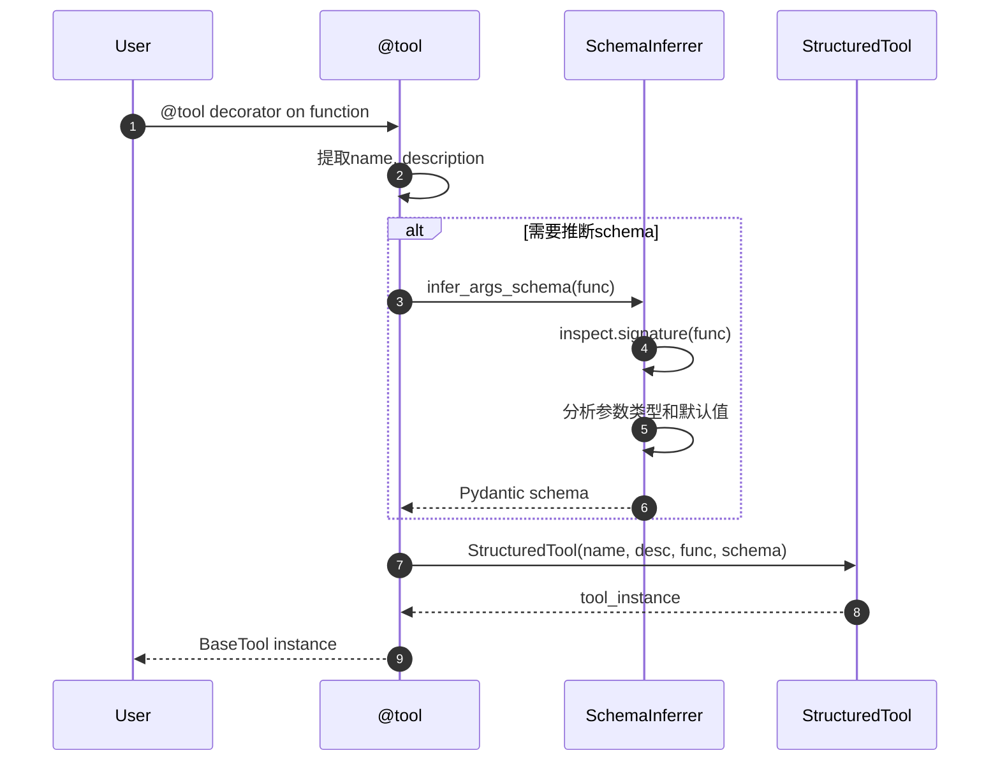
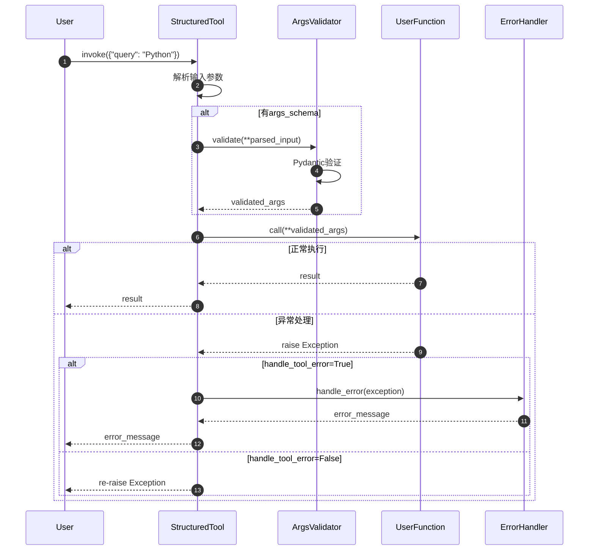

# LangChain-07-Tools-API

## 文档说明

本文档详细描述 **Tools 模块**的对外 API，包括 `BaseTool`、`@tool` 装饰器、`StructuredTool` 等核心接口的所有公开方法、参数规格、调用链路和最佳实践。

---

## 1. @tool 装饰器 API

### 1.1 基础用法

#### 基本信息
- **方法签名**：`tool(func: Callable, *, name: str = None, description: str = None, return_direct: bool = False) -> BaseTool`
- **功能**：将普通Python函数转换为LangChain工具
- **优势**：最简单的工具创建方式

#### 请求参数

```python
def tool(
    func: Optional[Callable] = None,
    *,
    name: Optional[str] = None,
    description: Optional[str] = None,
    return_direct: bool = False,
    args_schema: Optional[Type[BaseModel]] = None,
    infer_schema: bool = True,
    **kwargs: Any,
) -> Union[BaseTool, Callable[[Callable], BaseTool]]:
    """工具装饰器。"""
```

**参数说明**：

| 参数 | 类型 | 必填 | 默认 | 说明 |
|-----|------|-----|------|------|
| func | `Callable` | 否 | `None` | 被装饰的函数 |
| name | `str` | 否 | 函数名 | 工具名称（用于Agent调用） |
| description | `str` | 否 | 函数docstring | 工具描述（用于Agent选择） |
| return_direct | `bool` | 否 | `False` | 是否直接返回结果给用户 |
| args_schema | `Type[BaseModel]` | 否 | 自动推断 | 参数schema（Pydantic模型） |
| infer_schema | `bool` | 否 | `True` | 是否自动推断参数schema |

#### 基础使用示例

```python
from langchain_core.tools import tool
from typing import Optional

@tool
def search_wikipedia(query: str, max_results: int = 3) -> str:
    """搜索Wikipedia获取信息。
    
    Args:
        query: 搜索查询字符串
        max_results: 最大结果数量，默认3个
    
    Returns:
        搜索结果的摘要文本
    """
    # 实际搜索逻辑（此处省略）
    return f"搜索'{query}'的结果：..."

# 使用工具
result = search_wikipedia.invoke({"query": "Python", "max_results": 5})
print(result)  # "搜索'Python'的结果：..."
```

#### 入口函数实现

```python
# libs/core/langchain_core/tools/__init__.py
def tool(
    func: Optional[Callable] = None,
    *,
    name: Optional[str] = None,
    description: Optional[str] = None,
    return_direct: bool = False,
    args_schema: Optional[Type[BaseModel]] = None,
    infer_schema: bool = True,
    **kwargs: Any,
) -> Union[BaseTool, Callable[[Callable], BaseTool]]:
    """将函数转换为工具。"""
    
    def _create_tool(func: Callable) -> BaseTool:
        # 1. 提取工具名称
        tool_name = name or func.__name__
        
        # 2. 提取描述
        tool_description = description or func.__doc__ or f"Tool {tool_name}"
        
        # 3. 推断参数schema
        if infer_schema and args_schema is None:
            schema = _infer_args_schema_from_function(func)
        else:
            schema = args_schema
        
        # 4. 创建工具实例
        return StructuredTool(
            name=tool_name,
            description=tool_description,
            func=func,
            args_schema=schema,
            return_direct=return_direct,
            **kwargs
        )
    
    # 装饰器模式支持
    if func is None:
        return _create_tool
    else:
        return _create_tool(func)
```

#### 参数Schema自动推断

```python
def _infer_args_schema_from_function(func: Callable) -> Type[BaseModel]:
    """从函数签名推断参数schema。"""
    import inspect
    from pydantic import create_model
    
    # 获取函数签名
    signature = inspect.signature(func)
    
    # 构建字段定义
    fields = {}
    for param_name, param in signature.parameters.items():
        if param_name == 'self':
            continue
            
        # 提取类型注解
        param_type = param.annotation if param.annotation != inspect.Parameter.empty else str
        
        # 处理默认值
        if param.default != inspect.Parameter.empty:
            fields[param_name] = (param_type, param.default)
        else:
            fields[param_name] = (param_type, ...)
    
    # 创建Pydantic模型
    return create_model(f"{func.__name__}Schema", **fields)
```

#### 时序图



---

### 1.2 高级用法

#### 自定义参数Schema

```python
from pydantic import BaseModel, Field

class SearchParams(BaseModel):
    """搜索参数模型。"""
    query: str = Field(description="搜索查询字符串")
    max_results: int = Field(default=3, ge=1, le=10, description="结果数量(1-10)")
    language: str = Field(default="en", description="语言代码")

@tool(args_schema=SearchParams)
def advanced_search(query: str, max_results: int = 3, language: str = "en") -> str:
    """高级搜索工具。"""
    return f"搜索'{query}'，语言:{language}，结果数:{max_results}"
```

#### 返回直接结果

```python
@tool(return_direct=True)
def get_current_time() -> str:
    """获取当前时间（直接返回给用户）。"""
    from datetime import datetime
    return datetime.now().strftime("%Y-%m-%d %H:%M:%S")

# Agent使用此工具时，会直接将结果返回给用户，不会继续推理
```

---

## 2. StructuredTool 核心 API

### 2.1 from_function 类方法

#### 基本信息
- **方法签名**：`from_function(func: Callable, name: str = None, description: str = None, **kwargs) -> StructuredTool`
- **功能**：从函数创建结构化工具
- **与@tool的区别**：更灵活的配置选项

#### 使用示例

```python
from langchain_core.tools import StructuredTool

def calculate(expression: str) -> str:
    """计算数学表达式。
    
    Args:
        expression: 数学表达式字符串
    """
    try:
        result = eval(expression)  # 生产环境需要安全处理
        return str(result)
    except Exception as e:
        return f"计算错误: {e}"

# 创建工具
calculator = StructuredTool.from_function(
    func=calculate,
    name="calculator",
    description="执行数学计算",
    return_direct=False
)
```

#### 入口函数实现

```python
class StructuredTool(BaseTool):
    
    @classmethod
    def from_function(
        cls,
        func: Callable,
        name: Optional[str] = None,
        description: Optional[str] = None,
        return_direct: bool = False,
        args_schema: Optional[Type[BaseModel]] = None,
        infer_schema: bool = True,
        **kwargs: Any,
    ) -> StructuredTool:
        """从函数创建结构化工具。"""
        
        # 推断或使用提供的schema
        if args_schema is None and infer_schema:
            args_schema = _create_schema_from_function(func)
        
        return cls(
            name=name or func.__name__,
            description=description or func.__doc__ or "",
            func=func,
            args_schema=args_schema,
            return_direct=return_direct,
            **kwargs
        )
```

---

### 2.2 invoke - 同步调用

#### 基本信息
- **方法签名**：`invoke(input: Union[str, Dict], config: RunnableConfig = None) -> Any`
- **功能**：同步调用工具
- **输入格式**：字符串或字典

#### 请求参数

```python
def invoke(
    self,
    input: Union[str, Dict[str, Any]],
    config: Optional[RunnableConfig] = None,
    **kwargs: Any,
) -> Any:
    """同步调用工具。"""
```

#### 响应结构

工具的返回值类型取决于具体实现，常见类型：

- `str`：文本结果
- `Dict[str, Any]`：结构化数据
- `List[Any]`：列表数据
- 自定义对象

#### 入口函数实现

```python
def invoke(
    self,
    input: Union[str, Dict[str, Any]],
    config: Optional[RunnableConfig] = None,
    **kwargs: Any,
) -> Any:
    # 1. 解析输入参数
    if isinstance(input, str):
        # 字符串输入，尝试解析为JSON
        parsed_input = self._parse_string_input(input)
    else:
        parsed_input = input
    
    # 2. 验证参数
    if self.args_schema:
        validated_input = self.args_schema(**parsed_input)
        tool_args = validated_input.dict()
    else:
        tool_args = parsed_input
    
    # 3. 执行工具函数
    return self._run(**tool_args)

def _run(self, **kwargs: Any) -> Any:
    """执行工具的核心逻辑。"""
    try:
        # 调用用户定义的函数
        return self.func(**kwargs)
    except Exception as e:
        if self.handle_tool_error:
            return self._handle_tool_error(e)
        else:
            raise
```

#### 时序图



---

### 2.3 ainvoke - 异步调用

#### 基本信息
- **方法签名**：`ainvoke(input: Union[str, Dict], config: RunnableConfig = None) -> Any`
- **功能**：异步调用工具
- **适用场景**：I/O密集型工具（API调用、文件操作等）

#### 使用示例

```python
import asyncio
import aiohttp

@tool
async def fetch_url(url: str) -> str:
    """异步获取URL内容。"""
    async with aiohttp.ClientSession() as session:
        async with session.get(url) as response:
            return await response.text()

# 异步调用
async def main():
    result = await fetch_url.ainvoke({"url": "https://httpbin.org/json"})
    print(result)

asyncio.run(main())
```

#### 实现原理

```python
async def ainvoke(
    self,
    input: Union[str, Dict[str, Any]],
    config: Optional[RunnableConfig] = None,
    **kwargs: Any,
) -> Any:
    # 解析和验证参数（同invoke）
    parsed_input = self._parse_input(input)
    
    # 异步执行
    return await self._arun(**parsed_input)

async def _arun(self, **kwargs: Any) -> Any:
    """异步执行工具。"""
    if asyncio.iscoroutinefunction(self.func):
        # 函数本身是异步的
        return await self.func(**kwargs)
    else:
        # 同步函数，使用线程池执行
        loop = asyncio.get_event_loop()
        return await loop.run_in_executor(None, self.func, **kwargs)
```

---

## 3. BaseTool 核心 API

### 3.1 直接继承BaseTool

#### 基本信息
- **适用场景**：需要完全控制工具行为的复杂工具
- **优势**：最大的灵活性和定制性

#### 实现示例

```python
from langchain_core.tools import BaseTool
from pydantic import BaseModel, Field

class DatabaseQueryInput(BaseModel):
    """数据库查询输入。"""
    query: str = Field(description="SQL查询语句")
    database: str = Field(default="default", description="数据库名称")

class DatabaseTool(BaseTool):
    """数据库查询工具。"""
    
    name: str = "database_query"
    description: str = "执行SQL查询并返回结果"
    args_schema: Type[BaseModel] = DatabaseQueryInput
    return_direct: bool = False
    
    def _run(
        self,
        query: str,
        database: str = "default",
        run_manager: Optional[CallbackManagerForToolRun] = None,
    ) -> str:
        """同步执行查询。"""
        try:
            # 数据库连接和查询逻辑
            result = self._execute_query(query, database)
            return f"查询结果：{result}"
        except Exception as e:
            return f"查询失败：{e}"
    
    async def _arun(
        self,
        query: str,
        database: str = "default",
        run_manager: Optional[AsyncCallbackManagerForToolRun] = None,
    ) -> str:
        """异步执行查询。"""
        # 异步数据库操作
        result = await self._async_execute_query(query, database)
        return f"查询结果：{result}"
```

### 3.2 必需实现的方法

#### _run 方法

```python
def _run(
    self,
    *args: Any,
    run_manager: Optional[CallbackManagerForToolRun] = None,
    **kwargs: Any,
) -> Any:
    """同步执行工具的核心方法。
    
    Args:
        *args: 位置参数
        run_manager: 回调管理器
        **kwargs: 关键字参数（来自args_schema验证）
    
    Returns:
        工具执行结果
    """
    raise NotImplementedError("子类必须实现_run方法")
```

#### _arun 方法（可选）

```python
async def _arun(
    self,
    *args: Any,
    run_manager: Optional[AsyncCallbackManagerForToolRun] = None,
    **kwargs: Any,
) -> Any:
    """异步执行工具。
    
    如果不实现，会回退到在线程池中执行_run方法。
    """
    # 默认实现：在线程池中执行同步方法
    return await asyncio.get_event_loop().run_in_executor(
        None, self._run, *args, **kwargs
    )
```

---

## 4. 工具辅助函数

### 4.1 convert_runnable_to_tool

#### 基本信息
- **功能**：将任意Runnable转换为Tool
- **适用场景**：复用现有的Chain或其他Runnable

#### 使用示例

```python
from langchain_core.tools import convert_runnable_to_tool
from langchain_core.prompts import PromptTemplate
from langchain_openai import ChatOpenAI

# 创建一个简单的翻译链
translate_prompt = PromptTemplate.from_template(
    "Translate the following text to {language}: {text}"
)
model = ChatOpenAI()
translate_chain = translate_prompt | model

# 转换为工具
translate_tool = convert_runnable_to_tool(
    translate_chain,
    name="translator",
    description="翻译文本到指定语言"
)

# 使用
result = translate_tool.invoke({
    "text": "Hello world",
    "language": "Chinese"
})
```

#### 实现原理

```python
def convert_runnable_to_tool(
    runnable: Runnable,
    *,
    name: str,
    description: str,
    args_schema: Optional[Type[BaseModel]] = None,
    **kwargs: Any,
) -> BaseTool:
    """将Runnable转换为Tool。"""
    
    class RunnableTool(BaseTool):
        runnable: Runnable
        
        def _run(self, **kwargs: Any) -> Any:
            return self.runnable.invoke(kwargs)
        
        async def _arun(self, **kwargs: Any) -> Any:
            return await self.runnable.ainvoke(kwargs)
    
    return RunnableTool(
        runnable=runnable,
        name=name,
        description=description,
        args_schema=args_schema,
        **kwargs
    )
```

---

### 4.2 create_retriever_tool

#### 基本信息
- **功能**：从检索器创建工具
- **适用场景**：RAG系统中的文档检索

#### 使用示例

```python
from langchain_core.tools import create_retriever_tool
from langchain_chroma import Chroma
from langchain_openai import OpenAIEmbeddings

# 创建向量存储和检索器
vectorstore = Chroma.from_texts(
    ["Python是一种编程语言", "机器学习很有趣"],
    OpenAIEmbeddings()
)
retriever = vectorstore.as_retriever()

# 创建检索工具
retriever_tool = create_retriever_tool(
    retriever,
    name="knowledge_search",
    description="搜索知识库获取相关信息"
)

# 使用
result = retriever_tool.invoke({"query": "Python"})
```

#### 实现原理

```python
def create_retriever_tool(
    retriever: BaseRetriever,
    name: str,
    description: str,
    *,
    document_prompt: Optional[BasePromptTemplate] = None,
    document_separator: str = "\n\n",
) -> BaseTool:
    """从检索器创建工具。"""
    
    @tool
    def retriever_tool(query: str) -> str:
        """检索相关文档。"""
        docs = retriever.get_relevant_documents(query)
        
        if document_prompt is None:
            # 默认格式：内容
            formatted_docs = [doc.page_content for doc in docs]
        else:
            # 自定义格式
            formatted_docs = [
                document_prompt.format(**doc.metadata, page_content=doc.page_content)
                for doc in docs
            ]
        
        return document_separator.join(formatted_docs)
    
    retriever_tool.name = name
    retriever_tool.description = description
    return retriever_tool
```

---

## 5. 错误处理与调试

### 5.1 工具异常处理

#### ToolException

```python
from langchain_core.tools import ToolException

@tool
def risky_operation(data: str) -> str:
    """可能失败的操作。"""
    if not data:
        raise ToolException("数据不能为空")
    
    try:
        # 执行可能失败的操作
        result = process_data(data)
        return result
    except ValueError as e:
        raise ToolException(f"数据处理失败: {e}")
```

#### handle_tool_error 配置

```python
# 方式1：返回错误消息而不抛出异常
@tool(handle_tool_error=True)
def error_prone_tool(input: str) -> str:
    """容易出错的工具。"""
    if input == "error":
        raise ValueError("故意触发错误")
    return f"处理: {input}"

# 使用
result = error_prone_tool.invoke({"input": "error"})
print(result)  # "ValueError: 故意触发错误"

# 方式2：自定义错误处理
def custom_error_handler(error: Exception) -> str:
    return f"工具执行失败: {type(error).__name__}: {error}"

safe_tool = StructuredTool.from_function(
    func=error_prone_function,
    name="safe_tool",
    handle_tool_error=custom_error_handler
)
```

### 5.2 工具调试

#### 回调管理器

```python
from langchain.callbacks import StdOutCallbackHandler

# 添加调试回调
debug_tool = StructuredTool.from_function(
    func=my_function,
    name="debug_tool",
    callbacks=[StdOutCallbackHandler()],
    verbose=True
)

# 调用时会输出详细信息
result = debug_tool.invoke({"param": "value"})
```

#### 工具执行追踪

```python
import time

class TimedTool(BaseTool):
    """带执行时间追踪的工具。"""
    
    def _run(self, **kwargs: Any) -> Any:
        start_time = time.time()
        try:
            result = self._execute(**kwargs)
            execution_time = time.time() - start_time
            print(f"工具 {self.name} 执行时间: {execution_time:.2f}秒")
            return result
        except Exception as e:
            execution_time = time.time() - start_time
            print(f"工具 {self.name} 执行失败，耗时: {execution_time:.2f}秒")
            raise
```

---

## 6. 最佳实践

### 6.1 工具设计原则

```python
# ✅ 好的工具设计
@tool
def search_documents(
    query: str,
    max_results: int = 5,
    document_type: str = "all"
) -> str:
    """搜索文档库获取相关信息。
    
    Args:
        query: 搜索查询字符串，应该是具体的问题或关键词
        max_results: 返回的最大结果数量，范围1-20
        document_type: 文档类型过滤，可选: 'all', 'pdf', 'doc', 'txt'
    
    Returns:
        搜索结果的摘要，包含标题和相关内容片段
    
    Examples:
        search_documents("Python装饰器", max_results=3, document_type="pdf")
    """
    # 清晰的实现逻辑
    pass

# ❌ 避免的工具设计
@tool
def do_stuff(data: str) -> str:
    """做一些事情。"""  # 描述太模糊
    # 功能不明确的实现
    pass
```

### 6.2 参数验证

```python
from pydantic import BaseModel, Field, validator

class SearchInput(BaseModel):
    """搜索输入验证。"""
    query: str = Field(..., min_length=1, max_length=200, description="搜索查询")
    max_results: int = Field(5, ge=1, le=20, description="结果数量")
    language: str = Field("en", regex="^[a-z]{2}$", description="语言代码")
    
    @validator('query')
    def validate_query(cls, v):
        if v.strip() != v:
            raise ValueError("查询不能包含前后空格")
        return v

@tool(args_schema=SearchInput)
def validated_search(query: str, max_results: int = 5, language: str = "en") -> str:
    """经过严格验证的搜索工具。"""
    return f"搜索'{query}'，语言:{language}，结果数:{max_results}"
```

### 6.3 性能优化

```python
import functools
import asyncio
from typing import Dict, Any

class CachedTool(BaseTool):
    """带缓存的工具。"""
    
    def __init__(self, **kwargs):
        super().__init__(**kwargs)
        self._cache: Dict[str, Any] = {}
        self._cache_size = 100
    
    def _cache_key(self, **kwargs) -> str:
        """生成缓存键。"""
        return str(sorted(kwargs.items()))
    
    def _run(self, **kwargs: Any) -> Any:
        cache_key = self._cache_key(**kwargs)
        
        # 检查缓存
        if cache_key in self._cache:
            return self._cache[cache_key]
        
        # 执行并缓存
        result = self._execute(**kwargs)
        
        # 限制缓存大小
        if len(self._cache) >= self._cache_size:
            # 删除最旧的项
            oldest_key = next(iter(self._cache))
            del self._cache[oldest_key]
        
        self._cache[cache_key] = result
        return result
```

---

## 7. 总结

本文档详细描述了 **Tools 模块**的核心 API：

### 主要工具创建方式
1. **@tool 装饰器**：最简单的工具创建方式
2. **StructuredTool.from_function**：更灵活的配置选项
3. **继承 BaseTool**：完全控制工具行为

### 核心方法
1. **invoke/ainvoke**：同步/异步工具调用
2. **参数验证**：基于 Pydantic 的自动验证
3. **错误处理**：ToolException 和 handle_tool_error

### 辅助功能
1. **convert_runnable_to_tool**：Runnable 到 Tool 的转换
2. **create_retriever_tool**：从检索器创建工具
3. **回调和调试**：工具执行追踪

每个 API 均包含：
- 完整的请求/响应结构
- 入口函数核心代码
- 详细时序图
- 实际使用示例
- 最佳实践建议

工具系统是 LangChain Agent 的基础，正确设计和使用工具对构建智能代理系统至关重要。
