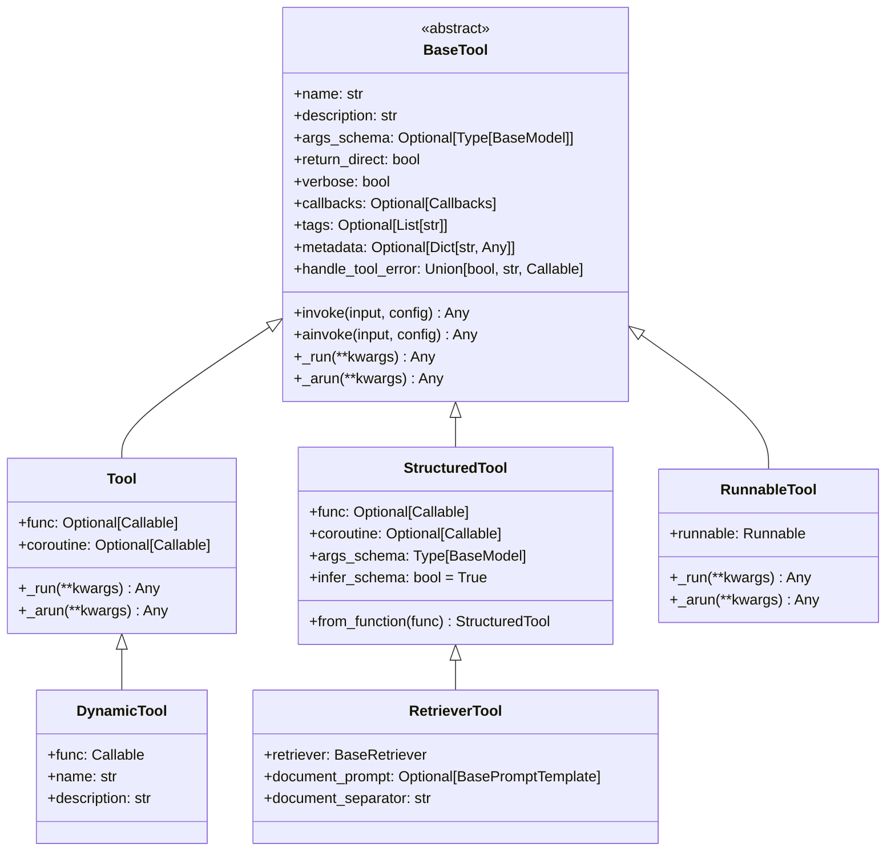
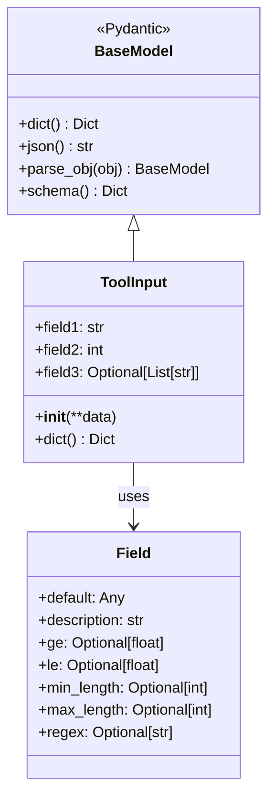
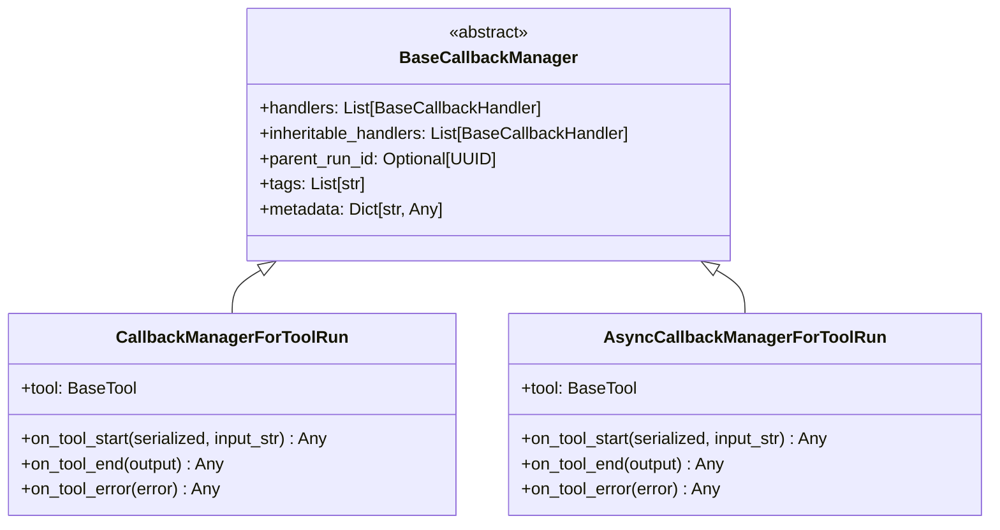
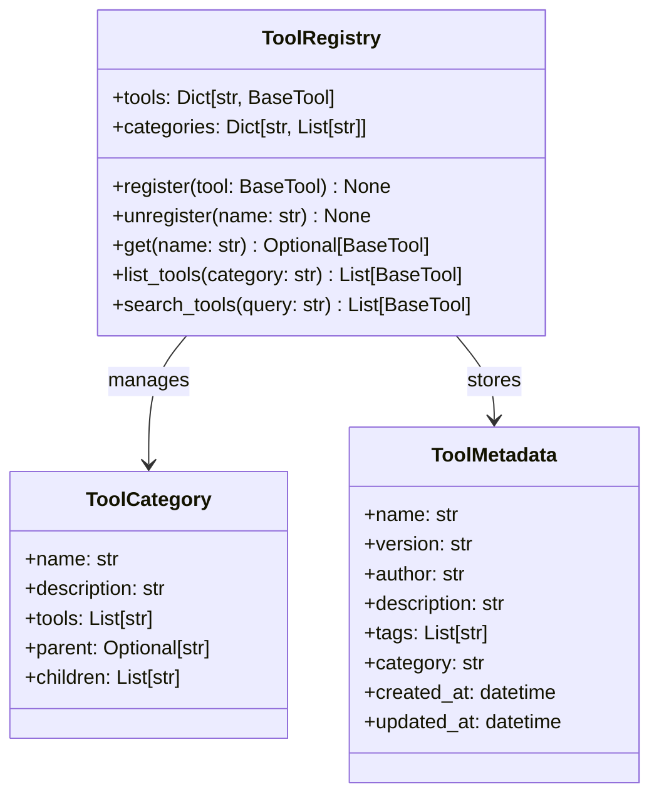

# LangChain-07-Tools-数据结构

## 文档说明

本文档详细描述 **Tools 模块**的核心数据结构，包括工具类层次、参数验证、回调管理、错误处理等。所有结构均配备 UML 类图和详细的字段说明。

---

## 1. 工具类层次结构

### 1.1 BaseTool 继承体系



**图解说明**：

1. **抽象基类**：
   - `BaseTool`：所有工具的基类，定义统一接口
   - 包含元数据、执行方法、错误处理等核心功能

2. **具体实现**：
   - `Tool`：基础工具，封装单个函数
   - `StructuredTool`：结构化工具，支持参数验证
   - `DynamicTool`：动态工具，运行时创建

3. **专用工具**：
   - `RunnableTool`：将Runnable包装为工具
   - `RetrieverTool`：检索器工具

---

## 2. BaseTool 核心字段

### 2.1 字段详解

```python
class BaseTool(RunnableSerializable[Union[str, Dict], Any]):
    """工具基类。"""

    name: str  # 工具名称
    description: str = ""  # 工具描述
    args_schema: Optional[Type[BaseModel]] = None  # 参数Schema
    return_direct: bool = False  # 是否直接返回结果
    verbose: bool = False  # 详细输出
    callbacks: Optional[Callbacks] = None  # 回调处理器
    tags: Optional[List[str]] = None  # 标签
    metadata: Optional[Dict[str, Any]] = None  # 元数据
    handle_tool_error: Union[bool, str, Callable[[Exception], str], None] = False
```

**字段表**：

| 字段 | 类型 | 必填 | 默认 | 说明 |
|-----|------|-----|------|------|
| name | `str` | 是 | - | 工具唯一标识符，用于Agent调用 |
| description | `str` | 否 | `""` | 工具功能描述，用于Agent选择 |
| args_schema | `Type[BaseModel]` | 否 | `None` | 参数验证Schema |
| return_direct | `bool` | 否 | `False` | True时直接返回结果给用户 |
| verbose | `bool` | 否 | `False` | 是否输出详细执行信息 |
| callbacks | `Callbacks` | 否 | `None` | 回调处理器列表 |
| tags | `List[str]` | 否 | `None` | 分类标签 |
| metadata | `Dict[str, Any]` | 否 | `None` | 附加元数据 |
| handle_tool_error | `Union[bool, str, Callable]` | 否 | `False` | 错误处理策略 |

**字段使用示例**：

```python
from pydantic import BaseModel, Field

class CalculatorInput(BaseModel):
    """计算器输入参数。"""
    expression: str = Field(description="数学表达式")

class CalculatorTool(BaseTool):
    name: str = "calculator"
    description: str = "执行数学计算，支持基本运算符"
    args_schema: Type[BaseModel] = CalculatorInput
    return_direct: bool = False
    verbose: bool = True
    tags: List[str] = ["math", "calculation"]
    metadata: Dict[str, Any] = {"version": "1.0", "author": "system"}
    handle_tool_error: bool = True  # 捕获异常并返回错误消息
```

---

### 2.2 错误处理策略

```python
# handle_tool_error 支持多种类型
class ErrorHandlingTool(BaseTool):

    # 1. 布尔值：True时返回异常字符串
    handle_tool_error: bool = True

    # 2. 字符串：返回固定错误消息
    handle_tool_error: str = "工具执行失败，请重试"

    # 3. 函数：自定义错误处理逻辑
    def custom_error_handler(self, error: Exception) -> str:
        if isinstance(error, ValueError):
            return f"参数错误: {error}"
        elif isinstance(error, TimeoutError):
            return "执行超时，请稍后重试"
        else:
            return f"未知错误: {type(error).__name__}"

    handle_tool_error: Callable[[Exception], str] = custom_error_handler
```

**错误处理流程**：

```mermaid
flowchart TD
    Start[工具执行] --> Execute[调用_run方法]
    Execute --> Success{执行成功?}

    Success -->|是| Return[返回结果]
    Success -->|否| HandleError{handle_tool_error类型}

    HandleError -->|False| Raise[抛出异常]
    HandleError -->|True| StringError[返回str(exception)]
    HandleError -->|str| FixedMsg[返回固定消息]
    HandleError -->|Callable| CustomHandler[调用自定义处理器]

    StringError --> Return
    FixedMsg --> Return
    CustomHandler --> Return
```

---

## 3. 参数验证数据结构

### 3.1 Args Schema 系统



**参数Schema示例**：

```python
from pydantic import BaseModel, Field, validator
from typing import Optional, List, Literal

class WebSearchInput(BaseModel):
    """网络搜索工具输入参数。"""

    query: str = Field(
        ...,  # 必填
        description="搜索查询字符串",
        min_length=1,
        max_length=200,
        example="Python 异步编程"
    )

    max_results: int = Field(
        default=5,
        description="最大结果数量",
        ge=1,  # 大于等于1
        le=20,  # 小于等于20
        example=10
    )

    language: Optional[str] = Field(
        default="zh",
        description="搜索语言",
        regex="^[a-z]{2}$",  # 两位语言代码
        example="zh"
    )

    search_type: Literal["web", "news", "images"] = Field(
        default="web",
        description="搜索类型"
    )

    filters: Optional[List[str]] = Field(
        default=None,
        description="搜索过滤器",
        example=["recent", "authoritative"]
    )

    @validator('query')
    def validate_query(cls, v):
        """查询验证器。"""
        v = v.strip()
        if not v:
            raise ValueError("搜索查询不能为空")

        # 检查敏感词
        forbidden_words = ["hack", "crack"]
        if any(word in v.lower() for word in forbidden_words):
            raise ValueError("查询包含禁用词汇")

        return v

    @validator('filters')
    def validate_filters(cls, v):
        """过滤器验证器。"""
        if v is None:
            return v

        allowed_filters = ["recent", "authoritative", "academic"]
        invalid_filters = [f for f in v if f not in allowed_filters]

        if invalid_filters:
            raise ValueError(f"无效的过滤器: {invalid_filters}")

        return v

    class Config:
        """Pydantic配置。"""
        schema_extra = {
            "example": {
                "query": "机器学习算法",
                "max_results": 8,
                "language": "zh",
                "search_type": "web",
                "filters": ["recent", "authoritative"]
            }
        }
```

**Schema JSON输出**：

```json
{
  "title": "WebSearchInput",
  "description": "网络搜索工具输入参数。",
  "type": "object",
  "properties": {
    "query": {
      "title": "Query",
      "description": "搜索查询字符串",
      "minLength": 1,
      "maxLength": 200,
      "example": "Python 异步编程",
      "type": "string"
    },
    "max_results": {
      "title": "Max Results",
      "description": "最大结果数量",
      "default": 5,
      "minimum": 1,
      "maximum": 20,
      "example": 10,
      "type": "integer"
    }
  },
  "required": ["query"]
}
```

---

### 3.2 参数类型推断

```python
class SchemaInferrer:
    """参数Schema推断器。"""

    @staticmethod
    def infer_from_function(func: Callable) -> Type[BaseModel]:
        """从函数签名推断Schema。"""
        import inspect
        from pydantic import create_model
        from typing import get_type_hints

        # 获取函数签名
        sig = inspect.signature(func)
        type_hints = get_type_hints(func)

        # 构建字段定义
        fields = {}
        for param_name, param in sig.parameters.items():
            if param_name in ('self', 'cls', 'run_manager'):
                continue

            # 获取类型
            param_type = type_hints.get(param_name, str)

            # 处理默认值
            if param.default != inspect.Parameter.empty:
                if param.default is None:
                    # Optional字段
                    fields[param_name] = (param_type, None)
                else:
                    fields[param_name] = (param_type, param.default)
            else:
                # 必填字段
                fields[param_name] = (param_type, ...)

        # 创建动态Schema
        schema_name = f"{func.__name__}Schema"
        return create_model(schema_name, **fields)
```

**推断示例**：

```python
def search_tool(
    query: str,
    max_results: int = 5,
    include_snippets: bool = True,
    tags: Optional[List[str]] = None
) -> str:
    """搜索工具函数。"""
    pass

# 自动推断的Schema等价于：
class SearchToolSchema(BaseModel):
    query: str  # 必填，无默认值
    max_results: int = 5  # 可选，默认5
    include_snippets: bool = True  # 可选，默认True
    tags: Optional[List[str]] = None  # 可选，默认None
```

---

## 4. 回调数据结构

### 4.1 回调管理器层次



**回调事件类型**：

```python
from enum import Enum

class ToolEvent(str, Enum):
    """工具回调事件类型。"""
    START = "on_tool_start"
    END = "on_tool_end"
    ERROR = "on_tool_error"
    STREAM = "on_tool_stream"  # 流式工具

class ToolCallbackData(TypedDict):
    """工具回调数据。"""
    tool_name: str
    input_data: Dict[str, Any]
    output_data: Optional[Any]
    error: Optional[Exception]
    start_time: float
    end_time: Optional[float]
    execution_time: Optional[float]
```

**回调使用示例**：

```python
from langchain.callbacks import BaseCallbackHandler

class ToolMetricsCallback(BaseCallbackHandler):
    """工具性能监控回调。"""

    def __init__(self):
        self.tool_metrics = {}

    def on_tool_start(
        self,
        serialized: Dict[str, Any],
        input_str: str,
        **kwargs: Any,
    ) -> Any:
        """工具开始执行。"""
        tool_name = serialized.get("name", "unknown")
        self.tool_metrics[tool_name] = {
            "start_time": time.time(),
            "input_size": len(input_str),
            "call_count": self.tool_metrics.get(tool_name, {}).get("call_count", 0) + 1
        }

    def on_tool_end(
        self,
        output: str,
        **kwargs: Any,
    ) -> Any:
        """工具执行结束。"""
        # 更新执行时间和输出统计
        pass

    def on_tool_error(
        self,
        error: Exception,
        **kwargs: Any,
    ) -> Any:
        """工具执行错误。"""
        # 记录错误统计
        pass

# 使用回调
metrics_callback = ToolMetricsCallback()
tool = StructuredTool.from_function(
    func=my_function,
    callbacks=[metrics_callback]
)
```

---

## 5. 工具执行上下文

### 5.1 RunManager 数据结构

```python
class ToolRunManager:
    """工具执行管理器。"""

    run_id: UUID  # 运行ID
    parent_run_id: Optional[UUID]  # 父运行ID
    tool_name: str  # 工具名称
    start_time: datetime  # 开始时间
    end_time: Optional[datetime]  # 结束时间
    input_data: Dict[str, Any]  # 输入参数
    output_data: Optional[Any]  # 输出结果
    error: Optional[Exception]  # 错误信息
    tags: List[str]  # 标签
    metadata: Dict[str, Any]  # 元数据

    def elapsed_time(self) -> Optional[timedelta]:
        """计算执行时间。"""
        if self.start_time and self.end_time:
            return self.end_time - self.start_time
        return None

    def is_successful(self) -> bool:
        """检查是否执行成功。"""
        return self.error is None

    def to_dict(self) -> Dict[str, Any]:
        """转换为字典。"""
        return {
            "run_id": str(self.run_id),
            "parent_run_id": str(self.parent_run_id) if self.parent_run_id else None,
            "tool_name": self.tool_name,
            "start_time": self.start_time.isoformat(),
            "end_time": self.end_time.isoformat() if self.end_time else None,
            "execution_time": self.elapsed_time().total_seconds() if self.elapsed_time() else None,
            "input_data": self.input_data,
            "output_data": self.output_data,
            "error": str(self.error) if self.error else None,
            "success": self.is_successful(),
            "tags": self.tags,
            "metadata": self.metadata
        }
```

---

## 6. 工具注册与发现

### 6.1 工具注册表



**工具注册表实现**：

```python
class ToolRegistry:
    """工具注册表。"""

    def __init__(self):
        self._tools: Dict[str, BaseTool] = {}
        self._categories: Dict[str, List[str]] = {
            "web": [],
            "database": [],
            "file": [],
            "calculation": [],
            "ai": [],
            "utility": []
        }

    def register(self, tool: BaseTool, category: str = "utility") -> None:
        """注册工具。"""
        if tool.name in self._tools:
            raise ValueError(f"工具 '{tool.name}' 已存在")

        self._tools[tool.name] = tool

        if category not in self._categories:
            self._categories[category] = []
        self._categories[category].append(tool.name)

    def get(self, name: str) -> Optional[BaseTool]:
        """获取工具。"""
        return self._tools.get(name)

    def list_tools(self, category: Optional[str] = None) -> List[BaseTool]:
        """列出工具。"""
        if category is None:
            return list(self._tools.values())

        tool_names = self._categories.get(category, [])
        return [self._tools[name] for name in tool_names]

    def search_tools(self, query: str) -> List[BaseTool]:
        """搜索工具。"""
        query_lower = query.lower()
        matches = []

        for tool in self._tools.values():
            # 搜索名称和描述
            if (query_lower in tool.name.lower() or
                query_lower in tool.description.lower()):
                matches.append(tool)

            # 搜索标签
            if tool.tags:
                for tag in tool.tags:
                    if query_lower in tag.lower():
                        matches.append(tool)
                        break

        return matches

# 全局注册表
tool_registry = ToolRegistry()

# 装饰器注册
def register_tool(category: str = "utility", name: str = None):
    """工具注册装饰器。"""
    def decorator(tool_func):
        tool = StructuredTool.from_function(
            tool_func,
            name=name or tool_func.__name__
        )
        tool_registry.register(tool, category)
        return tool
    return decorator

# 使用示例
@register_tool(category="web", name="web_search")
def search_web(query: str, max_results: int = 5) -> str:
    """搜索网页。"""
    return f"搜索结果: {query}"
```

---

## 7. 工具链和组合

### 7.1 工具链数据结构

```python
class ToolChain:
    """工具链，按顺序执行多个工具。"""

    def __init__(self, tools: List[BaseTool], name: str = "tool_chain"):
        self.tools = tools
        self.name = name
        self.intermediate_results: List[Any] = []

    def execute(self, initial_input: Any) -> Any:
        """执行工具链。"""
        current_input = initial_input

        for i, tool in enumerate(self.tools):
            result = tool.invoke(current_input)
            self.intermediate_results.append(result)

            # 下一个工具的输入是当前工具的输出
            current_input = result

        return current_input

    def to_dict(self) -> Dict[str, Any]:
        """转换为字典。"""
        return {
            "name": self.name,
            "tools": [tool.name for tool in self.tools],
            "intermediate_results": self.intermediate_results
        }

class ToolGraph:
    """工具图，支持复杂的工具组合。"""

    def __init__(self):
        self.nodes: Dict[str, BaseTool] = {}
        self.edges: List[Tuple[str, str, Callable]] = []  # (from, to, condition)

    def add_tool(self, tool: BaseTool) -> None:
        """添加工具节点。"""
        self.nodes[tool.name] = tool

    def add_edge(self, from_tool: str, to_tool: str, condition: Callable = None) -> None:
        """添加工具连接。"""
        self.edges.append((from_tool, to_tool, condition or (lambda x: True)))

    def execute(self, start_tool: str, input_data: Any) -> Dict[str, Any]:
        """执行工具图。"""
        results = {}
        current_tools = [start_tool]

        while current_tools:
            next_tools = []

            for tool_name in current_tools:
                tool = self.nodes[tool_name]
                result = tool.invoke(input_data)
                results[tool_name] = result

                # 检查下游工具
                for from_tool, to_tool, condition in self.edges:
                    if from_tool == tool_name and condition(result):
                        next_tools.append(to_tool)

            current_tools = list(set(next_tools))
            input_data = results  # 下游工具可以访问所有结果

        return results
```

---

## 8. 序列化与持久化

### 8.1 工具序列化格式

```python
# 工具序列化示例
tool = StructuredTool.from_function(
    func=search_function,
    name="web_search",
    description="搜索网页内容"
)

serialized = tool.dict()
# {
#     "name": "web_search",
#     "description": "搜索网页内容",
#     "args_schema": {
#         "title": "SearchFunctionSchema",
#         "type": "object",
#         "properties": {
#             "query": {"type": "string", "description": "搜索查询"}
#         },
#         "required": ["query"]
#     },
#     "return_direct": false,
#     "verbose": false,
#     "tags": null,
#     "metadata": null,
#     "_type": "structured_tool"
# }
```

### 8.2 工具配置存储

```yaml
# tools.yaml - 工具配置文件
tools:
  - name: web_search
    type: structured_tool
    description: 搜索网页获取信息
    module: my_tools.web
    function: search_web
    args_schema:
      query:
        type: string
        description: 搜索查询字符串
        required: true
      max_results:
        type: integer
        description: 最大结果数
        default: 5
        minimum: 1
        maximum: 20
    tags: [web, search]
    category: web

  - name: calculator
    type: structured_tool
    description: 执行数学计算
    module: my_tools.math
    function: calculate
    return_direct: false
    handle_tool_error: true
    tags: [math, calculation]
    category: calculation
```

---

## 9. 性能与监控数据

### 9.1 工具性能指标

```python
class ToolPerformanceMetrics:
    """工具性能指标。"""

    def __init__(self, tool_name: str):
        self.tool_name = tool_name
        self.call_count = 0
        self.total_execution_time = 0.0
        self.error_count = 0
        self.success_count = 0
        self.execution_times: List[float] = []
        self.last_called: Optional[datetime] = None

    def record_execution(self, execution_time: float, success: bool) -> None:
        """记录执行结果。"""
        self.call_count += 1
        self.total_execution_time += execution_time
        self.execution_times.append(execution_time)
        self.last_called = datetime.now()

        if success:
            self.success_count += 1
        else:
            self.error_count += 1

    @property
    def average_execution_time(self) -> float:
        """平均执行时间。"""
        return self.total_execution_time / self.call_count if self.call_count > 0 else 0.0

    @property
    def success_rate(self) -> float:
        """成功率。"""
        return self.success_count / self.call_count if self.call_count > 0 else 0.0

    @property
    def p95_execution_time(self) -> float:
        """95分位执行时间。"""
        if not self.execution_times:
            return 0.0

        sorted_times = sorted(self.execution_times)
        index = int(0.95 * len(sorted_times))
        return sorted_times[index]

    def to_dict(self) -> Dict[str, Any]:
        """转换为字典。"""
        return {
            "tool_name": self.tool_name,
            "call_count": self.call_count,
            "success_count": self.success_count,
            "error_count": self.error_count,
            "success_rate": self.success_rate,
            "total_execution_time": self.total_execution_time,
            "average_execution_time": self.average_execution_time,
            "p95_execution_time": self.p95_execution_time,
            "last_called": self.last_called.isoformat() if self.last_called else None
        }
```

---

## 10. 内存管理与优化

### 10.1 工具对象大小分析

| 对象类型 | 基础大小 | 内容开销 | 说明 |
|---------|---------|---------|------|
| `BaseTool` | 800 bytes | 名称+描述长度 | 基础工具对象 |
| `StructuredTool` | 1.2KB | + args_schema | 结构化工具 |
| `args_schema` | 500 bytes | 字段数量 × 100 bytes | Pydantic模型 |
| `CallbackManager` | 300 bytes | 处理器数量 × 200 bytes | 回调管理器 |
| `ToolMetrics` | 400 bytes | 执行历史数据 | 性能指标 |

### 10.2 内存优化策略

```python
class OptimizedToolRegistry:
    """优化的工具注册表。"""

    def __init__(self, max_cache_size: int = 100):
        self._tools: Dict[str, BaseTool] = {}
        self._tool_cache: Dict[str, Any] = {}  # 结果缓存
        self._cache_size = max_cache_size
        self._access_order: List[str] = []  # LRU跟踪

    def _evict_cache(self) -> None:
        """淘汰缓存。"""
        while len(self._tool_cache) >= self._cache_size:
            oldest_key = self._access_order.pop(0)
            self._tool_cache.pop(oldest_key, None)

    def execute_with_cache(self, tool_name: str, input_data: Dict[str, Any]) -> Any:
        """带缓存的工具执行。"""
        # 生成缓存键
        cache_key = f"{tool_name}:{hash(str(sorted(input_data.items())))}"

        # 检查缓存
        if cache_key in self._tool_cache:
            # 更新访问顺序
            self._access_order.remove(cache_key)
            self._access_order.append(cache_key)
            return self._tool_cache[cache_key]

        # 执行工具
        tool = self._tools[tool_name]
        result = tool.invoke(input_data)

        # 缓存结果
        self._evict_cache()
        self._tool_cache[cache_key] = result
        self._access_order.append(cache_key)

        return result
```

---

## 11. 总结

本文档详细描述了 **Tools 模块**的核心数据结构：

1. **类层次**：从 `BaseTool` 到各种具体实现的完整继承关系
2. **参数验证**：基于 Pydantic 的 args_schema 系统
3. **回调管理**：工具执行的监控和追踪机制
4. **错误处理**：多种错误处理策略和异常管理
5. **工具注册**：工具的发现、注册和管理系统
6. **工具组合**：工具链和工具图的复杂组合模式
7. **序列化**：工具配置的持久化和版本管理
8. **性能监控**：工具执行的指标收集和分析
9. **内存优化**：工具系统的性能优化策略

所有数据结构均包含：
- 完整的 UML 类图和关系图
- 详细的字段表和约束说明
- 实际使用示例和配置方法
- 性能特征和优化建议
- 序列化格式和存储方案

这些结构为构建灵活、高效的工具系统提供了坚实的基础，支持从简单函数到复杂工具链的各种使用场景。
