# LangChain-07-Tools-时序图

## 文档说明

本文档通过详细的时序图展示 **Tools 模块**在各种场景下的执行流程，包括工具创建、参数验证、同步/异步调用、错误处理、回调机制等。

---

## 1. 工具创建场景

### 1.1 @tool 装饰器创建流程

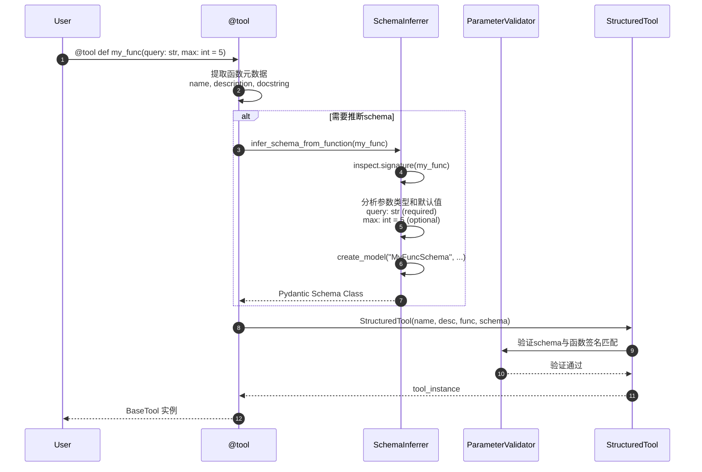

**关键步骤说明**：

1. **元数据提取**（步骤 2）：
   - 工具名称：默认使用函数名
   - 描述：优先使用 description 参数，否则使用 docstring
   - 返回直接：return_direct 参数设置

2. **Schema推断**（步骤 4-7）：
   - 使用 `inspect.signature()` 分析函数签名
   - 提取参数类型注解（Type Hints）
   - 处理默认值和可选参数
   - 生成 Pydantic 模型类

3. **工具实例化**（步骤 8-11）：
   - 创建 StructuredTool 实例
   - 验证 schema 与函数签名的一致性
   - 绑定函数到工具对象

**性能特征**：
- Schema推断：1-5ms（取决于参数复杂度）
- 工具创建：< 1ms
- 内存开销：1-2KB 每个工具

---

### 1.2 StructuredTool.from_function 创建流程

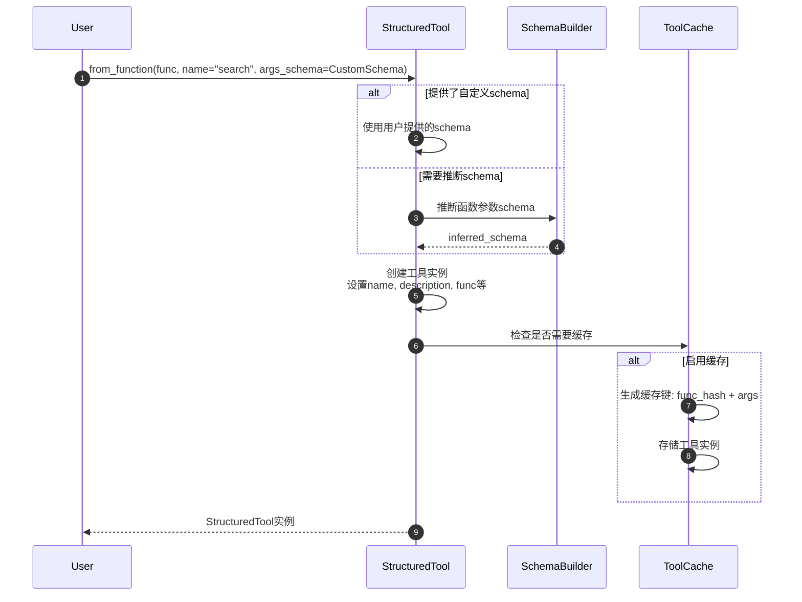

**与 @tool 装饰器的区别**：

| 特性 | @tool装饰器 | StructuredTool.from_function |
|-----|------------|---------------------------|
| 使用方式 | 装饰器语法 | 显式调用 |
| 灵活性 | 中等 | 高 |
| 配置选项 | 基础 | 完整 |
| 适用场景 | 简单工具 | 复杂工具 |

---

## 2. 工具调用场景

### 2.1 同步 invoke 调用流程

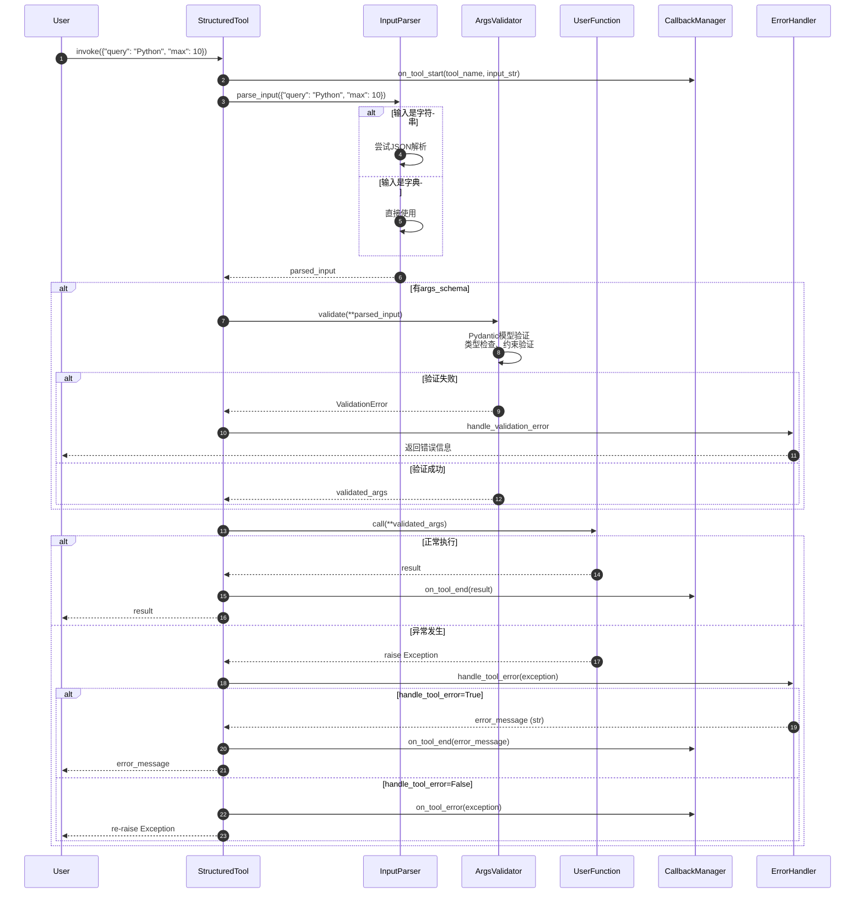

**关键执行步骤**：

1. **回调通知开始**（步骤 2）：
   - 记录工具开始执行时间
   - 输出详细信息（如果 verbose=True）
   - 触发监控和日志记录

2. **输入解析**（步骤 3-6）：
   - 字符串输入：尝试 JSON 解析
   - 字典输入：直接使用
   - 处理特殊格式和编码

3. **参数验证**（步骤 8-13）：
   - Pydantic 模型验证
   - 类型检查：确保参数类型正确
   - 约束验证：检查值范围、长度等
   - 必填字段检查

4. **函数执行**（步骤 14-25）：
   - 调用用户定义的函数
   - 捕获和处理异常
   - 应用错误处理策略

**性能数据**：
- 输入解析：< 1ms
- 参数验证：1-5ms（取决于schema复杂度）
- 函数执行：用户函数决定
- 总开销：2-10ms（不含用户函数）

---

### 2.2 异步 ainvoke 调用流程

```mermaid
sequenceDiagram
    autonumber
    participant User
    participant Tool
    participant Loop as AsyncIOLoop
    participant Executor as ThreadPoolExecutor
    participant Func as UserFunction

    User->>Tool: await ainvoke(input_data)

    Tool->>Tool: 解析和验证输入<br/>（同同步流程）

    alt 函数是异步的
        Tool->>Func: await user_async_func(**args)
        Func-->>Tool: result
    else 函数是同步的
        Tool->>Loop: 检查当前事件循环
        Tool->>Executor: run_in_executor(None, sync_func, **args)

        Note over Executor: 在线程池中执行同步函数<br/>避免阻塞事件循环

        Executor->>Func: sync_func(**args)
        Func-->>Executor: result
        Executor-->>Tool: result
    end

    Tool-->>User: result
```

**异步执行策略**：

| 情况 | 执行方式 | 性能特点 |
|-----|---------|---------|
| 用户函数是 `async def` | 直接 `await` | 最优，无额外开销 |
| 用户函数是同步函数 | 线程池执行 | 避免阻塞事件循环 |
| I/O密集型同步函数 | 线程池 | 适合文件、网络操作 |
| CPU密集型同步函数 | 进程池（可选） | 绕过GIL限制 |

**使用示例**：

```python
# 异步I/O工具
@tool
async def fetch_url(url: str) -> str:
    """异步获取URL内容。"""
    async with aiohttp.ClientSession() as session:
        async with session.get(url) as response:
            return await response.text()

# 同步工具（自动在线程池执行）
@tool
def heavy_computation(data: str) -> str:
    """CPU密集型计算。"""
    import time
    time.sleep(2)  # 模拟重计算
    return f"处理完成: {data}"

# 使用
async def main():
    # 异步工具：直接await执行
    result1 = await fetch_url.ainvoke({"url": "https://example.com"})

    # 同步工具：在线程池中执行
    result2 = await heavy_computation.ainvoke({"data": "test"})
```

---

## 3. 参数验证场景

### 3.1 Pydantic 验证流程

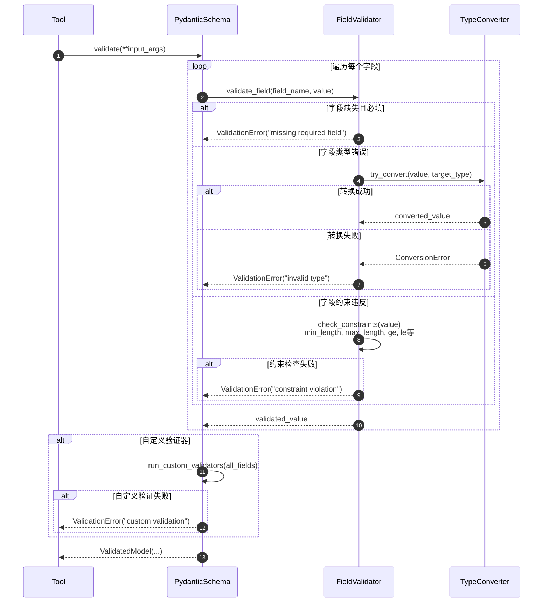

**验证示例**：

```python
from pydantic import BaseModel, Field, validator

class SearchInput(BaseModel):
    query: str = Field(..., min_length=1, max_length=200)
    max_results: int = Field(5, ge=1, le=50)
    language: str = Field("en", regex="^[a-z]{2}$")

    @validator('query')
    def validate_query(cls, v):
        # 自定义验证逻辑
        if 'spam' in v.lower():
            raise ValueError('查询包含禁用词')
        return v.strip()

    @validator('max_results')
    def validate_max_results(cls, v, values):
        # 依赖其他字段的验证
        if values.get('language') == 'zh' and v > 20:
            raise ValueError('中文搜索最多20个结果')
        return v

# 验证过程
try:
    validated = SearchInput(
        query="  python tutorial  ",  # 会被strip()
        max_results=15,
        language="zh"
    )
    print(validated.query)  # "python tutorial"
except ValidationError as e:
    print(f"验证失败: {e}")
```

---

### 3.2 错误处理验证

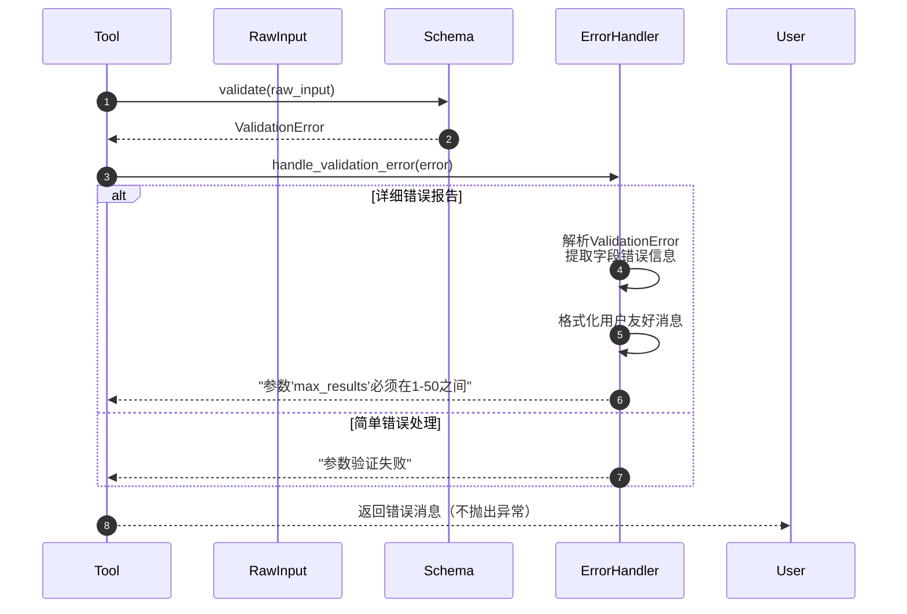

**错误消息格式化**：

```python
def format_validation_error(error: ValidationError) -> str:
    """格式化验证错误消息。"""
    messages = []

    for error_dict in error.errors():
        field = error_dict['loc'][0] if error_dict['loc'] else 'unknown'
        msg = error_dict['msg']

        if error_dict['type'] == 'missing':
            messages.append(f"缺少必填参数: {field}")
        elif error_dict['type'] == 'type_error':
            messages.append(f"参数 {field} 类型错误: {msg}")
        elif error_dict['type'] == 'value_error':
            messages.append(f"参数 {field} 值错误: {msg}")
        else:
            messages.append(f"参数 {field}: {msg}")

    return "; ".join(messages)

# 使用示例
@tool(handle_tool_error=True)
def search_tool(query: str, max_results: int = 5) -> str:
    """搜索工具。"""
    return f"搜索: {query}, 结果数: {max_results}"

# 调用时参数错误
result = search_tool.invoke({"max_results": "not_a_number"})
# 返回: "参数 max_results 类型错误: value is not a valid integer"
```

---

## 4. 错误处理场景

### 4.1 工具异常处理流程

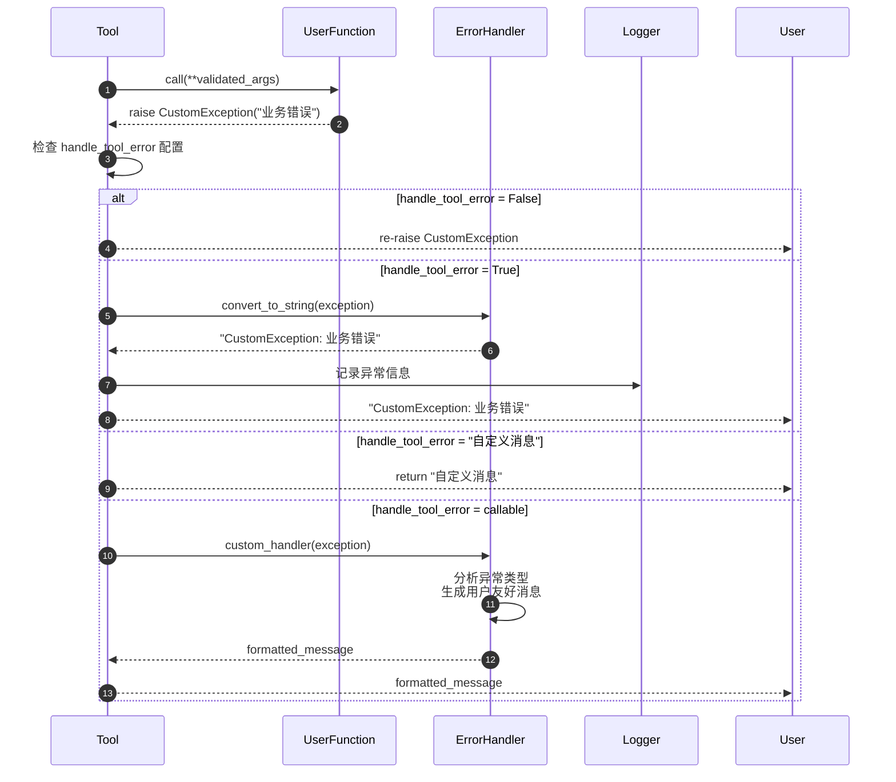

**自定义错误处理器示例**：

```python
def smart_error_handler(error: Exception) -> str:
    """智能错误处理器。"""
    if isinstance(error, requests.RequestException):
        return "网络请求失败，请检查网络连接"
    elif isinstance(error, json.JSONDecodeError):
        return "数据格式错误，无法解析JSON"
    elif isinstance(error, FileNotFoundError):
        return f"文件未找到: {error.filename}"
    elif isinstance(error, PermissionError):
        return "权限不足，无法执行操作"
    elif isinstance(error, TimeoutError):
        return "操作超时，请稍后重试"
    else:
        return f"执行失败: {type(error).__name__}: {error}"

@tool(handle_tool_error=smart_error_handler)
def risky_tool(url: str) -> str:
    """可能失败的网络工具。"""
    response = requests.get(url, timeout=5)
    return response.json()
```

---

### 4.2 ToolException 专用异常

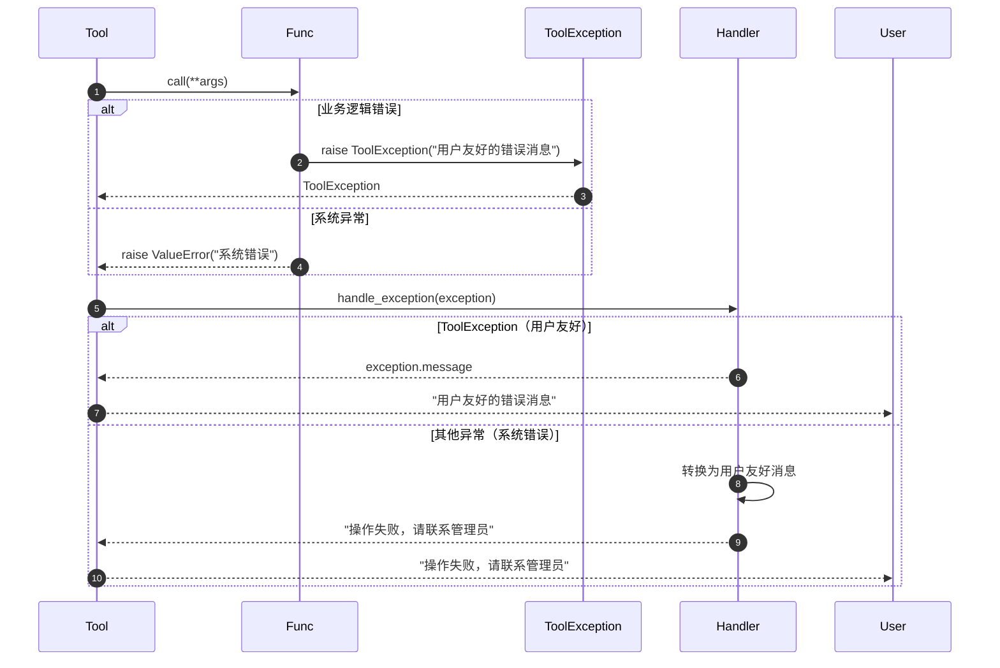

**ToolException 使用示例**：

```python
from langchain_core.tools import ToolException

@tool
def divide_numbers(a: float, b: float) -> float:
    """数字除法工具。"""
    if b == 0:
        raise ToolException("除数不能为零")

    if not isinstance(a, (int, float)) or not isinstance(b, (int, float)):
        raise ToolException("输入必须是数字")

    try:
        result = a / b
        if abs(result) > 1e10:
            raise ToolException("结果数值过大")
        return result
    except Exception as e:
        # 系统异常转换为用户友好消息
        raise ToolException(f"计算失败: {e}")

# 使用
result1 = divide_numbers.invoke({"a": 10, "b": 0})
# 返回: "除数不能为零"

result2 = divide_numbers.invoke({"a": "abc", "b": 2})
# 返回: "输入必须是数字"
```

---

## 5. 回调机制场景

### 5.1 工具回调执行流程

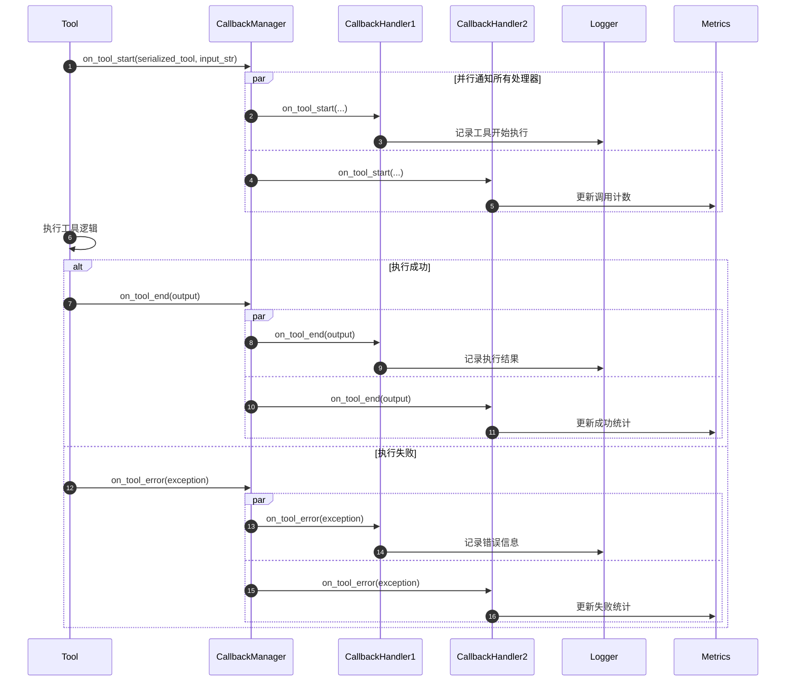

**回调处理器示例**：

```python
from langchain.callbacks import BaseCallbackHandler
import time
import json

class DetailedToolCallback(BaseCallbackHandler):
    """详细的工具执行回调。"""

    def __init__(self):
        self.tool_executions = []
        self.current_execution = None

    def on_tool_start(
        self,
        serialized: Dict[str, Any],
        input_str: str,
        **kwargs: Any,
    ) -> Any:
        """工具开始执行。"""
        self.current_execution = {
            "tool_name": serialized.get("name", "unknown"),
            "input": input_str,
            "start_time": time.time(),
            "run_id": kwargs.get("run_id"),
            "parent_run_id": kwargs.get("parent_run_id")
        }
        print(f"🔧 开始执行工具: {self.current_execution['tool_name']}")
        print(f"   输入: {input_str}")

    def on_tool_end(
        self,
        output: str,
        **kwargs: Any,
    ) -> Any:
        """工具执行完成。"""
        if self.current_execution:
            execution_time = time.time() - self.current_execution["start_time"]
            self.current_execution.update({
                "output": output,
                "end_time": time.time(),
                "execution_time": execution_time,
                "success": True
            })

            print(f"✅ 工具执行成功，耗时: {execution_time:.2f}秒")
            print(f"   输出: {output[:100]}...")

            self.tool_executions.append(self.current_execution)
            self.current_execution = None

    def on_tool_error(
        self,
        error: Exception,
        **kwargs: Any,
    ) -> Any:
        """工具执行错误。"""
        if self.current_execution:
            execution_time = time.time() - self.current_execution["start_time"]
            self.current_execution.update({
                "error": str(error),
                "end_time": time.time(),
                "execution_time": execution_time,
                "success": False
            })

            print(f"❌ 工具执行失败，耗时: {execution_time:.2f}秒")
            print(f"   错误: {error}")

            self.tool_executions.append(self.current_execution)
            self.current_execution = None

    def get_stats(self) -> Dict[str, Any]:
        """获取执行统计。"""
        if not self.tool_executions:
            return {}

        total_calls = len(self.tool_executions)
        successful_calls = sum(1 for ex in self.tool_executions if ex["success"])
        total_time = sum(ex["execution_time"] for ex in self.tool_executions)

        return {
            "total_calls": total_calls,
            "successful_calls": successful_calls,
            "failed_calls": total_calls - successful_calls,
            "success_rate": successful_calls / total_calls,
            "total_execution_time": total_time,
            "average_execution_time": total_time / total_calls
        }

# 使用回调
callback = DetailedToolCallback()
tool = StructuredTool.from_function(
    func=my_function,
    callbacks=[callback],
    verbose=True
)
```

---

### 5.2 性能监控回调

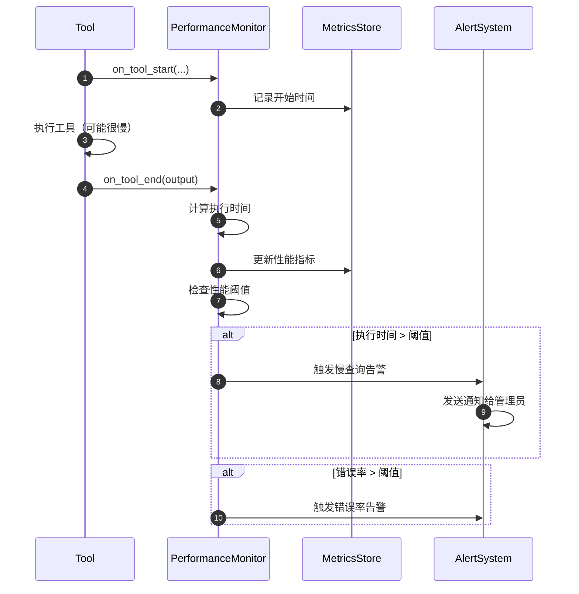

**性能监控实现**：

```python
class PerformanceMonitorCallback(BaseCallbackHandler):
    """工具性能监控回调。"""

    def __init__(self,
                 slow_threshold: float = 5.0,
                 error_rate_threshold: float = 0.1):
        self.slow_threshold = slow_threshold
        self.error_rate_threshold = error_rate_threshold
        self.metrics = defaultdict(list)
        self.start_times = {}

    def on_tool_start(self, serialized: Dict, input_str: str, **kwargs) -> None:
        tool_name = serialized.get("name", "unknown")
        run_id = kwargs.get("run_id")
        self.start_times[run_id] = time.time()

    def on_tool_end(self, output: str, **kwargs) -> None:
        run_id = kwargs.get("run_id")
        if run_id in self.start_times:
            execution_time = time.time() - self.start_times[run_id]
            tool_name = kwargs.get("name", "unknown")

            # 记录指标
            self.metrics[tool_name].append({
                "execution_time": execution_time,
                "success": True,
                "timestamp": time.time()
            })

            # 检查慢查询
            if execution_time > self.slow_threshold:
                self._alert_slow_execution(tool_name, execution_time)

            del self.start_times[run_id]

    def on_tool_error(self, error: Exception, **kwargs) -> None:
        # 类似处理，记录错误指标
        pass

    def _alert_slow_execution(self, tool_name: str, execution_time: float):
        """慢执行告警。"""
        print(f"⚠️ 慢工具告警: {tool_name} 执行时间 {execution_time:.2f}s 超过阈值 {self.slow_threshold}s")

    def get_performance_report(self) -> Dict[str, Any]:
        """生成性能报告。"""
        report = {}

        for tool_name, executions in self.metrics.items():
            execution_times = [ex["execution_time"] for ex in executions]
            successes = [ex["success"] for ex in executions]

            report[tool_name] = {
                "call_count": len(executions),
                "success_rate": sum(successes) / len(successes),
                "avg_execution_time": sum(execution_times) / len(execution_times),
                "max_execution_time": max(execution_times),
                "min_execution_time": min(execution_times),
                "slow_calls": sum(1 for t in execution_times if t > self.slow_threshold)
            }

        return report
```

---

## 6. 工具组合场景

### 6.1 工具链执行流程

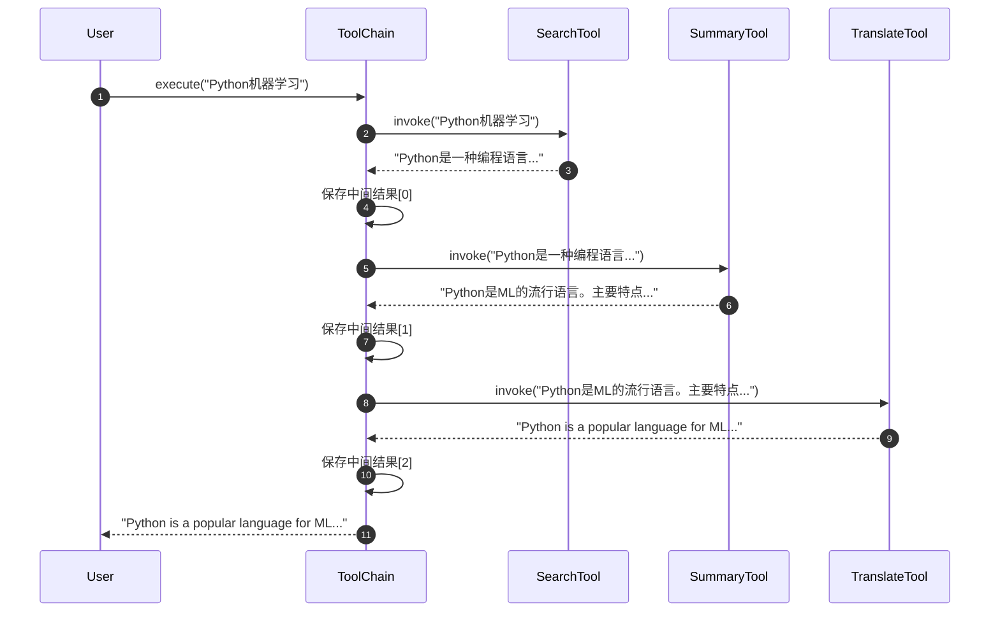

**工具链实现**：

```python
class ToolChain:
    """工具链，顺序执行多个工具。"""

    def __init__(self, tools: List[BaseTool], name: str = "tool_chain"):
        self.tools = tools
        self.name = name
        self.execution_log = []

    def execute(self, initial_input: Any) -> Any:
        """执行工具链。"""
        current_input = initial_input

        for i, tool in enumerate(self.tools):
            step_start = time.time()

            try:
                result = tool.invoke(current_input)
                execution_time = time.time() - step_start

                # 记录执行步骤
                self.execution_log.append({
                    "step": i + 1,
                    "tool_name": tool.name,
                    "input": current_input,
                    "output": result,
                    "execution_time": execution_time,
                    "success": True
                })

                # 下一步的输入是当前步的输出
                current_input = result

            except Exception as e:
                execution_time = time.time() - step_start

                self.execution_log.append({
                    "step": i + 1,
                    "tool_name": tool.name,
                    "input": current_input,
                    "error": str(e),
                    "execution_time": execution_time,
                    "success": False
                })

                raise ToolChainException(f"工具链在步骤 {i+1} 失败: {e}")

        return current_input

    def get_execution_summary(self) -> Dict[str, Any]:
        """获取执行摘要。"""
        return {
            "chain_name": self.name,
            "total_steps": len(self.execution_log),
            "successful_steps": sum(1 for log in self.execution_log if log["success"]),
            "total_execution_time": sum(log["execution_time"] for log in self.execution_log),
            "steps": self.execution_log
        }

# 使用示例
search_tool = StructuredTool.from_function(web_search, name="search")
summary_tool = StructuredTool.from_function(summarize_text, name="summarize")
translate_tool = StructuredTool.from_function(translate_text, name="translate")

chain = ToolChain([search_tool, summary_tool, translate_tool], "research_chain")
result = chain.execute("Python机器学习教程")
```

---

### 6.2 条件工具图执行

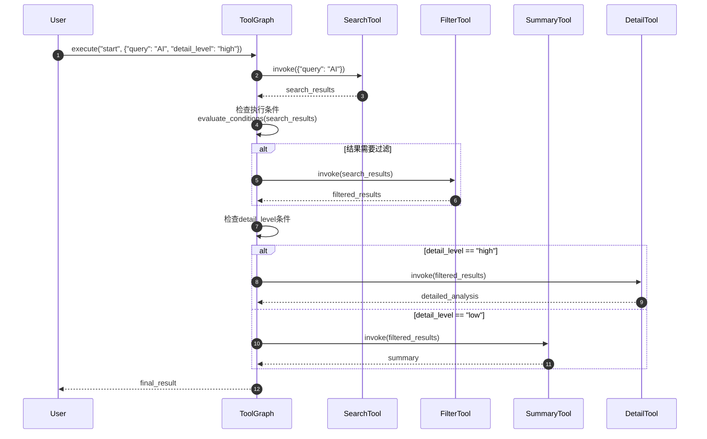

**条件工具图实现**：

```python
class ConditionalToolGraph:
    """条件工具图。"""

    def __init__(self):
        self.nodes = {}  # tool_name -> BaseTool
        self.edges = []  # (from, to, condition_func)
        self.execution_history = []

    def add_tool(self, tool: BaseTool) -> None:
        """添加工具节点。"""
        self.nodes[tool.name] = tool

    def add_conditional_edge(self,
                           from_tool: str,
                           to_tool: str,
                           condition: Callable[[Any], bool]) -> None:
        """添加条件边。"""
        self.edges.append((from_tool, to_tool, condition))

    def execute(self, start_tool: str, initial_input: Any) -> Dict[str, Any]:
        """执行工具图。"""
        results = {}
        executed_tools = set()
        current_tools = [(start_tool, initial_input)]

        while current_tools:
            next_tools = []

            for tool_name, input_data in current_tools:
                if tool_name in executed_tools:
                    continue

                # 执行工具
                tool = self.nodes[tool_name]
                result = tool.invoke(input_data)
                results[tool_name] = result
                executed_tools.add(tool_name)

                # 记录执行历史
                self.execution_history.append({
                    "tool": tool_name,
                    "input": input_data,
                    "output": result,
                    "timestamp": time.time()
                })

                # 检查下游工具
                for from_tool, to_tool, condition in self.edges:
                    if from_tool == tool_name:
                        try:
                            if condition(result):
                                # 传递当前结果和全局上下文
                                next_input = {
                                    "current_result": result,
                                    "all_results": results,
                                    "original_input": initial_input
                                }
                                next_tools.append((to_tool, next_input))
                        except Exception as e:
                            print(f"条件评估失败: {e}")

            current_tools = next_tools

        return results

# 使用示例
def needs_filtering(search_results) -> bool:
    return len(search_results) > 10

def needs_detail(context) -> bool:
    return context.get("original_input", {}).get("detail_level") == "high"

graph = ConditionalToolGraph()
graph.add_tool(search_tool)
graph.add_tool(filter_tool)
graph.add_tool(summary_tool)
graph.add_tool(detail_tool)

graph.add_conditional_edge("search", "filter", needs_filtering)
graph.add_conditional_edge("filter", "detail", needs_detail)
graph.add_conditional_edge("filter", "summary", lambda x: not needs_detail(x))

results = graph.execute("search", {"query": "AI", "detail_level": "high"})
```

---

## 7. 性能优化场景

### 7.1 工具结果缓存

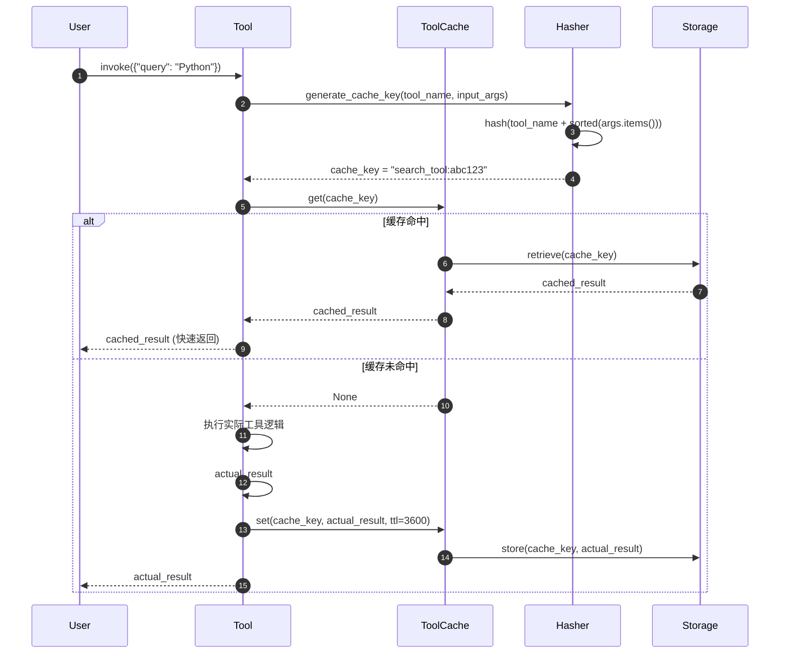

**缓存实现**：

```python
import hashlib
import json
import time
from typing import Any, Optional

class ToolCache:
    """工具结果缓存。"""

    def __init__(self, max_size: int = 1000, default_ttl: int = 3600):
        self.max_size = max_size
        self.default_ttl = default_ttl
        self._cache = {}  # key -> (value, expiry_time)
        self._access_order = []  # LRU tracking

    def _generate_key(self, tool_name: str, args: Dict[str, Any]) -> str:
        """生成缓存键。"""
        # 创建稳定的键（参数顺序无关）
        sorted_args = json.dumps(args, sort_keys=True, ensure_ascii=False)
        content = f"{tool_name}:{sorted_args}"
        return hashlib.md5(content.encode()).hexdigest()

    def get(self, tool_name: str, args: Dict[str, Any]) -> Optional[Any]:
        """获取缓存结果。"""
        key = self._generate_key(tool_name, args)

        if key in self._cache:
            value, expiry_time = self._cache[key]

            # 检查是否过期
            if time.time() < expiry_time:
                # 更新LRU顺序
                if key in self._access_order:
                    self._access_order.remove(key)
                self._access_order.append(key)
                return value
            else:
                # 已过期，删除
                del self._cache[key]
                if key in self._access_order:
                    self._access_order.remove(key)

        return None

    def set(self, tool_name: str, args: Dict[str, Any], value: Any, ttl: Optional[int] = None) -> None:
        """设置缓存。"""
        key = self._generate_key(tool_name, args)
        expiry_time = time.time() + (ttl or self.default_ttl)

        # 检查容量限制
        if len(self._cache) >= self.max_size and key not in self._cache:
            # 删除最久未使用的项
            if self._access_order:
                oldest_key = self._access_order.pop(0)
                self._cache.pop(oldest_key, None)

        self._cache[key] = (value, expiry_time)

        # 更新访问顺序
        if key in self._access_order:
            self._access_order.remove(key)
        self._access_order.append(key)

    def clear(self) -> None:
        """清空缓存。"""
        self._cache.clear()
        self._access_order.clear()

    def stats(self) -> Dict[str, Any]:
        """缓存统计。"""
        current_time = time.time()
        valid_entries = sum(1 for _, expiry in self._cache.values()
                          if current_time < expiry)

        return {
            "total_entries": len(self._cache),
            "valid_entries": valid_entries,
            "expired_entries": len(self._cache) - valid_entries,
            "max_size": self.max_size,
            "usage_ratio": len(self._cache) / self.max_size
        }

# 带缓存的工具装饰器
def cached_tool(cache: ToolCache, ttl: int = 3600):
    """缓存工具装饰器。"""
    def decorator(tool_func):
        original_func = tool_func.func if hasattr(tool_func, 'func') else tool_func

        def cached_func(**kwargs):
            # 尝试从缓存获取
            cached_result = cache.get(tool_func.name, kwargs)
            if cached_result is not None:
                return cached_result

            # 执行原函数
            result = original_func(**kwargs)

            # 缓存结果
            cache.set(tool_func.name, kwargs, result, ttl)

            return result

        # 保持工具属性
        if hasattr(tool_func, 'name'):
            cached_func.name = tool_func.name
        if hasattr(tool_func, 'description'):
            cached_func.description = tool_func.description

        return cached_func

    return decorator

# 使用示例
tool_cache = ToolCache(max_size=500, default_ttl=1800)

@tool
@cached_tool(tool_cache, ttl=3600)
def expensive_search(query: str, depth: int = 5) -> str:
    """昂贵的搜索操作。"""
    time.sleep(2)  # 模拟耗时操作
    return f"搜索'{query}'的深度{depth}结果"

# 第一次调用：慢（2秒）
result1 = expensive_search.invoke({"query": "Python", "depth": 5})

# 第二次调用：快（< 1ms，来自缓存）
result2 = expensive_search.invoke({"query": "Python", "depth": 5})
```

---

## 8. 总结

本文档详细展示了 **Tools 模块**的关键执行时序：

1. **工具创建**：@tool装饰器和StructuredTool.from_function的完整流程
2. **工具调用**：invoke/ainvoke的同步异步执行机制
3. **参数验证**：Pydantic模型验证和错误处理
4. **错误处理**：多种错误处理策略和ToolException机制
5. **回调系统**：工具执行的监控、日志和性能追踪
6. **工具组合**：工具链和条件工具图的复杂执行模式
7. **性能优化**：结果缓存和执行优化策略

每张时序图包含：
- 详细的执行步骤和参与者交互
- 条件分支和错误处理路径
- 性能关键点和优化建议
- 实际代码示例和最佳实践

这些时序图帮助开发者深入理解工具系统的内部机制，为构建高效、可靠的工具集合提供指导。工具系统是Agent智能代理的核心基础设施，正确的设计和使用对整个LLM应用的成功至关重要。
