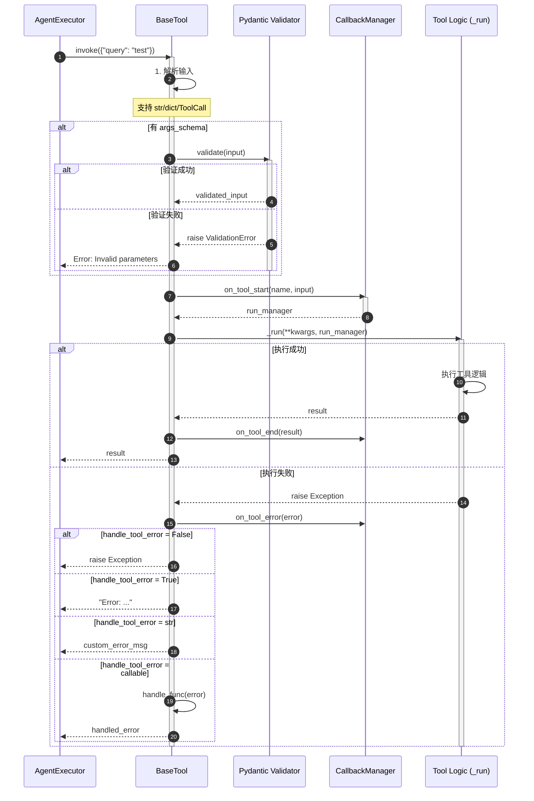
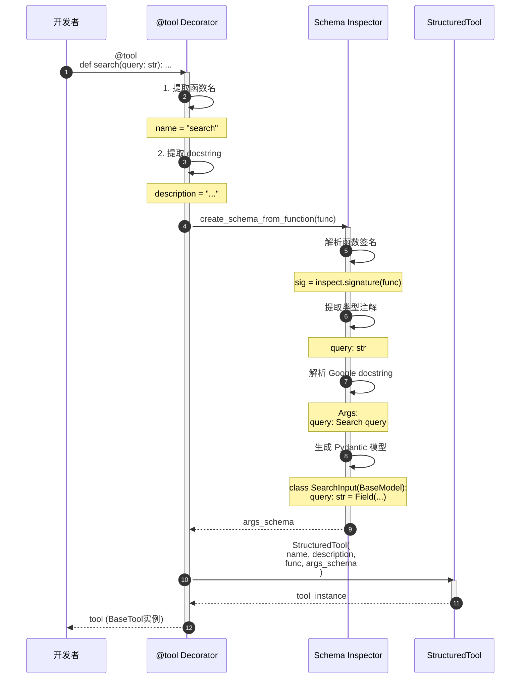
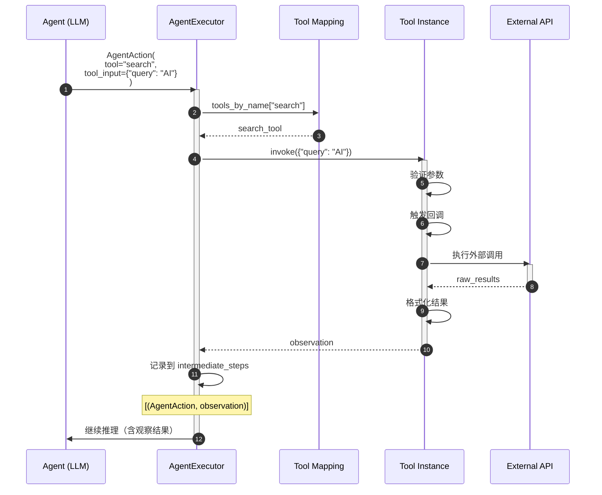

# LangChain-07-Tools-概览

## 模块基本信息

**模块名称**: langchain-core-tools
**模块路径**: `libs/core/langchain_core/tools/`
**核心职责**: 提供工具抽象，让代理能够与外部世界交互（搜索、计算、API 调用等）

## 1. 模块职责

### 1.1 核心职责

Tools 模块是代理与外部世界交互的桥梁，提供以下核心能力：

1. **工具定义**: 声明式定义工具接口（名称、描述、参数）
2. **参数验证**: 使用 Pydantic 自动验证输入参数
3. **同步/异步**: 支持同步和异步执行
4. **错误处理**: 统一的异常处理机制
5. **回调集成**: 支持工具执行的观测和日志
6. **类型安全**: 强类型参数和返回值
7. **装饰器语法**: 使用 `@tool` 快速创建工具

### 1.2 核心概念

```
工具定义（名称 + 描述 + 参数schema）
  ↓
代理选择工具
  ↓
工具执行（验证参数 → 执行逻辑 → 返回结果）
  ↓
结果返回给代理
```

**关键术语**:
- **BaseTool**: 所有工具的基类
- **StructuredTool**: 使用 Pydantic 模型定义参数的工具
- **Tool**: 简单函数包装工具
- **args_schema**: Pydantic 模型，定义工具参数
- **ToolException**: 工具执行异常

### 1.3 工具类型

| 工具类型 | 适用场景 | 参数定义方式 | 推荐度 |
|---------|---------|------------|--------|
| **@tool 装饰器** | 快速创建工具 | 函数类型注解 | ⭐⭐⭐⭐⭐ |
| **StructuredTool** | 复杂参数验证 | Pydantic 模型 | ⭐⭐⭐⭐⭐ |
| **Tool** | 简单字符串输入 | 字符串 | ⭐⭐⭐ |
| **自定义 BaseTool** | 完全自定义行为 | 继承实现 | ⭐⭐⭐⭐ |

### 1.4 输入/输出

**输入**:
- **tool_input**: `str` 或 `dict` - 工具参数
- **config**: `RunnableConfig` - 运行时配置（可选）

**输出**:
- `Any` - 工具执行结果（通常是字符串）

### 1.5 上下游依赖

**上游调用者**:
- `AgentExecutor`: 代理执行器
- 用户应用代码

**下游依赖**:
- `pydantic`: 参数验证
- `langchain_core.callbacks`: 回调系统
- `langchain_core.runnables`: Runnable 协议

## 2. 模块级架构图

```mermaid
flowchart TB
    subgraph Base["基础抽象层"]
        BT[BaseTool<br/>工具基类]
        RS[RunnableSerializable<br/>可运行+可序列化]
    end

    subgraph Implementations["工具实现"]
        TOOL[Tool<br/>简单函数工具]
        ST[StructuredTool<br/>结构化工具]
        CUSTOM[CustomTool<br/>自定义工具]
    end

    subgraph Decorators["装饰器"]
        TOOL_DEC[@tool<br/>函数装饰器]
    end

    subgraph Utilities["工具辅助"]
        CONVERT[convert_runnable_to_tool<br/>Runnable转工具]
        RETRIEVER[create_retriever_tool<br/>检索器工具]
        RENDER[render_text_description<br/>工具描述渲染]
    end

    subgraph Exception["异常处理"]
        TE[ToolException<br/>工具异常]
        HTE[handle_tool_error<br/>错误处理器]
    end

    subgraph Schema["Schema生成"]
        SCHEMA[create_schema_from_function<br/>从函数生成schema]
        ARGS[args_schema<br/>Pydantic模型]
    end

    RS --> BT
    BT --> TOOL
    BT --> ST
    BT --> CUSTOM

    TOOL_DEC --> ST
    CONVERT --> BT
    RETRIEVER --> ST

    BT --> TE
    BT --> HTE
    BT --> SCHEMA
    BT --> ARGS

    style Base fill:#e1f5ff
    style Implementations fill:#fff4e1
    style Decorators fill:#e8f5e9
    style Utilities fill:#f3e5f5
    style Exception fill:#ffebee
    style Schema fill:#fff3e0
```

### 架构图详细说明

**1. 基础抽象层**

- **BaseTool**: 所有工具的基类
  - 继承自 `RunnableSerializable`，自动支持 LCEL
  - 定义工具的核心属性：`name`、`description`、`args_schema`
  - 提供同步 `_run` 和异步 `_arun` 抽象方法
  - 实现 `invoke`、`run`、`ainvoke`、`arun` 等执行方法
  - 集成回调系统

**核心属性**:
```python
class BaseTool:
    name: str  # 工具名称（唯一标识）
    description: str  # 工具描述（LLM 选择工具的依据）
    args_schema: Optional[Type[BaseModel]] = None  # 参数 schema
    return_direct: bool = False  # 是否直接返回结果
    verbose: bool = False  # 是否打印详细日志
    callbacks: Callbacks = None  # 回调处理器
    handle_tool_error: Union[bool, str, Callable] = False  # 错误处理
```

**2. 工具实现**

- **Tool**: 简单工具实现
  - 包装单个函数或协程
  - 参数为字符串或简单字典
  - 适合简单场景

  ```python
  def search_function(query: str) -> str:
      return f"Results for {query}"

  tool = Tool(
      name="search",
      description="Search the web",
      func=search_function
  )
  ```

- **StructuredTool**: 结构化工具
  - 使用 Pydantic 模型定义参数
  - 自动参数验证
  - 支持复杂嵌套参数
  - 推荐使用方式

  ```python
  class SearchInput(BaseModel):
      query: str = Field(description="Search query")
      max_results: int = Field(default=5, description="Max results")

  tool = StructuredTool(
      name="search",
      description="Search the web",
      func=search_function,
      args_schema=SearchInput
  )
  ```

- **自定义 BaseTool**: 完全自定义
  - 继承 `BaseTool`
  - 实现 `_run` 和 `_arun` 方法
  - 适合复杂逻辑和状态管理

  ```python
  class CustomSearchTool(BaseTool):
      name: str = "search"
      description: str = "Search the web"

      def _run(self, query: str) -> str:
          # 自定义逻辑
          return results

      async def _arun(self, query: str) -> str:
          # 异步逻辑
          return results
  ```

**3. 装饰器语法**

- **@tool 装饰器**: 最推荐的创建方式
  - 自动推断参数 schema（从类型注解）
  - 自动生成描述（从 docstring）
  - 支持同步和异步函数
  - 代码简洁

  ```python
  from langchain_core.tools import tool

  @tool
  def search(query: str, max_results: int = 5) -> str:
      """Search the web for information.

      Args:
          query: The search query
          max_results: Maximum number of results
      """
      return f"Results for {query}"

  # 自动生成：
  # name = "search"
  # description = "Search the web for information..."
  # args_schema = 自动推断
  ```

**4. 工具辅助**

- **convert_runnable_to_tool**: 将任何 Runnable 转换为工具
  ```python
  chain = prompt | model | parser
  tool = convert_runnable_to_tool(
      chain,
      name="qa_chain",
      description="Answer questions"
  )
  ```

- **create_retriever_tool**: 创建检索器工具（RAG）
  ```python
  retriever_tool = create_retriever_tool(
      retriever=vectorstore.as_retriever(),
      name="knowledge_base",
      description="Search internal knowledge base"
  )
  ```

- **render_text_description**: 渲染工具列表描述
  ```python
  tools_desc = render_text_description(tools)
  # 生成：
  # search: Search the web for information
  # calculator: Perform mathematical calculations
  ```

**5. 异常处理**

- **ToolException**: 工具执行异常
  - 不会停止代理执行
  - 错误信息作为观察返回给代理
  - 代理可以根据错误调整策略

- **handle_tool_error**: 错误处理配置
  - `False`（默认）: 抛出异常
  - `True`: 返回错误信息字符串
  - `str`: 返回自定义错误消息
  - `Callable`: 调用函数处理错误

**6. Schema 生成**

- **create_schema_from_function**: 从函数生成 Pydantic schema
  - 解析函数签名
  - 提取类型注解
  - 解析 docstring（Google 风格）
  - 生成 `args_schema`

## 3. 核心 API 详解

### 3.1 @tool 装饰器 - 快速创建工具

**基本信息**:
- **装饰器**: `@tool`
- **签名**: `def tool(func: Optional[Callable] = None, *, name: Optional[str] = None, description: Optional[str] = None, return_direct: bool = False, args_schema: Optional[Type[BaseModel]] = None, infer_schema: bool = True) -> Callable`

**功能**: 将函数转换为 LangChain 工具。

**参数**:

| 参数名 | 类型 | 默认值 | 说明 |
|--------|------|--------|------|
| `func` | `Callable` | 必填 | 要包装的函数 |
| `name` | `Optional[str]` | 函数名 | 工具名称 |
| `description` | `Optional[str]` | docstring | 工具描述 |
| `return_direct` | `bool` | `False` | 是否直接返回结果 |
| `args_schema` | `Optional[Type[BaseModel]]` | 自动推断 | 参数 schema |
| `infer_schema` | `bool` | `True` | 是否自动推断 schema |

**核心代码**:

```python
def tool(
    func: Optional[Callable] = None,
    *,
    name: Optional[str] = None,
    description: Optional[str] = None,
    return_direct: bool = False,
    args_schema: Optional[Type[BaseModel]] = None,
    infer_schema: bool = True
) -> Callable:
    """
    将函数转换为工具

    自动处理:
    1. 从函数名推断工具名称
    2. 从 docstring 提取描述
    3. 从类型注解生成 args_schema
    4. 同时支持同步和异步函数
    """
    def decorator(func: Callable) -> BaseTool:
        # 1. 确定工具名称
        tool_name = name or func.__name__

        # 2. 提取描述
        tool_description = description or func.__doc__ or ""

        # 3. 生成 args_schema
        if args_schema is None and infer_schema:
            # 从函数签名和 docstring 自动生成
            schema = create_schema_from_function(
                func.__name__,
                func,
                filter_args=FILTERED_ARGS
            )
        else:
            schema = args_schema

        # 4. 创建 StructuredTool
        if asyncio.iscoroutinefunction(func):
            # 异步函数
            return StructuredTool(
                name=tool_name,
                description=tool_description,
                coroutine=func,
                args_schema=schema,
                return_direct=return_direct
            )
        else:
            # 同步函数
            return StructuredTool(
                name=tool_name,
                description=tool_description,
                func=func,
                args_schema=schema,
                return_direct=return_direct
            )

    if func is None:
        # @tool(...) 带参数调用
        return decorator
    else:
        # @tool 无参数调用
        return decorator(func)
```

**使用示例**:

```python
from langchain_core.tools import tool

# 1. 基础用法
@tool
def search(query: str) -> str:
    """Search the web for information."""
    return f"Results for: {query}"

# 2. 多参数
@tool
def calculator(expression: str, precision: int = 2) -> str:
    """
    Calculate a mathematical expression.

    Args:
        expression: Math expression to evaluate
        precision: Decimal places for result
    """
    result = eval(expression)
    return f"{result:.{precision}f}"

# 3. 复杂类型
from typing import List
from pydantic import Field

@tool
def batch_search(queries: List[str], max_per_query: int = 5) -> str:
    """
    Search multiple queries.

    Args:
        queries: List of search queries
        max_per_query: Max results per query
    """
    results = []
    for q in queries:
        results.append(f"Results for {q}")
    return "\n".join(results)

# 4. 异步工具
@tool
async def async_api_call(endpoint: str) -> str:
    """Call an external API asynchronously."""
    async with httpx.AsyncClient() as client:
        response = await client.get(endpoint)
        return response.text

# 5. 自定义配置
@tool(
    name="web_search",
    description="Search the internet",
    return_direct=True  # 直接返回结果，不继续推理
)
def search_custom(query: str) -> str:
    return f"Results: {query}"

# 在代理中使用
tools = [search, calculator, batch_search]
agent = create_openai_functions_agent(llm, tools, prompt)
```

### 3.2 BaseTool.invoke - 执行工具

**基本信息**:
- **方法**: `invoke`
- **签名**: `def invoke(self, input: Union[str, dict, ToolCall], config: Optional[RunnableConfig] = None) -> Any`

**功能**: 执行工具，包含参数验证、回调、错误处理。

**参数**:

| 参数名 | 类型 | 说明 |
|--------|------|------|
| `input` | `Union[str, dict, ToolCall]` | 工具输入（字符串或字典） |
| `config` | `Optional[RunnableConfig]` | 运行时配置 |

**返回值**: 工具执行结果（通常是字符串）

**核心代码**:

```python
class BaseTool(RunnableSerializable):
    def invoke(
        self,
        input: Union[str, dict, ToolCall],
        config: Optional[RunnableConfig] = None,
        **kwargs: Any
    ) -> Any:
        """
        执行工具

        流程:
        1. 解析输入
        2. 验证参数（如果有 args_schema）
        3. 触发回调（on_tool_start）
        4. 执行 _run 方法
        5. 处理异常
        6. 触发回调（on_tool_end/on_tool_error）
        7. 返回结果
        """
        config = ensure_config(config)
        callback_manager = get_callback_manager_for_config(config)

        # 1. 解析输入
        tool_input = self._parse_input(input)

        # 2. 验证参数
        if self.args_schema is not None:
            validated_input = self.args_schema.parse_obj(tool_input)
            tool_input = validated_input.dict()

        # 3. 触发开始回调
        run_manager = callback_manager.on_tool_start(
            {"name": self.name, "description": self.description},
            tool_input if isinstance(tool_input, str) else str(tool_input)
        )

        try:
            # 4. 执行工具
            observation = self._run(
                **tool_input,
                run_manager=run_manager
            )

            # 5. 触发结束回调
            run_manager.on_tool_end(observation)

            return observation

        except Exception as e:
            # 6. 错误处理
            run_manager.on_tool_error(e)

            if self.handle_tool_error is False:
                raise
            elif self.handle_tool_error is True:
                return f"Error: {str(e)}"
            elif isinstance(self.handle_tool_error, str):
                return self.handle_tool_error
            elif callable(self.handle_tool_error):
                return self.handle_tool_error(e)

    @abstractmethod
    def _run(
        self,
        *args: Any,
        run_manager: Optional[CallbackManagerForToolRun] = None,
        **kwargs: Any
    ) -> Any:
        """
        子类必须实现的执行逻辑
        """
```

**使用示例**:

```python
# 1. 直接调用
result = search.invoke("LangChain")
print(result)  # "Results for: LangChain"

# 2. 字典输入
result = calculator.invoke({
    "expression": "2 + 2",
    "precision": 3
})
print(result)  # "4.000"

# 3. 在 LCEL 链中
chain = RunnableLambda(lambda x: x["query"]) | search
result = chain.invoke({"query": "AI"})

# 4. 异步调用
result = await async_api_call.ainvoke("https://api.example.com/data")

# 5. 带配置
result = search.invoke(
    "query",
    config={
        "callbacks": [MyCallback()],
        "tags": ["production"],
        "metadata": {"user_id": "123"}
    }
)
```

### 3.3 创建自定义工具（继承 BaseTool）

**使用场景**: 需要状态管理、复杂初始化、资源管理的工具。

**核心代码**:

```python
from langchain_core.tools import BaseTool
from langchain_core.callbacks import CallbackManagerForToolRun
from typing import Optional, Type
from pydantic import BaseModel, Field

class SearchInput(BaseModel):
    """搜索工具的输入参数"""
    query: str = Field(description="搜索查询")
    max_results: int = Field(default=5, description="最大结果数")

class CustomSearchTool(BaseTool):
    """自定义搜索工具"""

    name: str = "custom_search"
    description: str = "Search the web with custom settings"
    args_schema: Type[BaseModel] = SearchInput

    # 自定义属性（状态）
    api_key: str = Field(description="API key for search service")
    rate_limit: int = Field(default=10, description="Max requests per minute")

    def __init__(self, api_key: str, **kwargs):
        """初始化工具"""
        super().__init__(api_key=api_key, **kwargs)
        self._request_count = 0

    def _run(
        self,
        query: str,
        max_results: int = 5,
        run_manager: Optional[CallbackManagerForToolRun] = None
    ) -> str:
        """
        同步执行逻辑

        Args:
            query: 搜索查询
            max_results: 最大结果数
            run_manager: 回调管理器

        Returns:
            搜索结果字符串
        """
        # 速率限制检查
        if self._request_count >= self.rate_limit:
            raise ToolException("Rate limit exceeded")

        self._request_count += 1

        # 执行搜索
        results = self._perform_search(query, max_results)

        # 使用回调管理器记录日志
        if run_manager:
            run_manager.on_text(f"Found {len(results)} results\n")

        return "\n".join(results)

    async def _arun(
        self,
        query: str,
        max_results: int = 5,
        run_manager: Optional[AsyncCallbackManagerForToolRun] = None
    ) -> str:
        """
        异步执行逻辑
        """
        if self._request_count >= self.rate_limit:
            raise ToolException("Rate limit exceeded")

        self._request_count += 1

        results = await self._perform_search_async(query, max_results)

        if run_manager:
            await run_manager.on_text(f"Found {len(results)} results\n")

        return "\n".join(results)

    def _perform_search(self, query: str, max_results: int) -> list[str]:
        """实际搜索逻辑"""
        # 调用搜索 API
        return [f"Result {i}: {query}" for i in range(max_results)]

    async def _perform_search_async(self, query: str, max_results: int) -> list[str]:
        """异步搜索逻辑"""
        # 异步调用搜索 API
        return [f"Result {i}: {query}" for i in range(max_results)]

# 使用
tool = CustomSearchTool(api_key="sk-...")
result = tool.invoke({"query": "LangChain", "max_results": 3})
```

### 3.4 错误处理配置

**功能**: 配置工具错误的处理方式。

**使用示例**:

```python
# 1. 默认行为：抛出异常
@tool
def risky_tool(input: str) -> str:
    """A tool that might fail."""
    if input == "fail":
        raise ValueError("Tool failed!")
    return f"Success: {input}"

# 2. 返回错误信息
@tool(handle_tool_error=True)
def safe_tool_1(input: str) -> str:
    """Errors returned as string."""
    if input == "fail":
        raise ValueError("Tool failed!")
    return f"Success: {input}"

result = safe_tool_1.invoke("fail")
# "Error: Tool failed!"

# 3. 自定义错误消息
@tool(handle_tool_error="An error occurred. Please try again.")
def safe_tool_2(input: str) -> str:
    """Custom error message."""
    if input == "fail":
        raise ValueError("Tool failed!")
    return f"Success: {input}"

# 4. 错误处理函数
def handle_error(error: Exception) -> str:
    # 记录日志、发送告警等
    logger.error(f"Tool error: {error}")
    return f"Tool encountered an error: {type(error).__name__}"

@tool(handle_tool_error=handle_error)
def safe_tool_3(input: str) -> str:
    """Custom error handler."""
    if input == "fail":
        raise ValueError("Tool failed!")
    return f"Success: {input}"

# 5. 在工具类中配置
class SafeTool(BaseTool):
    name = "safe"
    description = "A safe tool"
    handle_tool_error = True

    def _run(self, input: str) -> str:
        if input == "fail":
            raise ValueError("Failed!")
        return "Success"
```

## 4. 核心流程时序图

### 4.1 工具执行完整流程



### 4.2 @tool 装饰器工作流程



### 4.3 代理调用工具流程



## 5. 最佳实践

### 5.1 工具设计原则

**1. 单一职责**:
```python
# ❌ 不推荐：工具功能过多
@tool
def do_everything(action: str, data: str) -> str:
    """Do multiple things."""
    if action == "search": ...
    elif action == "calculate": ...
    elif action == "translate": ...

# ✅ 推荐：每个工具专注一件事
@tool
def search(query: str) -> str:
    """Search the web."""
    ...

@tool
def calculate(expression: str) -> str:
    """Calculate math expression."""
    ...
```

**2. 清晰的描述**:
```python
@tool
def search(query: str) -> str:
    """
    Search the web for current information.

    Use this tool when you need:
    - Up-to-date facts about recent events
    - Real-time data like weather or stock prices
    - Information not in your training data

    Args:
        query: Specific search query. Be precise and include key terms.
               Example: "LangChain latest features 2024"

    Returns:
        Search results as formatted text with sources
    """
    ...
```

**3. 合理的返回值**:
```python
# ✅ 返回简洁但信息完整的结果
@tool
def search(query: str) -> str:
    """Search tool."""
    results = api_search(query)

    # 格式化为易于LLM理解的文本
    formatted = []
    for i, result in enumerate(results[:5], 1):
        formatted.append(f"{i}. {result['title']}\n   {result['snippet']}\n   URL: {result['url']}")

    return "\n\n".join(formatted)

# ❌ 避免返回过长或过短的结果
# 过长：整个网页HTML
# 过短："success" 没有实际信息
```

### 5.2 参数验证

**使用 Pydantic 验证**:
```python
from pydantic import BaseModel, Field, validator
from typing import Literal

class EmailInput(BaseModel):
    to: str = Field(description="Recipient email")
    subject: str = Field(description="Email subject")
    body: str = Field(description="Email body")
    priority: Literal["low", "normal", "high"] = Field(default="normal")

    @validator("to")
    def validate_email(cls, v):
        if "@" not in v:
            raise ValueError("Invalid email address")
        return v

    @validator("subject")
    def validate_subject(cls, v):
        if len(v) > 100:
            raise ValueError("Subject too long (max 100 chars)")
        return v

@tool(args_schema=EmailInput)
def send_email(to: str, subject: str, body: str, priority: str = "normal") -> str:
    """Send an email."""
    # 参数已自动验证
    ...
```

### 5.3 异步工具

**适用场景**: I/O 密集型操作（API 调用、数据库查询、文件操作）

```python
import httpx
import asyncio

@tool
async def fetch_url(url: str) -> str:
    """Fetch content from a URL asynchronously."""
    async with httpx.AsyncClient() as client:
        try:
            response = await client.get(url, timeout=10.0)
            response.raise_for_status()
            return response.text[:1000]  # 截取前1000字符
        except httpx.HTTPError as e:
            return f"Error fetching {url}: {str(e)}"

@tool
async def batch_api_calls(endpoints: list[str]) -> str:
    """Call multiple APIs concurrently."""
    async def fetch_one(url: str) -> str:
        async with httpx.AsyncClient() as client:
            response = await client.get(url)
            return response.json()

    results = await asyncio.gather(*[fetch_one(ep) for ep in endpoints])
    return str(results)
```

### 5.4 错误处理策略

```python
from langchain_core.tools import ToolException

@tool
def database_query(query: str) -> str:
    """Query the database."""
    try:
        # 验证查询安全性
        if any(keyword in query.upper() for keyword in ["DROP", "DELETE", "UPDATE"]):
            raise ToolException("Dangerous query detected")

        # 执行查询
        results = db.execute(query)
        return format_results(results)

    except DatabaseError as e:
        # 数据库错误转换为友好消息
        raise ToolException(f"Database error: {str(e)}")

    except Exception as e:
        # 未预期的错误
        logger.error(f"Unexpected error in database_query: {e}")
        raise ToolException("An unexpected error occurred")

# 配置全局错误处理
tool_with_handler = database_query.copy(
    handle_tool_error=lambda e: f"Query failed: {str(e)}"
)
```

### 5.5 工具组合与复用

```python
# 1. 基础工具
@tool
def http_get(url: str) -> str:
    """Make HTTP GET request."""
    response = requests.get(url)
    return response.text

# 2. 组合工具
@tool
def search_and_fetch(query: str) -> str:
    """Search and fetch full content."""
    # 使用其他工具
    search_results = search.invoke(query)
    urls = extract_urls(search_results)

    contents = []
    for url in urls[:3]:  # 只获取前3个
        content = http_get.invoke(url)
        contents.append(content[:500])

    return "\n\n---\n\n".join(contents)

# 3. 将 Runnable 转换为工具
retrieval_chain = retriever | format_docs
retrieval_tool = convert_runnable_to_tool(
    retrieval_chain,
    name="knowledge_base",
    description="Search internal documentation"
)
```

### 5.6 工具测试

```python
import pytest

def test_search_tool():
    """测试搜索工具"""
    # 基础测试
    result = search.invoke("test query")
    assert isinstance(result, str)
    assert len(result) > 0

    # 参数验证测试
    with pytest.raises(ValidationError):
        search.invoke({"invalid_param": "value"})

    # 错误处理测试
    result = search.invoke("trigger_error")
    assert "Error" in result

@pytest.mark.asyncio
async def test_async_tool():
    """测试异步工具"""
    result = await async_api_call.ainvoke("https://example.com")
    assert isinstance(result, str)

def test_tool_with_mock():
    """使用 Mock 测试工具"""
    from unittest.mock import patch

    with patch('requests.get') as mock_get:
        mock_get.return_value.text = "mocked response"

        result = http_get.invoke("https://example.com")
        assert result == "mocked response"
        mock_get.assert_called_once()
```

## 6. 常用工具示例

### 6.1 搜索工具

```python
from langchain_community.tools import DuckDuckGoSearchRun

# 内置搜索工具
search = DuckDuckGoSearchRun()

# 自定义搜索工具
@tool
def web_search(query: str, num_results: int = 5) -> str:
    """
    Search the web using Google Custom Search API.

    Args:
        query: Search query
        num_results: Number of results (1-10)
    """
    results = google_search_api(query, num=num_results)
    return format_search_results(results)
```

### 6.2 计算工具

```python
from langchain.tools import PythonREPLTool

# Python REPL
python_repl = PythonREPLTool()

# 简单计算器
@tool
def calculator(expression: str) -> str:
    """
    Calculate a mathematical expression.

    Args:
        expression: Math expression (e.g., "2 + 2", "sqrt(16)")
    """
    try:
        # 安全的数学计算
        result = sympyevaluate(expression)
        return str(result)
    except Exception as e:
        return f"Calculation error: {str(e)}"
```

### 6.3 文件操作工具

```python
@tool
def read_file(filepath: str) -> str:
    """
    Read content from a file.

    Args:
        filepath: Path to file
    """
    try:
        with open(filepath, 'r', encoding='utf-8') as f:
            content = f.read()
        return content[:5000]  # 限制长度
    except FileNotFoundError:
        return f"File not found: {filepath}"
    except Exception as e:
        return f"Error reading file: {str(e)}"

@tool
def write_file(filepath: str, content: str) -> str:
    """
    Write content to a file.

    Args:
        filepath: Path to file
        content: Content to write
    """
    try:
        with open(filepath, 'w', encoding='utf-8') as f:
            f.write(content)
        return f"Successfully wrote to {filepath}"
    except Exception as e:
        return f"Error writing file: {str(e)}"
```

### 6.4 RAG 检索工具

```python
from langchain.tools import create_retriever_tool

# 创建检索器工具
retriever_tool = create_retriever_tool(
    retriever=vectorstore.as_retriever(search_kwargs={"k": 3}),
    name="knowledge_base_search",
    description="""
    Search the internal knowledge base for information.
    Use this when you need to find:
    - Company policies
    - Product documentation
    - Technical specifications
    Query should be specific and focused.
    """
)
```

## 7. 与其他模块的协作

- **Agents**: 工具是代理的"手和脚"
- **Language Models**: 通过函数调用规范调用工具
- **Callbacks**: 工具执行的可观测性
- **Runnables**: 工具作为 Runnable 可组合

## 8. 总结

Tools 模块是 LangChain 代理系统的核心，实现了 LLM 与外部世界的交互。关键特性：

1. **多种创建方式**: `@tool`、`StructuredTool`、继承 `BaseTool`
2. **自动参数验证**: 使用 Pydantic
3. **同步/异步支持**: 灵活的执行模式
4. **错误处理**: 统一的异常机制
5. **回调集成**: 完整的可观测性

**关键原则**:
- 优先使用 `@tool` 装饰器
- 保持工具单一职责
- 提供清晰的描述和示例
- 返回简洁但完整的结果
- 合理处理错误
- 充分测试工具逻辑

---

**文档版本**: v1.0
**最后更新**: 2025-10-03
**相关文档**:
- LangChain-00-总览.md
- LangChain-05-Agents-概览.md
- LangChain-08-VectorStores-概览.md（待生成）

