# LangChain-08-VectorStores-Retrievers-数据结构

## 文档说明

本文档详细描述 **VectorStores 和 Retrievers 模块**的核心数据结构，包括向量存储架构、检索器层次、文档表示、索引管理、搜索算法等。所有结构均配备 UML 类图和详细的字段说明。

---

## 1. VectorStore 类层次结构

### 1.1 核心向量存储继承体系

```mermaid
classDiagram
    class VectorStore {
        <<abstract>>
        +embedding_function: Embeddings
        +add_texts(texts: List[str], metadatas: List[dict]) List[str]
        +similarity_search(query: str, k: int) List[Document]
        +similarity_search_with_score(query: str, k: int) List[Tuple[Document, float]]
        +max_marginal_relevance_search(query: str, k: int, fetch_k: int, lambda_mult: float) List[Document]
        +delete(ids: List[str]) bool
        +from_texts(texts: List[str], embedding: Embeddings) VectorStore
        +as_retriever(**kwargs) VectorStoreRetriever
    }

    class Chroma {
        +_client: chromadb.Client
        +_collection: chromadb.Collection
        +collection_name: str
        +persist_directory: Optional[str]
        +client_settings: dict
        +collection_metadata: Optional[dict]
        +_embedding_function: Embeddings
        +persist() None
        +get() dict
        +update_document(document_id: str, document: Document) None
        +_collection_count() int
    }

    class FAISS {
        +index: faiss.Index
        +docstore: Docstore
        +index_to_docstore_id: Dict[int, str]
        +_normalize_L2: bool
        +distance_strategy: DistanceStrategy
        +save_local(folder_path: str) None
        +load_local(folder_path: str, embeddings: Embeddings) FAISS
        +merge_from(other: FAISS) None
        +add_texts_with_embeddings(texts: List[str], embeddings: List[List[float]]) List[str]
    }

    class Pinecone {
        +_index: pinecone.Index
        +_embedding_dimension: int
        +_text_key: str
        +_namespace: Optional[str]
        +index_name: str
        +environment: str
        +upsert(vectors: List[dict]) dict
        +query(vector: List[float], top_k: int, namespace: str) dict
        +describe_index_stats() dict
    }

    class Qdrant {
        +client: qdrant_client.QdrantClient
        +collection_name: str
        +content_payload_key: str
        +metadata_payload_key: str
        +vector_name: Optional[str]
        +distance_func: str
        +_create_collection(vectors_config: dict) None
        +_build_condition(filter: dict) models.Filter
    }

    class InMemoryVectorStore {
        +store: Dict[str, Any]
        +_vectors: List[List[float]]
        +_documents: Dict[str, Document]
        +_compute_similarity(query_vector: List[float], doc_vector: List[float]) float
    }

    VectorStore <|-- Chroma
    VectorStore <|-- FAISS
    VectorStore <|-- Pinecone
    VectorStore <|-- Qdrant
    VectorStore <|-- InMemoryVectorStore
```



**图解说明**：

1. **抽象基类**：
   - `VectorStore`：定义所有向量存储的统一接口
   - 包含文档添加、相似性搜索、MMR搜索等核心功能

2. **本地实现**：
   - `Chroma`：基于ChromaDB的本地向量存储
   - `FAISS`：Facebook AI的高性能向量索引
   - `InMemoryVectorStore`：内存中的简单实现

3. **云端实现**：
   - `Pinecone`：托管向量数据库服务
   - `Qdrant`：开源向量搜索引擎

4. **核心能力**：
   - 向量化存储和索引
   - 多种相似度计算方法
   - 元数据过滤和搜索
   - 持久化和分布式支持

---

## 2. 文档和向量表示

### 2.1 Document 数据结构

```python
class Document:
    """文档数据结构。"""

    def __init__(
        self,
        page_content: str,
        metadata: Optional[Dict[str, Any]] = None
    ):
        self.page_content = page_content      # 文档内容
        self.metadata = metadata or {}        # 元数据

    # 核心字段
    page_content: str                         # 文档文本内容
    metadata: Dict[str, Any]                  # 文档元数据

    # 可选扩展字段
    id: Optional[str] = None                  # 文档唯一标识
    embedding: Optional[List[float]] = None   # 文档向量（缓存）
    score: Optional[float] = None             # 搜索相关性分数
```

**字段详解**：

| 字段 | 类型 | 必填 | 说明 |
|-----|------|-----|------|
| page_content | `str` | 是 | 文档的主要文本内容 |
| metadata | `Dict[str, Any]` | 否 | 文档元数据，如来源、作者、时间等 |
| id | `str` | 否 | 文档唯一标识符 |
| embedding | `List[float]` | 否 | 文档的向量表示（通常由系统计算） |
| score | `float` | 否 | 搜索时的相关性分数 |

**使用示例**：

```python
# 创建文档
doc = Document(
    page_content="LangChain是一个用于构建LLM应用的框架",
    metadata={
        "source": "langchain_docs.md",
        "section": "introduction",
        "author": "LangChain Team",
        "created_at": "2024-01-01",
        "tags": ["framework", "llm", "ai"],
        "language": "zh",
        "length": 25
    }
)

# 访问字段
print(f"内容: {doc.page_content}")
print(f"来源: {doc.metadata.get('source')}")
print(f"标签: {doc.metadata.get('tags', [])}")
```

---

### 2.2 向量表示结构

```python
class VectorData:
    """向量数据结构。"""

    def __init__(
        self,
        vector: List[float],
        document_id: str,
        metadata: Optional[Dict[str, Any]] = None
    ):
        self.vector = vector                  # 向量值
        self.document_id = document_id        # 关联文档ID
        self.metadata = metadata or {}        # 向量元数据
        self.dimension = len(vector)          # 向量维度
        self.norm = self._compute_norm()      # 向量范数

    def _compute_norm(self) -> float:
        """计算向量L2范数。"""
        return sum(x * x for x in self.vector) ** 0.5

    def normalize(self) -> 'VectorData':
        """归一化向量。"""
        if self.norm == 0:
            return self

        normalized_vector = [x / self.norm for x in self.vector]
        return VectorData(
            vector=normalized_vector,
            document_id=self.document_id,
            metadata=self.metadata
        )

    def cosine_similarity(self, other: 'VectorData') -> float:
        """计算余弦相似度。"""
        if self.dimension != other.dimension:
            raise ValueError("向量维度不匹配")

        dot_product = sum(a * b for a, b in zip(self.vector, other.vector))
        return dot_product / (self.norm * other.norm)
```

---

## 3. Retriever 类层次结构

### 3.1 检索器继承体系

```mermaid
classDiagram
    class BaseRetriever {
        <<abstract>>
        +tags: Optional[List[str]]
        +metadata: Optional[Dict[str, Any]]
        +get_relevant_documents(query: str) List[Document]
        +aget_relevant_documents(query: str) List[Document]
        +_get_relevant_documents(query: str, run_manager: CallbackManagerForRetrieverRun) List[Document]
        +invoke(input: RetrieverInput) RetrieverOutput
        +ainvoke(input: RetrieverInput) RetrieverOutput
    }

    class VectorStoreRetriever {
        +vectorstore: VectorStore
        +search_type: str
        +search_kwargs: Dict[str, Any]
        +allowed_search_types: List[str]
        +_get_relevant_documents(query: str, run_manager: CallbackManagerForRetrieverRun) List[Document]
        +add_documents(documents: List[Document]) List[str]
    }

    class MultiVectorRetriever {
        +vectorstore: VectorStore
        +docstore: BaseStore
        +id_key: str
        +search_kwargs: Dict[str, Any]
        +_get_relevant_documents(query: str, run_manager: CallbackManagerForRetrieverRun) List[Document]
    }

    class ParentDocumentRetriever {
        +vectorstore: VectorStore
        +docstore: BaseStore
        +child_splitter: TextSplitter
        +parent_splitter: Optional[TextSplitter]
        +id_key: str
        +search_kwargs: Dict[str, Any]
        +add_documents(documents: List[Document], ids: Optional[List[str]]) None
    }

    class EnsembleRetriever {
        +retrievers: List[BaseRetriever]
        +weights: List[float]
        +c: int
        +_get_relevant_documents(query: str, run_manager: CallbackManagerForRetrieverRun) List[Document]
        +rank_fusion(doc_lists: List[List[Document]]) List[Document]
    }

    class ContextualCompressionRetriever {
        +base_compressor: BaseDocumentCompressor
        +base_retriever: BaseRetriever
        +_get_relevant_documents(query: str, run_manager: CallbackManagerForRetrieverRun) List[Document]
        +compress_documents(documents: List[Document], query: str) List[Document]
    }

    BaseRetriever <|-- VectorStoreRetriever
    BaseRetriever <|-- MultiVectorRetriever
    BaseRetriever <|-- ParentDocumentRetriever
    BaseRetriever <|-- EnsembleRetriever
    BaseRetriever <|-- ContextualCompressionRetriever
```



**检索器类型说明**：

1. **VectorStoreRetriever**：基于向量存储的标准检索器
2. **MultiVectorRetriever**：支持多向量表示的检索器
3. **ParentDocumentRetriever**：父子文档检索器
4. **EnsembleRetriever**：集成多个检索器
5. **ContextualCompressionRetriever**：上下文压缩检索器

---

### 3.2 VectorStoreRetriever 详细结构

```python
class VectorStoreRetriever(BaseRetriever):
    """向量存储检索器。"""

    def __init__(
        self,
        vectorstore: VectorStore,
        search_type: str = "similarity",
        search_kwargs: Optional[Dict[str, Any]] = None,
        **kwargs: Any
    ):
        super().__init__(**kwargs)
        self.vectorstore = vectorstore
        self.search_type = search_type
        self.search_kwargs = search_kwargs or {}

        # 验证搜索类型
        if search_type not in self.allowed_search_types:
            raise ValueError(f"不支持的搜索类型: {search_type}")

    # 核心字段
    vectorstore: VectorStore                  # 底层向量存储
    search_type: str                         # 搜索类型
    search_kwargs: Dict[str, Any]            # 搜索参数

    # 支持的搜索类型
    allowed_search_types: List[str] = [
        "similarity",                        # 相似性搜索
        "similarity_score_threshold",        # 带分数阈值的搜索
        "mmr"                               # 最大边际相关性搜索
    ]
```

**搜索类型配置**：

| 搜索类型 | 主要参数 | 说明 |
|---------|---------|------|
| `similarity` | `k`: 返回文档数 | 标准余弦相似度搜索 |
| `similarity_score_threshold` | `k`, `score_threshold` | 只返回分数高于阈值的文档 |
| `mmr` | `k`, `fetch_k`, `lambda_mult` | 平衡相关性和多样性 |

---

## 4. 索引和存储结构

### 4.1 FAISS 索引结构

```python
class FAISSIndex:
    """FAISS索引数据结构。"""

    def __init__(
        self,
        embedding_dimension: int,
        index_type: str = "IndexFlatL2"
    ):
        self.embedding_dimension = embedding_dimension
        self.index_type = index_type
        self.index = self._create_index()
        self.docstore = InMemoryDocstore({})
        self.index_to_docstore_id: Dict[int, str] = {}

        # 统计信息
        self._total_vectors = 0
        self._last_added_time = None

    def _create_index(self) -> faiss.Index:
        """创建FAISS索引。"""
        if self.index_type == "IndexFlatL2":
            return faiss.IndexFlatL2(self.embedding_dimension)
        elif self.index_type == "IndexFlatIP":
            return faiss.IndexFlatIP(self.embedding_dimension)
        elif self.index_type == "IndexIVFFlat":
            quantizer = faiss.IndexFlatL2(self.embedding_dimension)
            return faiss.IndexIVFFlat(quantizer, self.embedding_dimension, 100)
        else:
            raise ValueError(f"不支持的索引类型: {self.index_type}")

    def add_vectors(
        self,
        vectors: List[List[float]],
        documents: List[Document],
        ids: List[str]
    ) -> None:
        """添加向量到索引。"""
        import numpy as np

        # 转换为numpy数组
        vector_array = np.array(vectors, dtype=np.float32)

        # 添加到FAISS索引
        start_idx = self.index.ntotal
        self.index.add(vector_array)

        # 更新文档存储
        for i, (doc, doc_id) in enumerate(zip(documents, ids)):
            idx = start_idx + i
            self.index_to_docstore_id[idx] = doc_id
            self.docstore.add({doc_id: doc})

        self._total_vectors += len(vectors)
        self._last_added_time = time.time()

    def search(
        self,
        query_vector: List[float],
        k: int = 4
    ) -> List[Tuple[Document, float]]:
        """搜索相似向量。"""
        import numpy as np

        query_array = np.array([query_vector], dtype=np.float32)
        distances, indices = self.index.search(query_array, k)

        results = []
        for distance, idx in zip(distances[0], indices[0]):
            if idx != -1:  # 有效索引
                doc_id = self.index_to_docstore_id[idx]
                doc = self.docstore.search(doc_id)
                # FAISS返回距离，需要转换为相似度分数
                score = 1.0 / (1.0 + distance)
                results.append((doc, score))

        return results
```

---

### 4.2 Chroma 集合结构

```python
class ChromaCollection:
    """Chroma集合数据结构。"""

    def __init__(
        self,
        client: chromadb.Client,
        collection_name: str,
        embedding_function: Embeddings,
        metadata: Optional[Dict[str, Any]] = None
    ):
        self.client = client
        self.collection_name = collection_name
        self.embedding_function = embedding_function
        self.metadata = metadata or {}

        # 获取或创建集合
        self.collection = self._get_or_create_collection()

    def _get_or_create_collection(self) -> chromadb.Collection:
        """获取或创建Chroma集合。"""
        try:
            return self.client.get_collection(
                name=self.collection_name,
                embedding_function=self.embedding_function.embed_documents
            )
        except Exception:
            return self.client.create_collection(
                name=self.collection_name,
                metadata=self.metadata,
                embedding_function=self.embedding_function.embed_documents
            )

    def add_documents(
        self,
        documents: List[Document],
        ids: Optional[List[str]] = None
    ) -> List[str]:
        """添加文档到集合。"""
        if ids is None:
            ids = [str(uuid.uuid4()) for _ in documents]

        # 提取文本和元数据
        texts = [doc.page_content for doc in documents]
        metadatas = [doc.metadata for doc in documents]

        # 添加到Chroma
        self.collection.add(
            documents=texts,
            metadatas=metadatas,
            ids=ids
        )

        return ids

    def query(
        self,
        query_texts: List[str],
        n_results: int = 4,
        where: Optional[Dict[str, Any]] = None,
        where_document: Optional[Dict[str, Any]] = None
    ) -> Dict[str, Any]:
        """查询集合。"""
        return self.collection.query(
            query_texts=query_texts,
            n_results=n_results,
            where=where,
            where_document=where_document
        )

    def get_stats(self) -> Dict[str, Any]:
        """获取集合统计信息。"""
        return {
            "name": self.collection_name,
            "count": self.collection.count(),
            "metadata": self.metadata
        }
```

---

## 5. 搜索算法数据结构

### 5.1 相似度计算

```python
class SimilarityCalculator:
    """相似度计算器。"""

    @staticmethod
    def cosine_similarity(vec1: List[float], vec2: List[float]) -> float:
        """余弦相似度。"""
        dot_product = sum(a * b for a, b in zip(vec1, vec2))
        norm1 = sum(a * a for a in vec1) ** 0.5
        norm2 = sum(b * b for b in vec2) ** 0.5

        if norm1 == 0 or norm2 == 0:
            return 0.0

        return dot_product / (norm1 * norm2)

    @staticmethod
    def euclidean_distance(vec1: List[float], vec2: List[float]) -> float:
        """欧几里得距离。"""
        return sum((a - b) ** 2 for a, b in zip(vec1, vec2)) ** 0.5

    @staticmethod
    def manhattan_distance(vec1: List[float], vec2: List[float]) -> float:
        """曼哈顿距离。"""
        return sum(abs(a - b) for a, b in zip(vec1, vec2))

    @staticmethod
    def dot_product(vec1: List[float], vec2: List[float]) -> float:
        """点积。"""
        return sum(a * b for a, b in zip(vec1, vec2))

class DistanceStrategy(Enum):
    """距离策略枚举。"""
    COSINE = "cosine"
    EUCLIDEAN_DISTANCE = "euclidean"
    DOT_PRODUCT = "dot_product"
    MAX_INNER_PRODUCT = "max_inner_product"
```

---

### 5.2 MMR 算法结构

```python
class MMRSelector:
    """最大边际相关性选择器。"""

    def __init__(self, lambda_mult: float = 0.5):
        self.lambda_mult = lambda_mult  # 相关性vs多样性权重

    def select_documents(
        self,
        query_vector: List[float],
        candidate_docs: List[Tuple[Document, List[float], float]],
        k: int = 4
    ) -> List[Document]:
        """使用MMR算法选择文档。

        Args:
            query_vector: 查询向量
            candidate_docs: 候选文档列表 (文档, 向量, 相关性分数)
            k: 选择的文档数量

        Returns:
            选中的文档列表
        """
        if not candidate_docs or k <= 0:
            return []

        selected_docs = []
        selected_vectors = []
        remaining_candidates = candidate_docs.copy()

        # 选择第一个文档（最相关的）
        first_doc, first_vector, first_score = remaining_candidates.pop(0)
        selected_docs.append(first_doc)
        selected_vectors.append(first_vector)

        # 迭代选择剩余文档
        for _ in range(min(k - 1, len(remaining_candidates))):
            best_score = float('-inf')
            best_idx = -1

            for i, (candidate_doc, candidate_vector, relevance_score) in enumerate(remaining_candidates):
                # 计算与已选文档的最大相似度
                max_similarity = max([
                    SimilarityCalculator.cosine_similarity(candidate_vector, selected_vec)
                    for selected_vec in selected_vectors
                ])

                # MMR分数
                mmr_score = (
                    self.lambda_mult * relevance_score -
                    (1 - self.lambda_mult) * max_similarity
                )

                if mmr_score > best_score:
                    best_score = mmr_score
                    best_idx = i

            # 选择最佳候选
            if best_idx >= 0:
                selected_doc, selected_vector, _ = remaining_candidates.pop(best_idx)
                selected_docs.append(selected_doc)
                selected_vectors.append(selected_vector)

        return selected_docs
```

---

## 6. 过滤和查询结构

### 6.1 元数据过滤器

```python
class MetadataFilter:
    """元数据过滤器。"""

    def __init__(self, conditions: Dict[str, Any]):
        self.conditions = conditions
        self.compiled_conditions = self._compile_conditions()

    def _compile_conditions(self) -> List[Callable[[Dict[str, Any]], bool]]:
        """编译过滤条件。"""
        compiled = []

        for key, value in self.conditions.items():
            if isinstance(value, dict):
                # 操作符条件
                compiled.extend(self._compile_operator_condition(key, value))
            else:
                # 等值条件
                compiled.append(lambda metadata, k=key, v=value: metadata.get(k) == v)

        return compiled

    def _compile_operator_condition(
        self,
        key: str,
        operators: Dict[str, Any]
    ) -> List[Callable[[Dict[str, Any]], bool]]:
        """编译操作符条件。"""
        conditions = []

        for op, value in operators.items():
            if op == "$eq":
                conditions.append(lambda metadata, k=key, v=value: metadata.get(k) == v)
            elif op == "$ne":
                conditions.append(lambda metadata, k=key, v=value: metadata.get(k) != v)
            elif op == "$gt":
                conditions.append(lambda metadata, k=key, v=value: metadata.get(k, 0) > v)
            elif op == "$gte":
                conditions.append(lambda metadata, k=key, v=value: metadata.get(k, 0) >= v)
            elif op == "$lt":
                conditions.append(lambda metadata, k=key, v=value: metadata.get(k, 0) < v)
            elif op == "$lte":
                conditions.append(lambda metadata, k=key, v=value: metadata.get(k, 0) <= v)
            elif op == "$in":
                conditions.append(lambda metadata, k=key, v=value: metadata.get(k) in v)
            elif op == "$nin":
                conditions.append(lambda metadata, k=key, v=value: metadata.get(k) not in v)
            elif op == "$exists":
                if value:
                    conditions.append(lambda metadata, k=key: k in metadata)
                else:
                    conditions.append(lambda metadata, k=key: k not in metadata)

        return conditions

    def match(self, metadata: Dict[str, Any]) -> bool:
        """检查元数据是否匹配过滤条件。"""
        return all(condition(metadata) for condition in self.compiled_conditions)

# 使用示例
filter_example = MetadataFilter({
    "category": "tech",
    "score": {"$gte": 0.8},
    "tags": {"$in": ["ai", "ml"]},
    "deprecated": {"$exists": False}
})

# 测试过滤
metadata1 = {"category": "tech", "score": 0.9, "tags": ["ai"]}
metadata2 = {"category": "news", "score": 0.7, "tags": ["politics"]}

print(filter_example.match(metadata1))  # True
print(filter_example.match(metadata2))  # False
```

---

### 6.2 查询构建器

```python
class QueryBuilder:
    """查询构建器。"""

    def __init__(self):
        self.query_vector: Optional[List[float]] = None
        self.k: int = 4
        self.filter: Optional[MetadataFilter] = None
        self.search_type: str = "similarity"
        self.search_params: Dict[str, Any] = {}

    def with_vector(self, vector: List[float]) -> 'QueryBuilder':
        """设置查询向量。"""
        self.query_vector = vector
        return self

    def with_k(self, k: int) -> 'QueryBuilder':
        """设置返回文档数量。"""
        self.k = k
        return self

    def with_filter(self, filter_conditions: Dict[str, Any]) -> 'QueryBuilder':
        """设置过滤条件。"""
        self.filter = MetadataFilter(filter_conditions)
        return self

    def with_search_type(self, search_type: str) -> 'QueryBuilder':
        """设置搜索类型。"""
        self.search_type = search_type
        return self

    def with_params(self, **params) -> 'QueryBuilder':
        """设置搜索参数。"""
        self.search_params.update(params)
        return self

    def build(self) -> 'VectorQuery':
        """构建查询对象。"""
        if self.query_vector is None:
            raise ValueError("查询向量不能为空")

        return VectorQuery(
            vector=self.query_vector,
            k=self.k,
            filter=self.filter,
            search_type=self.search_type,
            search_params=self.search_params
        )

class VectorQuery:
    """向量查询对象。"""

    def __init__(
        self,
        vector: List[float],
        k: int = 4,
        filter: Optional[MetadataFilter] = None,
        search_type: str = "similarity",
        search_params: Optional[Dict[str, Any]] = None
    ):
        self.vector = vector
        self.k = k
        self.filter = filter
        self.search_type = search_type
        self.search_params = search_params or {}

        # 查询统计
        self.created_at = time.time()
        self.execution_count = 0
        self.total_execution_time = 0.0

    def execute(self, vectorstore: VectorStore) -> List[Document]:
        """执行查询。"""
        start_time = time.time()

        try:
            if self.search_type == "similarity":
                results = vectorstore.similarity_search_by_vector(
                    self.vector,
                    k=self.k,
                    filter=self.filter.conditions if self.filter else None,
                    **self.search_params
                )
            elif self.search_type == "mmr":
                results = vectorstore.max_marginal_relevance_search_by_vector(
                    self.vector,
                    k=self.k,
                    filter=self.filter.conditions if self.filter else None,
                    **self.search_params
                )
            else:
                raise ValueError(f"不支持的搜索类型: {self.search_type}")

            # 应用后置过滤
            if self.filter:
                results = [doc for doc in results if self.filter.match(doc.metadata)]

            return results

        finally:
            execution_time = time.time() - start_time
            self.execution_count += 1
            self.total_execution_time += execution_time

    def get_stats(self) -> Dict[str, Any]:
        """获取查询统计。"""
        return {
            "execution_count": self.execution_count,
            "total_execution_time": self.total_execution_time,
            "average_execution_time": (
                self.total_execution_time / self.execution_count
                if self.execution_count > 0 else 0
            ),
            "search_type": self.search_type,
            "k": self.k,
            "has_filter": self.filter is not None
        }
```

---

## 7. 缓存和性能优化结构

### 7.1 向量缓存

```python
class VectorCache:
    """向量缓存系统。"""

    def __init__(self, max_size: int = 1000, ttl: int = 3600):
        self.max_size = max_size
        self.ttl = ttl
        self._cache: Dict[str, CachedVector] = {}
        self._access_order: List[str] = []  # LRU跟踪

        # 统计信息
        self.hit_count = 0
        self.miss_count = 0
        self.eviction_count = 0

    def get(self, text: str) -> Optional[List[float]]:
        """获取缓存的向量。"""
        cache_key = self._generate_key(text)

        if cache_key in self._cache:
            cached_vector = self._cache[cache_key]

            if not cached_vector.is_expired():
                # 更新访问顺序
                if cache_key in self._access_order:
                    self._access_order.remove(cache_key)
                self._access_order.append(cache_key)

                self.hit_count += 1
                return cached_vector.vector
            else:
                # 已过期，删除
                del self._cache[cache_key]
                if cache_key in self._access_order:
                    self._access_order.remove(cache_key)

        self.miss_count += 1
        return None

    def put(self, text: str, vector: List[float]) -> None:
        """缓存向量。"""
        cache_key = self._generate_key(text)

        # 检查容量限制
        if len(self._cache) >= self.max_size and cache_key not in self._cache:
            self._evict_lru()

        # 存储向量
        self._cache[cache_key] = CachedVector(vector, self.ttl)

        # 更新访问顺序
        if cache_key in self._access_order:
            self._access_order.remove(cache_key)
        self._access_order.append(cache_key)

    def _generate_key(self, text: str) -> str:
        """生成缓存键。"""
        import hashlib
        return hashlib.md5(text.encode()).hexdigest()

    def _evict_lru(self) -> None:
        """淘汰最久未使用的向量。"""
        if self._access_order:
            lru_key = self._access_order.pop(0)
            self._cache.pop(lru_key, None)
            self.eviction_count += 1

    def get_stats(self) -> Dict[str, Any]:
        """获取缓存统计。"""
        total_requests = self.hit_count + self.miss_count
        hit_rate = self.hit_count / total_requests if total_requests > 0 else 0

        return {
            "size": len(self._cache),
            "max_size": self.max_size,
            "hit_count": self.hit_count,
            "miss_count": self.miss_count,
            "eviction_count": self.eviction_count,
            "hit_rate": hit_rate,
            "usage_ratio": len(self._cache) / self.max_size
        }

class CachedVector:
    """缓存的向量。"""

    def __init__(self, vector: List[float], ttl: int):
        self.vector = vector
        self.created_at = time.time()
        self.ttl = ttl
        self.access_count = 0

    def is_expired(self) -> bool:
        """检查是否过期。"""
        return time.time() - self.created_at > self.ttl

    def touch(self) -> None:
        """更新访问计数。"""
        self.access_count += 1
```

---

## 8. 总结

本文档详细描述了 **VectorStores 和 Retrievers 模块**的核心数据结构：

1. **类层次结构**：VectorStore和BaseRetriever的完整继承关系
2. **文档表示**：Document和VectorData的数据结构
3. **索引结构**：FAISS、Chroma等具体实现的内部结构
4. **搜索算法**：相似度计算、MMR算法的数据结构
5. **过滤查询**：元数据过滤和查询构建器
6. **缓存优化**：向量缓存和性能优化结构

所有数据结构均包含：
- 完整的字段定义和类型说明
- 详细的使用示例和配置方法
- 性能特征和优化策略
- 算法实现和计算逻辑

这些结构为构建高效的向量搜索和文档检索系统提供了完整的数据模型基础，支持从简单相似性搜索到复杂多模态检索的各种需求。
