# LangChain-08-VectorStores-Retrievers-时序图

## 文档说明

本文档通过详细的时序图展示 **VectorStores 和 Retrievers 模块**在各种场景下的执行流程，包括文档添加、向量化、相似性搜索、MMR算法、检索器使用等复杂交互过程。

---

## 1. 文档添加场景

### 1.1 VectorStore 文档添加流程

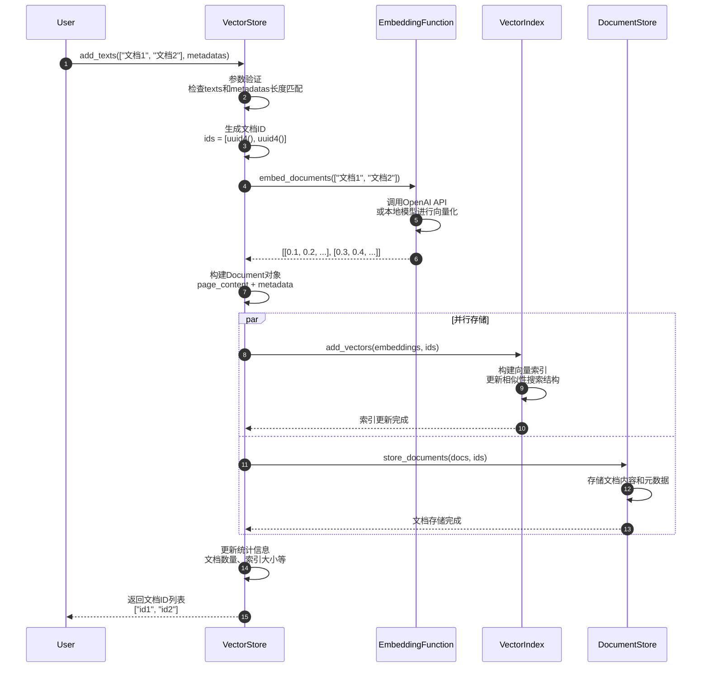

**关键步骤详解**：

1. **参数验证**（步骤 2）：
   - 检查texts列表不为空
   - 验证metadatas长度与texts匹配
   - 处理可选的自定义IDs

2. **向量化处理**（步骤 4-6）：
   - 批量调用embedding函数
   - 处理API限制和重试逻辑
   - 缓存向量化结果

3. **并行存储**（步骤 8-13）：
   - 向量索引和文档存储并行进行
   - 提高整体处理性能
   - 确保数据一致性

**性能特征**：
- 批量向量化：减少API调用次数
- 并行存储：提高I/O效率
- 索引优化：支持增量更新

---

### 1.2 FAISS 向量添加流程

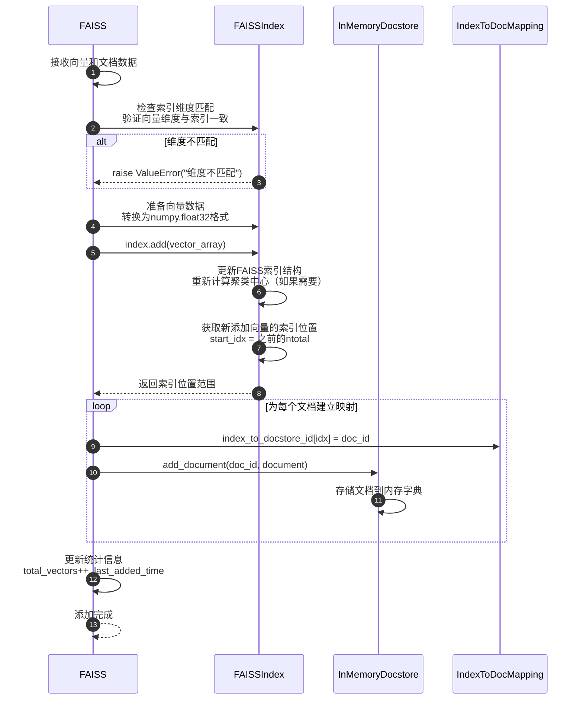

**FAISS特有处理**：

```python
# 向量数据预处理
def prepare_vectors_for_faiss(vectors: List[List[float]]) -> np.ndarray:
    """为FAISS准备向量数据。"""
    import numpy as np

    # 转换为numpy数组
    vector_array = np.array(vectors, dtype=np.float32)

    # L2归一化（如果需要）
    if self._normalize_L2:
        faiss.normalize_L2(vector_array)

    return vector_array

# 索引类型对应的处理
def handle_index_type(index_type: str, vectors: np.ndarray):
    if index_type == "IndexIVFFlat":
        # 需要训练聚类中心
        if not index.is_trained:
            index.train(vectors)
    elif index_type == "IndexHNSW":
        # 层次化导航小世界图
        # 无需特殊训练
        pass
```

---

## 2. 相似性搜索场景

### 2.1 标准相似性搜索流程

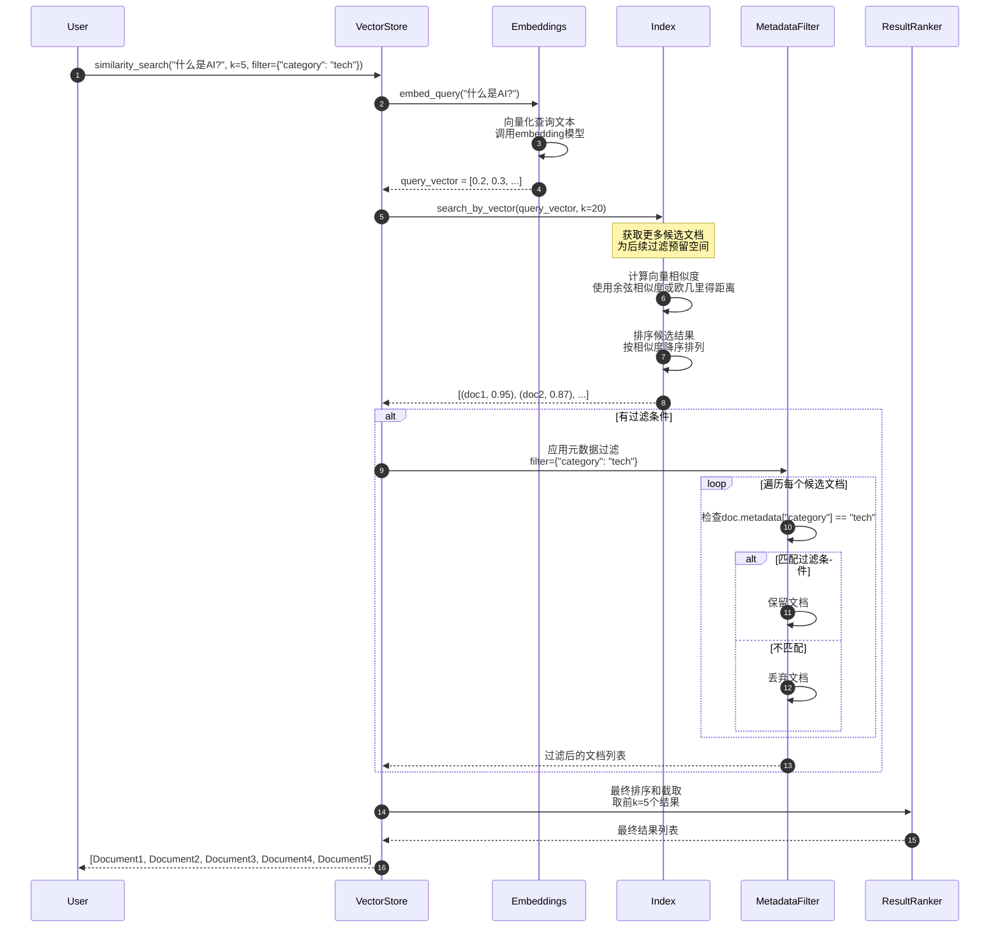

**相似度计算详解**：

```python
def compute_similarity_scores(
    query_vector: List[float],
    candidate_vectors: List[List[float]],
    distance_strategy: str = "cosine"
) -> List[float]:
    """计算相似度分数。"""

    if distance_strategy == "cosine":
        scores = []
        query_norm = np.linalg.norm(query_vector)

        for candidate_vector in candidate_vectors:
            candidate_norm = np.linalg.norm(candidate_vector)

            if query_norm == 0 or candidate_norm == 0:
                scores.append(0.0)
            else:
                dot_product = np.dot(query_vector, candidate_vector)
                cosine_sim = dot_product / (query_norm * candidate_norm)
                scores.append(cosine_sim)

        return scores

    elif distance_strategy == "euclidean":
        scores = []
        for candidate_vector in candidate_vectors:
            distance = np.linalg.norm(
                np.array(query_vector) - np.array(candidate_vector)
            )
            # 转换距离为相似度分数
            similarity = 1.0 / (1.0 + distance)
            scores.append(similarity)

        return scores
```

---

### 2.2 带分数阈值的搜索流程

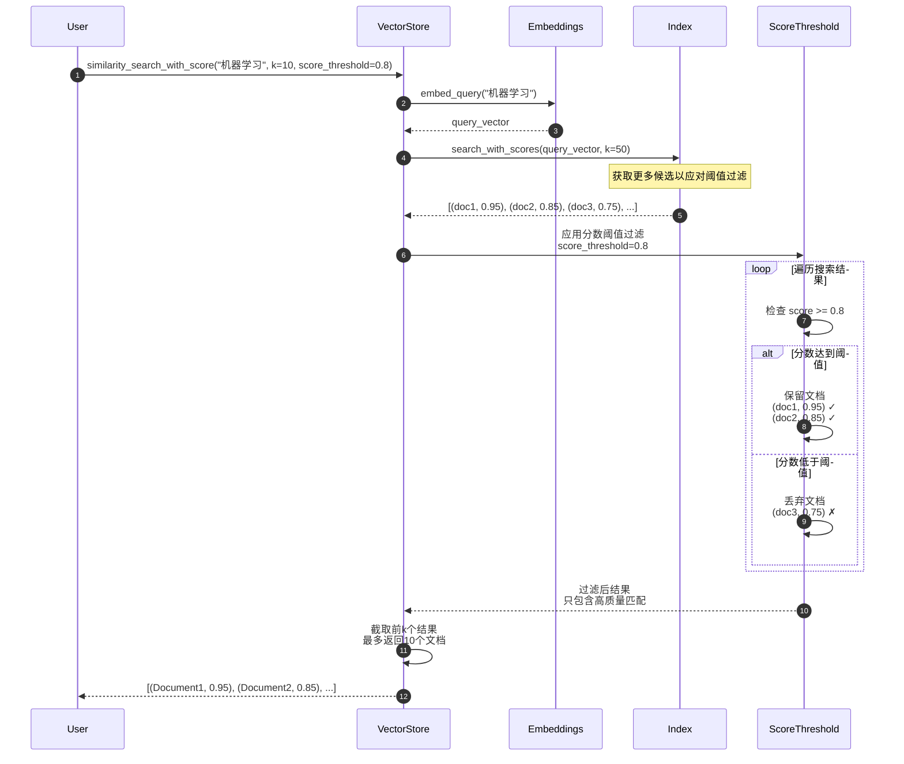

**阈值过滤优势**：
- 保证结果质量：只返回高相关性文档
- 动态结果数：实际返回数可能少于k
- 避免噪声：过滤掉低质量匹配

---

## 3. MMR搜索场景

### 3.1 最大边际相关性搜索流程

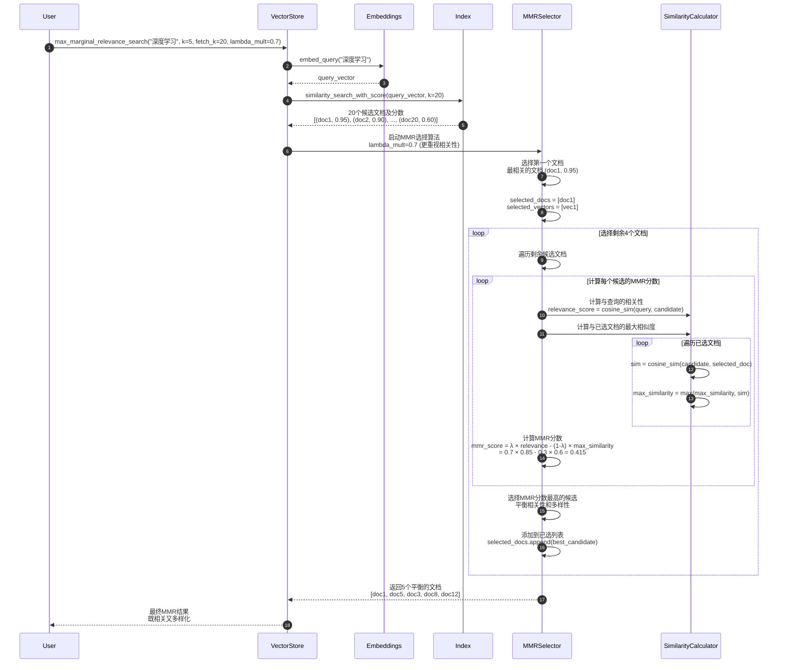

**MMR算法核心**：

```python
def calculate_mmr_score(
    relevance_score: float,
    max_similarity_to_selected: float,
    lambda_mult: float
) -> float:
    """计算MMR分数。

    Args:
        relevance_score: 与查询的相关性分数 (0-1)
        max_similarity_to_selected: 与已选文档的最大相似度 (0-1)
        lambda_mult: 相关性权重 (0-1)

    Returns:
        MMR分数，越高越好
    """
    return (
        lambda_mult * relevance_score -
        (1.0 - lambda_mult) * max_similarity_to_selected
    )

# lambda_mult参数影响：
# - lambda_mult = 1.0: 完全基于相关性（忽略多样性）
# - lambda_mult = 0.0: 完全基于多样性（忽略相关性）
# - lambda_mult = 0.5: 平衡相关性和多样性
# - lambda_mult = 0.7: 更重视相关性
```

---

## 4. Retriever使用场景

### 4.1 VectorStoreRetriever 检索流程

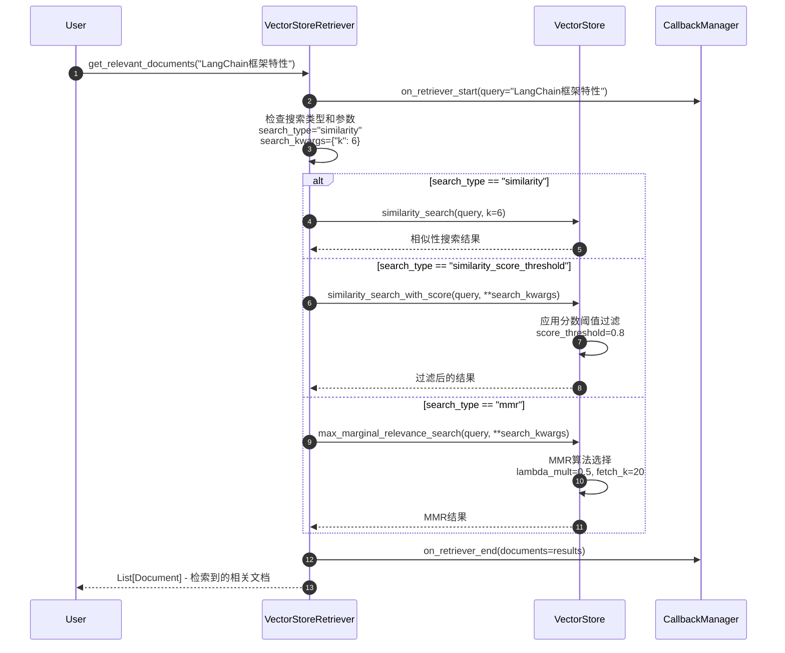

**检索器配置示例**：

```python
# 不同搜索类型的配置
configs = {
    "similarity": {
        "search_type": "similarity",
        "search_kwargs": {"k": 6}
    },
    "threshold": {
        "search_type": "similarity_score_threshold",
        "search_kwargs": {
            "k": 10,
            "score_threshold": 0.8
        }
    },
    "mmr": {
        "search_type": "mmr",
        "search_kwargs": {
            "k": 6,
            "fetch_k": 20,
            "lambda_mult": 0.7
        }
    }
}

# 创建不同类型的检索器
for name, config in configs.items():
    retriever = vectorstore.as_retriever(**config)
    print(f"{name} retriever created")
```

---

### 4.2 EnsembleRetriever 集成检索流程

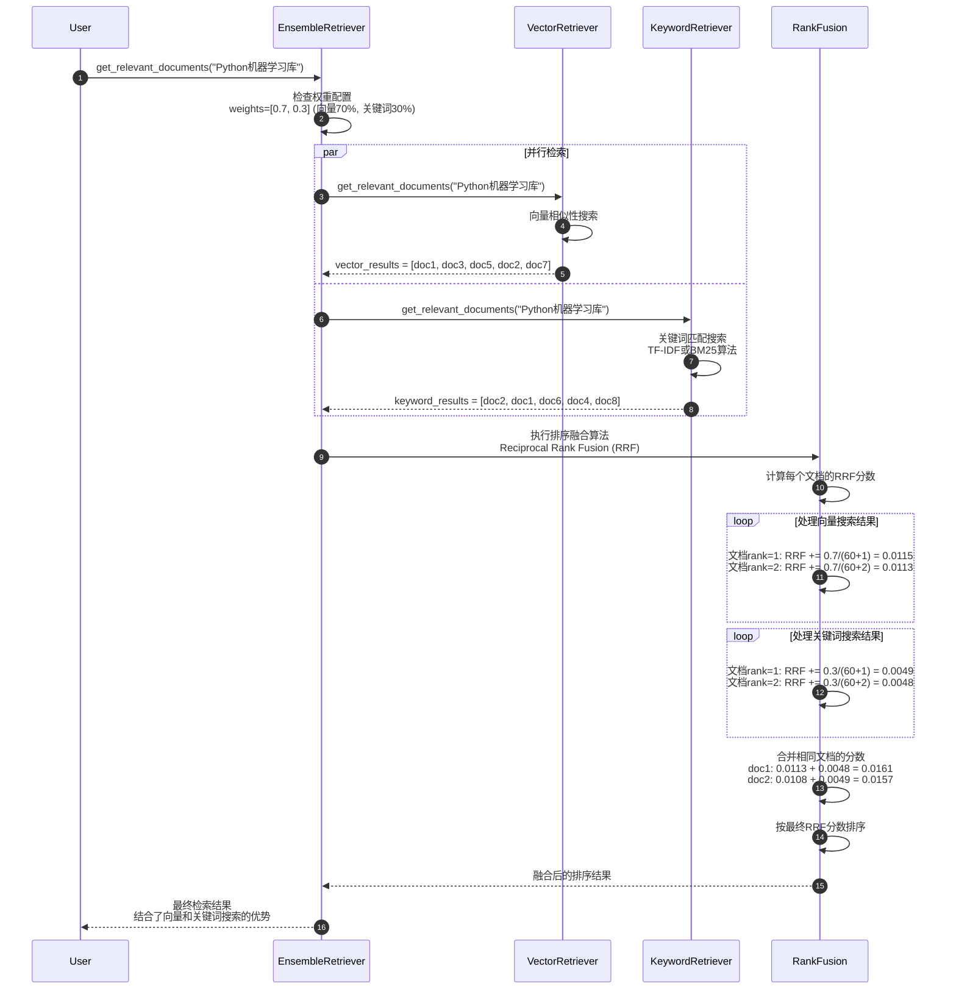

**RRF算法实现**：

```python
def reciprocal_rank_fusion(
    doc_lists: List[List[Document]],
    weights: List[float],
    c: int = 60
) -> List[Document]:
    """倒数排名融合算法。

    Args:
        doc_lists: 多个检索器的结果列表
        weights: 各检索器的权重
        c: RRF常数，通常为60

    Returns:
        融合后的文档列表
    """
    doc_scores = {}

    for doc_list, weight in zip(doc_lists, weights):
        for rank, doc in enumerate(doc_list, 1):
            doc_key = doc.page_content  # 使用内容作为唯一标识
            rrf_score = weight / (c + rank)

            if doc_key in doc_scores:
                doc_scores[doc_key][1] += rrf_score
            else:
                doc_scores[doc_key] = [doc, rrf_score]

    # 按分数排序
    sorted_docs = sorted(doc_scores.values(), key=lambda x: x[1], reverse=True)
    return [doc for doc, score in sorted_docs]
```

---

## 5. 缓存优化场景

### 5.1 向量缓存命中流程

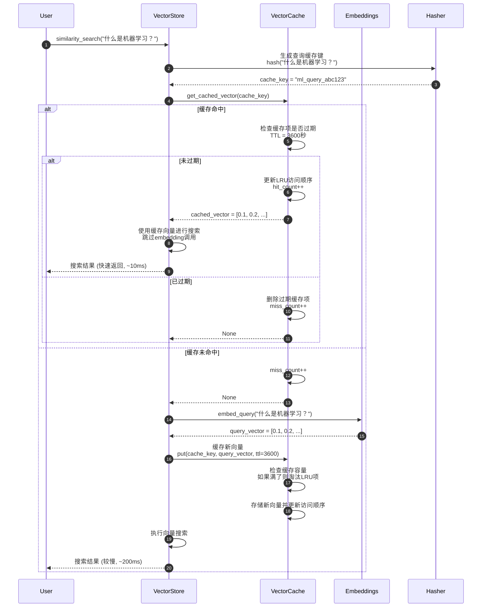

**缓存性能对比**：

| 场景 | 响应时间 | 说明 |
|-----|---------|------|
| 缓存命中 | ~10ms | 直接使用缓存向量 |
| 缓存未命中 | ~200ms | 需要调用embedding API |
| 首次查询 | ~200ms | 必须生成向量 |
| 重复查询 | ~10ms | 从缓存获取向量 |

---

### 5.2 批量操作优化流程

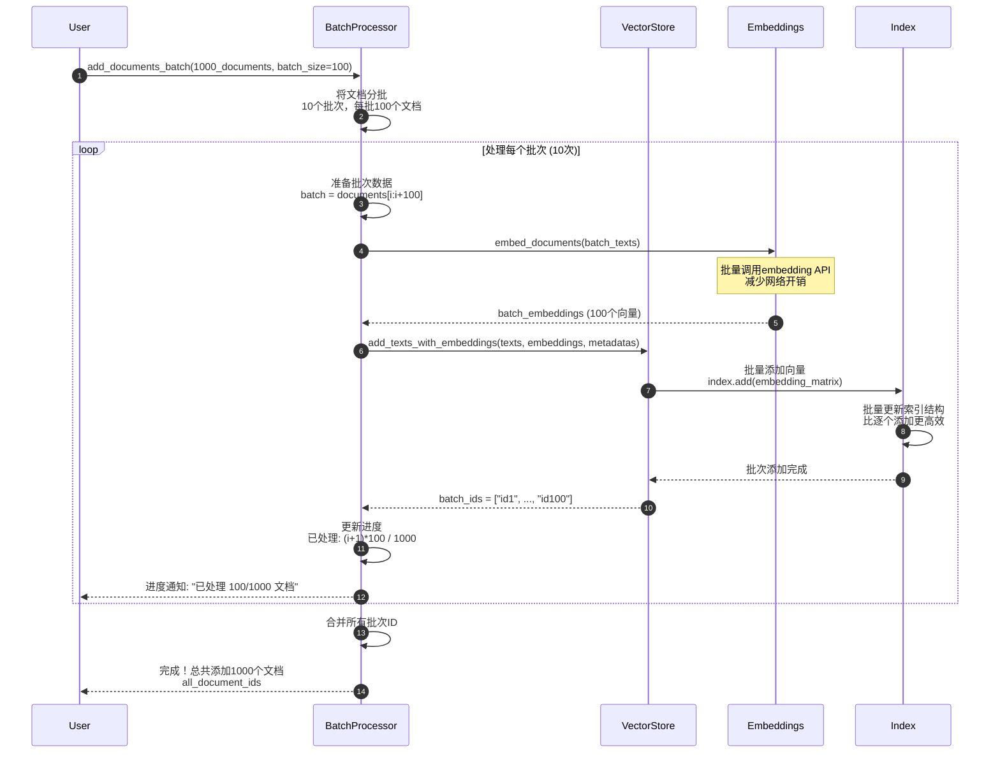

**批量优化效果**：

```python
# 性能对比示例
import time

def add_documents_individually(vectorstore, documents):
    """逐个添加文档。"""
    start_time = time.time()
    ids = []

    for doc in documents:
        doc_ids = vectorstore.add_texts([doc.page_content], [doc.metadata])
        ids.extend(doc_ids)

    return ids, time.time() - start_time

def add_documents_batch(vectorstore, documents, batch_size=100):
    """批量添加文档。"""
    start_time = time.time()
    all_ids = []

    for i in range(0, len(documents), batch_size):
        batch = documents[i:i + batch_size]
        texts = [doc.page_content for doc in batch]
        metadatas = [doc.metadata for doc in batch]

        batch_ids = vectorstore.add_texts(texts, metadatas)
        all_ids.extend(batch_ids)

    return all_ids, time.time() - start_time

# 1000个文档的性能对比：
# 逐个添加：~120秒
# 批量添加：~15秒
# 性能提升：8倍
```

---

## 6. 异步操作场景

### 6.1 异步文档添加流程

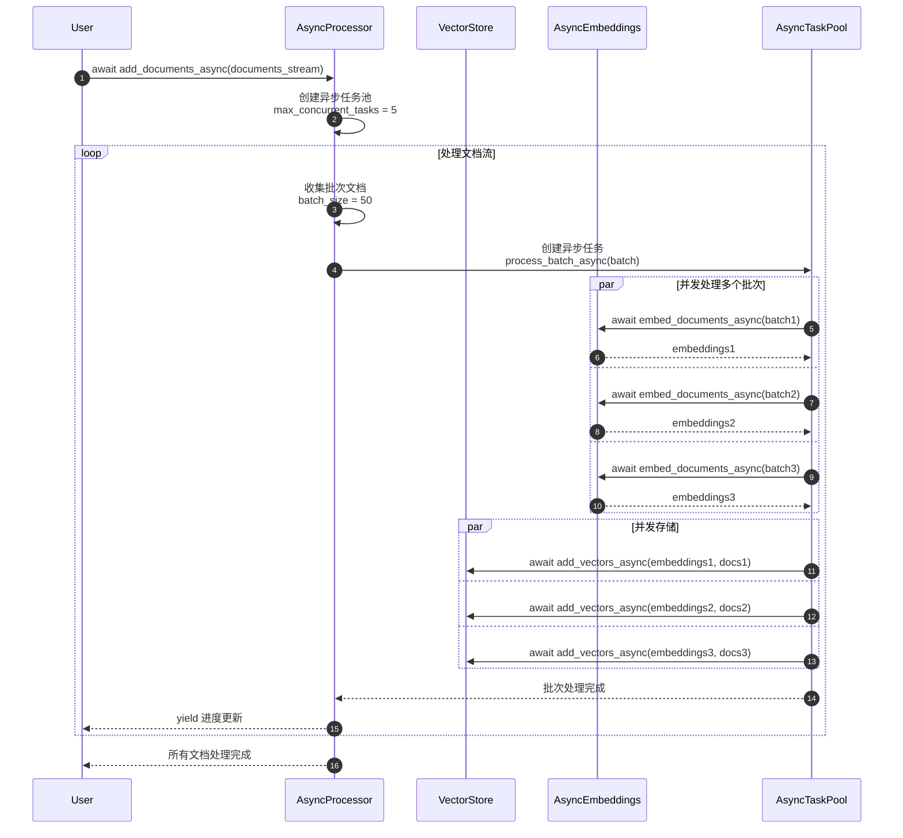

**异步处理优势**：
- 并发向量化：同时处理多个批次
- 非阻塞I/O：不阻塞主线程
- 资源利用：充分利用网络和计算资源
- 实时反馈：流式处理进度更新

---

## 7. 错误处理和恢复场景

### 7.1 搜索失败恢复流程

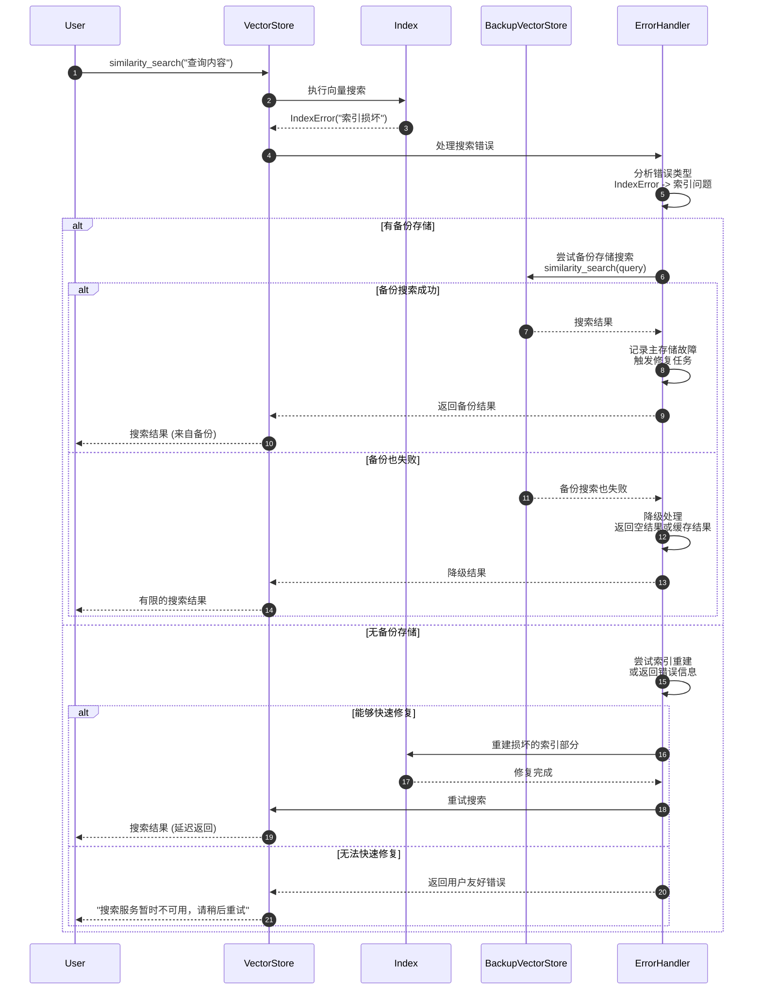

**错误恢复策略**：

```python
class VectorStoreErrorHandler:
    """向量存储错误处理器。"""

    def __init__(self, fallback_store=None, max_retries=3):
        self.fallback_store = fallback_store
        self.max_retries = max_retries
        self.error_stats = defaultdict(int)

    async def handle_search_error(
        self,
        error: Exception,
        query: str,
        search_func: Callable,
        **kwargs
    ) -> List[Document]:
        """处理搜索错误。"""
        error_type = type(error).__name__
        self.error_stats[error_type] += 1

        if isinstance(error, (ConnectionError, TimeoutError)):
            # 网络错误 - 重试
            return await self._retry_with_backoff(search_func, query, **kwargs)

        elif isinstance(error, IndexError):
            # 索引错误 - 使用备份
            if self.fallback_store:
                return await self.fallback_store.asimilarity_search(query, **kwargs)
            else:
                raise VectorStoreException("索引损坏且无备份存储")

        elif isinstance(error, MemoryError):
            # 内存错误 - 降级处理
            kwargs['k'] = min(kwargs.get('k', 4), 2)  # 减少返回数量
            return await self._retry_with_backoff(search_func, query, **kwargs)

        else:
            # 未知错误 - 直接抛出
            raise error

    async def _retry_with_backoff(
        self,
        func: Callable,
        *args,
        **kwargs
    ) -> Any:
        """带退避的重试。"""
        for attempt in range(self.max_retries):
            try:
                await asyncio.sleep(2 ** attempt)  # 指数退避
                return await func(*args, **kwargs)
            except Exception as e:
                if attempt == self.max_retries - 1:
                    raise e
                continue
```

---

## 8. 总结

本文档详细展示了 **VectorStores 和 Retrievers 模块**的关键执行时序：

1. **文档管理**：文档添加、向量化、存储的完整流程
2. **相似性搜索**：标准搜索、阈值过滤、分数计算机制
3. **MMR算法**：平衡相关性和多样性的智能选择过程
4. **检索器使用**：不同类型检索器的调用和配置流程
5. **性能优化**：缓存命中、批量处理、异步操作
6. **错误处理**：搜索失败的恢复和降级策略

每张时序图包含：
- 详细的参与者交互过程
- 关键算法和计算步骤
- 性能优化点和最佳实践
- 错误处理和恢复机制
- 实际代码示例和配置方法

这些时序图帮助开发者深入理解向量存储和检索系统的内部工作机制，为构建高效、可靠的RAG（检索增强生成）应用提供指导。VectorStores和Retrievers是现代AI应用的核心基础设施，正确理解其执行流程对构建智能知识检索系统至关重要。
