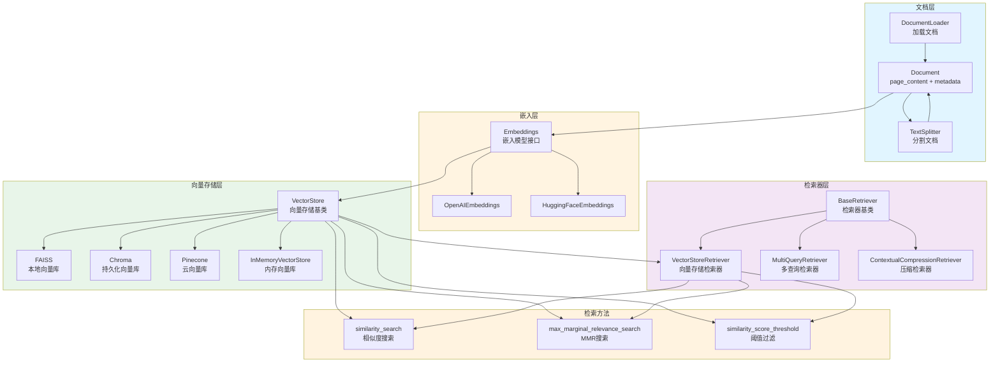
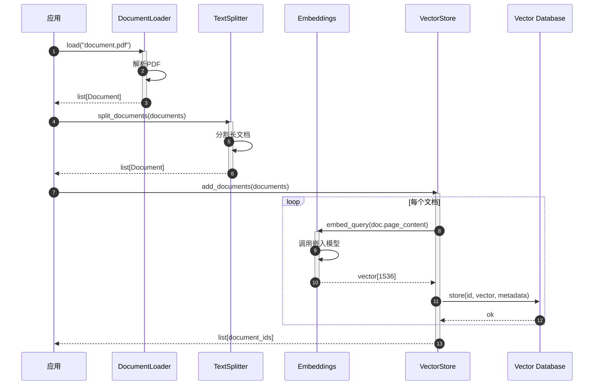
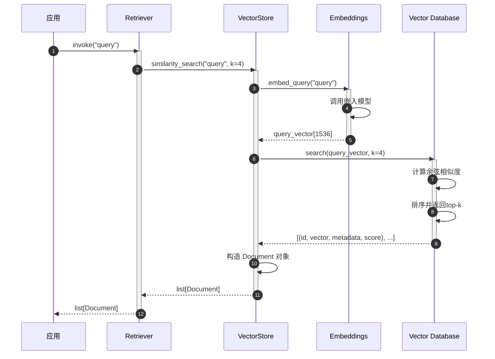
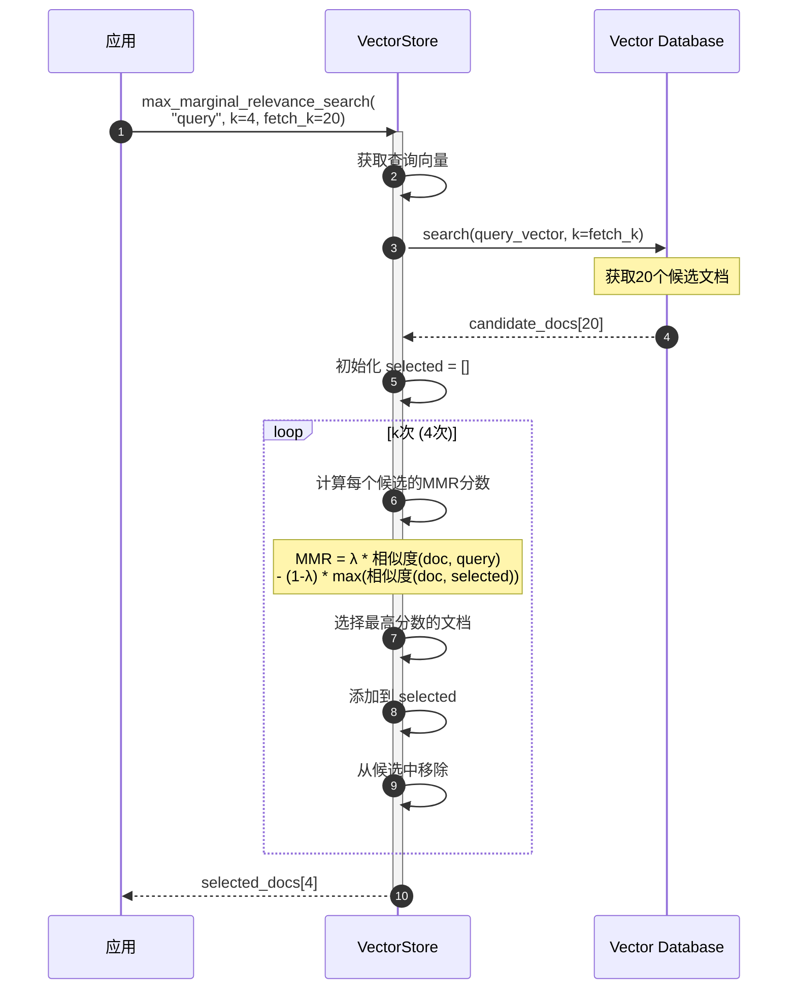
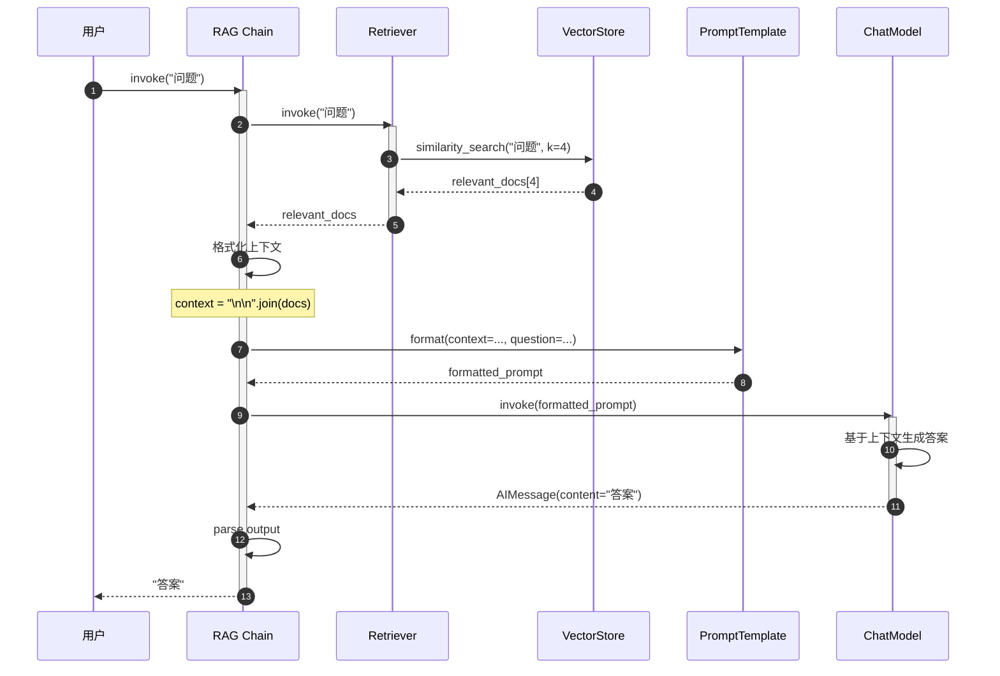

# LangChain-08-VectorStores-Retrievers-概览

## 模块基本信息

**模块名称**: langchain-core-vectorstores / langchain-core-retrievers
**模块路径**:
- `libs/core/langchain_core/vectorstores/`
- `libs/core/langchain_core/retrievers.py`

**核心职责**: 提供向量存储和文档检索能力，是 RAG（检索增强生成）系统的核心组件

## 1. 模块职责

### 1.1 核心职责

VectorStores & Retrievers 是 RAG 系统的关键模块，提供以下能力：

1. **向量存储**: 存储文档的嵌入向量
2. **相似度搜索**: 基于向量相似度检索文档
3. **文档管理**: 添加、更新、删除文档
4. **多种检索策略**: 相似度、MMR、阈值过滤等
5. **检索器抽象**: 统一的文档检索接口
6. **过滤能力**: 基于元数据过滤文档
7. **异步支持**: 高效的异步检索

### 1.2 核心概念

```
文档（Document）
  ↓
嵌入（Embeddings）→ 向量（Vector）
  ↓
存储（VectorStore）
  ↓
检索（Retriever）
  ↓
相关文档（Relevant Documents）
```

**关键术语**:
- **Document**: 包含 `page_content`（文本）和 `metadata`（元数据）
- **Embeddings**: 将文本转换为向量的模型
- **VectorStore**: 存储和搜索向量的数据库
- **Retriever**: 文档检索接口
- **Similarity Search**: 基于余弦相似度的搜索
- **MMR**: 最大边际相关性（平衡相关性和多样性）

### 1.3 检索策略对比

| 检索策略 | 适用场景 | 优势 | 劣势 |
|---------|---------|------|------|
| **Similarity** | 基础相似度搜索 | 简单高效 | 可能返回冗余结果 |
| **MMR** | 需要多样性的结果 | 平衡相关性和多样性 | 计算开销较大 |
| **Similarity Score Threshold** | 需要高质量结果 | 过滤低相关度文档 | 可能返回较少结果 |

### 1.4 输入/输出

**VectorStore 输入**:
- **add_texts**: `list[str]` - 文本列表
- **add_documents**: `list[Document]` - 文档列表

**VectorStore 输出**:
- **similarity_search**: `list[Document]` - 相似文档
- **similarity_search_with_score**: `list[(Document, float)]` - 文档+分数

**Retriever 输入**:
- **query**: `str` - 搜索查询

**Retriever 输出**:
- `list[Document]` - 相关文档列表

### 1.5 向量存储实现

LangChain 支持多种向量存储后端：

| 向量存储 | 类型 | 适用场景 | 推荐度 |
|---------|------|---------|--------|
| **FAISS** | 本地 | 开发测试、小规模数据 | ⭐⭐⭐⭐⭐ |
| **Chroma** | 本地/云 | 中小规模应用 | ⭐⭐⭐⭐⭐ |
| **Pinecone** | 云服务 | 生产环境、大规模 | ⭐⭐⭐⭐⭐ |
| **Weaviate** | 云/自托管 | 复杂查询、图谱 | ⭐⭐⭐⭐ |
| **Qdrant** | 云/自托管 | 高性能搜索 | ⭐⭐⭐⭐ |
| **InMemoryVectorStore** | 内存 | 测试、原型 | ⭐⭐⭐ |

### 1.6 上下游依赖

**上游调用者**:
- RAG 应用
- 代理（通过检索器工具）
- 问答系统

**下游依赖**:
- `langchain_core.embeddings`: 向量嵌入
- `langchain_core.documents`: 文档结构
- 向量数据库客户端（FAISS、Chroma 等）

## 2. 模块级架构图



### 架构图详细说明

**1. 文档层**

- **Document**: 核心数据结构
  ```python
  class Document:
      page_content: str  # 文本内容
      metadata: dict  # 元数据（来源、页码、标题等）
      id: Optional[str] = None  # 文档ID
  ```

- **DocumentLoader**: 加载各种格式文档
  - `TextLoader`: 文本文件
  - `PyPDFLoader`: PDF 文件
  - `WebBaseLoader`: 网页
  - `DirectoryLoader`: 目录批量加载

- **TextSplitter**: 分割长文档
  - `RecursiveCharacterTextSplitter`: 递归分割
  - `CharacterTextSplitter`: 字符分割
  - `TokenTextSplitter`: 按 Token 分割

**2. 嵌入层**

- **Embeddings**: 嵌入模型接口
  - 定义 `embed_documents` 和 `embed_query` 方法
  - 将文本转换为高维向量

- **常用实现**:
  ```python
  # OpenAI
  from langchain_openai import OpenAIEmbeddings
  embeddings = OpenAIEmbeddings(model="text-embedding-3-small")

  # HuggingFace
  from langchain_huggingface import HuggingFaceEmbeddings
  embeddings = HuggingFaceEmbeddings(model_name="all-MiniLM-L6-v2")
  ```

**3. 向量存储层**

- **VectorStore**: 抽象基类
  - 定义向量存储的通用接口
  - 支持添加、搜索、删除文档

  **核心方法**:
  ```python
  class VectorStore:
      # 添加文档
      def add_documents(self, documents: list[Document]) -> list[str]: ...

      # 相似度搜索
      def similarity_search(self, query: str, k: int = 4) -> list[Document]: ...

      # 带分数的搜索
      def similarity_search_with_score(
          self, query: str, k: int = 4
      ) -> list[tuple[Document, float]]: ...

      # MMR 搜索
      def max_marginal_relevance_search(
          self, query: str, k: int = 4, fetch_k: int = 20
      ) -> list[Document]: ...

      # 转换为检索器
      def as_retriever(self, **kwargs) -> VectorStoreRetriever: ...
  ```

- **FAISS**: Facebook AI Similarity Search
  - 高效的本地向量检索库
  - 支持多种索引算法
  - 适合开发和中小规模部署

- **Chroma**: 轻量级向量数据库
  - 支持持久化
  - 易于使用
  - 开源免费

- **Pinecone**: 托管向量数据库
  - 云服务，无需维护
  - 高可用、可扩展
  - 适合生产环境

- **InMemoryVectorStore**: 内存向量存储
  - 最简单的实现
  - 适合测试和原型

**4. 检索器层**

- **BaseRetriever**: 检索器基类
  - 继承自 `RunnableSerializable`
  - 定义 `_get_relevant_documents` 抽象方法
  - 支持 LCEL 组合

- **VectorStoreRetriever**: 向量存储检索器
  - 包装 `VectorStore` 为 `Retriever`
  - 配置检索策略和参数
  - 最常用的检索器

- **MultiQueryRetriever**: 多查询检索器
  - 生成多个查询变体
  - 检索并合并结果
  - 提高召回率

- **ContextualCompressionRetriever**: 压缩检索器
  - 检索后压缩文档
  - 只保留相关部分
  - 节省 Token

**5. 检索方法**

- **similarity_search**: 基础相似度搜索
  - 基于余弦相似度
  - 返回 top-k 最相似文档

  ```python
  docs = vectorstore.similarity_search("query", k=4)
  ```

- **max_marginal_relevance_search (MMR)**:
  - 平衡相关性和多样性
  - 避免返回冗余文档
  - 参数: `k`（返回数量）、`fetch_k`（候选数量）、`lambda_mult`（多样性权重）

  ```python
  docs = vectorstore.max_marginal_relevance_search(
      "query",
      k=4,
      fetch_k=20,
      lambda_mult=0.5  # 0=最大多样性, 1=最大相关性
  )
  ```

- **similarity_score_threshold**: 阈值过滤
  - 只返回分数高于阈值的文档
  - 保证检索质量

  ```python
  docs = vectorstore.similarity_search_with_relevance_scores(
      "query",
      k=4,
      score_threshold=0.8
  )
  ```

## 3. 核心 API 详解

### 3.1 创建向量存储

**方法 1: 从文档创建**

```python
from langchain_community.vectorstores import FAISS
from langchain_openai import OpenAIEmbeddings
from langchain_core.documents import Document

# 准备文档
documents = [
    Document(
        page_content="LangChain is a framework for building LLM applications.",
        metadata={"source": "docs", "page": 1}
    ),
    Document(
        page_content="LCEL is the LangChain Expression Language.",
        metadata={"source": "docs", "page": 2}
    )
]

# 创建嵌入模型
embeddings = OpenAIEmbeddings(model="text-embedding-3-small")

# 从文档创建向量存储
vectorstore = FAISS.from_documents(
    documents=documents,
    embedding=embeddings
)
```

**方法 2: 从文本创建**

```python
texts = [
    "LangChain is a framework for building LLM applications.",
    "LCEL is the LangChain Expression Language."
]

metadatas = [
    {"source": "docs", "page": 1},
    {"source": "docs", "page": 2}
]

vectorstore = FAISS.from_texts(
    texts=texts,
    embedding=embeddings,
    metadatas=metadatas
)
```

**方法 3: 增量添加**

```python
# 创建空向量存储
vectorstore = FAISS(
    embedding_function=embeddings,
    index=faiss.IndexFlatL2(1536)  # OpenAI 嵌入维度
)

# 添加文档
ids = vectorstore.add_documents(documents)

# 添加文本
ids = vectorstore.add_texts(
    texts=["New document content"],
    metadatas=[{"source": "new"}]
)
```

### 3.2 相似度搜索

**基础搜索**:

```python
# 搜索最相似的 k 个文档
query = "What is LangChain?"
docs = vectorstore.similarity_search(query, k=4)

for doc in docs:
    print(f"Content: {doc.page_content}")
    print(f"Metadata: {doc.metadata}\n")
```

**带分数的搜索**:

```python
# 返回文档和相似度分数
docs_with_scores = vectorstore.similarity_search_with_score(query, k=4)

for doc, score in docs_with_scores:
    print(f"Score: {score:.4f}")
    print(f"Content: {doc.page_content}\n")
```

**带元数据过滤**:

```python
# 只搜索特定来源的文档
docs = vectorstore.similarity_search(
    query,
    k=4,
    filter={"source": "docs"}  # 过滤条件（取决于向量存储实现）
)
```

**基于向量搜索**:

```python
# 直接使用嵌入向量搜索
query_vector = embeddings.embed_query(query)
docs = vectorstore.similarity_search_by_vector(query_vector, k=4)
```

### 3.3 MMR 搜索（多样性）

```python
# MMR: 最大边际相关性搜索
docs = vectorstore.max_marginal_relevance_search(
    query="LangChain features",
    k=4,  # 返回4个文档
    fetch_k=20,  # 先获取20个候选
    lambda_mult=0.5  # 平衡因子: 0=最大多样性, 1=最大相关性
)

# lambda_mult 示例:
# lambda_mult=1.0 → 纯相似度（可能重复）
# lambda_mult=0.5 → 平衡相关性和多样性
# lambda_mult=0.0 → 最大多样性（可能不太相关）
```

### 3.4 阈值过滤搜索

```python
# 只返回相似度分数高于阈值的文档
docs_and_scores = vectorstore.similarity_search_with_relevance_scores(
    query="LangChain",
    k=10,  # 最多返回10个
    score_threshold=0.8  # 只要分数 >= 0.8 的文档
)

# 如果没有文档满足阈值,返回空列表
print(f"Found {len(docs_and_scores)} documents above threshold")

for doc, score in docs_and_scores:
    print(f"Score: {score:.4f} | Content: {doc.page_content[:100]}")
```

### 3.5 创建检索器

**基础检索器**:

```python
# 将向量存储转换为检索器
retriever = vectorstore.as_retriever()

# 使用检索器
docs = retriever.invoke("What is LangChain?")
```

**配置检索器**:

```python
# 配置检索策略和参数
retriever = vectorstore.as_retriever(
    search_type="similarity",  # "similarity", "mmr", "similarity_score_threshold"
    search_kwargs={
        "k": 4,  # 返回文档数量
        # "filter": {"source": "docs"},  # 元数据过滤
    }
)

# MMR 检索器
mmr_retriever = vectorstore.as_retriever(
    search_type="mmr",
    search_kwargs={
        "k": 4,
        "fetch_k": 20,
        "lambda_mult": 0.5
    }
)

# 阈值过滤检索器
threshold_retriever = vectorstore.as_retriever(
    search_type="similarity_score_threshold",
    search_kwargs={
        "k": 10,
        "score_threshold": 0.8
    }
)
```

**在 LCEL 链中使用**:

```python
from langchain_core.runnables import RunnablePassthrough
from langchain_core.prompts import ChatPromptTemplate
from langchain_openai import ChatOpenAI
from langchain_core.output_parsers import StrOutputParser

# 构建 RAG 链
template = """Answer the question based on the following context:

Context: {context}

Question: {question}

Answer:"""

prompt = ChatPromptTemplate.from_template(template)
model = ChatOpenAI(model="gpt-4")

# 完整的 RAG 链
rag_chain = (
    {
        "context": retriever | (lambda docs: "\n\n".join(doc.page_content for doc in docs)),
        "question": RunnablePassthrough()
    }
    | prompt
    | model
    | StrOutputParser()
)

# 执行
answer = rag_chain.invoke("What is LangChain?")
print(answer)
```

### 3.6 自定义检索器

**实现自定义检索器**:

```python
from langchain_core.retrievers import BaseRetriever
from langchain_core.callbacks import CallbackManagerForRetrieverRun
from langchain_core.documents import Document

class CustomRetriever(BaseRetriever):
    """自定义检索器示例"""

    vectorstore: VectorStore
    keyword_index: dict[str, list[Document]]  # 关键词索引

    def _get_relevant_documents(
        self,
        query: str,
        *,
        run_manager: CallbackManagerForRetrieverRun
    ) -> list[Document]:
        """
        混合检索：向量搜索 + 关键词搜索
        """
        # 1. 向量搜索
        vector_docs = self.vectorstore.similarity_search(query, k=5)

        # 2. 关键词搜索
        keywords = self._extract_keywords(query)
        keyword_docs = []
        for keyword in keywords:
            if keyword in self.keyword_index:
                keyword_docs.extend(self.keyword_index[keyword])

        # 3. 合并和去重
        all_docs = vector_docs + keyword_docs
        unique_docs = self._deduplicate(all_docs)

        # 4. 重新排序
        reranked_docs = self._rerank(unique_docs, query)

        return reranked_docs[:5]

    async def _aget_relevant_documents(
        self,
        query: str,
        *,
        run_manager: AsyncCallbackManagerForRetrieverRun
    ) -> list[Document]:
        """异步实现"""
        # 类似的逻辑，使用 async 方法
        vector_docs = await self.vectorstore.asimilarity_search(query, k=5)
        # ...
        return reranked_docs[:5]

    def _extract_keywords(self, query: str) -> list[str]:
        """提取关键词"""
        # 简单实现：分词并过滤停用词
        stopwords = {"a", "the", "is", "in", "on", "at"}
        words = query.lower().split()
        return [w for w in words if w not in stopwords]

    def _deduplicate(self, docs: list[Document]) -> list[Document]:
        """去重"""
        seen = set()
        unique = []
        for doc in docs:
            content_hash = hash(doc.page_content)
            if content_hash not in seen:
                seen.add(content_hash)
                unique.append(doc)
        return unique

    def _rerank(self, docs: list[Document], query: str) -> list[Document]:
        """重新排序（可接入重排序模型）"""
        # 简单实现：按内容长度排序
        return sorted(docs, key=lambda d: len(d.page_content), reverse=True)

# 使用
custom_retriever = CustomRetriever(
    vectorstore=vectorstore,
    keyword_index=build_keyword_index(documents)
)

docs = custom_retriever.invoke("query")
```

## 4. 核心流程时序图

### 4.1 文档入库流程



### 4.2 相似度搜索流程



### 4.3 MMR 搜索流程



**MMR 算法详解**:

```python
def max_marginal_relevance(
    query_vector: list[float],
    candidate_vectors: list[list[float]],
    k: int,
    lambda_mult: float = 0.5
) -> list[int]:
    """
    MMR 算法实现

    Args:
        query_vector: 查询向量
        candidate_vectors: 候选文档向量
        k: 返回数量
        lambda_mult: 平衡因子 (0-1)

    Returns:
        选中的文档索引
    """
    selected_indices = []
    candidate_indices = list(range(len(candidate_vectors)))

    for _ in range(k):
        best_idx = None
        best_score = float('-inf')

        for idx in candidate_indices:
            # 相关性分数：与查询的相似度
            relevance = cosine_similarity(
                query_vector,
                candidate_vectors[idx]
            )

            # 多样性惩罚：与已选文档的最大相似度
            if selected_indices:
                redundancy = max(
                    cosine_similarity(
                        candidate_vectors[idx],
                        candidate_vectors[selected_idx]
                    )
                    for selected_idx in selected_indices
                )
            else:
                redundancy = 0

            # MMR 分数
            mmr_score = lambda_mult * relevance - (1 - lambda_mult) * redundancy

            if mmr_score > best_score:
                best_score = mmr_score
                best_idx = idx

        selected_indices.append(best_idx)
        candidate_indices.remove(best_idx)

    return selected_indices
```

### 4.4 RAG 完整流程



## 5. 最佳实践

### 5.1 文档准备

**1. 合理分割文档**:

```python
from langchain.text_splitter import RecursiveCharacterTextSplitter

# 推荐配置
splitter = RecursiveCharacterTextSplitter(
    chunk_size=1000,  # 每块大小（字符数）
    chunk_overlap=200,  # 重叠部分（保留上下文）
    length_function=len,
    is_separator_regex=False
)

chunks = splitter.split_documents(documents)

# chunk_size 选择建议:
# - 太小 (< 500): 缺乏上下文，检索不准确
# - 适中 (500-1500): 平衡上下文和精度
# - 太大 (> 2000): Token 浪费，噪音增加
```

**2. 丰富元数据**:

```python
documents = [
    Document(
        page_content="...",
        metadata={
            "source": "user_manual.pdf",  # 来源
            "page": 5,  # 页码
            "chapter": "Installation",  # 章节
            "date": "2024-01-15",  # 日期
            "category": "technical",  # 分类
            "language": "en"  # 语言
        }
    )
]

# 利用元数据过滤
docs = vectorstore.similarity_search(
    "installation steps",
    k=5,
    filter={"category": "technical", "language": "en"}
)
```

### 5.2 选择合适的嵌入模型

```python
# 1. OpenAI (推荐：性能好，维护简单)
from langchain_openai import OpenAIEmbeddings
embeddings = OpenAIEmbeddings(
    model="text-embedding-3-small"  # 或 text-embedding-3-large
)

# 2. 本地模型 (推荐：成本低，隐私好)
from langchain_huggingface import HuggingFaceEmbeddings
embeddings = HuggingFaceEmbeddings(
    model_name="BAAI/bge-small-en-v1.5",  # 英文
    # model_name="BAAI/bge-small-zh-v1.5",  # 中文
    model_kwargs={"device": "cpu"},
    encode_kwargs={"normalize_embeddings": True}
)

# 3. 多语言模型
embeddings = HuggingFaceEmbeddings(
    model_name="sentence-transformers/paraphrase-multilingual-MiniLM-L12-v2"
)
```

### 5.3 选择检索策略

```python
# 1. 默认相似度搜索（大多数场景）
retriever = vectorstore.as_retriever(
    search_type="similarity",
    search_kwargs={"k": 4}
)

# 2. MMR（需要多样性）
retriever = vectorstore.as_retriever(
    search_type="mmr",
    search_kwargs={
        "k": 4,
        "fetch_k": 20,  # 候选数量
        "lambda_mult": 0.5  # 平衡因子
    }
)

# 3. 阈值过滤（保证质量）
retriever = vectorstore.as_retriever(
    search_type="similarity_score_threshold",
    search_kwargs={
        "k": 10,
        "score_threshold": 0.8  # 只要高质量结果
    }
)

# 4. 混合检索（最佳效果，但更复杂）
from langchain.retrievers import EnsembleRetriever
from langchain_community.retrievers import BM25Retriever

bm25_retriever = BM25Retriever.from_documents(documents)
vector_retriever = vectorstore.as_retriever()

ensemble_retriever = EnsembleRetriever(
    retrievers=[bm25_retriever, vector_retriever],
    weights=[0.5, 0.5]  # 调整权重
)
```

### 5.4 优化检索质量

**1. 重排序（Reranking）**:

```python
from langchain.retrievers import ContextualCompressionRetriever
from langchain.retrievers.document_compressors import CrossEncoderReranker
from langchain_community.cross_encoders import HuggingFaceCrossEncoder

# 创建重排序模型
model = HuggingFaceCrossEncoder(model_name="cross-encoder/ms-marco-MiniLM-L-6-v2")
compressor = CrossEncoderReranker(model=model, top_n=3)

# 包装检索器
compression_retriever = ContextualCompressionRetriever(
    base_compressor=compressor,
    base_retriever=vector_retriever
)

# 使用：先检索候选，再精排
docs = compression_retriever.invoke("query")
```

**2. 多查询检索**:

```python
from langchain.retrievers import MultiQueryRetriever
from langchain_openai import ChatOpenAI

# 生成多个查询变体
retriever = MultiQueryRetriever.from_llm(
    retriever=vector_retriever,
    llm=ChatOpenAI(temperature=0)
)

# 自动生成3-5个查询变体，分别检索，合并结果
docs = retriever.invoke("What is LangChain?")
# 生成的查询可能包括:
# - "What is LangChain?"
# - "LangChain definition"
# - "Purpose of LangChain framework"
```

**3. 分层检索**:

```python
# 先粗检索，再细检索
def hierarchical_retrieval(query: str, k: int = 4) -> list[Document]:
    # 1. 粗检索：获取更多候选
    coarse_docs = vectorstore.similarity_search(query, k=k*5)

    # 2. 细检索：使用更精确的模型重新排序
    refined_docs = rerank_with_cross_encoder(coarse_docs, query)

    return refined_docs[:k]
```

### 5.5 性能优化

**1. 批量操作**:

```python
# ❌ 低效：逐个添加
for doc in documents:
    vectorstore.add_documents([doc])

# ✅ 高效：批量添加
vectorstore.add_documents(documents)

# 超大批次：分批处理
batch_size = 100
for i in range(0, len(documents), batch_size):
    batch = documents[i:i+batch_size]
    vectorstore.add_documents(batch)
```

**2. 持久化向量存储**:

```python
# FAISS 持久化
vectorstore.save_local("faiss_index")

# 加载
vectorstore = FAISS.load_local(
    "faiss_index",
    embeddings,
    allow_dangerous_deserialization=True  # 注意安全风险
)

# Chroma 持久化（自动）
vectorstore = Chroma(
    persist_directory="./chroma_db",
    embedding_function=embeddings
)
```

**3. 异步操作**:

```python
# 异步添加文档
ids = await vectorstore.aadd_documents(documents)

# 异步搜索
docs = await vectorstore.asimilarity_search("query", k=4)

# 异步检索器
docs = await retriever.ainvoke("query")
```

### 5.6 监控和调试

```python
# 1. 检查检索质量
docs_with_scores = vectorstore.similarity_search_with_score("query", k=10)

print("Top 10 results:")
for i, (doc, score) in enumerate(docs_with_scores, 1):
    print(f"{i}. Score: {score:.4f}")
    print(f"   Content: {doc.page_content[:100]}...")
    print(f"   Metadata: {doc.metadata}\n")

# 2. 评估召回率
def evaluate_retrieval(queries: list[str], ground_truth: dict):
    """评估检索性能"""
    for query in queries:
        retrieved_docs = retriever.invoke(query)
        relevant_docs = ground_truth[query]

        # 计算召回率
        retrieved_ids = {doc.metadata.get("id") for doc in retrieved_docs}
        relevant_ids = set(relevant_docs)
        recall = len(retrieved_ids & relevant_ids) / len(relevant_ids)

        print(f"Query: {query}")
        print(f"Recall: {recall:.2%}\n")

# 3. 使用回调追踪
from langchain.callbacks import StdOutCallbackHandler

docs = retriever.invoke(
    "query",
    config={"callbacks": [StdOutCallbackHandler()]}
)
```

## 6. 与其他模块的协作

- **Document Loaders**: 加载文档到向量存储
- **Text Splitters**: 分割文档
- **Embeddings**: 生成向量
- **Language Models**: RAG 中的生成部分
- **Chains**: 构建完整的 RAG 流程
- **Agents**: 通过检索器工具访问知识库

## 7. 总结

VectorStores & Retrievers 是 RAG 系统的核心，提供了强大的文档检索能力。关键特性：

1. **多种向量存储**: FAISS、Chroma、Pinecone 等
2. **灵活的检索策略**: 相似度、MMR、阈值过滤
3. **统一的检索器接口**: 作为 Runnable 可组合
4. **元数据过滤**: 精确控制检索范围
5. **异步支持**: 高效的并发操作

**关键原则**:
- 合理分割文档（chunk_size: 500-1500）
- 选择合适的嵌入模型
- 丰富元数据用于过滤
- 使用 MMR 增加多样性
- 考虑重排序提升精度
- 批量操作提高效率
- 持久化向量存储

---

**文档版本**: v1.0
**最后更新**: 2025-10-03
**相关文档**:
- LangChain-00-总览.md
- LangChain-03-LanguageModels-概览.md
- LangChain-04-Prompts-概览.md
- LangChain-05-Agents-概览.md
- LangChain-07-Tools-概览.md

