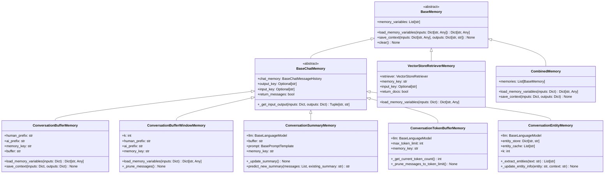

# LangChain-09-Memory-数据结构

## 文档说明

本文档详细描述 **Memory 模块**的核心数据结构，包括记忆类层次、消息存储、缓冲区管理、实体提取、向量检索等。所有结构均配备 UML 类图和详细的字段说明。

---

## 1. Memory 类层次结构

### 1.1 核心记忆继承体系



**图解说明**：

1. **抽象基类**：
   - `BaseMemory`：所有记忆系统的根基类
   - `BaseChatMemory`：基于聊天消息的记忆基类

2. **缓冲区记忆**：
   - `ConversationBufferMemory`：完整对话历史
   - `ConversationBufferWindowMemory`：固定窗口大小
   - `ConversationTokenBufferMemory`：基于令牌限制

3. **智能记忆**：
   - `ConversationSummaryMemory`：基于摘要的压缩记忆
   - `ConversationEntityMemory`：实体提取和追踪
   - `VectorStoreRetrieverMemory`：向量检索记忆

4. **组合记忆**：
   - `CombinedMemory`：多种记忆类型的组合

---

## 2. 消息存储数据结构

### 2.1 ChatMessageHistory 结构

```python
class BaseChatMessageHistory(ABC):
    """聊天消息历史基类。"""

    messages: List[BaseMessage]  # 消息列表

    @abstractmethod
    def add_user_message(self, message: str) -> None:
        """添加用户消息。"""

    @abstractmethod
    def add_ai_message(self, message: str) -> None:
        """添加AI消息。"""

    def add_message(self, message: BaseMessage) -> None:
        """添加任意类型消息。"""
        self.messages.append(message)

    def clear(self) -> None:
        """清空消息历史。"""
        self.messages = []

class ChatMessageHistory(BaseChatMessageHistory):
    """内存中的聊天消息历史。"""

    def __init__(self, messages: Optional[List[BaseMessage]] = None):
        self.messages = messages or []

    def add_user_message(self, message: str) -> None:
        """添加用户消息。"""
        self.messages.append(HumanMessage(content=message))

    def add_ai_message(self, message: str) -> None:
        """添加AI消息。"""
        self.messages.append(AIMessage(content=message))
```

**消息类型结构**：

```python
class BaseMessage:
    """消息基类。"""
    content: str                    # 消息内容
    additional_kwargs: dict         # 额外参数
    response_metadata: dict         # 响应元数据

class HumanMessage(BaseMessage):
    """人类消息。"""
    type: str = "human"

class AIMessage(BaseMessage):
    """AI消息。"""
    type: str = "ai"

class SystemMessage(BaseMessage):
    """系统消息。"""
    type: str = "system"

class FunctionMessage(BaseMessage):
    """函数消息。"""
    type: str = "function"
    name: str                       # 函数名称

class ToolMessage(BaseMessage):
    """工具消息。"""
    type: str = "tool"
    tool_call_id: str              # 工具调用ID
```

---

### 2.2 持久化消息历史

```python
class FileChatMessageHistory(BaseChatMessageHistory):
    """基于文件的消息历史。"""

    def __init__(self, file_path: str):
        self.file_path = file_path
        self._messages: List[BaseMessage] = []
        self._load_messages()

    def _load_messages(self) -> None:
        """从文件加载消息。"""
        if os.path.exists(self.file_path):
            with open(self.file_path, 'r', encoding='utf-8') as f:
                data = json.load(f)
                self._messages = [self._deserialize_message(msg) for msg in data]

    def _save_messages(self) -> None:
        """保存消息到文件。"""
        with open(self.file_path, 'w', encoding='utf-8') as f:
            data = [self._serialize_message(msg) for msg in self._messages]
            json.dump(data, f, ensure_ascii=False, indent=2)

    def add_message(self, message: BaseMessage) -> None:
        """添加消息并持久化。"""
        self._messages.append(message)
        self._save_messages()

    @property
    def messages(self) -> List[BaseMessage]:
        """获取消息列表。"""
        return self._messages

    def clear(self) -> None:
        """清空消息并删除文件。"""
        self._messages = []
        if os.path.exists(self.file_path):
            os.remove(self.file_path)

class RedisChatMessageHistory(BaseChatMessageHistory):
    """基于Redis的消息历史。"""

    def __init__(self, session_id: str, url: str = "redis://localhost:6379"):
        import redis
        self.redis_client = redis.from_url(url)
        self.session_id = session_id
        self.key = f"chat_history:{session_id}"

    @property
    def messages(self) -> List[BaseMessage]:
        """从Redis获取消息。"""
        messages_data = self.redis_client.lrange(self.key, 0, -1)
        return [json.loads(msg.decode()) for msg in messages_data]

    def add_message(self, message: BaseMessage) -> None:
        """添加消息到Redis。"""
        message_data = json.dumps(self._serialize_message(message))
        self.redis_client.rpush(self.key, message_data)

        # 设置过期时间（可选）
        self.redis_client.expire(self.key, 86400)  # 24小时

    def clear(self) -> None:
        """清空Redis中的消息。"""
        self.redis_client.delete(self.key)
```

---

## 3. 缓冲区管理数据结构

### 3.1 ConversationBufferMemory 结构

```python
class ConversationBufferMemory(BaseChatMemory):
    """对话缓冲区记忆数据结构。"""

    def __init__(
        self,
        chat_memory: Optional[BaseChatMessageHistory] = None,
        output_key: Optional[str] = None,
        input_key: Optional[str] = None,
        return_messages: bool = False,
        human_prefix: str = "Human",
        ai_prefix: str = "AI",
        memory_key: str = "history"
    ):
        # 核心字段
        self.chat_memory = chat_memory or ChatMessageHistory()
        self.output_key = output_key
        self.input_key = input_key
        self.return_messages = return_messages
        self.human_prefix = human_prefix
        self.ai_prefix = ai_prefix
        self.memory_key = memory_key

        # 统计信息
        self._message_count = 0
        self._total_tokens = 0
        self._created_at = time.time()
        self._last_accessed = None

    @property
    def buffer(self) -> str:
        """获取格式化的缓冲区内容。"""
        return get_buffer_string(
            self.chat_memory.messages,
            human_prefix=self.human_prefix,
            ai_prefix=self.ai_prefix
        )

    @property
    def memory_variables(self) -> List[str]:
        """返回记忆变量列表。"""
        return [self.memory_key]

    def get_memory_stats(self) -> Dict[str, Any]:
        """获取记忆统计信息。"""
        return {
            "message_count": len(self.chat_memory.messages),
            "buffer_size_chars": len(self.buffer),
            "created_at": self._created_at,
            "last_accessed": self._last_accessed,
            "memory_type": "ConversationBufferMemory"
        }
```

**缓冲区格式化函数**：

```python
def get_buffer_string(
    messages: List[BaseMessage],
    human_prefix: str = "Human",
    ai_prefix: str = "AI"
) -> str:
    """将消息列表格式化为字符串。"""
    string_messages = []

    for message in messages:
        if isinstance(message, HumanMessage):
            role = human_prefix
        elif isinstance(message, AIMessage):
            role = ai_prefix
        elif isinstance(message, SystemMessage):
            role = "System"
        else:
            role = message.__class__.__name__

        string_messages.append(f"{role}: {message.content}")

    return "\n".join(string_messages)
```

---

### 3.2 ConversationBufferWindowMemory 结构

```python
class ConversationBufferWindowMemory(BaseChatMemory):
    """窗口缓冲区记忆数据结构。"""

    def __init__(
        self,
        k: int = 5,
        **kwargs
    ):
        super().__init__(**kwargs)
        self.k = k  # 窗口大小（轮次数）

        # 窗口管理
        self._window_stats = {
            "max_window_size": k,
            "current_window_size": 0,
            "total_messages_processed": 0,
            "messages_pruned": 0
        }

    def save_context(self, inputs: Dict[str, Any], outputs: Dict[str, str]) -> None:
        """保存上下文并维护窗口。"""
        # 添加新消息
        super().save_context(inputs, outputs)
        self._window_stats["total_messages_processed"] += 2

        # 维护窗口大小
        self._prune_messages()

    def _prune_messages(self) -> None:
        """修剪消息以维护窗口大小。"""
        messages = self.chat_memory.messages
        max_messages = 2 * self.k  # k轮对话 = 2k条消息

        if len(messages) > max_messages:
            # 计算需要删除的消息数
            messages_to_remove = len(messages) - max_messages

            # 删除最旧的消息
            self.chat_memory.messages = messages[messages_to_remove:]

            # 更新统计
            self._window_stats["messages_pruned"] += messages_to_remove

        self._window_stats["current_window_size"] = len(self.chat_memory.messages) // 2

    def get_window_info(self) -> Dict[str, Any]:
        """获取窗口信息。"""
        return {
            **self._window_stats,
            "window_utilization": self._window_stats["current_window_size"] / self.k,
            "pruning_efficiency": (
                self._window_stats["messages_pruned"] /
                self._window_stats["total_messages_processed"]
                if self._window_stats["total_messages_processed"] > 0 else 0
            )
        }
```

---

## 4. 智能记忆数据结构

### 4.1 ConversationSummaryMemory 结构

```python
class ConversationSummaryMemory(BaseChatMemory):
    """对话摘要记忆数据结构。"""

    def __init__(
        self,
        llm: BaseLanguageModel,
        buffer: str = "",
        prompt: BasePromptTemplate = SUMMARY_PROMPT,
        summary_message_cls: Type[BaseMessage] = SystemMessage,
        **kwargs
    ):
        super().__init__(**kwargs)
        self.llm = llm
        self.buffer = buffer  # 当前摘要内容
        self.prompt = prompt
        self.summary_message_cls = summary_message_cls

        # 摘要统计
        self._summary_stats = {
            "summary_count": 0,
            "total_summary_tokens": 0,
            "original_message_count": 0,
            "compression_ratio": 0.0,
            "last_summary_time": None
        }

    def save_context(self, inputs: Dict[str, Any], outputs: Dict[str, str]) -> None:
        """保存上下文并更新摘要。"""
        # 添加到临时消息存储
        super().save_context(inputs, outputs)

        # 检查是否需要生成摘要
        if len(self.chat_memory.messages) >= 2:
            self._update_summary()

    def _update_summary(self) -> None:
        """更新对话摘要。"""
        messages = self.chat_memory.messages
        new_lines = get_buffer_string(messages)

        # 构建摘要提示
        if self.buffer:
            # 增量摘要更新
            prompt_input = {
                "summary": self.buffer,
                "new_lines": new_lines
            }
        else:
            # 首次生成摘要
            prompt_input = {"new_lines": new_lines}

        # 生成新摘要
        start_time = time.time()
        new_summary = self.llm.predict(self.prompt.format(**prompt_input))
        summary_time = time.time() - start_time

        # 更新摘要和统计
        original_tokens = self.llm.get_num_tokens(new_lines)
        summary_tokens = self.llm.get_num_tokens(new_summary)

        self.buffer = new_summary
        self._summary_stats.update({
            "summary_count": self._summary_stats["summary_count"] + 1,
            "total_summary_tokens": summary_tokens,
            "original_message_count": len(messages),
            "compression_ratio": summary_tokens / original_tokens if original_tokens > 0 else 0,
            "last_summary_time": summary_time
        })

        # 清空临时消息（已摘要化）
        self.chat_memory.clear()

    def get_summary_stats(self) -> Dict[str, Any]:
        """获取摘要统计信息。"""
        return {
            **self._summary_stats,
            "current_summary_length": len(self.buffer),
            "average_compression_ratio": self._summary_stats["compression_ratio"]
        }

# 默认摘要提示模板
SUMMARY_PROMPT = PromptTemplate(
    input_variables=["summary", "new_lines"],
    template="""
渐进式总结以下对话内容，在之前摘要的基础上添加新信息：

现有摘要：
{summary}

新的对话内容：
{new_lines}

新的摘要：
""".strip()
)
```

---

### 4.2 ConversationEntityMemory 结构

```python
class ConversationEntityMemory(BaseChatMemory):
    """对话实体记忆数据结构。"""

    def __init__(
        self,
        llm: BaseLanguageModel,
        entity_extraction_prompt: BasePromptTemplate = ENTITY_EXTRACTION_PROMPT,
        entity_summarization_prompt: BasePromptTemplate = ENTITY_SUMMARIZATION_PROMPT,
        entity_cache: Optional[List[str]] = None,
        k: int = 3,
        **kwargs
    ):
        super().__init__(**kwargs)
        self.llm = llm
        self.entity_extraction_prompt = entity_extraction_prompt
        self.entity_summarization_prompt = entity_summarization_prompt
        self.entity_cache = entity_cache or []
        self.k = k

        # 实体存储和统计
        self.entity_store: Dict[str, EntityInfo] = {}
        self._entity_stats = {
            "total_entities": 0,
            "active_entities": 0,
            "entity_updates": 0,
            "extraction_calls": 0
        }

    def save_context(self, inputs: Dict[str, Any], outputs: Dict[str, str]) -> None:
        """保存上下文并提取实体。"""
        super().save_context(inputs, outputs)

        # 提取和更新实体
        input_str = inputs[self.input_key or list(inputs.keys())[0]]
        output_str = outputs[self.output_key or list(outputs.keys())[0]]

        context_text = f"{input_str}\n{output_str}"
        self._extract_and_update_entities(context_text)

    def _extract_and_update_entities(self, text: str) -> None:
        """提取并更新实体信息。"""
        # 提取实体
        entities = self._extract_entities(text)
        self._entity_stats["extraction_calls"] += 1

        # 更新每个实体的信息
        for entity in entities:
            self._update_entity_info(entity, text)

    def _extract_entities(self, text: str) -> List[str]:
        """从文本中提取实体。"""
        prompt = self.entity_extraction_prompt.format(text=text)
        result = self.llm.predict(prompt)

        # 解析实体列表
        entities = [e.strip() for e in result.split(',') if e.strip()]
        return entities

    def _update_entity_info(self, entity: str, context: str) -> None:
        """更新实体信息。"""
        if entity in self.entity_store:
            # 更新现有实体
            entity_info = self.entity_store[entity]
            entity_info.update_info(context, self.llm, self.entity_summarization_prompt)
            self._entity_stats["entity_updates"] += 1
        else:
            # 创建新实体
            entity_info = EntityInfo(entity)
            entity_info.initialize_info(context, self.llm)
            self.entity_store[entity] = entity_info
            self._entity_stats["total_entities"] += 1

        # 更新实体缓存
        if entity not in self.entity_cache:
            self.entity_cache.append(entity)

        self._entity_stats["active_entities"] = len(self.entity_store)

class EntityInfo:
    """实体信息数据结构。"""

    def __init__(self, name: str):
        self.name = name
        self.info = ""
        self.contexts: List[str] = []
        self.created_at = time.time()
        self.last_updated = time.time()
        self.update_count = 0

    def initialize_info(self, context: str, llm: BaseLanguageModel) -> None:
        """初始化实体信息。"""
        prompt = f"根据以下上下文，总结关于{self.name}的信息：\n{context}"
        self.info = llm.predict(prompt)
        self.contexts.append(context)
        self.update_count += 1

    def update_info(
        self,
        new_context: str,
        llm: BaseLanguageModel,
        summarization_prompt: BasePromptTemplate
    ) -> None:
        """更新实体信息。"""
        prompt = summarization_prompt.format(
            entity=self.name,
            existing_info=self.info,
            new_context=new_context
        )

        self.info = llm.predict(prompt)
        self.contexts.append(new_context)
        self.last_updated = time.time()
        self.update_count += 1

    def to_dict(self) -> Dict[str, Any]:
        """转换为字典格式。"""
        return {
            "name": self.name,
            "info": self.info,
            "context_count": len(self.contexts),
            "created_at": self.created_at,
            "last_updated": self.last_updated,
            "update_count": self.update_count
        }
```

---

## 5. 向量检索记忆结构

### 5.1 VectorStoreRetrieverMemory 结构

```python
class VectorStoreRetrieverMemory(BaseMemory):
    """向量存储检索记忆数据结构。"""

    def __init__(
        self,
        retriever: VectorStoreRetriever,
        memory_key: str = "history",
        input_key: Optional[str] = None,
        return_docs: bool = False,
        exclude_input_keys: Optional[List[str]] = None
    ):
        self.retriever = retriever
        self.memory_key = memory_key
        self.input_key = input_key
        self.return_docs = return_docs
        self.exclude_input_keys = exclude_input_keys or []

        # 检索统计
        self._retrieval_stats = {
            "total_contexts_saved": 0,
            "total_retrievals": 0,
            "average_retrieval_time": 0.0,
            "total_documents_stored": 0,
            "cache_hits": 0
        }

        # 简单的查询缓存
        self._query_cache: Dict[str, List[Document]] = {}
        self._cache_max_size = 100

    def save_context(self, inputs: Dict[str, Any], outputs: Dict[str, str]) -> None:
        """保存对话到向量存储。"""
        # 构建文档内容
        input_str = inputs[self.input_key or list(inputs.keys())[0]]
        output_str = outputs[list(outputs.keys())[0]]

        document_content = f"Human: {input_str}\nAI: {output_str}"

        # 创建文档元数据
        metadata = {
            "input": input_str,
            "output": output_str,
            "timestamp": time.time(),
            "conversation_id": self._generate_conversation_id(inputs)
        }

        # 添加到向量存储
        self.retriever.vectorstore.add_texts(
            texts=[document_content],
            metadatas=[metadata]
        )

        # 更新统计
        self._retrieval_stats["total_contexts_saved"] += 1
        self._retrieval_stats["total_documents_stored"] += 1

        # 清空缓存（新文档可能影响检索结果）
        self._query_cache.clear()

    def load_memory_variables(self, inputs: Dict[str, Any]) -> Dict[str, Any]:
        """基于输入检索相关记忆。"""
        query = inputs[self.input_key or list(inputs.keys())[0]]

        # 检查缓存
        if query in self._query_cache:
            docs = self._query_cache[query]
            self._retrieval_stats["cache_hits"] += 1
        else:
            # 执行检索
            start_time = time.time()
            docs = self.retriever.get_relevant_documents(query)
            retrieval_time = time.time() - start_time

            # 更新统计
            self._retrieval_stats["total_retrievals"] += 1
            total_time = (
                self._retrieval_stats["average_retrieval_time"] *
                (self._retrieval_stats["total_retrievals"] - 1) +
                retrieval_time
            )
            self._retrieval_stats["average_retrieval_time"] = (
                total_time / self._retrieval_stats["total_retrievals"]
            )

            # 缓存结果
            if len(self._query_cache) < self._cache_max_size:
                self._query_cache[query] = docs

        # 格式化返回结果
        if self.return_docs:
            return {self.memory_key: docs}
        else:
            memory_content = self._format_documents(docs)
            return {self.memory_key: memory_content}

    def _format_documents(self, docs: List[Document]) -> str:
        """格式化文档为字符串。"""
        if not docs:
            return ""

        formatted_docs = []
        for doc in docs:
            # 提取原始对话内容
            content = doc.page_content
            metadata = doc.metadata

            # 添加时间戳信息
            if "timestamp" in metadata:
                timestamp = datetime.fromtimestamp(metadata["timestamp"])
                time_str = timestamp.strftime("%Y-%m-%d %H:%M")
                formatted_docs.append(f"[{time_str}] {content}")
            else:
                formatted_docs.append(content)

        return "\n\n".join(formatted_docs)

    def _generate_conversation_id(self, inputs: Dict[str, Any]) -> str:
        """生成对话ID。"""
        # 简单的会话ID生成策略
        return hashlib.md5(str(inputs).encode()).hexdigest()[:8]

    @property
    def memory_variables(self) -> List[str]:
        """返回记忆变量列表。"""
        return [self.memory_key]

    def clear(self) -> None:
        """清除向量存储中的记忆。"""
        # 注意：这可能会影响其他使用同一向量存储的组件
        if hasattr(self.retriever.vectorstore, 'delete_collection'):
            self.retriever.vectorstore.delete_collection()

        # 清空缓存和统计
        self._query_cache.clear()
        self._retrieval_stats = {
            "total_contexts_saved": 0,
            "total_retrievals": 0,
            "average_retrieval_time": 0.0,
            "total_documents_stored": 0,
            "cache_hits": 0
        }

    def get_retrieval_stats(self) -> Dict[str, Any]:
        """获取检索统计信息。"""
        cache_hit_rate = (
            self._retrieval_stats["cache_hits"] /
            max(self._retrieval_stats["total_retrievals"], 1)
        )

        return {
            **self._retrieval_stats,
            "cache_hit_rate": cache_hit_rate,
            "cache_size": len(self._query_cache),
            "memory_type": "VectorStoreRetrieverMemory"
        }
```

---

## 6. 组合记忆数据结构

### 6.1 CombinedMemory 结构

```python
class CombinedMemory(BaseMemory):
    """组合记忆数据结构。"""

    def __init__(self, memories: List[BaseMemory]):
        self.memories = memories
        self._validate_memories()

        # 组合统计
        self._combined_stats = {
            "memory_count": len(memories),
            "memory_types": [type(mem).__name__ for mem in memories],
            "total_operations": 0,
            "load_times": [],
            "save_times": []
        }

    def _validate_memories(self) -> None:
        """验证记忆组合的有效性。"""
        if not self.memories:
            raise ValueError("至少需要一个记忆组件")

        # 检查记忆变量名冲突
        all_variables = []
        for memory in self.memories:
            variables = memory.memory_variables
            for var in variables:
                if var in all_variables:
                    raise ValueError(f"记忆变量名冲突: {var}")
                all_variables.append(var)

    @property
    def memory_variables(self) -> List[str]:
        """返回所有记忆的变量列表。"""
        variables = []
        for memory in self.memories:
            variables.extend(memory.memory_variables)
        return variables

    def load_memory_variables(self, inputs: Dict[str, Any]) -> Dict[str, Any]:
        """加载所有记忆的变量。"""
        start_time = time.time()
        memory_data = {}

        for memory in self.memories:
            try:
                memory_vars = memory.load_memory_variables(inputs)
                memory_data.update(memory_vars)
            except Exception as e:
                # 记录错误但继续处理其他记忆
                print(f"记忆 {type(memory).__name__} 加载失败: {e}")

        # 更新统计
        load_time = time.time() - start_time
        self._combined_stats["load_times"].append(load_time)
        self._combined_stats["total_operations"] += 1

        return memory_data

    def save_context(self, inputs: Dict[str, Any], outputs: Dict[str, str]) -> None:
        """保存上下文到所有记忆。"""
        start_time = time.time()

        for memory in self.memories:
            try:
                memory.save_context(inputs, outputs)
            except Exception as e:
                # 记录错误但继续处理其他记忆
                print(f"记忆 {type(memory).__name__} 保存失败: {e}")

        # 更新统计
        save_time = time.time() - start_time
        self._combined_stats["save_times"].append(save_time)
        self._combined_stats["total_operations"] += 1

    def clear(self) -> None:
        """清除所有记忆。"""
        for memory in self.memories:
            try:
                memory.clear()
            except Exception as e:
                print(f"记忆 {type(memory).__name__} 清除失败: {e}")

    def get_memory_by_type(self, memory_type: Type[BaseMemory]) -> Optional[BaseMemory]:
        """根据类型获取记忆组件。"""
        for memory in self.memories:
            if isinstance(memory, memory_type):
                return memory
        return None

    def get_combined_stats(self) -> Dict[str, Any]:
        """获取组合记忆统计。"""
        avg_load_time = (
            sum(self._combined_stats["load_times"]) /
            len(self._combined_stats["load_times"])
            if self._combined_stats["load_times"] else 0
        )

        avg_save_time = (
            sum(self._combined_stats["save_times"]) /
            len(self._combined_stats["save_times"])
            if self._combined_stats["save_times"] else 0
        )

        return {
            **self._combined_stats,
            "average_load_time": avg_load_time,
            "average_save_time": avg_save_time,
            "memory_variables": self.memory_variables
        }
```

---

## 7. 性能监控数据结构

### 7.1 MemoryMetrics 结构

```python
class MemoryMetrics:
    """记忆性能指标收集器。"""

    def __init__(self, memory: BaseMemory):
        self.memory = memory
        self.memory_type = type(memory).__name__

        # 性能指标
        self.metrics = {
            "load_count": 0,
            "save_count": 0,
            "clear_count": 0,
            "total_load_time": 0.0,
            "total_save_time": 0.0,
            "load_times": deque(maxlen=100),  # 最近100次操作
            "save_times": deque(maxlen=100),
            "memory_sizes": deque(maxlen=100),
            "error_count": 0,
            "last_error": None
        }

        # 内存使用监控
        self.memory_usage = {
            "peak_memory_mb": 0.0,
            "current_memory_mb": 0.0,
            "memory_growth_rate": 0.0
        }

    def record_load_operation(self, execution_time: float, memory_size: int) -> None:
        """记录加载操作。"""
        self.metrics["load_count"] += 1
        self.metrics["total_load_time"] += execution_time
        self.metrics["load_times"].append(execution_time)
        self.metrics["memory_sizes"].append(memory_size)

        self._update_memory_usage(memory_size)

    def record_save_operation(self, execution_time: float) -> None:
        """记录保存操作。"""
        self.metrics["save_count"] += 1
        self.metrics["total_save_time"] += execution_time
        self.metrics["save_times"].append(execution_time)

    def record_error(self, error: Exception) -> None:
        """记录错误。"""
        self.metrics["error_count"] += 1
        self.metrics["last_error"] = {
            "type": type(error).__name__,
            "message": str(error),
            "timestamp": time.time()
        }

    def _update_memory_usage(self, current_size: int) -> None:
        """更新内存使用情况。"""
        size_mb = current_size / (1024 * 1024)
        self.memory_usage["current_memory_mb"] = size_mb

        if size_mb > self.memory_usage["peak_memory_mb"]:
            self.memory_usage["peak_memory_mb"] = size_mb

        # 计算内存增长率
        if len(self.metrics["memory_sizes"]) >= 2:
            recent_sizes = list(self.metrics["memory_sizes"])[-10:]
            if len(recent_sizes) >= 2:
                growth_rate = (recent_sizes[-1] - recent_sizes[0]) / len(recent_sizes)
                self.memory_usage["memory_growth_rate"] = growth_rate

    def get_performance_summary(self) -> Dict[str, Any]:
        """获取性能摘要。"""
        load_times = list(self.metrics["load_times"])
        save_times = list(self.metrics["save_times"])

        return {
            "memory_type": self.memory_type,
            "operation_counts": {
                "loads": self.metrics["load_count"],
                "saves": self.metrics["save_count"],
                "errors": self.metrics["error_count"]
            },
            "timing_stats": {
                "avg_load_time": (
                    sum(load_times) / len(load_times) if load_times else 0
                ),
                "avg_save_time": (
                    sum(save_times) / len(save_times) if save_times else 0
                ),
                "p95_load_time": (
                    sorted(load_times)[int(0.95 * len(load_times))]
                    if len(load_times) >= 20 else 0
                ),
                "p95_save_time": (
                    sorted(save_times)[int(0.95 * len(save_times))]
                    if len(save_times) >= 20 else 0
                )
            },
            "memory_usage": self.memory_usage,
            "error_rate": (
                self.metrics["error_count"] /
                max(self.metrics["load_count"] + self.metrics["save_count"], 1)
            )
        }
```

---

## 8. 总结

本文档详细描述了 **Memory 模块**的核心数据结构：

1. **类层次结构**：从BaseMemory到各种具体实现的完整继承关系
2. **消息存储**：ChatMessageHistory和各种持久化实现
3. **缓冲区管理**：不同缓冲策略的数据结构和算法
4. **智能记忆**：摘要记忆和实体记忆的复杂数据结构
5. **向量检索**：基于向量存储的语义记忆结构
6. **组合记忆**：多种记忆类型的组合和管理
7. **性能监控**：记忆系统的指标收集和分析

所有数据结构均包含：
- 完整的字段定义和类型说明
- 详细的统计信息和监控机制
- 性能优化策略和缓存机制
- 错误处理和恢复能力
- 可扩展的架构设计

这些结构为构建高效、可靠的对话记忆系统提供了完整的数据模型基础，支持从简单缓冲到复杂语义检索的各种记忆需求。
