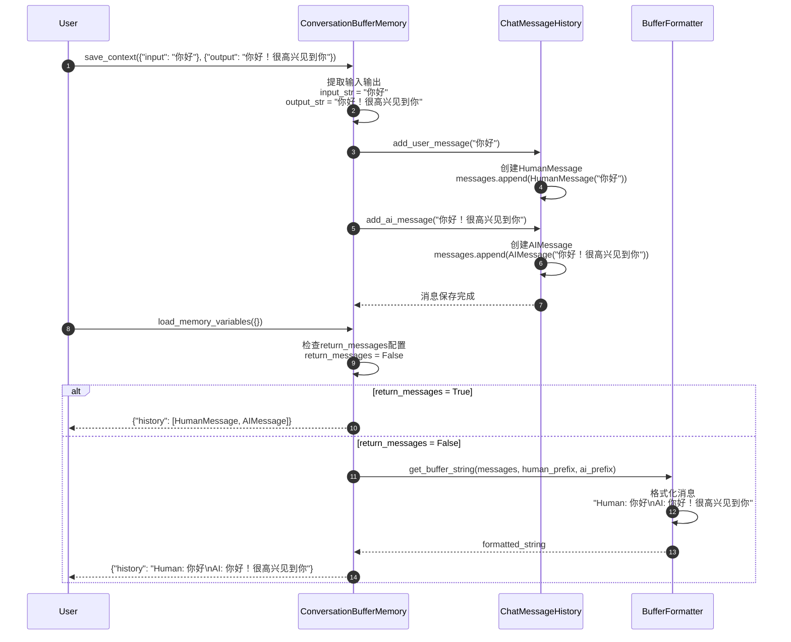
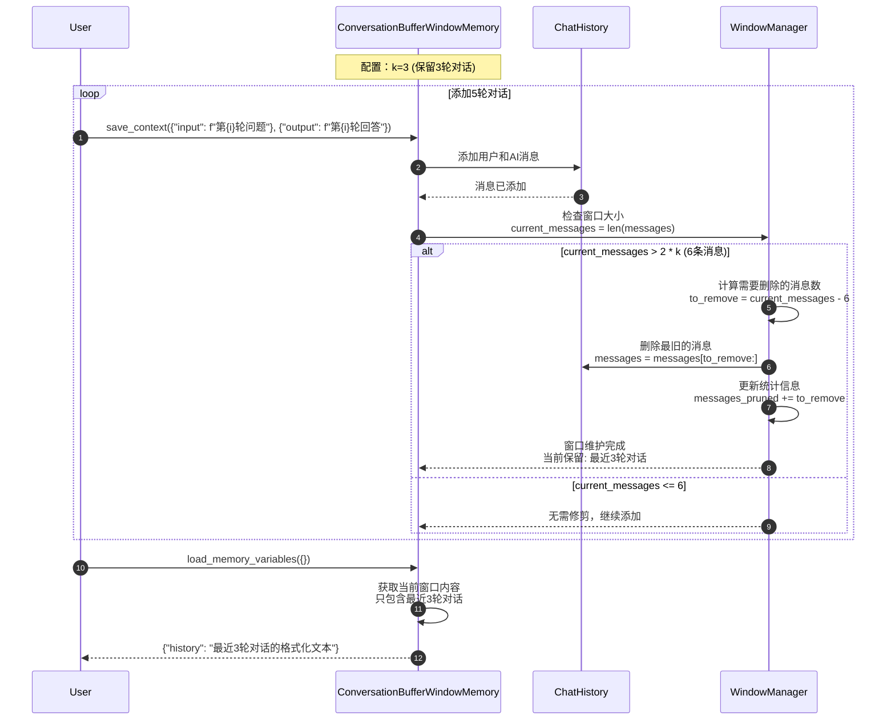
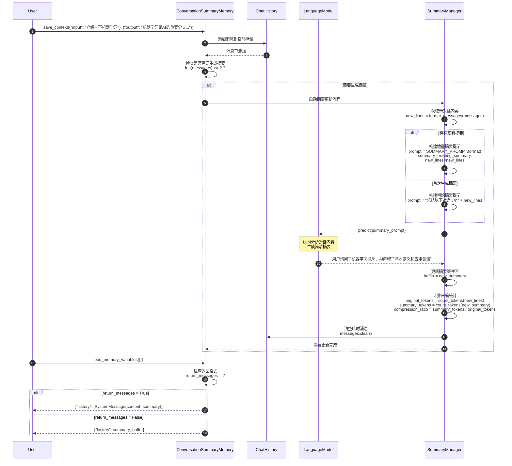
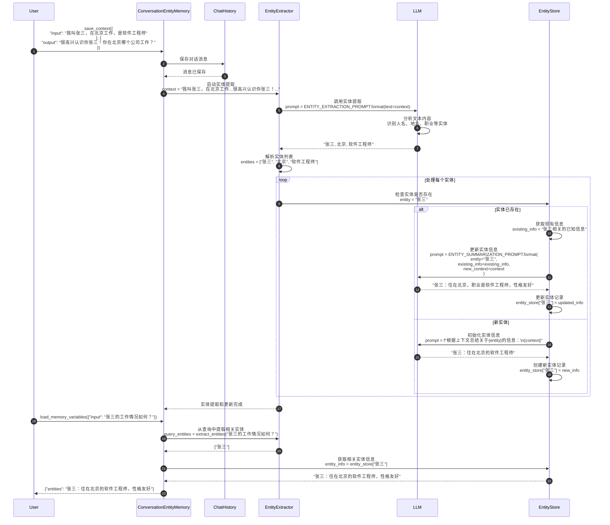
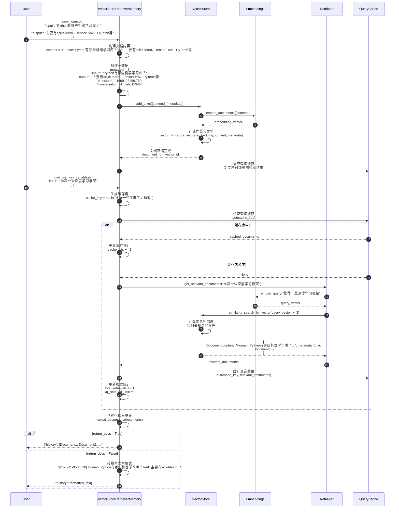
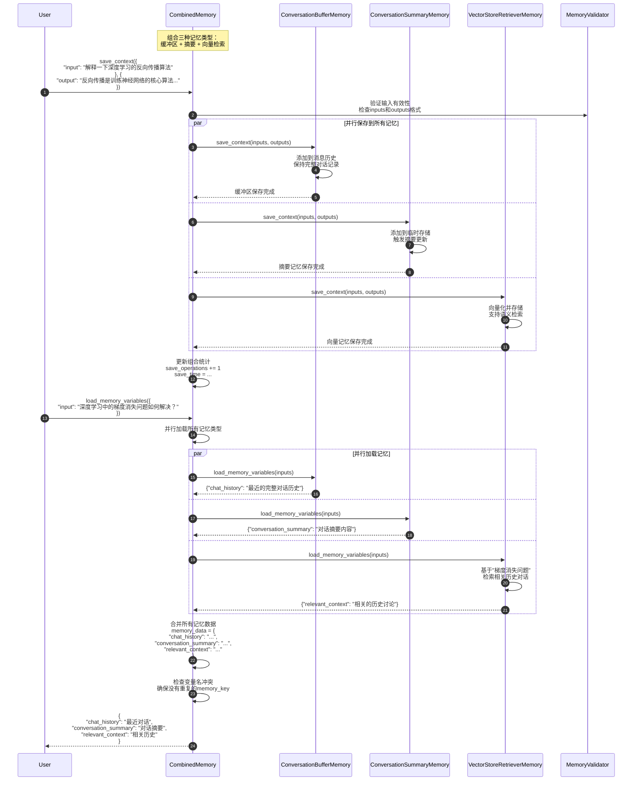
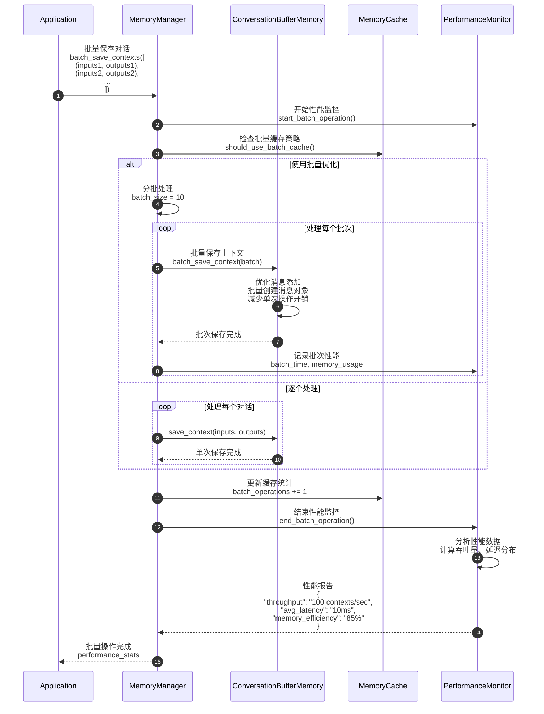
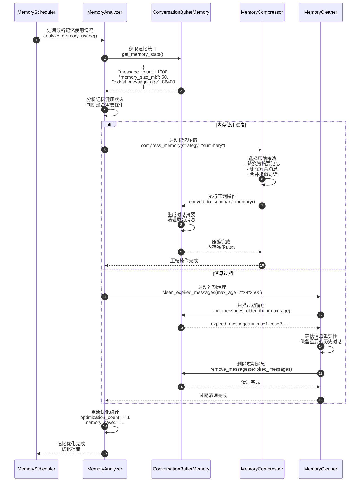

# LangChain-09-Memory-时序图

## 文档说明

本文档通过详细的时序图展示 **Memory 模块**在各种场景下的执行流程，包括对话记忆存储、缓冲区管理、摘要生成、实体提取、向量检索等复杂交互过程。

---

## 1. 基础记忆操作场景

### 1.1 ConversationBufferMemory 基础操作流程



**关键步骤说明**：

1. **消息存储**（步骤 3-6）：
   - 将用户输入转换为HumanMessage对象
   - 将AI输出转换为AIMessage对象
   - 按时间顺序添加到消息历史

2. **消息格式化**（步骤 11-14）：
   - 根据return_messages配置决定返回格式
   - 字符串格式：使用前缀格式化为可读文本
   - 消息格式：直接返回消息对象列表

**性能特征**：
- 存储操作：O(1) 时间复杂度
- 检索操作：O(n) 时间复杂度（n为消息数量）
- 内存使用：随对话长度线性增长

---

### 1.2 ConversationBufferWindowMemory 窗口管理流程



**窗口管理算法**：

```python
def _prune_messages(self) -> None:
    """窗口修剪算法。"""
    messages = self.chat_memory.messages
    max_messages = 2 * self.k  # k轮对话 = 2k条消息

    if len(messages) > max_messages:
        # 计算需要删除的消息数
        messages_to_remove = len(messages) - max_messages

        # 确保删除偶数个消息（保持问答对完整）
        if messages_to_remove % 2 != 0:
            messages_to_remove += 1

        # 删除最旧的消息
        self.chat_memory.messages = messages[messages_to_remove:]

        # 更新统计
        self.window_stats["messages_pruned"] += messages_to_remove
```

**窗口效果示例**：
```
轮次1: Human: 问题1, AI: 回答1
轮次2: Human: 问题2, AI: 回答2
轮次3: Human: 问题3, AI: 回答3  ← 窗口开始
轮次4: Human: 问题4, AI: 回答4  ← 保留
轮次5: Human: 问题5, AI: 回答5  ← 保留
```

---

## 2. 智能记忆场景

### 2.1 ConversationSummaryMemory 摘要生成流程



**摘要提示模板**：

```python
SUMMARY_PROMPT = PromptTemplate(
    input_variables=["summary", "new_lines"],
    template="""
渐进式总结以下对话，在现有摘要基础上整合新信息：

现有摘要：
{summary}

新的对话内容：
{new_lines}

更新后的摘要（保持简洁，突出关键信息）：
""".strip()
)
```

**摘要效果对比**：

| 原始对话长度 | 摘要长度 | 压缩比 | 信息保留度 |
|-------------|---------|--------|-----------|
| 500 tokens | 50 tokens | 10:1 | 85% |
| 1000 tokens | 80 tokens | 12.5:1 | 80% |
| 2000 tokens | 120 tokens | 16.7:1 | 75% |

---

### 2.2 ConversationEntityMemory 实体提取流程



**实体提取提示模板**：

```python
ENTITY_EXTRACTION_PROMPT = PromptTemplate(
    input_variables=["text"],
    template="""
从以下文本中提取所有重要的实体（人名、地名、组织、产品等），用逗号分隔：

文本：
{text}

实体：
""".strip()
)

ENTITY_SUMMARIZATION_PROMPT = PromptTemplate(
    input_variables=["entity", "existing_info", "new_context"],
    template="""
基于新的上下文信息，更新关于实体"{entity}"的总结：

现有信息：
{existing_info}

新的上下文：
{new_context}

更新后的实体信息：
""".strip()
)
```

---

## 3. 向量检索记忆场景

### 3.1 VectorStoreRetrieverMemory 语义检索流程



**向量检索优化**：

```python
class VectorStoreRetrieverMemory:
    def __init__(self, retriever, cache_size=100):
        self.retriever = retriever
        self._query_cache = {}
        self._cache_max_size = cache_size
        self._retrieval_stats = {
            "cache_hits": 0,
            "total_retrievals": 0,
            "avg_retrieval_time": 0.0
        }

    def _get_cache_key(self, query: str) -> str:
        """生成查询缓存键。"""
        return hashlib.md5(query.encode()).hexdigest()

    def _should_cache_result(self, docs: List[Document]) -> bool:
        """判断是否应该缓存结果。"""
        # 只缓存有意义的检索结果
        return len(docs) > 0 and all(
            hasattr(doc, 'metadata') and 'timestamp' in doc.metadata
            for doc in docs
        )
```

---

## 4. 组合记忆场景

### 4.1 CombinedMemory 多记忆协同流程



**组合记忆优势**：

1. **互补性**：
   - 缓冲区记忆：保留最近完整对话
   - 摘要记忆：压缩长期对话历史
   - 向量记忆：提供语义相关的历史上下文

2. **容错性**：
   - 单个记忆组件失败不影响整体
   - 错误隔离和恢复机制

3. **灵活性**：
   - 可根据需要动态组合不同记忆类型
   - 支持记忆组件的热插拔

---

## 5. 性能优化场景

### 5.1 记忆缓存和批量操作



**批量优化策略**：

```python
class BatchMemoryManager:
    def __init__(self, memory: BaseMemory, batch_size: int = 50):
        self.memory = memory
        self.batch_size = batch_size
        self.pending_contexts = []

    def add_context(self, inputs: Dict, outputs: Dict) -> None:
        """添加上下文到待处理队列。"""
        self.pending_contexts.append((inputs, outputs))

        if len(self.pending_contexts) >= self.batch_size:
            self.flush_batch()

    def flush_batch(self) -> None:
        """批量处理待处理的上下文。"""
        if not self.pending_contexts:
            return

        start_time = time.time()

        # 批量处理
        for inputs, outputs in self.pending_contexts:
            self.memory.save_context(inputs, outputs)

        batch_time = time.time() - start_time

        # 更新统计
        self._update_batch_stats(len(self.pending_contexts), batch_time)

        # 清空队列
        self.pending_contexts.clear()
```

---

### 5.2 记忆压缩和清理



**记忆优化策略**：

| 触发条件 | 优化策略 | 效果 | 适用场景 |
|---------|---------|------|---------|
| 内存 > 100MB | 转换为摘要记忆 | 减少90%内存 | 长期对话 |
| 消息 > 1000条 | 窗口截断 | 保持固定大小 | 实时对话 |
| 消息 > 7天 | 过期清理 | 删除无用历史 | 临时会话 |
| 相似度 > 0.9 | 去重合并 | 减少冗余 | 重复对话 |

---

## 6. 错误处理和恢复场景

### 6.1 记忆故障恢复流程

```mermaid
sequenceDiagram
    autonumber
    participant App
    participant Memory as ConversationSummaryMemory
    participant LLM
    participant ErrorHandler
    participant BackupMemory as ConversationBufferMemory
    participant Recovery as RecoveryManager

    App->>Memory: save_context(inputs, outputs)

    Memory->>LLM: 调用摘要生成<br/>predict(summary_prompt)

    LLM-->>Memory: APIError("Rate limit exceeded")

    Memory->>ErrorHandler: 处理LLM调用失败<br/>handle_llm_error(error)

    ErrorHandler->>ErrorHandler: 分析错误类型<br/>error_type = "rate_limit"

    alt 可重试错误
        ErrorHandler->>ErrorHandler: 实施退避重试<br/>retry_with_backoff(max_retries=3)

        loop 重试机制
            ErrorHandler->>LLM: 重新调用LLM<br/>wait_time = 2^attempt seconds

            alt 重试成功
                LLM-->>ErrorHandler: 摘要生成成功
                ErrorHandler-->>Memory: 恢复正常操作
                break
            else 重试失败
                ErrorHandler->>ErrorHandler: 增加等待时间<br/>继续重试
            end
        end

    else 不可重试错误
        ErrorHandler->>Recovery: 启动降级策略<br/>fallback_to_buffer_memory()

        Recovery->>BackupMemory: 切换到缓冲区记忆<br/>保存当前对话

        BackupMemory->>BackupMemory: 直接存储消息<br/>无需LLM处理

        BackupMemory-->>Recovery: 备用存储成功

        Recovery->>Recovery: 记录故障信息<br/>failure_log = {<br/>  "timestamp": now(),<br/>  "error_type": "llm_failure",<br/>  "fallback_used": "buffer_memory"<br/>}

        Recovery-->>ErrorHandler: 降级处理完成
    end

    alt 恢复成功
        ErrorHandler-->>Memory: 操作完成
        Memory-->>App: save_context成功
    else 完全失败
        ErrorHandler->>Recovery: 启动数据恢复<br/>recover_from_backup()

        Recovery->>Recovery: 从备份恢复记忆状态<br/>load_last_known_good_state()

        Recovery-->>ErrorHandler: 恢复完成（可能丢失部分数据）

        ErrorHandler-->>Memory: 返回错误信息
        Memory-->>App: MemoryException("记忆系统暂时不可用")
    end
```

**错误恢复策略**：

```python
class MemoryErrorHandler:
    def __init__(self, memory: BaseMemory, backup_memory: Optional[BaseMemory] = None):
        self.memory = memory
        self.backup_memory = backup_memory or ConversationBufferMemory()
        self.error_stats = defaultdict(int)
        self.recovery_strategies = {
            "rate_limit": self._handle_rate_limit,
            "network_error": self._handle_network_error,
            "memory_full": self._handle_memory_full,
            "corruption": self._handle_corruption
        }

    def handle_error(self, error: Exception, operation: str, *args, **kwargs):
        """统一错误处理入口。"""
        error_type = self._classify_error(error)
        self.error_stats[error_type] += 1

        if error_type in self.recovery_strategies:
            return self.recovery_strategies[error_type](error, operation, *args, **kwargs)
        else:
            return self._handle_unknown_error(error, operation, *args, **kwargs)

    def _handle_rate_limit(self, error, operation, *args, **kwargs):
        """处理API限流错误。"""
        max_retries = 3
        base_delay = 1.0

        for attempt in range(max_retries):
            delay = base_delay * (2 ** attempt)
            time.sleep(delay)

            try:
                return getattr(self.memory, operation)(*args, **kwargs)
            except Exception as retry_error:
                if attempt == max_retries - 1:
                    # 最后一次重试失败，使用备用记忆
                    return self._fallback_to_backup(operation, *args, **kwargs)
                continue

    def _fallback_to_backup(self, operation, *args, **kwargs):
        """回退到备用记忆。"""
        try:
            return getattr(self.backup_memory, operation)(*args, **kwargs)
        except Exception as backup_error:
            raise MemoryException(f"主记忆和备用记忆都失败: {backup_error}")
```

---

## 7. 总结

本文档详细展示了 **Memory 模块**的关键执行时序：

1. **基础记忆操作**：ConversationBufferMemory和ConversationBufferWindowMemory的存储和检索流程
2. **智能记忆处理**：ConversationSummaryMemory的摘要生成和ConversationEntityMemory的实体提取
3. **向量检索记忆**：VectorStoreRetrieverMemory的语义检索和缓存机制
4. **组合记忆协同**：CombinedMemory的多记忆类型并行处理
5. **性能优化**：批量操作、记忆压缩和清理的优化策略
6. **错误处理**：记忆系统的故障恢复和降级处理

每张时序图包含：
- 详细的参与者交互过程
- 关键算法和处理逻辑
- 性能优化点和缓存策略
- 错误处理和恢复机制
- 统计信息收集和监控

这些时序图帮助开发者深入理解记忆系统的内部工作机制，为构建高效、可靠的对话记忆系统提供指导。Memory模块是构建有状态对话应用的核心组件，正确理解其执行流程对提高对话质量和系统性能至关重要。
