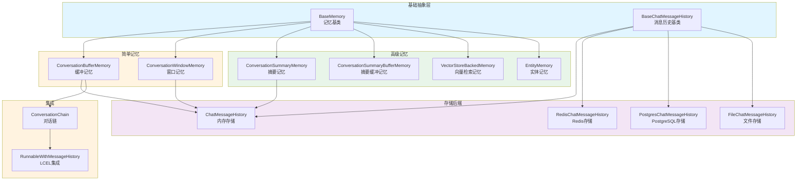
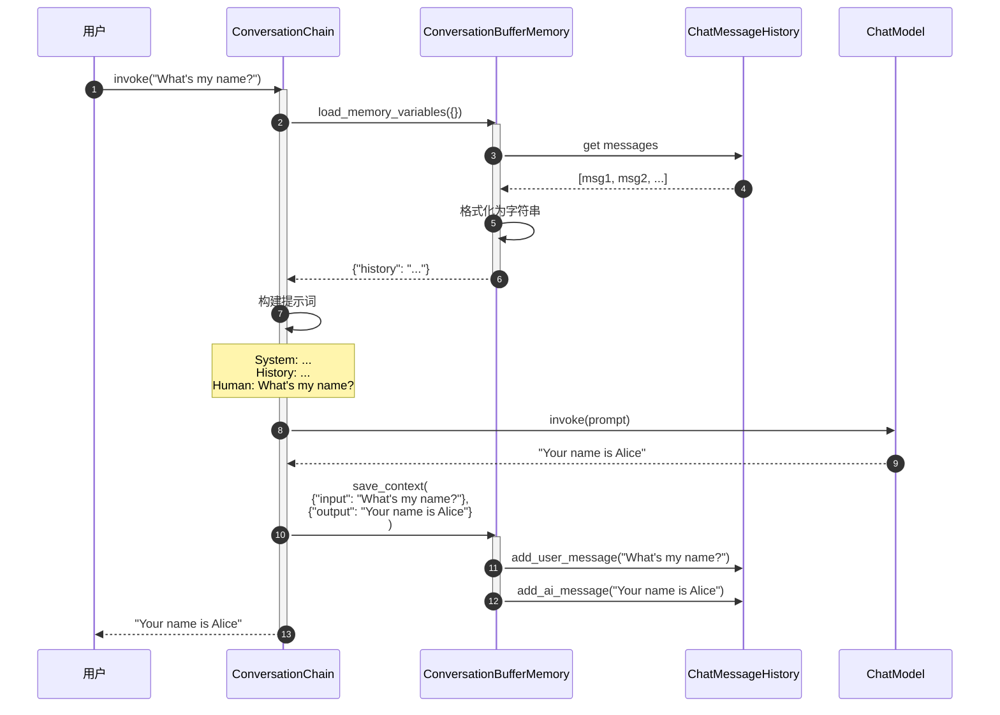
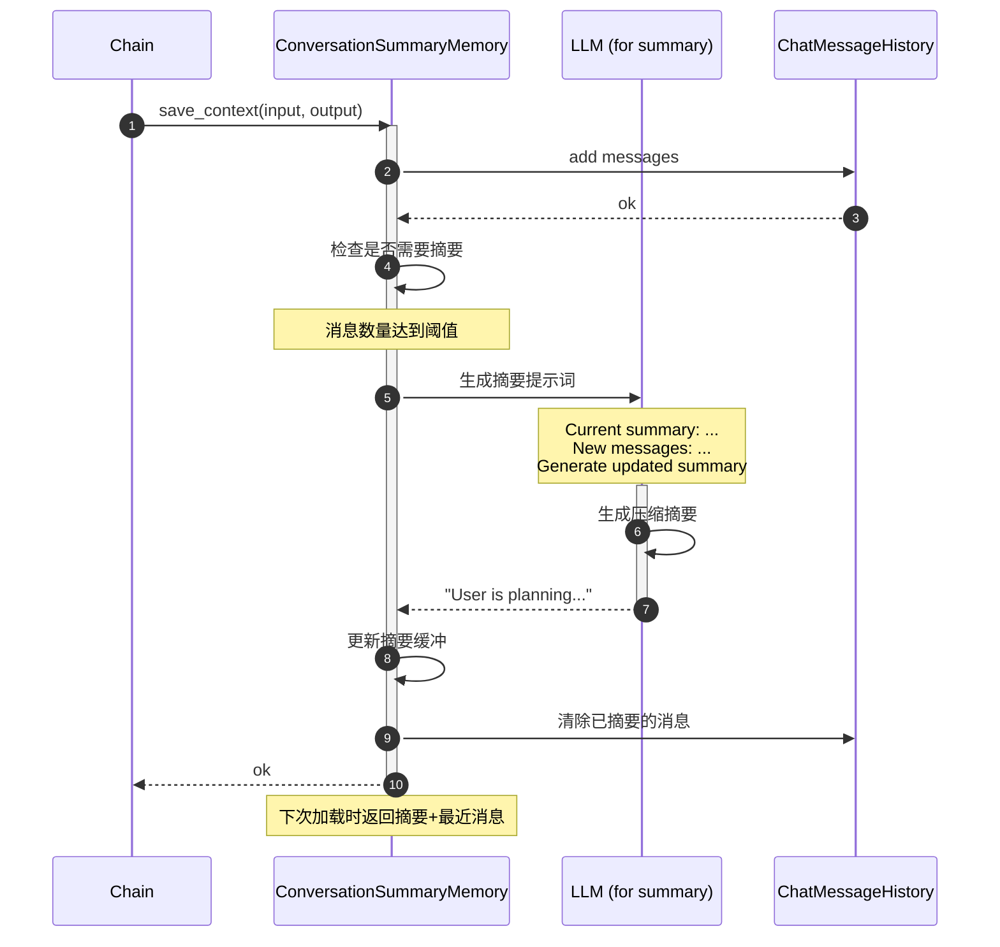
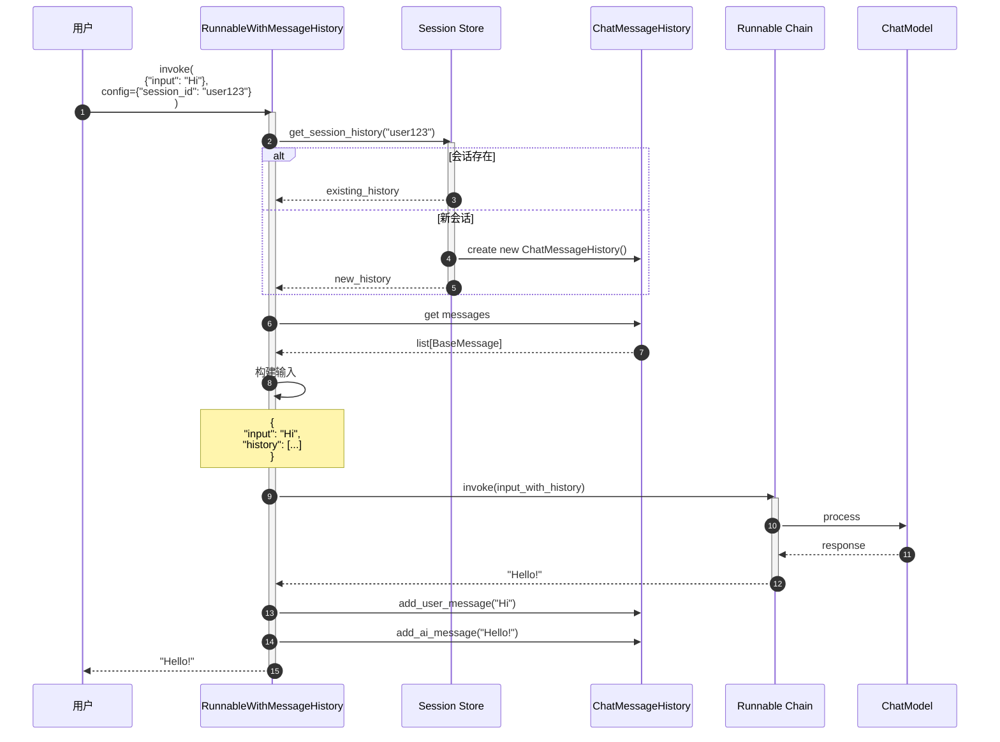

# LangChain-09-Memory-概览

## 模块基本信息

**模块名称**: langchain-memory
**模块路径**: `libs/langchain/langchain/memory/`
**核心职责**: 提供对话记忆管理，让 LLM 应用能够记住历史对话并维护上下文

## 1. 模块职责

### 1.1 核心职责

Memory 模块为 LangChain 应用提供对话记忆能力，主要功能：

1. **对话历史存储**: 保存用户和 AI 的历史消息
2. **上下文管理**: 控制传递给 LLM 的历史信息量
3. **多种记忆策略**: 缓冲、窗口、摘要、向量检索等
4. **实体跟踪**: 记住对话中的关键实体
5. **记忆持久化**: 支持保存和恢复记忆
6. **多会话管理**: 支持多个独立的对话会话

### 1.2 核心概念

```
用户消息
  ↓
Memory (保存历史)
  ↓
加载相关历史
  ↓
构建包含上下文的提示词
  ↓
LLM 生成响应
  ↓
Memory (保存 AI 响应)
```

**关键术语**:
- **Memory**: 记忆抽象，管理对话历史
- **ChatMessageHistory**: 消息存储后端
- **ConversationBufferMemory**: 缓冲所有历史
- **ConversationWindowMemory**: 只保留最近 k 轮
- **ConversationSummaryMemory**: 摘要压缩历史
- **VectorStoreBackedMemory**: 基于向量检索的记忆

### 1.3 记忆类型对比

| 记忆类型 | 适用场景 | 优势 | 劣势 | Token消耗 |
|---------|---------|------|------|----------|
| **ConversationBufferMemory** | 短对话 | 完整上下文 | Token快速增长 | 高 |
| **ConversationWindowMemory** | 一般对话 | Token可控 | 丢失早期信息 | 中 |
| **ConversationSummaryMemory** | 长对话 | 压缩历史 | 摘要可能不准确 | 低 |
| **ConversationSummaryBufferMemory** | 长对话+精确性 | 平衡压缩和细节 | 需要额外摘要调用 | 中 |
| **VectorStoreBackedMemory** | 复杂对话 | 智能检索相关历史 | 需要向量存储 | 低 |
| **EntityMemory** | 实体密集对话 | 跟踪实体信息 | 维护开销大 | 中 |

### 1.4 输入/输出

**输入**:
- **save_context**: `{"input": "user message", "output": "ai response"}`

**输出**:
- **load_memory_variables**: `{"history": "formatted_history"}` 或 `{"history": list[BaseMessage]}`

### 1.5 上下游依赖

**上游调用者**:
- Chains（对话链）
- 聊天应用
- 代理（带记忆的代理）

**下游依赖**:
- `langchain_core.messages`: 消息类型
- `langchain_core.chat_history`: 聊天历史抽象
- 向量存储（VectorStoreBackedMemory）
- LLM（用于摘要）

## 2. 模块级架构图



### 架构图详细说明

**1. 基础抽象层**

- **BaseMemory**: 所有记忆的基类
  ```python
  class BaseMemory(ABC):
      @property
      @abstractmethod
      def memory_variables(self) -> list[str]:
          """记忆提供的变量名列表"""

      @abstractmethod
      def load_memory_variables(self, inputs: dict[str, Any]) -> dict[str, Any]:
          """加载记忆变量"""

      @abstractmethod
      def save_context(self, inputs: dict[str, Any], outputs: dict[str, str]) -> None:
          """保存对话上下文"""

      def clear(self) -> None:
          """清除记忆"""
  ```

- **BaseChatMessageHistory**: 消息历史存储抽象
  ```python
  class BaseChatMessageHistory(ABC):
      messages: list[BaseMessage]  # 消息列表

      def add_user_message(self, message: str) -> None:
          """添加用户消息"""

      def add_ai_message(self, message: str) -> None:
          """添加AI消息"""

      def clear(self) -> None:
          """清空历史"""
  ```

**2. 简单记忆实现**

- **ConversationBufferMemory**: 缓冲所有历史
  - 保留完整对话历史
  - Token 消耗随对话增长线性增加
  - 适合短对话或需要完整上下文的场景

  ```python
  class ConversationBufferMemory(BaseMemory):
      chat_memory: BaseChatMessageHistory  # 消息存储
      return_messages: bool = False  # 返回消息对象还是字符串

      def load_memory_variables(self, inputs: dict) -> dict:
          """加载所有历史消息"""
          if self.return_messages:
              return {"history": self.chat_memory.messages}
          else:
              return {"history": self._get_buffer_string()}

      def save_context(self, inputs: dict, outputs: dict) -> None:
          """保存输入和输出"""
          self.chat_memory.add_user_message(inputs["input"])
          self.chat_memory.add_ai_message(outputs["output"])
  ```

- **ConversationWindowMemory**: 滑动窗口记忆
  - 只保留最近 k 轮对话
  - Token 消耗固定
  - 适合一般长度对话

  ```python
  class ConversationWindowMemory(BaseMemory):
      k: int = 5  # 保留最近5轮对话

      def load_memory_variables(self, inputs: dict) -> dict:
          """加载最近k轮对话"""
          messages = self.chat_memory.messages[-self.k*2:]  # k轮=k对消息
          return {"history": messages}
  ```

**3. 高级记忆实现**

- **ConversationSummaryMemory**: 摘要记忆
  - 使用 LLM 压缩历史为摘要
  - 节省 Token
  - 适合长对话

  ```python
  class ConversationSummaryMemory(BaseMemory):
      llm: BaseLanguageModel  # 用于生成摘要的LLM
      buffer: str = ""  # 当前摘要

      def predict_new_summary(
          self,
          messages: list[BaseMessage],
          existing_summary: str
      ) -> str:
          """生成新摘要"""
          # 提示词：根据现有摘要和新消息，生成更新的摘要
          prompt = f"""
          Current summary: {existing_summary}
          New messages: {messages}
          Updated summary:
          """
          return self.llm.predict(prompt)

      def save_context(self, inputs: dict, outputs: dict) -> None:
          """保存并更新摘要"""
          # 添加新消息
          self.chat_memory.add_user_message(inputs["input"])
          self.chat_memory.add_ai_message(outputs["output"])

          # 更新摘要
          new_messages = self.chat_memory.messages[-2:]
          self.buffer = self.predict_new_summary(new_messages, self.buffer)
  ```

- **ConversationSummaryBufferMemory**: 混合记忆
  - 最近消息保持原样
  - 较早消息压缩为摘要
  - 平衡细节和压缩

  ```python
  class ConversationSummaryBufferMemory(BaseMemory):
      max_token_limit: int = 2000  # Token上限

      def load_memory_variables(self, inputs: dict) -> dict:
          """返回摘要+最近消息"""
          return {
              "history": self.moving_summary_buffer + recent_messages
          }
  ```

- **VectorStoreBackedMemory**: 向量检索记忆
  - 基于语义相似度检索相关历史
  - 适合复杂、非线性对话

  ```python
  class VectorStoreBackedMemory(BaseMemory):
      vectorstore: VectorStore
      k: int = 4  # 检索数量

      def load_memory_variables(self, inputs: dict) -> dict:
          """检索相关历史"""
          query = inputs["input"]
          docs = self.vectorstore.similarity_search(query, k=self.k)
          return {"history": docs}

      def save_context(self, inputs: dict, outputs: dict) -> None:
          """保存到向量存储"""
          text = f"Human: {inputs['input']}\nAI: {outputs['output']}"
          self.vectorstore.add_texts([text])
  ```

- **EntityMemory**: 实体记忆
  - 提取和跟踪对话中的实体
  - 维护实体知识图谱

  ```python
  class EntityMemory(BaseMemory):
      entity_store: dict[str, str]  # 实体存储

      def save_context(self, inputs: dict, outputs: dict) -> None:
          """提取并保存实体"""
          entities = self._extract_entities(inputs["input"], outputs["output"])
          for entity, info in entities.items():
              self.entity_store[entity] = info
  ```

**4. 存储后端**

- **ChatMessageHistory**: 内存存储（默认）
  - 存储在内存中
  - 进程重启后丢失

- **RedisChatMessageHistory**: Redis 存储
  - 持久化
  - 支持分布式

- **PostgresChatMessageHistory**: PostgreSQL 存储
  - 关系数据库存储
  - 支持复杂查询

- **FileChatMessageHistory**: 文件存储
  - 本地文件持久化
  - 简单易用

**5. 集成方式**

- **ConversationChain**: 传统对话链（已废弃）
  ```python
  chain = ConversationChain(
      llm=llm,
      memory=ConversationBufferMemory()
  )
  ```

- **RunnableWithMessageHistory**: LCEL 集成（推荐）
  ```python
  chain_with_history = RunnableWithMessageHistory(
      runnable=chain,
      get_session_history=get_chat_history,
      input_messages_key="input",
      history_messages_key="history"
  )
  ```

## 3. 核心 API 详解

### 3.1 ConversationBufferMemory - 完整历史记忆

**使用示例**:

```python
from langchain.memory import ConversationBufferMemory

# 创建记忆
memory = ConversationBufferMemory()

# 保存对话
memory.save_context(
    {"input": "Hi, I'm Alice"},
    {"output": "Hello Alice! Nice to meet you."}
)

memory.save_context(
    {"input": "What's my name?"},
    {"output": "Your name is Alice."}
)

# 加载记忆
print(memory.load_memory_variables({}))
# {
#   "history": "Human: Hi, I'm Alice\nAI: Hello Alice! Nice to meet you.\nHuman: What's my name?\nAI: Your name is Alice."
# }

# 返回消息对象
memory_with_messages = ConversationBufferMemory(return_messages=True)
memory_with_messages.save_context({"input": "Hi"}, {"output": "Hello"})
print(memory_with_messages.load_memory_variables({}))
# {
#   "history": [
#       HumanMessage(content="Hi"),
#       AIMessage(content="Hello")
#   ]
# }

# 在对话链中使用
from langchain.chains import ConversationChain
from langchain_openai import ChatOpenAI

conversation = ConversationChain(
    llm=ChatOpenAI(),
    memory=ConversationBufferMemory()
)

# 对话1
response1 = conversation.predict(input="Hi, I'm Bob")
# "Hello Bob! How can I help you today?"

# 对话2（记得前面的对话）
response2 = conversation.predict(input="What's my name?")
# "Your name is Bob."
```

### 3.2 ConversationWindowMemory - 滑动窗口记忆

```python
from langchain.memory import ConversationWindowMemory

# 只保留最近2轮对话
memory = ConversationWindowMemory(k=2)

# 模拟5轮对话
conversations = [
    ("Hi", "Hello"),
    ("My name is Alice", "Nice to meet you, Alice"),
    ("I like pizza", "Pizza is great!"),
    ("What's the weather?", "It's sunny today"),
    ("Thanks", "You're welcome!")
]

for user_msg, ai_msg in conversations:
    memory.save_context({"input": user_msg}, {"output": ai_msg})

# 只会看到最后2轮
print(memory.load_memory_variables({}))
# {
#   "history": "Human: What's the weather?\nAI: It's sunny today\nHuman: Thanks\nAI: You're welcome!"
# }

# 在链中使用
conversation = ConversationChain(
    llm=ChatOpenAI(),
    memory=ConversationWindowMemory(k=3)  # 只记住最近3轮
)
```

### 3.3 ConversationSummaryMemory - 摘要记忆

```python
from langchain.memory import ConversationSummaryMemory
from langchain_openai import ChatOpenAI

llm = ChatOpenAI(temperature=0)
memory = ConversationSummaryMemory(llm=llm)

# 长对话
memory.save_context(
    {"input": "Hi, I'm planning a trip to Japan"},
    {"output": "That sounds exciting! Japan is a wonderful destination. When are you planning to go?"}
)

memory.save_context(
    {"input": "I'm thinking March or April. What's the best time?"},
    {"output": "March and April are great times to visit Japan! You'll be there during cherry blossom season."}
)

memory.save_context(
    {"input": "Where should I visit in Tokyo?"},
    {"output": "In Tokyo, you should visit Shibuya, Shinjuku, Asakusa for the Senso-ji Temple, and Akihabara."}
)

# 加载摘要（而不是完整历史）
print(memory.load_memory_variables({}))
# {
#   "history": "The human is planning a trip to Japan in March or April to see cherry blossoms. They've been given recommendations for places to visit in Tokyo including Shibuya, Shinjuku, Asakusa, and Akihabara."
# }
```

### 3.4 VectorStoreBackedMemory - 向量检索记忆

```python
from langchain.memory import VectorStoreRetrieverMemory
from langchain_community.vectorstores import FAISS
from langchain_openai import OpenAIEmbeddings

# 创建向量存储
embeddings = OpenAIEmbeddings()
vectorstore = FAISS.from_texts([], embeddings)

# 创建记忆
memory = VectorStoreRetrieverMemory(
    retriever=vectorstore.as_retriever(search_kwargs={"k": 2})
)

# 保存多个对话片段
memory.save_context(
    {"input": "My favorite color is blue"},
    {"output": "That's nice! Blue is a calming color."}
)

memory.save_context(
    {"input": "I have a dog named Max"},
    {"output": "Dogs are wonderful pets! Max sounds lovely."}
)

memory.save_context(
    {"input": "I work as a software engineer"},
    {"output": "That's a great profession!"}
)

# 基于语义相似度检索相关记忆
# 问关于宠物的问题，会检索到关于狗的记忆
result = memory.load_memory_variables({"input": "Tell me about my pet"})
print(result)
# 会检索到："I have a dog named Max"

# 问关于工作的问题
result = memory.load_memory_variables({"input": "What do I do for a living?"})
print(result)
# 会检索到："I work as a software engineer"
```

### 3.5 RunnableWithMessageHistory - LCEL 集成（推荐）

```python
from langchain_core.prompts import ChatPromptTemplate, MessagesPlaceholder
from langchain_core.runnables.history import RunnableWithMessageHistory
from langchain_community.chat_message_histories import ChatMessageHistory
from langchain_openai import ChatOpenAI
from langchain_core.output_parsers import StrOutputParser

# 1. 创建聊天链
prompt = ChatPromptTemplate.from_messages([
    ("system", "You are a helpful assistant."),
    MessagesPlaceholder(variable_name="history"),
    ("human", "{input}")
])

chain = prompt | ChatOpenAI() | StrOutputParser()

# 2. 会话历史存储
store = {}  # session_id -> ChatMessageHistory

def get_session_history(session_id: str) -> ChatMessageHistory:
    """获取或创建会话历史"""
    if session_id not in store:
        store[session_id] = ChatMessageHistory()
    return store[session_id]

# 3. 包装链以支持历史
chain_with_history = RunnableWithMessageHistory(
    chain,
    get_session_history,
    input_messages_key="input",
    history_messages_key="history"
)

# 4. 使用（传入 session_id）
config = {"configurable": {"session_id": "user123"}}

response1 = chain_with_history.invoke(
    {"input": "Hi, I'm Alice"},
    config=config
)
print(response1)  # "Hello Alice! How can I help you?"

response2 = chain_with_history.invoke(
    {"input": "What's my name?"},
    config=config
)
print(response2)  # "Your name is Alice."

# 5. 不同会话独立记忆
config2 = {"configurable": {"session_id": "user456"}}

response3 = chain_with_history.invoke(
    {"input": "What's my name?"},
    config=config2
)
print(response3)  # "I don't know your name. Could you tell me?"
```

### 3.6 持久化记忆

```python
# Redis 持久化
from langchain_community.chat_message_histories import RedisChatMessageHistory

history = RedisChatMessageHistory(
    session_id="user123",
    url="redis://localhost:6379"
)

chain_with_history = RunnableWithMessageHistory(
    chain,
    lambda session_id: RedisChatMessageHistory(
        session_id=session_id,
        url="redis://localhost:6379"
    ),
    input_messages_key="input",
    history_messages_key="history"
)

# 文件持久化
from langchain_community.chat_message_histories import FileChatMessageHistory

def get_file_history(session_id: str):
    return FileChatMessageHistory(f"./chat_histories/{session_id}.json")

chain_with_history = RunnableWithMessageHistory(
    chain,
    get_file_history,
    input_messages_key="input",
    history_messages_key="history"
)
```

## 4. 核心流程时序图

### 4.1 ConversationBufferMemory 工作流程



### 4.2 ConversationSummaryMemory 摘要流程



### 4.3 RunnableWithMessageHistory 完整流程



## 5. 最佳实践

### 5.1 选择合适的记忆类型

**短对话（< 10轮）**: ConversationBufferMemory
```python
memory = ConversationBufferMemory(return_messages=True)
```

**一般对话（10-50轮）**: ConversationWindowMemory
```python
memory = ConversationWindowMemory(k=5)  # 保留最近5轮
```

**长对话（> 50轮）**: ConversationSummaryBufferMemory
```python
memory = ConversationSummaryBufferMemory(
    llm=llm,
    max_token_limit=2000
)
```

**非线性对话（需要检索历史）**: VectorStoreRetrieverMemory
```python
memory = VectorStoreRetrieverMemory(
    retriever=vectorstore.as_retriever(search_kwargs={"k": 3})
)
```

### 5.2 多会话管理

```python
from typing import Dict
from langchain_community.chat_message_histories import ChatMessageHistory

class SessionManager:
    """会话管理器"""

    def __init__(self):
        self.sessions: Dict[str, ChatMessageHistory] = {}

    def get_history(self, session_id: str) -> ChatMessageHistory:
        """获取或创建会话"""
        if session_id not in self.sessions:
            self.sessions[session_id] = ChatMessageHistory()
        return self.sessions[session_id]

    def clear_session(self, session_id: str):
        """清除会话"""
        if session_id in self.sessions:
            self.sessions[session_id].clear()

    def delete_session(self, session_id: str):
        """删除会话"""
        if session_id in self.sessions:
            del self.sessions[session_id]

# 使用
manager = SessionManager()

chain_with_history = RunnableWithMessageHistory(
    chain,
    manager.get_history,
    input_messages_key="input",
    history_messages_key="history"
)
```

### 5.3 限制历史长度

```python
from langchain.memory import ConversationBufferMemory

class TruncatedBufferMemory(ConversationBufferMemory):
    """限制消息数量的缓冲记忆"""
    max_messages: int = 20

    def save_context(self, inputs: dict, outputs: dict) -> None:
        """保存并截断"""
        super().save_context(inputs, outputs)

        # 截断到最大消息数
        messages = self.chat_memory.messages
        if len(messages) > self.max_messages:
            self.chat_memory.messages = messages[-self.max_messages:]

memory = TruncatedBufferMemory(max_messages=10)
```

### 5.4 自定义记忆格式

```python
from langchain.memory import ConversationBufferMemory

class CustomFormattedMemory(ConversationBufferMemory):
    """自定义格式化记忆"""

    def _get_buffer_string(self) -> str:
        """自定义格式"""
        messages = self.chat_memory.messages
        formatted = []

        for msg in messages:
            if msg.type == "human":
                formatted.append(f"👤 User: {msg.content}")
            elif msg.type == "ai":
                formatted.append(f"🤖 Assistant: {msg.content}")

        return "\n".join(formatted)

memory = CustomFormattedMemory()
```

### 5.5 性能优化

**1. 异步保存**:
```python
import asyncio

async def async_save_conversation(memory, inputs, outputs):
    """异步保存对话"""
    await asyncio.to_thread(
        memory.save_context,
        inputs,
        outputs
    )

# 使用
asyncio.create_task(async_save_conversation(memory, inputs, outputs))
```

**2. 批量保存**:
```python
class BatchMemory:
    """批量保存记忆"""

    def __init__(self, memory, batch_size=10):
        self.memory = memory
        self.batch_size = batch_size
        self.buffer = []

    def add(self, inputs, outputs):
        """添加到缓冲"""
        self.buffer.append((inputs, outputs))

        if len(self.buffer) >= self.batch_size:
            self.flush()

    def flush(self):
        """批量保存"""
        for inputs, outputs in self.buffer:
            self.memory.save_context(inputs, outputs)
        self.buffer.clear()
```

**3. Redis 连接池**:
```python
import redis

# 使用连接池
pool = redis.ConnectionPool(
    host='localhost',
    port=6379,
    max_connections=10
)

def get_redis_history(session_id: str):
    return RedisChatMessageHistory(
        session_id=session_id,
        url="redis://localhost:6379",
        ttl=3600  # 1小时过期
    )
```

## 6. 常见问题和解决方案

### 6.1 Token 消耗过快

**问题**: 对话历史导致 Token 快速增长

**解决方案**:
```python
# 方案1: 使用窗口记忆
memory = ConversationWindowMemory(k=3)

# 方案2: 使用摘要记忆
memory = ConversationSummaryMemory(llm=llm)

# 方案3: 自定义截断
class TokenLimitedMemory(ConversationBufferMemory):
    max_tokens: int = 1000

    def load_memory_variables(self, inputs: dict) -> dict:
        """限制Token数量"""
        messages = self.chat_memory.messages
        total_tokens = 0
        truncated_messages = []

        # 从最新消息开始
        for msg in reversed(messages):
            msg_tokens = len(msg.content.split())  # 简化计算
            if total_tokens + msg_tokens > self.max_tokens:
                break
            truncated_messages.insert(0, msg)
            total_tokens += msg_tokens

        self.chat_memory.messages = truncated_messages
        return super().load_memory_variables(inputs)
```

### 6.2 多用户并发

**问题**: 多个用户同时访问，记忆混乱

**解决方案**:
```python
# 使用线程安全的会话管理
from threading import Lock

class ThreadSafeSessionManager:
    def __init__(self):
        self.sessions = {}
        self.locks = {}
        self.global_lock = Lock()

    def get_history(self, session_id: str):
        with self.global_lock:
            if session_id not in self.locks:
                self.locks[session_id] = Lock()

        with self.locks[session_id]:
            if session_id not in self.sessions:
                self.sessions[session_id] = ChatMessageHistory()
            return self.sessions[session_id]
```

### 6.3 记忆持久化失败

**问题**: Redis/数据库连接失败

**解决方案**:
```python
# 使用回退机制
class FallbackMemory:
    def __init__(self, primary, fallback):
        self.primary = primary
        self.fallback = fallback

    def save_context(self, inputs, outputs):
        try:
            self.primary.save_context(inputs, outputs)
        except Exception as e:
            logger.warning(f"Primary storage failed: {e}, using fallback")
            self.fallback.save_context(inputs, outputs)

# 使用
memory = FallbackMemory(
    primary=RedisChatMessageHistory(...),
    fallback=ChatMessageHistory()  # 内存回退
)
```

## 7. 与其他模块的协作

- **Prompts**: 通过 MessagesPlaceholder 注入历史
- **Language Models**: 接收包含历史的提示词
- **Chains**: ConversationChain 集成记忆
- **Runnables**: RunnableWithMessageHistory 提供 LCEL 支持
- **VectorStores**: VectorStoreBackedMemory 使用向量检索

## 8. 总结

Memory 模块为 LangChain 提供了灵活的对话记忆管理能力。关键特性：

1. **多种记忆策略**: Buffer、Window、Summary、Vector
2. **灵活存储**: 内存、Redis、PostgreSQL、文件
3. **LCEL 集成**: RunnableWithMessageHistory
4. **会话管理**: 支持多用户多会话
5. **可扩展**: 易于自定义记忆逻辑

**关键原则**:
- 根据对话长度选择合适的记忆类型
- 使用 RunnableWithMessageHistory（LCEL）而非旧的 ConversationChain
- 生产环境使用持久化存储（Redis/PostgreSQL）
- 限制 Token 消耗（窗口/摘要）
- 多用户场景使用 session_id 隔离

---

**文档版本**: v1.0
**最后更新**: 2025-10-03
**相关文档**:
- LangChain-00-总览.md
- LangChain-04-Prompts-概览.md
- LangChain-03-LanguageModels-概览.md

