# LangChain-10-TextSplitters-数据结构

## 文档说明

本文档详细描述 **Text Splitters 模块**的核心数据结构，包括分割器类层次、块管理、分隔符策略、令牌处理、文档结构等。所有结构均配备 UML 类图和详细的字段说明。

---

## 1. TextSplitter 类层次结构

### 1.1 核心分割器继承体系

```mermaid
classDiagram
    class TextSplitter {
        <<abstract>>
        +chunk_size: int
        +chunk_overlap: int
        +length_function: Callable[[str], int]
        +keep_separator: bool
        +add_start_index: bool
        +strip_whitespace: bool
        +split_text(text: str) List[str]
        +create_documents(texts: List[str], metadatas: List[dict]) List[Document]
        +split_documents(documents: List[Document]) List[Document]
        +_merge_splits(splits: List[str], separator: str) List[str]
        +_join_docs(docs: List[str], separator: str) str
        +_split_text_with_regex(text: str, separator: str) List[str]
    }

    class CharacterTextSplitter {
        +separator: str
        +is_separator_regex: bool
        +split_text(text: str) List[str]
        +_split_text_with_regex(text: str, separator: str) List[str]
    }

    class RecursiveCharacterTextSplitter {
        +separators: List[str]
        +is_separator_regex: bool
        +split_text(text: str) List[str]
        +_get_default_separators() List[str]
        +_split_text_with_regex(text: str, separator: str) List[str]
    }

    class TokenTextSplitter {
        +encoding_name: str
        +model_name: Optional[str]
        +allowed_special: Union[Literal["all"], AbstractSet[str]]
        +disallowed_special: Union[Literal["all"], Collection[str]]
        +tokenizer: Encoding
        +split_text(text: str) List[str]
        +count_tokens(text: str) int
    }

    class MarkdownHeaderTextSplitter {
        +headers_to_split_on: List[Tuple[str, str]]
        +return_each_line: bool
        +strip_headers: bool
        +split_text(text: str) List[Document]
        +_split_on_headers(text: str) List[Dict]
        +_aggregate_lines_to_chunks(lines: List[Dict]) List[Document]
    }

    class PythonCodeTextSplitter {
        +language: str
        +split_text(text: str) List[str]
        +_get_separators_for_language(language: str) List[str]
    }

    class HTMLHeaderTextSplitter {
        +headers_to_split_on: List[Tuple[str, str]]
        +return_each_element: bool
        +split_text(html: str) List[Document]
        +_split_html_by_headers(soup: BeautifulSoup) List[Dict]
    }

    TextSplitter <|-- CharacterTextSplitter
    TextSplitter <|-- RecursiveCharacterTextSplitter
    TextSplitter <|-- TokenTextSplitter
    TextSplitter <|-- MarkdownHeaderTextSplitter
    TextSplitter <|-- PythonCodeTextSplitter
    TextSplitter <|-- HTMLHeaderTextSplitter
```



**图解说明**：

1. **抽象基类**：
   - `TextSplitter`：定义所有分割器的通用接口和行为

2. **基础分割器**：
   - `CharacterTextSplitter`：基于字符分隔符的简单分割
   - `RecursiveCharacterTextSplitter`：递归多分隔符智能分割
   - `TokenTextSplitter`：基于令牌数量的精确分割

3. **专用分割器**：
   - `MarkdownHeaderTextSplitter`：Markdown标题层次分割
   - `PythonCodeTextSplitter`：Python代码结构分割
   - `HTMLHeaderTextSplitter`：HTML标签层次分割

4. **核心能力**：
   - 文本分割和块管理
   - 重叠处理和长度控制
   - 元数据保持和索引添加
   - 自定义分隔符和正则表达式支持

---

## 2. 分割配置数据结构

### 2.1 TextSplitter 基础配置

```python
class TextSplitter(ABC):
    """文本分割器基类数据结构。"""

    def __init__(
        self,
        chunk_size: int = 4000,
        chunk_overlap: int = 200,
        length_function: Callable[[str], int] = len,
        keep_separator: bool = False,
        add_start_index: bool = False,
        strip_whitespace: bool = True,
    ):
        # 核心配置
        self._chunk_size = chunk_size
        self._chunk_overlap = chunk_overlap
        self._length_function = length_function
        self._keep_separator = keep_separator
        self._add_start_index = add_start_index
        self._strip_whitespace = strip_whitespace

        # 验证配置
        if chunk_overlap >= chunk_size:
            raise ValueError("chunk_overlap不能大于或等于chunk_size")

        # 统计信息
        self._split_count = 0
        self._total_input_length = 0
        self._total_output_chunks = 0
        self._created_at = time.time()
```

**字段详解**：

| 字段 | 类型 | 默认值 | 说明 |
|-----|------|--------|------|
| chunk_size | `int` | `4000` | 每个块的最大长度 |
| chunk_overlap | `int` | `200` | 块之间的重叠长度 |
| length_function | `Callable` | `len` | 计算文本长度的函数 |
| keep_separator | `bool` | `False` | 是否保留分隔符在结果中 |
| add_start_index | `bool` | `False` | 是否在元数据中添加起始索引 |
| strip_whitespace | `bool` | `True` | 是否去除块首尾的空白字符 |

---

### 2.2 分割结果数据结构

```python
class SplitResult:
    """分割结果数据结构。"""

    def __init__(
        self,
        chunks: List[str],
        original_text: str,
        splitter_config: Dict[str, Any]
    ):
        self.chunks = chunks                    # 分割后的文本块
        self.original_text = original_text      # 原始文本
        self.splitter_config = splitter_config # 分割器配置

        # 计算统计信息
        self.chunk_count = len(chunks)
        self.original_length = len(original_text)
        self.total_chunks_length = sum(len(chunk) for chunk in chunks)
        self.average_chunk_size = (
            self.total_chunks_length / self.chunk_count
            if self.chunk_count > 0 else 0
        )
        self.overlap_ratio = (
            (self.total_chunks_length - self.original_length) / self.original_length
            if self.original_length > 0 else 0
        )

        # 块大小分布
        self.chunk_sizes = [len(chunk) for chunk in chunks]
        self.min_chunk_size = min(self.chunk_sizes) if self.chunk_sizes else 0
        self.max_chunk_size = max(self.chunk_sizes) if self.chunk_sizes else 0

        # 时间戳
        self.created_at = time.time()

    def get_statistics(self) -> Dict[str, Any]:
        """获取分割统计信息。"""
        return {
            "chunk_count": self.chunk_count,
            "original_length": self.original_length,
            "total_chunks_length": self.total_chunks_length,
            "average_chunk_size": self.average_chunk_size,
            "min_chunk_size": self.min_chunk_size,
            "max_chunk_size": self.max_chunk_size,
            "overlap_ratio": self.overlap_ratio,
            "compression_ratio": self.original_length / self.total_chunks_length if self.total_chunks_length > 0 else 0,
            "splitter_config": self.splitter_config
        }

    def get_chunk_size_distribution(self) -> Dict[str, int]:
        """获取块大小分布。"""
        distribution = {}
        ranges = [(0, 100), (100, 500), (500, 1000), (1000, 2000), (2000, float('inf'))]

        for start, end in ranges:
            range_key = f"{start}-{end if end != float('inf') else '∞'}"
            count = sum(1 for size in self.chunk_sizes if start <= size < end)
            distribution[range_key] = count

        return distribution
```

---

## 3. 分隔符策略数据结构

### 3.1 SeparatorStrategy 结构

```python
class SeparatorStrategy:
    """分隔符策略数据结构。"""

    def __init__(
        self,
        separators: List[str],
        priorities: Optional[List[int]] = None,
        is_regex: bool = False,
        keep_separator: bool = False
    ):
        self.separators = separators            # 分隔符列表
        self.priorities = priorities or list(range(len(separators)))  # 优先级
        self.is_regex = is_regex               # 是否为正则表达式
        self.keep_separator = keep_separator   # 是否保留分隔符

        # 编译正则表达式（如果需要）
        self.compiled_patterns = []
        if is_regex:
            import re
            for separator in separators:
                try:
                    pattern = re.compile(separator)
                    self.compiled_patterns.append(pattern)
                except re.error as e:
                    raise ValueError(f"无效的正则表达式 '{separator}': {e}")

        # 使用统计
        self.usage_stats = {sep: 0 for sep in separators}
        self.total_splits = 0

    def find_best_separator(self, text: str) -> Optional[str]:
        """找到最适合的分隔符。"""
        for i, separator in enumerate(self.separators):
            if self.is_regex:
                if self.compiled_patterns[i].search(text):
                    self.usage_stats[separator] += 1
                    return separator
            else:
                if separator in text:
                    self.usage_stats[separator] += 1
                    return separator
        return None

    def split_with_separator(self, text: str, separator: str) -> List[str]:
        """使用指定分隔符分割文本。"""
        if self.is_regex:
            import re
            pattern = next((p for p, s in zip(self.compiled_patterns, self.separators) if s == separator), None)
            if pattern:
                splits = pattern.split(text)
            else:
                splits = [text]
        else:
            splits = text.split(separator)

        # 处理分隔符保留
        if self.keep_separator and not self.is_regex:
            result = []
            for i, split in enumerate(splits[:-1]):
                result.append(split + separator)
            if splits:
                result.append(splits[-1])
            splits = result

        self.total_splits += len(splits) - 1
        return splits

    def get_usage_statistics(self) -> Dict[str, Any]:
        """获取使用统计。"""
        return {
            "separator_usage": self.usage_stats,
            "total_splits": self.total_splits,
            "most_used_separator": max(self.usage_stats.items(), key=lambda x: x[1])[0] if self.usage_stats else None
        }

# 预定义分隔符策略
class DefaultSeparatorStrategies:
    """默认分隔符策略集合。"""

    GENERAL_TEXT = SeparatorStrategy([
        "\n\n",    # 段落
        "\n",      # 行
        " ",       # 空格
        "",        # 字符
    ])

    CHINESE_TEXT = SeparatorStrategy([
        "\n\n",    # 段落
        "\n",      # 行
        "。",      # 句号
        "！",      # 感叹号
        "？",      # 问号
        "；",      # 分号
        " ",       # 空格
        "",        # 字符
    ])

    CODE_TEXT = SeparatorStrategy([
        "\n\nclass ",     # 类定义
        "\n\ndef ",      # 函数定义
        "\n\n",          # 段落
        "\n",            # 行
        " ",             # 空格
        "",              # 字符
    ])

    MARKDOWN_TEXT = SeparatorStrategy([
        "\n## ",         # 二级标题
        "\n### ",        # 三级标题
        "\n\n",          # 段落
        "\n",            # 行
        " ",             # 空格
        "",              # 字符
    ])
```

---

## 4. 令牌处理数据结构

### 4.1 TokenProcessor 结构

```python
class TokenProcessor:
    """令牌处理器数据结构。"""

    def __init__(
        self,
        encoding_name: str = "gpt2",
        model_name: Optional[str] = None,
        allowed_special: Union[str, Set[str]] = set(),
        disallowed_special: Union[str, Set[str]] = "all"
    ):
        self.encoding_name = encoding_name
        self.model_name = model_name
        self.allowed_special = allowed_special
        self.disallowed_special = disallowed_special

        # 初始化tokenizer
        try:
            import tiktoken
            if model_name:
                self.tokenizer = tiktoken.encoding_for_model(model_name)
            else:
                self.tokenizer = tiktoken.get_encoding(encoding_name)
        except ImportError:
            raise ImportError("需要安装tiktoken库: pip install tiktoken")
        except Exception as e:
            raise ValueError(f"无法加载tokenizer: {e}")

        # 令牌统计
        self.token_stats = {
            "total_texts_processed": 0,
            "total_tokens_counted": 0,
            "total_chunks_created": 0,
            "average_tokens_per_text": 0.0,
            "average_tokens_per_chunk": 0.0
        }

        # 缓存机制
        self._token_cache: Dict[str, int] = {}
        self._cache_max_size = 1000

    def count_tokens(self, text: str) -> int:
        """计算文本的令牌数量。"""
        # 检查缓存
        if text in self._token_cache:
            return self._token_cache[text]

        # 计算令牌数
        try:
            tokens = self.tokenizer.encode(
                text,
                allowed_special=self.allowed_special,
                disallowed_special=self.disallowed_special
            )
            token_count = len(tokens)
        except Exception as e:
            # 回退到字符计数
            token_count = len(text) // 4  # 粗略估计

        # 更新缓存
        if len(self._token_cache) < self._cache_max_size:
            self._token_cache[text] = token_count

        # 更新统计
        self.token_stats["total_tokens_counted"] += token_count

        return token_count

    def encode_text(self, text: str) -> List[int]:
        """编码文本为令牌ID列表。"""
        try:
            return self.tokenizer.encode(
                text,
                allowed_special=self.allowed_special,
                disallowed_special=self.disallowed_special
            )
        except Exception:
            return []

    def decode_tokens(self, tokens: List[int]) -> str:
        """解码令牌ID列表为文本。"""
        try:
            return self.tokenizer.decode(tokens)
        except Exception:
            return ""

    def split_by_tokens(
        self,
        text: str,
        chunk_size: int,
        chunk_overlap: int = 0
    ) -> List[str]:
        """基于令牌数量分割文本。"""
        # 编码整个文本
        tokens = self.encode_text(text)
        if not tokens:
            return [text]

        chunks = []
        start_idx = 0

        while start_idx < len(tokens):
            # 确定当前块的结束位置
            end_idx = min(start_idx + chunk_size, len(tokens))

            # 提取当前块的令牌
            chunk_tokens = tokens[start_idx:end_idx]

            # 解码为文本
            chunk_text = self.decode_tokens(chunk_tokens)
            if chunk_text.strip():  # 只添加非空块
                chunks.append(chunk_text)

            # 计算下一个块的起始位置（考虑重叠）
            if end_idx >= len(tokens):
                break

            start_idx = end_idx - chunk_overlap
            if start_idx < 0:
                start_idx = end_idx

        # 更新统计
        self.token_stats["total_chunks_created"] += len(chunks)
        self.token_stats["total_texts_processed"] += 1

        if self.token_stats["total_texts_processed"] > 0:
            self.token_stats["average_tokens_per_text"] = (
                self.token_stats["total_tokens_counted"] /
                self.token_stats["total_texts_processed"]
            )

        if self.token_stats["total_chunks_created"] > 0:
            self.token_stats["average_tokens_per_chunk"] = (
                self.token_stats["total_tokens_counted"] /
                self.token_stats["total_chunks_created"]
            )

        return chunks

    def get_token_statistics(self) -> Dict[str, Any]:
        """获取令牌处理统计。"""
        return {
            **self.token_stats,
            "encoding_name": self.encoding_name,
            "model_name": self.model_name,
            "cache_size": len(self._token_cache),
            "cache_hit_ratio": len(self._token_cache) / max(self.token_stats["total_texts_processed"], 1)
        }
```

---

## 5. 文档结构数据

### 5.1 DocumentChunk 结构

```python
class DocumentChunk:
    """文档块数据结构。"""

    def __init__(
        self,
        content: str,
        metadata: Dict[str, Any],
        chunk_index: int,
        start_index: Optional[int] = None,
        end_index: Optional[int] = None,
        parent_doc_id: Optional[str] = None
    ):
        self.content = content                  # 块内容
        self.metadata = metadata.copy()        # 元数据副本
        self.chunk_index = chunk_index          # 块索引
        self.start_index = start_index          # 在原文中的起始位置
        self.end_index = end_index              # 在原文中的结束位置
        self.parent_doc_id = parent_doc_id      # 父文档ID

        # 计算属性
        self.length = len(content)
        self.word_count = len(content.split())
        self.line_count = content.count('\n') + 1

        # 添加块特定的元数据
        self.metadata.update({
            "chunk_index": chunk_index,
            "chunk_length": self.length,
            "word_count": self.word_count,
            "line_count": self.line_count
        })

        if start_index is not None:
            self.metadata["start_index"] = start_index
        if end_index is not None:
            self.metadata["end_index"] = end_index
        if parent_doc_id is not None:
            self.metadata["parent_doc_id"] = parent_doc_id

        # 时间戳
        self.created_at = time.time()

    def to_document(self) -> 'Document':
        """转换为Document对象。"""
        from langchain_core.documents import Document
        return Document(page_content=self.content, metadata=self.metadata)

    def get_preview(self, max_length: int = 100) -> str:
        """获取内容预览。"""
        if len(self.content) <= max_length:
            return self.content
        return self.content[:max_length] + "..."

    def calculate_overlap_with(self, other: 'DocumentChunk') -> float:
        """计算与另一个块的重叠度。"""
        if not self.start_index or not self.end_index or not other.start_index or not other.end_index:
            return 0.0

        # 计算重叠区间
        overlap_start = max(self.start_index, other.start_index)
        overlap_end = min(self.end_index, other.end_index)

        if overlap_start >= overlap_end:
            return 0.0

        overlap_length = overlap_end - overlap_start
        min_length = min(self.length, other.length)

        return overlap_length / min_length if min_length > 0 else 0.0

class DocumentChunkCollection:
    """文档块集合管理器。"""

    def __init__(self, source_document: Optional['Document'] = None):
        self.source_document = source_document
        self.chunks: List[DocumentChunk] = []
        self.chunk_index_map: Dict[int, DocumentChunk] = {}

        # 集合统计
        self.total_length = 0
        self.total_word_count = 0
        self.average_chunk_size = 0.0
        self.overlap_statistics = []

    def add_chunk(self, chunk: DocumentChunk) -> None:
        """添加文档块。"""
        self.chunks.append(chunk)
        self.chunk_index_map[chunk.chunk_index] = chunk

        # 更新统计
        self.total_length += chunk.length
        self.total_word_count += chunk.word_count
        self.average_chunk_size = self.total_length / len(self.chunks)

        # 计算与前一个块的重叠
        if len(self.chunks) > 1:
            previous_chunk = self.chunks[-2]
            overlap = chunk.calculate_overlap_with(previous_chunk)
            self.overlap_statistics.append(overlap)

    def get_chunk_by_index(self, index: int) -> Optional[DocumentChunk]:
        """根据索引获取块。"""
        return self.chunk_index_map.get(index)

    def get_chunks_in_range(self, start_index: int, end_index: int) -> List[DocumentChunk]:
        """获取指定范围内的块。"""
        return [chunk for chunk in self.chunks if start_index <= chunk.chunk_index <= end_index]

    def to_documents(self) -> List['Document']:
        """转换为Document对象列表。"""
        return [chunk.to_document() for chunk in self.chunks]

    def get_collection_statistics(self) -> Dict[str, Any]:
        """获取集合统计信息。"""
        return {
            "chunk_count": len(self.chunks),
            "total_length": self.total_length,
            "total_word_count": self.total_word_count,
            "average_chunk_size": self.average_chunk_size,
            "min_chunk_size": min(chunk.length for chunk in self.chunks) if self.chunks else 0,
            "max_chunk_size": max(chunk.length for chunk in self.chunks) if self.chunks else 0,
            "average_overlap": sum(self.overlap_statistics) / len(self.overlap_statistics) if self.overlap_statistics else 0.0,
            "source_document_length": len(self.source_document.page_content) if self.source_document else 0
        }
```

---

## 6. 专用分割器数据结构

### 6.1 MarkdownStructure 结构

```python
class MarkdownStructure:
    """Markdown文档结构数据。"""

    def __init__(self):
        self.headers: List[MarkdownHeader] = []
        self.sections: List[MarkdownSection] = []
        self.toc: Dict[str, Any] = {}  # 目录结构

    def add_header(
        self,
        level: int,
        text: str,
        line_number: int,
        start_index: int
    ) -> 'MarkdownHeader':
        """添加标题。"""
        header = MarkdownHeader(level, text, line_number, start_index)
        self.headers.append(header)
        return header

    def build_toc(self) -> Dict[str, Any]:
        """构建目录结构。"""
        toc = {}
        stack = [toc]

        for header in self.headers:
            # 调整栈深度到当前标题级别
            while len(stack) > header.level:
                stack.pop()

            # 创建当前标题节点
            header_node = {
                "text": header.text,
                "level": header.level,
                "line_number": header.line_number,
                "start_index": header.start_index,
                "children": {}
            }

            # 添加到当前层级
            current_level = stack[-1]
            current_level[header.text] = header_node

            # 将children作为下一层级
            stack.append(header_node["children"])

        self.toc = toc
        return toc

class MarkdownHeader:
    """Markdown标题数据结构。"""

    def __init__(self, level: int, text: str, line_number: int, start_index: int):
        self.level = level              # 标题级别 (1-6)
        self.text = text               # 标题文本
        self.line_number = line_number # 行号
        self.start_index = start_index # 字符索引
        self.children: List['MarkdownHeader'] = []  # 子标题
        self.content_start = start_index + len(f"{'#' * level} {text}")
        self.content_end: Optional[int] = None

    def add_child(self, child: 'MarkdownHeader') -> None:
        """添加子标题。"""
        self.children.append(child)

    def get_hierarchy_path(self) -> List[str]:
        """获取层次路径。"""
        # 这需要在构建时设置父子关系
        path = [self.text]
        return path

class MarkdownSection:
    """Markdown段落数据结构。"""

    def __init__(
        self,
        content: str,
        header: Optional[MarkdownHeader],
        start_index: int,
        end_index: int
    ):
        self.content = content          # 段落内容
        self.header = header           # 所属标题
        self.start_index = start_index # 起始位置
        self.end_index = end_index     # 结束位置
        self.metadata = self._build_metadata()

    def _build_metadata(self) -> Dict[str, Any]:
        """构建元数据。"""
        metadata = {
            "start_index": self.start_index,
            "end_index": self.end_index,
            "length": self.end_index - self.start_index
        }

        if self.header:
            metadata.update({
                f"Header {self.header.level}": self.header.text,
                "header_level": self.header.level,
                "header_text": self.header.text
            })

            # 添加层次路径
            hierarchy_path = self.header.get_hierarchy_path()
            for i, header_text in enumerate(hierarchy_path):
                metadata[f"Header {i+1}"] = header_text

        return metadata
```

---

### 6.2 CodeStructure 结构

```python
class CodeStructure:
    """代码结构数据。"""

    def __init__(self, language: str = "python"):
        self.language = language
        self.classes: List[CodeClass] = []
        self.functions: List[CodeFunction] = []
        self.imports: List[CodeImport] = []
        self.comments: List[CodeComment] = []
        self.separators = self._get_language_separators()

    def _get_language_separators(self) -> List[str]:
        """获取语言特定的分隔符。"""
        separators_map = {
            "python": [
                "\n\nclass ",
                "\n\ndef ",
                "\n\nasync def ",
                "\n\n",
                "\n",
                " ",
                ""
            ],
            "javascript": [
                "\n\nclass ",
                "\n\nfunction ",
                "\n\nconst ",
                "\n\nlet ",
                "\n\n",
                "\n",
                " ",
                ""
            ],
            "java": [
                "\n\npublic class ",
                "\n\nprivate class ",
                "\n\npublic ",
                "\n\nprivate ",
                "\n\n",
                "\n",
                " ",
                ""
            ]
        }
        return separators_map.get(self.language, separators_map["python"])

class CodeClass:
    """代码类数据结构。"""

    def __init__(
        self,
        name: str,
        start_line: int,
        end_line: int,
        docstring: Optional[str] = None
    ):
        self.name = name
        self.start_line = start_line
        self.end_line = end_line
        self.docstring = docstring
        self.methods: List[CodeFunction] = []
        self.attributes: List[str] = []

    def add_method(self, method: 'CodeFunction') -> None:
        """添加方法。"""
        self.methods.append(method)

    def get_metadata(self) -> Dict[str, Any]:
        """获取类元数据。"""
        return {
            "type": "class",
            "name": self.name,
            "start_line": self.start_line,
            "end_line": self.end_line,
            "method_count": len(self.methods),
            "has_docstring": self.docstring is not None
        }

class CodeFunction:
    """代码函数数据结构。"""

    def __init__(
        self,
        name: str,
        start_line: int,
        end_line: int,
        parameters: List[str],
        docstring: Optional[str] = None,
        is_async: bool = False
    ):
        self.name = name
        self.start_line = start_line
        self.end_line = end_line
        self.parameters = parameters
        self.docstring = docstring
        self.is_async = is_async

    def get_metadata(self) -> Dict[str, Any]:
        """获取函数元数据。"""
        return {
            "type": "function",
            "name": self.name,
            "start_line": self.start_line,
            "end_line": self.end_line,
            "parameter_count": len(self.parameters),
            "parameters": self.parameters,
            "has_docstring": self.docstring is not None,
            "is_async": self.is_async
        }

class CodeImport:
    """代码导入数据结构。"""

    def __init__(self, module: str, items: List[str], line_number: int):
        self.module = module
        self.items = items
        self.line_number = line_number

    def get_metadata(self) -> Dict[str, Any]:
        """获取导入元数据。"""
        return {
            "type": "import",
            "module": self.module,
            "items": self.items,
            "line_number": self.line_number
        }
```

---

## 7. 性能监控数据结构

### 7.1 SplitterMetrics 结构

```python
class SplitterMetrics:
    """分割器性能指标数据结构。"""

    def __init__(self, splitter_type: str):
        self.splitter_type = splitter_type

        # 基础指标
        self.split_count = 0
        self.total_input_length = 0
        self.total_output_chunks = 0
        self.total_processing_time = 0.0

        # 性能指标
        self.processing_times: List[float] = []
        self.chunk_counts: List[int] = []
        self.input_lengths: List[int] = []
        self.chunk_sizes: List[List[int]] = []

        # 错误统计
        self.error_count = 0
        self.error_types: Dict[str, int] = defaultdict(int)

        # 缓存统计
        self.cache_hits = 0
        self.cache_misses = 0

    def record_split_operation(
        self,
        input_length: int,
        output_chunks: int,
        processing_time: float,
        chunk_sizes: List[int],
        error: Optional[Exception] = None
    ) -> None:
        """记录分割操作。"""
        self.split_count += 1
        self.total_input_length += input_length
        self.total_processing_time += processing_time

        if error:
            self.error_count += 1
            self.error_types[type(error).__name__] += 1
        else:
            self.total_output_chunks += output_chunks
            self.processing_times.append(processing_time)
            self.chunk_counts.append(output_chunks)
            self.input_lengths.append(input_length)
            self.chunk_sizes.append(chunk_sizes)

    def record_cache_operation(self, hit: bool) -> None:
        """记录缓存操作。"""
        if hit:
            self.cache_hits += 1
        else:
            self.cache_misses += 1

    def get_performance_summary(self) -> Dict[str, Any]:
        """获取性能摘要。"""
        if self.split_count == 0:
            return {"no_data": True}

        successful_splits = self.split_count - self.error_count

        return {
            "splitter_type": self.splitter_type,
            "total_operations": self.split_count,
            "successful_operations": successful_splits,
            "error_rate": self.error_count / self.split_count,
            "average_processing_time": (
                sum(self.processing_times) / len(self.processing_times)
                if self.processing_times else 0
            ),
            "throughput_chars_per_second": (
                self.total_input_length / self.total_processing_time
                if self.total_processing_time > 0 else 0
            ),
            "average_chunks_per_text": (
                sum(self.chunk_counts) / len(self.chunk_counts)
                if self.chunk_counts else 0
            ),
            "average_chunk_size": (
                sum(sum(sizes) for sizes in self.chunk_sizes) /
                sum(len(sizes) for sizes in self.chunk_sizes)
                if self.chunk_sizes else 0
            ),
            "cache_hit_rate": (
                self.cache_hits / (self.cache_hits + self.cache_misses)
                if (self.cache_hits + self.cache_misses) > 0 else 0
            ),
            "error_breakdown": dict(self.error_types)
        }

    def get_percentile_stats(self) -> Dict[str, float]:
        """获取百分位统计。"""
        if not self.processing_times:
            return {}

        sorted_times = sorted(self.processing_times)
        n = len(sorted_times)

        return {
            "p50_processing_time": sorted_times[n // 2],
            "p90_processing_time": sorted_times[int(0.9 * n)],
            "p95_processing_time": sorted_times[int(0.95 * n)],
            "p99_processing_time": sorted_times[int(0.99 * n)]
        }
```

---

## 8. 配置管理数据结构

### 8.1 SplitterConfig 结构

```python
class SplitterConfig:
    """分割器配置管理数据结构。"""

    def __init__(
        self,
        chunk_size: int = 1000,
        chunk_overlap: int = 200,
        separators: Optional[List[str]] = None,
        length_function: str = "len",
        keep_separator: bool = False,
        add_start_index: bool = False,
        strip_whitespace: bool = True,
        custom_params: Optional[Dict[str, Any]] = None
    ):
        self.chunk_size = chunk_size
        self.chunk_overlap = chunk_overlap
        self.separators = separators or ["\n\n", "\n", " ", ""]
        self.length_function = length_function
        self.keep_separator = keep_separator
        self.add_start_index = add_start_index
        self.strip_whitespace = strip_whitespace
        self.custom_params = custom_params or {}

        # 配置验证
        self.validate()

        # 配置元数据
        self.created_at = time.time()
        self.config_id = self._generate_config_id()
        self.version = "1.0"

    def validate(self) -> None:
        """验证配置有效性。"""
        if self.chunk_size <= 0:
            raise ValueError("chunk_size必须大于0")

        if self.chunk_overlap < 0:
            raise ValueError("chunk_overlap不能小于0")

        if self.chunk_overlap >= self.chunk_size:
            raise ValueError("chunk_overlap不能大于等于chunk_size")

        if not self.separators:
            raise ValueError("separators不能为空")

    def _generate_config_id(self) -> str:
        """生成配置ID。"""
        import hashlib
        config_str = f"{self.chunk_size}_{self.chunk_overlap}_{self.separators}_{self.length_function}"
        return hashlib.md5(config_str.encode()).hexdigest()[:8]

    def to_dict(self) -> Dict[str, Any]:
        """转换为字典。"""
        return {
            "chunk_size": self.chunk_size,
            "chunk_overlap": self.chunk_overlap,
            "separators": self.separators,
            "length_function": self.length_function,
            "keep_separator": self.keep_separator,
            "add_start_index": self.add_start_index,
            "strip_whitespace": self.strip_whitespace,
            "custom_params": self.custom_params,
            "config_id": self.config_id,
            "version": self.version,
            "created_at": self.created_at
        }

    @classmethod
    def from_dict(cls, config_dict: Dict[str, Any]) -> 'SplitterConfig':
        """从字典创建配置。"""
        return cls(
            chunk_size=config_dict.get("chunk_size", 1000),
            chunk_overlap=config_dict.get("chunk_overlap", 200),
            separators=config_dict.get("separators"),
            length_function=config_dict.get("length_function", "len"),
            keep_separator=config_dict.get("keep_separator", False),
            add_start_index=config_dict.get("add_start_index", False),
            strip_whitespace=config_dict.get("strip_whitespace", True),
            custom_params=config_dict.get("custom_params", {})
        )

    def copy(self, **overrides) -> 'SplitterConfig':
        """创建配置副本并应用覆盖。"""
        config_dict = self.to_dict()
        config_dict.update(overrides)
        return self.from_dict(config_dict)

class ConfigRegistry:
    """配置注册表。"""

    def __init__(self):
        self._configs: Dict[str, SplitterConfig] = {}
        self._default_configs = self._load_default_configs()

    def _load_default_configs(self) -> Dict[str, SplitterConfig]:
        """加载默认配置。"""
        return {
            "general": SplitterConfig(
                chunk_size=1000,
                chunk_overlap=200,
                separators=["\n\n", "\n", " ", ""]
            ),
            "code": SplitterConfig(
                chunk_size=800,
                chunk_overlap=100,
                separators=["\n\nclass ", "\n\ndef ", "\n\n", "\n", " ", ""]
            ),
            "markdown": SplitterConfig(
                chunk_size=1200,
                chunk_overlap=200,
                separators=["\n## ", "\n### ", "\n\n", "\n", " ", ""]
            ),
            "chinese": SplitterConfig(
                chunk_size=800,
                chunk_overlap=150,
                separators=["\n\n", "\n", "。", "！", "？", " ", ""]
            )
        }

    def register_config(self, name: str, config: SplitterConfig) -> None:
        """注册配置。"""
        self._configs[name] = config

    def get_config(self, name: str) -> Optional[SplitterConfig]:
        """获取配置。"""
        return self._configs.get(name) or self._default_configs.get(name)

    def list_configs(self) -> List[str]:
        """列出所有配置名称。"""
        all_configs = set(self._configs.keys()) | set(self._default_configs.keys())
        return sorted(all_configs)
```

---

## 9. 总结

本文档详细描述了 **Text Splitters 模块**的核心数据结构：

1. **类层次结构**：从TextSplitter基类到各种专用分割器的完整继承关系
2. **分割配置**：分割器的参数配置和结果数据结构
3. **分隔符策略**：多种分隔符的优先级和使用策略
4. **令牌处理**：基于令牌的精确分割和统计机制
5. **文档结构**：文档块的管理和元数据处理
6. **专用结构**：Markdown、代码等特殊格式的结构化数据
7. **性能监控**：分割器执行的指标收集和分析
8. **配置管理**：配置的注册、验证和版本管理

所有数据结构均包含：
- 完整的字段定义和类型说明
- 详细的统计信息和监控机制
- 性能优化策略和缓存机制
- 配置验证和错误处理
- 可扩展的架构设计

这些结构为构建高效、可靠的文本分割系统提供了完整的数据模型基础，支持从简单字符分割到复杂结构化文档处理的各种需求。
