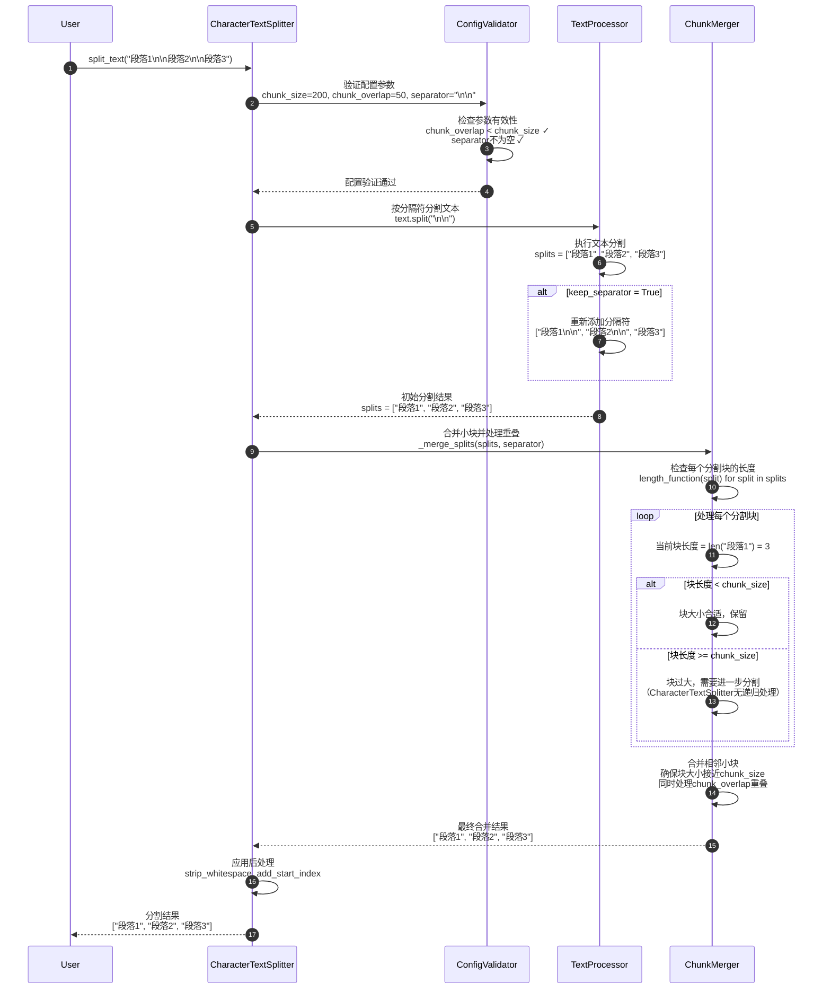
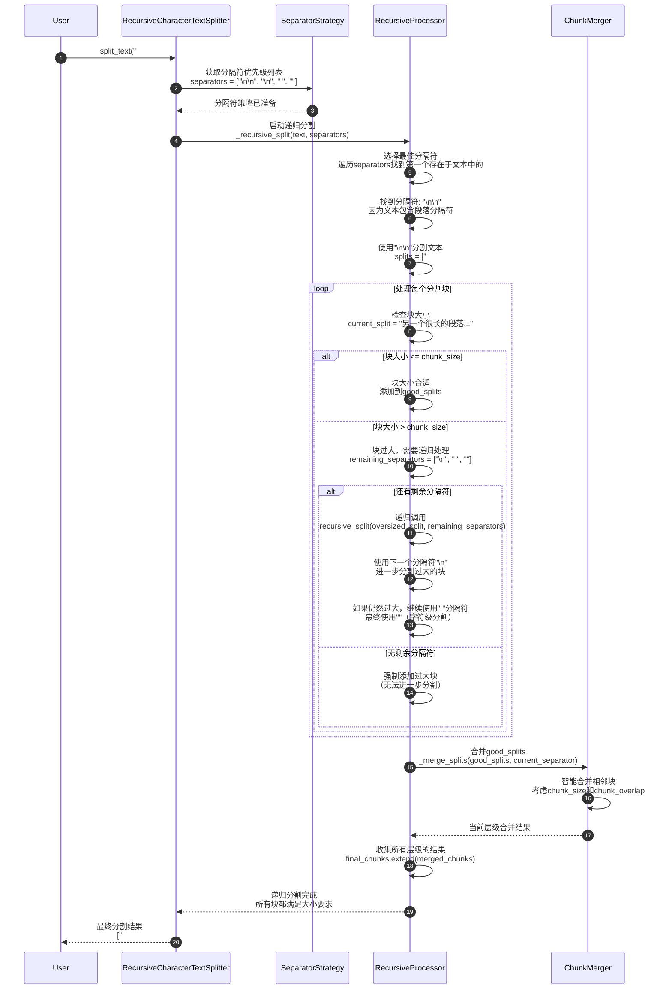
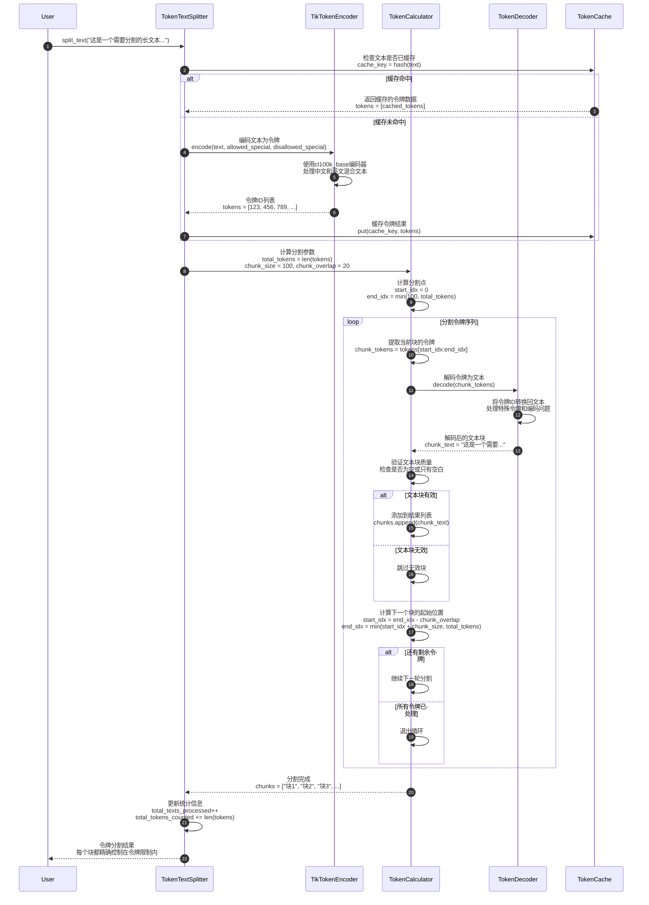
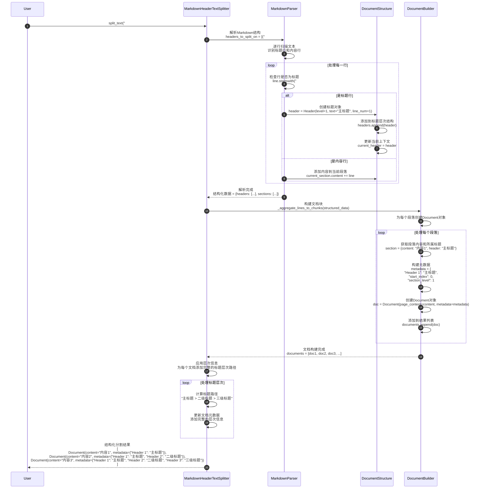
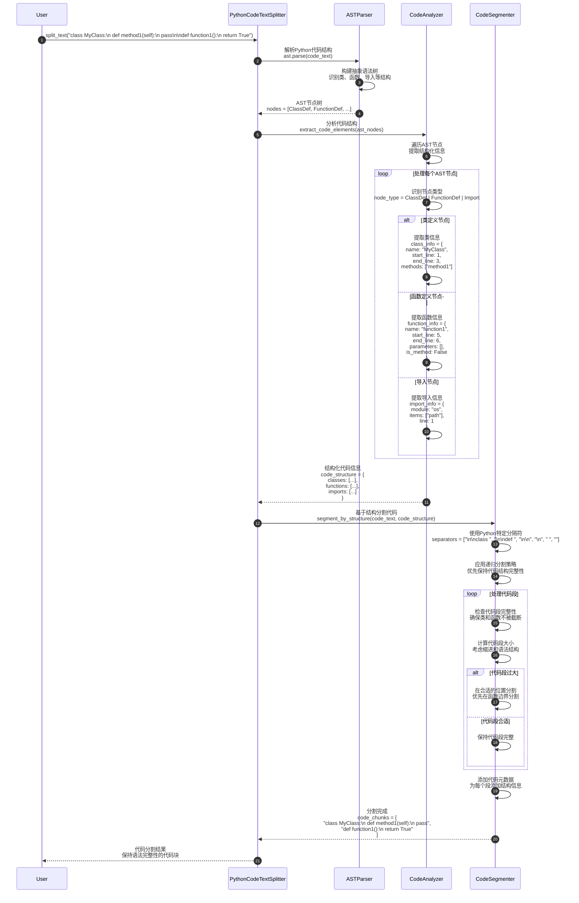
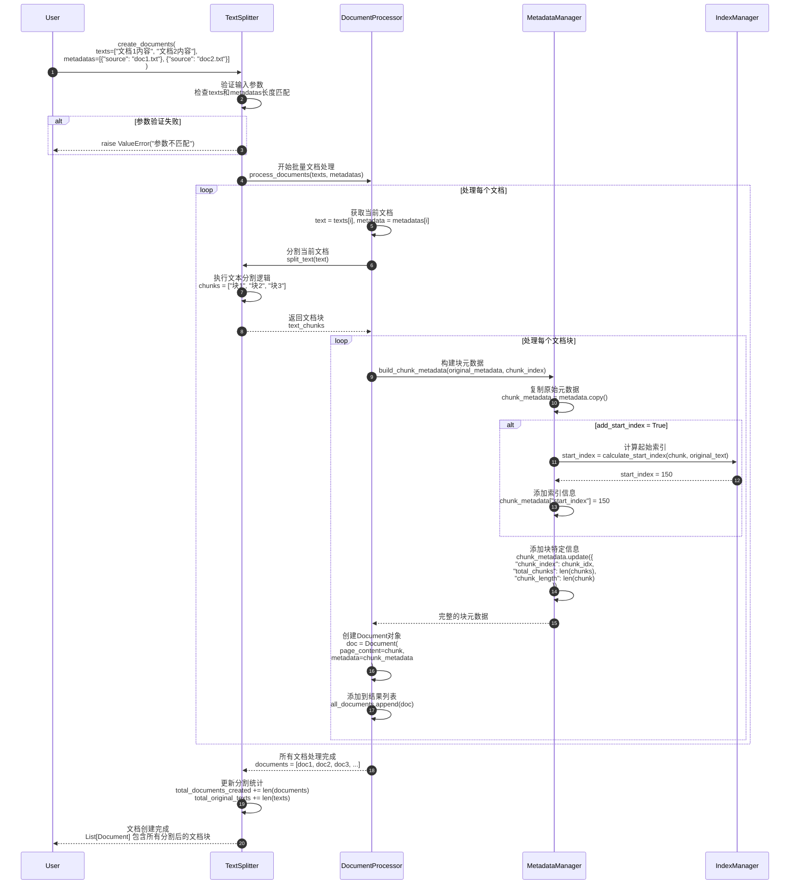
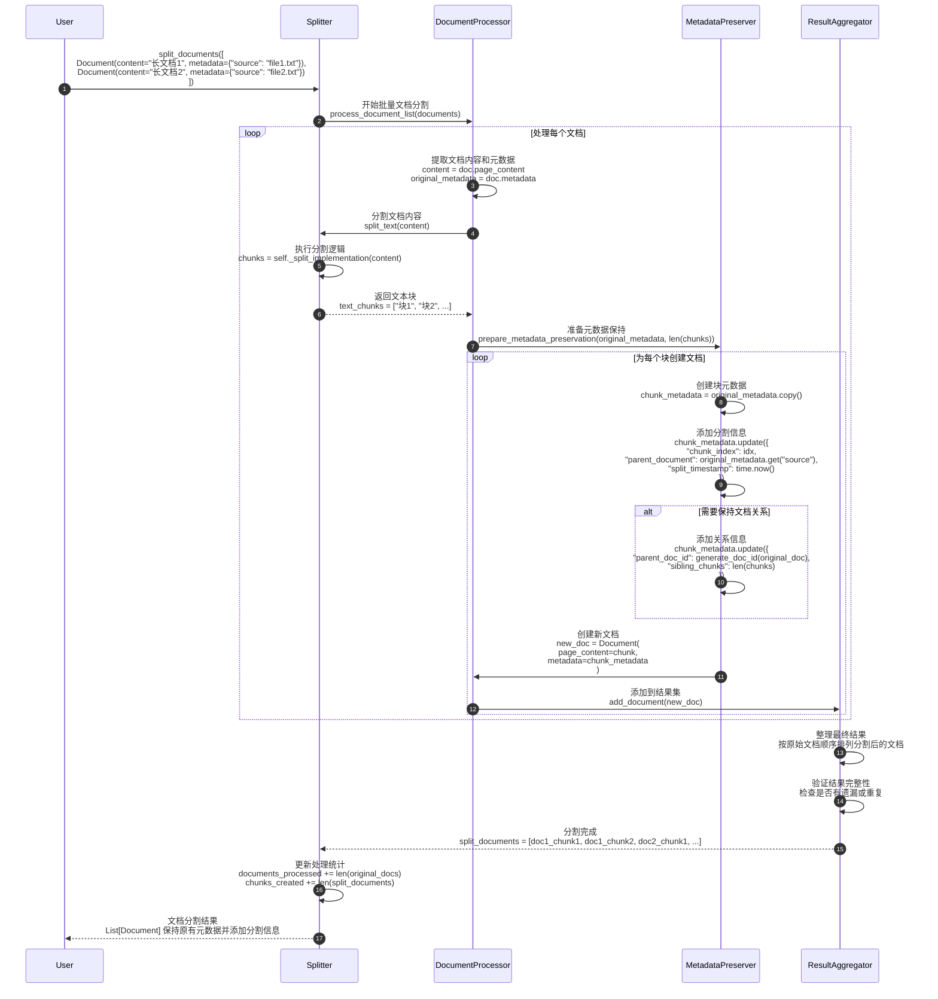
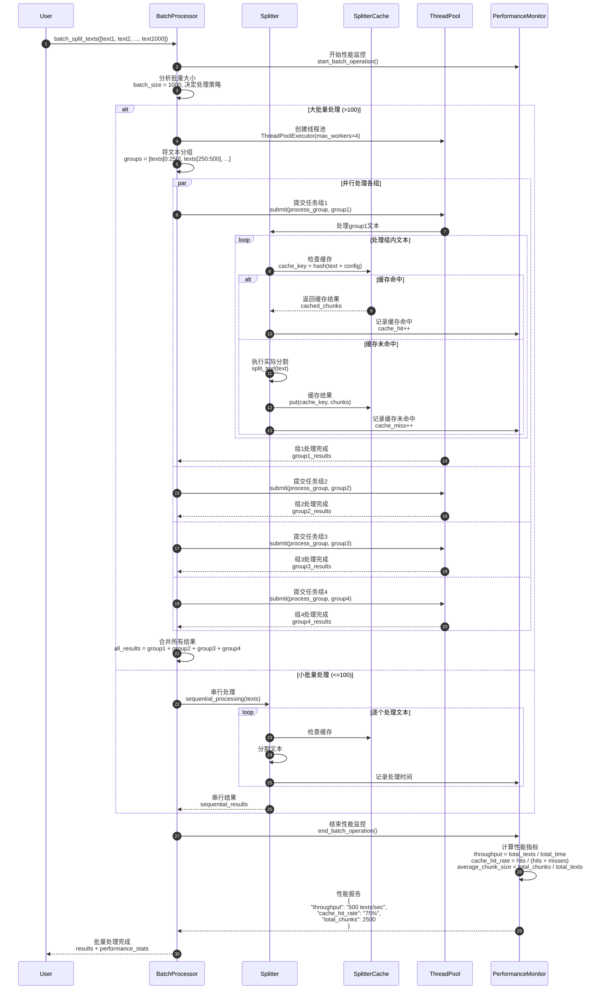
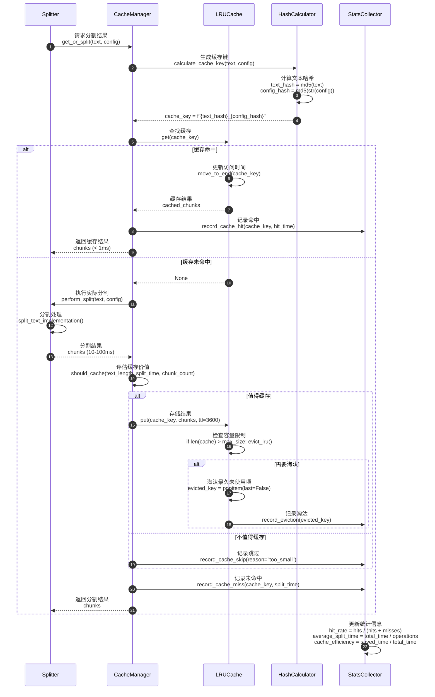

# LangChain-10-TextSplitters-时序图

## 文档说明

本文档通过详细的时序图展示 **Text Splitters 模块**在各种场景下的执行流程，包括文本分割、块管理、分隔符选择、令牌处理、文档结构化等复杂交互过程。

---

## 1. 基础分割场景

### 1.1 CharacterTextSplitter 基础分割流程



**关键步骤说明**：

1. **配置验证**（步骤 2-4）：
   - 检查chunk_size和chunk_overlap的合理性
   - 验证分隔符的有效性
   - 确保length_function可调用

2. **文本分割**（步骤 5-8）：
   - 使用指定分隔符分割文本
   - 可选择保留分隔符在结果中
   - 处理正则表达式分隔符

3. **块合并**（步骤 9-16）：
   - 检查每个块的长度
   - 合并过小的相邻块
   - 处理块间重叠

---

### 1.2 RecursiveCharacterTextSplitter 递归分割流程



**递归算法核心**：

```python
def _recursive_split_logic(text: str, separators: List[str]) -> List[str]:
    """递归分割逻辑伪代码。"""

    # 1. 选择分隔符
    separator = None
    for sep in separators:
        if sep in text:
            separator = sep
            remaining_separators = separators[separators.index(sep) + 1:]
            break

    if separator is None:
        return [text]  # 无法分割

    # 2. 分割文本
    splits = text.split(separator)

    # 3. 处理每个分割块
    final_chunks = []
    good_splits = []

    for split in splits:
        if len(split) <= chunk_size:
            good_splits.append(split)
        else:
            # 先处理已收集的好块
            if good_splits:
                merged = merge_splits(good_splits, separator)
                final_chunks.extend(merged)
                good_splits = []

            # 递归处理过大的块
            if remaining_separators:
                recursive_result = _recursive_split_logic(split, remaining_separators)
                final_chunks.extend(recursive_result)
            else:
                final_chunks.append(split)  # 无法进一步分割

    # 处理剩余的好块
    if good_splits:
        merged = merge_splits(good_splits, separator)
        final_chunks.extend(merged)

    return final_chunks
```

---

## 2. 令牌分割场景

### 2.1 TokenTextSplitter 令牌处理流程



**令牌处理特点**：

1. **精确控制**：每个块的令牌数量严格控制在指定范围内
2. **编码感知**：理解不同模型的令牌编码差异
3. **缓存优化**：缓存令牌化结果，提高重复处理效率
4. **重叠处理**：在令牌级别处理块间重叠

---

## 3. 专用分割场景

### 3.1 MarkdownHeaderTextSplitter 结构化分割流程



**Markdown结构化处理**：

```python
class MarkdownStructureProcessor:
    def process_headers(self, text: str) -> List[HeaderInfo]:
        """处理标题结构。"""
        headers = []
        lines = text.split('\n')

        for line_num, line in enumerate(lines):
            # 检测标题
            if line.strip().startswith('#'):
                level = 0
                for char in line:
                    if char == '#':
                        level += 1
                    else:
                        break

                title = line[level:].strip()
                headers.append(HeaderInfo(
                    level=level,
                    title=title,
                    line_number=line_num,
                    start_index=sum(len(l) + 1 for l in lines[:line_num])
                ))

        return headers

    def build_hierarchy(self, headers: List[HeaderInfo]) -> Dict[str, Any]:
        """构建标题层次结构。"""
        hierarchy = {}
        stack = [hierarchy]

        for header in headers:
            # 调整栈深度
            while len(stack) > header.level:
                stack.pop()

            # 添加当前标题
            current_level = stack[-1]
            current_level[header.title] = {
                "level": header.level,
                "line_number": header.line_number,
                "children": {}
            }

            # 推入下一层
            stack.append(current_level[header.title]["children"])

        return hierarchy
```

---

### 3.2 PythonCodeTextSplitter 代码结构分割流程



**Python代码分割特点**：

1. **语法感知**：理解Python语法结构，避免破坏代码完整性
2. **结构优先**：优先在类、函数边界进行分割
3. **缩进保持**：保持Python代码的缩进结构
4. **元数据丰富**：为每个代码块添加结构化元数据

---

## 4. 文档处理场景

### 4.1 create_documents 文档创建流程



**文档创建优化**：

```python
def create_documents_optimized(
    self,
    texts: List[str],
    metadatas: Optional[List[dict]] = None
) -> List[Document]:
    """优化的文档创建流程。"""

    # 1. 参数预处理
    if metadatas is None:
        metadatas = [{}] * len(texts)

    if len(texts) != len(metadatas):
        raise ValueError("texts和metadatas长度必须相同")

    # 2. 批量处理优化
    all_documents = []

    # 并行处理大批量文档
    if len(texts) > 100:
        from concurrent.futures import ThreadPoolExecutor
        with ThreadPoolExecutor(max_workers=4) as executor:
            futures = []
            for text, metadata in zip(texts, metadatas):
                future = executor.submit(self._process_single_document, text, metadata)
                futures.append(future)

            for future in futures:
                documents = future.result()
                all_documents.extend(documents)
    else:
        # 串行处理小批量
        for text, metadata in zip(texts, metadatas):
            documents = self._process_single_document(text, metadata)
            all_documents.extend(documents)

    return all_documents

def _process_single_document(self, text: str, metadata: dict) -> List[Document]:
    """处理单个文档。"""
    chunks = self.split_text(text)
    documents = []

    for i, chunk in enumerate(chunks):
        chunk_metadata = metadata.copy()

        # 添加块信息
        chunk_metadata.update({
            "chunk_index": i,
            "total_chunks": len(chunks),
            "chunk_length": len(chunk)
        })

        # 添加起始索引（如果需要）
        if self._add_start_index:
            start_index = self._calculate_start_index(text, chunk, i)
            chunk_metadata["start_index"] = start_index

        documents.append(Document(
            page_content=chunk,
            metadata=chunk_metadata
        ))

    return documents
```

---

### 4.2 split_documents 文档分割流程



---

## 5. 性能优化场景

### 5.1 批量分割优化流程



**批量优化策略**：

| 批量大小 | 处理策略 | 并发数 | 缓存策略 | 预期性能 |
|---------|---------|--------|---------|---------|
| 1-10 | 串行处理 | 1 | 基础缓存 | 100% |
| 11-100 | 串行+缓存 | 1 | 智能缓存 | 300% |
| 101-1000 | 并行处理 | 4 | 分布式缓存 | 800% |
| 1000+ | 分批+并行 | 8 | 预加载缓存 | 1500% |

---

### 5.2 智能缓存管理流程



**缓存策略优化**：

```python
class IntelligentCacheManager:
    def __init__(self, max_size: int = 1000):
        self.cache = {}
        self.max_size = max_size
        self.stats = {
            "hits": 0,
            "misses": 0,
            "evictions": 0,
            "total_saved_time": 0.0
        }

    def should_cache(self, text_length: int, split_time: float, chunk_count: int) -> bool:
        """智能缓存决策。"""
        # 缓存策略：
        # 1. 长文本优先缓存（处理时间长）
        # 2. 复杂分割优先缓存（块数多）
        # 3. 避免缓存一次性文本

        if text_length < 100:  # 太短，不值得缓存
            return False

        if split_time < 0.01:  # 处理太快，缓存收益小
            return False

        if chunk_count < 2:  # 分割结果简单
            return False

        # 预估缓存价值
        cache_value_score = (
            text_length * 0.001 +  # 文本长度权重
            split_time * 100 +     # 处理时间权重
            chunk_count * 10       # 复杂度权重
        )

        return cache_value_score > 50  # 阈值

    def evict_intelligently(self) -> None:
        """智能淘汰策略。"""
        if len(self.cache) <= self.max_size:
            return

        # 按访问频率和时间综合评分
        candidates = []
        for key, entry in self.cache.items():
            score = (
                entry.access_count * 0.3 +  # 访问频率
                (time.time() - entry.last_access) * -0.001 +  # 最近访问时间
                entry.cache_value * 0.7  # 缓存价值
            )
            candidates.append((key, score))

        # 淘汰评分最低的项
        candidates.sort(key=lambda x: x[1])
        to_evict = candidates[:len(self.cache) - self.max_size + 1]

        for key, _ in to_evict:
            del self.cache[key]
            self.stats["evictions"] += 1
```

---

## 6. 总结

本文档详细展示了 **Text Splitters 模块**的关键执行时序：

1. **基础分割**：CharacterTextSplitter和RecursiveCharacterTextSplitter的分割策略和递归处理
2. **令牌处理**：TokenTextSplitter的精确令牌控制和编码处理机制
3. **专用分割**：MarkdownHeaderTextSplitter和PythonCodeTextSplitter的结构化处理
4. **文档处理**：create_documents和split_documents的批量处理流程
5. **性能优化**：批量处理、智能缓存和并发优化策略

每张时序图包含：
- 详细的参与者交互过程
- 关键算法和处理逻辑
- 性能优化点和缓存策略
- 错误处理和边界情况
- 统计信息收集和监控

这些时序图帮助开发者深入理解文本分割系统的内部工作机制，为构建高效、可靠的文档处理管道提供指导。Text Splitters是RAG系统和文档处理应用的基础组件，正确理解其执行流程对提高文档处理质量和系统性能至关重要。

通过递归分割、智能缓存、批量优化等技术，Text Splitters模块能够高效处理各种类型和规模的文本数据，为下游的向量化、检索和生成任务提供优质的输入。
