# LangChain-10-TextSplitters-概览

## 模块基本信息

**模块名称**: langchain-text-splitters
**模块路径**: `libs/text-splitters/langchain_text_splitters/`
**核心职责**: 将长文档分割成适合 LLM 处理的小块（chunks），是 RAG 系统的关键预处理步骤

## 1. 模块职责

### 1.1 核心职责

Text Splitters 模块负责智能分割文档，提供以下能力：

1. **文档分块**: 将长文档切分为小块
2. **上下文保留**: 通过重叠保留块间上下文
3. **语义完整性**: 尽量保持句子/段落完整
4. **多种策略**: 字符、Token、递归、语义等分割方式
5. **元数据管理**: 保留并传递文档元数据
6. **格式感知**: 针对特定格式（代码、Markdown）优化分割

### 1.2 核心概念

```
长文档 (10,000+ 字符)
  ↓
Text Splitter (分割策略)
  ↓
文档块列表 (每块 500-1500 字符)
  ↓
嵌入 → 向量存储 → 检索
```

**关键参数**:
- **chunk_size**: 每个块的目标大小（字符数或 Token 数）
- **chunk_overlap**: 块之间的重叠部分（保留上下文）
- **separators**: 分隔符列表（按优先级尝试）
- **length_function**: 计算长度的函数（字符数或 Token 数）

### 1.3 Text Splitter 类型对比

| Splitter 类型 | 分割单位 | 适用场景 | 保持完整性 | 性能 |
|--------------|---------|---------|----------|------|
| **CharacterTextSplitter** | 字符 | 简单文本 | 低 | ⚡ 最快 |
| **RecursiveCharacterTextSplitter** | 字符（递归） | 通用场景 | 高 | ⚡ 快 |
| **TokenTextSplitter** | Token | Token限制场景 | 中 | 🐢 较慢 |
| **SentenceTextSplitter** | 句子 | 保持句子完整 | 高 | 🐌 慢 |
| **MarkdownHeaderTextSplitter** | Markdown标题 | Markdown文档 | 高 | ⚡ 快 |
| **CodeTextSplitter** | 代码语法 | 源代码 | 高 | 🐢 较慢 |
| **SemanticChunker** | 语义相似度 | 高质量块 | 最高 | 🐌 最慢 |

### 1.4 输入/输出

**输入**:
- **texts**: `list[str]` - 文本列表
- **documents**: `list[Document]` - 文档列表

**输出**:
- `list[Document]` - 分割后的文档块列表（包含 `page_content` 和 `metadata`）

### 1.5 上下游依赖

**上游调用者**:
- Document Loaders（加载后分割）
- RAG 应用（文档入库前）

**下游依赖**:
- `langchain_core.documents`: Document 类
- `tiktoken` 或 `transformers`: Token 计数

## 2. 模块级架构图

```mermaid
flowchart TB
    subgraph Base["基础抽象层"]
        BTS[TextSplitter<br/>文本分割器基类]
    end

    subgraph Character["字符级分割"]
        CTS[CharacterTextSplitter<br/>简单字符分割]
        RCTS[RecursiveCharacterTextSplitter<br/>递归字符分割]
    end

    subgraph Token["Token级分割"]
        TTS[TokenTextSplitter<br/>Token分割]
        SPACY[SpacyTextSplitter<br/>Spacy分割]
    end

    subgraph Semantic["语义分割"]
        SENT[SentenceTextSplitter<br/>句子分割]
        SEM[SemanticChunker<br/>语义块分割]
    end

    subgraph Format["格式感知分割"]
        MD[MarkdownHeaderTextSplitter<br/>Markdown分割]
        CODE[CodeTextSplitter<br/>代码分割]
        HTML[HTMLHeaderTextSplitter<br/>HTML分割]
        LATEX[LatexTextSplitter<br/>LaTeX分割]
    end

    subgraph Process["分割流程"]
        SPLIT[split_text<br/>分割文本]
        CREATE[create_documents<br/>创建文档]
        MERGE[merge_splits<br/>合并块]
    end

    BTS --> CTS
    BTS --> RCTS
    BTS --> TTS
    BTS --> SPACY
    BTS --> SENT
    BTS --> SEM
    BTS --> MD
    BTS --> CODE
    BTS --> HTML
    BTS --> LATEX

    BTS --> SPLIT
    BTS --> CREATE
    BTS --> MERGE

    style Base fill:#e1f5ff
    style Character fill:#fff4e1
    style Token fill:#e8f5e9
    style Semantic fill:#f3e5f5
    style Format fill:#fff3e0
    style Process fill:#ffe4e1
```



### 架构图详细说明

**1. 基础抽象层**

- **TextSplitter**: 所有分割器的基类
  ```python
  class TextSplitter(ABC):
      chunk_size: int = 4000  # 块大小
      chunk_overlap: int = 200  # 重叠大小
      length_function: Callable[[str], int] = len  # 长度函数
      keep_separator: bool = False  # 是否保留分隔符
      add_start_index: bool = False  # 是否添加起始索引

      @abstractmethod
      def split_text(self, text: str) -> list[str]:
          """分割文本为字符串列表"""

      def create_documents(
          self,
          texts: list[str],
          metadatas: Optional[list[dict]] = None
      ) -> list[Document]:
          """创建文档对象"""

      def split_documents(self, documents: list[Document]) -> list[Document]:
          """分割文档列表"""
  ```

**2. 字符级分割**

- **CharacterTextSplitter**: 简单字符分割
  - 按单个分隔符分割
  - 最简单但可能破坏语义

  ```python
  splitter = CharacterTextSplitter(
      separator="\n\n",  # 按段落分割
      chunk_size=1000,
      chunk_overlap=200
  )
  ```

- **RecursiveCharacterTextSplitter**: 递归分割（推荐）
  - 按优先级尝试多个分隔符
  - 默认顺序：`\n\n` → `\n` → ` ` → ``
  - 最大化保持段落和句子完整

  ```python
  splitter = RecursiveCharacterTextSplitter(
      chunk_size=1000,
      chunk_overlap=200,
      separators=["\n\n", "\n", " ", ""]
  )
  ```

**3. Token 级分割**

- **TokenTextSplitter**: 基于 Token 分割
  - 使用 `tiktoken` 计算 Token
  - 精确控制 LLM Token 限制

  ```python
  from langchain.text_splitter import TokenTextSplitter

  splitter = TokenTextSplitter(
      chunk_size=512,  # Token 数量
      chunk_overlap=50,
      encoding_name="cl100k_base"  # GPT-4 编码
  )
  ```

- **SpacyTextSplitter**: 使用 Spacy NLP
  - 基于 Spacy 的句子分割
  - 保持句子完整性

**4. 语义分割**

- **SentenceTextSplitter**: 句子级分割
  - 不会在句子中间切断
  - 保持语义完整

- **SemanticChunker**: 语义相似度分割
  - 使用嵌入模型计算相似度
  - 根据语义边界分割
  - 最高质量但最慢

**5. 格式感知分割**

- **MarkdownHeaderTextSplitter**: Markdown 分割
  - 按标题层级分割
  - 保留标题层级信息

  ```python
  from langchain.text_splitter import MarkdownHeaderTextSplitter

  headers_to_split_on = [
      ("#", "Header 1"),
      ("##", "Header 2"),
      ("###", "Header 3"),
  ]

  splitter = MarkdownHeaderTextSplitter(
      headers_to_split_on=headers_to_split_on
  )
  ```

- **CodeTextSplitter**: 代码分割
  - 按编程语言语法分割
  - 支持 Python、JavaScript、Java 等
  - 保持函数/类完整性

  ```python
  from langchain.text_splitter import RecursiveCharacterTextSplitter

  python_splitter = RecursiveCharacterTextSplitter.from_language(
      language=Language.PYTHON,
      chunk_size=500,
      chunk_overlap=50
  )
  ```

- **HTMLHeaderTextSplitter**: HTML 分割
  - 按 HTML 标签分割
  - 保留结构信息

- **LatexTextSplitter**: LaTeX 分割
  - 识别 LaTeX 结构
  - 保持公式完整

**6. 分割流程**

- **split_text**: 核心分割逻辑
  - 递归尝试分隔符
  - 合并小块
  - 控制块大小

- **create_documents**: 创建 Document 对象
  - 添加元数据
  - 添加起始索引（可选）

- **merge_splits**: 合并块
  - 合并过小的块
  - 保持重叠

## 3. 核心 API 详解

### 3.1 RecursiveCharacterTextSplitter - 推荐使用

**核心代码**:

```python
from langchain.text_splitter import RecursiveCharacterTextSplitter

class RecursiveCharacterTextSplitter(TextSplitter):
    separators: list[str] = ["\n\n", "\n", " ", ""]

    def split_text(self, text: str) -> list[str]:
        """
        递归分割文本

        1. 尝试第一个分隔符分割
        2. 检查每个块大小
        3. 如果块太大，递归使用下一个分隔符
        4. 合并小块
        """
        final_chunks = []
        separator = self.separators[-1]
        new_separators = []

        # 找到有效的分隔符
        for i, _s in enumerate(self.separators):
            if _s == "":
                separator = _s
                break
            if _s in text:
                separator = _s
                new_separators = self.separators[i + 1:]
                break

        # 按分隔符分割
        splits = text.split(separator)

        # 处理每个分割
        good_splits = []
        for s in splits:
            if self._length_function(s) < self.chunk_size:
                good_splits.append(s)
            else:
                # 递归分割大块
                if good_splits:
                    merged = self._merge_splits(good_splits, separator)
                    final_chunks.extend(merged)
                    good_splits = []

                # 使用下一个分隔符
                if new_separators:
                    other_splits = self._split_text(s, new_separators)
                    final_chunks.extend(other_splits)
                else:
                    # 强制分割
                    final_chunks.append(s)

        # 合并剩余的小块
        if good_splits:
            merged = self._merge_splits(good_splits, separator)
            final_chunks.extend(merged)

        return final_chunks

    def _merge_splits(
        self,
        splits: list[str],
        separator: str
    ) -> list[str]:
        """
        合并小块并保持重叠
        """
        docs = []
        current_doc = []
        total = 0

        for d in splits:
            _len = self._length_function(d)
            if total + _len >= self.chunk_size:
                if total > self.chunk_size:
                    # 警告：块过大
                    pass
                if len(current_doc) > 0:
                    doc = separator.join(current_doc)
                    docs.append(doc)

                    # 保持重叠
                    while total > self.chunk_overlap or (
                        total + _len > self.chunk_size and total > 0
                    ):
                        total -= self._length_function(current_doc[0])
                        current_doc = current_doc[1:]

            current_doc.append(d)
            total += _len

        # 添加最后一个文档
        if current_doc:
            doc = separator.join(current_doc)
            docs.append(doc)

        return docs
```

**使用示例**:

```python
from langchain.text_splitter import RecursiveCharacterTextSplitter

# 基础用法
text = """
# Introduction

LangChain is a framework for building applications with large language models.

## Features

- LCEL (LangChain Expression Language)
- Agents and Tools
- Memory Management
- RAG (Retrieval Augmented Generation)

## Getting Started

First, install LangChain:
```bash
pip install langchain
```

Then import and use:
```python
from langchain import OpenAI
llm = OpenAI()
```
"""

splitter = RecursiveCharacterTextSplitter(
    chunk_size=200,
    chunk_overlap=50,
    length_function=len,
    is_separator_regex=False
)

chunks = splitter.split_text(text)
print(f"分割成 {len(chunks)} 个块")

for i, chunk in enumerate(chunks):
    print(f"\n块 {i+1} ({len(chunk)} 字符):")
    print(chunk[:100] + "...")

# 从文档分割
from langchain_core.documents import Document

documents = [
    Document(
        page_content=text,
        metadata={"source": "langchain_intro.md"}
    )
]

split_docs = splitter.split_documents(documents)
print(f"\n分割成 {len(split_docs)} 个文档")

for doc in split_docs:
    print(f"Metadata: {doc.metadata}")
    print(f"Content: {doc.page_content[:100]}...")
```

### 3.2 TokenTextSplitter - Token 精确控制

```python
from langchain.text_splitter import TokenTextSplitter

# 基于 Token 分割
splitter = TokenTextSplitter(
    chunk_size=512,  # Token 数量
    chunk_overlap=50,
    encoding_name="cl100k_base"  # GPT-4 编码
)

text = "..." * 10000  # 长文本

chunks = splitter.split_text(text)

# 验证 Token 数量
import tiktoken

enc = tiktoken.get_encoding("cl100k_base")
for i, chunk in enumerate(chunks):
    token_count = len(enc.encode(chunk))
    print(f"块 {i+1}: {token_count} tokens")
    assert token_count <= 512  # 确保不超过限制
```

### 3.3 MarkdownHeaderTextSplitter - Markdown 结构化分割

```python
from langchain.text_splitter import MarkdownHeaderTextSplitter

markdown_text = """
# Main Title

This is the introduction.

## Section 1

Content of section 1.

### Subsection 1.1

Details of subsection 1.1.

### Subsection 1.2

Details of subsection 1.2.

## Section 2

Content of section 2.
"""

# 定义要分割的标题层级
headers_to_split_on = [
    ("#", "Header 1"),
    ("##", "Header 2"),
    ("###", "Header 3"),
]

splitter = MarkdownHeaderTextSplitter(
    headers_to_split_on=headers_to_split_on
)

docs = splitter.split_text(markdown_text)

for doc in docs:
    print(f"Content: {doc.page_content}")
    print(f"Metadata: {doc.metadata}\n")
    # Metadata 包含标题层级:
    # {"Header 1": "Main Title", "Header 2": "Section 1", "Header 3": "Subsection 1.1"}
```

### 3.4 CodeTextSplitter - 代码分割

```python
from langchain.text_splitter import RecursiveCharacterTextSplitter, Language

# Python 代码分割
python_splitter = RecursiveCharacterTextSplitter.from_language(
    language=Language.PYTHON,
    chunk_size=500,
    chunk_overlap=50
)

python_code = """
def hello_world():
    \"\"\"打印 Hello World\"\"\"
    print("Hello World")

class Calculator:
    \"\"\"简单计算器\"\"\"

    def add(self, a, b):
        return a + b

    def subtract(self, a, b):
        return a - b

if __name__ == "__main__":
    calc = Calculator()
    print(calc.add(1, 2))
"""

chunks = python_splitter.split_text(python_code)

# 代码分割器会尝试保持函数/类完整

# JavaScript 代码分割
js_splitter = RecursiveCharacterTextSplitter.from_language(
    language=Language.JS,
    chunk_size=500,
    chunk_overlap=50
)

# 支持的语言：
# Language.PYTHON, Language.JS, Language.JAVA, Language.CPP,
# Language.GO, Language.RUST, Language.MARKDOWN, Language.HTML, etc.
```

### 3.5 SemanticChunker - 语义分割（高质量）

```python
from langchain_experimental.text_splitter import SemanticChunker
from langchain_openai import OpenAIEmbeddings

# 基于语义相似度分割
embeddings = OpenAIEmbeddings()

semantic_chunker = SemanticChunker(
    embeddings=embeddings,
    breakpoint_threshold_type="percentile",  # 或 "standard_deviation", "interquartile"
    breakpoint_threshold_amount=95  # 百分位数
)

text = """
LangChain is a framework for building LLM applications.
It provides tools for prompts, chains, and agents.

RAG is a technique that combines retrieval and generation.
It retrieves relevant documents and uses them to generate answers.

Vector stores are used to store document embeddings.
Popular options include FAISS, Chroma, and Pinecone.
"""

chunks = semantic_chunker.create_documents([text])

# SemanticChunker 会在语义边界处分割
# 例如，将 LangChain 相关内容分为一块，RAG 相关内容分为另一块
```

### 3.6 自定义 Text Splitter

```python
from langchain.text_splitter import TextSplitter

class CustomSentenceSplitter(TextSplitter):
    """自定义句子分割器"""

    def split_text(self, text: str) -> list[str]:
        """
        按句子分割，保持 chunk_size 限制
        """
        import re

        # 简单的句子分割（实际应用可使用 nltk 或 spacy）
        sentences = re.split(r'(?<=[.!?])\s+', text)

        chunks = []
        current_chunk = []
        current_length = 0

        for sentence in sentences:
            sentence_length = len(sentence)

            if current_length + sentence_length > self.chunk_size:
                # 开始新块
                if current_chunk:
                    chunks.append(" ".join(current_chunk))

                    # 保持重叠
                    overlap_sentences = []
                    overlap_length = 0
                    for s in reversed(current_chunk):
                        overlap_length += len(s)
                        if overlap_length > self.chunk_overlap:
                            break
                        overlap_sentences.insert(0, s)

                    current_chunk = overlap_sentences
                    current_length = overlap_length

            current_chunk.append(sentence)
            current_length += sentence_length

        # 添加最后一块
        if current_chunk:
            chunks.append(" ".join(current_chunk))

        return chunks

# 使用
splitter = CustomSentenceSplitter(chunk_size=500, chunk_overlap=100)
chunks = splitter.split_text(long_text)
```

## 4. 最佳实践

### 4.1 选择合适的 chunk_size

```python
# 一般建议
# 小块 (200-500): 精确检索，但可能缺乏上下文
# 中块 (500-1500): 平衡精度和上下文（推荐）
# 大块 (1500-3000): 更多上下文，但检索精度降低

# 根据用例调整
qa_splitter = RecursiveCharacterTextSplitter(
    chunk_size=800,  # 问答：中等块
    chunk_overlap=200
)

summarization_splitter = RecursiveCharacterTextSplitter(
    chunk_size=2000,  # 摘要：大块
    chunk_overlap=500
)

search_splitter = RecursiveCharacterTextSplitter(
    chunk_size=400,  # 搜索：小块
    chunk_overlap=100
)
```

### 4.2 合理设置 chunk_overlap

```python
# chunk_overlap = 10-20% of chunk_size（推荐）

splitter = RecursiveCharacterTextSplitter(
    chunk_size=1000,
    chunk_overlap=200  # 20%
)

# 为什么需要重叠？
# 1. 避免在关键信息处切断
# 2. 提供跨块的上下文连续性
# 3. 提高检索召回率
```

### 4.3 添加元数据

```python
from langchain_core.documents import Document

documents = [
    Document(
        page_content=chunk,
        metadata={
            "source": "langchain_docs.pdf",
            "page": 5,
            "chunk_id": i,
            "total_chunks": len(chunks),
            "language": "en"
        }
    )
    for i, chunk in enumerate(chunks)
]

# 元数据可用于过滤和追溯
```

### 4.4 添加起始索引

```python
splitter = RecursiveCharacterTextSplitter(
    chunk_size=1000,
    chunk_overlap=200,
    add_start_index=True  # 添加起始索引
)

docs = splitter.create_documents([text])

for doc in docs:
    print(doc.metadata)
    # {"start_index": 0}  # 块在原始文档中的起始位置
```

### 4.5 组合多个分割器

```python
# 先按 Markdown 标题分割，再按字符分割
md_splitter = MarkdownHeaderTextSplitter(
    headers_to_split_on=[("#", "Header 1"), ("##", "Header 2")]
)

char_splitter = RecursiveCharacterTextSplitter(
    chunk_size=500,
    chunk_overlap=50
)

# 两阶段分割
md_docs = md_splitter.split_text(markdown_text)
final_docs = char_splitter.split_documents(md_docs)
```

### 4.6 性能优化

```python
# 批量处理
texts = [doc.page_content for doc in documents]
chunks = splitter.create_documents(
    texts,
    metadatas=[doc.metadata for doc in documents]
)

# 并行处理（大量文档）
from multiprocessing import Pool

def split_batch(args):
    splitter, texts, metadatas = args
    return splitter.create_documents(texts, metadatas)

with Pool(4) as pool:
    results = pool.map(split_batch, batches)
```

## 5. 常见场景和解决方案

### 5.1 代码文档分割

```python
# 结合代码和 Markdown
splitter = RecursiveCharacterTextSplitter.from_language(
    language=Language.MARKDOWN,
    chunk_size=1000,
    chunk_overlap=200
)

# Markdown 中的代码块会被识别并保持完整
```

### 5.2 多语言文档

```python
# 中文文档
chinese_splitter = RecursiveCharacterTextSplitter(
    chunk_size=500,  # 中文字符数较少
    chunk_overlap=100,
    separators=["\n\n", "\n", "。", "！", "？", "；", " ", ""]
)

# 多语言混合
multilingual_splitter = RecursiveCharacterTextSplitter(
    chunk_size=800,
    chunk_overlap=150,
    separators=["\n\n", "\n", ". ", "。", " ", ""]
)
```

### 5.3 PDF 文档分割

```python
from langchain_community.document_loaders import PyPDFLoader

# 加载 PDF
loader = PyPDFLoader("document.pdf")
pages = loader.load()

# 分割（保留页码信息）
splitter = RecursiveCharacterTextSplitter(
    chunk_size=1000,
    chunk_overlap=200
)

chunks = splitter.split_documents(pages)

# 每个块都包含原始页码
for chunk in chunks:
    print(f"Page {chunk.metadata['page']}: {chunk.page_content[:100]}...")
```

### 5.4 长代码文件

```python
# 按函数/类分割
python_splitter = RecursiveCharacterTextSplitter.from_language(
    language=Language.PYTHON,
    chunk_size=1500,  # 代码需要更大的块
    chunk_overlap=200
)

# 代码块会尽量保持函数/类完整
```

## 6. 与其他模块的协作

- **Document Loaders**: 加载文档后分割
- **VectorStores**: 分割后的块存入向量存储
- **Embeddings**: 每个块生成嵌入
- **Retrievers**: 检索分割后的块

## 7. 完整工作流示例

```python
from langchain_community.document_loaders import TextLoader
from langchain.text_splitter import RecursiveCharacterTextSplitter
from langchain_community.vectorstores import FAISS
from langchain_openai import OpenAIEmbeddings

# 1. 加载文档
loader = TextLoader("article.txt")
documents = loader.load()

# 2. 分割文档
text_splitter = RecursiveCharacterTextSplitter(
    chunk_size=1000,
    chunk_overlap=200,
    length_function=len,
    add_start_index=True
)

texts = text_splitter.split_documents(documents)
print(f"分割成 {len(texts)} 个块")

# 3. 创建向量存储
embeddings = OpenAIEmbeddings()
vectorstore = FAISS.from_documents(texts, embeddings)

# 4. 检索
query = "What is the main topic?"
results = vectorstore.similarity_search(query, k=3)

for result in results:
    print(f"Source: {result.metadata['source']}")
    print(f"Start index: {result.metadata['start_index']}")
    print(f"Content: {result.page_content}\n")
```

## 8. 总结

Text Splitters 是 RAG 系统的关键预处理组件，提供智能文档分割能力。关键特性：

1. **多种分割策略**: 字符、Token、语义、格式感知
2. **上下文保留**: 通过重叠保持连续性
3. **语义完整性**: 尽量保持句子/段落完整
4. **元数据管理**: 保留来源和位置信息
5. **格式感知**: 针对 Markdown、代码等优化

**关键原则**:
- 优先使用 **RecursiveCharacterTextSplitter**（通用场景）
- **chunk_size**: 500-1500 字符（推荐）
- **chunk_overlap**: chunk_size 的 10-20%
- 特殊格式使用专用分割器（Markdown、Code）
- 添加起始索引和丰富元数据
- 先按结构分割，再按大小分割

---

**文档版本**: v1.0
**最后更新**: 2025-10-03
**相关文档**:
- LangChain-00-总览.md
- LangChain-08-VectorStores-Retrievers-概览.md
- LangChain-11-DocumentLoaders-概览.md（待生成）

