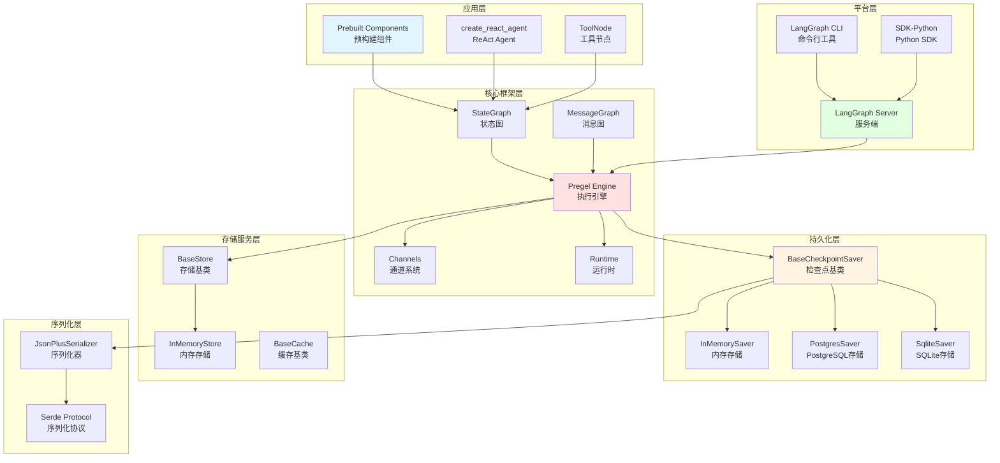
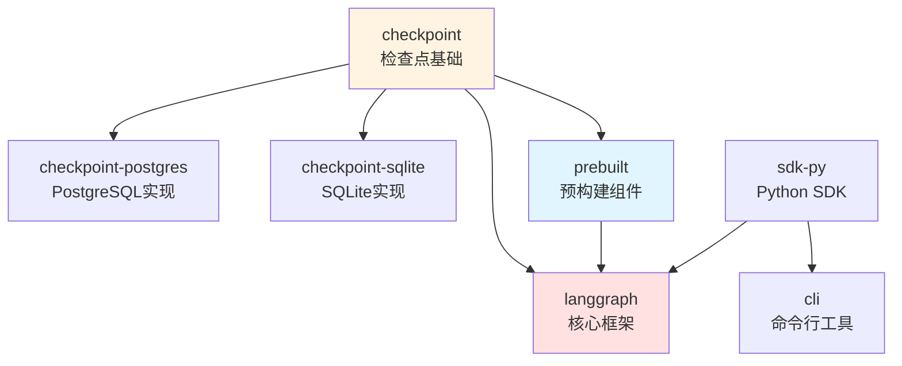
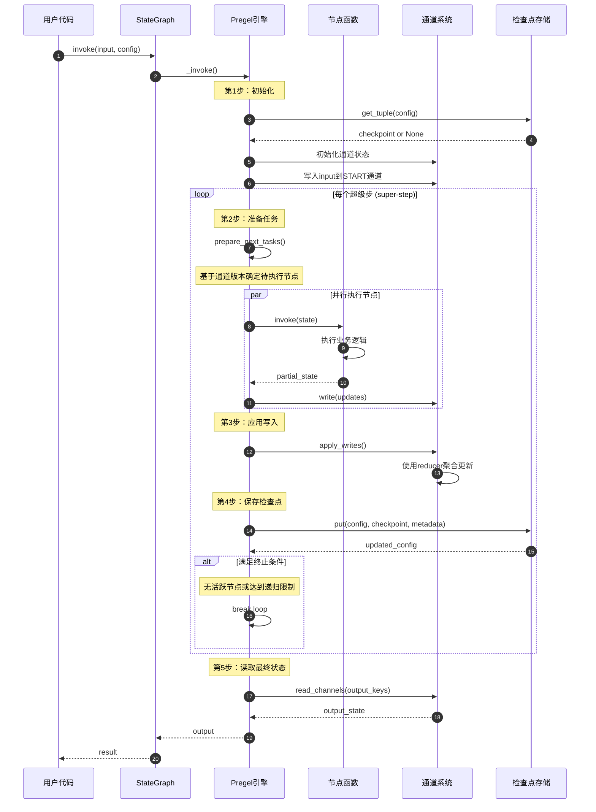
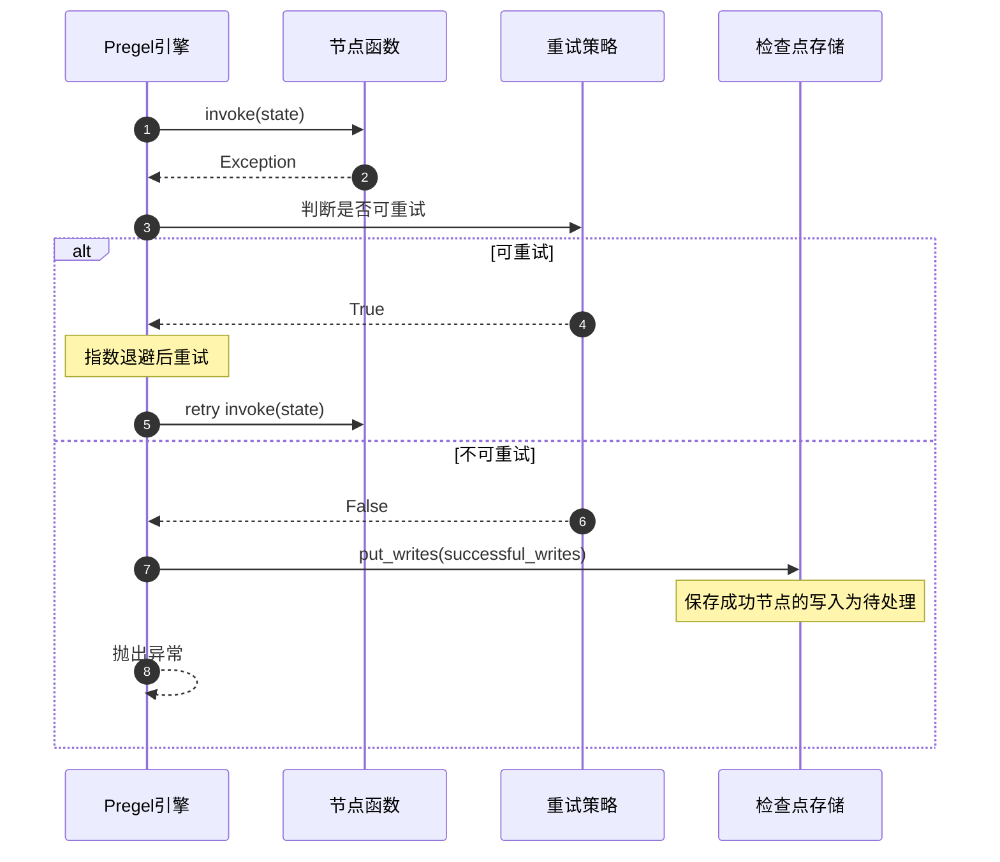
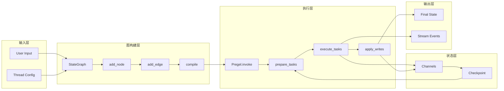

# LangGraph-00-总览

## 一、项目摘要

### 1.1 项目定位

LangGraph是一个低级编排框架，专为构建、管理和部署长时间运行的有状态Agent系统而设计。该框架不抽象提示词或架构，为开发者提供完整的控制权，支持从简单工作流到复杂多Agent系统的各类场景。

### 1.2 核心目标

- **持久化执行**：Agent能够在故障中持续运行，自动从中断点恢复
- **人机协同**：在执行过程的任意点检查和修改Agent状态
- **全面记忆**：支持短期工作记忆和跨会话的长期持久记忆
- **生产就绪**：提供可扩展的基础设施，应对有状态长时间运行工作流的特有挑战

### 1.3 非目标

- 不提供固定的认知架构
- 不抽象模型提示词
- 不限制开发者的实现自由度

### 1.4 运行环境

- Python >= 3.9
- 支持同步和异步执行模式
- 可选依赖：LangChain（用于模型集成）、PostgreSQL/SQLite（用于持久化）

## 二、整体架构

### 2.1 系统架构图



### 2.2 架构说明

#### 2.2.1 图意概述

整个LangGraph系统采用分层架构设计，从下至上依次为：序列化层、持久化层、存储服务层、核心框架层、应用层和平台层。各层之间通过清晰的接口进行交互，实现了关注点分离和职责明确。

#### 2.2.2 关键组件

**应用层（Prebuilt Layer）**
- 提供开箱即用的高级组件
- `create_react_agent`：ReAct模式Agent的完整实现
- `ToolNode`：工具执行节点的封装

**核心框架层（Core Framework Layer）**
- `StateGraph`：基于共享状态的图构建API
- `Pregel Engine`：基于Google Pregel的消息传递执行引擎
- `Channels`：状态传递的抽象通道系统
- `Runtime`：运行时上下文管理

**持久化层（Persistence Layer）**
- 定义检查点保存和恢复的标准接口
- 支持内存、PostgreSQL、SQLite等多种后端
- 实现超级步（super-step）粒度的状态快照

**平台层（Platform Layer）**
- `LangGraph CLI`：本地开发和测试工具
- `LangGraph Server`：生产部署服务
- `SDK`：编程式访问远程图的客户端库

#### 2.2.3 边界与约束

**并发约束**
- 同一超级步内的节点可并行执行
- 跨超级步的节点必须顺序执行
- 通过通道版本控制确保消息顺序

**超时策略**
- 每个节点可配置独立的超时时间
- 超时后根据重试策略决定是否重试
- 支持指数退避和自定义重试逻辑

**幂等性保证**
- 检查点写入操作具有幂等性
- 节点执行失败时，成功节点的写入会被保留为待处理写入
- 恢复时跳过已成功执行的节点

**顺序保证**
- 通道更新按照写入顺序应用
- 使用reducer函数聚合同一通道的多次写入
- 检查点ID单调递增，保证时序正确性

#### 2.2.4 异常处理与回退

**节点执行异常**
- 支持重试策略配置（次数、延迟、退避）
- 异常会被捕获并附加上下文信息
- 可配置是否继续执行其他节点

**检查点保存失败**
- 保存失败会终止当前超级步
- 保持前一个有效检查点状态
- 提供明确的错误信息用于排查

**状态不一致**
- 使用通道版本号检测冲突
- 通过reducer函数解决部分冲突
- 不可解决的冲突抛出InvalidUpdateError

#### 2.2.5 性能与容量

**内存占用**
- 单个检查点大小取决于状态schema
- InMemorySaver会保留所有历史检查点
- 数据库后端通过LRU策略管理缓存

**执行效率**
- 基于消息传递的增量计算模型
- 并行执行同一超级步内的节点
- 支持节点级别的缓存策略

**扩展能力**
- 单个图实例支持数千个节点
- 通过subgraph实现图的嵌套和复用
- 水平扩展依赖LangGraph Platform

#### 2.2.6 版本兼容与演进

**向后兼容**
- 检查点格式v1，向后兼容
- 旧版API标记为deprecated但仍可用
- 提供迁移指南和工具

**演进路径**
- v0.x -> v1.0: 稳定化核心API
- v1.0 -> v2.0: config_schema迁移到context_schema
- 通过feature flag控制实验性功能

## 三、模块清单与职责

### 3.1 模块映射表

| 序号 | 模块名称 | 目录路径 | 职责描述 |
|------|---------|---------|---------|
| 01 | checkpoint | libs/checkpoint/ | 定义检查点保存的基础接口和协议 |
| 02 | checkpoint-postgres | libs/checkpoint-postgres/ | PostgreSQL检查点持久化实现 |
| 03 | checkpoint-sqlite | libs/checkpoint-sqlite/ | SQLite检查点持久化实现 |
| 04 | langgraph | libs/langgraph/ | 核心框架，包含图构建和执行引擎 |
| 05 | prebuilt | libs/prebuilt/ | 高级预构建组件和Agent |
| 06 | cli | libs/cli/ | 命令行工具，用于本地开发 |
| 07 | sdk-py | libs/sdk-py/ | Python SDK，用于远程访问 |

### 3.2 模块依赖关系



**依赖说明**

- `checkpoint`：最底层模块，无任何依赖，定义持久化接口
- `langgraph`：核心模块，依赖`checkpoint`提供状态持久化能力
- `prebuilt`：应用层模块，依赖`langgraph`和`checkpoint`
- `checkpoint-postgres/sqlite`：实现层，依赖`checkpoint`接口
- `sdk-py`：客户端模块，可独立使用或配合`cli`
- `cli`：工具模块，依赖`sdk-py`实现远程交互

## 四、全局时序图

### 4.1 标准执行流程



### 4.2 时序图说明

#### 4.2.1 执行阶段划分

**第1步：初始化阶段**
- 从检查点存储恢复状态（如果存在）
- 初始化所有通道为默认值
- 将用户输入映射到起始通道

**第2步：任务准备阶段**
- 遍历所有节点，检查其触发器通道
- 对比节点已见版本和通道当前版本
- 为版本不匹配的节点创建执行任务

**第3步：节点执行阶段**
- 同一超级步内的节点并行执行
- 每个节点读取输入通道，执行逻辑，写入输出通道
- 捕获异常并根据重试策略处理

**第4步：状态聚合阶段**
- 收集所有节点的写入操作
- 使用reducer函数聚合同一通道的多次写入
- 更新通道版本号

**第5步：检查点持久化阶段**
- 生成唯一的检查点ID（UUID v6，包含时间戳）
- 序列化当前通道值和版本
- 调用检查点存储的put方法

#### 4.2.2 边界条件处理

**首次执行（无检查点）**
- 所有通道初始化为空值
- step从-1开始（input checkpoint）
- 所有节点的versions_seen为空

**恢复执行（有检查点）**
- 从checkpoint恢复通道值和版本
- 从checkpoint.metadata.step继续计数
- 跳过versions_seen已记录的节点

**中断恢复（有待处理写入）**
- 先应用pending_writes到通道
- 再执行正常的任务准备流程
- 避免重复执行已成功的节点

#### 4.2.3 异常流程

**节点执行失败**


**检查点保存失败**
- 终止当前超级步，不更新通道版本
- 保持上一个有效检查点
- 向用户抛出异常，包含失败原因

#### 4.2.4 性能关键路径

**热路径（每个超级步）**
1. `prepare_next_tasks()`：O(N)遍历节点
2. 并行节点执行：O(1)时间复杂度（理想情况）
3. `apply_writes()`：O(W)，W为写入数量
4. 通道序列化：O(S)，S为状态大小

**优化手段**
- 使用`trigger_to_nodes`映射避免全节点扫描
- 通过`updated_channels`只检查变化的触发器
- 节点级别缓存避免重复计算
- 异步IO减少检查点保存延迟

#### 4.2.5 并发与一致性

**超级步内并发**
- 同一超级步内的节点可并行执行
- 每个节点只读取当前超级步开始时的通道值
- 节点间的写入不会互相影响

**超级步间顺序**
- 超级步按序执行，确保因果一致性
- 通道版本单调递增
- 检查点ID包含时间戳，保证全局顺序

**冲突解决**
- 多个节点写入同一通道时，通过reducer聚合
- reducer必须满足结合律和交换律（对于并行场景）
- 默认reducer为LastValue（后写入覆盖）

## 五、模块交互矩阵

### 5.1 调用关系表

| 调用方 | 被调方 | 通信方式 | 错误语义 | 一致性要求 |
|--------|--------|---------|---------|-----------|
| prebuilt | langgraph | 直接函数调用 | 异常传播 | 强一致性 |
| langgraph | checkpoint | 接口调用 | 异常传播 | 最终一致性 |
| langgraph | channels | 直接对象操作 | 异常传播 | 强一致性 |
| pregel | checkpoint | 同步/异步IO | 失败重试 | 最终一致性 |
| cli | sdk-py | HTTP/REST | 重试+降级 | 弱一致性 |
| sdk-py | LangGraph Server | HTTP/REST | 重试+降级 | 弱一致性 |
| StateGraph | Pregel | 编译转换 | 编译期检查 | N/A |

### 5.2 数据流图



## 六、关键设计与权衡

### 6.1 一致性模型

**通道更新一致性**
- 采用超级步（super-step）模型保证一致性
- 每个超级步内，节点看到一致的通道快照
- 超级步之间通过检查点保证持久化一致性

**检查点一致性**
- 使用唯一ID（UUID v6）标识每个检查点
- ID包含时间戳，保证单调递增
- 通过version字段实现乐观并发控制

**分布式一致性（LangGraph Platform）**
- 使用数据库事务保证检查点原子性
- 支持多实例部署，通过thread_id分区
- 最终一致性模型，容忍短暂的不一致

### 6.2 事务与锁

**无全局锁设计**
- 不使用全局锁，避免成为瓶颈
- 每个thread_id独立，天然并行

**检查点写入事务**
- PostgreSQL/SQLite使用数据库事务
- InMemorySaver使用进程内锁
- 写入失败回滚，保证原子性

**乐观并发控制**
- 通过checkpoint_id版本号检测冲突
- 冲突时拒绝写入，返回错误
- 由调用方决定重试策略

### 6.3 并发模型

**节点并行执行**
- 同一超级步内的节点并行执行
- 使用ThreadPoolExecutor（同步）或asyncio（异步）
- 并行度受限于executor的最大worker数

**通道写入顺序**
- 同一节点内的写入有序
- 不同节点的写入通过reducer聚合
- reducer需满足交换律和结合律

**子图并发**
- 子图作为独立的执行单元
- 子图可嵌套，形成层次结构
- 通过namespace隔离子图状态

### 6.4 性能关键路径

**图执行关键路径**
1. `prepare_next_tasks()`：确定待执行节点（可优化）
2. 并行节点执行：取决于业务逻辑耗时
3. `apply_writes()`：聚合写入（可优化）
4. 检查点序列化和保存：IO密集（可异步）

**优化策略**
- **任务准备优化**：使用trigger_to_nodes映射
- **执行优化**：节点级缓存、增量计算
- **IO优化**：批量写入、异步持久化
- **序列化优化**：使用高效的序列化器（ormsgpack）

### 6.5 可观测性

**日志记录**
- 每个超级步记录开始和结束
- 每个节点记录输入、输出和执行时间
- 检查点保存记录checkpoint_id

**指标收集**
- 图执行时间、步数
- 节点执行时间、重试次数
- 检查点大小、保存延迟

**追踪与调试**
- 集成LangSmith进行追踪
- 支持debug模式输出详细日志
- 提供get_state()查看任意时刻状态

**错误报告**
- 异常包含完整的上下文信息
- 记录checkpoint_id和step用于回溯
- 提供错误码（ErrorCode枚举）

### 6.6 配置管理

**静态配置（编译时）**
- 图结构（节点、边）
- 状态schema
- 中断点（interrupt_before/after）

**动态配置（运行时）**
- thread_id和checkpoint_id
- 递归限制（recursion_limit）
- 运行时上下文（context）

**配置优先级**
- 运行时config > 编译时config > 默认值
- 使用configurable字段传递动态配置
- 支持配置继承和覆盖

## 七、最佳实践与使用建议

### 7.1 状态设计

**状态schema设计原则**
- 使用TypedDict或Pydantic模型定义状态
- 为需要聚合的字段指定reducer（如`Annotated[list, add_messages]`）
- 保持状态扁平，避免深层嵌套
- 大对象使用引用而非直接存储

**reducer选择**
- `add_messages`：适用于消息列表
- `operator.add`：适用于数值累加
- `LastValue`：适用于覆盖式更新
- 自定义reducer：需满足结合律和交换律

### 7.2 节点设计

**节点函数签名**
```python
def node_func(state: State) -> dict:
    # 返回状态的部分更新
    return {"key": value}
```

**节点职责单一**
- 每个节点完成一个明确的任务
- 避免在节点中实现复杂的分支逻辑
- 分支逻辑使用条件边（conditional edge）

**节点幂等性**
- 尽量设计幂等的节点函数
- 使用唯一ID标识已处理的项
- 避免依赖外部可变状态

### 7.3 边与控制流

**边类型选择**
- **常规边**：固定的节点间转换
- **条件边**：基于状态的动态路由
- **Send API**：动态创建多个任务（map-reduce模式）

**控制流模式**
- **循环**：agent -> tools -> agent
- **分支**：使用条件边根据状态选择路径
- **并行**：使用Send创建多个并行任务
- **子图**：封装可复用的图逻辑

### 7.4 检查点策略

**检查点粒度**
- 默认：每个超级步保存一次
- 可配置为仅在中断点保存
- 权衡存储成本和恢复粒度

**检查点清理**
- InMemorySaver：手动调用delete_thread()
- 数据库后端：使用TTL或定期清理脚本
- 保留关键检查点（如分支点）

### 7.5 错误处理

**重试策略配置**
```python
from langgraph.types import RetryPolicy

retry_policy = RetryPolicy(
    max_attempts=3,
    backoff_factor=2.0,
    retry_on=(TimeoutError, ConnectionError),
)
```

**人工介入**
- 使用`interrupt_before`在关键操作前暂停
- 调用`update_state()`修正状态后继续
- 结合approval flow实现人审

### 7.6 性能优化

**减少状态大小**
- 只在状态中保留必要数据
- 大文件使用存储服务，状态中保留引用
- 使用`RemoveMessage`删除无用消息

**节点缓存**
```python
from langgraph.types import CachePolicy

cache_policy = CachePolicy(
    max_age_seconds=3600,
    cache_keys=["input_hash"],
)
```

**并行度调整**
- 增加ThreadPoolExecutor的max_workers
- 使用异步节点提高IO密集任务效率
- 通过Send API实现细粒度并行

### 7.7 调试技巧

**启用debug模式**
```python
graph.invoke(input, config={"debug": True})
```

**查看中间状态**
```python
snapshot = graph.get_state(config)
print(snapshot.values)
print(snapshot.next)  # 下一步将执行的节点
```

**可视化图结构**
```python
from IPython.display import Image

Image(graph.get_graph().draw_mermaid_png())
```

## 八、示例与实战

### 8.1 简单聊天机器人

```python
from typing_extensions import TypedDict
from langgraph.graph import StateGraph, START, END
from langgraph.checkpoint.memory import InMemorySaver

class State(TypedDict):
    messages: list[str]

def chatbot_node(state: State) -> dict:
    user_message = state["messages"][-1]
    response = f"Echo: {user_message}"
    return {"messages": [response]}

graph = StateGraph(State)
graph.add_node("chatbot", chatbot_node)
graph.add_edge(START, "chatbot")
graph.add_edge("chatbot", END)

checkpointer = InMemorySaver()
app = graph.compile(checkpointer=checkpointer)

config = {"configurable": {"thread_id": "thread-1"}}
result = app.invoke({"messages": ["Hello!"]}, config)
print(result["messages"])
```

**实战经验**
- 使用`thread_id`维护会话上下文
- 消息列表需要使用reducer（如`add_messages`）
- 检查点保存在每次调用后自动进行

### 8.2 ReAct Agent

```python
from langgraph.prebuilt import create_react_agent
from langchain_core.tools import tool

@tool
def search(query: str) -> str:
    """搜索信息"""
    return f"搜索结果: {query}"

@tool
def calculate(expression: str) -> str:
    """计算数学表达式"""
    return str(eval(expression))

agent = create_react_agent(
    model="anthropic:claude-3-7-sonnet-latest",
    tools=[search, calculate],
    prompt="你是一个helpful assistant",
    checkpointer=InMemorySaver(),
)

config = {"configurable": {"thread_id": "agent-1"}}
result = agent.invoke(
    {"messages": [{"role": "user", "content": "What is 2+2?"}]},
    config=config,
)
```

**最佳实践**
- 工具函数使用`@tool`装饰器
- 工具文档字符串会传递给LLM
- `create_react_agent`封装了完整的ReAct循环

### 8.3 Map-Reduce并行处理

```python
from langgraph.types import Send

def map_node(state: State) -> dict:
    items = state["items"]
    # 为每个item创建并行任务
    return {
        "__send__": [
            Send("process", {"item": item})
            for item in items
        ]
    }

def process_node(state: dict) -> dict:
    item = state["item"]
    result = process_item(item)
    return {"results": [result]}

def reduce_node(state: State) -> dict:
    results = state["results"]
    final = aggregate(results)
    return {"output": final}

graph = StateGraph(State)
graph.add_node("map", map_node)
graph.add_node("process", process_node)
graph.add_node("reduce", reduce_node)
graph.add_edge(START, "map")
graph.add_edge("process", "reduce")
graph.add_edge("reduce", END)
```

**实战经验**
- 使用`Send` API动态创建任务
- 所有`process`节点并行执行
- reducer自动聚合`results`列表

### 8.4 人机协同审批流程

```python
from langgraph.graph import StateGraph

def generate_report(state: State) -> dict:
    report = create_report(state["data"])
    return {"report": report, "approved": False}

def apply_changes(state: State) -> dict:
    if state["approved"]:
        apply(state["report"])
        return {"status": "applied"}
    return {"status": "rejected"}

def should_continue(state: State) -> str:
    return "apply" if state.get("approved") else END

graph = StateGraph(State)
graph.add_node("generate", generate_report)
graph.add_node("apply", apply_changes)
graph.add_edge(START, "generate")
graph.add_conditional_edge("generate", should_continue, {
    "apply": "apply",
    END: END
})
graph.add_edge("apply", END)

app = graph.compile(
    checkpointer=checkpointer,
    interrupt_before=["apply"],
)

# 第一次调用：生成报告后中断
config = {"configurable": {"thread_id": "approval-1"}}
result = app.invoke({"data": ...}, config)

# 人工审批
snapshot = app.get_state(config)
print(snapshot.values["report"])

# 更新状态并继续
app.update_state(config, {"approved": True})
result = app.invoke(None, config)
```

**最佳实践**
- 使用`interrupt_before`在关键点暂停
- `get_state()`获取当前状态供人工审阅
- `update_state()`注入人工决策后继续执行
- `invoke(None, config)`从中断点恢复

### 8.5 长时间运行的数据处理管道

```python
class PipelineState(TypedDict):
    raw_data: list
    processed_data: list
    progress: int
    total: int

def fetch_data(state: PipelineState) -> dict:
    data = fetch_from_source()
    return {
        "raw_data": data,
        "total": len(data),
        "progress": 0,
    }

def process_batch(state: PipelineState) -> dict:
    batch_size = 100
    start = state["progress"]
    batch = state["raw_data"][start:start+batch_size]
    
    processed = [process(item) for item in batch]
    
    return {
        "processed_data": processed,
        "progress": start + len(batch),
    }

def should_continue(state: PipelineState) -> str:
    if state["progress"] < state["total"]:
        return "process"
    return "save"

def save_results(state: PipelineState) -> dict:
    save_to_db(state["processed_data"])
    return {"status": "completed"}

graph = StateGraph(PipelineState)
graph.add_node("fetch", fetch_data)
graph.add_node("process", process_batch)
graph.add_node("save", save_results)
graph.add_edge(START, "fetch")
graph.add_edge("fetch", "process")
graph.add_conditional_edge("process", should_continue, {
    "process": "process",
    "save": "save",
})
graph.add_edge("save", END)

app = graph.compile(checkpointer=PostgresSaver(...))

# 即使中途失败，也可以从最后一个检查点恢复
config = {"configurable": {"thread_id": "pipeline-1"}}
result = app.invoke({}, config)
```

**实战经验**
- 使用PostgreSQL等持久化检查点存储
- 状态中记录进度信息
- 循环处理大批量数据
- 失败后自动从中断点恢复

## 九、总结

LangGraph通过Pregel风格的消息传递模型和超级步执行机制，为构建有状态的Agent系统提供了坚实的基础。其核心优势在于：

1. **可控性**：不抽象架构，开发者拥有完整控制权
2. **持久性**：检查点机制保证长时间运行的可靠性
3. **灵活性**：支持从简单循环到复杂多Agent系统的各类场景
4. **可扩展性**：清晰的分层架构便于扩展和集成

通过合理的状态设计、节点职责划分和控制流编排，可以构建健壮、可维护的生产级Agent应用。

