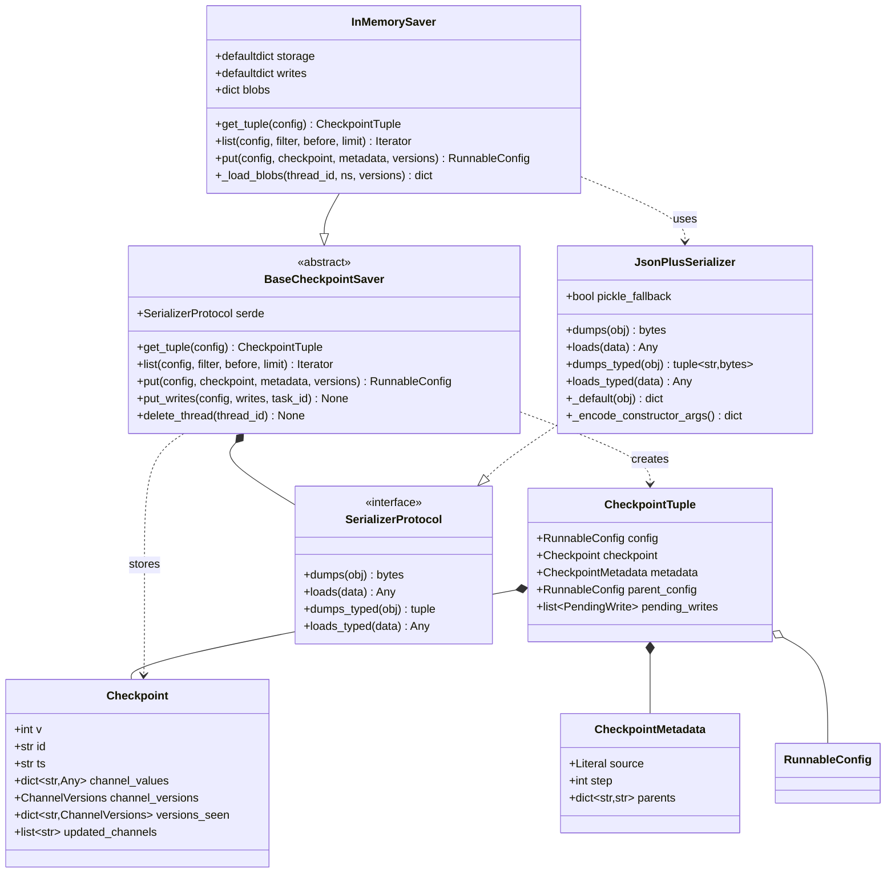
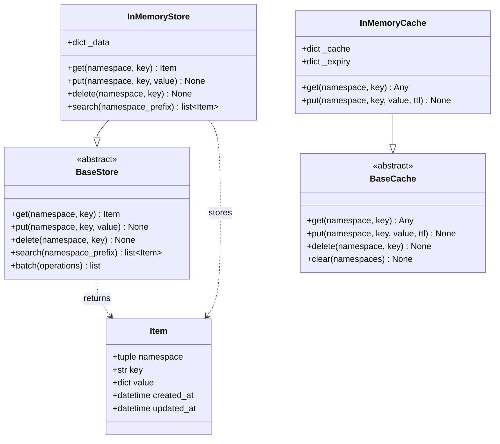
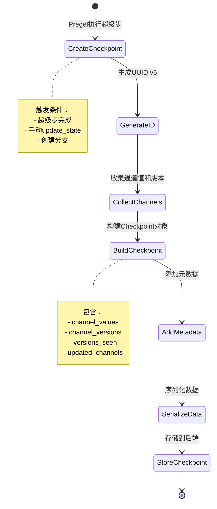
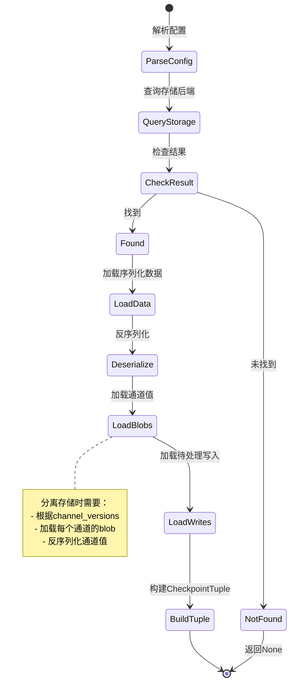
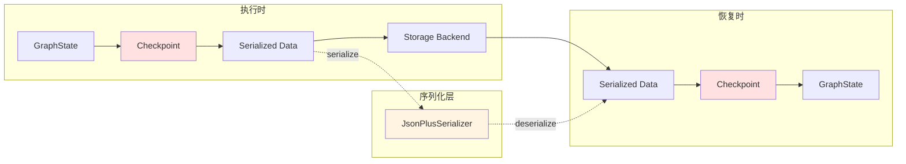

# LangGraph-01-checkpoint-数据结构

## 一、核心数据结构概览

checkpoint模块定义了以下核心数据结构：

| 数据结构 | 类型 | 用途 |
|---------|------|------|
| Checkpoint | TypedDict | 完整的状态快照 |
| CheckpointMetadata | TypedDict | 检查点的元数据 |
| CheckpointTuple | NamedTuple | 检查点的完整元组 |
| ChannelVersions | dict | 通道版本映射 |
| PendingWrite | tuple | 待处理的写入操作 |
| Item | dataclass | Store中的存储项 |

## 二、UML类图

### 2.1 核心数据结构关系图



### 2.2 Store存储系统类图



### 2.3 图意说明

#### 核心数据结构关系

**Checkpoint与CheckpointTuple**
- `CheckpointTuple`是`Checkpoint`的容器，包含配置、元数据和待处理写入
- `CheckpointTuple`用于对外传递，`Checkpoint`用于内部存储
- 通过`parent_config`字段形成检查点链

**BaseCheckpointSaver与实现类**
- `BaseCheckpointSaver`定义抽象接口，不同后端继承实现
- 所有实现类都依赖`SerializerProtocol`进行序列化
- `InMemorySaver`是最简单的实现，用于开发和测试

**序列化层**
- `SerializerProtocol`定义序列化契约
- `JsonPlusSerializer`实现扩展的JSON序列化，支持LangChain对象
- 序列化器可插拔，支持自定义实现

#### Store存储系统

**Item数据项**
- 表示Store中的单个存储项
- 包含命名空间、键、值和时间戳
- 支持层级命名空间（tuple形式）

**BaseStore抽象**
- 定义跨线程的长期存储接口
- 支持CRUD操作和前缀搜索
- 不同于检查点存储（检查点按线程隔离，Store全局共享）

## 三、详细数据结构定义

### 3.1 Checkpoint

```python
class Checkpoint(TypedDict):
    """
    状态快照，表示图在特定时刻的完整状态
    
    设计要点：
    1. 包含所有通道的值和版本信息
    2. 记录每个节点看到的版本，用于确定下一步执行
    3. 支持增量序列化（只序列化变化的通道）
    """
    
    v: int
    """
    检查点格式版本号
    
    当前值：1
    用途：支持未来格式升级和向后兼容
    """
    
    id: str
    """
    检查点唯一标识符
    
    格式：UUID v6字符串（如"1ef4f797-8335-6428-8001-8a1503f9b875"）
    特性：
    - 包含时间戳，保证单调递增
    - 字典序即时间序
    - 可用于分布式环境去重
    """
    
    ts: str
    """
    创建时间戳
    
    格式：ISO 8601（如"2024-07-31T20:14:19.804150+00:00"）
    精度：微秒级
    时区：UTC
    """
    
    channel_values: dict[str, Any]
    """
    所有通道的当前值
    
    键：通道名称（如"messages", "user_input"）
    值：通道的当前值（经过reducer聚合）
    
    注意：
    - 存储时可能被分离为blobs（InMemorySaver）
    - 支持延迟加载（数据库后端）
    """
    
    channel_versions: ChannelVersions
    """
    所有通道的当前版本
    
    类型：dict[str, str | int | float]
    格式：版本号可以是字符串"<seq>.<hash>"或数值
    
    用途：
    - 版本比较，确定通道是否有更新
    - 实现乐观并发控制
    """
    
    versions_seen: dict[str, ChannelVersions]
    """
    每个节点已看到的通道版本
    
    结构：
    {
        "node1": {"channel_a": "00000001.0.123", "channel_b": "00000002.0.456"},
        "node2": {"channel_a": "00000001.0.123"},
        ...
    }
    
    用途：
    - 确定哪些节点需要在下一步执行
    - 节点只在其触发器通道有新版本时执行
    """
    
    updated_channels: list[str] | None
    """
    本次更新的通道列表（可选）
    
    用途：
    - 优化节点调度，只检查更新过的通道
    - 与trigger_to_nodes映射配合使用
    
    示例：["messages", "agent_scratchpad"]
    """
```

**字段映射规则**：

| 内部存储 | 序列化格式 | 传输格式 |
|---------|-----------|---------|
| channel_values | 分离为blobs（InMemorySaver） | 合并到checkpoint |
| channel_versions | 字符串或数值 | 统一为字符串 |
| id | UUID对象 | UUID字符串 |
| ts | datetime对象 | ISO 8601字符串 |

**版本演进**：

- v1（当前版本）：初始格式
- v2（未来）：可能增加压缩、增量更新等特性

### 3.2 CheckpointMetadata

```python
class CheckpointMetadata(TypedDict, total=False):
    """
    检查点元数据
    
    设计原则：
    - total=False表示所有字段都是可选的
    - 可扩展，允许添加自定义字段
    """
    
    source: Literal["input", "loop", "update", "fork"]
    """
    检查点来源
    
    取值说明：
    - input: 首次调用时创建（step=-1）
    - loop: 正常超级步创建（step>=0）
    - update: 手动调用update_state创建
    - fork: 从其他检查点分支创建
    
    用途：区分检查点的创建场景
    """
    
    step: int
    """
    执行步数
    
    计数规则：
    - -1: input检查点
    -  0: 第一个loop检查点
    -  N: 第N个loop检查点
    
    用途：
    - 追踪执行进度
    - 调试和可视化
    - 过滤检查点（如只看前10步）
    """
    
    parents: dict[str, str]
    """
    父检查点映射
    
    结构：
    {
        "": "parent-checkpoint-id",  # 主图的父检查点
        "subgraph1": "subgraph-checkpoint-id",  # 子图的父检查点
    }
    
    键：checkpoint_ns（命名空间）
    值：父检查点的ID
    
    用途：
    - 支持多层级图的检查点关系
    - 追溯完整的执行历史
    """
```

**扩展字段示例**：

```python
metadata = {
    "source": "loop",
    "step": 5,
    "parents": {},
    # 自定义字段
    "user_id": "user-123",
    "session_id": "session-456",
    "execution_time_ms": 234,
    "tokens_used": 1500,
}
```

### 3.3 CheckpointTuple

```python
class CheckpointTuple(NamedTuple):
    """
    完整的检查点元组
    
    设计目的：
    - 将检查点及其上下文信息打包为不可变对象
    - 提供类型安全的字段访问
    """
    
    config: RunnableConfig
    """
    检查点的完整配置
    
    必含字段：
    - configurable.thread_id
    - configurable.checkpoint_ns
    - configurable.checkpoint_id
    
    示例：
    {
        "configurable": {
            "thread_id": "thread-123",
            "checkpoint_ns": "",
            "checkpoint_id": "1ef4f797-...",
        }
    }
    """
    
    checkpoint: Checkpoint
    """
    检查点数据
    
    注意：channel_values已加载（不再是blobs）
    """
    
    metadata: CheckpointMetadata
    """
    检查点元数据
    
    可能包含自定义字段
    """
    
    parent_config: RunnableConfig | None = None
    """
    父检查点的配置
    
    用途：
    - 追溯检查点链
    - 实现时间旅行
    - 支持分支合并
    
    为None表示：
    - 这是第一个检查点
    - 或者是孤立的检查点（如fork后）
    """
    
    pending_writes: list[PendingWrite] | None = None
    """
    待处理的写入操作
    
    类型：list[tuple[str, str, Any]]
    格式：[(task_id, channel, value), ...]
    
    场景：
    - 某个节点执行失败
    - 其他成功节点的写入被保存为pending_writes
    - 恢复时直接应用这些写入，不重新执行成功的节点
    
    示例：
    [
        ("agent", "messages", AIMessage(...)),
        ("tools", "tool_results", [...]),
    ]
    """
```

**使用示例**：

```python
# 获取检查点元组
checkpoint_tuple = checkpointer.get_tuple(config)

# 访问字段
print(f"Step: {checkpoint_tuple.metadata['step']}")
print(f"Values: {checkpoint_tuple.checkpoint['channel_values']}")

# 追溯父检查点
if checkpoint_tuple.parent_config:
    parent_tuple = checkpointer.get_tuple(checkpoint_tuple.parent_config)
    print(f"Parent step: {parent_tuple.metadata['step']}")

# 检查是否有待处理写入
if checkpoint_tuple.pending_writes:
    print(f"有{len(checkpoint_tuple.pending_writes)}个待处理写入")
```

### 3.4 ChannelVersions

```python
ChannelVersions = dict[str, Union[str, int, float]]
"""
通道版本映射

键：通道名称
值：版本号（字符串、整数或浮点数）

字符串格式："<sequence>.<random_hash>"
- sequence: 单调递增的序列号（32位整数）
- random_hash: 随机哈希（16位浮点数）

示例：
{
    "messages": "00000005.0.7234819283748",
    "agent_scratchpad": "00000003.0.2837461928374",
    "user_input": 3,  # 简单数值版本
}
"""
```

**版本比较规则**：

```python
def compare_versions(v1: str | int | float, v2: str | int | float) -> int:
    """
    返回：
    > 0: v1 > v2 (v1更新)
    = 0: v1 == v2 (相同版本)
    < 0: v1 < v2 (v2更新)
    """
    if isinstance(v1, str) and isinstance(v2, str):
        # 比较sequence部分
        seq1 = int(v1.split(".")[0])
        seq2 = int(v2.split(".")[0])
        return seq1 - seq2
    else:
        # 数值直接比较
        return 1 if v1 > v2 else (-1 if v1 < v2 else 0)
```

### 3.5 PendingWrite

```python
PendingWrite = tuple[str, str, Any]
"""
待处理的写入操作

结构：
- [0] task_id: 任务标识符（通常是节点名）
- [1] channel: 目标通道名
- [2] value: 要写入的值

示例：
("agent", "messages", AIMessage(content="Hello"))
("tools", "tool_results", ["Result1", "Result2"])
("error_handler", ERROR, Exception("Failed"))
"""
```

**特殊通道**：

```python
# 定义在langgraph._internal._constants中
ERROR = "__error__"  # 错误通道
INTERRUPT = "__interrupt__"  # 中断通道

# 这些通道的写入具有特殊语义
WRITES_IDX_MAP: dict[str, int] = {
    ERROR: -1,  # 错误写入，优先级最高
    INTERRUPT: -2,  # 中断写入
}
```

### 3.6 Item (Store数据项)

```python
@dataclass
class Item:
    """
    Store中的存储项
    
    Store与Checkpoint的区别：
    - Checkpoint: 按线程隔离，记录执行状态
    - Store: 全局共享，存储长期数据
    """
    
    namespace: tuple[str, ...]
    """
    命名空间（层级）
    
    示例：
    - ("users",): 用户数据
    - ("users", "user-123", "preferences"): 用户偏好
    - ("knowledge_base", "documents"): 知识库文档
    
    设计：
    - 使用tuple支持层级结构
    - 支持前缀搜索
    """
    
    key: str
    """
    存储键
    
    在命名空间内唯一标识一个项
    
    示例：
    - "user-123"
    - "doc-456"
    - "preference-theme"
    """
    
    value: dict[str, Any]
    """
    存储值
    
    类型：必须是可JSON序列化的字典
    
    示例：
    {
        "name": "Alice",
        "email": "alice@example.com",
        "preferences": {
            "theme": "dark",
            "language": "en"
        }
    }
    """
    
    created_at: datetime
    """
    创建时间
    
    格式：datetime对象（UTC时区）
    自动设置：首次创建时
    """
    
    updated_at: datetime
    """
    最后更新时间
    
    格式：datetime对象（UTC时区）
    自动更新：每次put操作时
    """
```

**使用示例**：

```python
from langgraph.store.memory import InMemoryStore
from datetime import datetime

store = InMemoryStore()

# 存储用户数据
store.put(
    namespace=("users",),
    key="user-123",
    value={
        "name": "Alice",
        "email": "alice@example.com",
    }
)

# 检索
item = store.get(
    namespace=("users",),
    key="user-123",
)
print(item.value["name"])  # "Alice"
print(item.created_at)  # datetime对象

# 搜索命名空间
items = store.search(namespace_prefix=("users",))
for item in items:
    print(f"{item.key}: {item.value['name']}")
```

## 四、数据结构关系与生命周期

### 4.1 检查点创建流程



### 4.2 检查点检索流程



### 4.3 数据流转图



## 五、字段约束与验证

### 5.1 Checkpoint字段约束

| 字段 | 约束 | 验证方法 |
|------|------|---------|
| v | 必须为1 | 类型检查 |
| id | 必须是有效的UUID字符串 | UUID.validate() |
| ts | 必须是ISO 8601格式 | datetime.fromisoformat() |
| channel_values | 必须可序列化 | 序列化器测试 |
| channel_versions | 版本号必须可比较 | compare_versions() |
| versions_seen | 键必须是节点名 | 与图定义对比 |

### 5.2 CheckpointMetadata字段约束

| 字段 | 约束 | 默认值 |
|------|------|--------|
| source | 必须是枚举值之一 | "loop" |
| step | 必须>=−1 | -1 |
| parents | 值必须是有效的checkpoint_id | {} |

### 5.3 Item字段约束

| 字段 | 约束 | 验证方法 |
|------|------|---------|
| namespace | 非空tuple | len(namespace) > 0 |
| key | 非空字符串 | len(key) > 0 |
| value | 可JSON序列化的dict | json.dumps(value) |
| created_at | UTC datetime | timezone检查 |
| updated_at | >= created_at | 时间比较 |

## 六、性能优化建议

### 6.1 减少Checkpoint大小

**问题**：大的channel_values导致序列化和存储慢

**优化**：
1. 使用引用而非直接存储大对象
2. 定期清理不需要的通道值
3. 使用压缩序列化器

**示例**：
```python
class State(TypedDict):
    # 不推荐：直接存储大对象
    # large_data: bytes  # 可能有几MB
    
    # 推荐：使用引用
    large_data_url: str  # S3/GCS URL
    large_data_hash: str  # 用于验证
```

### 6.2 优化版本比较

**问题**：字符串版本比较需要split和int转换

**优化**：
1. 缓存解析后的sequence值
2. 使用数值版本（如果不需要random_hash）

**示例**：
```python
# InMemorySaver使用简单数值版本
def get_next_version(self, current: str | None, channel: None) -> str:
    if current is None:
        current_v = 0
    else:
        current_v = int(current.split(".")[0])
    next_v = current_v + 1
    return f"{next_v:032}.{random.random():016}"

# 优化：直接使用整数
def get_next_version_optimized(self, current: int | None) -> int:
    return (current or 0) + 1
```

### 6.3 延迟加载Blobs

**问题**：加载整个检查点时，可能不需要所有通道值

**优化**：
1. 只在访问时加载blob
2. 使用代理对象包装channel_values

**示例**：
```python
class LazyChannelValues:
    def __init__(self, loader, versions):
        self._loader = loader
        self._versions = versions
        self._cache = {}
    
    def __getitem__(self, key):
        if key not in self._cache:
            self._cache[key] = self._loader(key, self._versions[key])
        return self._cache[key]
```

## 七、总结

checkpoint模块的数据结构设计体现了以下原则：

1. **不可变性**：使用TypedDict和NamedTuple，确保数据不被意外修改
2. **类型安全**：充分利用Python类型提示，便于IDE支持和静态检查
3. **可扩展性**：元数据支持自定义字段，便于未来扩展
4. **性能优化**：支持分离存储、延迟加载等优化手段
5. **向后兼容**：通过版本字段支持格式演进

通过这些精心设计的数据结构，checkpoint模块为LangGraph提供了可靠、高效的状态持久化能力。

