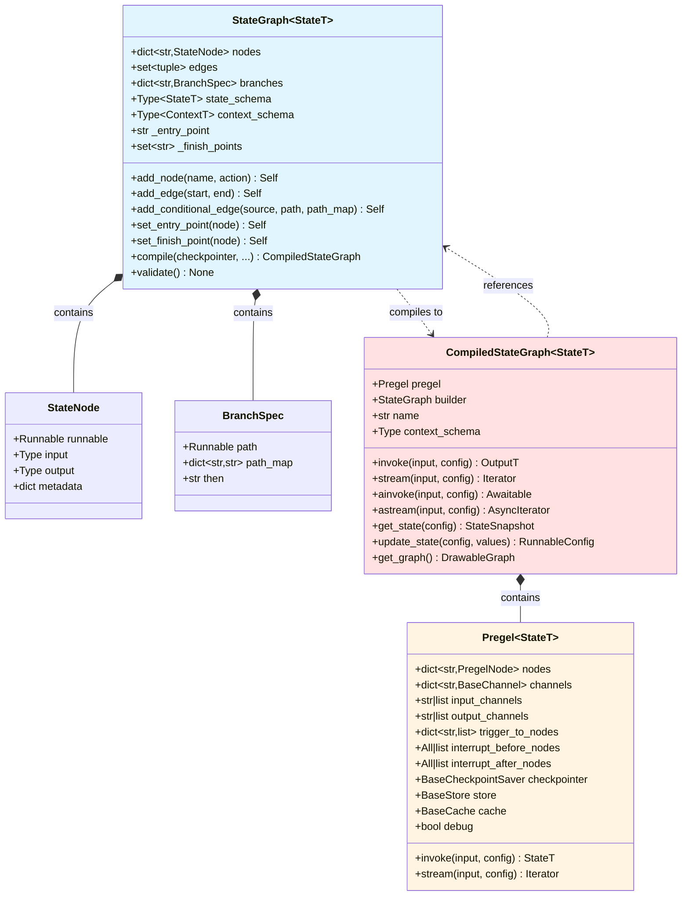
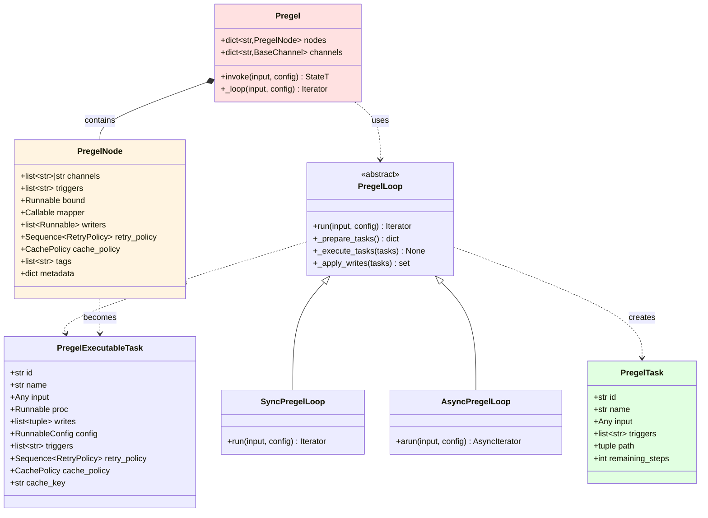
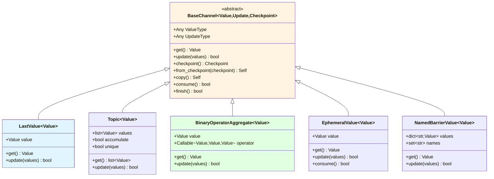
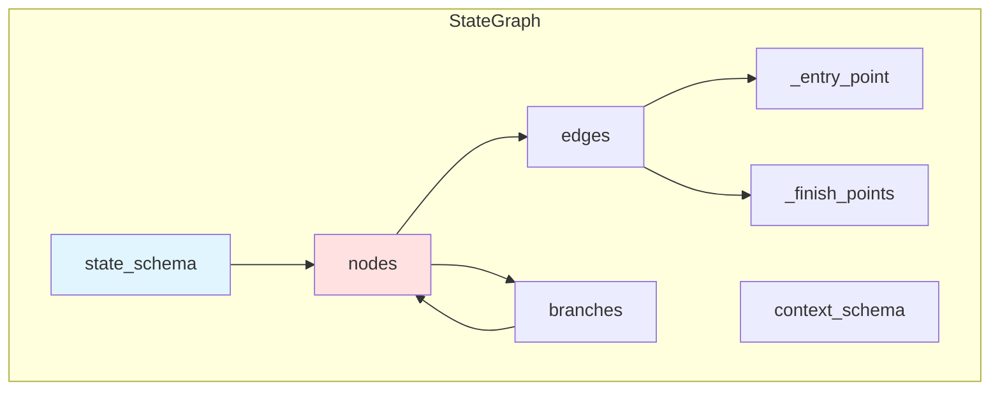
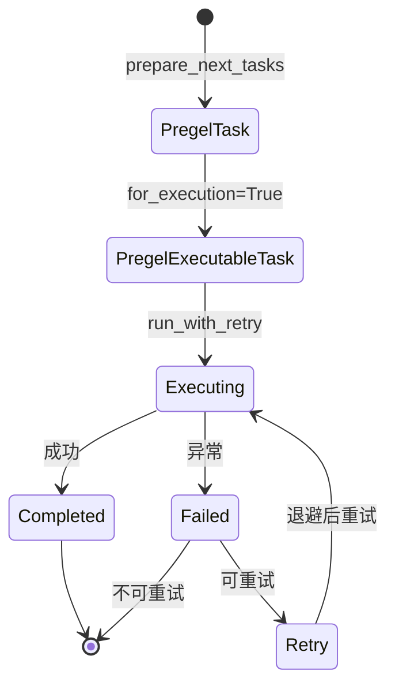
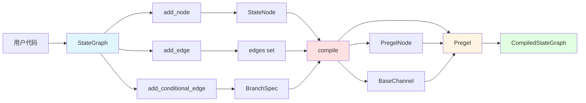
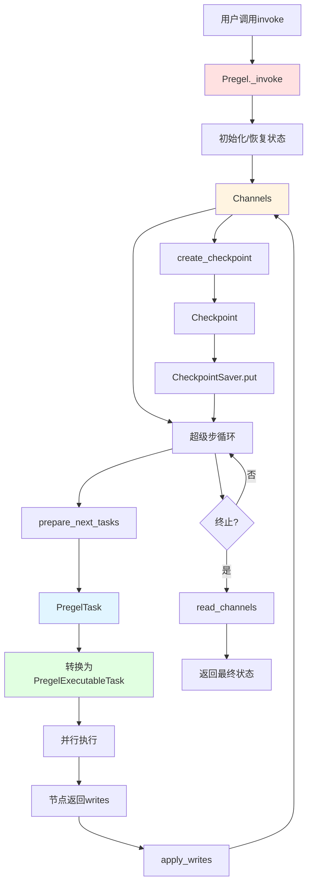

# LangGraph-02-langgraph-数据结构

## 一、核心数据结构概览

langgraph核心模块定义了以下核心数据结构：

| 数据结构 | 类型 | 用途 |
|---------|------|------|
| StateGraph | 类 | 图构建器 |
| CompiledStateGraph | 类 | 编译后的可执行图 |
| PregelNode | 类 | Pregel节点容器 |
| PregelTask | NamedTuple | 任务描述 |
| PregelExecutableTask | NamedTuple | 可执行任务 |
| StateSnapshot | NamedTuple | 状态快照 |
| BaseChannel | 抽象类 | 通道基类 |
| Send | 类 | 动态任务创建 |
| Command | 类 | 图控制命令 |

## 二、UML类图

### 2.1 图构建和编译类图



### 2.2 执行引擎类图



### 2.3 通道系统类图



### 2.4 图意说明

#### 图构建和编译

**StateGraph到CompiledStateGraph的转换**
- `StateGraph`是构建器，提供声明式API
- `compile()`方法将其转换为`CompiledStateGraph`
- `CompiledStateGraph`包含`Pregel`执行引擎
- `Pregel`持有`PregelNode`和`BaseChannel`

**节点和边的表示**
- 节点存储为`StateNode`，包装用户的action函数
- 边存储为元组集合`(start, end)`
- 条件边存储为`BranchSpec`，包含路由函数和映射

#### 执行引擎

**Pregel到PregelNode**
- `Pregel`包含多个`PregelNode`
- 每个`PregelNode`订阅一组通道（triggers）
- `PregelNode`包含实际的执行逻辑（bound Runnable）

**任务类型**
- `PregelTask`：任务描述，用于预览和调试
- `PregelExecutableTask`：可执行任务，包含实际的执行器

**执行循环**
- `PregelLoop`实现主循环逻辑
- `SyncPregelLoop`用于同步执行
- `AsyncPregelLoop`用于异步执行

#### 通道系统

**通道继承层次**
- `BaseChannel`定义通道接口
- 各种具体通道实现不同的更新语义
- 所有通道都支持checkpointing

**通道类型特点**
- `LastValue`：简单覆盖，适用于单值状态
- `Topic`：PubSub模式，适用于消息流
- `BinaryOperatorAggregate`：使用二元运算符聚合，适用于累加、合并等
- `EphemeralValue`：临时值，consume后清空
- `NamedBarrierValue`：命名屏障，等待多个输入

## 三、详细数据结构定义

### 3.1 StateGraph

```python
class StateGraph(Generic[StateT, ContextT, InputT, OutputT]):
    """
    状态图构建器
    
    设计要点：
    1. 泛型设计，支持自定义状态类型
    2. 声明式API，链式调用
    3. 延迟验证，在compile时检查
    """
    
    nodes: dict[str, StateNode]
    """
    节点映射
    
    键：节点名称（字符串）
    值：StateNode对象，包装用户的action函数
    
    特性：
    - 节点名称必须唯一
    - 不能使用保留名称（START、END、__start__、__end__）
    """
    
    edges: set[tuple[str, str]]
    """
    固定边集合
    
    格式：(起始节点, 目标节点)
    
    特性：
    - 使用set避免重复
    - 支持START和END作为特殊节点
    - 在compile时会转换为触发器关系
    """
    
    branches: dict[str, dict[str, BranchSpec]]
    """
    条件边映射
    
    结构：
    {
        "source_node": {
            "__default__": BranchSpec(...),
        }
    }
    
    说明：
    - 外层键为源节点名称
    - 内层键为分支名称（通常为"__default__"）
    - 值为BranchSpec，包含路由函数和映射
    """
    
    state_schema: Type[StateT]
    """
    状态结构定义
    
    支持类型：
    - TypedDict: 字典式状态
    - Pydantic BaseModel: 模型式状态
    
    用途：
    - 确定通道数量和类型
    - 提取reducer函数（从Annotated）
    - 类型检查和验证
    """
    
    context_schema: Type[ContextT] | None
    """
    运行时上下文结构定义
    
    用途：
    - 定义不可变的运行时数据（如user_id、db_conn）
    - 通过Runtime注入到节点函数
    - 与State分离，不参与检查点
    """
    
    _entry_point: str | None
    """
    入口点节点名称
    
    设置方式：
    - add_edge(START, node)
    - set_entry_point(node)
    
    验证：
    - compile时必须已设置
    - 只能设置一次
    """
    
    _finish_points: set[str]
    """
    出口点节点集合
    
    设置方式：
    - add_edge(node, END)
    - set_finish_point(node)
    
    验证：
    - compile时必须至少有一个
    - 可以有多个出口点
    """
```

**字段关系图**：



### 3.2 PregelNode

```python
@dataclass
class PregelNode:
    """
    Pregel节点容器
    
    设计目的：
    - 封装节点的执行逻辑和元数据
    - 支持订阅通道和触发机制
    - 提供重试和缓存策略
    """
    
    channels: str | list[str]
    """
    输入通道
    
    类型：
    - str: 单通道，节点接收该通道的值
    - list[str]: 多通道，节点接收dict
    
    示例：
    - "messages": 节点输入为messages的值
    - ["messages", "context"]: 节点输入为{"messages": ..., "context": ...}
    """
    
    triggers: list[str]
    """
    触发器通道列表
    
    含义：
    - 列表中任意通道更新时，节点被触发
    - 通道名称对应state schema的字段
    
    触发条件：
    - 通道版本 > 节点已见版本
    - 在prepare_next_tasks中检查
    """
    
    bound: Runnable[Any, Any]
    """
    绑定的执行逻辑
    
    类型：Runnable（LangChain接口）
    
    通常为RunnableSequence：
    1. ChannelRead: 读取通道值
    2. 用户函数: 实际业务逻辑
    3. ChannelWrite: 写入更新到通道
    """
    
    mapper: Callable[[Any], Any] | None = None
    """
    输入映射函数
    
    用途：
    - 在传递给bound之前转换输入
    - 可选，默认为None（不转换）
    """
    
    writers: list[Runnable]
    """
    写入器列表
    
    用途：
    - 将节点输出写入到通道
    - 通常包含ChannelWrite实例
    - 支持多个写入器（高级用法）
    """
    
    retry_policy: Sequence[RetryPolicy] | None = None
    """
    重试策略
    
    结构：
    [
        RetryPolicy(
            max_attempts=3,
            backoff_factor=2.0,
            retry_on=(TimeoutError,),
        ),
        ...
    ]
    
    行为：
    - 按顺序应用策略
    - 第一个匹配的策略生效
    - None表示不重试
    """
    
    cache_policy: CachePolicy | None = None
    """
    缓存策略
    
    结构：
    CachePolicy(
        max_age_seconds=3600,
        cache_keys=["input_hash"],
    )
    
    行为：
    - 基于cache_keys计算缓存键
    - 命中缓存时跳过执行
    - max_age过期后失效
    """
    
    tags: Sequence[str] | None = None
    """
    节点标签
    
    用途：
    - LangSmith追踪
    - 调试和可观测性
    - 过滤和分组
    """
    
    metadata: Mapping[str, Any] | None = None
    """
    节点元数据
    
    用途：
    - 存储额外信息
    - 追踪和调试
    - 自定义扩展
    """
```

### 3.3 PregelTask vs PregelExecutableTask

```python
class PregelTask(NamedTuple):
    """
    任务描述（不可执行）
    
    用途：
    - get_state预览下一步任务
    - 调试和可视化
    """
    
    id: str
    """
    任务唯一标识
    
    格式：
    - (PULL, node_name): 常规节点任务
    - (PUSH, idx): Send创建的动态任务
    """
    
    name: str
    """
    任务名称
    
    含义：
    - 常规任务：节点名称
    - 动态任务：目标节点名称
    """
    
    input: Any
    """
    任务输入
    
    内容：
    - 常规任务：通道值的dict
    - 动态任务：Send指定的输入
    """
    
    triggers: list[str]
    """
    触发该任务的通道列表
    """
    
    path: tuple[str | int | tuple, ...]
    """
    任务路径
    
    用途：
    - 追踪任务的执行路径
    - 子图场景下的层级标识
    """
    
    remaining_steps: int
    """
    剩余步数
    
    计算：recursion_limit - current_step
    
    用途：
    - 防止无限循环
    - ReAct agent中限制工具调用次数
    """


class PregelExecutableTask(NamedTuple):
    """
    可执行任务（PregelTask的扩展）
    
    用途：
    - 实际执行节点
    - 包含执行所需的所有信息
    """
    
    # 继承PregelTask的所有字段
    id: str
    name: str
    input: Any
    triggers: list[str]
    path: tuple
    
    # 额外字段
    proc: Runnable[Any, Any]
    """
    执行器
    
    内容：
    - PregelNode.bound的实例
    - 可以invoke或stream
    """
    
    writes: list[tuple[str, Any]]
    """
    任务的写入列表
    
    格式：[(channel, value), ...]
    
    填充时机：
    - 执行前为空
    - 执行后包含节点的返回值
    """
    
    config: RunnableConfig
    """
    执行配置
    
    内容：
    - callbacks: 回调管理器
    - tags: 合并的标签
    - metadata: 合并的元数据
    - 其他运行时配置
    """
    
    retry_policy: Sequence[RetryPolicy] | None
    """节点的重试策略"""
    
    cache_policy: CachePolicy | None
    """节点的缓存策略"""
    
    cache_key: str | None
    """
    缓存键
    
    计算：
    - 基于cache_policy.cache_keys
    - 使用xxhash计算哈希
    - None表示不缓存
    """
```

**任务状态转换**：



### 3.4 StateSnapshot

```python
class StateSnapshot(NamedTuple):
    """
    状态快照
    
    设计目的：
    - 提供状态的只读视图
    - 包含执行上下文信息
    - 支持时间旅行和调试
    """
    
    values: dict[str, Any]
    """
    当前状态值
    
    内容：
    - 所有通道的当前值
    - 根据output_channels过滤
    
    用途：
    - 查看当前状态
    - 决策是否继续执行
    """
    
    next: tuple[str, ...]
    """
    下一步将执行的节点名称列表
    
    内容：
    - 所有将被触发的节点
    - 空元组表示执行完成
    
    用途：
    - 预览下一步操作
    - 判断是否到达终点
    """
    
    config: RunnableConfig
    """
    快照的配置
    
    包含：
    - thread_id
    - checkpoint_id
    - checkpoint_ns
    
    用途：
    - 引用该快照
    - 从该快照恢复
    """
    
    metadata: CheckpointMetadata
    """
    检查点元数据
    
    包含：
    - source: 来源（input/loop/update）
    - step: 步数
    - parents: 父检查点
    
    用途：
    - 追踪执行历史
    - 分支管理
    """
    
    created_at: str | None
    """
    创建时间戳
    
    格式：ISO 8601
    
    用途：
    - 排序快照
    - 时间范围查询
    """
    
    parent_config: RunnableConfig | None
    """
    父快照配置
    
    用途：
    - 追溯历史
    - 构建检查点树
    """
    
    tasks: tuple[PregelTask, ...]
    """
    待执行任务列表
    
    内容：
    - PregelTask（不可执行，仅描述）
    - 对应next中的节点
    
    用途：
    - 详细的任务信息
    - 输入预览
    """
```

### 3.5 Send

```python
@dataclass(frozen=True)
class Send:
    """
    动态任务创建
    
    设计目的：
    - 支持map-reduce模式
    - 动态并行执行
    - 灵活的控制流
    """
    
    node: str
    """
    目标节点名称
    
    约束：
    - 必须是已定义的节点
    - 不能是START或END
    """
    
    arg: Any
    """
    任务输入
    
    类型：任意可序列化对象
    
    传递：
    - 直接传递给目标节点
    - 不经过通道系统
    
    示例：
    Send("process", {"item": item, "index": i})
    """
```

**Send使用场景**：

```python
# 场景1：map-reduce
def fan_out(state: State) -> dict:
    items = state["items"]
    return {
        "__send__": [
            Send("process", {"item": item, "id": i})
            for i, item in enumerate(items)
        ]
    }

# 场景2：条件并行
def conditional_parallel(state: State) -> dict:
    tasks = []
    if state["need_fetch"]:
        tasks.append(Send("fetch", {}))
    if state["need_process"]:
        tasks.append(Send("process", {}))
    return {"__send__": tasks}

# 场景3：递归处理
def recursive_process(state: State) -> dict:
    if state["depth"] < 5:
        return {
            "__send__": [
                Send("recursive_process", {"depth": state["depth"] + 1, "data": sub_data})
                for sub_data in split(state["data"])
            ]
        }
    return {"result": state["data"]}
```

### 3.6 BaseChannel及其实现

```python
class BaseChannel(Generic[Value, Update, Checkpoint], ABC):
    """
    通道基类
    
    设计原则：
    - 泛型设计：Value（存储类型）、Update（更新类型）、Checkpoint（快照类型）
    - 抽象接口：定义契约，具体实现由子类提供
    - 可序列化：支持checkpointing
    """
    
    @abstractmethod
    def get(self) -> Value:
        """获取当前值，如果为空抛出EmptyChannelError"""
    
    @abstractmethod
    def update(self, values: Sequence[Update]) -> bool:
        """
        更新通道值
        
        参数：
            values: 更新序列，顺序任意
            
        返回：
            True如果通道被更新，False否则
            
        说明：
        - 使用reducer聚合多个更新
        - 空序列时返回False
        """
    
    @abstractmethod
    def checkpoint(self) -> Checkpoint | Any:
        """返回可序列化的快照"""
    
    @abstractmethod
    def from_checkpoint(self, checkpoint: Checkpoint | Any) -> Self:
        """从快照恢复"""


class LastValue(BaseChannel[Value, Value, Value]):
    """
    最后值通道
    
    行为：
    - 保存最后一个写入的值
    - 覆盖式更新
    
    适用：
    - 单值状态（如计数器、标志位）
    - 不需要聚合的场景
    """
    
    def update(self, values: Sequence[Value]) -> bool:
        if not values:
            return False
        new_value = values[-1]  # 取最后一个
        if self.value is MISSING or self.value != new_value:
            self.value = new_value
            return True
        return False


class BinaryOperatorAggregate(BaseChannel[Value, Value, Value]):
    """
    二元运算符聚合通道
    
    行为：
    - 使用二元运算符聚合值
    - 支持累加、合并等操作
    
    适用：
    - 计数器（operator.add）
    - 集合合并（operator.or_）
    - 自定义聚合
    """
    
    operator: Callable[[Value, Value], Value]
    """二元运算符，签名为(累积值, 新值) -> 新累积值"""
    
    def update(self, values: Sequence[Value]) -> bool:
        if not values:
            return False
        
        # 累加所有值
        if self.value is MISSING:
            result = values[0]
            for v in values[1:]:
                result = self.operator(result, v)
        else:
            result = self.value
            for v in values:
                result = self.operator(result, v)
        
        if self.value is MISSING or self.value != result:
            self.value = result
            return True
        return False
```

## 四、数据结构关系与生命周期

### 4.1 构建阶段数据流



### 4.2 执行阶段数据流



## 五、性能优化建议

### 5.1 减少通道数量

**问题**：过多通道增加遍历和序列化开销

**优化**：
```python
# 不推荐：每个细节都是独立通道
class State(TypedDict):
    user_id: str
    user_name: str
    user_email: str
    user_age: int
    # ... 更多字段

# 推荐：相关字段分组
class State(TypedDict):
    user: dict  # 或Pydantic模型
    session: dict
    result: dict
```

### 5.2 选择合适的通道类型

**LastValue vs BinaryOperatorAggregate**：
- 单值状态：使用`LastValue`，开销最小
- 需要聚合：使用`BinaryOperatorAggregate`，但注意reducer性能

**示例**：
```python
class State(TypedDict):
    counter: Annotated[int, operator.add]  # 需要累加
    flag: bool  # 覆盖即可，自动使用LastValue
```

### 5.3 缓存策略

**节点级缓存**：
```python
node_builder.add_cache_policy(
    CachePolicy(
        max_age_seconds=3600,
        cache_keys=["input_text"],  # 基于输入缓存
    )
)
```

**适用场景**：
- 幂等节点（相同输入总是相同输出）
- 计算密集型节点
- 外部API调用

## 六、总结

langgraph核心模块的数据结构设计体现了以下特点：

1. **类型安全**：充分利用泛型和类型提示
2. **不可变性**：关键数据结构使用NamedTuple和frozen dataclass
3. **可扩展性**：抽象基类和接口设计支持自定义实现
4. **高性能**：精心设计的数据结构减少不必要的复制和遍历
5. **可序列化**：支持检查点和持久化

通过理解这些数据结构，可以更好地使用LangGraph构建复杂的Agent系统。

