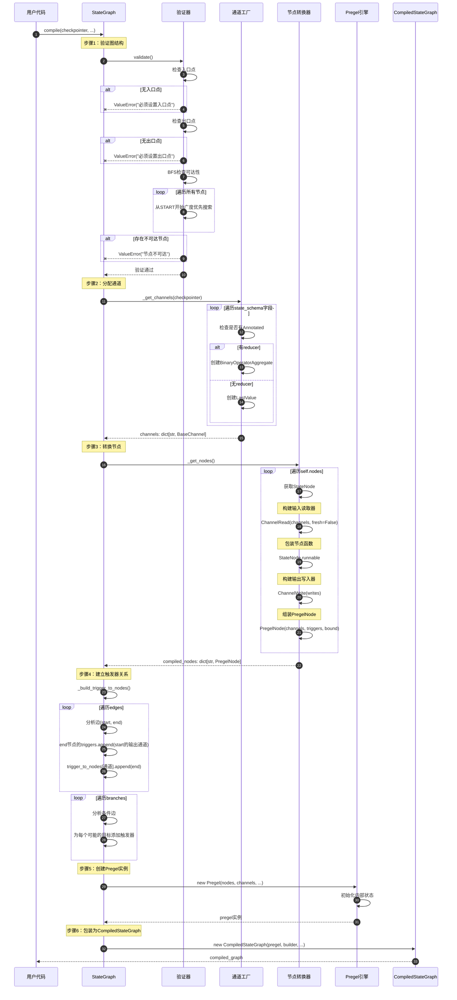
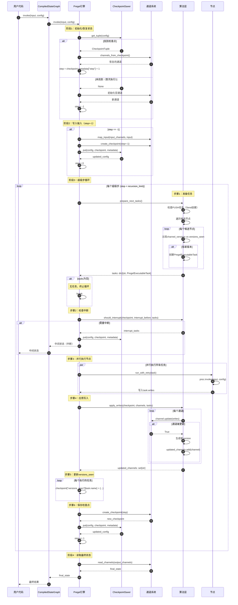
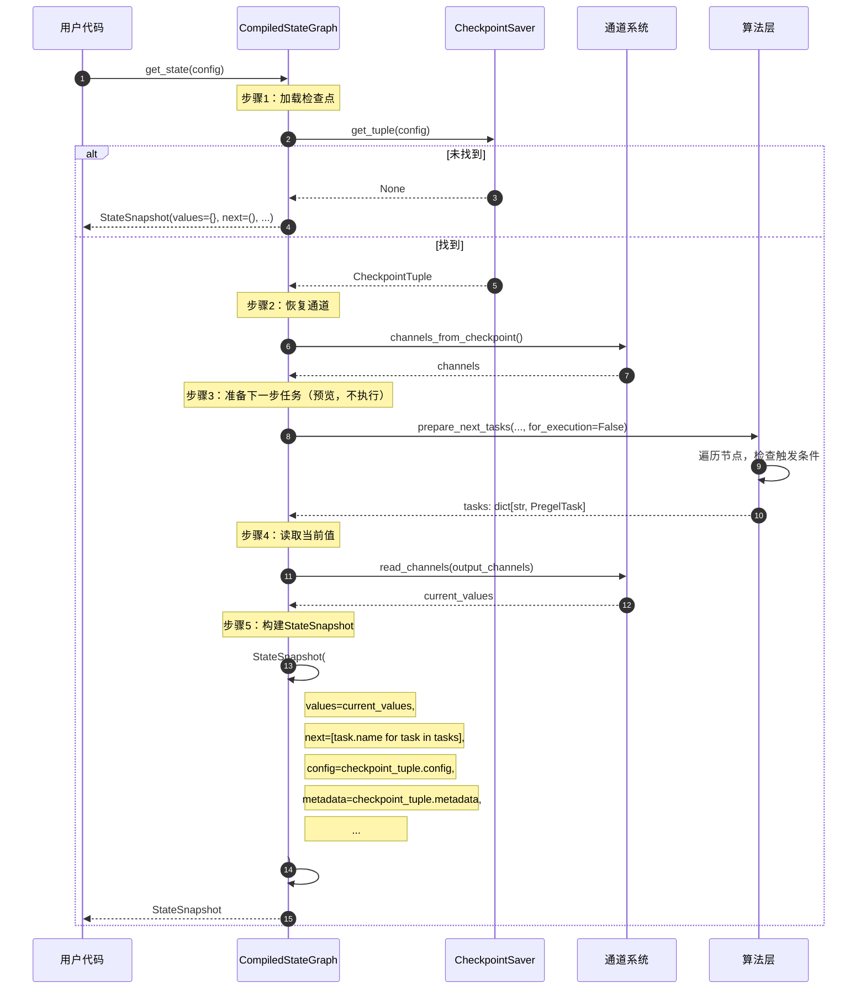
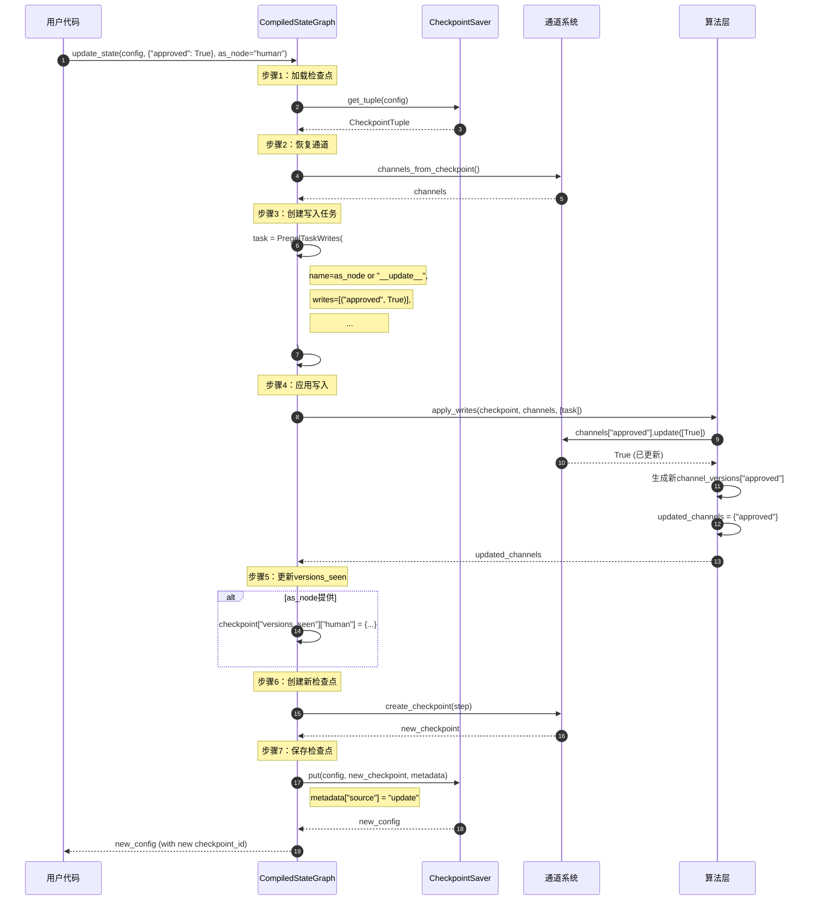
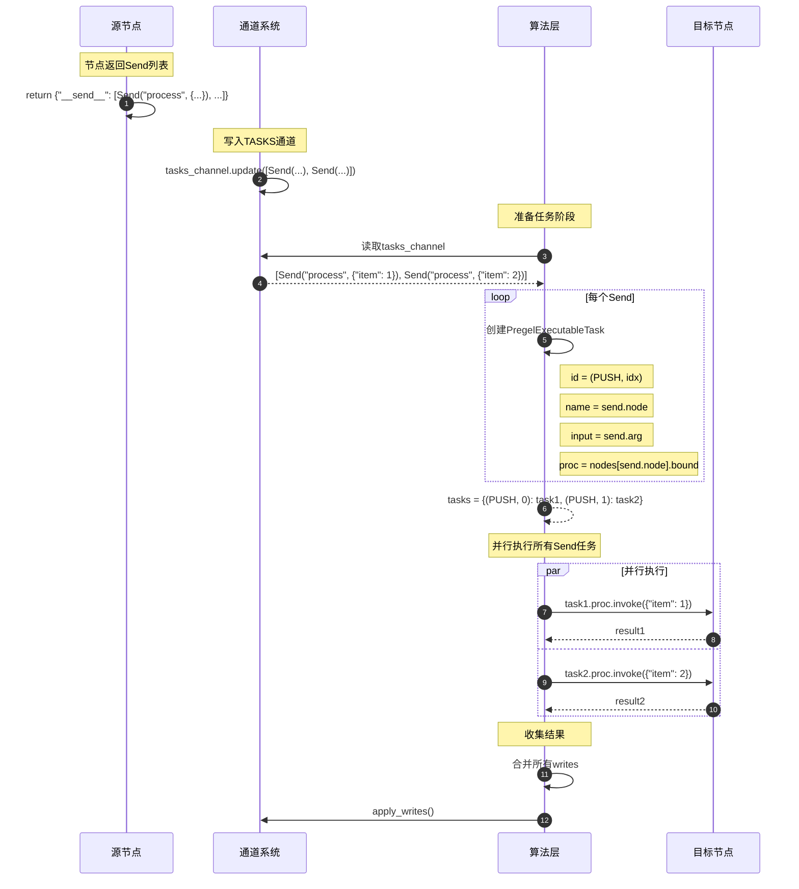

# LangGraph-02-langgraph-时序图

## 一、时序图概览

本文档展示langgraph核心模块在各种典型场景下的时序交互：

1. 图编译流程
2. 图执行流程（invoke）
3. 流式执行流程（stream）
4. 状态查询流程（get_state）
5. 状态更新流程（update_state）
6. 条件边执行流程
7. Send动态任务流程

## 二、图编译流程

### 2.1 完整编译时序图



### 2.2 时序说明

#### 阶段1：图验证（步骤1-7）

**入口点检查**
- 检查`_entry_point`是否已设置
- 必须通过`add_edge(START, node)`或`set_entry_point(node)`设置

**出口点检查**
- 检查`_finish_points`是否非空
- 必须通过`add_edge(node, END)`或`set_finish_point(node)`设置

**可达性检查**
- 使用BFS从入口点遍历
- 检查所有节点是否可达
- 不可达节点会导致编译失败

#### 阶段2：通道分配（步骤8-13）

**字段解析**
- 遍历`state_schema`的所有字段
- 检查是否使用`Annotated[Type, reducer]`

**通道类型选择**
```python
# 有reducer -> BinaryOperatorAggregate
messages: Annotated[list, add_messages]
# 无reducer -> LastValue
counter: int
```

**通道实例化**
- 创建通道实例
- 设置通道的key和类型信息

#### 阶段3：节点转换（步骤14-21）

**输入读取器**
```python
ChannelRead(
    channels=["messages", "counter", "flag"],
    fresh=False,  # 读取快照，不读取最新值
)
```

**输出写入器**
```python
ChannelWrite(
    writes=[
        ChannelWriteEntry("messages"),
        ChannelWriteEntry("counter"),
    ],
    require_at_least_one_of=["messages", "counter"],
)
```

**组装PregelNode**
```python
PregelNode(
    channels=["messages", "counter"],  # 输入通道
    triggers=[],  # 稍后填充
    bound=RunnableSequence(
        input_reader,
        node_func,
        output_writer,
    ),
)
```

#### 阶段4：触发器建立（步骤22-27）

**固定边处理**
- 对于边`(A, B)`，B的triggers添加A的输出通道
- 构建`trigger_to_nodes`反向索引

**条件边处理**
- 分析`BranchSpec.path_map`
- 为所有可能的目标节点添加触发器

#### 阶段5：创建执行引擎（步骤28-30）

**Pregel初始化**
- 存储节点和通道
- 设置中断点配置
- 绑定检查点存储器

#### 阶段6：包装结果（步骤31-32）

**CompiledStateGraph创建**
- 包含Pregel实例
- 保留对StateGraph的引用（用于introspection）
- 实现Runnable接口

## 三、图执行流程（invoke）

### 3.1 完整执行时序图



### 3.2 时序说明

#### 阶段1：状态初始化（步骤1-10）

**恢复场景**
- 从CheckpointSaver加载检查点
- 恢复通道值和版本
- 从metadata中获取step
- 应用pending_writes（如果有）

**首次执行场景**
- 创建空通道
- step初始化为-1
- 写入用户输入到START通道

#### 阶段2：输入写入（步骤11-14）

**映射输入到通道**
```python
# 如果input_channels是单个通道
channels["__input__"].update([input])

# 如果input_channels是多个通道
for key, value in input.items():
    if key in input_channels:
        channels[key].update([value])
```

**创建input检查点**
- step = -1
- source = "input"
- 保存到CheckpointSaver

#### 阶段3：超级步循环（步骤15-43）

**任务准备**
- 遍历所有节点，检查触发条件
- 触发条件：channel_versions > versions_seen
- 创建PregelExecutableTask

**中断检查**
- 如果配置了interrupt_before
- 检查任务是否在中断列表中
- 是则保存检查点并返回

**并行执行**
- 使用ThreadPoolExecutor（同步）或asyncio（异步）
- 所有任务并行执行
- 收集每个任务的writes

**写入应用**
- 按通道分组writes
- 调用channel.update()应用reducer
- 为更新的通道生成新版本

**versions_seen更新**
- 记录每个节点看到的通道版本
- 用于下一步判断是否执行

**检查点保存**
- step递增
- source = "loop"
- 保存当前状态

#### 阶段4：返回结果（步骤44-47）

**读取输出**
- 根据output_channels读取通道值
- 返回给用户

## 四、流式执行流程（stream）

### 4.1 流式执行时序图

```mermaid
sequenceDiagram
    autonumber
    participant User as 用户代码
    participant CSG as CompiledStateGraph
    participant Pregel as Pregel引擎
    participant Loop as PregelLoop
    participant Channels as 通道系统
    
    User->>CSG: stream(input, config, stream_mode="values")
    CSG->>Pregel: stream(input, config, stream_mode)
    
    Pregel->>Loop: run(input, config)
    
    Note over Loop: 初始化和输入写入（同invoke）
    
    loop 每个超级步
        Loop->>Loop: prepare_next_tasks()
        Loop->>Loop: execute_tasks()
        Loop->>Loop: apply_writes()
        
        Note over Loop: Yield中间状态
        alt stream_mode == "values"
            Loop->>Channels: read_channels(output_channels)
            Channels-->>Loop: current_state
            Loop-->>Pregel: yield current_state
            Pregel-->>CSG: yield current_state
            CSG-->>User: yield current_state
        else stream_mode == "updates"
            loop 每个任务
                Loop-->>Pregel: yield (task.name, task.writes)
                Pregel-->>CSG: yield (task.name, task.writes)
                CSG-->>User: yield (task.name, task.writes)
            end
        else stream_mode == "debug"
            loop 每个任务
                Loop-->>Pregel: yield debug_info
                Pregel-->>CSG: yield debug_info
                CSG-->>User: yield debug_info
            end
        end
        
        Loop->>Loop: save_checkpoint()
    end
    
    Note over Loop: 最终状态
    Loop->>Channels: read_channels(output_channels)
    Channels-->>Loop: final_state
    Loop-->>Pregel: yield final_state
    Pregel-->>CSG: yield final_state
    CSG-->>User: yield final_state
```

### 4.2 流式模式说明

**values模式**
- 每个超级步后yield完整状态
- 用户看到状态的演变过程
- 适合UI更新、进度显示

**updates模式**
- 每个节点执行后yield增量更新
- 格式：`(node_name, updates_dict)`
- 适合增量处理、细粒度控制

**debug模式**
- yield详细的调试信息
- 包含：节点名、输入、输出、执行时间等
- 适合开发和调试

## 五、状态查询流程（get_state）

### 5.1 状态查询时序图



### 5.2 时序说明

**for_execution=False的意义**
- 不创建PregelExecutableTask
- 只创建PregelTask（描述性）
- 不包含执行器，不能真正执行
- 用于预览和introspection

**StateSnapshot用途**
```python
snapshot = app.get_state(config)

# 查看当前状态
print(snapshot.values)

# 查看下一步
print(snapshot.next)  # ("agent", "tools")

# 查看任务详情
for task in snapshot.tasks:
    print(f"{task.name}: {task.input}")
```

## 六、状态更新流程（update_state）

### 6.1 状态更新时序图



### 6.2 时序说明

**as_node参数的作用**
- 模拟节点更新
- 影响versions_seen
- 下次执行时，该节点不会被重新触发

**使用场景**
```python
# 场景1：人工审批
snapshot = app.get_state(config)
print("等待审批:", snapshot.values["report"])

# 用户审批后
app.update_state(config, {"approved": True}, as_node="approval")

# 继续执行
result = app.invoke(None, config)

# 场景2：修正错误
snapshot = app.get_state(config)
if snapshot.values["data"] == "wrong":
    app.update_state(config, {"data": "corrected"})
    result = app.invoke(None, config)
```

## 七、条件边执行流程

### 7.1 条件边时序图

```mermaid
sequenceDiagram
    autonumber
    participant Loop as PregelLoop
    participant Node as 源节点
    participant Router as 路由函数
    participant Channels as 通道系统
    participant NextNode as 目标节点
    
    Note over Loop: 节点执行阶段
    Loop->>Node: execute(state)
    Node->>Node: 业务逻辑
    Node-->>Loop: updates
    
    Note over Loop: 应用写入
    Loop->>Channels: apply_writes()
    Channels-->>Loop: updated_channels
    
    Note over Loop: 下一步准备
    Loop->>Loop: prepare_next_tasks()
    
    Note over Loop: 检查源节点的条件边
    alt 源节点有条件边
        Loop->>Router: path_func(state)
        
        Router->>Channels: 读取state
        Channels-->>Router: current_state
        
        Router->>Router: 决策逻辑
        alt 返回单个目标
            Router-->>Loop: "target_node"
        else 返回多个目标
            Router-->>Loop: ["node1", "node2"]
        else 返回Send列表
            Router-->>Loop: {"__send__": [Send(...), ...]}
        end
        
        Note over Loop: 解析路由结果
        alt path_map提供
            Loop->>Loop: actual_target = path_map[route_result]
        else 无path_map
            Loop->>Loop: actual_target = route_result
        end
        
        Note over Loop: 创建目标节点任务
        loop 每个目标
            Loop->>Loop: 创建PregelExecutableTask(target)
        end
    end
    
    Note over Loop: 执行目标节点
    Loop->>NextNode: execute(state)
    NextNode-->>Loop: updates
```

### 7.2 路由函数类型

**类型1：返回字符串**
```python
def route(state: State) -> str:
    if state["count"] > 10:
        return END
    return "continue"

graph.add_conditional_edge("check", route, {
    "continue": "process",
    END: END,
})
```

**类型2：返回列表（并行）**
```python
def route(state: State) -> list[str]:
    targets = []
    if state["need_fetch"]:
        targets.append("fetch")
    if state["need_save"]:
        targets.append("save")
    return targets

graph.add_conditional_edge("decide", route)
```

**类型3：返回Send（动态任务）**
```python
def route(state: State) -> dict:
    return {
        "__send__": [
            Send("process", {"item": item})
            for item in state["items"]
        ]
    }

graph.add_conditional_edge("fan_out", route)
```

## 八、Send动态任务流程

### 8.1 Send执行时序图



### 8.2 Send vs 条件边

**Send优势**
- 动态数量：根据数据动态创建任务
- 独立输入：每个任务有独立的输入
- 完全并行：所有任务并行执行

**条件边限制**
- 静态数量：目标节点固定
- 共享状态：所有目标节点共享相同状态
- 部分并行：同一超级步内并行

**使用场景对比**
```python
# 条件边：根据状态选择路径
def route(state):
    if state["mode"] == "fast":
        return "quick_process"
    return "detailed_process"

# Send：动态并行处理
def fan_out(state):
    return {
        "__send__": [
            Send("process", {"item": item, "id": i})
            for i, item in enumerate(state["items"])
        ]
    }
```

## 九、总结

langgraph核心模块的时序设计体现了以下特点：

1. **分阶段执行**：初始化、循环、终止清晰分离
2. **并行优化**：同一超级步内的任务并行执行
3. **增量计算**：基于版本号判断是否需要执行
4. **灵活控制流**：支持固定边、条件边、动态任务
5. **可观测性**：流式模式支持实时监控
6. **人机协同**：中断和状态更新支持人工介入

通过理解这些时序流程，可以更好地设计和调试LangGraph应用。

