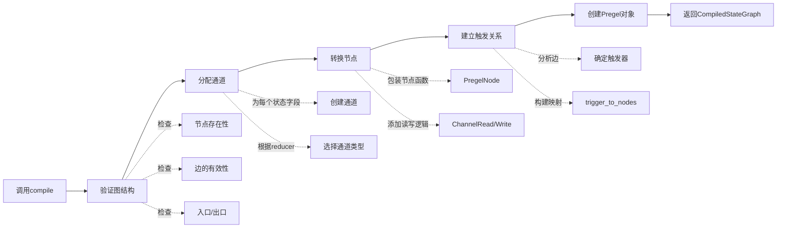
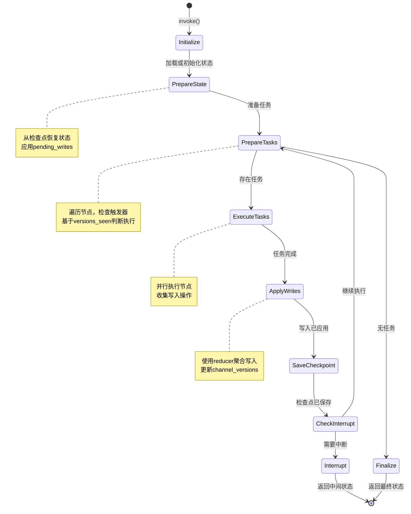

# LangGraph-02-langgraph-概览

## 一、模块职责

langgraph是LangGraph框架的核心模块，提供图的构建、编译和执行能力。该模块实现了基于Pregel算法的消息传递执行引擎，支持构建复杂的有状态Agent工作流。

### 1.1 核心能力

1. **图构建（Graph Building）**
   - `StateGraph`：基于共享状态的图构建API
   - `MessageGraph`：专为消息列表优化的图API
   - 节点（Node）和边（Edge）的声明式定义

2. **图编译（Graph Compilation）**
   - 将高级图定义编译为底层Pregel执行图
   - 通道（Channel）分配和初始化
   - 节点触发器（Trigger）和订阅关系建立

3. **执行引擎（Execution Engine）**
   - Pregel：基于BSP（Bulk Synchronous Parallel）模型的执行引擎
   - 超级步（Super-step）调度和执行
   - 节点并行执行和状态聚合

4. **状态管理（State Management）**
   - 通道系统（Channels）：状态的容器和通信机制
   - Reducer函数：聚合多个节点对同一通道的写入
   - 版本控制：追踪通道的更新历史

5. **控制流（Control Flow）**
   - 条件边（Conditional Edge）：基于状态的动态路由
   - Send API：动态创建并行任务
   - 中断点（Interrupt）：人机协同的暂停点

6. **持久化集成（Persistence Integration）**
   - 检查点保存和恢复
   - 待处理写入（Pending Writes）管理
   - 状态快照和时间旅行

## 二、输入与输出

### 2.1 输入

**图构建阶段**
- `state_schema`：TypedDict或Pydantic模型，定义状态结构
- 节点函数：`Callable[[State], dict]`，接收状态返回更新
- 边定义：起始节点、目标节点、条件函数

**图执行阶段**
- `input`：初始输入数据，映射到START通道
- `config`：运行配置（thread_id、recursion_limit等）
- `context`：运行时上下文（如user_id、db_conn）

### 2.2 输出

**图编译结果**
- `CompiledStateGraph`：可执行的Runnable对象

**图执行结果**
- 同步：最终状态dict
- 流式：状态更新的迭代器
- 异步：Awaitable的结果或AsyncIterator

### 2.3 上下游依赖

**上游（依赖方）**
- `prebuilt`模块：使用StateGraph构建预制组件
- 用户代码：通过StateGraph API构建自定义图

**下游（被依赖）**
- `checkpoint`模块：用于状态持久化
- `langchain_core`：使用Runnable接口和类型

**内部依赖**
- `channels`：通道系统实现
- `pregel`：执行引擎实现
- `graph`：图构建API

## 三、模块架构

### 3.1 整体架构图

```mermaid
flowchart TB
    subgraph "API层"
        A1[StateGraph<br/>状态图API]
        A2[MessageGraph<br/>消息图API]
        A3[add_node<br/>添加节点]
        A4[add_edge<br/>添加边]
        A5[add_conditional_edge<br/>添加条件边]
    end
    
    subgraph "编译层"
        B1[compile()<br/>编译方法]
        B2[validate()<br/>图验证]
        B3[_get_channels()<br/>通道分配]
        B4[_get_nodes()<br/>节点转换]
        B5[CompiledStateGraph<br/>编译结果]
    end
    
    subgraph "执行层"
        C1[Pregel<br/>执行引擎]
        C2[PregelLoop<br/>主循环]
        C3[PregelNode<br/>节点容器]
        C4[PregelTask<br/>任务单元]
        C5[PregelExecutableTask<br/>可执行任务]
    end
    
    subgraph "通道层"
        D1[BaseChannel<br/>通道基类]
        D2[LastValue<br/>最后值通道]
        D3[Topic<br/>主题通道]
        D4[BinaryOperatorAggregate<br/>聚合通道]
        D5[EphemeralValue<br/>临时值通道]
    end
    
    subgraph "算法层"
        E1[prepare_next_tasks<br/>任务准备]
        E2[apply_writes<br/>写入应用]
        E3[create_checkpoint<br/>检查点创建]
        E4[should_interrupt<br/>中断判断]
    end
    
    A1 --> A3
    A1 --> A4
    A1 --> A5
    A2 --> A3
    A2 --> A4
    
    A1 --> B1
    A2 --> B1
    B1 --> B2
    B1 --> B3
    B1 --> B4
    B2 --> B5
    B3 --> B5
    B4 --> B5
    
    B5 -.contains.-> C1
    C1 --> C2
    C2 --> E1
    C2 --> E2
    C2 --> E3
    C2 --> E4
    
    E1 --> C3
    E1 --> C4
    E1 --> C5
    
    C1 --> D1
    D1 <|-- D2
    D1 <|-- D3
    D1 <|-- D4
    D1 <|-- D5
    
    C3 --> D1
    C5 --> C3
    E2 --> D1
    E3 --> D1
    
    style A1 fill:#e1f5ff
    style C1 fill:#ffe1e1
    style D1 fill:#fff4e1
    style E1 fill:#e1ffe1
```

### 3.2 架构说明

#### 3.2.1 图意概述

langgraph核心模块采用分层架构，从上至下分别是：API层、编译层、执行层、通道层和算法层。用户通过API层构建图，编译层将图转换为执行引擎可理解的格式，执行层负责实际运行，通道层管理状态，算法层实现核心调度逻辑。

#### 3.2.2 关键组件

**API层：StateGraph**

`StateGraph`是用户面向的主要API，提供声明式的图构建接口：

```python
class StateGraph(Generic[StateT, ContextT, InputT, OutputT]):
    """基于共享状态的图构建器"""
    
    def add_node(self, node: str, action: Callable) -> Self:
        """添加节点"""
        
    def add_edge(self, start: str, end: str) -> Self:
        """添加固定边"""
        
    def add_conditional_edge(
        self, 
        source: str,
        path: Callable,
        path_map: dict[str, str] | None = None,
    ) -> Self:
        """添加条件边"""
        
    def compile(self, checkpointer: Checkpointer = None, ...) -> CompiledStateGraph:
        """编译为可执行图"""
```

**编译层：compile()**

编译过程将高级图定义转换为底层执行图：

1. **验证图结构**：检查节点引用、循环依赖等
2. **分配通道**：为状态的每个字段创建通道
3. **转换节点**：将节点函数包装为PregelNode
4. **建立触发关系**：根据边确定节点的触发器
5. **构建Pregel对象**：创建可执行的Pregel实例

**执行层：Pregel引擎**

Pregel实现了BSP（Bulk Synchronous Parallel）模型：

- **超级步（Super-step）**：一个完整的计算和通信周期
- **节点并行执行**：同一超级步内的节点并行运行
- **状态聚合**：使用reducer聚合多个写入
- **版本控制**：追踪通道的更新历史

**通道层：Channel系统**

通道是状态的容器，支持不同的更新语义：

- `LastValue`：保存最后一个值（覆盖更新）
- `Topic`：PubSub模式，支持多个值
- `BinaryOperatorAggregate`：使用二元运算符聚合
- `EphemeralValue`：临时值，执行完即清空

**算法层：核心调度逻辑**

- `prepare_next_tasks()`：确定下一步要执行的节点
- `apply_writes()`：将节点的写入应用到通道
- `create_checkpoint()`：创建状态快照
- `should_interrupt()`：判断是否应该中断

#### 3.2.3 边界与约束

**并发约束**
- 同一超级步内的节点可并行执行
- 节点读取的是超级步开始时的通道快照
- 节点的写入在超级步结束时统一应用

**递归限制**
- 默认最大递归深度：25（可配置）
- 超过限制抛出`GraphRecursionError`
- 通过`recursion_limit`参数调整

**顺序保证**
- 同一节点内的写入有序
- 不同节点的写入通过reducer聚合
- reducer应满足交换律和结合律（对于并行场景）

**状态不可变性**
- 节点接收的state是只读的
- 节点通过返回dict表达状态更新
- 更新通过reducer合并到状态中

#### 3.2.4 异常处理与回退

**节点执行异常**
- 支持重试策略（RetryPolicy）
- 异常会附加上下文信息（节点名、步数等）
- 成功节点的写入保存为pending_writes

**图结构异常**
- 编译时验证：未定义节点、孤立节点等
- 运行时验证：无效的Send目标等
- 提供清晰的错误消息和修复建议

**中断恢复**
- 通过检查点恢复到任意超级步
- 应用pending_writes，避免重复执行
- 支持修改状态后继续执行

#### 3.2.5 性能与容量

**图规模限制**
- 节点数量：理论上无限，实际建议<1000
- 通道数量：取决于状态schema的字段数
- 超级步数：受recursion_limit限制

**并行度**
- 同一超级步内的节点数
- 受ThreadPoolExecutor的max_workers限制
- 异步执行受asyncio并发限制

**内存占用**
- 每个超级步的检查点（如果启用）
- 通道值的总大小
- pending_writes的累积

**执行效率**
- 热路径：`prepare_next_tasks` -> 节点执行 -> `apply_writes`
- 瓶颈：节点执行时间（业务逻辑）
- 优化：节点缓存、增量计算、异步IO

#### 3.2.6 版本兼容与演进

**API稳定性**
- `StateGraph` API已稳定（v0.x -> v1.0）
- `MessageGraph` API已稳定
- Pregel直接使用属于高级用法，API可能变化

**功能演进**
- v0.1: 基础StateGraph
- v0.2: 添加MessageGraph
- v0.3: 添加Send API
- v0.4: 添加Runtime和context_schema
- v0.5: 添加Store和Cache支持
- v0.6: 添加Command API

**废弃策略**
- 废弃的API标记`@deprecated`
- 至少保留一个主版本的兼容期
- 提供迁移指南和工具

## 四、生命周期

### 4.1 图构建阶段

```python
from langgraph.graph import StateGraph, START, END
from typing_extensions import TypedDict

class State(TypedDict):
    messages: list
    step: int

# 创建图构建器
graph = StateGraph(State)

# 添加节点
graph.add_node("node1", node1_func)
graph.add_node("node2", node2_func)

# 添加边
graph.add_edge(START, "node1")
graph.add_conditional_edge("node1", should_continue, {
    "node2": "node2",
    END: END,
})
graph.add_edge("node2", END)
```

**步骤说明**：
1. 实例化`StateGraph`，传入状态schema
2. 使用`add_node`添加节点函数
3. 使用`add_edge`和`add_conditional_edge`定义控制流
4. 指定入口（START）和出口（END）

### 4.2 图编译阶段

```python
from langgraph.checkpoint.memory import InMemorySaver

# 编译图
checkpointer = InMemorySaver()
app = graph.compile(
    checkpointer=checkpointer,
    interrupt_before=["node2"],
    debug=True,
)
```

**编译流程**：



**编译产物**：
- `CompiledStateGraph`：实现Runnable接口
- 包含`Pregel`实例和元数据
- 可序列化（用于部署）

### 4.3 图执行阶段

```python
# 同步执行
config = {"configurable": {"thread_id": "thread-1"}}
result = app.invoke({"messages": ["Hello"]}, config)

# 流式执行
for chunk in app.stream({"messages": ["Hello"]}, config):
    print(chunk)

# 异步执行
import asyncio
result = await app.ainvoke({"messages": ["Hello"]}, config)
```

**执行流程（超级步循环）**：



## 五、核心算法与流程

### 5.1 任务准备算法（prepare_next_tasks）

```python
def prepare_next_tasks(
    checkpoint: Checkpoint,
    pending_writes: list[PendingWrite],
    processes: Mapping[str, PregelNode],
    channels: Mapping[str, BaseChannel],
    managed: ManagedValueMapping,
    config: RunnableConfig,
    step: int,
    stop: int,
    for_execution: bool,
    trigger_to_nodes: Mapping[str, Sequence[str]] | None = None,
    updated_channels: set[str] | None = None,
) -> dict[str, PregelTask | PregelExecutableTask]:
    """
    准备下一个超级步的任务
    
    参数：
        checkpoint: 当前检查点
        pending_writes: 待处理的写入
        processes: 节点映射
        channels: 通道映射
        managed: 托管值映射
        config: 运行配置
        step: 当前步数
        stop: 最大步数
        for_execution: 是否为执行准备（vs 预览）
        trigger_to_nodes: 触发器到节点的映射（优化）
        updated_channels: 上次更新的通道集合（优化）
        
    返回：
        任务映射，键为任务ID
    """
    tasks: list[PregelTask | PregelExecutableTask] = []
    
    # 步骤1：处理PUSH任务（Send创建的动态任务）
    tasks_channel = channels.get(TASKS)
    if tasks_channel and tasks_channel.is_available():
        for idx, send in enumerate(tasks_channel.get()):
            task = prepare_single_task(
                (PUSH, idx),  # 任务ID
                None,  # 没有对应的process
                checkpoint,
                processes,
                channels,
                managed,
                config,
                step,
                stop,
                for_execution,
            )
            if task:
                tasks.append(task)
    
    # 步骤2：确定候选节点（优化）
    if updated_channels and trigger_to_nodes:
        # 只检查触发器在updated_channels中的节点
        triggered_nodes: set[str] = set()
        for channel in updated_channels:
            if node_ids := trigger_to_nodes.get(channel):
                triggered_nodes.update(node_ids)
        candidate_nodes = sorted(triggered_nodes)
    else:
        # 检查所有节点
        candidate_nodes = processes.keys()
    
    # 步骤3：遍历候选节点，检查是否应该执行
    for node_name in candidate_nodes:
        process = processes[node_name]
        node_seen = checkpoint["versions_seen"].get(node_name, {})
        
        # 检查触发器通道是否有新版本
        should_execute = False
        for trigger in process.triggers:
            current_version = checkpoint["channel_versions"].get(trigger)
            seen_version = node_seen.get(trigger)
            
            if current_version is not None:
                if seen_version is None or current_version > seen_version:
                    should_execute = True
                    break
        
        if should_execute:
            task = prepare_single_task(
                (PULL, node_name),  # 任务ID
                process,
                checkpoint,
                processes,
                channels,
                managed,
                config,
                step,
                stop,
                for_execution,
            )
            if task:
                tasks.append(task)
    
    # 步骤4：构建任务字典
    return {task.id: task for task in tasks}
```

**算法说明**：
- **时间复杂度**：O(P + N)，P为PUSH任务数，N为候选节点数
- **优化**：使用trigger_to_nodes和updated_channels减少候选节点数
- **并行性**：返回的所有任务可并行执行

### 5.2 写入应用算法（apply_writes）

```python
def apply_writes(
    checkpoint: Checkpoint,
    channels: Mapping[str, BaseChannel],
    tasks: Iterable[WritesProtocol],
    get_next_version: GetNextVersion,
) -> set[str]:
    """
    应用节点的写入到通道
    
    参数：
        checkpoint: 当前检查点
        channels: 通道映射
        tasks: 产生写入的任务列表
        get_next_version: 生成新版本号的函数
        
    返回：
        更新过的通道名称集合
    """
    # 步骤1：按通道分组收集写入
    pending_writes_by_channel: dict[str, list[Any]] = defaultdict(list)
    
    for task in tasks:
        for channel, value in task.writes:
            pending_writes_by_channel[channel].append(value)
    
    # 步骤2：应用写入到通道
    updated_channels: set[str] = set()
    
    for channel_name, writes in pending_writes_by_channel.items():
        channel = channels[channel_name]
        
        # 调用通道的update方法（使用reducer）
        if channel.update(writes):
            # 通道被更新，生成新版本号
            current_version = checkpoint["channel_versions"].get(channel_name)
            new_version = get_next_version(current_version, None)
            checkpoint["channel_versions"][channel_name] = new_version
            updated_channels.add(channel_name)
    
    # 步骤3：记录更新的通道（用于优化）
    checkpoint["updated_channels"] = list(updated_channels)
    
    return updated_channels
```

**算法说明**：
- **分组聚合**：先按通道分组，再批量更新
- **Reducer应用**：通道的`update`方法内部使用reducer
- **版本生成**：只为实际更新的通道生成新版本
- **时间复杂度**：O(W)，W为总写入数

### 5.3 中断判断算法（should_interrupt）

```python
def should_interrupt(
    checkpoint: Checkpoint,
    interrupt_nodes: All | Sequence[str],
    tasks: Iterable[PregelExecutableTask],
) -> list[PregelExecutableTask]:
    """
    判断是否应该中断执行
    
    参数：
        checkpoint: 当前检查点
        interrupt_nodes: 中断节点配置（"*"或节点列表）
        tasks: 待执行的任务列表
        
    返回：
        应该中断的任务列表（非空表示需要中断）
    """
    # 如果没有配置中断节点，不中断
    if not interrupt_nodes:
        return []
    
    # 获取上次中断时的通道版本
    seen = checkpoint["versions_seen"].get(INTERRUPT, {})
    
    # 检查每个任务
    interrupt_tasks = []
    for task in tasks:
        # 检查是否在中断节点列表中
        if interrupt_nodes == "*" or task.name in interrupt_nodes:
            # 检查触发器通道是否有新版本（自上次中断以来）
            for trigger in task.triggers:
                current_version = checkpoint["channel_versions"].get(trigger)
                seen_version = seen.get(trigger)
                
                if current_version is not None:
                    if seen_version is None or current_version > seen_version:
                        # 有新版本，需要中断
                        interrupt_tasks.append(task)
                        break
    
    # 更新INTERRUPT的versions_seen
    if interrupt_tasks:
        checkpoint["versions_seen"][INTERRUPT] = checkpoint["channel_versions"].copy()
    
    return interrupt_tasks
```

**算法说明**：
- **版本比较**：基于通道版本判断是否有新数据
- **中断粒度**：节点级别的中断
- **幂等性**：重复调用不会重复中断
- **配置灵活性**：支持"*"（全部节点）或特定节点列表

## 六、关键代码片段

### 6.1 StateGraph.compile实现

```python
def compile(
    self,
    checkpointer: Checkpointer = None,
    *,
    cache: BaseCache | None = None,
    store: BaseStore | None = None,
    interrupt_before: All | list[str] | None = None,
    interrupt_after: All | list[str] | None = None,
    debug: bool = False,
    name: str | None = None,
) -> CompiledStateGraph:
    """编译状态图为可执行对象"""
    
    # 步骤1：验证图结构
    self.validate(interrupt=...)
    
    # 步骤2：准备输出通道
    output_channels = self._get_output_channels()
    
    # 步骤3：分配通道
    channels = self._get_channels(checkpointer)
    
    # 步骤4：转换节点为PregelNode
    nodes = self._get_nodes()
    
    # 步骤5：构建触发器映射
    trigger_to_nodes = self._build_trigger_to_nodes()
    
    # 步骤6：创建Pregel实例
    pregel = Pregel(
        nodes=nodes,
        channels=channels,
        input_channels=self.input_schema or "__input__",
        output_channels=output_channels,
        stream_channels=output_channels,
        interrupt_before_nodes=interrupt_before,
        interrupt_after_nodes=interrupt_after,
        trigger_to_nodes=trigger_to_nodes,
        debug=debug,
        checkpointer=checkpointer,
        store=store,
        cache=cache,
    )
    
    # 步骤7：包装为CompiledStateGraph
    return CompiledStateGraph(
        pregel=pregel,
        builder=self,
        name=name or self.__class__.__name__,
        ...
    )
```

### 6.2 Pregel主循环（简化版）

```python
def _invoke(
    self,
    input: InputT,
    config: RunnableConfig,
    *,
    stream_mode: StreamMode = "values",
) -> Iterator[OutputT]:
    """Pregel执行的核心循环"""
    
    # 步骤1：初始化状态
    checkpoint_tuple = self.checkpointer.get_tuple(config) if self.checkpointer else None
    if checkpoint_tuple:
        checkpoint = checkpoint_tuple.checkpoint
        channels = channels_from_checkpoint(checkpoint, self.channels)
        step = checkpoint.metadata["step"] + 1
    else:
        checkpoint = empty_checkpoint()
        channels = {k: v.copy() for k, v in self.channels.items()}
        step = -1
    
    # 步骤2：写入输入
    if step == -1:
        map_input(self.input_channels, input, channels)
        checkpoint = create_checkpoint(checkpoint, channels, step)
        if self.checkpointer:
            self.checkpointer.put(config, checkpoint, {"source": "input", "step": -1})
        step = 0
    
    # 步骤3：主循环
    while step < config.get("recursion_limit", 25):
        # 3.1 准备任务
        tasks = prepare_next_tasks(
            checkpoint,
            pending_writes=[],
            processes=self.nodes,
            channels=channels,
            config=config,
            step=step,
            stop=config.get("recursion_limit", 25),
            for_execution=True,
            trigger_to_nodes=self.trigger_to_nodes,
            updated_channels=set(checkpoint.get("updated_channels", [])),
        )
        
        # 3.2 无任务则终止
        if not tasks:
            break
        
        # 3.3 检查中断
        if interrupt_tasks := should_interrupt(checkpoint, self.interrupt_before, tasks.values()):
            # 保存检查点并返回
            if self.checkpointer:
                self.checkpointer.put(config, checkpoint, {"source": "loop", "step": step})
            return
        
        # 3.4 执行任务（并行）
        with ThreadPoolExecutor() as executor:
            futures = {executor.submit(run_with_retry, task): task for task in tasks.values()}
            for future in as_completed(futures):
                task = futures[future]
                try:
                    future.result()  # 获取结果，可能抛异常
                except Exception as e:
                    # 保存成功任务的writes为pending_writes
                    successful_writes = [(t.name, w) for t in tasks.values() if t != task for w in t.writes]
                    if self.checkpointer:
                        self.checkpointer.put_writes(config, successful_writes, task.id)
                    raise
        
        # 3.5 应用写入
        updated_channels = apply_writes(
            checkpoint,
            channels,
            tasks.values(),
            self.checkpointer.get_next_version if self.checkpointer else lambda c, n: c + 1,
        )
        
        # 3.6 更新versions_seen
        for task in tasks.values():
            checkpoint["versions_seen"][task.name] = {
                ch: checkpoint["channel_versions"][ch]
                for ch in task.triggers
                if ch in checkpoint["channel_versions"]
            }
        
        # 3.7 保存检查点
        if self.checkpointer:
            checkpoint = create_checkpoint(checkpoint, channels, step)
            self.checkpointer.put(config, checkpoint, {"source": "loop", "step": step})
        
        # 3.8 Yield中间结果（如果流式）
        if stream_mode:
            yield read_channels(channels, self.output_channels)
        
        step += 1
    
    # 步骤4：返回最终结果
    return read_channels(channels, self.output_channels)
```

### 6.3 通道Update实现（LastValue）

```python
class LastValue(BaseChannel[Value, Value, Value]):
    """保存最后一个值的通道"""
    
    def __init__(self, typ: type):
        self.typ = typ
        self.value = MISSING  # 标记未初始化
    
    def update(self, values: Sequence[Value]) -> bool:
        """
        更新通道值
        
        参数：
            values: 写入值的序列
            
        返回：
            True如果通道被更新，False否则
        """
        if not values:
            return False
        
        # LastValue的reducer：取最后一个
        new_value = values[-1]
        
        # 检查是否实际变化
        if self.value is MISSING or self.value != new_value:
            self.value = new_value
            return True
        
        return False
    
    def get(self) -> Value:
        """获取当前值"""
        if self.value is MISSING:
            raise EmptyChannelError()
        return self.value
```

## 七、最佳实践

### 7.1 状态Schema设计

**推荐：使用TypedDict**
```python
from typing_extensions import TypedDict, Annotated
from langgraph.graph import add_messages

class State(TypedDict):
    messages: Annotated[list, add_messages]  # 带reducer
    user_id: str  # 不可变字段
    step: int  # 计数器
```

**推荐：使用Pydantic（需要验证）**
```python
from pydantic import BaseModel, Field

class State(BaseModel):
    messages: Annotated[list, add_messages] = Field(default_factory=list)
    user_id: str
    step: int = 0
```

**避免：过度嵌套**
```python
# 不推荐
class State(TypedDict):
    user: dict  # 嵌套dict
    session: dict
    context: dict
```

### 7.2 节点函数设计

**遵循单一职责原则**
```python
def fetch_data(state: State) -> dict:
    """只负责获取数据"""
    data = api_client.get(state["user_id"])
    return {"data": data}

def process_data(state: State) -> dict:
    """只负责处理数据"""
    result = process(state["data"])
    return {"result": result}

def save_result(state: State) -> dict:
    """只负责保存结果"""
    db.save(state["result"])
    return {"saved": True}
```

**节点函数签名**
```python
# 推荐：简单签名
def node(state: State) -> dict:
    return {"key": value}

# 高级：注入runtime
def node(state: State, runtime: Runtime[Context]) -> dict:
    user_id = runtime.context.user_id
    return {"key": value}
```

### 7.3 边的使用

**固定边：确定性转换**
```python
graph.add_edge("fetch", "process")
graph.add_edge("process", "save")
```

**条件边：基于状态的路由**
```python
def should_continue(state: State) -> str:
    if state["result"] is None:
        return "retry"
    elif state["result"]["success"]:
        return "save"
    else:
        return END

graph.add_conditional_edge("process", should_continue, {
    "retry": "fetch",
    "save": "save",
    END: END,
})
```

**Send API：动态并行**
```python
def fan_out(state: State) -> dict:
    items = state["items"]
    return {
        "__send__": [Send("process", {"item": item}) for item in items]
    }

graph.add_node("fan_out", fan_out)
graph.add_node("process", process_item)
```

### 7.4 中断与人工介入

**配置中断点**
```python
app = graph.compile(
    checkpointer=checkpointer,
    interrupt_before=["critical_node"],  # 执行前暂停
)
```

**查看和修改状态**
```python
# 执行到中断点
result = app.invoke(input, config)

# 查看当前状态
snapshot = app.get_state(config)
print(snapshot.values)
print(snapshot.next)  # 下一步将执行的节点

# 修改状态
app.update_state(config, {"approved": True})

# 继续执行
result = app.invoke(None, config)
```

### 7.5 调试技巧

**启用debug模式**
```python
app = graph.compile(debug=True)
```

**可视化图结构**
```python
from IPython.display import Image

Image(app.get_graph().draw_mermaid_png())
```

**追踪执行流程**
```python
for chunk in app.stream(input, config, stream_mode="debug"):
    print(f"Node: {chunk['type']}")
    print(f"  Input: {chunk['payload']['input']}")
    print(f"  Output: {chunk['payload']['output']}")
```

## 八、总结

langgraph核心模块通过Pregel执行引擎实现了强大的有状态Agent编排能力。其核心优势在于：

1. **简洁的API**：StateGraph提供声明式的图构建接口
2. **强大的执行模型**：基于BSP模型的并行执行和状态聚合
3. **灵活的控制流**：支持固定边、条件边和动态任务创建
4. **完善的持久化**：与checkpoint模块深度集成
5. **可观测性**：支持流式输出、debug模式和可视化

通过合理的设计和使用，可以构建出健壮、可维护、高性能的Agent系统。

