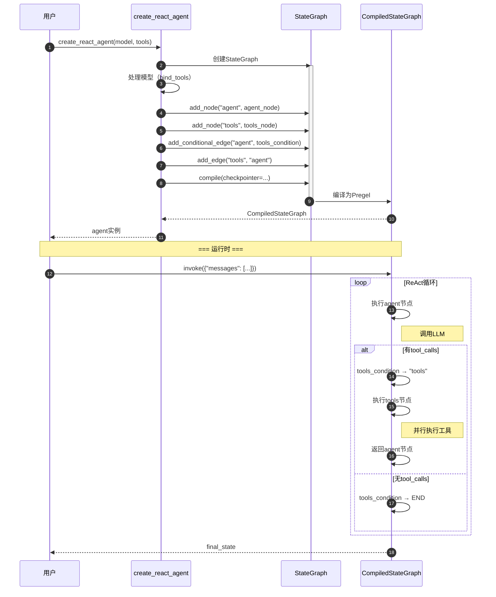
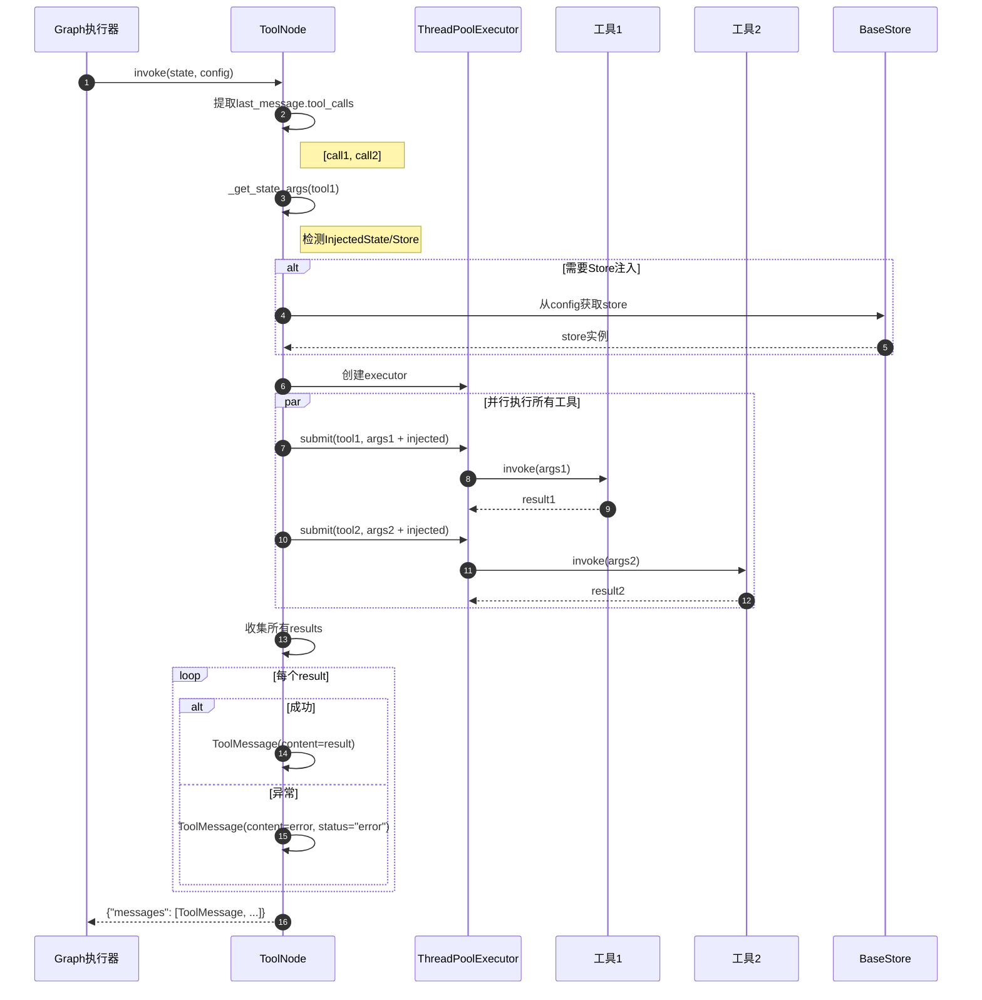

# LangGraph-03-prebuilt-API

## 一、API总览

prebuilt模块提供三类API：

1. **高级Agent构建API**
   - `create_react_agent`：创建ReAct风格的工具调用Agent

2. **工具执行API**
   - `ToolNode`：并行执行工具调用
   - `tools_condition`：基于工具调用的条件路由

3. **工具验证API**
   - `ValidationNode`：验证工具参数
   - `InjectedState`：状态注入标记
   - `InjectedStore`：存储注入标记

## 二、create_react_agent API

### 2.1 基本信息

- **名称**：`create_react_agent`
- **模块**：`langgraph.prebuilt.chat_agent_executor`
- **作用**：创建ReAct（Reasoning and Acting）风格的Agent
- **幂等性**：是（相同输入产生相同图结构）

### 2.2 函数签名

```python
def create_react_agent(
    model: LanguageModelLike | Callable[[StateSchema], LanguageModelLike],
    tools: Union[ToolNode, Sequence[BaseTool | Callable]],
    *,
    prompt: Optional[Prompt] = None,
    response_format: Optional[StructuredResponseSchema] = None,
    state_schema: Optional[StateSchemaType] = None,
    context_schema: Optional[type[ContextT]] = None,
    store: Optional[BaseStore] = None,
    checkpointer: Optional[Checkpointer] = None,
    interrupt_before: Optional[Sequence[str]] = None,
    interrupt_after: Optional[Sequence[str]] = None,
    retry_policy: Optional[RetryPolicy] = None,
    debug: bool = False,
) -> CompiledStateGraph:
    """创建ReAct Agent图"""
```

### 2.3 参数详解

| 参数 | 类型 | 必填 | 默认值 | 说明 |
|---|---|:---:|---|---|
| `model` | `LanguageModelLike \| Callable` | ✓ | - | 语言模型实例或模型选择函数 |
| `tools` | `ToolNode \| Sequence[BaseTool]` | ✓ | - | 工具列表或ToolNode实例 |
| `prompt` | `Prompt \| None` | ✗ | `None` | 系统提示词 |
| `response_format` | `StructuredResponseSchema \| None` | ✗ | `None` | 结构化响应schema |
| `state_schema` | `StateSchemaType \| None` | ✗ | `AgentState` | 自定义状态结构 |
| `context_schema` | `type[ContextT] \| None` | ✗ | `None` | 运行时上下文结构 |
| `store` | `BaseStore \| None` | ✗ | `None` | 持久化存储实例 |
| `checkpointer` | `Checkpointer \| None` | ✗ | `None` | 检查点存储器 |
| `interrupt_before` | `Sequence[str] \| None` | ✗ | `None` | 执行前中断的节点列表 |
| `interrupt_after` | `Sequence[str] \| None` | ✗ | `None` | 执行后中断的节点列表 |
| `retry_policy` | `RetryPolicy \| None` | ✗ | `None` | 重试策略 |
| `debug` | `bool` | ✗ | `False` | 是否启用调试模式 |

**参数说明**：

**model**：语言模型
- 可以是LangChain的BaseChatModel实例
- 可以是模型ID字符串（如`"anthropic:claude-3-7-sonnet-latest"`）
- 可以是函数：`(state: StateSchema) -> LanguageModelLike`，用于动态选择模型
- 如果模型支持工具调用，会自动绑定tools

**tools**：工具集合
- 可以是BaseTool列表
- 可以是Callable列表（使用`@tool`装饰器装饰）
- 可以是ToolNode实例（用于自定义工具执行）
- 工具会自动绑定到模型（如果模型支持）

**prompt**：提示词
- `SystemMessage`：静态系统消息
- `str`：静态提示词文本
- `Callable[[StateSchema], LanguageModelInput]`：动态提示词函数
- `Runnable[StateSchema, LanguageModelInput]`：可运行的提示词链

**response_format**：结构化响应
- 用于强制LLM返回特定结构的数据
- 可以是Pydantic模型或字典schema
- 会在图中添加`structured_response`节点
- 最终状态包含`structured_response`字段

**state_schema**：状态结构
- 默认为`AgentState`（包含messages和remaining_steps）
- 可以自定义状态结构，必须继承自TypedDict或BaseModel
- 必须包含`messages`字段
- 可选的`remaining_steps`字段用于限制执行步数

**context_schema**：上下文结构
- 用于定义运行时注入的上下文数据
- 通过`Runtime`类访问
- 典型用途：存储用户ID、会话ID等元数据

**store**：持久化存储
- 用于长期存储数据（超出单个会话）
- 通过`InjectedStore`注入到工具中
- 典型用途：用户偏好、历史对话、知识库

**checkpointer**：检查点存储器
- 用于保存图执行状态
- 支持暂停/恢复、时间旅行
- 常用实现：InMemorySaver、SqliteSaver、PostgresSaver

**interrupt_before/after**：中断点
- 在指定节点前后暂停执行
- 用于人工审批、中间结果查看
- 使用`invoke(None, config)`恢复执行

**retry_policy**：重试策略
- 定义节点失败时的重试行为
- 包括重试次数、退避策略、可重试异常

**debug**：调试模式
- 启用详细日志
- 显示图执行过程
- 用于开发和调试

### 2.4 返回值

| 字段 | 类型 | 说明 |
|---|---|---|
| 返回值 | `CompiledStateGraph` | 编译后的状态图，可直接调用 |

**CompiledStateGraph特性**：
- 实现`Runnable`接口
- 支持`invoke`、`ainvoke`、`stream`、`astream`
- 支持`get_state`、`update_state`、`get_state_history`
- 可导出为JSON、PNG、Mermaid图

### 2.5 核心实现代码

```python
def create_react_agent(
    model: LanguageModelLike | Callable[[StateSchema], LanguageModelLike],
    tools: Union[ToolNode, Sequence[BaseTool | Callable]],
    *,
    prompt: Optional[Prompt] = None,
    response_format: Optional[StructuredResponseSchema] = None,
    state_schema: Optional[StateSchemaType] = None,
    context_schema: Optional[type[ContextT]] = None,
    store: Optional[BaseStore] = None,
    checkpointer: Optional[Checkpointer] = None,
    interrupt_before: Optional[Sequence[str]] = None,
    interrupt_after: Optional[Sequence[str]] = None,
    retry_policy: Optional[RetryPolicy] = None,
    debug: bool = False,
) -> CompiledStateGraph:
    """创建ReAct Agent"""
    
    # ========== 步骤1：确定状态schema ==========
    if state_schema is None:
        if response_format:
            state_schema = AgentStateWithStructuredResponse
        else:
            state_schema = AgentState
    
    # ========== 步骤2：创建StateGraph ==========
    graph = StateGraph(state_schema, context_schema=context_schema)
    
    # ========== 步骤3：处理模型 ==========
    if isinstance(model, str):
        # 字符串ID：初始化聊天模型
        model = init_chat_model(model)
    
    if callable(model) and not isinstance(model, Runnable):
        # 函数：包装为动态模型选择
        model_runnable = RunnableCallable(
            model,
            name="DynamicModel",
            tags=["langchain:model"],
        )
    else:
        model_runnable = model
    
    # 绑定工具
    if should_bind_tools(model_runnable, tools):
        if isinstance(tools, ToolNode):
            tools_for_bind = list(tools.tools_by_name.values())
        else:
            tools_for_bind = tools
        
        model_runnable = model_runnable.bind_tools(tools_for_bind)
    
    # ========== 步骤4：创建agent节点 ==========
    def agent_node(state: StateSchema, config: RunnableConfig) -> dict:
        """Agent节点：调用LLM生成响应"""
        
        # 应用prompt
        if prompt:
            messages = apply_prompt(prompt, state, config)
        else:
            messages = state["messages"]
        
        # 调用模型
        response = model_runnable.invoke(messages, config)
        
        # 检查剩余步数
        remaining = state.get("remaining_steps")
        if remaining is not None and remaining < 2:
            if isinstance(response, AIMessage) and response.tool_calls:
                # 步数不足，返回错误消息
                return {
                    "messages": [
                        AIMessage(
                            content=create_error_message(
                                ErrorCode.GRAPH_RECURSION_LIMIT,
                                "Agent stopped due to max iterations.",
                            )
                        )
                    ]
                }
        
        return {"messages": [response]}
    
    # ========== 步骤5：创建tools节点 ==========
    if isinstance(tools, ToolNode):
        tools_node = tools
    else:
        tools_node = ToolNode(tools)
    
    # ========== 步骤6：添加节点 ==========
    graph.add_node("agent", agent_node, retry=retry_policy)
    graph.add_node("tools", tools_node, retry=retry_policy)
    
    # ========== 步骤7：添加边 ==========
    graph.add_edge(START, "agent")
    
    # 条件边：基于tool_calls决定下一步
    graph.add_conditional_edge(
        "agent",
        tools_condition,
        {
            "tools": "tools",
            END: END,
        },
    )
    
    graph.add_edge("tools", "agent")
    
    # ========== 步骤8：处理结构化响应 ==========
    if response_format:
        structured_response_node = create_structured_response_node(
            model_runnable, response_format
        )
        graph.add_node("structured_response", structured_response_node)
        
        # 重定向agent -> structured_response -> END
        graph.add_conditional_edge(
            "agent",
            tools_condition,
            {
                "tools": "tools",
                END: "structured_response",
            },
        )
    
    # ========== 步骤9：编译 ==========
    return graph.compile(
        checkpointer=checkpointer,
        store=store,
        interrupt_before=interrupt_before,
        interrupt_after=interrupt_after,
        debug=debug,
    )
```

**代码说明**：

1. **状态schema确定**：根据是否需要结构化响应选择默认状态类型
2. **模型处理**：支持字符串ID、模型实例、动态选择函数三种方式
3. **工具绑定**：自动将tools绑定到模型（如果模型支持）
4. **agent节点**：调用LLM，处理prompt，检查剩余步数
5. **tools节点**：使用ToolNode执行工具调用
6. **图构建**：添加节点和边，形成ReAct循环
7. **结构化响应**：如果指定response_format，添加额外节点处理
8. **编译**：使用checkpointer、store等配置编译图

### 2.6 调用链

```
用户代码
  └─> create_react_agent
        ├─> StateGraph(state_schema)
        ├─> init_chat_model(model) [如果是字符串]
        ├─> model.bind_tools(tools)
        ├─> graph.add_node("agent", agent_node)
        ├─> graph.add_node("tools", ToolNode(tools))
        ├─> graph.add_conditional_edge("agent", tools_condition)
        └─> graph.compile(checkpointer=...)
              └─> CompiledStateGraph

运行时调用链
  └─> agent.invoke(input, config)
        └─> CompiledStateGraph.invoke
              ├─> Pregel.invoke
              │     ├─> prepare_next_tasks  # 确定下一步
              │     ├─> execute_node("agent")
              │     │     ├─> apply_prompt
              │     │     ├─> model.invoke
              │     │     └─> return {"messages": [response]}
              │     ├─> tools_condition  # 条件路由
              │     └─> execute_node("tools")
              │           └─> ToolNode.invoke
              │                 ├─> 并行执行所有tool_calls
              │                 └─> return {"messages": tool_messages}
              └─> return final_state
```

### 2.7 时序图



### 2.8 异常处理与性能

**异常处理**
- **模型调用失败**：使用retry_policy自动重试
- **工具执行失败**：ToolNode捕获异常，返回错误消息给LLM
- **递归限制**：检查remaining_steps，步数不足时返回错误
- **配置错误**：参数验证，抛出ValueError

**性能考虑**
- **工具并行**：ToolNode并行执行所有tool_calls
- **流式输出**：支持stream模式，实时返回tokens
- **检查点开销**：每个超步保存状态，可能影响性能
- **提示词长度**：历史消息累积，建议定期修剪

**最佳实践**
- 使用异步模型和工具提高并发性能
- 合理设置remaining_steps避免无限循环
- 使用流式输出提升用户体验
- 定期清理消息历史避免上下文溢出

## 三、ToolNode API

### 3.1 基本信息

- **名称**：`ToolNode`
- **类型**：类（实现RunnableCallable）
- **作用**：并行执行工具调用，支持状态注入和错误处理
- **幂等性**：取决于工具本身

### 3.2 类签名

```python
class ToolNode(RunnableCallable):
    """并行执行工具调用的节点"""
    
    def __init__(
        self,
        tools: Sequence[Union[BaseTool, Callable]],
        *,
        name: str = "tools",
        tags: Optional[list[str]] = None,
        handle_tool_errors: Union[
            bool,
            str,
            Callable[[Exception], str],
            tuple[type[Exception], ...],
        ] = True,
    ) -> None:
        """初始化ToolNode"""
```

### 3.3 初始化参数

| 参数 | 类型 | 必填 | 默认值 | 说明 |
|---|---|:---:|---|---|
| `tools` | `Sequence[BaseTool \| Callable]` | ✓ | - | 工具列表 |
| `name` | `str` | ✗ | `"tools"` | 节点名称 |
| `tags` | `list[str] \| None` | ✗ | `None` | 节点标签 |
| `handle_tool_errors` | `bool \| str \| Callable \| tuple` | ✗ | `True` | 错误处理策略 |

**参数说明**：

**tools**：工具列表
- 可以是BaseTool实例
- 可以是使用`@tool`装饰的函数
- 自动构建工具名称到工具的映射

**name**：节点名称
- 用于图可视化和日志
- 建议使用描述性名称

**tags**：节点标签
- 用于过滤和跟踪
- 典型标签：`["langchain:tool"]`

**handle_tool_errors**：错误处理策略
- `True`：捕获所有异常，返回默认错误消息
- `str`：捕获所有异常，返回该字符串
- `Callable[[Exception], str]`：自定义错误格式化函数
- `tuple[type[Exception], ...]`：只捕获指定异常类型

### 3.4 invoke方法

```python
def invoke(
    self,
    input: Union[dict, list[AnyMessage], BaseMessage],
    config: RunnableConfig,
    **kwargs: Any,
) -> dict:
    """执行工具调用"""
```

**输入格式**：
- `dict`：状态字典，必须包含`messages`键
- `list[AnyMessage]`：消息列表
- `BaseMessage`：单条消息（必须是AIMessage且包含tool_calls）

**输出格式**：
```python
{
    "messages": [
        ToolMessage(
            content="工具执行结果",
            name="tool_name",
            tool_call_id="call_123",
        ),
        ...
    ]
}
```

### 3.5 核心实现代码

```python
class ToolNode(RunnableCallable):
    """并行执行工具调用"""
    
    def __init__(
        self,
        tools: Sequence[Union[BaseTool, Callable]],
        *,
        name: str = "tools",
        tags: Optional[list[str]] = None,
        handle_tool_errors: Union[
            bool, str, Callable, tuple[type[Exception], ...]
        ] = True,
    ) -> None:
        super().__init__(func=self._func, name=name, tags=tags, trace=False)
        
        # 构建工具映射
        self.tools_by_name: dict[str, BaseTool] = {}
        for tool in tools:
            if isinstance(tool, BaseTool):
                self.tools_by_name[tool.name] = tool
            elif callable(tool):
                # 使用@tool装饰器包装
                wrapped = cast(BaseTool, tool)
                self.tools_by_name[wrapped.name] = wrapped
        
        self.handle_tool_errors = handle_tool_errors
    
    def invoke(
        self,
        input: Union[dict, list[AnyMessage], BaseMessage],
        config: RunnableConfig,
        **kwargs: Any,
    ) -> dict:
        """执行工具调用"""
        
        # ========== 步骤1：提取消息 ==========
        if isinstance(input, dict):
            messages = input["messages"]
            state = input
        elif isinstance(input, list):
            messages = input
            state = {"messages": messages}
        else:
            messages = [input]
            state = {"messages": messages}
        
        # ========== 步骤2：获取最后一条AIMessage ==========
        last_message = messages[-1]
        if not isinstance(last_message, AIMessage):
            raise ValueError(
                f"Last message must be AIMessage, got {type(last_message)}"
            )
        
        tool_calls = last_message.tool_calls
        if not tool_calls:
            raise ValueError("AIMessage must have tool_calls")
        
        # ========== 步骤3：提取注入参数 ==========
        injected_store = config.get("configurable", {}).get("__store__")
        
        # 为每个工具提取需要的注入参数
        tools_with_state_args = {}
        for tool_name, tool in self.tools_by_name.items():
            state_args = _get_state_args(tool.func if hasattr(tool, 'func') else tool, state, injected_store)
            tools_with_state_args[tool_name] = state_args
        
        # ========== 步骤4：并行执行工具 ==========
        with get_executor_for_config(config) as executor:
            futures = []
            
            for tool_call in tool_calls:
                tool_name = tool_call["name"]
                
                # 检查工具是否存在
                if tool_name not in self.tools_by_name:
                    if self.handle_tool_errors:
                        error_msg = INVALID_TOOL_NAME_ERROR_TEMPLATE.format(
                            requested_tool=tool_name,
                            available_tools=", ".join(self.tools_by_name.keys()),
                        )
                        futures.append((
                            None,
                            tool_call,
                            ToolMessage(
                                content=error_msg,
                                name=tool_name,
                                tool_call_id=tool_call["id"],
                                status="error",
                            ),
                        ))
                        continue
                    else:
                        raise ValueError(
                            f"Tool {tool_name} not found. "
                            f"Available: {list(self.tools_by_name.keys())}"
                        )
                
                tool = self.tools_by_name[tool_name]
                
                # 合并参数：tool_call.args + 注入参数
                args = {**tool_call["args"], **tools_with_state_args[tool_name]}
                
                # 提交任务
                future = executor.submit(self._execute_tool, tool, args, config)
                futures.append((future, tool_call, None))
            
            # ========== 步骤5：收集结果 ==========
            tool_messages = []
            
            for future_or_none, tool_call, error_message in futures:
                if error_message:
                    # 工具不存在的错误消息
                    tool_messages.append(error_message)
                    continue
                
                try:
                    # 等待结果
                    result = future_or_none.result()
                    
                    # 格式化为ToolMessage
                    tool_messages.append(
                        ToolMessage(
                            content=msg_content_output(result),
                            name=tool_call["name"],
                            tool_call_id=tool_call["id"],
                        )
                    )
                
                except Exception as e:
                    # ========== 步骤6：错误处理 ==========
                    if not self._should_handle_error(e):
                        raise
                    
                    error_content = _handle_tool_error(
                        e, flag=self.handle_tool_errors
                    )
                    
                    tool_messages.append(
                        ToolMessage(
                            content=error_content,
                            name=tool_call["name"],
                            tool_call_id=tool_call["id"],
                            status="error",
                        )
                    )
        
        # ========== 步骤7：返回结果 ==========
        return {"messages": tool_messages}
    
    def _execute_tool(
        self,
        tool: BaseTool,
        args: dict,
        config: RunnableConfig,
    ) -> Any:
        """执行单个工具"""
        return tool.invoke(args, config)
    
    def _should_handle_error(self, error: Exception) -> bool:
        """判断是否应该处理该错误"""
        if isinstance(self.handle_tool_errors, tuple):
            # 只处理指定类型的异常
            return isinstance(error, self.handle_tool_errors)
        return bool(self.handle_tool_errors)
```

**代码说明**：

1. **消息提取**：支持dict、list、单条消息三种输入格式
2. **AIMessage验证**：确保最后一条消息包含tool_calls
3. **状态注入**：使用`_get_state_args`提取InjectedState和InjectedStore参数
4. **并行执行**：使用ThreadPoolExecutor并行执行所有工具
5. **结果收集**：等待所有future完成，收集ToolMessage列表
6. **错误处理**：根据handle_tool_errors策略处理异常
7. **返回格式**：返回`{"messages": [...]}`更新状态

### 3.6 调用链

```
用户代码
  └─> ToolNode(tools)
        ├─> 构建tools_by_name映射
        └─> RunnableCallable.__init__

运行时调用链
  └─> tool_node.invoke(state, config)
        ├─> 提取messages
        ├─> 获取last_message.tool_calls
        ├─> _get_state_args  # 提取注入参数
        ├─> ThreadPoolExecutor
        │     ├─> submit(tool1.invoke, args1)
        │     ├─> submit(tool2.invoke, args2)
        │     └─> ...
        ├─> future.result()  # 等待所有结果
        ├─> 格式化为ToolMessage
        └─> return {"messages": tool_messages}
```

### 3.7 时序图



### 3.8 异常处理与性能

**异常处理**
- **工具不存在**：返回错误消息，提示可用工具列表
- **工具执行失败**：根据handle_tool_errors策略处理
- **参数验证失败**：由工具自身处理，或使用ValidationNode预先验证
- **注入失败**：如果store不可用但工具需要，会抛出异常

**性能优化**
- **并行执行**：所有tool_calls并行执行，减少总时间
- **线程池**：使用ThreadPoolExecutor复用线程
- **异步支持**：通过ainvoke使用asyncio提高并发
- **缓存**：工具可以内部使用缓存避免重复计算

## 四、tools_condition API

### 4.1 基本信息

- **名称**：`tools_condition`
- **类型**：函数
- **作用**：条件路由函数，根据是否有tool_calls决定下一步
- **幂等性**：是（纯函数）

### 4.2 函数签名

```python
def tools_condition(
    state: Union[list[AnyMessage], dict[str, Any]],
) -> Literal["tools", "__end__"]:
    """根据tool_calls决定路由"""
```

### 4.3 参数详解

| 参数 | 类型 | 必填 | 说明 |
|---|---|:---:|---|
| `state` | `list[AnyMessage] \| dict` | ✓ | 图状态或消息列表 |

### 4.4 返回值

| 值 | 说明 |
|---|---|
| `"tools"` | 有tool_calls，执行tools节点 |
| `"__end__"` | 无tool_calls，结束执行 |

### 4.5 核心实现代码

```python
def tools_condition(
    state: Union[list[AnyMessage], dict[str, Any]],
) -> Literal["tools", "__end__"]:
    """条件路由：根据tool_calls决定下一步
    
    参数：
        state: 图状态（dict）或消息列表（list）
        
    返回：
        "tools": 有工具调用，执行tools节点
        "__end__": 无工具调用，结束图执行
        
    算法：
    1. 提取messages
    2. 检查最后一条消息是否为AIMessage
    3. 检查是否有tool_calls
    4. 返回路由目标
    """
    # 步骤1：提取消息
    if isinstance(state, list):
        messages = state
    else:
        messages = state.get("messages", [])
    
    # 步骤2：检查消息列表
    if not messages:
        return END
    
    # 步骤3：获取最后一条消息
    last_message = messages[-1]
    
    # 步骤4：类型检查
    if not isinstance(last_message, AIMessage):
        return END
    
    # 步骤5：检查tool_calls
    if not last_message.tool_calls:
        return END
    
    # 步骤6：有tool_calls，路由到tools节点
    return "tools"
```

**代码说明**：
- 简单的条件判断，时间复杂度O(1)
- 只检查最后一条消息
- 适用于绝大多数场景

### 4.6 使用示例

```python
graph.add_conditional_edge(
    "agent",
    tools_condition,
    {
        "tools": "tools",  # 有tool_calls -> tools节点
        END: END,          # 无tool_calls -> 结束
    },
)
```

## 五、ValidationNode API

### 5.1 基本信息

- **名称**：`ValidationNode`
- **类型**：类（实现RunnableCallable）
- **作用**：验证工具参数，捕获Pydantic验证错误
- **幂等性**：是（纯验证逻辑）

### 5.2 类签名

```python
class ValidationNode(RunnableCallable):
    """验证工具参数"""
    
    def __init__(
        self,
        tools: Sequence[BaseTool],
        *,
        format_error: Optional[Callable[[ValidationError], str]] = None,
    ) -> None:
        """初始化ValidationNode"""
```

### 5.3 参数详解

| 参数 | 类型 | 必填 | 说明 |
|---|---|:---:|---|
| `tools` | `Sequence[BaseTool]` | ✓ | 工具列表 |
| `format_error` | `Callable \| None` | ✗ | 自定义错误格式化函数 |

### 5.4 核心实现代码

```python
class ValidationNode(RunnableCallable):
    """验证工具参数"""
    
    def __init__(
        self,
        tools: Sequence[BaseTool],
        *,
        format_error: Optional[Callable[[ValidationError], str]] = None,
    ) -> None:
        super().__init__(func=self._func, name="validation")
        
        # 构建工具schema映射
        self.schemas_by_tool: dict[str, type[BaseModel]] = {}
        for tool in tools:
            if tool.args_schema:
                self.schemas_by_tool[tool.name] = tool.args_schema
        
        self.format_error = format_error or self._default_format_error
    
    def invoke(
        self,
        input: Union[dict, list[AnyMessage]],
        config: RunnableConfig,
    ) -> dict:
        """验证工具参数"""
        
        # 提取消息
        if isinstance(input, dict):
            messages = input["messages"]
        else:
            messages = input
        
        last_message = messages[-1]
        if not isinstance(last_message, AIMessage):
            return {}
        
        tool_calls = last_message.tool_calls
        if not tool_calls:
            return {}
        
        # 验证每个tool_call
        validation_errors = []
        
        for tool_call in tool_calls:
            tool_name = tool_call["name"]
            
            if tool_name not in self.schemas_by_tool:
                # 没有schema，跳过验证
                continue
            
            schema = self.schemas_by_tool[tool_name]
            
            try:
                # 使用Pydantic验证
                schema(**tool_call["args"])
            except ValidationError as e:
                # 验证失败
                error_msg = self.format_error(e)
                validation_errors.append(
                    ToolMessage(
                        content=error_msg,
                        name=tool_name,
                        tool_call_id=tool_call["id"],
                        status="error",
                    )
                )
        
        if validation_errors:
            return {"messages": validation_errors}
        
        return {}
    
    def _default_format_error(self, error: ValidationError) -> str:
        """默认错误格式化"""
        errors = []
        for err in error.errors():
            field = ".".join(str(loc) for loc in err["loc"])
            errors.append(f"{field}: {err['msg']}")
        return "Validation errors:\n" + "\n".join(errors)
```

### 5.5 使用示例

```python
from pydantic import BaseModel, Field

class SearchArgs(BaseModel):
    query: str = Field(..., min_length=1, description="搜索查询")
    max_results: int = Field(10, ge=1, le=100, description="最大结果数")

@tool(args_schema=SearchArgs)
def search(query: str, max_results: int = 10) -> str:
    """搜索信息"""
    return f"搜索结果: {query}"

# 创建ValidationNode
validation_node = ValidationNode([search])

# 添加到图中
graph.add_node("validate", validation_node)
graph.add_edge("agent", "validate")
graph.add_conditional_edge("validate", validate_condition, {
    "tools": "tools",
    "agent": "agent",  # 验证失败，返回agent重试
})
```

## 六、InjectedState 和 InjectedStore API

### 6.1 基本信息

- **名称**：`InjectedState`、`InjectedStore`
- **类型**：类型标记
- **作用**：标记工具参数需要注入图状态或存储
- **幂等性**：不适用（仅标记）

### 6.2 使用方式

```python
from langgraph.prebuilt import InjectedState, InjectedStore
from typing import Annotated

@tool
def my_tool(
    query: str,
    state: Annotated[dict, InjectedState],
    store: Annotated[BaseStore, InjectedStore],
) -> str:
    """工具函数，自动注入state和store"""
    user_id = state.get("user_id")
    user_prefs = store.get(("users", user_id), "preferences")
    return f"搜索 {query} for user {user_id}"
```

### 6.3 工作原理

```python
def _get_state_args(
    func: Callable,
    state: dict,
    store: Optional[BaseStore],
) -> dict[str, Any]:
    """提取需要注入的参数"""
    
    type_hints = get_type_hints(func, include_extras=True)
    injected = {}
    
    for param_name, param_type in type_hints.items():
        if get_origin(param_type) is Annotated:
            args = get_args(param_type)
            annotations = args[1:]
            
            if InjectedState in annotations:
                injected[param_name] = state
            elif InjectedStore in annotations:
                if store is None:
                    raise ValueError("Store not available but required")
                injected[param_name] = store
    
    return injected
```

**关键点**：
- 使用`Annotated`和类型提示标记
- ToolNode在执行前提取注入参数
- 注入的参数不会出现在tool_calls中，对LLM透明

## 七、API使用最佳实践

### 7.1 选择合适的API

**使用create_react_agent的场景**：
- 快速原型开发
- 标准的ReAct工具调用Agent
- 需要检查点和人工审批

**直接使用ToolNode的场景**：
- 自定义图结构
- 需要特殊的工具执行逻辑
- 与其他节点组合

**使用ValidationNode的场景**：
- 工具参数复杂，需要严格验证
- 想在执行前捕获错误
- 减少不必要的工具调用

### 7.2 错误处理策略

```python
# 策略1：捕获所有异常，返回友好消息
tool_node = ToolNode(tools, handle_tool_errors=True)

# 策略2：自定义错误消息
tool_node = ToolNode(
    tools,
    handle_tool_errors="工具暂时不可用，请稍后重试"
)

# 策略3：自定义错误格式化
def format_error(e: Exception) -> str:
    if isinstance(e, APIError):
        return f"API错误: {e.message}. 请尝试其他工具。"
    return f"错误: {str(e)}"

tool_node = ToolNode(tools, handle_tool_errors=format_error)

# 策略4：只捕获特定异常
tool_node = ToolNode(
    tools,
    handle_tool_errors=(TimeoutError, ConnectionError)
)
```

### 7.3 性能优化技巧

**使用异步**
```python
# 异步工具
@tool
async def async_search(query: str) -> str:
    async with httpx.AsyncClient() as client:
        response = await client.get(f"api?q={query}")
        return response.text

# 异步调用
result = await agent.ainvoke(input, config)
```

**工具缓存**
```python
from functools import lru_cache

@tool
@lru_cache(maxsize=1000)
def cached_tool(arg: str) -> str:
    return expensive_computation(arg)
```

**批处理**
```python
@tool
def batch_search(queries: list[str]) -> list[str]:
    """批量搜索，减少API调用"""
    return [search(q) for q in queries]
```

## 八、总结

prebuilt模块的API设计体现了以下原则：

1. **简单易用**：create_react_agent一行代码创建Agent
2. **灵活扩展**：支持自定义state、prompt、hooks
3. **强大功能**：工具并行、状态注入、错误处理
4. **生产就绪**：检查点、重试、中断等企业级特性

通过合理使用这些API，可以快速构建强大的AI Agent应用。

