# LangGraph-03-prebuilt-数据结构

## 一、数据结构总览

prebuilt模块的数据结构主要分为三类：

1. **状态结构**：定义Agent的执行状态
2. **配置结构**：定义Agent的行为参数
3. **工具调用结构**：定义工具调用的格式

## 二、核心数据结构

### 2.1 AgentState

```python
class AgentState(TypedDict):
    """Agent的执行状态"""
    
    messages: Annotated[Sequence[BaseMessage], add_messages]
    remaining_steps: NotRequired[RemainingSteps]
```

**UML类图**：

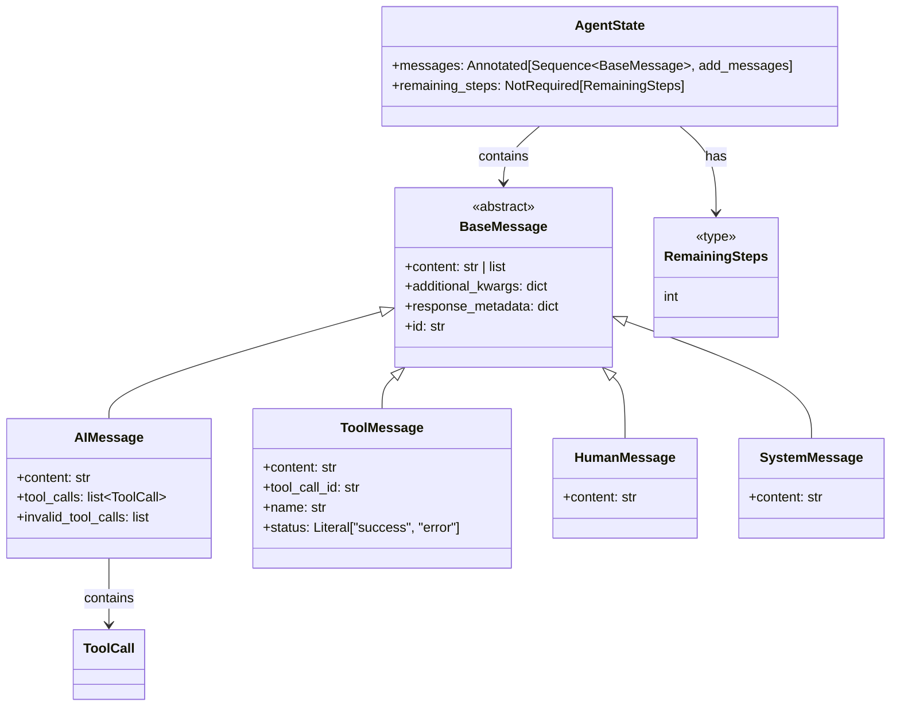

**字段说明**：

**messages**：消息列表
- 类型：`Annotated[Sequence[BaseMessage], add_messages]`
- 作用：存储对话历史
- Reducer：`add_messages`合并新旧消息
- 约束：必须字段，初始化时至少包含一条消息

**remaining_steps**：剩余步数
- 类型：`NotRequired[RemainingSteps]`（int）
- 作用：限制Agent的最大执行步数
- 计算：`recursion_limit - current_step`
- 默认：25（在AgentStatePydantic中）
- 约束：当remaining_steps < 2且有tool_calls时，返回错误消息

**版本演进**：
- v0.1：仅包含messages
- v0.2：添加remaining_steps，防止无限循环
- 未来：可能添加context、metadata等字段

### 2.2 AgentStateWithStructuredResponse

```python
class AgentStateWithStructuredResponse(AgentState):
    """带结构化响应的Agent状态"""
    
    structured_response: StructuredResponse
```

**UML类图**：

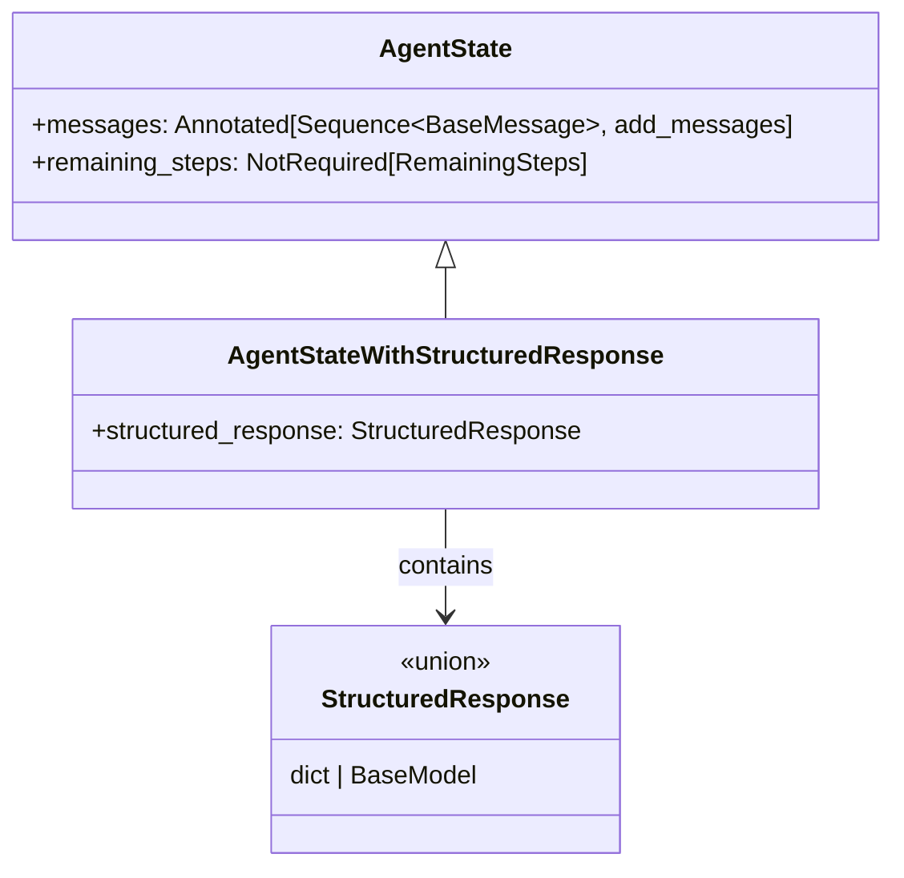

**字段说明**：

**structured_response**：结构化响应
- 类型：`Union[dict, BaseModel]`
- 作用：存储LLM生成的结构化输出
- 使用场景：需要强制LLM返回特定格式的数据
- 生成时机：Agent循环结束后，由`structured_response`节点生成

**使用示例**：

```python
from pydantic import BaseModel

class SearchResult(BaseModel):
    title: str
    url: str
    summary: str

agent = create_react_agent(
    model=model,
    tools=tools,
    response_format=SearchResult,
)

result = agent.invoke({"messages": [{"role": "user", "content": "搜索Python"}]})
print(result["structured_response"])
# SearchResult(title="Python官网", url="https://python.org", summary="...")
```

### 2.3 ToolCall

```python
class ToolCall(TypedDict):
    """工具调用结构"""
    
    name: str
    args: dict[str, Any]
    id: str
    type: Literal["tool_call"]
```

**UML类图**：

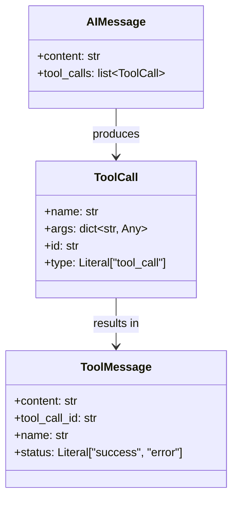

**字段说明**：

**name**：工具名称
- 类型：`str`
- 作用：标识要调用的工具
- 约束：必须在tools列表中存在
- 示例：`"search"`、`"calculator"`

**args**：工具参数
- 类型：`dict[str, Any]`
- 作用：工具调用的参数
- 约束：必须与工具的参数schema匹配
- 示例：`{"query": "Python", "max_results": 10}`

**id**：调用ID
- 类型：`str`
- 作用：唯一标识一次工具调用
- 约束：必须唯一，用于匹配ToolMessage
- 示例：`"call_abc123"`

**type**：类型标记
- 类型：`Literal["tool_call"]`
- 作用：标识这是一个工具调用
- 约束：固定为`"tool_call"`

**关系说明**：
1. LLM在AIMessage中生成tool_calls
2. ToolNode执行tool_calls
3. 每个tool_call产生一个ToolMessage
4. ToolMessage.tool_call_id对应ToolCall.id

### 2.4 InjectedState 和 InjectedStore

```python
class InjectedState:
    """状态注入标记"""
    pass

class InjectedStore:
    """存储注入标记"""
    pass
```

**UML类图**：

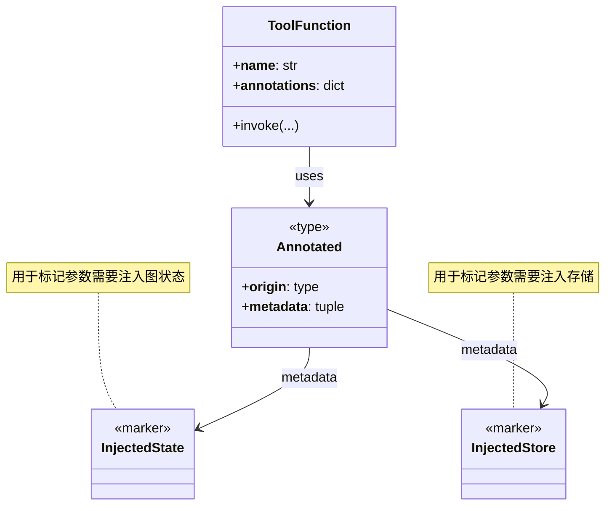

**使用说明**：

**InjectedState**：注入图状态
- 使用方式：`Annotated[dict, InjectedState]`
- 注入内容：当前图状态（包含messages等）
- 访问权限：只读，修改不会影响图状态

**InjectedStore**：注入存储
- 使用方式：`Annotated[BaseStore, InjectedStore]`
- 注入内容：BaseStore实例
- 访问权限：读写，可以持久化数据

**使用示例**：

```python
from langgraph.prebuilt import InjectedState, InjectedStore
from typing import Annotated

@tool
def my_tool(
    query: str,
    state: Annotated[dict, InjectedState],
    store: Annotated[BaseStore, InjectedStore],
) -> str:
    """工具函数，自动注入state和store"""
    
    # 访问图状态
    user_id = state.get("user_id")
    messages = state.get("messages", [])
    
    # 访问存储
    user_prefs = store.get(("users", user_id), "preferences")
    
    # 保存数据
    store.put(
        namespace=("logs", user_id),
        key="last_query",
        value={"query": query, "timestamp": datetime.now()},
    )
    
    return f"搜索 {query} for user {user_id}"
```

**注入机制**：

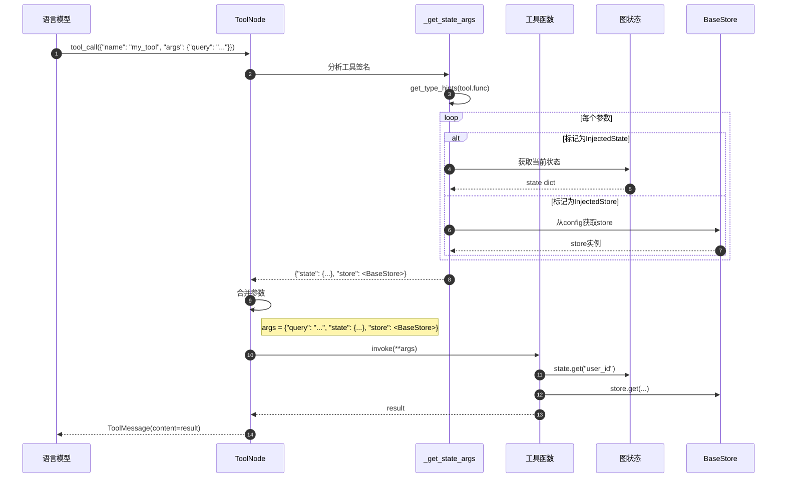

### 2.5 RetryPolicy

```python
class RetryPolicy(TypedDict, total=False):
    """重试策略配置"""
    
    max_attempts: int
    backoff_factor: float
    jitter: bool
    retry_on: tuple[type[Exception], ...]
```

**UML类图**：

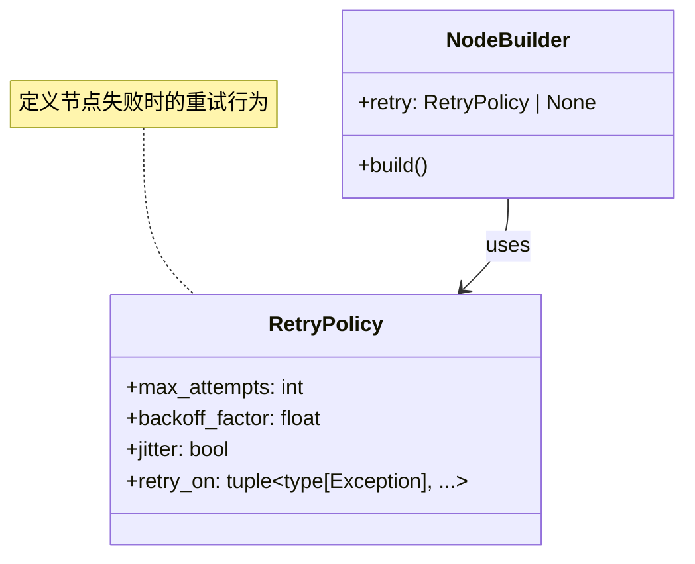

**字段说明**：

**max_attempts**：最大尝试次数
- 类型：`int`
- 默认：3
- 作用：包含首次尝试，最多尝试几次
- 示例：max_attempts=3表示首次+2次重试

**backoff_factor**：退避因子
- 类型：`float`
- 默认：2.0
- 作用：每次重试的等待时间倍数
- 计算：wait_time = backoff_factor ** (attempt - 1)

**jitter**：随机抖动
- 类型：`bool`
- 默认：True
- 作用：在等待时间上添加随机抖动，避免雷鸣羊群效应

**retry_on**：可重试异常
- 类型：`tuple[type[Exception], ...]`
- 默认：`(Exception,)`
- 作用：只有这些异常会触发重试
- 示例：`(TimeoutError, ConnectionError)`

**使用示例**：

```python
from langgraph.prebuilt import create_react_agent

retry_policy = {
    "max_attempts": 5,
    "backoff_factor": 2.0,
    "jitter": True,
    "retry_on": (TimeoutError, ConnectionError),
}

agent = create_react_agent(
    model=model,
    tools=tools,
    retry_policy=retry_policy,
)
```

## 三、消息类型

### 3.1 BaseMessage及其子类

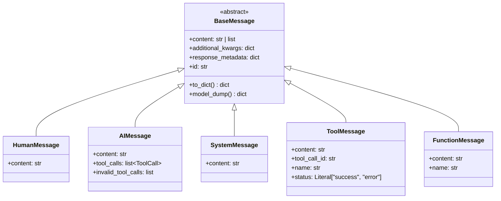

**BaseMessage**：消息基类
- `content`：消息内容，可以是字符串或内容块列表
- `additional_kwargs`：额外的模型特定参数
- `response_metadata`：响应元数据
- `id`：消息唯一ID

**HumanMessage**：用户消息
- 表示来自用户的输入
- 通常是对话的起点

**AIMessage**：AI消息
- 表示LLM生成的响应
- `tool_calls`：LLM决定调用的工具列表
- `invalid_tool_calls`：解析失败的工具调用

**SystemMessage**：系统消息
- 表示系统提示词
- 通常放在消息列表开头

**ToolMessage**：工具消息
- 表示工具执行的结果
- `tool_call_id`：对应的tool_call的id
- `name`：工具名称
- `status`：执行状态（success或error）

**FunctionMessage**：函数消息（已废弃）
- OpenAI旧版API的函数调用结果
- 建议使用ToolMessage替代

### 3.2 消息流转

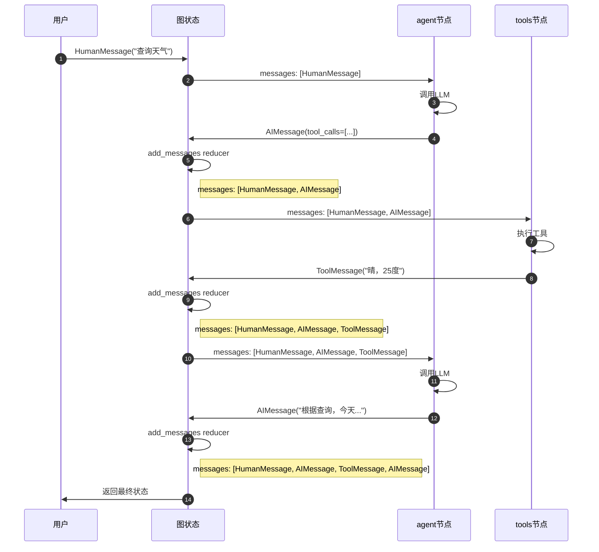

## 四、配置结构

### 4.1 RunnableConfig

```python
class RunnableConfig(TypedDict, total=False):
    """运行时配置"""
    
    tags: list[str]
    metadata: dict[str, Any]
    callbacks: Callbacks
    run_name: str
    max_concurrency: int | None
    recursion_limit: int
    configurable: dict[str, Any]
```

**UML类图**：

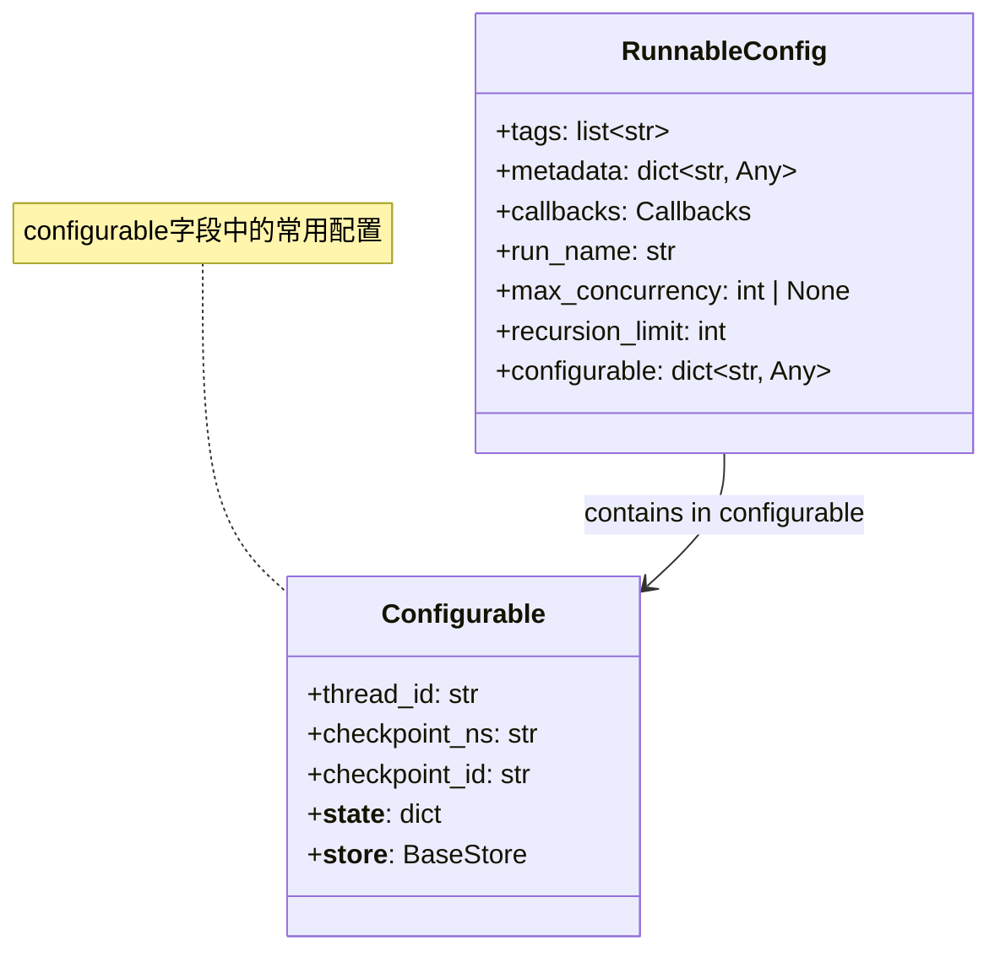

**字段说明**：

**tags**：标签
- 用于过滤和追踪运行
- 示例：`["langchain:agent", "production"]`

**metadata**：元数据
- 任意附加信息
- 示例：`{"user_id": "123", "session": "abc"}`

**callbacks**：回调函数
- 用于监控执行过程
- 示例：LangSmith回调、自定义日志

**run_name**：运行名称
- 用于标识这次运行
- 在LangSmith中显示

**max_concurrency**：最大并发
- 限制并发执行的任务数
- None表示不限制

**recursion_limit**：递归限制
- 图的最大执行步数
- 默认：25

**configurable**：可配置项
- `thread_id`：线程ID，用于检查点
- `checkpoint_ns`：检查点命名空间
- `checkpoint_id`：检查点ID
- `__state__`：内部使用，当前图状态
- `__store__`：内部使用，存储实例

### 4.2 使用示例

```python
config = {
    "tags": ["production", "user-123"],
    "metadata": {"user_id": "123", "session": "abc"},
    "run_name": "查询天气",
    "recursion_limit": 50,
    "configurable": {
        "thread_id": "user-123-session-abc",
    },
}

result = agent.invoke({"messages": [...]}, config)
```

## 五、工具相关结构

### 5.1 BaseTool

```python
class BaseTool(BaseModel, Runnable):
    """工具基类"""
    
    name: str
    description: str
    args_schema: type[BaseModel] | None = None
    
    def invoke(
        self,
        input: Union[str, dict, BaseModel],
        config: RunnableConfig | None = None,
    ) -> Any:
        """执行工具"""
        ...
    
    async def ainvoke(
        self,
        input: Union[str, dict, BaseModel],
        config: RunnableConfig | None = None,
    ) -> Any:
        """异步执行工具"""
        ...
```

**UML类图**：

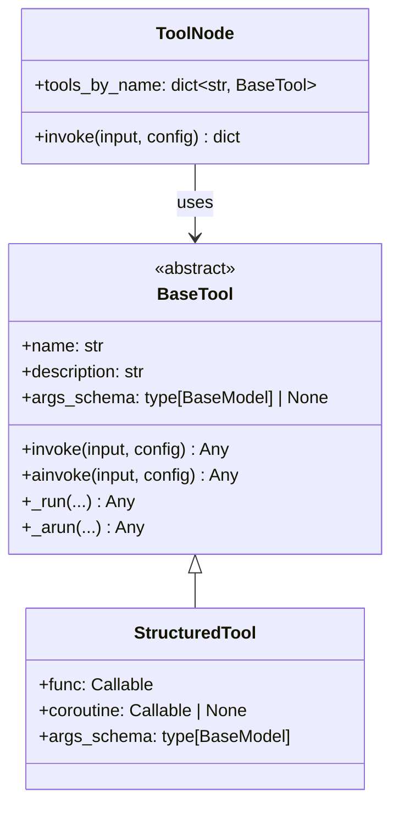

**字段说明**：

**name**：工具名称
- 必须唯一
- LLM通过name调用工具
- 示例：`"search"`、`"calculator"`

**description**：工具描述
- 向LLM解释工具的用途
- 应该清晰具体
- 示例：`"搜索互联网信息，返回相关结果"`

**args_schema**：参数schema
- Pydantic模型，定义工具参数
- 用于参数验证和生成工具spec
- None表示无参数或使用函数签名

**创建工具的方式**：

```python
# 方式1：使用@tool装饰器
from langchain_core.tools import tool

@tool
def my_tool(query: str, max_results: int = 10) -> str:
    """搜索信息"""
    return search_api(query, max_results)

# 方式2：使用StructuredTool
from langchain_core.tools import StructuredTool
from pydantic import BaseModel, Field

class SearchArgs(BaseModel):
    query: str = Field(description="搜索查询词")
    max_results: int = Field(10, description="最大结果数")

tool = StructuredTool.from_function(
    func=search_api,
    name="search",
    description="搜索信息",
    args_schema=SearchArgs,
)

# 方式3：继承BaseTool
class MyTool(BaseTool):
    name: str = "my_tool"
    description: str = "我的工具"
    
    def _run(self, query: str) -> str:
        return search_api(query)
    
    async def _arun(self, query: str) -> str:
        return await async_search_api(query)
```

## 六、数据结构关系总览

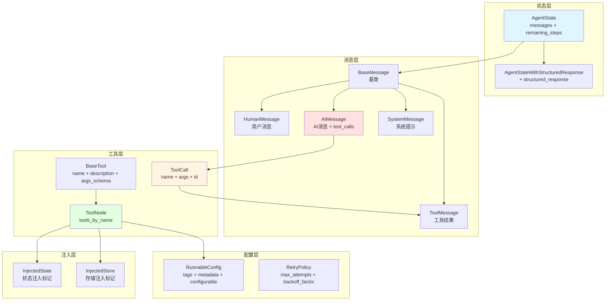

## 七、数据结构演进

### 7.1 v1 vs v2

**v1版本（2023）**：
- 仅包含`messages`
- 无步数限制
- 简单的消息累积

**v2版本（2024）**：
- 添加`remaining_steps`
- 支持结构化响应
- 支持状态注入
- 更丰富的配置选项

**未来演进方向**：
- 更细粒度的状态控制
- 更强大的工具能力
- 更好的类型安全性

### 7.2 兼容性

**向后兼容**：
- 旧版状态仍然支持
- 新字段都是可选的
- API保持稳定

**最佳实践**：
- 使用TypedDict定义状态
- 使用Pydantic定义工具参数
- 使用类型提示提高代码质量

## 八、总结

prebuilt模块的数据结构设计体现了以下原则：

1. **类型安全**：广泛使用TypedDict和Pydantic
2. **可扩展**：状态和配置都支持扩展
3. **简洁**：核心结构简单明了
4. **向后兼容**：新功能不破坏旧代码

通过理解这些数据结构，可以更好地使用prebuilt模块构建Agent应用。

