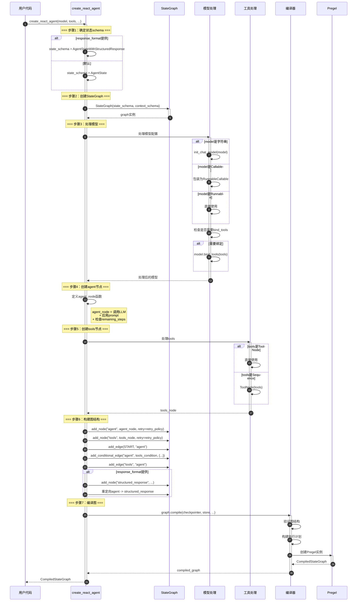
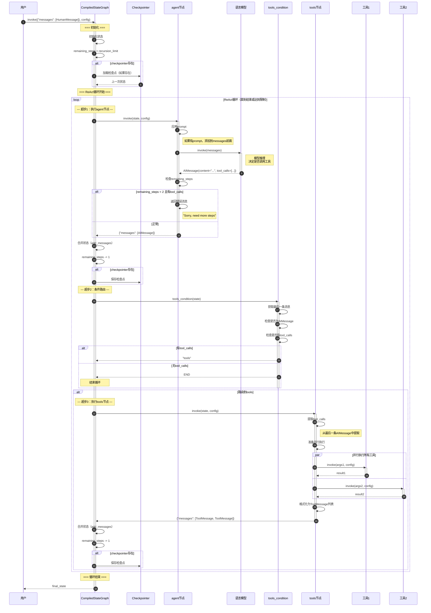
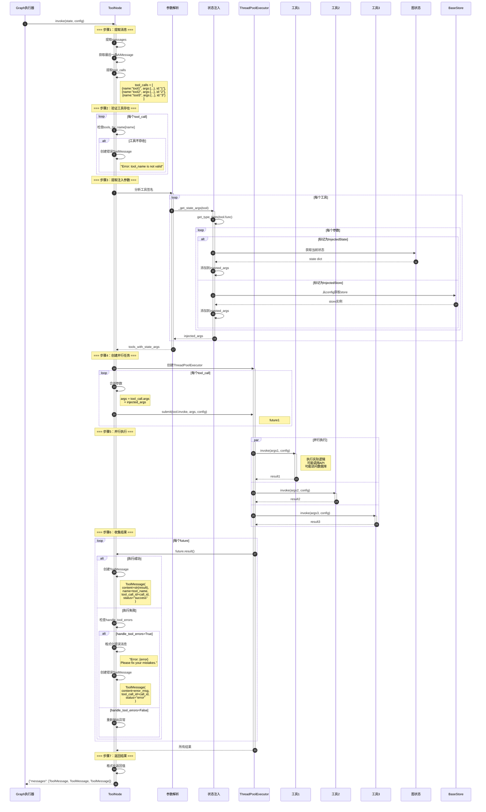
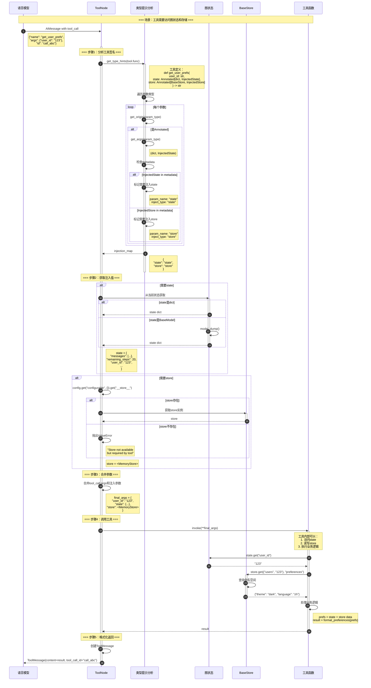
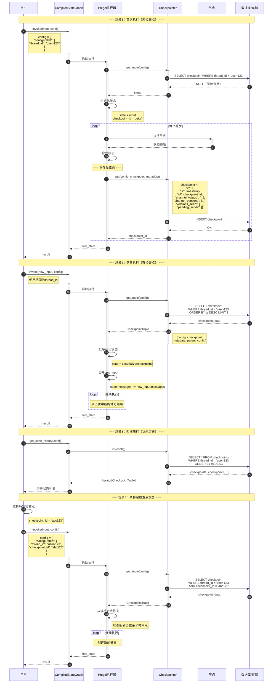
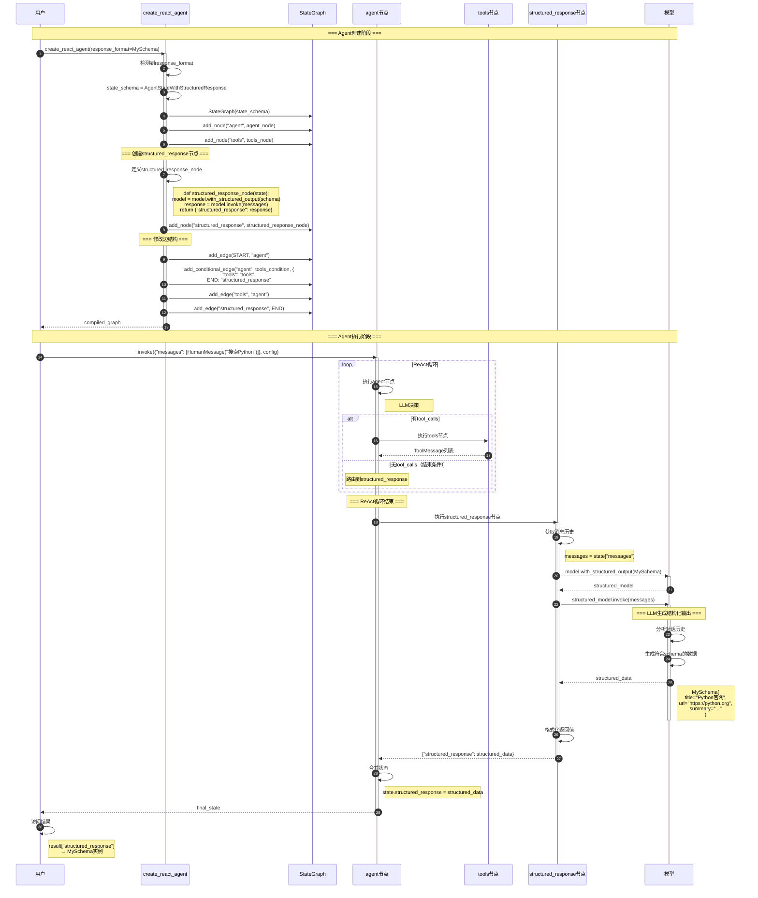

# LangGraph-03-prebuilt-时序图

## 一、时序图总览

本文档提供prebuilt模块各个场景的详细时序图，涵盖：

1. **Agent创建流程**：create_react_agent的完整执行过程
2. **ReAct循环执行**：Agent运行时的完整流程
3. **工具并行执行**：ToolNode如何并行执行多个工具
4. **状态注入机制**：InjectedState和InjectedStore的工作原理
5. **检查点保存与恢复**：持久化和恢复Agent状态
6. **人工审批流程**：interrupt实现人工介入
7. **结构化响应生成**：response_format的处理流程

## 二、Agent创建流程

### 2.1 完整创建时序图



### 2.2 文字说明

#### 2.2.1 图意概述

该时序图展示了`create_react_agent`函数的完整执行流程，从用户调用到返回编译后的图。核心步骤包括状态schema确定、图结构创建、模型和工具处理、节点添加、边连接以及最终编译。

#### 2.2.2 关键步骤

**状态schema确定**：
- 根据是否提供`response_format`选择状态类型
- `AgentState`：标准状态（messages + remaining_steps）
- `AgentStateWithStructuredResponse`：带结构化响应的状态

**模型处理**：
- 字符串ID：使用`init_chat_model`初始化
- Callable：包装为RunnableCallable支持动态选择
- Runnable：直接使用
- 自动检测并绑定工具（bind_tools）

**节点创建**：
- `agent`节点：调用LLM，应用prompt，检查remaining_steps
- `tools`节点：执行工具调用
- 可选`structured_response`节点：生成结构化输出

**图结构**：
- START → agent：开始执行
- agent → tools（条件边）：有tool_calls时
- agent → END（条件边）：无tool_calls时
- tools → agent：工具执行后继续

#### 2.2.3 边界与异常

**参数验证**：
- model必须是有效的模型或Callable
- tools必须是BaseTool序列或ToolNode
- state_schema必须包含messages字段

**工具绑定**：
- 如果模型已绑定工具，验证工具列表一致性
- 不支持bind_tools的模型会跳过绑定

**编译失败**：
- 图结构不完整（缺少节点或边）
- 循环引用
- 节点名称冲突

#### 2.2.4 性能考虑

**创建开销**：
- 一次性开销，通常<100ms
- 模型初始化可能较慢（特别是远程模型）
- 建议复用创建的agent实例

**内存占用**：
- 图结构：通常<1MB
- 模型：取决于模型类型（本地模型可能很大）
- 建议使用单例模式管理agent实例

#### 2.2.5 版本兼容

**v1 vs v2**：
- v1：简单的agent → tools → agent循环
- v2：支持pre_model_hook、post_model_hook、Send API
- 默认使用v2，可通过`version="v1"`切换

## 三、ReAct循环执行

### 3.1 标准执行流程



### 3.2 文字说明

#### 3.2.1 图意概述

该时序图展示了ReAct Agent的完整执行流程，包括agent节点调用LLM、条件路由判断、tools节点并行执行工具的循环过程。每个"超步"（superstep）都会更新状态和remaining_steps，并可选地保存检查点。

#### 3.2.2 关键概念

**超步（Superstep）**：
- Pregel算法的基本执行单元
- 每个超步执行一个或多个节点
- 超步之间保存状态快照

**ReAct循环**：
1. **Reasoning**：LLM推理，决定调用哪些工具
2. **Acting**：执行工具调用
3. **循环**：将工具结果反馈给LLM，继续推理

**remaining_steps**：
- 初始值：`recursion_limit`（默认25）
- 每个超步递减
- <2且有tool_calls时返回错误

#### 3.2.3 边界与异常

**递归限制**：
- remaining_steps < 2时，拒绝新的工具调用
- 防止无限循环
- 返回友好的错误消息而非抛出异常

**工具执行失败**：
- ToolNode捕获异常
- 返回ToolMessage with status="error"
- LLM可以看到错误信息并重试

**模型调用失败**：
- 使用RetryPolicy自动重试
- 最终失败会抛出异常
- checkpointer会保存失败前的状态

#### 3.2.4 性能考虑

**并行执行**：
- 同一AIMessage中的所有tool_calls并行执行
- 使用ThreadPoolExecutor或asyncio
- 显著减少总执行时间

**检查点开销**：
- 每个超步保存一次
- 序列化/反序列化成本
- 可以禁用checkpointer提高性能

**LLM调用**：
- 主要性能瓶颈
- 建议使用流式输出改善用户体验
- 考虑使用缓存减少重复调用

#### 3.2.5 兼容性

**v1 vs v2**：
- v1：所有tool_calls在一个超步中执行
- v2：每个tool_call可以是独立的超步（使用Send API）
- v2提供更细粒度的控制和可观测性

## 四、工具并行执行

### 4.1 ToolNode详细执行流程



### 4.2 文字说明

#### 4.2.1 图意概述

该时序图详细展示了ToolNode如何并行执行多个工具调用，包括参数解析、状态注入、并行执行、错误处理和结果收集的完整流程。

#### 4.2.2 关键步骤

**消息提取**：
- 从state中获取messages
- 找到最后一条AIMessage
- 提取其中的tool_calls列表

**工具验证**：
- 检查每个tool_call的name是否在tools_by_name中
- 不存在的工具生成错误ToolMessage
- 继续执行其他有效工具

**状态注入**：
- 使用`get_type_hints`分析工具签名
- 检测`Annotated[..., InjectedState]`和`Annotated[..., InjectedStore]`
- 从config中获取对应的值
- 合并到tool_call.args中

**并行执行**：
- 使用ThreadPoolExecutor创建线程池
- 为每个tool_call提交一个任务
- 并发执行所有任务
- 等待所有future完成

**错误处理**：
- 每个工具的异常独立处理
- 不影响其他工具的执行
- 根据handle_tool_errors策略决定行为

#### 4.2.3 边界与约束

**并发限制**：
- ThreadPoolExecutor默认并发数：min(32, os.cpu_count() + 4)
- 可以通过config.max_concurrency限制
- 过多并发可能导致资源耗尽

**工具约束**：
- 工具必须是线程安全的（同步工具）
- 或使用异步工具避免GIL限制
- 不建议在工具中使用全局状态

**注入限制**：
- InjectedState是只读的（副本）
- InjectedStore必须在config中存在
- 注入的参数不会出现在tool_calls中

#### 4.2.4 异常处理

**工具不存在**：
```python
ToolMessage(
    content="Error: search is not a valid tool, try one of [calculator, weather].",
    name="search",
    tool_call_id="call_123",
    status="error",
)
```

**工具执行失败**：
```python
# handle_tool_errors=True
ToolMessage(
    content="Error: ConnectionError('API unavailable')\n Please fix your mistakes.",
    name="search",
    tool_call_id="call_123",
    status="error",
)

# handle_tool_errors=False
# 异常会被重新抛出，导致整个graph执行失败
```

**自定义错误处理**：
```python
def custom_handler(e: Exception) -> str:
    if isinstance(e, TimeoutError):
        return "请求超时，请稍后重试"
    return f"执行失败: {str(e)}"

tool_node = ToolNode(tools, handle_tool_errors=custom_handler)
```

#### 4.2.5 性能优化

**并行度**：
- 同步工具：受线程池大小限制
- 异步工具：可以有更高的并发（成百上千）
- 使用ainvoke充分利用异步优势

**I/O密集工具**：
- 网络请求、数据库查询：并行效果显著
- CPU密集计算：并行效果有限（GIL）
- 建议异步工具 + asyncio

**缓存**：
```python
from functools import lru_cache

@tool
@lru_cache(maxsize=1000)
def cached_search(query: str) -> str:
    """带缓存的搜索，避免重复调用"""
    return expensive_api_call(query)
```

## 五、状态注入机制

### 5.1 注入完整流程



### 5.2 文字说明

#### 5.2.1 图意概述

该时序图展示了状态注入（InjectedState和InjectedStore）的完整工作机制，从工具签名分析、注入值获取、参数合并到最终调用的整个过程。

#### 5.2.2 关键概念

**InjectedState**：
- 标记参数需要注入图状态
- 工具可以读取图的完整状态
- 注入的是状态副本，修改不影响图

**InjectedStore**：
- 标记参数需要注入存储
- 工具可以读写持久化数据
- 支持跨会话的数据共享

**为什么需要注入**：
- LLM无法直接传递复杂对象
- 某些上下文信息不适合放在prompt中
- 工具需要访问图的内部状态

#### 5.2.3 边界与约束

**注入限制**：
- 必须使用`Annotated`类型提示
- 参数名可以任意（通过metadata识别）
- 不能同时注入多次（一个参数一个标记）

**状态副本**：
- InjectedState注入的是状态副本
- 工具修改state不会影响图状态
- 如果需要修改状态，通过返回值

**Store要求**：
- 必须在compile时提供store参数
- 或在invoke时通过config传递
- 否则工具调用会失败

#### 5.2.4 异常处理

**Store不可用**：
```python
# 工具定义需要store
@tool
def my_tool(
    query: str,
    store: Annotated[BaseStore, InjectedStore],
) -> str:
    ...

# 但创建agent时未提供store
agent = create_react_agent(model, tools)  # 缺少store参数

# 运行时会抛出异常
result = agent.invoke({"messages": [...]})
# ValueError: Store not available but required by tool 'my_tool'
```

**解决方案**：
```python
# 方案1：在compile时提供
agent = create_react_agent(model, tools, store=MemoryStore())

# 方案2：在invoke时提供
config = {"configurable": {"__store__": MemoryStore()}}
result = agent.invoke({"messages": [...]}, config)
```

#### 5.2.5 最佳实践

**状态访问**：
```python
@tool
def personalized_search(
    query: str,
    state: Annotated[dict, InjectedState],
) -> str:
    """基于用户偏好搜索"""
    # 读取用户偏好
    user_prefs = state.get("user_preferences", {})
    language = user_prefs.get("language", "en")
    
    # 使用偏好定制搜索
    return search_with_language(query, language)
```

**存储使用**：
```python
@tool
def remember_fact(
    fact: str,
    category: str,
    state: Annotated[dict, InjectedState],
    store: Annotated[BaseStore, InjectedStore],
) -> str:
    """记住一个事实"""
    user_id = state.get("user_id", "default")
    
    # 存储到用户的命名空间
    store.put(
        namespace=("facts", user_id),
        key=category,
        value={"fact": fact, "timestamp": datetime.now().isoformat()},
    )
    
    return f"已记住: {fact}"

@tool
def recall_fact(
    category: str,
    state: Annotated[dict, InjectedState],
    store: Annotated[BaseStore, InjectedStore],
) -> str:
    """回忆一个事实"""
    user_id = state.get("user_id", "default")
    
    # 从存储中读取
    item = store.get(("facts", user_id), category)
    if item:
        return item.value["fact"]
    return "没有找到相关记忆"
```

## 六、检查点保存与恢复

### 6.1 检查点机制时序图



### 6.2 文字说明

#### 6.2.1 图意概述

该时序图展示了LangGraph的检查点机制，包括首次执行时保存检查点、后续执行时恢复状态、查看历史状态以及从特定检查点恢复的完整流程。

#### 6.2.2 关键概念

**Checkpoint**：状态快照
- 包含完整的图状态
- 每个超步结束后保存
- 支持序列化/反序列化

**Thread**：会话线程
- 通过`thread_id`标识
- 同一thread的多次调用共享状态
- 支持多租户场景

**时间旅行**：
- 访问历史任意检查点
- 从历史状态恢复执行
- 创建状态分支

#### 6.2.3 边界与约束

**存储开销**：
- 每个检查点包含完整状态
- 消息列表会持续增长
- 需要定期清理旧检查点

**并发控制**：
- 同一thread同时只能有一个执行
- 并发执行会导致状态冲突
- 使用乐观锁或悲观锁

**序列化限制**：
- 状态必须可序列化
- 默认使用JsonPlusSerializer
- 自定义对象需要实现序列化

#### 6.2.4 异常处理

**检查点保存失败**：
- 节点执行成功但保存失败
- 状态会丢失
- 建议使用事务性存储

**反序列化失败**：
- 检查点格式不兼容
- 自定义类型缺失
- 建议版本化检查点schema

#### 6.2.5 性能优化

**增量保存**：
```python
# 只保存变化的channel
checkpoint = {
    "channel_values": {
        "messages": state["messages"],  # 完整消息列表
    },
    "channel_versions": {
        "messages": version + 1,  # 版本号递增
    },
}
```

**压缩**：
```python
# 压缩消息历史
def compress_messages(messages):
    # 保留最近N条
    # 或使用summarization
    return messages[-10:]
```

**异步保存**：
```python
# 在后台保存检查点
async def save_checkpoint_async(checkpoint):
    await asyncio.create_task(
        checkpointer.aput(config, checkpoint, metadata)
    )
```

## 七、人工审批流程

### 7.1 interrupt机制时序图

```mermaid
sequenceDiagram
    autonumber
    participant User as 用户
    participant Agent as CompiledStateGraph
    participant Pregel as Pregel
    participant Checkpoint as Checkpointer
    participant Node as tools节点
    
    Note over User,Node: === 配置interrupt_before ===
    
    User->>User: 创建Agent
    Note right of User: agent = create_react_agent(<br/>  model, tools,<br/>  checkpointer=checkpointer,<br/>  interrupt_before=["tools"]<br/>)
    
    Note over User,Node: === 第一步：执行到中断点 ===
    
    User->>Agent: invoke(input, config)
    Note right of User: config = {<br/>  "configurable": {<br/>    "thread_id": "order-123"<br/>  }<br/>}
    
    activate Agent
    Agent->>Pregel: 启动执行
    activate Pregel
    
    Pregel->>Pregel: 执行agent节点
    Note right of Pregel: LLM决定调用工具
    
    Pregel->>Pregel: tools_condition → "tools"
    
    Pregel->>Pregel: 检查interrupt_before
    Note right of Pregel: "tools" in interrupt_before → True
    
    Pregel->>Pregel: 中断执行
    Note right of Pregel: next = ("tools",)
    
    Note over Pregel: === 保存中断状态 ===
    Pregel->>Checkpoint: put(config, checkpoint, metadata)
    activate Checkpoint
    Note right of Checkpoint: checkpoint包含：<br/>- 当前状态<br/>- 待执行节点：["tools"]<br/>- AIMessage with tool_calls
    Checkpoint-->>Pregel: OK
    deactivate Checkpoint
    
    Pregel-->>Agent: 中断状态
    deactivate Pregel
    Agent-->>User: state with next=("tools",)
    deactivate Agent
    
    Note over User,Node: === 第二步：查看待执行操作 ===
    
    User->>Agent: get_state(config)
    activate Agent
    
    Agent->>Pregel: get_state(config)
    activate Pregel
    
    Pregel->>Checkpoint: get_tuple(config)
    activate Checkpoint
    Checkpoint-->>Pregel: CheckpointTuple
    deactivate Checkpoint
    
    Pregel-->>Agent: StateSnapshot
    deactivate Pregel
    
    Agent-->>User: snapshot
    deactivate Agent
    
    User->>User: 查看snapshot
    Note right of User: snapshot.next = ("tools",)<br/>snapshot.values["messages"][-1].tool_calls<br/>= [{name: "cancel_order", args: {...}}]
    
    Note over User,Node: === 第三步：人工审批决策 ===
    
    alt 批准执行
        Note over User: 用户批准工具调用
        
        User->>Agent: invoke(None, config)
        Note right of User: None表示继续执行，不添加新输入
        
        activate Agent
        Agent->>Pregel: 启动执行
        activate Pregel
        
        Pregel->>Checkpoint: get_tuple(config)
        activate Checkpoint
        Checkpoint-->>Pregel: 恢复中断状态
        deactivate Checkpoint
        
        Pregel->>Node: 执行tools节点
        activate Node
        Node->>Node: 执行cancel_order工具
        Node-->>Pregel: ToolMessage(result)
        deactivate Node
        
        loop 继续ReAct循环
            Note over Pregel: 执行后续节点直到结束
        end
        
        Pregel-->>Agent: final_state
        deactivate Pregel
        Agent-->>User: result
        deactivate Agent
        
    else 拒绝执行（修改状态）
        Note over User: 用户拒绝工具调用
        
        User->>Agent: update_state(config, values, as_node)
        Note right of User: values = {<br/>  "messages": [<br/>    AIMessage("订单取消已被拒绝")<br/>  ]<br/>}<br/>as_node = "agent"
        
        activate Agent
        Agent->>Pregel: update_state
        activate Pregel
        
        Pregel->>Checkpoint: get_tuple(config)
        Checkpoint-->>Pregel: 当前状态
        
        Pregel->>Pregel: 应用状态更新
        Note right of Pregel: 替换AIMessage，移除tool_calls
        
        Pregel->>Checkpoint: put(config, new_checkpoint, metadata)
        activate Checkpoint
        Checkpoint-->>Pregel: OK
        deactivate Checkpoint
        
        Pregel-->>Agent: 更新后的状态
        deactivate Pregel
        Agent-->>User: OK
        deactivate Agent
        
        User->>Agent: invoke(None, config)
        activate Agent
        Agent->>Pregel: 继续执行
        activate Pregel
        Note over Pregel: 从修改后的状态继续<br/>不执行tools节点
        Pregel-->>Agent: final_state
        deactivate Pregel
        Agent-->>User: result
        deactivate Agent
        
    else 添加额外输入
        Note over User: 用户添加额外指示
        
        User->>Agent: update_state(config, values, as_node)
        Note right of User: values = {<br/>  "messages": [<br/>    HumanMessage("请先确认库存")<br/>  ]<br/>}<br/>as_node = END
        
        activate Agent
        Agent->>Pregel: update_state
        activate Pregel
        Pregel->>Pregel: 添加消息
        Pregel->>Checkpoint: put(config, new_checkpoint, metadata)
        Checkpoint-->>Pregel: OK
        deactivate Pregel
        Agent-->>User: OK
        deactivate Agent
        
        User->>Agent: invoke(None, config)
        activate Agent
        Agent->>Pregel: 继续执行
        activate Pregel
        Note over Pregel: LLM看到额外消息<br/>重新决策
        Pregel-->>Agent: final_state
        deactivate Pregel
        Agent-->>User: result
        deactivate Agent
    end
```



### 7.2 文字说明

#### 7.2.1 图意概述

该时序图展示了LangGraph的人工审批机制（interrupt），包括配置中断点、执行到中断、查看待执行操作、人工决策（批准/拒绝/修改）以及继续执行的完整流程。

#### 7.2.2 关键概念

**interrupt_before**：节点执行前中断
- 在节点执行前暂停
- 保存待执行节点信息
- 允许修改或取消执行

**interrupt_after**：节点执行后中断
- 在节点执行后暂停
- 查看执行结果
- 决定是否继续

**状态修改**：
- `update_state(config, values, as_node)`
- 可以修改任意状态字段
- 可以指定作为哪个节点的输出

#### 7.2.3 边界与约束

**中断点限制**：
- 只能在节点边界中断
- 不能在节点执行中途中断
- 条件边不支持中断

**状态一致性**：
- update_state必须保持状态一致
- 例如：移除tool_calls时，不应执行tools节点
- 不一致可能导致执行失败

**并发问题**：
- 同一thread不能并发修改
- 需要使用版本控制避免冲突

#### 7.2.4 使用场景

**场景1：高风险操作审批**：
```python
agent = create_react_agent(
    model=model,
    tools=[execute_order, cancel_order, refund],
    checkpointer=checkpointer,
    interrupt_before=["tools"],  # 所有工具执行前中断
)

# 执行
result = agent.invoke({"messages": [...]}, config)

# 查看待执行操作
snapshot = agent.get_state(config)
print("待执行:", snapshot.next)
print("工具调用:", snapshot.values["messages"][-1].tool_calls)

# 人工审批
if approved:
    result = agent.invoke(None, config)  # 继续
else:
    agent.update_state(config, {"messages": [AIMessage("已拒绝")]})
```

**场景2：查看中间结果**：
```python
agent = create_react_agent(
    model=model,
    tools=[search, analyze],
    checkpointer=checkpointer,
    interrupt_after=["tools"],  # 工具执行后中断
)

# 执行
result = agent.invoke({"messages": [...]}, config)

# 查看工具结果
snapshot = agent.get_state(config)
tool_results = [
    msg for msg in snapshot.values["messages"]
    if isinstance(msg, ToolMessage)
]
print("工具结果:", tool_results)

# 继续执行
result = agent.invoke(None, config)
```

**场景3：动态修改计划**：
```python
# 第一步：执行到中断
result = agent.invoke({"messages": [HumanMessage("搜索Python")]}, config)

# 第二步：查看计划
snapshot = agent.get_state(config)
tool_calls = snapshot.values["messages"][-1].tool_calls
print("计划:", tool_calls)

# 第三步：修改计划
if "unwanted_tool" in [tc["name"] for tc in tool_calls]:
    # 移除不想要的工具调用
    new_tool_calls = [tc for tc in tool_calls if tc["name"] != "unwanted_tool"]
    agent.update_state(
        config,
        {
            "messages": [
                AIMessage(content="修改后的计划", tool_calls=new_tool_calls)
            ]
        },
        as_node="agent",
    )

# 第四步：继续执行
result = agent.invoke(None, config)
```

#### 7.2.5 最佳实践

**审批UI**：
```python
def approval_ui(snapshot):
    """人工审批UI"""
    print("待执行操作：")
    tool_calls = snapshot.values["messages"][-1].tool_calls
    for tc in tool_calls:
        print(f"- {tc['name']}({tc['args']})")
    
    choice = input("批准？(y/n/e): ")
    
    if choice == "y":
        return "approve"
    elif choice == "n":
        return "reject"
    elif choice == "e":
        reason = input("拒绝理由: ")
        return ("reject", reason)
    
# 使用
result = agent.invoke(input, config)

while result.next:
    snapshot = agent.get_state(config)
    action = approval_ui(snapshot)
    
    if action == "approve":
        result = agent.invoke(None, config)
    elif isinstance(action, tuple) and action[0] == "reject":
        reason = action[1]
        agent.update_state(
            config,
            {"messages": [AIMessage(f"操作已拒绝: {reason}")]},
        )
        break
```

## 八、结构化响应生成

### 8.1 response_format处理流程



### 8.2 文字说明

#### 8.2.1 图意概述

该时序图展示了`response_format`参数的处理流程，包括Agent创建时添加`structured_response`节点、修改图结构以及执行时生成结构化输出的完整过程。

#### 8.2.2 关键概念

**with_structured_output**：
- LangChain的方法，强制模型返回特定结构
- 支持Pydantic模型、TypedDict、JSON Schema
- 底层使用function calling或JSON mode

**状态扩展**：
- 使用`AgentStateWithStructuredResponse`
- 添加`structured_response`字段
- 存储最终的结构化输出

**图结构修改**：
- 将agent→END的边重定向到structured_response
- 添加structured_response→END的边
- 确保结构化输出在循环结束后生成

#### 8.2.3 边界与约束

**模型要求**：
- 模型必须支持`with_structured_output`
- 通常需要支持function calling
- 不是所有模型都支持（例如某些开源模型）

**Schema约束**：
- 必须是有效的Pydantic模型或TypedDict
- 字段类型必须被模型理解
- 过于复杂的schema可能导致失败

**执行次数**：
- structured_response节点只执行一次
- 在ReAct循环完全结束后
- 额外的LLM调用开销

#### 8.2.4 使用示例

**简单结构**：
```python
from pydantic import BaseModel

class SearchResult(BaseModel):
    query: str
    results: list[str]
    total_count: int

agent = create_react_agent(
    model=model,
    tools=[search_tool],
    response_format=SearchResult,
)

result = agent.invoke({"messages": [HumanMessage("搜索Python")]})
print(result["structured_response"])
# SearchResult(query="Python", results=[...], total_count=10)
```

**复杂结构**：
```python
class AnalysisResult(BaseModel):
    summary: str
    key_points: list[str]
    sentiment: Literal["positive", "negative", "neutral"]
    confidence: float
    sources: list[dict[str, str]]

agent = create_react_agent(
    model=model,
    tools=[search_tool, analyze_tool],
    response_format=AnalysisResult,
)

result = agent.invoke({"messages": [HumanMessage("分析Python的优缺点")]})
analysis = result["structured_response"]
print(f"摘要: {analysis.summary}")
print(f"要点: {analysis.key_points}")
print(f"情感: {analysis.sentiment}")
```

**带提示词的结构化输出**：
```python
# 使用tuple提供额外提示
agent = create_react_agent(
    model=model,
    tools=[search_tool],
    response_format=(
        "请提供详细的搜索结果，包括标题、URL和摘要",
        SearchResult
    ),
)
```

#### 8.2.5 最佳实践

**选择合适的schema**：
- 简单明了，避免嵌套过深
- 字段名和描述清晰
- 使用Field提供额外说明

**错误处理**：
```python
result = agent.invoke(input, config)

if "structured_response" in result:
    data = result["structured_response"]
    # 验证数据
    if data.confidence < 0.5:
        print("警告：置信度较低")
else:
    print("错误：未生成结构化输出")
```

**结合ValidationNode**：
```python
# 先验证工具参数，再生成结构化输出
validation_node = ValidationNode(tools)
agent = create_react_agent(
    model=model,
    tools=tools,
    response_format=ResultSchema,
)
# 手动构建图，添加validation_node
```

## 九、总结

本文档提供了prebuilt模块所有关键场景的详细时序图和文字说明，涵盖：

1. **Agent创建**：完整的create_react_agent执行流程
2. **ReAct循环**：Agent运行时的完整交互
3. **工具并行执行**：ToolNode的详细实现
4. **状态注入**：InjectedState和InjectedStore的机制
5. **检查点**：保存、恢复和时间旅行
6. **人工审批**：interrupt机制的使用
7. **结构化响应**：response_format的处理

通过理解这些时序图，可以深入掌握prebuilt模块的工作原理，从而更好地使用和扩展LangGraph Agent。

