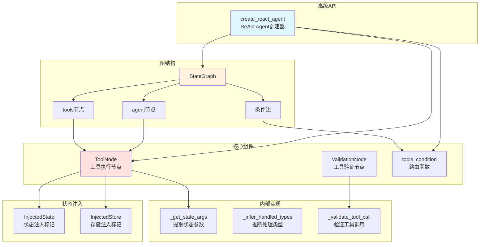
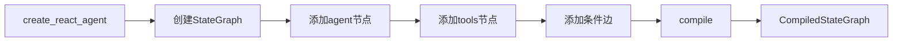
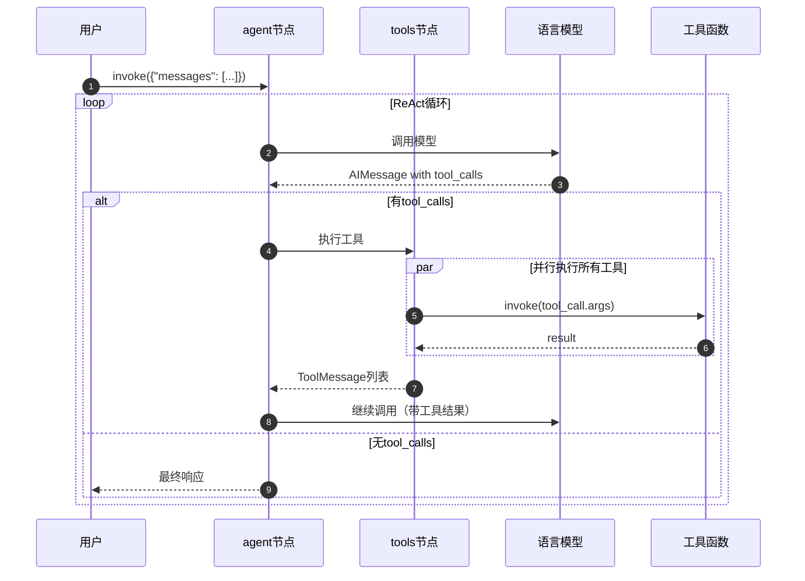
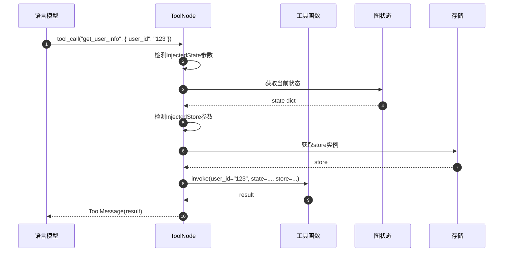

# LangGraph-03-prebuilt-概览

## 一、模块职责

prebuilt模块是LangGraph的高级API层，提供开箱即用的预构建组件和Agent模板。该模块封装了常见的Agent模式，让开发者无需从头构建图结构，即可快速创建生产级Agent应用。

### 1.1 核心能力

1. **ReAct Agent**
   - `create_react_agent`：创建ReAct模式的工具调用Agent
   - 支持静态和动态模型选择
   - 内置工具循环和错误处理

2. **工具执行**
   - `ToolNode`：并行执行工具调用
   - `tools_condition`：基于工具调用的路由函数
   - 支持状态和存储注入

3. **工具验证**
   - `ValidationNode`：验证工具参数
   - 自动错误格式化和重试
   - 支持Pydantic模型验证

4. **状态管理**
   - `InjectedState`：注入图状态到工具
   - `InjectedStore`：注入持久化存储到工具
   - 支持依赖注入模式

## 二、输入与输出

### 2.1 create_react_agent输入

**必需参数**
- `model`：语言模型或动态模型选择函数
- `tools`：工具列表或ToolNode实例

**可选参数**
- `prompt`：系统提示词（str、SystemMessage或Callable）
- `response_format`：结构化响应schema
- `state_schema`：自定义状态结构
- `context_schema`：运行时上下文结构
- `checkpointer`：检查点存储器
- `interrupt_before/after`：中断点配置

### 2.2 create_react_agent输出

返回`CompiledStateGraph`，包含以下节点：
- `agent`：LLM调用节点
- `tools`：工具执行节点
- 可选：`pre_model_hook`、`post_model_hook`、`structured_response`

### 2.3 ToolNode输入输出

**输入**
- `state`：必须包含`messages`字段，其中最后一条消息包含`tool_calls`

**输出**
- `messages`：ToolMessage列表，每个tool_call一个

### 2.4 上下游依赖

**上游（依赖方）**
- 用户代码：直接使用prebuilt API创建Agent
- 示例和教程：大量使用create_react_agent

**下游（被依赖）**
- `langgraph`：使用StateGraph构建图
- `checkpoint`：用于持久化
- `langchain-core`：使用工具和消息类型

## 三、模块架构

### 3.1 整体架构图



### 3.2 架构说明

#### 3.2.1 图意概述

prebuilt模块采用分层架构，最上层是`create_react_agent`高级API，中间层是可复用的组件（ToolNode、ValidationNode），底层是辅助工具和状态注入机制。所有组件最终通过StateGraph组装成完整的Agent。

#### 3.2.2 关键组件

**create_react_agent**

这是最常用的高级API，创建完整的ReAct Agent：

```python
def create_react_agent(
    model: LanguageModelLike | Callable,
    tools: Sequence[BaseTool] | ToolNode,
    *,
    prompt: Optional[Prompt] = None,
    response_format: Optional[StructuredResponseSchema] = None,
    state_schema: Optional[StateSchemaType] = None,
    checkpointer: Optional[Checkpointer] = None,
    interrupt_before: Optional[list[str]] = None,
    interrupt_after: Optional[list[str]] = None,
    debug: bool = False,
) -> CompiledStateGraph:
    """创建ReAct Agent"""
```

**工作原理**：
1. 创建StateGraph，状态包含messages和remaining_steps
2. 添加agent节点：调用LLM生成响应
3. 添加tools节点：执行工具调用
4. 添加条件边：基于tool_calls决定继续或结束
5. 编译并返回CompiledStateGraph

**ToolNode**

工具执行节点，负责并行执行所有工具调用：

```python
class ToolNode(RunnableCallable):
    """并行执行工具调用"""
    
    def __init__(
        self,
        tools: Sequence[BaseTool | Callable],
        *,
        name: str = "tools",
        tags: list[str] | None = None,
        handle_tool_errors: bool | str | Callable = True,
    ):
        self.tools_by_name = {tool.name: tool for tool in tools}
        self.handle_tool_errors = handle_tool_errors
```

**执行流程**：
1. 从state中提取最后一条AIMessage
2. 遍历message中的tool_calls
3. 并行执行所有工具
4. 收集结果为ToolMessage列表
5. 返回{"messages": tool_messages}

**ValidationNode**

工具参数验证节点：

```python
class ValidationNode(RunnableCallable):
    """验证工具参数并格式化错误"""
    
    def __init__(
        self,
        tools: Sequence[BaseTool],
        *,
        format_error: Callable | None = None,
    ):
        self.schemas_by_tool = {
            tool.name: tool.args_schema
            for tool in tools
            if tool.args_schema
        }
```

**工作原理**：
1. 提取tool_calls
2. 使用Pydantic模型验证参数
3. 验证失败时生成错误消息
4. 返回ToolMessage with error

#### 3.2.3 边界与约束

**ReAct循环限制**
- 默认最大步数由remaining_steps控制
- 计算：recursion_limit - current_step
- 步数不足时自动返回错误消息

**工具调用约束**
- 工具名称必须在tools中定义
- 工具参数必须可JSON序列化
- 并行执行的工具数量受executor限制

**状态注入限制**
- 只能注入InjectedState和InjectedStore
- 注入的参数不会出现在tool_calls中
- 注入参数必须有类型注解

#### 3.2.4 异常处理与回退

**工具执行异常**
```python
# 默认行为：捕获异常，返回错误消息
handle_tool_errors = True

# 自定义错误消息
handle_tool_errors = "工具执行失败，请重试"

# 自定义错误处理
def handle_error(e: Exception, tool_call: ToolCall) -> str:
    return f"Error in {tool_call['name']}: {str(e)}"

handle_tool_errors = handle_error
```

**验证失败处理**
- ValidationNode捕获Pydantic验证错误
- 格式化错误消息
- 返回ToolMessage，触发LLM重试

**模型调用失败**
- 使用RetryPolicy自动重试
- 支持指数退避
- 最终失败会抛出异常

#### 3.2.5 性能与容量

**并行执行**
- 同一消息中的所有tool_calls并行执行
- 使用ThreadPoolExecutor（同步）或asyncio（异步）
- 并行度受executor配置限制

**内存占用**
- messages列表会持续增长
- 使用pre_model_hook可以修剪历史
- 建议定期清理旧消息

**执行效率**
- 工具执行是主要瓶颈
- 使用缓存可避免重复调用
- 异步工具可提高并发性能

#### 3.2.6 版本兼容与演进

**v1 vs v2**
- v1：tools节点处理整条消息，所有tool_calls并行
- v2：每个tool_call创建独立任务，使用Send API分发

**当前推荐**
- v2提供更细粒度的控制
- 支持工具级别的错误处理
- 更好的可观测性

**废弃功能**
- `config_schema`已废弃，使用`context_schema`
- 旧版本API保留向后兼容

## 四、生命周期

### 4.1 Agent创建阶段

```python
from langgraph.prebuilt import create_react_agent
from langchain_core.tools import tool

@tool
def search(query: str) -> str:
    """搜索信息"""
    return f"搜索结果: {query}"

@tool
def calculate(expression: str) -> float:
    """计算数学表达式"""
    return eval(expression)

# 创建Agent
agent = create_react_agent(
    model="anthropic:claude-3-7-sonnet-latest",
    tools=[search, calculate],
    prompt="你是一个helpful assistant",
    checkpointer=InMemorySaver(),
)
```

**内部流程**：



### 4.2 Agent执行阶段

```python
config = {"configurable": {"thread_id": "user-123"}}
result = agent.invoke(
    {"messages": [{"role": "user", "content": "What is 2+2?"}]},
    config=config,
)
```

**执行流程**：



### 4.3 状态注入执行

```python
from langgraph.prebuilt import InjectedState, InjectedStore
from typing import Annotated

@tool
def get_user_info(
    user_id: str,
    state: Annotated[dict, InjectedState],
    store: Annotated[BaseStore, InjectedStore],
) -> str:
    """获取用户信息"""
    # state和store会自动注入，不需要LLM提供
    session = state.get("session_id")
    user_data = store.get(("users",), user_id)
    return f"用户: {user_data.value['name']}"
```

**注入流程**：



## 五、核心算法与流程

### 5.1 工具并行执行算法

```python
def _execute_tools_parallel(
    tool_calls: list[ToolCall],
    tools_by_name: dict[str, BaseTool],
    config: RunnableConfig,
) -> list[ToolMessage]:
    """
    并行执行工具调用
    
    参数：
        tool_calls: 工具调用列表
        tools_by_name: 工具映射
        config: 运行配置
        
    返回：
        ToolMessage列表
        
    算法：
    1. 提取需要注入的参数（state、store）
    2. 为每个tool_call创建执行任务
    3. 使用executor并行执行
    4. 收集结果，处理异常
    5. 返回ToolMessage列表
    """
    # 步骤1：准备注入参数
    state = config.get("configurable", {}).get("__state__")
    store = config.get("configurable", {}).get("__store__")
    
    # 步骤2：构建任务
    tasks = []
    for tool_call in tool_calls:
        tool = tools_by_name[tool_call["name"]]
        
        # 合并参数：tool_call.args + 注入参数
        args = tool_call["args"].copy()
        if needs_state(tool):
            args["state"] = state
        if needs_store(tool):
            args["store"] = store
        
        tasks.append((tool, tool_call, args))
    
    # 步骤3：并行执行
    with ThreadPoolExecutor() as executor:
        futures = {
            executor.submit(tool.invoke, args, config): (tool, tool_call)
            for tool, tool_call, args in tasks
        }
        
        results = []
        for future in as_completed(futures):
            tool, tool_call = futures[future]
            try:
                result = future.result()
                results.append(ToolMessage(
                    content=str(result),
                    name=tool.name,
                    tool_call_id=tool_call["id"],
                ))
            except Exception as e:
                # 步骤4：错误处理
                error_msg = handle_error(e, tool_call)
                results.append(ToolMessage(
                    content=error_msg,
                    name=tool.name,
                    tool_call_id=tool_call["id"],
                    status="error",
                ))
    
    return results
```

**算法说明**：
- **时间复杂度**：O(T)，T为最慢工具的执行时间
- **空间复杂度**：O(N)，N为tool_calls数量
- **并行度**：min(N, executor.max_workers)

### 5.2 条件路由算法

```python
def tools_condition(state: dict) -> Literal["tools", "__end__"]:
    """
    基于工具调用的路由函数
    
    参数：
        state: 图状态，必须包含messages
        
    返回：
        "tools": 有工具调用，执行tools节点
        "__end__": 无工具调用，结束执行
        
    算法：
    1. 获取最后一条消息
    2. 检查是否为AIMessage
    3. 检查是否有tool_calls
    4. 返回路由目标
    """
    # 步骤1：获取最后一条消息
    messages = state["messages"]
    if not messages:
        return END
    
    last_message = messages[-1]
    
    # 步骤2：类型检查
    if not isinstance(last_message, AIMessage):
        return END
    
    # 步骤3：检查tool_calls
    if not last_message.tool_calls:
        return END
    
    # 步骤4：路由决策
    return "tools"
```

**算法说明**：
- **时间复杂度**：O(1)
- **决策依据**：仅基于最后一条消息
- **简单高效**：适用于绝大多数场景

### 5.3 状态参数提取算法

```python
def _get_state_args(
    func: Callable,
    state: dict,
    store: BaseStore | None,
) -> dict[str, Any]:
    """
    提取函数需要的注入参数
    
    参数：
        func: 工具函数
        state: 图状态
        store: 存储实例
        
    返回：
        注入参数dict
        
    算法：
    1. 获取函数签名
    2. 遍历参数
    3. 检查是否标记为InjectedState或InjectedStore
    4. 收集需要注入的参数
    """
    # 步骤1：获取类型提示
    type_hints = get_type_hints(func, include_extras=True)
    
    # 步骤2：初始化结果
    injected = {}
    
    # 步骤3：遍历参数
    for param_name, param_type in type_hints.items():
        # 步骤4：检查Annotated
        if get_origin(param_type) is Annotated:
            args = get_args(param_type)
            annotations = args[1:]
            
            # 步骤5：检查标记
            if InjectedState in annotations:
                injected[param_name] = state
            elif InjectedStore in annotations:
                injected[param_name] = store
    
    return injected
```

**算法说明**：
- **时间复杂度**：O(P)，P为参数数量（通常<10）
- **使用反射**：运行时类型检查
- **缓存优化**：可以缓存type_hints结果

## 六、关键代码片段

### 6.1 create_react_agent实现

```python
def create_react_agent(
    model: LanguageModelLike,
    tools: Sequence[BaseTool] | ToolNode,
    *,
    prompt: Optional[Prompt] = None,
    state_schema: Optional[StateSchemaType] = None,
    checkpointer: Optional[Checkpointer] = None,
    interrupt_before: Optional[list[str]] = None,
    interrupt_after: Optional[list[str]] = None,
    debug: bool = False,
) -> CompiledStateGraph:
    """创建ReAct Agent"""
    
    # 步骤1：准备状态schema
    if state_schema is None:
        state_schema = AgentState
    
    # 步骤2：创建StateGraph
    graph = StateGraph(state_schema)
    
    # 步骤3：准备模型
    if isinstance(model, str):
        model = init_chat_model(model)
    
    if should_bind_tools(model, tools):
        model = model.bind_tools(tools)
    
    # 步骤4：创建agent节点
    def agent_node(state: AgentState) -> dict:
        # 应用prompt
        if prompt:
            messages = apply_prompt(prompt, state)
        else:
            messages = state["messages"]
        
        # 调用模型
        response = model.invoke(messages)
        
        # 检查remaining_steps
        if state.get("remaining_steps", 0) < 2 and response.tool_calls:
            return {
                "messages": [AIMessage(
                    content="Sorry, need more steps to process this request."
                )]
            }
        
        return {"messages": [response]}
    
    # 步骤5：创建tools节点
    if isinstance(tools, ToolNode):
        tools_node = tools
    else:
        tools_node = ToolNode(tools)
    
    # 步骤6：添加节点
    graph.add_node("agent", agent_node)
    graph.add_node("tools", tools_node)
    
    # 步骤7：添加边
    graph.add_edge(START, "agent")
    graph.add_conditional_edge("agent", tools_condition, {
        "tools": "tools",
        END: END,
    })
    graph.add_edge("tools", "agent")
    
    # 步骤8：编译
    return graph.compile(
        checkpointer=checkpointer,
        interrupt_before=interrupt_before,
        interrupt_after=interrupt_after,
        debug=debug,
    )
```

### 6.2 ToolNode.invoke实现

```python
class ToolNode(RunnableCallable):
    def invoke(
        self,
        input: dict | list[AnyMessage],
        config: RunnableConfig,
    ) -> dict:
        """执行工具调用"""
        
        # 步骤1：提取消息
        if isinstance(input, dict):
            messages = input["messages"]
        else:
            messages = input
        
        # 步骤2：获取最后一条AIMessage
        last_message = messages[-1]
        if not isinstance(last_message, AIMessage):
            raise ValueError("最后一条消息必须是AIMessage")
        
        tool_calls = last_message.tool_calls
        if not tool_calls:
            raise ValueError("AIMessage必须包含tool_calls")
        
        # 步骤3：提取注入参数
        state_args = _get_state_args(
            self.tools_by_name,
            input if isinstance(input, dict) else {"messages": messages},
            config.get("configurable", {}).get("__store__"),
        )
        
        # 步骤4：并行执行工具
        tool_messages = []
        
        with get_executor_for_config(config) as executor:
            futures = []
            for tool_call in tool_calls:
                tool = self.tools_by_name[tool_call["name"]]
                
                # 合并参数
                args = {**tool_call["args"], **state_args.get(tool.name, {})}
                
                # 提交任务
                future = executor.submit(
                    self._execute_single_tool,
                    tool,
                    tool_call,
                    args,
                    config,
                )
                futures.append((future, tool_call))
            
            # 步骤5：收集结果
            for future, tool_call in futures:
                try:
                    result = future.result()
                    tool_messages.append(ToolMessage(
                        content=str(result),
                        name=tool_call["name"],
                        tool_call_id=tool_call["id"],
                    ))
                except Exception as e:
                    # 步骤6：错误处理
                    if self.handle_tool_errors:
                        error_msg = self._format_error(e, tool_call)
                        tool_messages.append(ToolMessage(
                            content=error_msg,
                            name=tool_call["name"],
                            tool_call_id=tool_call["id"],
                            status="error",
                        ))
                    else:
                        raise
        
        # 步骤7：返回结果
        return {"messages": tool_messages}
    
    def _execute_single_tool(
        self,
        tool: BaseTool,
        tool_call: ToolCall,
        args: dict,
        config: RunnableConfig,
    ) -> Any:
        """执行单个工具"""
        return tool.invoke(args, config)
```

## 七、最佳实践

### 7.1 工具设计

**原则1：单一职责**
```python
# 推荐：每个工具做一件事
@tool
def search(query: str) -> str:
    """搜索信息"""
    return search_api(query)

@tool
def fetch_weather(city: str) -> str:
    """获取天气"""
    return weather_api(city)

# 不推荐：工具功能过多
@tool
def do_everything(action: str, **kwargs) -> str:
    """执行各种操作"""
    if action == "search":
        ...
    elif action == "weather":
        ...
```

**原则2：清晰的文档字符串**
```python
@tool
def search(
    query: str,
    max_results: int = 10,
) -> str:
    """搜索相关信息
    
    Args:
        query: 搜索查询词，应具体且相关
        max_results: 最多返回结果数，默认10
        
    Returns:
        搜索结果的文本摘要
    """
    ...
```

### 7.2 状态注入

**使用InjectedState访问图状态**
```python
from langgraph.prebuilt import InjectedState
from typing import Annotated

@tool
def personalized_search(
    query: str,
    state: Annotated[dict, InjectedState],
) -> str:
    """基于用户偏好搜索"""
    user_prefs = state.get("user_preferences", {})
    # 使用user_prefs定制搜索
    return search_with_prefs(query, user_prefs)
```

**使用InjectedStore访问持久化数据**
```python
from langgraph.prebuilt import InjectedStore
from typing import Annotated

@tool
def remember_fact(
    fact: str,
    category: str,
    store: Annotated[BaseStore, InjectedStore],
    state: Annotated[dict, InjectedState],
) -> str:
    """记住一个事实"""
    user_id = state["user_id"]
    store.put(
        namespace=("facts", user_id),
        key=category,
        value={"fact": fact, "timestamp": datetime.now()},
    )
    return f"已记住: {fact}"
```

### 7.3 提示词工程

**使用SystemMessage**
```python
agent = create_react_agent(
    model=model,
    tools=tools,
    prompt=SystemMessage(content="""你是一个专业的研究助手。
    
规则：
- 总是先搜索最新信息
- 引用来源
- 如果不确定，明确说明
""")
)
```

**使用动态prompt**
```python
def dynamic_prompt(state: AgentState) -> list[BaseMessage]:
    user_name = state.get("user_name", "用户")
    return [
        SystemMessage(content=f"你好，{user_name}！我是你的助手。"),
        *state["messages"],
    ]

agent = create_react_agent(
    model=model,
    tools=tools,
    prompt=dynamic_prompt,
)
```

### 7.4 错误处理

**自定义错误消息**
```python
tool_node = ToolNode(
    tools=tools,
    handle_tool_errors=lambda e, tc: f"工具 {tc['name']} 执行失败: {str(e)}。请尝试其他方法。"
)
```

**错误重试**
```python
@tool
def unreliable_api(query: str) -> str:
    """可能失败的API"""
    try:
        return api_call(query)
    except APIError as e:
        # 返回错误信息，让LLM决定是否重试
        return f"API暂时不可用: {e}。请稍后重试或使用其他工具。"
```

### 7.5 性能优化

**使用异步工具**
```python
@tool
async def async_search(query: str) -> str:
    """异步搜索"""
    async with httpx.AsyncClient() as client:
        response = await client.get(f"https://api.search.com?q={query}")
        return response.text

# 使用ainvoke异步执行
result = await agent.ainvoke(input, config)
```

**工具缓存**
```python
from functools import lru_cache

@tool
@lru_cache(maxsize=100)
def cached_search(query: str) -> str:
    """带缓存的搜索"""
    return expensive_search(query)
```

## 八、示例与实战

### 8.1 简单ReAct Agent

```python
from langgraph.prebuilt import create_react_agent
from langchain_core.tools import tool

@tool
def get_weather(city: str) -> str:
    """获取城市天气"""
    return f"{city}今天晴，25度"

agent = create_react_agent(
    model="anthropic:claude-3-7-sonnet-latest",
    tools=[get_weather],
)

result = agent.invoke({
    "messages": [{"role": "user", "content": "北京天气怎么样？"}]
})

print(result["messages"][-1].content)
# 输出：根据查询，北京今天晴，气温25度。
```

### 8.2 带记忆的Agent

```python
from langgraph.checkpoint.memory import InMemorySaver

checkpointer = InMemorySaver()
agent = create_react_agent(
    model="anthropic:claude-3-7-sonnet-latest",
    tools=[get_weather],
    checkpointer=checkpointer,
)

config = {"configurable": {"thread_id": "user-123"}}

# 第一次对话
result1 = agent.invoke({
    "messages": [{"role": "user", "content": "北京天气怎么样？"}]
}, config)

# 第二次对话（会记住上下文）
result2 = agent.invoke({
    "messages": [{"role": "user", "content": "那上海呢？"}]
}, config)
```

### 8.3 人工审批Agent

```python
agent = create_react_agent(
    model=model,
    tools=[execute_order, cancel_order],
    checkpointer=checkpointer,
    interrupt_before=["tools"],  # 执行工具前中断
)

# 第一步：Agent决策
config = {"configurable": {"thread_id": "order-123"}}
result = agent.invoke({
    "messages": [{"role": "user", "content": "取消订单#456"}]
}, config)

# 第二步：查看待执行的工具
snapshot = agent.get_state(config)
print("待执行:", snapshot.next)  # ("tools",)
tool_calls = snapshot.values["messages"][-1].tool_calls
print("工具调用:", tool_calls)  # [{"name": "cancel_order", "args": {"order_id": "456"}}]

# 第三步：人工审批
if approved:
    # 继续执行
    result = agent.invoke(None, config)
else:
    # 拒绝并修改
    agent.update_state(config, {
        "messages": [AIMessage(content="订单取消已被拒绝")]
    })
```

## 九、总结

prebuilt模块通过封装常见Agent模式，大大降低了LangGraph的使用门槛。其核心优势在于：

1. **开箱即用**：create_react_agent提供完整的ReAct实现
2. **灵活扩展**：支持自定义状态、prompt、hooks
3. **工具友好**：ToolNode支持并行执行、状态注入、错误处理
4. **生产就绪**：内置检查点、中断、重试等企业级特性

通过合理使用prebuilt组件，可以快速构建强大的AI Agent应用。

