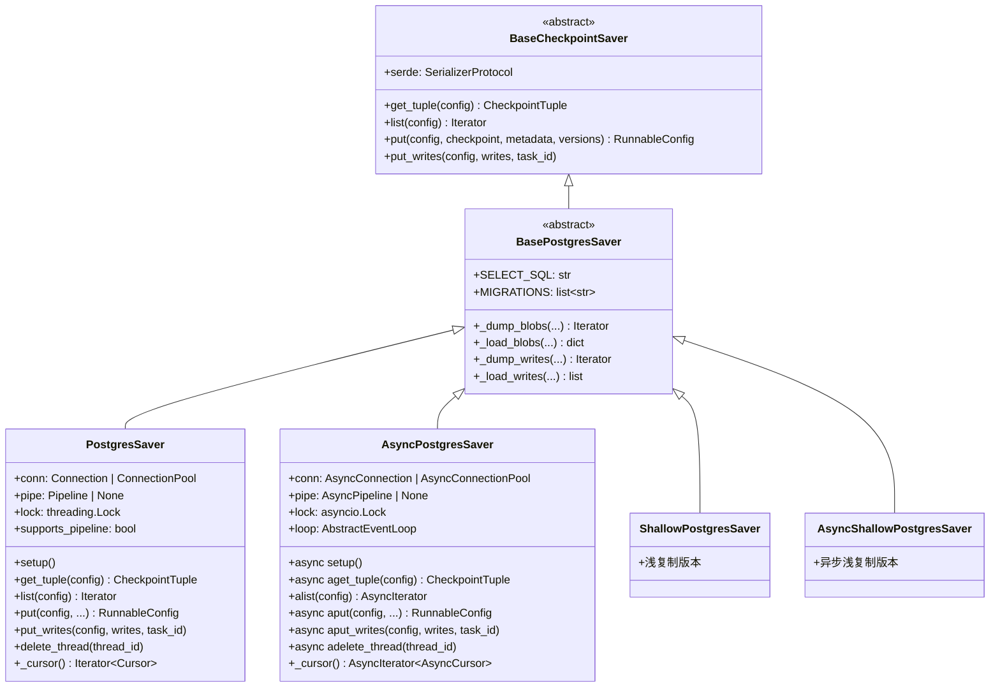
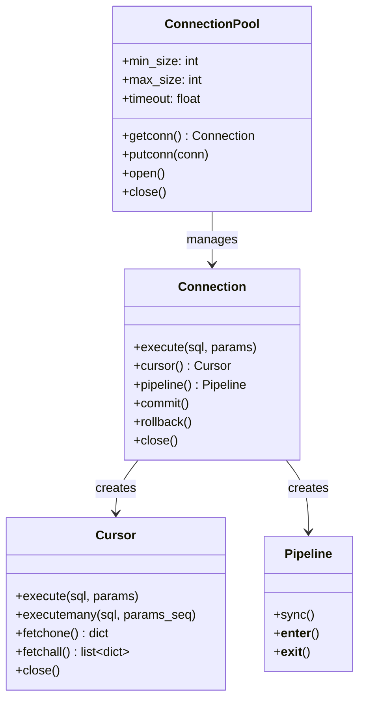
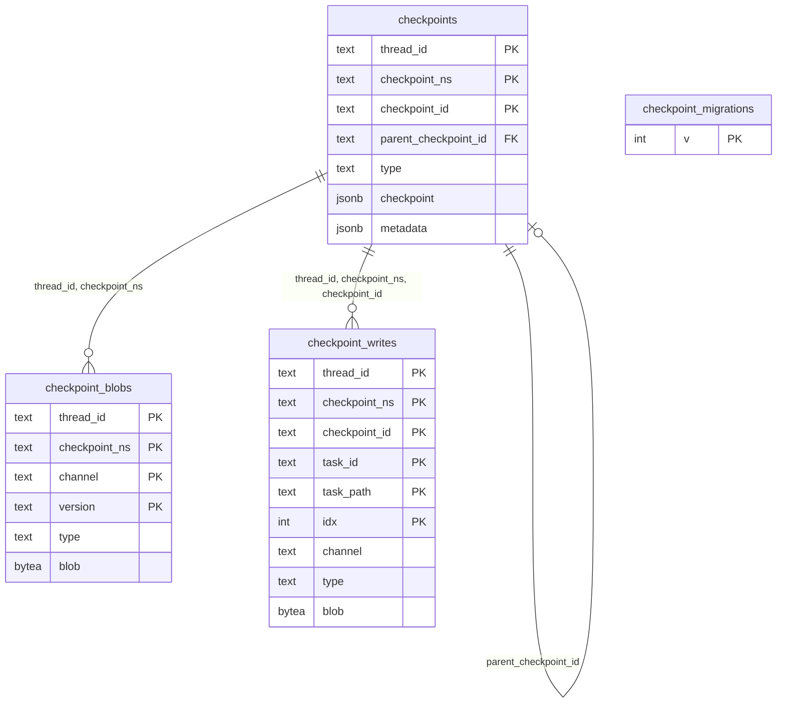
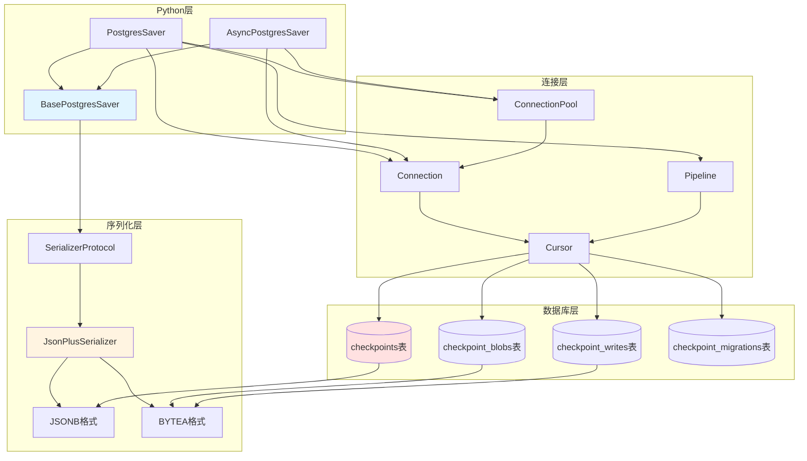

# LangGraph-04-checkpoint-postgres-数据结构

## 一、数据结构总览

checkpoint-postgres模块的数据结构分为三个层次：

1. **Python数据结构**：Python类和TypedDict
2. **数据库Schema**：PostgreSQL表结构
3. **序列化格式**：数据库中的存储格式

## 二、Python数据结构

### 2.1 PostgresSaver类

```python
class PostgresSaver(BasePostgresSaver):
    """PostgreSQL检查点存储器"""
    
    conn: Connection | ConnectionPool
    pipe: Pipeline | None
    lock: threading.Lock
    supports_pipeline: bool
```

**UML类图**：



**字段说明**：

**conn**：数据库连接
- 类型：`Connection | ConnectionPool`
- 作用：执行SQL操作
- Connection：单连接，适用于单线程/低并发
- ConnectionPool：连接池，适用于高并发

**pipe**：Pipeline实例
- 类型：`Pipeline | None`
- 作用：批量执行SQL，减少网络往返
- 限制：不能与ConnectionPool同时使用

**lock**：线程锁
- 类型：`threading.Lock`（同步）或`asyncio.Lock`（异步）
- 作用：确保线程/协程安全
- 保护：同一时间只能有一个操作访问连接

**supports_pipeline**：Pipeline支持
- 类型：`bool`
- 作用：指示psycopg是否支持Pipeline模式
- 检测：通过`Capabilities().has_pipeline()`

### 2.2 连接类型



**Connection**：单个数据库连接
- 适用场景：单线程应用、测试
- 特点：简单直接
- 限制：同时只能执行一个操作

**ConnectionPool**：连接池
- 适用场景：多线程应用、高并发
- 特点：自动管理连接、复用连接
- 配置：min_size（最小连接数）、max_size（最大连接数）

**Pipeline**：批量执行模式
- 适用场景：需要执行多个SQL语句
- 特点：减少网络往返、提高性能
- 使用：with conn.pipeline() as pipe

**Cursor**：数据库游标
- 作用：执行SQL、获取结果
- 类型：DictRow（返回dict）或TupleRow（返回tuple）
- 要求：必须使用dict_row工厂

## 三、数据库Schema

### 3.1 数据库表结构



### 3.2 checkpoints表

```sql
CREATE TABLE checkpoints (
    thread_id TEXT NOT NULL,
    checkpoint_ns TEXT NOT NULL DEFAULT '',
    checkpoint_id TEXT NOT NULL,
    parent_checkpoint_id TEXT,
    type TEXT,
    checkpoint JSONB NOT NULL,
    metadata JSONB NOT NULL DEFAULT '{}',
    PRIMARY KEY (thread_id, checkpoint_ns, checkpoint_id)
);
```

**字段详解**：

| 字段 | 类型 | 约束 | 说明 |
|---|---|---|---|
| `thread_id` | TEXT | PK, NOT NULL | 线程ID，会话标识符 |
| `checkpoint_ns` | TEXT | PK, NOT NULL, DEFAULT '' | 检查点命名空间 |
| `checkpoint_id` | TEXT | PK, NOT NULL | 检查点唯一ID（UUID） |
| `parent_checkpoint_id` | TEXT | FK, NULL | 父检查点ID，用于时间旅行 |
| `type` | TEXT | NULL | 类型标识（保留字段） |
| `checkpoint` | JSONB | NOT NULL | 检查点数据（JSON格式） |
| `metadata` | JSONB | NOT NULL, DEFAULT '{}' | 元数据（JSON格式） |

**checkpoint字段结构**：
```json
{
  "v": 4,
  "id": "1ef4f797-8335-6428-8001-8a1503f9b875",
  "ts": "2024-07-31T20:14:19.804150+00:00",
  "channel_values": {
    "my_key": "inline_value",
    // 复杂对象不在这里，在checkpoint_blobs表
  },
  "channel_versions": {
    "__start__": "2",
    "my_key": "3",
    "messages": "5"
  },
  "versions_seen": {
    "__input__": {},
    "__start__": {"__start__": "1"},
    "node": {"start:node": "2"}
  },
  "pending_sends": []
}
```

**metadata字段结构**：
```json
{
  "source": "input",
  "step": 1,
  "writes": {"key": "value"},
  "user_id": "123",
  // 任意用户定义的元数据
}
```

**索引**：
```sql
-- 主键索引（自动创建）
CREATE UNIQUE INDEX checkpoints_pkey 
ON checkpoints(thread_id, checkpoint_ns, checkpoint_id);

-- 查询最新检查点
CREATE INDEX checkpoints_thread_id_idx 
ON checkpoints(thread_id);

-- 父检查点索引（时间旅行）
CREATE INDEX checkpoints_parent_idx 
ON checkpoints(parent_checkpoint_id);
```

### 3.3 checkpoint_blobs表

```sql
CREATE TABLE checkpoint_blobs (
    thread_id TEXT NOT NULL,
    checkpoint_ns TEXT NOT NULL DEFAULT '',
    channel TEXT NOT NULL,
    version TEXT NOT NULL,
    type TEXT NOT NULL,
    blob BYTEA,
    PRIMARY KEY (thread_id, checkpoint_ns, channel, version)
);
```

**字段详解**：

| 字段 | 类型 | 约束 | 说明 |
|---|---|---|---|
| `thread_id` | TEXT | PK, NOT NULL | 对应checkpoints.thread_id |
| `checkpoint_ns` | TEXT | PK, NOT NULL, DEFAULT '' | 对应checkpoints.checkpoint_ns |
| `channel` | TEXT | PK, NOT NULL | Channel名称（如"messages"） |
| `version` | TEXT | PK, NOT NULL | Channel版本号 |
| `type` | TEXT | NOT NULL | 序列化类型（如"json"） |
| `blob` | BYTEA | NULL | 二进制数据 |

**为什么需要blob表**：
- **性能优化**：分离大对象，减少主表大小
- **查询加速**：查询检查点元数据时不加载大对象
- **存储效率**：BYTEA存储二进制数据比JSONB更紧凑

**存储策略**：
- 原始类型（str, int, float, bool, None）：存储在checkpoints.checkpoint.channel_values
- 复杂对象（list, dict, BaseModel等）：存储在checkpoint_blobs.blob

**索引**：
```sql
CREATE UNIQUE INDEX checkpoint_blobs_pkey 
ON checkpoint_blobs(thread_id, checkpoint_ns, channel, version);

CREATE INDEX checkpoint_blobs_thread_id_idx 
ON checkpoint_blobs(thread_id);
```

### 3.4 checkpoint_writes表

```sql
CREATE TABLE checkpoint_writes (
    thread_id TEXT NOT NULL,
    checkpoint_ns TEXT NOT NULL DEFAULT '',
    checkpoint_id TEXT NOT NULL,
    task_id TEXT NOT NULL,
    task_path TEXT NOT NULL DEFAULT '',
    idx INTEGER NOT NULL,
    channel TEXT NOT NULL,
    type TEXT,
    blob BYTEA NOT NULL,
    PRIMARY KEY (thread_id, checkpoint_ns, checkpoint_id, task_id, idx)
);
```

**字段详解**：

| 字段 | 类型 | 约束 | 说明 |
|---|---|---|---|
| `thread_id` | TEXT | PK, NOT NULL | 线程ID |
| `checkpoint_ns` | TEXT | PK, NOT NULL | 命名空间 |
| `checkpoint_id` | TEXT | PK, NOT NULL | 检查点ID |
| `task_id` | TEXT | PK, NOT NULL | 任务ID |
| `task_path` | TEXT | PK, NOT NULL, DEFAULT '' | 任务路径（子图） |
| `idx` | INTEGER | PK, NOT NULL | 写入索引（WRITES_IDX_MAP） |
| `channel` | TEXT | NOT NULL | 目标channel |
| `type` | TEXT | NULL | 序列化类型 |
| `blob` | BYTEA | NOT NULL | 序列化数据 |

**用途**：存储pending writes（节点成功但图执行失败时的写入）

**写入类型（idx）**：
```python
WRITES_IDX_MAP = {
    "error": 0,       # 错误输出
    "info": 1,        # 信息输出
    "tool_calls": 2,  # 工具调用
    "writes": 3,      # 一般写入
}
```

**索引**：
```sql
CREATE UNIQUE INDEX checkpoint_writes_pkey 
ON checkpoint_writes(thread_id, checkpoint_ns, checkpoint_id, task_id, idx);

CREATE INDEX checkpoint_writes_thread_id_idx 
ON checkpoint_writes(thread_id);
```

### 3.5 checkpoint_migrations表

```sql
CREATE TABLE checkpoint_migrations (
    v INTEGER PRIMARY KEY
);
```

**用途**：跟踪已应用的数据库迁移版本

**使用**：
```python
# 查询当前版本
SELECT v FROM checkpoint_migrations ORDER BY v DESC LIMIT 1;

# 记录新迁移
INSERT INTO checkpoint_migrations (v) VALUES (5);
```

## 四、序列化格式

### 4.1 Checkpoint序列化

```python
# Python对象
checkpoint = {
    "v": 4,
    "id": "abc123",
    "ts": "2024-01-01T00:00:00Z",
    "channel_values": {
        "messages": [AIMessage(...), ToolMessage(...)],  # 复杂对象
        "key": "value",  # 原始类型
        "count": 42,  # 原始类型
    },
    "channel_versions": {"messages": "5", "key": "3", "count": "2"},
    "versions_seen": {},
}

# 存储到checkpoints表
stored_checkpoint = {
    "v": 4,
    "id": "abc123",
    "ts": "2024-01-01T00:00:00Z",
    "channel_values": {
        "key": "value",  # 原始类型保留
        "count": 42,
        // messages被移除，存储到checkpoint_blobs
    },
    "channel_versions": {"messages": "5", "key": "3", "count": "2"},
    "versions_seen": {},
}

# 存储到checkpoint_blobs表
# thread_id | checkpoint_ns | channel  | version | type | blob
# thread-1  | ""            | messages | 5       | json | <serialized_messages>
```

### 4.2 Blob序列化

**序列化流程**：
```python
def _dump_blobs(thread_id, checkpoint_ns, values, versions):
    for channel, value in values.items():
        version = versions[channel]
        
        # 使用serde序列化
        type_name, serialized_value = serde.dumps(value)
        
        yield (
            thread_id,
            checkpoint_ns,
            channel,
            version,
            type_name,  # "json", "msgpack", etc.
            serialized_value,  # bytes
        )
```

**反序列化流程**：
```python
def _load_blobs(blob_values):
    result = {}
    for row in blob_values:
        channel = row[0].decode()
        type_name = row[1].decode()
        blob = row[2]
        
        # 使用serde反序列化
        value = serde.loads((type_name, blob))
        result[channel] = value
    
    return result
```

### 4.3 Writes序列化

**序列化**：
```python
def _dump_writes(thread_id, checkpoint_ns, checkpoint_id, task_id, task_path, writes):
    for idx, (channel, value) in enumerate(writes):
        type_name, serialized_value = serde.dumps(value)
        
        # 映射channel到idx
        write_idx = WRITES_IDX_MAP.get(channel, 3)  # 默认为"writes"
        
        yield (
            thread_id,
            checkpoint_ns,
            checkpoint_id,
            task_id,
            task_path,
            write_idx,
            channel,
            type_name,
            serialized_value,
        )
```

**反序列化**：
```python
def _load_writes(writes):
    if not writes:
        return []
    
    result = []
    for row in writes:
        task_id = row[0].decode()
        channel = row[1].decode()
        type_name = row[2].decode()
        blob = row[3]
        
        value = serde.loads((type_name, blob))
        result.append((channel, value))
    
    return result
```

## 五、数据结构关系图



## 六、数据结构演进

### 6.1 版本历史

**v0 → v1**：添加checkpoint_migrations表
```sql
CREATE TABLE checkpoint_migrations (v INTEGER PRIMARY KEY);
```

**v1 → v2**：创建checkpoints表
```sql
CREATE TABLE checkpoints (
    thread_id TEXT NOT NULL,
    checkpoint_ns TEXT NOT NULL DEFAULT '',
    checkpoint_id TEXT NOT NULL,
    parent_checkpoint_id TEXT,
    type TEXT,
    checkpoint JSONB NOT NULL,
    metadata JSONB NOT NULL DEFAULT '{}',
    PRIMARY KEY (thread_id, checkpoint_ns, checkpoint_id)
);
```

**v2 → v3**：创建checkpoint_blobs表
```sql
CREATE TABLE checkpoint_blobs (
    thread_id TEXT NOT NULL,
    checkpoint_ns TEXT NOT NULL DEFAULT '',
    channel TEXT NOT NULL,
    version TEXT NOT NULL,
    type TEXT NOT NULL,
    blob BYTEA,
    PRIMARY KEY (thread_id, checkpoint_ns, channel, version)
);
```

**v3 → v4**：创建checkpoint_writes表
```sql
CREATE TABLE checkpoint_writes (
    thread_id TEXT NOT NULL,
    checkpoint_ns TEXT NOT NULL DEFAULT '',
    checkpoint_id TEXT NOT NULL,
    task_id TEXT NOT NULL,
    idx INTEGER NOT NULL,
    channel TEXT NOT NULL,
    type TEXT,
    blob BYTEA NOT NULL,
    PRIMARY KEY (thread_id, checkpoint_ns, checkpoint_id, task_id, idx)
);
```

**v4 → v5**：blob字段允许NULL
```sql
ALTER TABLE checkpoint_blobs ALTER COLUMN blob DROP NOT NULL;
```

**v6 → v9**：添加索引
```sql
CREATE INDEX CONCURRENTLY checkpoints_thread_id_idx ON checkpoints(thread_id);
CREATE INDEX CONCURRENTLY checkpoint_blobs_thread_id_idx ON checkpoint_blobs(thread_id);
CREATE INDEX CONCURRENTLY checkpoint_writes_thread_id_idx ON checkpoint_writes(thread_id);
```

**v9 → v10**：添加task_path字段
```sql
ALTER TABLE checkpoint_writes ADD COLUMN task_path TEXT NOT NULL DEFAULT '';
```

### 6.2 向后兼容策略

**读取旧版本检查点**：
```python
def _load_checkpoint_tuple(self, value):
    checkpoint = value["checkpoint"]
    
    # 检测版本
    if checkpoint.get("v", 1) < 4:
        # 迁移pending_sends
        if value["parent_checkpoint_id"]:
            self._migrate_pending_sends(...)
    
    # 加载blobs
    channel_values = {
        **checkpoint.get("channel_values", {}),
        **self._load_blobs(value["channel_values"]),
    }
    
    return CheckpointTuple(...)
```

**自动迁移**：
- setup()方法检测当前版本
- 只运行未应用的迁移
- 记录迁移版本到checkpoint_migrations

## 七、存储容量估算

### 7.1 单个检查点大小

**checkpoints表**：
```python
# 基础字段：thread_id(50) + checkpoint_ns(10) + checkpoint_id(36) + parent(36) = 132 bytes
# checkpoint JSONB：
#   - 结构：~200 bytes
#   - inline channel_values：~100 bytes/channel
#   - 总计：~500 bytes
# metadata JSONB：~100 bytes
# 总计：~750 bytes/检查点
```

**checkpoint_blobs表**：
```python
# 每个blob：
#   - 基础字段：~150 bytes
#   - blob数据：取决于内容大小
#   - 示例：10条消息，每条1KB = ~10KB
# 总计：~10KB/blob
```

**checkpoint_writes表**：
```python
# 每个write：
#   - 基础字段：~200 bytes
#   - blob数据：取决于写入内容
#   - 示例：1个ToolMessage，~1KB
# 总计：~1.2KB/write
```

### 7.2 容量估算示例

**场景：100个用户，每人100个检查点**

```python
# 每个检查点：
checkpoint_size = 750  # checkpoints表
blob_size = 10 * 1024  # 10条消息
write_size = 2 * 1200  # 2个writes

total_per_checkpoint = checkpoint_size + blob_size + write_size
# = 750 + 10240 + 2400 = 13,390 bytes ≈ 13KB

# 总存储：
total_users = 100
checkpoints_per_user = 100
total_storage = total_users * checkpoints_per_user * total_per_checkpoint
# = 100 * 100 * 13KB = 130MB
```

**优化建议**：
1. 定期清理旧检查点（如保留最近30天）
2. 使用消息修剪减少blob大小
3. 考虑使用ShallowPostgresSaver
4. 启用数据库压缩

## 八、总结

checkpoint-postgres的数据结构设计体现了以下原则：

1. **分层存储**：主表+Blob表，优化查询性能
2. **灵活序列化**：支持任意Python对象
3. **完整关系**：通过外键维护数据一致性
4. **版本演进**：通过迁移机制平滑升级
5. **存储优化**：Blob分离、索引优化、压缩支持

通过合理的数据结构设计，checkpoint-postgres实现了高性能和可扩展的检查点存储。

