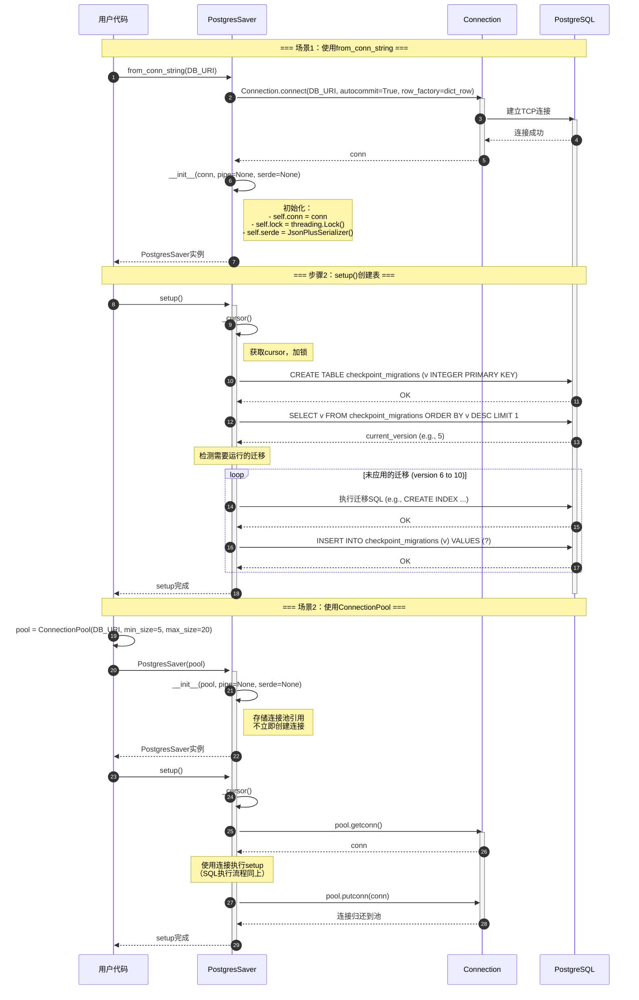
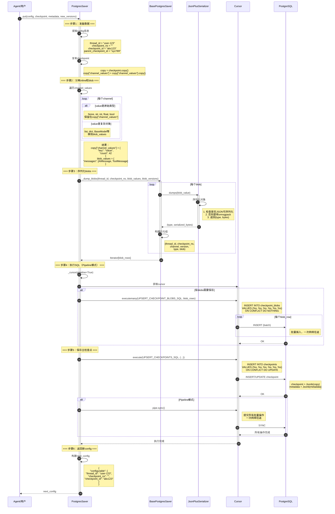
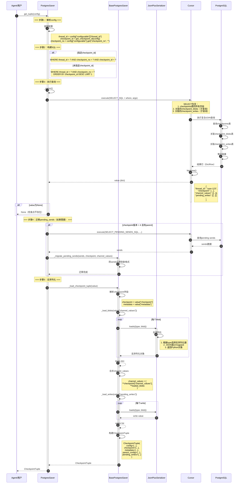
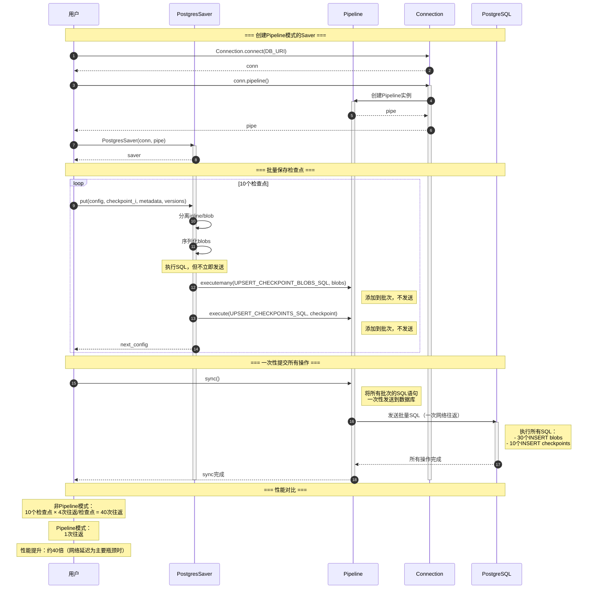

# LangGraph-04-checkpoint-postgres-时序图

## 一、时序图总览

本文档提供checkpoint-postgres模块的详细时序图，涵盖：

1. **初始化与setup**：创建连接和数据库表
2. **检查点保存（put）**：完整的保存流程
3. **检查点加载（get_tuple）**：查询和反序列化
4. **检查点列表（list）**：批量查询
5. **Writes保存（put_writes）**：Pending writes存储
6. **Pipeline批量操作**：高性能批量执行
7. **线程删除（delete_thread）**：清理数据

## 二、初始化与setup流程

### 2.1 完整初始化时序图



### 2.2 文字说明

#### 2.2.1 图意概述

该时序图展示了PostgresSaver的完整初始化流程，包括创建连接、初始化实例和运行数据库迁移的全过程。支持两种连接模式：单连接和连接池。

#### 2.2.2 关键步骤

**from_conn_string**：
- 创建Connection并设置必要参数
- autocommit=True：确保setup()能提交表创建
- row_factory=dict_row：支持字典访问

**setup()方法**：
1. 创建checkpoint_migrations表
2. 查询当前版本号
3. 运行所有未应用的迁移
4. 记录新版本到migrations表

**迁移顺序**：
```python
MIGRATIONS = [
    # 0: 创建migrations表
    # 1: 创建checkpoints表
    # 2: 创建checkpoint_blobs表
    # 3: 创建checkpoint_writes表
    # 4: 修改blob字段
    # 5: no-op
    # 6-8: 创建索引
    # 9: 添加task_path字段
]
```

#### 2.2.3 边界与异常

**连接失败**：
```python
try:
    with PostgresSaver.from_conn_string(DB_URI) as checkpointer:
        checkpointer.setup()
except psycopg.OperationalError as e:
    # 数据库不可达
    # 回退到InMemorySaver
```

**权限不足**：
```python
try:
    checkpointer.setup()
except psycopg.errors.InsufficientPrivilege:
    # 用户没有CREATE TABLE权限
```

**迁移失败**：
- 如果某个迁移失败，会抛出异常
- 已执行的迁移已提交（autocommit=True）
- 需要手动修复数据库后重试

## 三、检查点保存流程

### 3.1 put方法详细时序图



### 3.2 文字说明

#### 3.2.1 图意概述

该时序图展示了检查点保存的完整流程，包括数据准备、inline/blob分离、序列化、SQL执行等步骤。使用Pipeline模式实现高性能批量写入。

#### 3.2.2 关键算法

**Inline/Blob分离**：
```python
def separate_inline_and_blobs(channel_values):
    inline_values = {}
    blob_values = {}
    
    for k, v in channel_values.items():
        if v is None or isinstance(v, (str, int, float, bool)):
            inline_values[k] = v  # 保留在主表
        else:
            blob_values[k] = v  # 移到blob表
    
    return inline_values, blob_values
```

**优势**：
- 主表更小，查询更快
- 大对象单独存储，按需加载
- BYTEA比JSONB更紧凑

**Pipeline批量执行**：
```python
with self._cursor(pipeline=True) as cur:
    # 批量插入blobs
    cur.executemany(UPSERT_CHECKPOINT_BLOBS_SQL, blob_rows)
    
    # 插入主检查点
    cur.execute(UPSERT_CHECKPOINTS_SQL, checkpoint_row)
    
    # 一次性提交（context manager退出时自动调用pipe.sync()）
```

**性能提升**：
- 非Pipeline：N+1次网络往返（N个blobs + 1个checkpoint）
- Pipeline：1次网络往返
- 提升倍数：约等于blobs数量

#### 3.2.3 边界与异常

**序列化失败**：
```python
try:
    type_name, serialized = serde.dumps(value)
except Exception as e:
    # 对象无法序列化
    # 可以尝试：
    # 1. 转换为可序列化格式
    # 2. 跳过该channel
    # 3. 使用自定义序列化器
```

**唯一约束冲突**：
```python
# UPSERT语句自动处理
# ON CONFLICT DO UPDATE：更新现有检查点
# ON CONFLICT DO NOTHING：跳过已存在的blob
```

**事务保证**：
- autocommit=True：每个语句立即提交
- Pipeline：整个pipeline是原子的
- 如果中途失败，已提交的不会回滚

## 四、检查点加载流程

### 4.1 get_tuple方法时序图



### 4.2 文字说明

#### 4.2.1 图意概述

该时序图展示了检查点加载的完整流程，包括SQL查询、关联查询、pending_sends迁移、反序列化等步骤。

#### 4.2.2 关键SQL

**SELECT_SQL**：
```sql
SELECT
    thread_id,
    checkpoint,
    checkpoint_ns,
    checkpoint_id,
    parent_checkpoint_id,
    metadata,
    (
        -- 子查询：加载blobs
        SELECT array_agg(array[bl.channel::bytea, bl.type::bytea, bl.blob])
        FROM jsonb_each_text(checkpoint -> 'channel_versions')
        INNER JOIN checkpoint_blobs bl
            ON bl.thread_id = checkpoints.thread_id
            AND bl.checkpoint_ns = checkpoints.checkpoint_ns
            AND bl.channel = jsonb_each_text.key
            AND bl.version = jsonb_each_text.value
    ) AS channel_values,
    (
        -- 子查询：加载pending writes
        SELECT array_agg(array[cw.task_id::text::bytea, cw.channel::bytea, cw.type::bytea, cw.blob] ORDER BY cw.task_id, cw.idx)
        FROM checkpoint_writes cw
        WHERE cw.thread_id = checkpoints.thread_id
            AND cw.checkpoint_ns = checkpoints.checkpoint_ns
            AND cw.checkpoint_id = checkpoints.checkpoint_id
    ) AS pending_writes
FROM checkpoints
WHERE ...
```

**优势**：
- 一次查询获取所有数据
- 避免N+1查询问题
- 数据库端完成JOIN，减少网络传输

#### 4.2.3 pending_sends迁移

**为什么需要迁移**：
- v3检查点使用不同的pending_sends格式
- v4改为使用checkpoint_writes表
- 加载v3检查点时需要动态迁移

**迁移逻辑**：
```python
if checkpoint["v"] < 4 and parent_checkpoint_id:
    # 查询父检查点的pending sends
    sends = query_pending_sends(parent_checkpoint_id)
    
    # 迁移到新格式
    migrate_pending_sends(sends, checkpoint, channel_values)
```

#### 4.2.4 性能考虑

**索引优化**：
```sql
-- 查询最新检查点
CREATE INDEX checkpoints_thread_id_idx ON checkpoints(thread_id);

-- 加速JOIN
CREATE INDEX checkpoint_blobs_thread_id_idx ON checkpoint_blobs(thread_id);
CREATE INDEX checkpoint_writes_thread_id_idx ON checkpoint_writes(thread_id);
```

**查询性能**：
- 单个检查点查询：<10ms（有索引）
- 包含10个blobs：<50ms
- 瓶颈：反序列化（不是SQL）

## 五、Pipeline批量操作流程

### 5.1 Pipeline模式时序图



### 5.2 文字说明

#### 5.2.1 图意概述

该时序图展示了Pipeline模式如何通过批量执行SQL来减少网络往返，从而大幅提升性能。

#### 5.2.2 Pipeline工作原理

**批处理机制**：
```python
with conn.pipeline() as pipe:
    checkpointer = PostgresSaver(conn, pipe)
    
    # 所有SQL都添加到批次，不立即发送
    checkpointer.put(config1, ...)
    checkpointer.put(config2, ...)
    checkpointer.put(config3, ...)
    
    # context manager退出时自动调用pipe.sync()
    # 一次性发送所有SQL
```

**性能提升**：
- 减少网络往返
- 减少TCP开销
- 数据库端可以优化执行计划

**适用场景**：
- 批量保存检查点
- 批量保存writes
- 初始化/迁移数据

## 六、总结

checkpoint-postgres模块的时序图展示了：

1. **初始化**：连接管理和数据库迁移
2. **保存**：Inline/Blob分离和Pipeline批量执行
3. **加载**：复杂JOIN查询和反序列化
4. **Pipeline**：批量操作性能优化

通过这些时序图，可以深入理解checkpoint-postgres的工作机制，为性能优化和问题排查提供指导。

