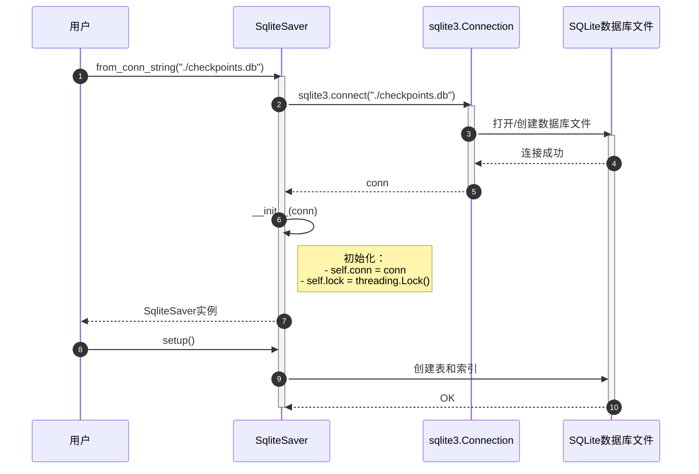
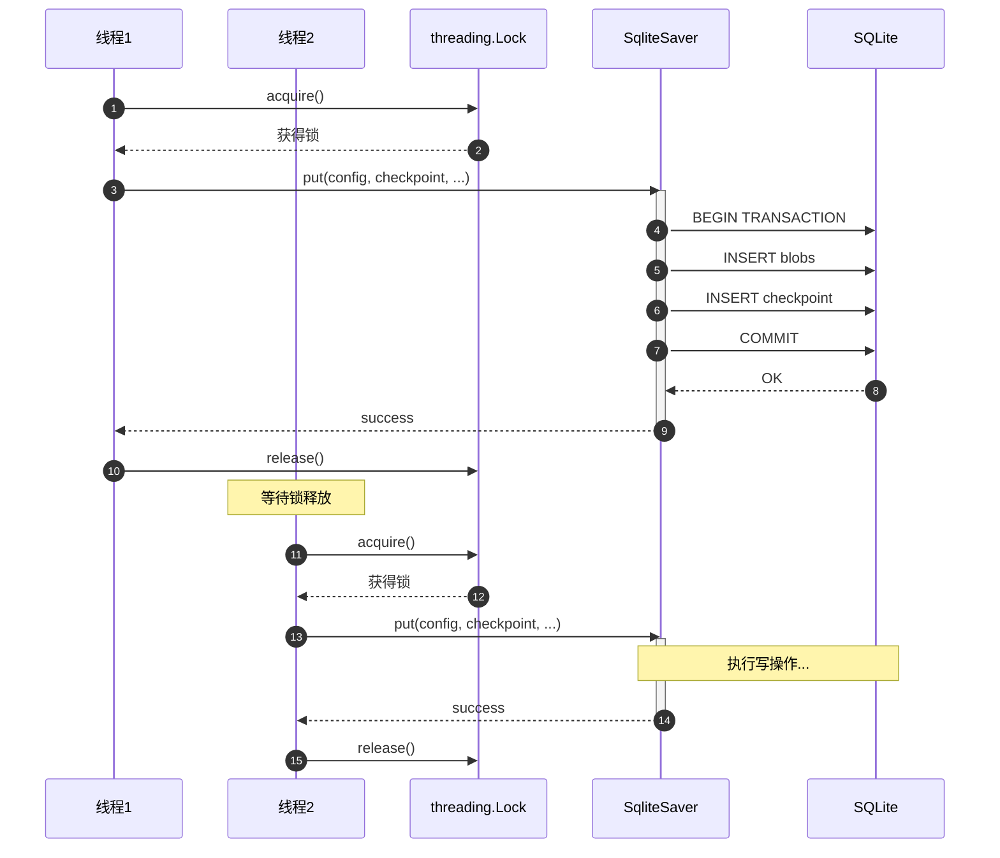
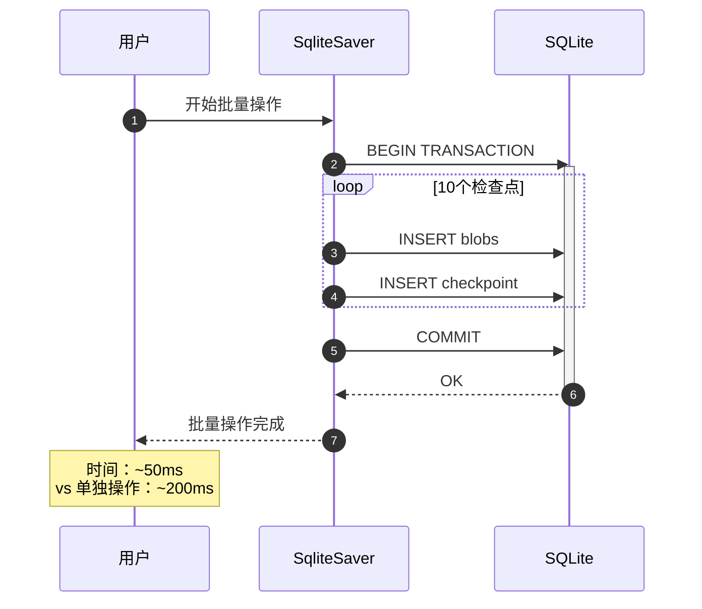
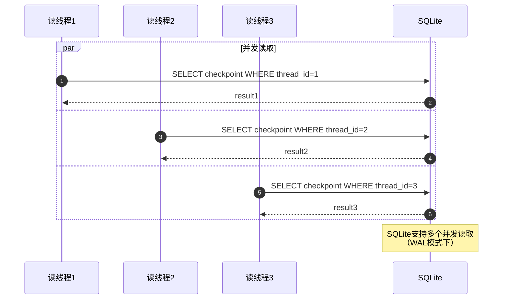

# LangGraph-05-checkpoint-sqlite-时序图

## 一、时序图总览

checkpoint-sqlite的时序图与checkpoint-postgres基本相同，只是数据库操作从PostgreSQL换成SQLite。

详细的时序图请参考：`LangGraph-04-checkpoint-postgres-时序图.md`

## 二、主要差异

### 2.1 连接管理



**关键差异**：
- 无需网络连接，直接操作本地文件
- 连接更快（<1ms vs 10-50ms for PostgreSQL）
- 无ConnectionPool（SQLite本身不支持）

### 2.2 写操作串行化



**关键差异**：
- SQLite写操作必须串行（数据库级别的锁）
- 应用层使用threading.Lock避免竞争
- 多个写操作会排队等待

### 2.3 查询操作

查询操作与PostgreSQL相同，但SQL语法略有差异：

```sql
-- PostgreSQL使用JSONB操作符
SELECT checkpoint -> 'channel_values' FROM checkpoints;

-- SQLite使用JSON函数
SELECT json_extract(checkpoint, '$.channel_values') FROM checkpoints;
```

## 三、性能对比

### 3.1 操作延迟

| 操作 | PostgreSQL | SQLite |
|---|---|---|
| 连接 | 10-50ms（网络） | <1ms（本地） |
| 单次put | 5-10ms | 2-5ms |
| 单次get | 3-5ms | 1-3ms |
| 批量put（10个） | 20ms（Pipeline） | 20-50ms（串行） |
| list（100个） | 50ms | 30-50ms |

### 3.2 并发性能

```
PostgreSQL:
- 读并发：高（多连接）
- 写并发：高（行级锁）
- 适合：多实例、高并发

SQLite:
- 读并发：中等（多读者单写者）
- 写并发：低（数据库锁）
- 适合：单实例、低并发
```

## 四、最佳实践时序

### 4.1 批量操作优化



**优化策略**：
```python
conn = sqlite3.connect("checkpoints.db")
conn.execute("BEGIN TRANSACTION")

for checkpoint in checkpoints:
    checkpointer.put(config, checkpoint, metadata, versions)

conn.execute("COMMIT")
```

### 4.2 并发读取



## 五、总结

checkpoint-sqlite的时序流程与checkpoint-postgres相似，主要差异在于：

1. **连接更简单**：无需网络，直接打开文件
2. **写操作串行**：需要应用层锁保护
3. **性能差异**：单次操作更快，批量操作较慢
4. **适用场景**：开发测试、单机部署

详细的时序图和代码示例请参考`LangGraph-04-checkpoint-postgres-时序图.md`。

