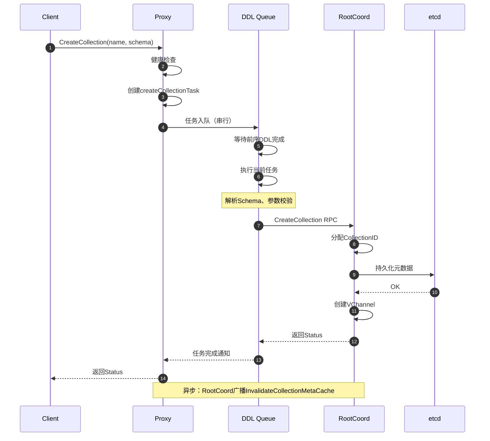
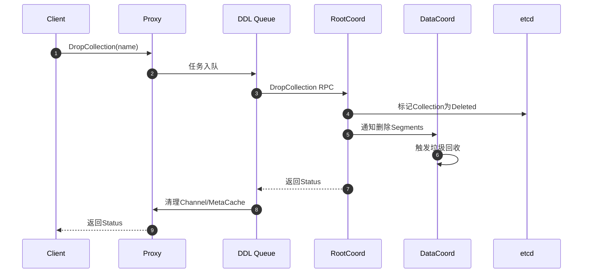
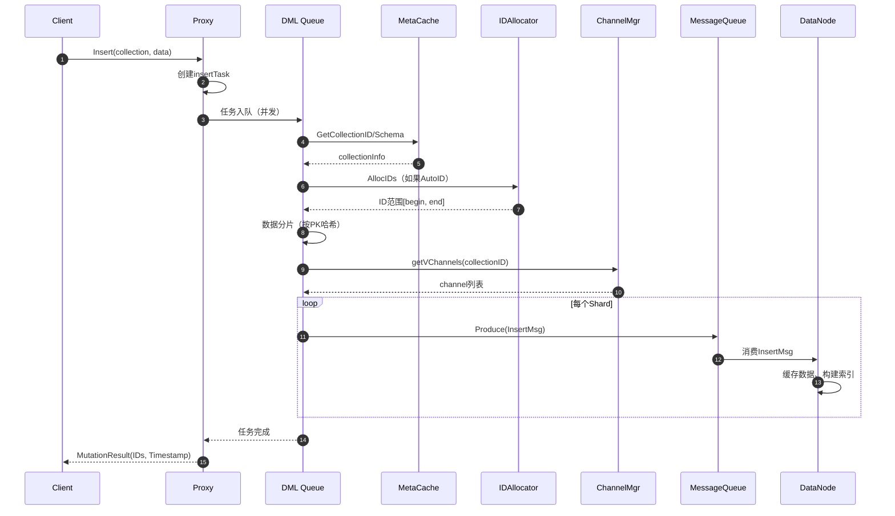
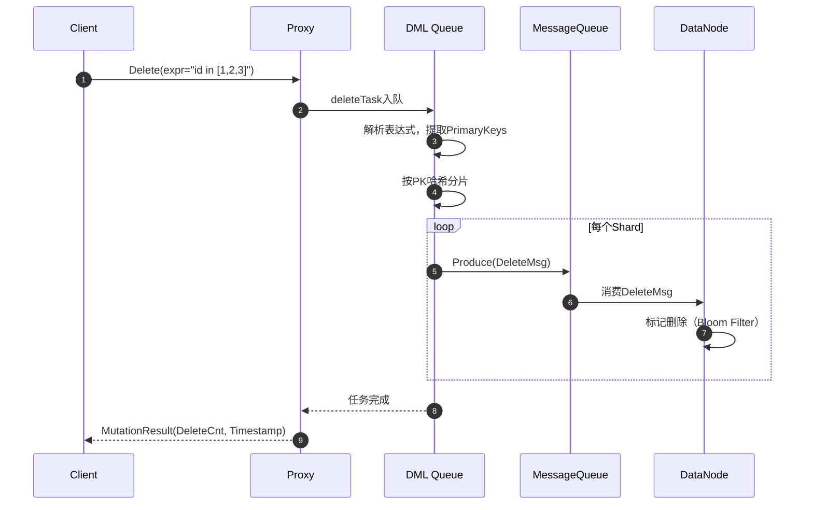
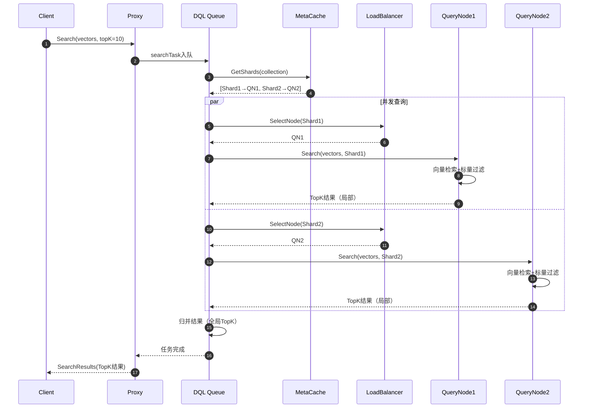

# Milvus-01-Proxy-API

本文档详细说明Proxy模块对外提供的所有API接口，包括DDL、DML、DQL操作。

## API分类

Proxy模块实现`milvuspb.MilvusService`接口，提供以下类别的API：

1. **DDL（数据定义）**：CreateCollection、DropCollection、AlterCollection等
2. **DML（数据操作）**：Insert、Delete、Upsert
3. **DQL（数据查询）**：Search、Query、Get
4. **管理类**：CreateUser、CreateRole、ShowCollections等
5. **系统类**：GetComponentStates、GetMetrics等

---

## 1. DDL API

### 1.1 CreateCollection

#### 基本信息
- **名称**：`CreateCollection`
- **协议**：gRPC `milvuspb.MilvusService/CreateCollection`
- **幂等性**：否（重复创建返回已存在错误）

#### 请求结构体

```go
// CreateCollectionRequest 创建集合请求
type CreateCollectionRequest struct {
    Base              *commonpb.MsgBase       // 基础消息信息（MsgID、Timestamp等）
    DbName            string                   // 数据库名，默认为空表示default数据库
    CollectionName    string                   // 集合名，必填，长度1-255
    Schema            []byte                   // Schema序列化字节，protobuf格式
    ShardsNum         int32                    // Shard数量，默认2，取值范围[1, 64]
    ConsistencyLevel  commonpb.ConsistencyLevel // 一致性级别
    Properties        []*commonpb.KeyValuePair  // 扩展属性
    NumPartitions     int64                    // 分区数（用于Partition Key）
}
```

#### 请求字段表

| 字段 | 类型 | 必填 | 默认值 | 约束 | 说明 |
|------|------|------|--------|------|------|
| DbName | string | 否 | "" | 长度≤255 | 数据库名，空表示default |
| CollectionName | string | 是 | - | 长度1-255，字母数字下划线 | 集合名 |
| Schema | bytes | 是 | - | 有效的CollectionSchema | 序列化后的Schema |
| ShardsNum | int32 | 否 | 2 | [1, 64] | 数据分片数量 |
| ConsistencyLevel | enum | 否 | Bounded | - | Strong/Bounded/Eventually |
| Properties | kv[] | 否 | [] | - | 扩展属性（如TTL、MMap） |
| NumPartitions | int64 | 否 | 0 | [0, 4096] | Partition Key分区数 |

#### 响应结构体

```go
// Status 通用状态响应
type Status struct {
    ErrorCode commonpb.ErrorCode  // 错误码（Success/UnexpectedError等）
    Reason    string              // 错误原因描述
    Code      int32               // 内部错误码
    Retriable bool                // 是否可重试
    Detail    string              // 详细错误信息
}
```

#### 响应字段表

| 字段 | 类型 | 说明 |
|------|------|------|
| ErrorCode | enum | Success=0, UnexpectedError=1, CollectionAlreadyExists=40 |
| Reason | string | 错误原因（如"collection already exists"） |
| Code | int32 | gRPC状态码 |
| Retriable | bool | 是否建议重试 |
| Detail | string | 详细堆栈信息（仅调试模式） |

#### 入口函数与核心代码

```go
// CreateCollection 创建集合
// 功能：解析Schema，分配CollectionID，持久化元数据
// 参数：
//   ctx: 请求上下文，包含超时、Trace信息
//   request: 创建集合请求
// 返回：
//   *commonpb.Status: 操作状态
//   error: Go层错误（通常为nil，错误信息在Status中）
func (node *Proxy) CreateCollection(ctx context.Context, request *milvuspb.CreateCollectionRequest) (*commonpb.Status, error) {
    // 1. 健康检查
    if err := merr.CheckHealthy(node.GetStateCode()); err != nil {
        return merr.Status(err), nil
    }
    
    // 2. 创建任务对象
    cct := &createCollectionTask{
        ctx:                     ctx,
        Condition:               NewTaskCondition(ctx),
        CreateCollectionRequest: request,
        mixCoord:                node.mixCoord,  // RootCoord客户端
    }
    
    // 3. 任务入队（DDL队列，串行执行）
    if err := node.sched.ddQueue.Enqueue(cct); err != nil {
        return merr.Status(err), nil
    }
    
    // 4. 等待任务完成
    if err := cct.WaitToFinish(); err != nil {
        return merr.Status(err), nil
    }
    
    return cct.result, nil
}
```

#### 调用链与上层函数

**任务执行逻辑**：

```go
// createCollectionTask.Execute 任务执行
func (cct *createCollectionTask) Execute(ctx context.Context) error {
    // 1. 解析Schema（从protobuf bytes反序列化）
    schema := &schemapb.CollectionSchema{}
    if err := proto.Unmarshal(cct.Schema, schema); err != nil {
        return err
    }
    
    // 2. 参数校验
    if err := validateCollectionName(cct.CollectionName); err != nil {
        return err
    }
    if err := validateSchema(schema); err != nil {
        return err
    }
    
    // 3. 调用RootCoord创建Collection
    resp, err := cct.mixCoord.CreateCollection(ctx, &milvuspb.CreateCollectionRequest{
        Base:             cct.Base,
        DbName:           cct.DbName,
        CollectionName:   cct.CollectionName,
        Schema:           cct.Schema,
        ShardsNum:        cct.ShardsNum,
        ConsistencyLevel: cct.ConsistencyLevel,
    })
    
    if err != nil {
        return err
    }
    
    // 4. 等待Collection元数据同步（从etcd）
    time.Sleep(50 * time.Millisecond)
    
    cct.result = resp
    return nil
}
```

#### 时序图



**时序图说明**：

1. **步骤1-3**：客户端发起请求，Proxy进行健康检查并创建任务
2. **步骤4-6**：任务进入DDL队列，串行执行避免并发冲突
3. **步骤7-8**：解析并校验Schema（字段类型、主键、向量维度等）
4. **步骤9-13**：调用RootCoord执行实际创建逻辑，包括ID分配、元数据持久化
5. **步骤14-16**：返回结果给客户端

**边界条件**：
- Collection已存在：返回`CollectionAlreadyExists`错误
- Schema无效（缺少主键、向量字段）：返回`InvalidSchema`错误
- ShardsNum超出范围：自动调整到[1, 64]

#### 异常与回退

**常见错误**：

| 错误码 | 错误原因 | 处理建议 |
|--------|----------|----------|
| CollectionAlreadyExists | 集合名已存在 | 检查名称或先删除旧集合 |
| InvalidSchema | Schema格式错误 | 检查字段定义、主键、向量维度 |
| ExceedMaxCollectionNum | 超过最大集合数 | 删除无用集合或联系管理员 |
| DatabaseNotFound | 数据库不存在 | 先创建数据库 |

**回退策略**：
- RootCoord创建失败：不影响系统状态，可直接重试
- etcd写入失败：RootCoord自动回滚，释放CollectionID

#### 实践与最佳实践

**使用示例（Python SDK）**：

```python
from pymilvus import CollectionSchema, FieldSchema, DataType, Collection

# 1. 定义Schema
fields = [
    FieldSchema(name="id", dtype=DataType.INT64, is_primary=True, auto_id=False),
    FieldSchema(name="embedding", dtype=DataType.FLOAT_VECTOR, dim=768),
    FieldSchema(name="text", dtype=DataType.VARCHAR, max_length=65535)
]
schema = CollectionSchema(fields, description="文档向量库")

# 2. 创建Collection
collection = Collection(
    name="documents",
    schema=schema,
    shards_num=4,  # 4个Shard，适合中等规模数据
    consistency_level="Bounded"  # 有界一致性，平衡性能与一致性
)
```

**最佳实践**：

1. **Shard数量选择**：
   - 小数据集（< 100万向量）：1-2 Shard
   - 中等数据集（100万-1000万）：2-4 Shard
   - 大数据集（> 1000万）：4-8 Shard
   - 经验公式：`shards_num = ceil(total_vectors / 1000000)`

2. **ConsistencyLevel选择**：
   - `Strong`：强一致性，写入后立即可见，性能稍低
   - `Bounded`：有界一致性，默认1秒延迟，推荐
   - `Eventually`：最终一致性，性能最高，适合实时性要求低的场景

3. **Schema设计**：
   - 主键字段建议使用INT64（比VARCHAR性能更好）
   - 向量维度建议为8的倍数（利用SIMD优化）
   - 标量字段不宜过多（建议≤20个），影响检索性能

4. **Properties配置**：
   ```python
   collection = Collection(
       name="documents",
       schema=schema,
       properties={
           "collection.ttl.seconds": "86400",  # 数据保留1天
           "mmap.enabled": "true"  # 启用mmap，节省内存
       }
   )
   ```

---

### 1.2 DropCollection

#### 基本信息
- **名称**：`DropCollection`
- **协议**：gRPC `milvuspb.MilvusService/DropCollection`
- **幂等性**：是（删除不存在的集合不报错）

#### 请求结构体

```go
type DropCollectionRequest struct {
    Base           *commonpb.MsgBase
    DbName         string  // 数据库名
    CollectionName string  // 集合名，必填
}
```

#### 请求字段表

| 字段 | 类型 | 必填 | 默认值 | 约束 | 说明 |
|------|------|------|--------|------|------|
| DbName | string | 否 | "" | - | 数据库名 |
| CollectionName | string | 是 | - | 长度1-255 | 待删除的集合名 |

#### 入口函数与核心代码

```go
// DropCollection 删除集合
func (node *Proxy) DropCollection(ctx context.Context, request *milvuspb.DropCollectionRequest) (*commonpb.Status, error) {
    if err := merr.CheckHealthy(node.GetStateCode()); err != nil {
        return merr.Status(err), nil
    }
    
    dct := &dropCollectionTask{
        ctx:                    ctx,
        Condition:              NewTaskCondition(ctx),
        DropCollectionRequest:  request,
        mixCoord:               node.mixCoord,
        chMgr:                  node.chMgr,
    }
    
    // 入DDL队列
    if err := node.sched.ddQueue.Enqueue(dct); err != nil {
        return merr.Status(err), nil
    }
    
    if err := dct.WaitToFinish(); err != nil {
        return merr.Status(err), nil
    }
    
    return dct.result, nil
}
```

#### 调用链

```go
// dropCollectionTask.Execute 任务执行
func (dct *dropCollectionTask) Execute(ctx context.Context) error {
    // 1. 调用RootCoord删除Collection
    resp, err := dct.mixCoord.DropCollection(ctx, dct.DropCollectionRequest)
    if err != nil {
        return err
    }
    
    // 2. 清理本地Channel管理器
    collID, _ := globalMetaCache.GetCollectionID(ctx, dct.DbName, dct.CollectionName)
    dct.chMgr.removeDMLStream(collID)
    
    // 3. 清理MetaCache
    globalMetaCache.RemoveCollection(ctx, dct.DbName, dct.CollectionName)
    
    dct.result = resp
    return nil
}
```

#### 时序图



#### 异常与回退

**常见错误**：
- CollectionNotFound：集合不存在（幂等，返回成功）
- CollectionNotEmpty：集合有数据（Milvus允许删除，无此限制）

**最佳实践**：
- 删除前先Release：避免QueryNode仍在加载数据
- 批量删除：使用循环调用，注意限流

---

## 2. DML API

### 2.1 Insert

#### 基本信息
- **名称**：`Insert`
- **协议**：gRPC `milvuspb.MilvusService/Insert`
- **幂等性**：部分（按PrimaryKey去重，重复插入会被忽略）

#### 请求结构体

```go
type InsertRequest struct {
    Base           *commonpb.MsgBase
    DbName         string                 // 数据库名
    CollectionName string                 // 集合名
    PartitionName  string                 // 分区名，可选
    FieldsData     []*schemapb.FieldData  // 字段数据（列式存储）
    HashKeys       []uint32               // 预计算的Hash值（可选）
    NumRows        uint32                 // 行数
}

// FieldData 字段数据（支持多种类型）
type FieldData struct {
    Type      schemapb.DataType  // 字段类型
    FieldName string             // 字段名
    FieldId   int64              // 字段ID
    IsDynamic bool               // 是否动态字段
    
    // 根据Type选择对应字段：
    Scalars   *schemapb.ScalarField  // 标量数据
    Vectors   *schemapb.VectorField  // 向量数据
}
```

#### 请求字段表

| 字段 | 类型 | 必填 | 默认值 | 约束 | 说明 |
|------|------|------|--------|------|------|
| DbName | string | 否 | "" | - | 数据库名 |
| CollectionName | string | 是 | - | - | 集合名 |
| PartitionName | string | 否 | "_default" | - | 分区名 |
| FieldsData | FieldData[] | 是 | - | 必须包含所有必填字段 | 列式数据 |
| NumRows | uint32 | 是 | - | [1, 10000] | 单次插入行数 |

#### 响应结构体

```go
type MutationResult struct {
    Status     *commonpb.Status        // 操作状态
    IDs        *schemapb.IDs           // 插入后的主键ID列表
    SuccIndex  []uint32                // 成功插入的行索引
    ErrIndex   []uint32                // 失败的行索引
    Acknowledged bool                   // 是否已确认写入
    InsertCnt  int64                   // 成功插入数量
    DeleteCnt  int64                   // 删除数量（Insert时为0）
    UpsertCnt  int64                   // Upsert数量
    Timestamp  uint64                  // 操作时间戳
}
```

#### 响应字段表

| 字段 | 类型 | 说明 |
|------|------|------|
| Status | Status | 操作状态 |
| IDs | IDs | 插入的主键ID（自增ID或用户提供） |
| InsertCnt | int64 | 成功插入数量 |
| Timestamp | uint64 | 操作时间戳（用于一致性查询） |

#### 入口函数与核心代码

```go
// Insert 数据插入
func (node *Proxy) Insert(ctx context.Context, request *milvuspb.InsertRequest) (*milvuspb.MutationResult, error) {
    if err := merr.CheckHealthy(node.GetStateCode()); err != nil {
        return &milvuspb.MutationResult{Status: merr.Status(err)}, nil
    }
    
    // 1. 创建插入任务
    it := &insertTask{
        ctx:       ctx,
        Condition: NewTaskCondition(ctx),
        insertMsg: &msgstream.InsertMsg{
            InsertRequest: &msgpb.InsertRequest{
                DbName:         request.DbName,
                CollectionName: request.CollectionName,
                PartitionName:  request.PartitionName,
                FieldsData:     request.FieldsData,
                NumRows:        uint64(request.NumRows),
            },
        },
        idAllocator: node.rowIDAllocator,
        chMgr:       node.chMgr,
    }
    
    // 2. 入DML队列（并发执行）
    if err := node.sched.dmQueue.Enqueue(it); err != nil {
        return &milvuspb.MutationResult{Status: merr.Status(err)}, nil
    }
    
    // 3. 等待完成
    if err := it.WaitToFinish(); err != nil {
        return &milvuspb.MutationResult{Status: merr.Status(err)}, nil
    }
    
    return it.result, nil
}
```

#### 调用链

```go
// insertTask.Execute 插入任务执行
func (it *insertTask) Execute(ctx context.Context) error {
    // 1. 获取Collection元信息
    collID, err := globalMetaCache.GetCollectionID(ctx, it.insertMsg.DbName, it.insertMsg.CollectionName)
    if err != nil {
        return err
    }
    
    // 2. 分配主键ID（如果AutoID=true）
    if it.schema.AutoID {
        idBegin, idEnd, err := it.idAllocator.Alloc(uint32(it.insertMsg.NumRows))
        if err != nil {
            return err
        }
        // 填充ID到PrimaryKey字段
        fillAutoID(it.insertMsg.FieldsData, idBegin, idEnd)
    }
    
    // 3. 数据分片（按PrimaryKey哈希）
    hashValues := hashPrimaryKeys(it.insertMsg.FieldsData, it.schema)
    
    // 4. 按Shard分组数据
    shardData := groupByHash(it.insertMsg.FieldsData, hashValues, it.schema.ShardNum)
    
    // 5. 为每个Shard分配Segment
    channelNames, err := it.chMgr.getVChannels(collID)
    if err != nil {
        return err
    }
    
    // 6. 发布InsertMsg到MessageQueue
    for shardIdx, data := range shardData {
        insertMsg := &msgstream.InsertMsg{
            InsertRequest: &msgpb.InsertRequest{
                CollectionID: collID,
                PartitionID:  it.partitionID,
                FieldsData:   data,
                NumRows:      uint64(len(data)),
            },
        }
        
        // 获取或创建DML Stream
        stream, err := it.chMgr.getOrCreateDMLStream(collID)
        if err != nil {
            return err
        }
        
        // 发布消息
        if err := stream.Produce(ctx, insertMsg); err != nil {
            return err
        }
    }
    
    // 7. 构造返回结果
    it.result = &milvuspb.MutationResult{
        Status:    merr.Success(),
        IDs:       extractPrimaryKeys(it.insertMsg.FieldsData),
        InsertCnt: int64(it.insertMsg.NumRows),
        Timestamp: it.insertMsg.BeginTimestamp,
    }
    
    return nil
}
```

#### 时序图



**时序图说明**：

1. **步骤1-3**：客户端发起插入请求，创建任务并入队
2. **步骤4-5**：查询Collection元信息（Schema、ShardNum等）
3. **步骤6-7**：如果主键是AutoID，分配唯一ID
4. **步骤8**：按主键哈希将数据分配到不同Shard
5. **步骤9-10**：获取Virtual Channel列表
6. **步骤11-14**：并发向多个Shard的Channel发布InsertMsg
7. **步骤15-16**：DataNode异步消费消息，缓存数据
8. **步骤17-18**：返回插入结果（包含主键ID和Timestamp）

**边界条件**：
- 单次最大插入行数：10000行（可配置）
- 字段数量：≤64个
- 向量维度：≤32768
- 字符串最大长度：65535字符

#### 异常与回退

**常见错误**：

| 错误码 | 错误原因 | 处理建议 |
|--------|---------|----------|
| InvalidFieldData | 字段类型不匹配 | 检查Schema定义 |
| MissingRequiredField | 缺少必填字段 | 补全所有必填字段 |
| ExceedMaxRows | 超过单次最大行数 | 分批插入 |
| RateLimitExceeded | 触发限流 | 降低QPS或增加配额 |

**回退策略**：
- Proxy失败：客户端可直接重试
- MessageQueue失败：Proxy自动重试3次
- DataNode消费失败：自动重试，超时后丢弃（需客户端重新插入）

#### 实践与最佳实践

**批量插入示例（Python SDK）**：

```python
from pymilvus import Collection
import numpy as np

collection = Collection("documents")

# 批量数据准备
batch_size = 1000
entities = [
    [i for i in range(batch_size)],  # id字段
    np.random.random((batch_size, 768)).tolist(),  # embedding字段
    [f"text_{i}" for i in range(batch_size)]  # text字段
]

# 插入数据
result = collection.insert(entities)
print(f"插入{result.insert_count}条数据, Timestamp: {result.timestamp}")

# 使用Timestamp查询（一致性）
collection.query(
    expr="id < 100",
    guarantee_timestamp=result.timestamp  # 保证能查到刚插入的数据
)
```

**最佳实践**：

1. **批量大小**：
   - 推荐1000-5000行/批
   - 过小：网络开销大
   - 过大：内存压力大，失败重试成本高

2. **并发控制**：
   ```python
   from concurrent.futures import ThreadPoolExecutor
   
   def insert_batch(data):
       return collection.insert(data)
   
   with ThreadPoolExecutor(max_workers=4) as executor:
       futures = [executor.submit(insert_batch, batch) for batch in batches]
       results = [f.result() for f in futures]
   ```

3. **错误处理**：
   ```python
   from pymilvus import exceptions
   
   try:
       result = collection.insert(entities)
   except exceptions.MilvusException as e:
       if e.code == exceptions.ErrorCode.RateLimitExceeded:
           time.sleep(1)  # 等待后重试
           result = collection.insert(entities)
       else:
           raise
   ```

4. **性能优化**：
   - 预计算HashKeys：减少Proxy计算开销
   - 使用流式插入（FixedWidthInsert）：适合超大批量
   - 关闭AutoFlush：手动控制Flush时机

---

### 2.2 Delete

#### 基本信息
- **名称**：`Delete`
- **协议**：gRPC `milvuspb.MilvusService/Delete`
- **幂等性**：是（删除不存在的ID不报错）

#### 请求结构体

```go
type DeleteRequest struct {
    Base           *commonpb.MsgBase
    DbName         string  // 数据库名
    CollectionName string  // 集合名
    PartitionName  string  // 分区名（可选）
    Expr           string  // 删除表达式（如"id in [1, 2, 3]"）
}
```

#### 请求字段表

| 字段 | 类型 | 必填 | 默认值 | 约束 | 说明 |
|------|------|------|--------|------|------|
| CollectionName | string | 是 | - | - | 集合名 |
| Expr | string | 是 | - | 有效的布尔表达式 | 删除条件 |
| PartitionName | string | 否 | "" | - | 分区名（限制删除范围） |

#### 入口函数与核心代码

```go
// Delete 数据删除
func (node *Proxy) Delete(ctx context.Context, request *milvuspb.DeleteRequest) (*milvuspb.MutationResult, error) {
    if err := merr.CheckHealthy(node.GetStateCode()); err != nil {
        return &milvuspb.MutationResult{Status: merr.Status(err)}, nil
    }
    
    dt := &deleteTask{
        ctx:           ctx,
        Condition:     NewTaskCondition(ctx),
        DeleteRequest: request,
        chMgr:         node.chMgr,
    }
    
    // 入DML队列
    if err := node.sched.dmQueue.Enqueue(dt); err != nil {
        return &milvuspb.MutationResult{Status: merr.Status(err)}, nil
    }
    
    if err := dt.WaitToFinish(); err != nil {
        return &milvuspb.MutationResult{Status: merr.Status(err)}, nil
    }
    
    return dt.result, nil
}
```

#### 调用链

```go
// deleteTask.Execute 删除任务执行
func (dt *deleteTask) Execute(ctx context.Context) error {
    // 1. 解析删除表达式（如"id in [1, 2, 3]"）
    primaryKeys, err := parsePrimaryKeysFromExpr(dt.Expr, dt.schema)
    if err != nil {
        return err
    }
    
    // 2. 按PrimaryKey哈希分片
    hashValues := hashPrimaryKeys(primaryKeys, dt.schema)
    shardData := groupByHash(primaryKeys, hashValues, dt.schema.ShardNum)
    
    // 3. 为每个Shard生成DeleteMsg
    for shardIdx, keys := range shardData {
        deleteMsg := &msgstream.DeleteMsg{
            DeleteRequest: &msgpb.DeleteRequest{
                CollectionID:  dt.collectionID,
                PartitionID:   dt.partitionID,
                PrimaryKeys:   keys,
                Timestamps:    []uint64{dt.BeginTimestamp},
            },
        }
        
        // 发布到MessageQueue
        stream, _ := dt.chMgr.getOrCreateDMLStream(dt.collectionID)
        if err := stream.Produce(ctx, deleteMsg); err != nil {
            return err
        }
    }
    
    // 4. 返回结果
    dt.result = &milvuspb.MutationResult{
        Status:    merr.Success(),
        DeleteCnt: int64(len(primaryKeys)),
        Timestamp: dt.BeginTimestamp,
    }
    
    return nil
}
```

#### 时序图



#### 最佳实践

**复杂删除表达式**：

```python
# 删除单个ID
collection.delete(expr="id == 100")

# 删除ID范围
collection.delete(expr="id > 1000 and id < 2000")

# 删除多个ID
collection.delete(expr="id in [1, 2, 3, 4, 5]")

# 结合标量字段
collection.delete(expr="id < 1000 and status == 'archived'")
```

**注意事项**：
- 删除是逻辑删除（标记），物理删除由Compaction完成
- 删除后需要等待Compaction才能释放空间
- 大批量删除建议分批（每批≤1000个ID）

---

## 3. DQL API

### 3.1 Search

#### 基本信息
- **名称**：`Search`
- **协议**：gRPC `milvuspb.MilvusService/Search`
- **幂等性**：是（相同查询返回相同结果）

#### 请求结构体

```go
type SearchRequest struct {
    Base                  *commonpb.MsgBase
    DbName                string                // 数据库名
    CollectionName        string                // 集合名
    PartitionNames        []string              // 分区名列表
    Dsl                   string                // 废弃，使用Expr
    PlaceholderGroup      []byte                // 查询向量（序列化）
    DslType               commonpb.DslType      // DSL类型（BoolExprV1）
    OutputFields          []string              // 返回字段列表
    SearchParams          []*commonpb.KeyValuePair  // 搜索参数
    TravelTimestamp       uint64                // 时间旅行时间戳
    GuaranteeTimestamp    uint64                // 保证时间戳
    Nq                    int64                 // 查询向量数量
    Radius                float32               // Range Search半径
    RangeFilter           float32               // Range Search过滤阈值
    IgnoreGrowing         bool                  // 忽略Growing Segment
}
```

#### 请求字段表

| 字段 | 类型 | 必填 | 默认值 | 约束 | 说明 |
|------|------|------|--------|------|------|
| CollectionName | string | 是 | - | - | 集合名 |
| PlaceholderGroup | bytes | 是 | - | 序列化的向量 | 查询向量 |
| SearchParams | kv[] | 是 | - | 包含metric_type、topk等 | 搜索参数 |
| OutputFields | string[] | 否 | [] | - | 返回字段（不含向量） |
| PartitionNames | string[] | 否 | [] | - | 指定分区搜索 |
| GuaranteeTimestamp | uint64 | 否 | 0 | - | 一致性保证 |

#### SearchParams参数

| 参数 | 类型 | 必填 | 说明 |
|------|------|------|------|
| anns_field | string | 是 | 向量字段名 |
| topk | int | 是 | TopK数量[1, 16384] |
| metric_type | string | 是 | 距离度量（L2、IP、COSINE） |
| params | JSON | 否 | 索引参数（nprobe、ef等） |
| offset | int | 否 | 分页偏移[0, 16384] |
| round_decimal | int | 否 | 距离精度（小数位数） |

#### 响应结构体

```go
type SearchResults struct {
    Status      *commonpb.Status        // 操作状态
    Results     *schemapb.SearchResultData  // 搜索结果
    CollectionName string               // 集合名
}

type SearchResultData struct {
    NumQueries int64                   // 查询向量数量
    TopK       int64                   // TopK
    FieldsData []*schemapb.FieldData   // 返回字段数据
    Scores     []float32               // 距离分数
    Ids        *schemapb.IDs           // 主键ID
    Topks      []int64                 // 每个查询实际返回数量
}
```

#### 入口函数与核心代码

```go
// Search 向量检索
func (node *Proxy) Search(ctx context.Context, request *milvuspb.SearchRequest) (*milvuspb.SearchResults, error) {
    if err := merr.CheckHealthy(node.GetStateCode()); err != nil {
        return &milvuspb.SearchResults{Status: merr.Status(err)}, nil
    }
    
    st := &searchTask{
        ctx:           ctx,
        Condition:     NewTaskCondition(ctx),
        SearchRequest: request,
        shardMgr:      node.shardMgr,
        lbPolicy:      node.lbPolicy,
    }
    
    // 入DQL队列（并发执行）
    if err := node.sched.dqQueue.Enqueue(st); err != nil {
        return &milvuspb.SearchResults{Status: merr.Status(err)}, nil
    }
    
    if err := st.WaitToFinish(); err != nil {
        return &milvuspb.SearchResults{Status: merr.Status(err)}, nil
    }
    
    return st.result, nil
}
```

#### 调用链

```go
// searchTask.Execute 搜索任务执行
func (st *searchTask) Execute(ctx context.Context) error {
    // 1. 获取Shard信息
    shardLeaders, err := globalMetaCache.GetShards(ctx, st.DbName, st.CollectionName)
    if err != nil {
        return err
    }
    
    // 2. 构造QueryNode搜索请求
    searchRequests := make([]*querypb.SearchRequest, len(shardLeaders))
    for i, leader := range shardLeaders {
        searchRequests[i] = &querypb.SearchRequest{
            Req:             st.SearchRequest,
            DmlChannels:     []string{leader.ChannelName},
            SegmentIDs:      leader.SegmentIDs,
            FromShardLeader: true,
        }
    }
    
    // 3. 并发查询所有Shard
    results := make([]*internalpb.SearchResults, len(searchRequests))
    var wg sync.WaitGroup
    var mu sync.Mutex
    errors := make([]error, len(searchRequests))
    
    for i, req := range searchRequests {
        wg.Add(1)
        go func(index int, request *querypb.SearchRequest) {
            defer wg.Done()
            
            // 选择QueryNode（负载均衡）
            queryNode, err := st.lbPolicy.SelectNode(ctx, shardLeaders[index].NodeIDs)
            if err != nil {
                mu.Lock()
                errors[index] = err
                mu.Unlock()
                return
            }
            
            // 发起RPC调用
            result, err := queryNode.Search(ctx, request)
            mu.Lock()
            if err != nil {
                errors[index] = err
            } else {
                results[index] = result
            }
            mu.Unlock()
        }(i, req)
    }
    wg.Wait()
    
    // 4. 检查错误
    for _, err := range errors {
        if err != nil {
            return err
        }
    }
    
    // 5. 归并结果（全局TopK）
    finalResult, err := mergeSearchResults(results, st.SearchRequest.Nq, st.topK)
    if err != nil {
        return err
    }
    
    st.result = &milvuspb.SearchResults{
        Status:  merr.Success(),
        Results: finalResult,
    }
    
    return nil
}

// mergeSearchResults 归并多个Shard的检索结果
func mergeSearchResults(results []*internalpb.SearchResults, nq int64, topK int64) (*schemapb.SearchResultData, error) {
    // 为每个查询向量创建最小堆
    heaps := make([]*ResultHeap, nq)
    for i := range heaps {
        heaps[i] = NewResultHeap(topK)
    }
    
    // 将所有Shard的结果放入堆
    for _, result := range results {
        for queryIdx := 0; queryIdx < int(nq); queryIdx++ {
            // 提取该查询的所有结果
            offset := queryIdx * int(topK)
            for k := 0; k < int(topK); k++ {
                if offset+k >= len(result.Scores) {
                    break
                }
                heaps[queryIdx].Push(&SearchResult{
                    ID:    result.Ids.GetIntId().Data[offset+k],
                    Score: result.Scores[offset+k],
                    Fields: extractFields(result.FieldsData, offset+k),
                })
            }
        }
    }
    
    // 从堆中提取TopK结果
    merged := &schemapb.SearchResultData{
        NumQueries: nq,
        TopK:       topK,
        Ids:        &schemapb.IDs{IdField: &schemapb.IDs_IntId{IntId: &schemapb.LongArray{Data: []int64{}}}},
        Scores:     []float32{},
        Topks:      []int64{},
    }
    
    for _, heap := range heaps {
        topKResults := heap.GetTopK()
        merged.Topks = append(merged.Topks, int64(len(topKResults)))
        for _, result := range topKResults {
            merged.Ids.GetIntId().Data = append(merged.Ids.GetIntId().Data, result.ID)
            merged.Scores = append(merged.Scores, result.Score)
        }
    }
    
    return merged, nil
}
```

#### 时序图



#### 最佳实践

**基础检索示例**：

```python
from pymilvus import Collection
import numpy as np

collection = Collection("documents")

# 准备查询向量
query_vectors = np.random.random((1, 768)).tolist()

# 基础检索
results = collection.search(
    data=query_vectors,
    anns_field="embedding",
    param={"metric_type": "L2", "params": {"nprobe": 10}},
    limit=10,  # TopK
    output_fields=["id", "text"]
)

for hits in results:
    for hit in hits:
        print(f"ID: {hit.id}, 距离: {hit.distance}, 文本: {hit.entity.get('text')}")
```

**高级检索（标量过滤）**：

```python
# 结合标量过滤
results = collection.search(
    data=query_vectors,
    anns_field="embedding",
    param={"metric_type": "COSINE", "params": {"ef": 64}},
    limit=10,
    expr="status == 'published' and views > 1000",  # 标量过滤
    output_fields=["title", "author", "views"]
)
```

**Range Search**：

```python
# 范围检索（返回距离在[0.5, 0.8]内的所有结果）
results = collection.search(
    data=query_vectors,
    anns_field="embedding",
    param={"metric_type": "L2"},
    limit=100,  # 最大返回数量
    radius=0.5,  # 最小距离
    range_filter=0.8  # 最大距离
)
```

**批量检索**：

```python
# 批量查询（多个查询向量）
query_vectors = np.random.random((10, 768)).tolist()  # 10个查询
results = collection.search(
    data=query_vectors,
    anns_field="embedding",
    param={"metric_type": "IP", "params": {"nprobe": 16}},
    limit=5
)

# results是一个列表，每个元素对应一个查询向量的TopK结果
for idx, hits in enumerate(results):
    print(f"查询{idx}的结果:")
    for hit in hits:
        print(f"  ID: {hit.id}, 得分: {hit.score}")
```

**性能优化参数**：

```python
# HNSW索引参数
results = collection.search(
    data=query_vectors,
    anns_field="embedding",
    param={
        "metric_type": "L2",
        "params": {
            "ef": 128  # HNSW搜索深度，越大召回率越高但速度越慢
        }
    },
    limit=10
)

# IVF索引参数
results = collection.search(
    data=query_vectors,
    anns_field="embedding",
    param={
        "metric_type": "IP",
        "params": {
            "nprobe": 32  # 搜索的聚类中心数，越大召回率越高但速度越慢
        }
    },
    limit=10
)
```

**一致性保证**：

```python
# 使用Timestamp保证一致性
insert_result = collection.insert(entities)

# 保证能查到刚插入的数据
results = collection.search(
    data=query_vectors,
    anns_field="embedding",
    param={"metric_type": "L2"},
    limit=10,
    guarantee_timestamp=insert_result.timestamp  # 使用插入时的时间戳
)
```

---

## 4. 管理类API（简要说明）

由于篇幅限制，以下API提供简要说明：

### 4.1 Collection管理

| API | 功能 | 请求参数 | 响应 |
|-----|------|----------|------|
| **DescribeCollection** | 查询Collection元信息 | CollectionName | Schema、ShardNum、CollectionID |
| **ShowCollections** | 列出所有Collection | DbName | CollectionNames[] |
| **HasCollection** | 检查Collection是否存在 | CollectionName | bool |
| **AlterCollection** | 修改Collection属性 | CollectionName、Properties | Status |
| **RenameCollection** | 重命名Collection | OldName、NewName | Status |

### 4.2 Partition管理

| API | 功能 | 请求参数 | 响应 |
|-----|------|----------|------|
| **CreatePartition** | 创建分区 | CollectionName、PartitionName | Status |
| **DropPartition** | 删除分区 | CollectionName、PartitionName | Status |
| **ShowPartitions** | 列出所有分区 | CollectionName | PartitionNames[] |
| **HasPartition** | 检查分区是否存在 | CollectionName、PartitionName | bool |

### 4.3 Index管理

| API | 功能 | 请求参数 | 响应 |
|-----|------|----------|------|
| **CreateIndex** | 创建索引 | CollectionName、FieldName、IndexParams | Status |
| **DropIndex** | 删除索引 | CollectionName、FieldName、IndexName | Status |
| **DescribeIndex** | 查询索引信息 | CollectionName、FieldName | IndexDescriptions[] |

### 4.4 Load/Release

| API | 功能 | 请求参数 | 响应 |
|-----|------|----------|------|
| **LoadCollection** | 加载Collection到内存 | CollectionName、ReplicaNumber | Status |
| **ReleaseCollection** | 从内存卸载Collection | CollectionName | Status |
| **GetLoadingProgress** | 查询加载进度 | CollectionName | Progress% |
| **GetLoadState** | 查询加载状态 | CollectionName | LoadState |

### 4.5 权限管理

| API | 功能 | 请求参数 | 响应 |
|-----|------|----------|------|
| **CreateCredential** | 创建用户 | Username、Password | Status |
| **DeleteCredential** | 删除用户 | Username | Status |
| **UpdateCredential** | 更新密码 | Username、OldPassword、NewPassword | Status |
| **ListCredUsers** | 列出所有用户 | - | Usernames[] |

---

## 5. 系统类API

### 5.1 GetComponentStates

**功能**：查询Proxy健康状态

**请求**：
```go
type GetComponentStatesRequest struct {}
```

**响应**：
```go
type ComponentStates struct {
    State  *ComponentInfo    // 状态信息
    Status *commonpb.Status  // 操作状态
}

type ComponentInfo struct {
    NodeID    int64                 // 节点ID
    Role      string                // 角色（Proxy）
    StateCode commonpb.StateCode    // 状态码（Healthy/Abnormal）
}
```

**使用场景**：
- 健康检查
- 负载均衡器探活
- 监控告警

### 5.2 GetMetrics

**功能**：查询Proxy运行指标

**请求**：
```go
type GetMetricsRequest struct {
    Base    *commonpb.MsgBase
    Request string  // JSON格式的指标查询请求
}
```

**支持的指标类型**：
- `system_info`：系统信息（CPU、内存、版本等）
- `connected_clients`：连接客户端数
- `quota_metrics`：配额使用情况

---

## 6. API使用最佳实践总结

### 6.1 错误处理

```python
from pymilvus import Collection, exceptions

collection = Collection("test")

try:
    results = collection.search(...)
except exceptions.MilvusException as e:
    if e.code == exceptions.ErrorCode.CollectionNotFound:
        print("集合不存在，请先创建")
    elif e.code == exceptions.ErrorCode.RateLimitExceeded:
        print("触发限流，请降低QPS")
    else:
        print(f"未知错误: {e}")
```

### 6.2 性能优化

**批量操作**：
- Insert：单批1000-5000行
- Search：单批≤10个查询向量
- Delete：单批≤1000个ID

**并发控制**：
- 单Proxy：4-8并发连接
- 多Proxy：水平扩展

**连接复用**：
```python
from pymilvus import connections

# 创建连接池
connections.connect(
    alias="default",
    host="localhost",
    port="19530",
    pool_size=10  # 连接池大小
)
```

### 6.3 监控指标

**关键Metrics**：
- `milvus_proxy_req_latency`：请求延迟
- `milvus_proxy_req_count`：请求计数
- `milvus_proxy_rate_limit_req_count`：限流请求数

**告警阈值**：
- 请求延迟P99 > 1s
- 限流请求数 > 10% QPS
- 连接数 > 80%最大连接数

---

**相关文档**：
- [Milvus-01-Proxy-概览.md](./Milvus-01-Proxy-概览.md)
- [Milvus-01-Proxy-数据结构.md](./Milvus-01-Proxy-数据结构.md)
- [Milvus-01-Proxy-时序图.md](./Milvus-01-Proxy-时序图.md)
- [Milvus API参考](https://milvus.io/api-reference/pymilvus/v2.4.x/About.md)

