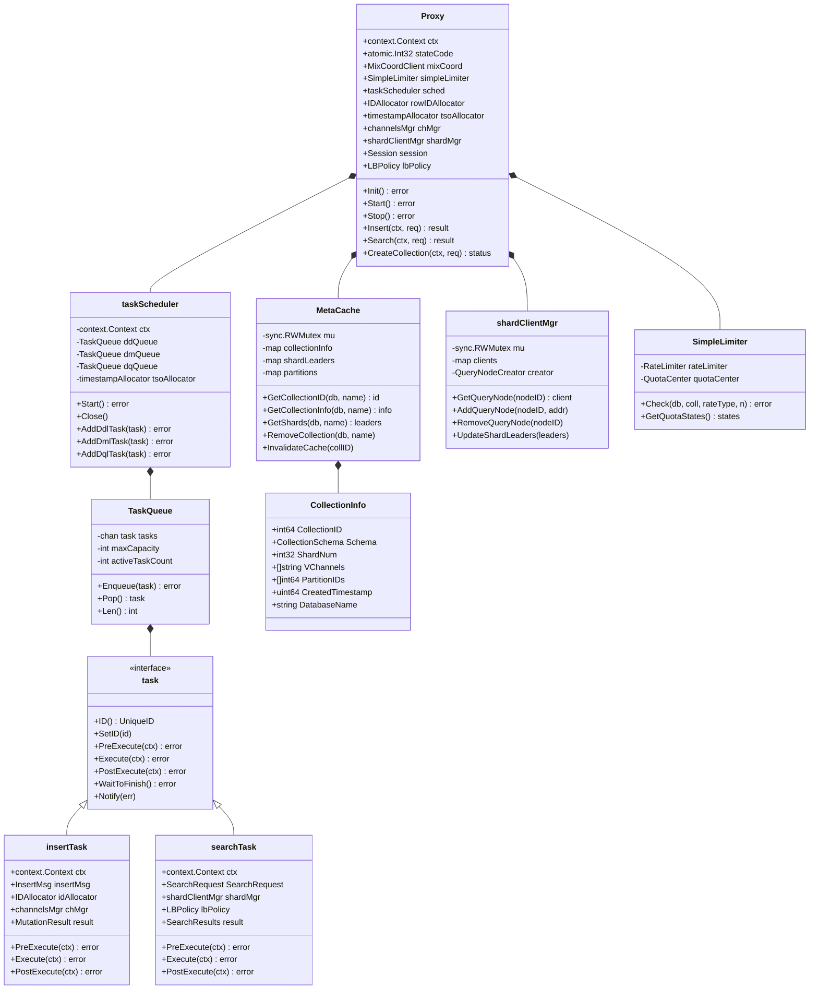

# Milvus-01-Proxy-数据结构

本文档详细说明Proxy模块中的关键数据结构，包括核心类、任务类、缓存类等。

## 1. 核心数据结构 UML图



**UML图说明**：

### 1.1 核心组件关系

1. **Proxy**：核心入口，聚合所有子组件
2. **taskScheduler**：任务调度器，管理三个任务队列（DDL/DML/DQL）
3. **TaskQueue**：任务队列，FIFO存储待执行任务
4. **task接口**：所有任务的统一接口，定义执行生命周期
5. **MetaCache**：元数据缓存，减少RootCoord调用
6. **shardClientMgr**：Shard客户端管理器，维护QueryNode连接池
7. **SimpleLimiter**：限流器，实现配额管理

### 1.2 设计模式

- **Strategy模式**：task接口实现不同类型任务（Insert/Search/DDL等）
- **Singleton模式**：globalMetaCache全局单例
- **Factory模式**：QueryNodeCreator创建QueryNode客户端
- **Observer模式**：TaskCondition实现任务完成通知

---

## 2. Proxy结构体详解

### 2.1 字段说明

```go
// Proxy Milvus接入层核心结构体
type Proxy struct {
    // 上下文与生命周期管理
    ctx    context.Context      // 全局上下文，用于控制生命周期
    cancel context.CancelFunc   // 取消函数，触发优雅关闭
    wg     sync.WaitGroup       // 等待组，等待goroutine退出
    
    // 状态管理
    stateCode atomic.Int32      // 原子状态码：Abnormal=0, Initializing=1, Healthy=2
    
    // 服务端信息
    address string               // 服务地址（host:port）
    ip      string              // IP地址
    port    int                 // 端口号
    
    // RPC客户端
    mixCoord types.MixCoordClient  // 混合协调器客户端（封装RootCoord/DataCoord/QueryCoord）
    
    // 资源分配器
    rowIDAllocator *allocator.IDAllocator        // 行ID分配器（AutoID场景）
    tsoAllocator   *timestampAllocator          // 时间戳分配器（TSO）
    
    // 任务调度
    sched *taskScheduler         // 任务调度器
    
    // 限流与配额
    simpleLimiter *SimpleLimiter  // 限流器
    
    // 通道与分片管理
    chMgr    channelsMgr         // DML Channel管理器
    shardMgr shardClientMgr      // Shard客户端管理器（QueryNode连接池）
    
    // Session与服务发现
    session *sessionutil.Session  // etcd会话，用于服务注册与心跳
    
    // 负载均衡
    lbPolicy LBPolicy            // 负载均衡策略（RoundRobin/LookAside）
    
    // 回调函数
    startCallbacks []func()      // 启动回调
    closeCallbacks []func()      // 关闭回调
    
    // 特性开关
    enableMaterializedView      bool  // 是否启用物化视图
    enableComplexDeleteLimit    bool  // 是否启用复杂删除限流
    
    // 监控与指标
    metricsCacheManager *metricsinfo.MetricsCacheManager  // 指标缓存管理器
    slowQueries         *expirable.LRU[Timestamp, *metricsinfo.SlowQuery]  // 慢查询缓存
    
    // 资源管理
    resourceManager resource.Manager  // 资源管理器（内存、CPU等）
}
```

### 2.2 生命周期方法

| 方法 | 阶段 | 功能 | 调用顺序 |
|------|------|------|----------|
| `NewProxy` | 创建 | 创建Proxy实例，初始化基础字段 | 1 |
| `Init` | 初始化 | 初始化Session、分配器、调度器、MetaCache | 2 |
| `Start` | 启动 | 启动调度器、分配器，注册服务 | 3 |
| `Register` | 注册 | 注册到etcd，开始接收请求 | 4 |
| `Stop` | 停止 | 停止调度器、关闭连接、注销服务 | 5 |

### 2.3 核心方法

**健康检查**：
```go
// GetStateCode 获取当前状态码
func (node *Proxy) GetStateCode() commonpb.StateCode {
    return commonpb.StateCode(node.stateCode.Load())
}

// UpdateStateCode 更新状态码（原子操作）
func (node *Proxy) UpdateStateCode(code commonpb.StateCode) {
    node.stateCode.Store(int32(code))
}
```

**资源获取**：
```go
// GetRateLimiter 获取限流器
func (node *Proxy) GetRateLimiter() (types.Limiter, error) {
    if node.simpleLimiter == nil {
        return nil, errors.New("nil rate limiter")
    }
    return node.simpleLimiter, nil
}
```

---

## 3. 任务相关数据结构

### 3.1 task接口

```go
// task 任务接口，定义任务执行生命周期
type task interface {
    // 基础方法
    ID() UniqueID                  // 获取任务唯一ID
    SetID(uid UniqueID)            // 设置任务ID
    Name() string                  // 获取任务名称
    Type() commonpb.MsgType        // 获取任务类型（Insert/Search等）
    
    // 时间戳
    BeginTs() Timestamp            // 获取开始时间戳
    EndTs() Timestamp              // 获取结束时间戳
    SetTs(ts Timestamp)            // 设置时间戳
    
    // 执行阶段
    PreExecute(ctx context.Context) error   // 前置处理（参数校验、权限验证）
    Execute(ctx context.Context) error      // 核心执行逻辑
    PostExecute(ctx context.Context) error  // 后置处理（结果封装）
    
    // 异步通知
    WaitToFinish() error           // 等待任务完成
    Notify(err error)              // 通知任务完成
    
    // 上下文
    Context() context.Context      // 获取任务上下文
    Cancel()                       // 取消任务
}
```

**接口说明**：

- **执行阶段**：三阶段模式确保任务结构清晰
  1. PreExecute：参数校验、权限验证、元数据查询
  2. Execute：核心业务逻辑（RPC调用、消息发布等）
  3. PostExecute：结果封装、指标上报

- **异步机制**：
  - `WaitToFinish()`：阻塞等待任务完成
  - `Notify(err)`：任务完成后通知等待者

### 3.2 insertTask结构体

```go
// insertTask 插入任务
type insertTask struct {
    // 嵌入Condition实现异步通知
    Condition
    
    // 上下文
    ctx context.Context
    
    // 请求数据
    insertMsg *msgstream.InsertMsg    // 插入消息（包含所有字段数据）
    
    // 依赖组件
    idAllocator     *allocator.IDAllocator  // ID分配器（AutoID场景）
    chMgr           channelsMgr             // Channel管理器
    segmentIDAssigner segmentIDAssigner     // Segment分配器
    
    // 元数据
    collectionID   int64                    // 集合ID
    partitionID    int64                    // 分区ID
    schema         *schemapb.CollectionSchema  // Schema信息
    partitionKeys  *schemapb.FieldData      // Partition Key数据
    
    // 结果
    result *milvuspb.MutationResult        // 插入结果
    
    // 时间戳
    ts             Timestamp                // 任务时间戳
    rowIDBegin     int64                    // 分配的行ID起始值
    rowIDEnd       int64                    // 分配的行ID结束值
}
```

**关键字段**：

| 字段 | 类型 | 说明 |
|------|------|------|
| insertMsg | *InsertMsg | 包含所有插入数据（列式存储） |
| idAllocator | *IDAllocator | AutoID场景下分配唯一ID |
| chMgr | channelsMgr | 管理DML Channel，用于发布消息 |
| schema | *CollectionSchema | 集合Schema，用于数据校验和分片 |
| result | *MutationResult | 插入结果（包含主键ID和Timestamp） |

**执行流程**：

```go
// PreExecute 前置处理
func (it *insertTask) PreExecute(ctx context.Context) error {
    // 1. 获取Collection元信息
    it.schema, err = globalMetaCache.GetCollectionSchema(ctx, it.insertMsg.DbName, it.insertMsg.CollectionName)
    
    // 2. 参数校验
    if err := validateInsertRequest(it.insertMsg, it.schema); err != nil {
        return err
    }
    
    // 3. 分配时间戳
    it.ts, err = it.tsoAllocator.AllocOne(ctx)
    
    return nil
}

// Execute 核心执行
func (it *insertTask) Execute(ctx context.Context) error {
    // 1. 分配行ID（AutoID场景）
    if it.schema.AutoID {
        it.rowIDBegin, it.rowIDEnd, err = it.idAllocator.Alloc(uint32(it.insertMsg.NumRows))
        fillAutoID(it.insertMsg.FieldsData, it.rowIDBegin, it.rowIDEnd)
    }
    
    // 2. 数据分片
    hashValues := hashPrimaryKeys(it.insertMsg.FieldsData, it.schema)
    shardData := groupByHash(it.insertMsg.FieldsData, hashValues, it.schema.ShardNum)
    
    // 3. 发布消息到MessageQueue
    for shardIdx, data := range shardData {
        insertMsg := constructInsertMsg(data, it.collectionID, it.partitionID, it.ts)
        stream, _ := it.chMgr.getOrCreateDMLStream(it.collectionID)
        err = stream.Produce(ctx, insertMsg)
    }
    
    return nil
}

// PostExecute 后置处理
func (it *insertTask) PostExecute(ctx context.Context) error {
    // 构造返回结果
    it.result = &milvuspb.MutationResult{
        Status:    merr.Success(),
        IDs:       extractPrimaryKeys(it.insertMsg.FieldsData),
        InsertCnt: int64(it.insertMsg.NumRows),
        Timestamp: it.ts,
    }
    return nil
}
```

### 3.3 searchTask结构体

```go
// searchTask 搜索任务
type searchTask struct {
    Condition
    
    ctx context.Context
    
    // 请求参数
    *milvuspb.SearchRequest        // 搜索请求（包含向量、TopK、过滤条件等）
    
    // 依赖组件
    shardMgr shardClientMgr        // Shard客户端管理器
    lbPolicy LBPolicy              // 负载均衡策略
    
    // 元数据
    collectionID int64              // 集合ID
    schema       *schemapb.CollectionSchema  // Schema
    partitionIDs []int64            // 分区ID列表
    
    // 查询参数解析
    topK       int64                // TopK数量
    metricType string               // 距离度量类型（L2/IP/COSINE）
    nq         int64                // 查询向量数量
    searchParams map[string]string  // 搜索参数（nprobe、ef等）
    
    // 结果
    result *milvuspb.SearchResults  // 搜索结果
}
```

**执行流程**：

```go
// PreExecute 前置处理
func (st *searchTask) PreExecute(ctx context.Context) error {
    // 1. 获取Collection元信息
    st.schema, err = globalMetaCache.GetCollectionSchema(ctx, st.DbName, st.CollectionName)
    
    // 2. 解析搜索参数
    st.parseSearchParams()  // 提取topK、metricType、nprobe等
    
    // 3. 参数校验
    if err := validateSearchRequest(st.SearchRequest, st.schema); err != nil {
        return err
    }
    
    return nil
}

// Execute 核心执行
func (st *searchTask) Execute(ctx context.Context) error {
    // 1. 获取Shard信息
    shardLeaders, err := globalMetaCache.GetShards(ctx, st.DbName, st.CollectionName)
    
    // 2. 构造QueryNode请求
    searchRequests := make([]*querypb.SearchRequest, len(shardLeaders))
    for i, leader := range shardLeaders {
        searchRequests[i] = &querypb.SearchRequest{
            Req:             st.SearchRequest,
            DmlChannels:     []string{leader.ChannelName},
            SegmentIDs:      leader.SegmentIDs,
        }
    }
    
    // 3. 并发查询所有Shard
    results := parallelSearch(ctx, searchRequests, st.shardMgr, st.lbPolicy)
    
    // 4. 归并结果（全局TopK）
    mergedResult := mergeSearchResults(results, st.nq, st.topK)
    
    st.result = &milvuspb.SearchResults{
        Status:  merr.Success(),
        Results: mergedResult,
    }
    
    return nil
}
```

### 3.4 TaskCondition（任务条件变量）

```go
// TaskCondition 任务条件变量，实现异步通知
type TaskCondition struct {
    done chan error         // 完成通道
    ctx  context.Context    // 任务上下文
}

// WaitToFinish 等待任务完成
func (tc *TaskCondition) WaitToFinish() error {
    select {
    case <-tc.ctx.Done():
        return tc.ctx.Err()  // 上下文取消
    case err := <-tc.done:
        return err           // 任务完成（成功或失败）
    }
}

// Notify 通知任务完成
func (tc *TaskCondition) Notify(err error) {
    tc.done <- err
}
```

**设计模式**：类似Go的`sync.Cond`，但基于channel实现，支持超时和取消。

---

## 4. 缓存相关数据结构

### 4.1 MetaCache结构体

```go
// MetaCache Collection元数据缓存（全局单例）
type MetaCache struct {
    mu sync.RWMutex  // 读写锁
    
    // Collection信息缓存：dbName -> collectionName -> CollectionInfo
    collectionInfo map[string]map[string]*CollectionInfo
    
    // CollectionID反向映射：collectionID -> []collectionName（支持Alias）
    collectionIDToName map[int64][]string
    
    // Shard信息缓存：dbName -> collectionName -> ShardLeaders
    shardLeaders map[string]map[string]*ShardLeaders
    
    // 分区信息缓存：dbName -> collectionName -> []PartitionInfo
    partitions map[string]map[string][]*PartitionInfo
    
    // 失效时间戳：collectionID -> timestamp（用于并发控制）
    invalidateTimestamp map[int64]uint64
    
    // RootCoord客户端（用于Cache Miss时查询）
    mixCoord types.MixCoordClient
}
```

**核心方法**：

```go
// GetCollectionID 获取Collection ID（带缓存）
func (m *MetaCache) GetCollectionID(ctx context.Context, dbName, collectionName string) (int64, error) {
    m.mu.RLock()
    if info, ok := m.collectionInfo[dbName][collectionName]; ok {
        m.mu.RUnlock()
        return info.CollectionID, nil
    }
    m.mu.RUnlock()
    
    // Cache Miss，从RootCoord查询
    resp, err := m.mixCoord.DescribeCollection(ctx, &milvuspb.DescribeCollectionRequest{
        DbName:         dbName,
        CollectionName: collectionName,
    })
    if err != nil {
        return 0, err
    }
    
    // 更新缓存
    m.mu.Lock()
    defer m.mu.Unlock()
    m.collectionInfo[dbName][collectionName] = &CollectionInfo{
        CollectionID: resp.CollectionID,
        Schema:       resp.Schema,
        // ... 其他字段
    }
    
    return resp.CollectionID, nil
}

// RemoveCollection 移除Collection缓存
func (m *MetaCache) RemoveCollection(ctx context.Context, dbName, collectionName string) {
    m.mu.Lock()
    defer m.mu.Unlock()
    
    if info, ok := m.collectionInfo[dbName][collectionName]; ok {
        // 删除正向映射
        delete(m.collectionInfo[dbName], collectionName)
        
        // 删除反向映射
        delete(m.collectionIDToName, info.CollectionID)
        
        // 删除Shard信息
        delete(m.shardLeaders[dbName], collectionName)
    }
}

// InvalidateCache 失效指定Collection的缓存
func (m *MetaCache) InvalidateCache(collectionID int64, timestamp uint64) {
    m.mu.Lock()
    defer m.mu.Unlock()
    
    // 更新失效时间戳
    m.invalidateTimestamp[collectionID] = timestamp
    
    // 删除所有相关缓存（包括Alias）
    if names, ok := m.collectionIDToName[collectionID]; ok {
        for _, name := range names {
            // 遍历所有数据库
            for dbName := range m.collectionInfo {
                delete(m.collectionInfo[dbName], name)
                delete(m.shardLeaders[dbName], name)
            }
        }
    }
}
```

**缓存失效策略**：

1. **主动失效**：RootCoord通过`InvalidateCollectionMetaCache` RPC通知Proxy
2. **被动失效**：Proxy调用RootCoord API时发现版本不匹配，自动失效
3. **TTL失效**：（未实现）基于时间的自动过期

### 4.2 CollectionInfo结构体

```go
// CollectionInfo Collection元信息
type CollectionInfo struct {
    // 基础信息
    CollectionID   int64      // 集合ID（全局唯一）
    CollectionName string     // 集合名
    DatabaseName   string     // 数据库名
    DatabaseID     int64      // 数据库ID
    
    // Schema
    Schema *schemapb.CollectionSchema  // 集合Schema（字段定义）
    
    // 分片信息
    ShardNum      int32       // Shard数量
    VChannels     []string    // Virtual Channel列表
    PChannels     []string    // Physical Channel列表
    
    // 分区信息
    PartitionIDs   []int64    // 所有分区ID
    PartitionNames []string   // 所有分区名
    
    // 时间戳
    CreatedTimestamp uint64    // 创建时间戳
    
    // 属性
    Properties map[string]string  // 扩展属性（TTL、MMap等）
    
    // 一致性级别
    ConsistencyLevel commonpb.ConsistencyLevel  // Strong/Bounded/Eventually
    
    // 状态
    State commonpb.CollectionState  // CollectionCreated/CollectionCreating/CollectionDropping/CollectionDropped
}
```

**字段映射规则**：

| CollectionInfo字段 | RootCoord API响应字段 | 说明 |
|-------------------|----------------------|------|
| CollectionID | DescribeCollectionResponse.CollectionID | 集合唯一标识 |
| Schema | DescribeCollectionResponse.Schema | 字段定义 |
| VChannels | DescribeCollectionResponse.VirtualChannelNames | 虚拟通道 |
| PartitionIDs | ShowPartitionsResponse.PartitionIDs | 分区列表 |

### 4.3 ShardLeaders结构体

```go
// ShardLeaders Shard领导者信息
type ShardLeaders struct {
    CollectionID int64                // 集合ID
    Shards       []*ShardLeaderInfo   // 每个Shard的领导者信息
}

// ShardLeaderInfo 单个Shard的领导者信息
type ShardLeaderInfo struct {
    ChannelName string     // DML Channel名称
    LeaderID    int64      // 领导QueryNode ID
    LeaderAddr  string     // 领导QueryNode地址
    NodeIDs     []int64    // 所有副本QueryNode ID列表
    SegmentIDs  []int64    // 该Shard负责的Segment ID列表
}
```

**使用场景**：

- Search/Query时选择QueryNode
- 负载均衡时选择最优节点
- 故障转移时切换到副本节点

**数据来源**：

```go
// 从QueryCoord获取Shard信息
resp, err := queryCoord.GetShardLeaders(ctx, &querypb.GetShardLeadersRequest{
    CollectionID: collectionID,
})

// 转换为ShardLeaders结构
shardLeaders := &ShardLeaders{
    CollectionID: collectionID,
    Shards:       make([]*ShardLeaderInfo, len(resp.Shards)),
}
for i, shard := range resp.Shards {
    shardLeaders.Shards[i] = &ShardLeaderInfo{
        ChannelName: shard.ChannelName,
        LeaderID:    shard.LeaderID,
        LeaderAddr:  shard.LeaderAddr,
        NodeIDs:     shard.NodeIds,
    }
}
```

---

## 5. 限流相关数据结构

### 5.1 SimpleLimiter结构体

```go
// SimpleLimiter 简单限流器
type SimpleLimiter struct {
    // 配额中心
    quotaCenter *QuotaCenter
    
    // 等待间隔
    allocWaitInterval time.Duration
    
    // 重试次数
    allocRetryTimes uint
}

// Check 检查是否超过配额
// 参数：
//   db: 数据库名
//   collection: 集合名
//   rateType: 速率类型（DMLInsert/DMLDelete/DQLSearch/DQLQuery）
//   n: 请求数量（行数、查询数等）
// 返回：
//   error: 超过配额时返回RateLimitExceeded错误
func (rl *SimpleLimiter) Check(db, collection string, rateType internalpb.RateType, n int64) error {
    // 1. 获取配额限制
    limit := rl.quotaCenter.GetQuotaLimit(db, collection, rateType)
    
    // 2. 尝试分配配额
    for i := uint(0); i < rl.allocRetryTimes; i++ {
        ok := rl.quotaCenter.TryAlloc(db, collection, rateType, n)
        if ok {
            return nil
        }
        
        // 等待后重试
        time.Sleep(rl.allocWaitInterval)
    }
    
    // 3. 超过重试次数，返回限流错误
    return merr.WrapErrServiceRateLimitExceeded(float64(limit))
}
```

### 5.2 QuotaCenter结构体

```go
// QuotaCenter 配额中心
type QuotaCenter struct {
    mu sync.RWMutex
    
    // 配额限制：db -> collection -> rateType -> limit
    quotaLimits map[string]map[string]map[internalpb.RateType]float64
    
    // Token Bucket实现
    buckets map[string]map[string]map[internalpb.RateType]*TokenBucket
}

// TokenBucket Token桶算法实现
type TokenBucket struct {
    capacity   float64    // 桶容量
    tokens     float64    // 当前令牌数
    rate       float64    // 令牌生成速率（tokens/second）
    lastUpdate time.Time  // 上次更新时间
    mu         sync.Mutex
}

// TryAlloc 尝试分配令牌
func (tb *TokenBucket) TryAlloc(n float64) bool {
    tb.mu.Lock()
    defer tb.mu.Unlock()
    
    // 1. 根据时间差补充令牌
    now := time.Now()
    elapsed := now.Sub(tb.lastUpdate).Seconds()
    tb.tokens = math.Min(tb.capacity, tb.tokens+elapsed*tb.rate)
    tb.lastUpdate = now
    
    // 2. 尝试消费令牌
    if tb.tokens >= n {
        tb.tokens -= n
        return true
    }
    
    return false
}
```

**Token Bucket算法说明**：

1. **容量（capacity）**：桶的最大令牌数，对应突发流量容忍度
2. **速率（rate）**：令牌生成速率，对应平均QPS限制
3. **令牌补充**：每次检查时根据时间差补充令牌
4. **令牌消费**：请求到来时消费对应数量的令牌

**配置示例**：

```yaml
quotaAndLimits:
  dml:
    insertRate:
      max: 1000           # 最大1000行/秒
      collection:
        max: 500          # 单Collection最大500行/秒
  dql:
    searchRate:
      max: 100            # 最大100次/秒
      collection:
        max: 50           # 单Collection最大50次/秒
```

---

## 6. 通道与分片管理数据结构

### 6.1 channelsMgr接口

```go
// channelsMgr DML Channel管理器接口
type channelsMgr interface {
    // 获取Collection的Virtual Channel列表
    getVChannels(collectionID int64) ([]string, error)
    
    // 获取或创建DML Stream
    getOrCreateDMLStream(collectionID int64) (msgstream.MsgStream, error)
    
    // 移除DML Stream
    removeDMLStream(collectionID int64)
}
```

### 6.2 shardClientMgr接口

```go
// shardClientMgr Shard客户端管理器接口
type shardClientMgr interface {
    // 获取QueryNode客户端
    GetQueryNode(nodeID int64) (types.QueryNodeClient, error)
    
    // 更新Shard领导者信息
    UpdateShardLeaders(collectionID int64, leaders *ShardLeaders) error
    
    // 关闭所有客户端
    Close()
}
```

**实现类shardClientMgrImpl**：

```go
type shardClientMgrImpl struct {
    mu sync.RWMutex
    
    // QueryNode客户端池：nodeID -> client
    clients map[int64]types.QueryNodeClient
    
    // 客户端创建函数
    creator QueryNodeCreator
}

// GetQueryNode 获取QueryNode客户端（带连接池）
func (mgr *shardClientMgrImpl) GetQueryNode(nodeID int64) (types.QueryNodeClient, error) {
    mgr.mu.RLock()
    if client, ok := mgr.clients[nodeID]; ok {
        mgr.mu.RUnlock()
        return client, nil
    }
    mgr.mu.RUnlock()
    
    // 创建新客户端
    mgr.mu.Lock()
    defer mgr.mu.Unlock()
    
    // Double check
    if client, ok := mgr.clients[nodeID]; ok {
        return client, nil
    }
    
    // 从etcd获取节点地址
    addr, err := mgr.getNodeAddr(nodeID)
    if err != nil {
        return nil, err
    }
    
    // 创建gRPC客户端
    client, err := mgr.creator(context.Background(), addr, nodeID)
    if err != nil {
        return nil, err
    }
    
    mgr.clients[nodeID] = client
    return client, nil
}
```

---

## 7. 负载均衡数据结构

### 7.1 LBPolicy接口

```go
// LBPolicy 负载均衡策略接口
type LBPolicy interface {
    // 从可用节点中选择一个
    SelectNode(ctx context.Context, availableNodes []int64) (int64, error)
    
    // 更新节点负载信息
    UpdateMetrics(nodeID int64, metrics *NodeMetrics)
    
    // 启动策略（后台线程更新负载信息）
    Start(ctx context.Context)
    
    // 关闭策略
    Close()
}
```

### 7.2 LookAsideBalancer（负载感知策略）

```go
// LookAsideBalancer 基于负载的负载均衡器
type LookAsideBalancer struct {
    mu sync.RWMutex
    
    // 节点负载信息：nodeID -> NodeMetrics
    nodeMetrics map[int64]*NodeMetrics
    
    // Shard管理器（用于查询可用节点）
    shardMgr shardClientMgr
}

// NodeMetrics 节点负载指标
type NodeMetrics struct {
    NodeID          int64      // 节点ID
    TotalMemory     uint64     // 总内存
    UsedMemory      uint64     // 已用内存
    CPUUsage        float64    // CPU使用率（0-1）
    QueryQueueLen   int        // 查询队列长度
    LastUpdateTime  time.Time  // 最后更新时间
}

// SelectNode 选择负载最低的节点
func (lb *LookAsideBalancer) SelectNode(ctx context.Context, availableNodes []int64) (int64, error) {
    if len(availableNodes) == 0 {
        return 0, errors.New("no available nodes")
    }
    
    lb.mu.RLock()
    defer lb.mu.RUnlock()
    
    // 计算每个节点的负载分数
    minScore := math.MaxFloat64
    selectedNode := availableNodes[0]
    
    for _, nodeID := range availableNodes {
        metrics, ok := lb.nodeMetrics[nodeID]
        if !ok {
            continue  // 没有负载信息，跳过
        }
        
        // 负载分数 = CPU使用率 * 0.5 + 内存使用率 * 0.3 + 队列长度/100 * 0.2
        memUsage := float64(metrics.UsedMemory) / float64(metrics.TotalMemory)
        score := metrics.CPUUsage*0.5 + memUsage*0.3 + float64(metrics.QueryQueueLen)/100*0.2
        
        if score < minScore {
            minScore = score
            selectedNode = nodeID
        }
    }
    
    return selectedNode, nil
}
```

### 7.3 RoundRobinBalancer（轮询策略）

```go
// RoundRobinBalancer 轮询负载均衡器
type RoundRobinBalancer struct {
    mu      sync.Mutex
    counter map[string]uint64  // key: Shard标识，value: 计数器
}

// SelectNode 轮询选择节点
func (rb *RoundRobinBalancer) SelectNode(ctx context.Context, availableNodes []int64) (int64, error) {
    if len(availableNodes) == 0 {
        return 0, errors.New("no available nodes")
    }
    
    rb.mu.Lock()
    defer rb.mu.Unlock()
    
    // 获取当前Shard的计数器
    shardKey := fmt.Sprintf("%v", availableNodes)
    counter := rb.counter[shardKey]
    
    // 选择节点
    selectedNode := availableNodes[counter%uint64(len(availableNodes))]
    
    // 递增计数器
    rb.counter[shardKey]++
    
    return selectedNode, nil
}
```

---

## 8. 数据结构使用示例

### 8.1 MetaCache使用

```go
// 获取Collection Schema
schema, err := globalMetaCache.GetCollectionSchema(ctx, "default", "my_collection")
if err != nil {
    // Cache Miss，自动从RootCoord查询并缓存
    log.Error("failed to get schema", zap.Error(err))
    return err
}

// 使用Schema进行数据校验
for _, field := range schema.Fields {
    if field.IsPrimaryKey {
        // 处理主键字段
    }
}
```

### 8.2 ShardClientMgr使用

```go
// 获取Shard信息
shardLeaders, err := globalMetaCache.GetShards(ctx, "default", "my_collection")
if err != nil {
    return err
}

// 为每个Shard发起查询
for _, leader := range shardLeaders.Shards {
    // 负载均衡选择节点
    nodeID, err := lbPolicy.SelectNode(ctx, leader.NodeIDs)
    if err != nil {
        continue
    }
    
    // 获取QueryNode客户端
    queryNode, err := shardMgr.GetQueryNode(nodeID)
    if err != nil {
        continue
    }
    
    // 发起RPC调用
    result, err := queryNode.Search(ctx, searchRequest)
}
```

### 8.3 限流器使用

```go
// 检查是否超过配额
err := limiter.Check("default", "my_collection", internalpb.RateType_DQLSearch, 1)
if err != nil {
    // 触发限流
    return &milvuspb.SearchResults{
        Status: merr.Status(merr.ErrServiceRateLimitExceeded),
    }, nil
}

// 正常执行查询
result, err := executeSearch(ctx, request)
```

---

**相关文档**：
- [Milvus-01-Proxy-概览.md](./Milvus-01-Proxy-概览.md)
- [Milvus-01-Proxy-API.md](./Milvus-01-Proxy-API.md)
- [Milvus-01-Proxy-时序图.md](./Milvus-01-Proxy-时序图.md)

