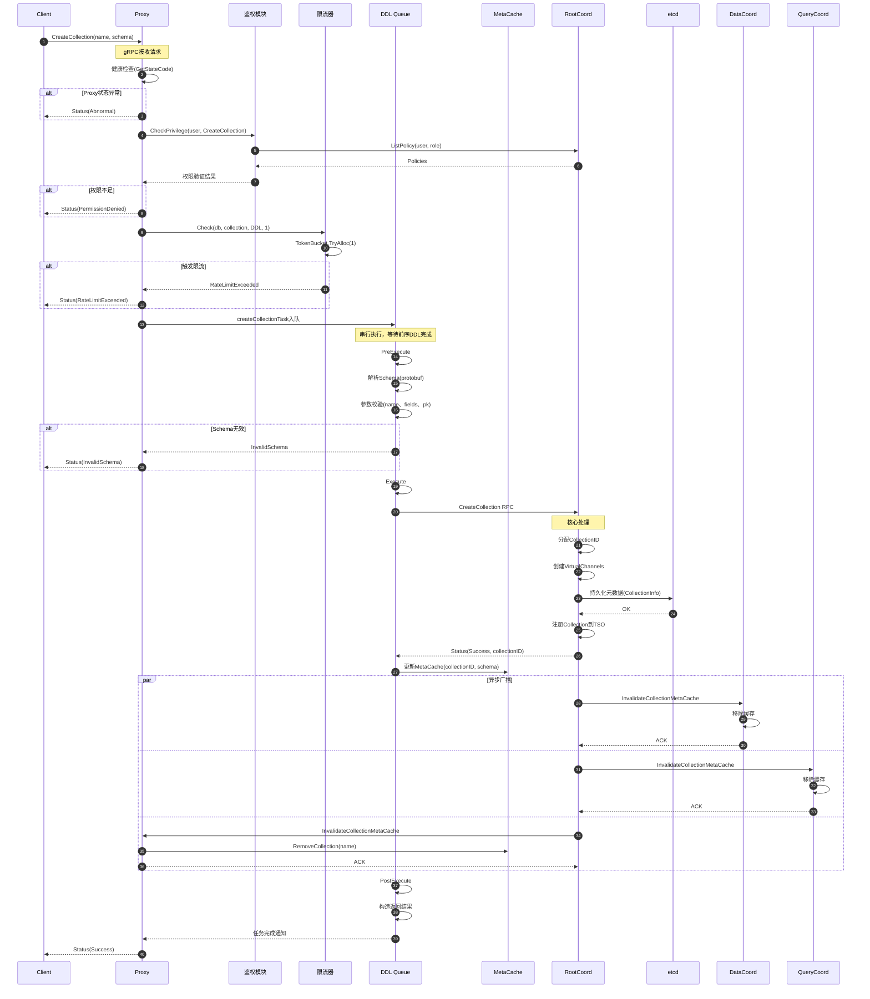
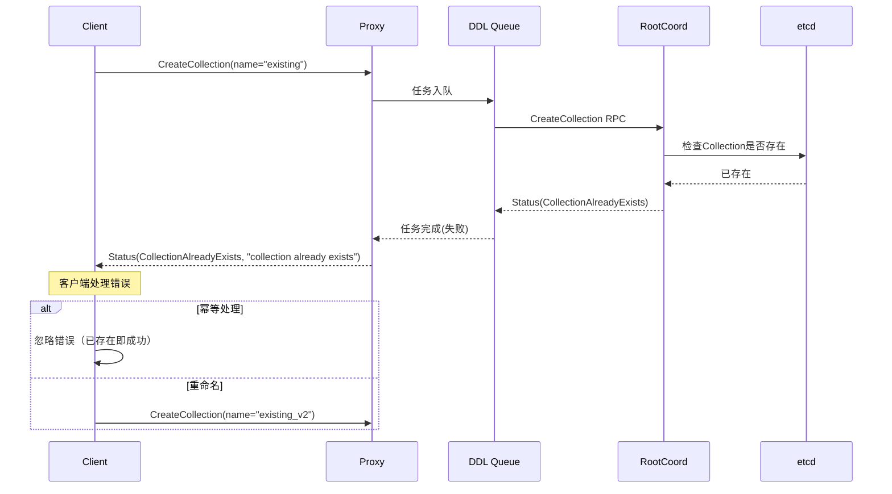
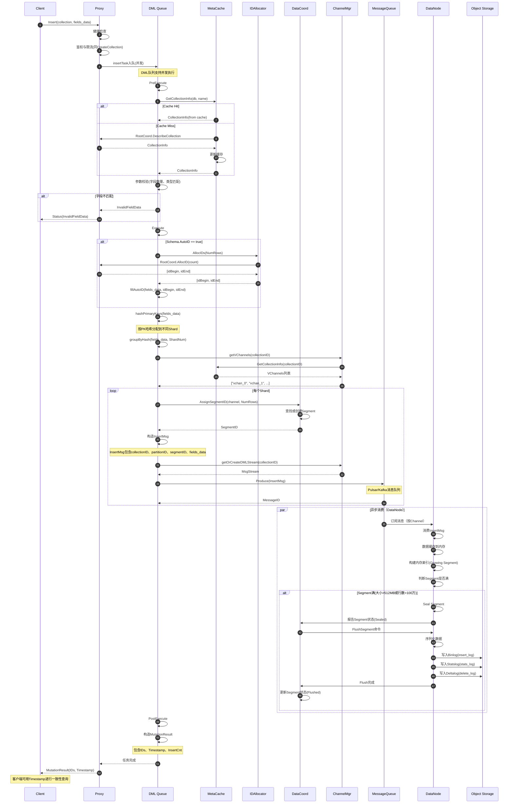
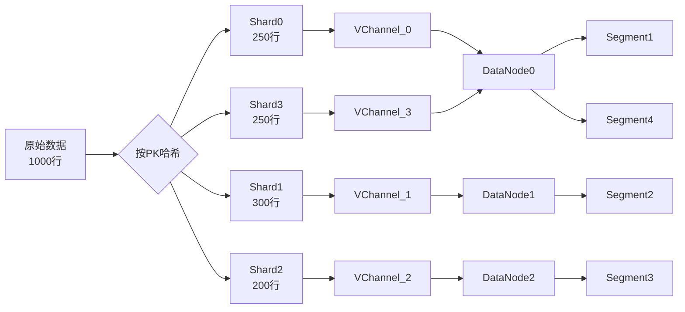
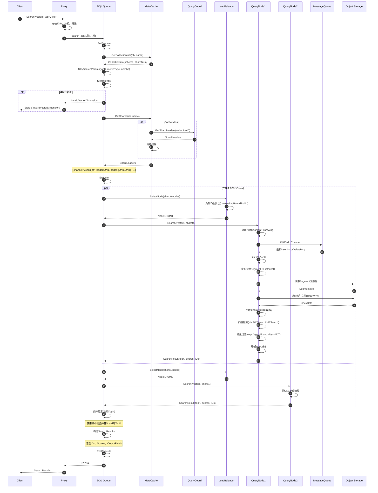
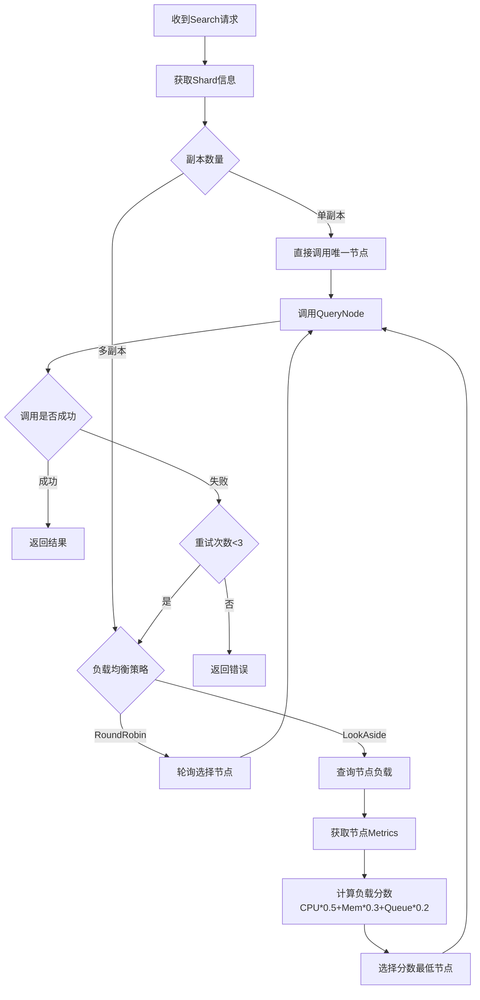
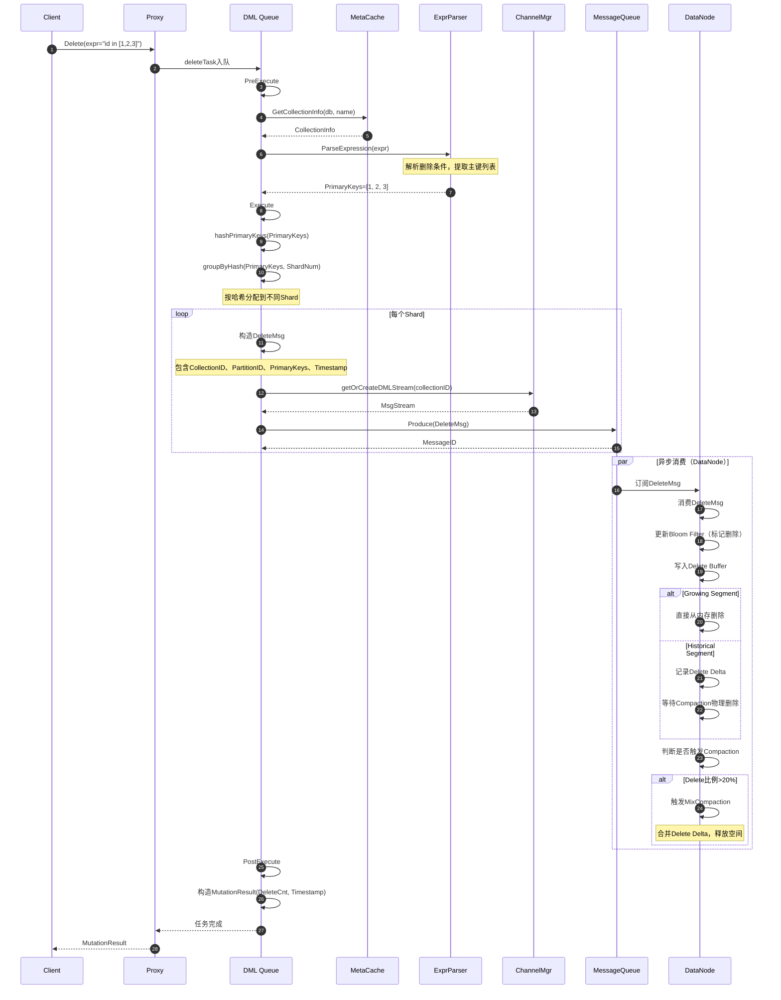
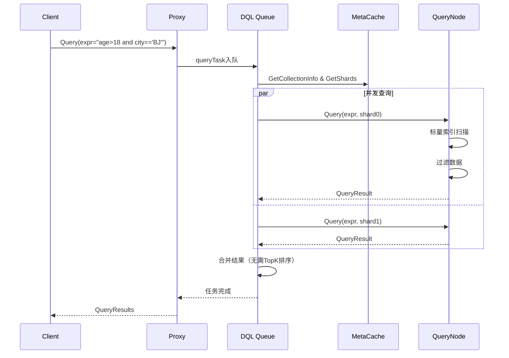

# Milvus-01-Proxy-时序图

本文档提供Proxy模块核心API的详细时序图，展示各类请求从接收到响应的完整调用链路。

## 1. CreateCollection 时序图

### 1.1 完整流程



### 1.2 时序图关键点说明

**步骤1-4：请求接收与健康检查**
- Proxy通过gRPC接收客户端请求
- 检查Proxy状态（Healthy/Initializing/Abnormal）
- 状态异常时直接返回错误，避免级联失败

**步骤5-8：权限验证**
- 调用鉴权模块检查用户权限
- 鉴权模块从RootCoord获取用户的策略（Policy）
- 检查是否有`CreateCollection`权限
- 权限不足时返回`PermissionDenied`错误

**步骤9-13：限流检查**
- 限流器基于TokenBucket算法
- DDL操作通常配额较大，很少触发限流
- 限流触发时返回`RateLimitExceeded`，建议客户端退避重试

**步骤14-15：任务入队**
- 创建`createCollectionTask`对象
- 进入DDL队列（串行执行）
- DDL队列保证元数据操作的顺序性

**步骤16-22：PreExecute阶段**
- 解析Schema（从protobuf bytes反序列化）
- 校验参数：
  - Collection名称合法性（长度、字符集）
  - 字段定义完整性（必须有主键、向量字段）
  - 向量维度有效性（≤32768）
  - Shard数量合理性（1-64）

**步骤23-31：Execute阶段（核心）**
- 调用RootCoord的`CreateCollection` RPC
- RootCoord执行：
  1. 分配全局唯一CollectionID
  2. 创建VirtualChannels（数量=ShardsNum）
  3. 持久化元数据到etcd
  4. 注册到TSO服务（分配时间戳）
- 返回成功状态和CollectionID

**步骤32：MetaCache更新**
- Proxy更新本地MetaCache
- 后续请求可直接从缓存读取，无需调用RootCoord

**步骤33-44：异步广播失效通知**
- RootCoord并发向所有Proxy、DataCoord、QueryCoord广播
- 各组件收到通知后移除本地缓存
- 保证分布式缓存一致性

**步骤45-48：PostExecute与返回**
- 构造返回结果
- 通知等待者任务完成
- 返回Status给客户端

### 1.3 异常场景



---

## 2. Insert 时序图

### 2.1 完整流程



### 2.2 时序图关键点说明

**步骤1-5：请求接收与前置检查**
- 与CreateCollection类似的健康检查、鉴权、限流
- DML任务进入并发队列（与DDL串行不同）

**步骤6-13：MetaCache查询**
- 优先从本地缓存获取Collection元信息
- Cache Miss时调用RootCoord并更新缓存
- 缓存命中率通常>95%

**步骤14-17：参数校验**
- 检查字段数量是否匹配Schema
- 检查字段类型是否匹配（Int64/Float/Vector等）
- 检查向量维度是否正确
- 检查主键是否存在（非AutoID场景）

**步骤18-24：AutoID处理**
- 如果主键字段标记为AutoID
- 调用IDAllocator分配唯一ID
- IDAllocator从RootCoord批量分配（每次1000个）
- 填充ID到主键字段

**步骤25-27：数据分片**
- 按主键哈希值分配到不同Shard
- 哈希算法：`hash(primaryKey) % ShardNum`
- 保证相同主键总是路由到同一Shard（Upsert/Delete一致性）

**步骤28-31：Channel查询**
- 获取Collection的VirtualChannel列表
- 每个Shard对应一个VChannel
- VChannel映射到PChannel（物理通道）

**步骤32-41：消息发布**
- 为每个Shard生成InsertMsg
- 调用DataCoord分配SegmentID
- 构造消息并发布到MessageQueue
- 返回MessageID作为确认

**步骤42-53：异步消费（DataNode）**
- DataNode订阅对应的Channel
- 消费InsertMsg并缓存数据
- 构建内存索引（Growing Segment）
- Segment满时触发Flush：
  1. Seal Segment（不再接受新数据）
  2. 序列化数据为Binlog
  3. 写入Object Storage
  4. 通知DataCoord更新状态

**步骤54-58：返回结果**
- 构造MutationResult
- 包含插入的主键ID列表
- 包含操作Timestamp（用于一致性查询）

### 2.3 数据分片示意



---

## 3. Search 时序图

### 3.1 完整流程



### 3.2 时序图关键点说明

**步骤1-5：请求接收与前置检查**
- 同Insert流程

**步骤6-11：元数据查询**
- 获取Collection Schema（校验向量维度）
- 解析搜索参数（topK、metric_type、nprobe等）

**步骤12-19：Shard信息查询**
- 从MetaCache获取Shard领导者信息
- Cache Miss时查询QueryCoord
- ShardLeaders包含：
  - ChannelName：DML Channel名称
  - LeaderID：主节点ID
  - NodeIDs：所有副本节点ID列表

**步骤20-46：并发查询**
- Proxy并发向所有Shard发起查询
- 每个Shard独立执行：
  1. **负载均衡**：从副本节点中选择一个
  2. **Growing查询**：查询内存中的增量数据
  3. **Historical查询**：查询已刷新的磁盘数据
  4. **向量检索**：使用索引（HNSW/IVF）加速
  5. **标量过滤**：应用过滤表达式
  6. **局部TopK**：返回该Shard的TopK结果

**步骤47-50：结果归并**
- 使用最小堆（Min Heap）归并各Shard结果
- 时间复杂度：O(K * log(M))，K=TopK，M=Shard数*TopK
- 保证全局TopK准确性

**步骤51-55：返回结果**
- 构造SearchResults
- 包含：主键ID、距离分数、输出字段数据

### 3.3 负载均衡决策



### 3.4 查询并发度

```mermaid
gantt
    title Search并发执行时间线
    dateFormat SSS
    axisFormat %L ms
    
    section Proxy
    接收请求           :done, p1, 000, 2ms
    解析参数           :done, p2, after p1, 3ms
    任务入队           :done, p3, after p2, 1ms
    
    section Shard0
    负载均衡          :active, s01, 006, 2ms
    RPC调用           :active, s02, after s01, 5ms
    向量检索          :active, s03, after s02, 50ms
    返回结果          :active, s04, after s03, 2ms
    
    section Shard1
    负载均衡          :active, s11, 006, 2ms
    RPC调用           :active, s12, after s11, 5ms
    向量检索          :active, s13, after s12, 45ms
    返回结果          :active, s14, after s13, 2ms
    
    section Shard2
    负载均衡          :active, s21, 006, 2ms
    RPC调用           :active, s22, after s21, 5ms
    向量检索          :active, s23, after s22, 55ms
    返回结果          :active, s24, after s23, 2ms
    
    section Proxy
    结果归并          :crit, p4, 070, 5ms
    返回客户端        :crit, p5, after p4, 2ms
```



**说明**：
- 并发查询3个Shard，总耗时取决于最慢的Shard（约65ms）
- 串行查询总耗时 = 50+45+55 = 150ms
- 并发带来2-3倍性能提升

---

## 4. Delete 时序图

### 4.1 完整流程



### 4.2 删除机制说明

**逻辑删除**：
- Delete操作仅标记删除，不立即物理删除
- 使用Bloom Filter快速判断数据是否被删除
- 查询时过滤已删除数据

**物理删除**：
- 由Compaction任务执行
- 合并Delete Delta到Segment
- 释放存储空间

**删除流程**：
```
逻辑删除（立即） → 查询过滤（实时） → 物理删除（异步）
```

---

## 5. Query 时序图

### 5.1 完整流程

Query与Search类似，但有以下区别：

| 特性 | Search | Query |
|------|--------|-------|
| **查询方式** | 向量近邻搜索 | 标量过滤查询 |
| **输入** | 向量+过滤条件 | 仅过滤条件（expr） |
| **输出** | TopK结果 | 所有匹配结果 |
| **性能** | 取决于索引 | 取决于过滤条件选择性 |



---

## 6. 总结与性能分析

### 6.1 API延迟对比

| API | P50 | P95 | P99 | 瓶颈 |
|-----|-----|-----|-----|------|
| **CreateCollection** | 50ms | 100ms | 200ms | etcd写入 |
| **Insert** | 5ms | 20ms | 50ms | Message Queue |
| **Search** | 20ms | 80ms | 150ms | 向量检索 |
| **Query** | 10ms | 40ms | 100ms | 标量索引 |
| **Delete** | 5ms | 15ms | 30ms | Message Queue |

### 6.2 并发度

| 队列类型 | 并发度 | 说明 |
|---------|--------|------|
| **DDL Queue** | 串行（1） | 保证元数据一致性 |
| **DML Queue** | 并发（可配置） | 默认64并发 |
| **DQL Queue** | 并发（可配置） | 默认64并发 |

### 6.3 优化建议

**Insert优化**：
- 批量插入（1000-5000行/批）
- 预计算HashKeys
- 使用流式API（FixedWidthInsert）

**Search优化**：
- 合理设置TopK（≤1000）
- 使用标量过滤缩小范围
- 批量查询（≤10个向量/批）

**Delete优化**：
- 批量删除（≤1000个ID/批）
- 定期触发Compaction释放空间

---

**相关文档**：
- [Milvus-01-Proxy-概览.md](./Milvus-01-Proxy-概览.md)
- [Milvus-01-Proxy-API.md](./Milvus-01-Proxy-API.md)
- [Milvus-01-Proxy-数据结构.md](./Milvus-01-Proxy-数据结构.md)

