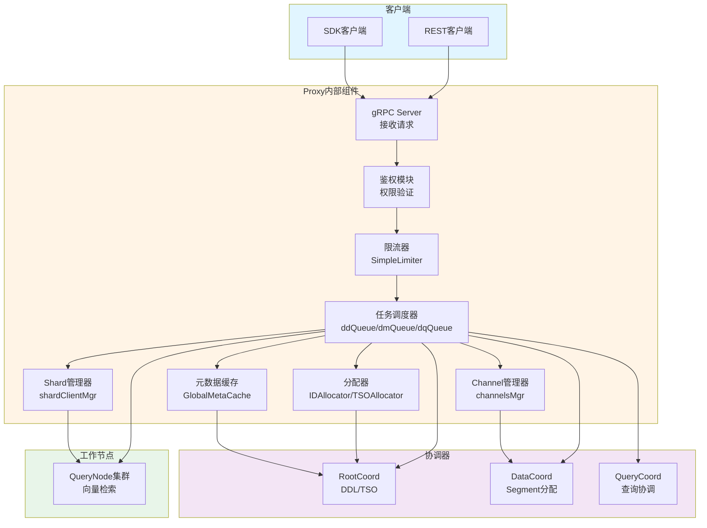
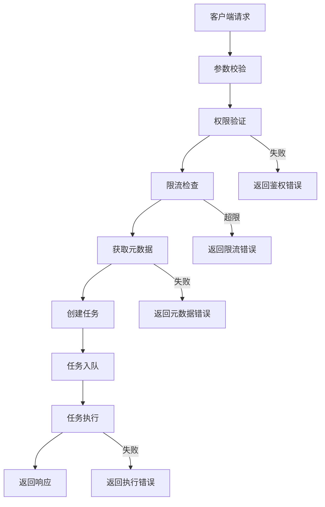

# Milvus-01-Proxy-概览

## 1. 模块职责

Proxy模块作为Milvus系统的接入层，承担以下核心职责：

### 1.1 核心功能

- **统一入口**：接收所有客户端请求（DDL、DML、DQL）
- **请求路由**：根据请求类型路由到对应的Coordinator或Worker Node
- **权限验证**：身份认证、RBAC权限检查
- **限流保护**：基于配额的请求限流，防止系统过载
- **结果聚合**：聚合多个QueryNode的查询结果，返回全局TopK
- **负载均衡**：在多个QueryNode之间分配查询负载

### 1.2 输入输出

**输入**：
- 客户端gRPC请求（Python/Go/Java SDK）
- RESTful API请求
- 其他Coordinator的内部调用

**输出**：
- 客户端响应（成功/失败状态、数据结果）
- 向Coordinator发起的RPC调用
- 向DataNode/QueryNode发起的RPC调用

### 1.3 上下游依赖

**上游（调用方）**：
- 客户端SDK
- RESTful API网关

**下游（被调用）**：
- **RootCoord**：DDL操作、TSO分配、Schema查询
- **DataCoord**：Segment分配、Channel分配
- **QueryCoord**：查询节点信息、Collection加载状态
- **DataNode**：（无直接调用）
- **QueryNode**：Search、Query操作
- **MetaCache**：Collection/Schema元数据缓存

### 1.4 生命周期

```
创建 → 初始化 → 启动 → 运行 → 停止
```

**初始化阶段**（Init）：
- 连接etcd，注册Session
- 初始化ID分配器、Timestamp分配器
- 初始化Channel管理器
- 初始化任务调度器
- 初始化MetaCache

**启动阶段**（Start）：
- 启动Shard管理器
- 启动任务调度器
- 启动ID分配器
- 状态设置为Healthy

**运行阶段**：
- 处理客户端请求
- 维护心跳
- 更新元数据缓存

**停止阶段**（Stop）：
- 关闭ID分配器
- 关闭任务调度器
- 停止Session
- 关闭Shard管理器

## 2. 模块架构图



### 2.1 架构说明

#### 2.1.1 组件职责

**gRPC Server**：
- 实现`milvuspb.MilvusService`接口
- 接收并解析客户端请求
- 路由到对应的处理函数

**鉴权模块**：
- 验证用户身份（用户名/密码、Token）
- 检查RBAC权限（Collection/Database级别）
- 缓存权限信息，减少RootCoord调用

**限流器（SimpleLimiter）**：
- 基于Token Bucket算法
- 支持DML/DQL分类限流
- 配额管理（QPS、带宽、并发）

**任务调度器（TaskScheduler）**：
- 管理三个任务队列：
  - `ddQueue`：DDL任务（CreateCollection、DropCollection等）
  - `dmQueue`：DML任务（Insert、Delete、Upsert等）
  - `dqQueue`：DQL任务（Search、Query等）
- 串行执行DDL，并发执行DML/DQL
- 任务超时管理

**元数据缓存（GlobalMetaCache）**：
- 缓存Collection Schema
- 缓存Partition信息
- 缓存Shard信息（Query Node映射）
- 失效策略：接收RootCoord的失效通知

**Shard管理器（shardClientMgr）**：
- 维护QueryNode连接池
- 负载均衡策略（RoundRobin、LookAside）
- 健康检查

**Channel管理器（channelsMgr）**：
- 管理DML Channel（数据写入通道）
- Channel与Collection的映射
- 消息生产者管理

**分配器**：
- **IDAllocator**：分配行ID（PrimaryKey为AutoID时）
- **TSOAllocator**：分配全局时间戳

#### 2.1.2 边界条件

**并发控制**：
- DDL串行执行，避免元数据冲突
- DML/DQL并发执行，提升吞吐
- 任务队列有容量限制（默认1024）

**超时设置**：
- 默认请求超时：60秒
- DDL操作超时：可配置，默认10分钟
- RPC调用超时：可配置，默认5秒

**幂等性**：
- Insert操作：按PrimaryKey去重
- Delete操作：删除不存在的数据不报错
- DDL操作：重复创建Collection返回已存在错误

#### 2.1.3 异常与回退

**Coordinator不可用**：
- 自动重试（指数退避）
- 超过最大重试次数返回错误
- 客户端需处理错误并重试

**QueryNode不可用**：
- 负载均衡器自动切换到其他副本
- 若所有副本不可用，返回错误

**限流触发**：
- 返回`RateLimitExceeded`错误
- 客户端需实现退避重试

**MetaCache失效**：
- 接收失效通知后清空缓存
- 下次请求时重新从RootCoord获取

#### 2.1.4 性能与容量假设

**请求处理能力**：
- 单Proxy QPS：5000-10000（取决于请求类型）
- 推荐部署：2-4个Proxy实例

**内存占用**：
- 基础内存：500MB
- MetaCache：按Collection数量线性增长，约1MB/Collection
- 连接池：每个QueryNode约10MB

**缓存命中率**：
- MetaCache命中率：> 95%（稳定状态）
- Shard信息缓存命中率：> 99%

#### 2.1.5 版本兼容说明

**向后兼容**：
- gRPC接口支持协议兼容（Protobuf向后兼容）
- 新增字段使用Optional，旧客户端可忽略

**滚动升级**：
- 支持Proxy滚动升级（无服务中断）
- 客户端SDK自动重连

## 3. 核心流程剖析

### 3.1 请求处理流程



### 3.2 Insert操作流程（核心代码）

```go
// Insert 数据插入接口
// 参数：
//   ctx: 上下文，携带超时、Trace等信息
//   request: 插入请求，包含CollectionName、PartitionName、FieldsData
// 返回：
//   *milvuspb.MutationResult: 插入结果，包含IDs、Timestamp
//   error: 错误信息
func (node *Proxy) Insert(ctx context.Context, request *milvuspb.InsertRequest) (*milvuspb.MutationResult, error) {
    // 1. 健康检查
    if err := merr.CheckHealthy(node.GetStateCode()); err != nil {
        return &milvuspb.MutationResult{Status: merr.Status(err)}, nil
    }
    
    // 2. 参数校验
    if err := validateInsertRequest(request); err != nil {
        return &milvuspb.MutationResult{Status: merr.Status(err)}, nil
    }
    
    // 3. 权限验证
    if err := node.checkPrivilege(ctx, request.DbName, request.CollectionName, "Insert"); err != nil {
        return &milvuspb.MutationResult{Status: merr.Status(err)}, nil
    }
    
    // 4. 限流检查
    if err := node.simpleLimiter.Check(request.DbName, request.CollectionName, internalpb.RateType_DMLInsert, request.NumRows); err != nil {
        return &milvuspb.MutationResult{Status: merr.Status(err)}, nil
    }
    
    // 5. 获取Collection Schema
    collectionInfo, err := globalMetaCache.GetCollectionInfo(ctx, request.DbName, request.CollectionName)
    if err != nil {
        return &milvuspb.MutationResult{Status: merr.Status(err)}, nil
    }
    
    // 6. 分配行ID（如果PrimaryKey是AutoID）
    if collectionInfo.Schema.AutoID {
        rowNum := len(request.FieldsData[0].FieldData)
        idBegin, idEnd, err := node.rowIDAllocator.Alloc(uint32(rowNum))
        if err != nil {
            return &milvuspb.MutationResult{Status: merr.Status(err)}, nil
        }
        // 填充AutoID
        fillAutoID(request.FieldsData, idBegin, idEnd)
    }
    
    // 7. 数据分片（按PrimaryKey Hash）
    shards := hashPrimaryKeys(request.FieldsData, collectionInfo.ShardNum)
    
    // 8. 为每个Shard分配Segment
    segmentAllocs := make(map[string]*datapb.SegmentIDRequest)
    for shardIndex, data := range shards {
        segmentAllocs[shardIndex] = &datapb.SegmentIDRequest{
            Count: uint32(len(data)),
            ChannelName: collectionInfo.VChannels[shardIndex],
        }
    }
    segmentIDs, err := node.mixCoord.AssignSegmentID(ctx, &datapb.AssignSegmentIDRequest{
        SegmentIDRequests: segmentAllocs,
    })
    if err != nil {
        return &milvuspb.MutationResult{Status: merr.Status(err)}, nil
    }
    
    // 9. 构造InsertMsg并发布到MessageQueue
    for shardIndex, data := range shards {
        insertMsg := &msgstream.InsertMsg{
            BaseMsg: msgstream.BaseMsg{
                BeginTimestamp: request.Base.Timestamp,
                EndTimestamp:   request.Base.Timestamp,
            },
            InsertRequest: msgpb.InsertRequest{
                CollectionID: collectionInfo.CollectionID,
                PartitionID:  collectionInfo.PartitionID,
                SegmentID:    segmentIDs[shardIndex],
                FieldsData:   data,
                NumRows:      uint64(len(data)),
            },
        }
        
        // 发布到对应的DML Channel
        err := node.chMgr.getOrCreateDMLStream(collectionInfo.CollectionID).Produce(ctx, insertMsg)
        if err != nil {
            return &milvuspb.MutationResult{Status: merr.Status(err)}, nil
    }
    }
    
    // 10. 返回结果
    return &milvuspb.MutationResult{
        Status: merr.Success(),
        IDs:    extractPrimaryKeys(request.FieldsData),
        Timestamp: request.Base.Timestamp,
    }, nil
}
```

**流程说明**：

1. **健康检查**：确保Proxy状态为Healthy
2. **参数校验**：检查CollectionName非空、FieldsData格式正确
3. **权限验证**：检查用户是否有Insert权限
4. **限流检查**：检查是否超过DML配额
5. **Schema查询**：从MetaCache获取Collection元信息
6. **ID分配**：为AutoID字段分配唯一ID
7. **数据分片**：按PrimaryKey哈希分配到不同Shard
8. **Segment分配**：向DataCoord请求Segment ID
9. **消息发布**：构造InsertMsg发布到Message Queue
10. **返回结果**：返回插入成功的ID列表

### 3.3 Search操作流程（核心代码）

```go
// Search 向量检索接口
// 参数：
//   ctx: 上下文
//   request: 检索请求，包含CollectionName、Vector、TopK、MetricType
// 返回：
//   *milvuspb.SearchResults: 检索结果
//   error: 错误信息
func (node *Proxy) Search(ctx context.Context, request *milvuspb.SearchRequest) (*milvuspb.SearchResults, error) {
    // 1-4步与Insert类似：健康检查、参数校验、权限验证、限流检查
    
    // 5. 获取Collection信息
    collectionInfo, err := globalMetaCache.GetCollectionInfo(ctx, request.DbName, request.CollectionName)
    if err != nil {
        return &milvuspb.SearchResults{Status: merr.Status(err)}, nil
    }
    
    // 6. 获取QueryNode分片信息
    shardLeaders, err := globalMetaCache.GetShards(ctx, request.DbName, request.CollectionName)
    if err != nil {
        return &milvuspb.SearchResults{Status: merr.Status(err)}, nil
    }
    
    // 7. 构造SearchRequest分发到每个Shard
    searchRequests := make([]*querypb.SearchRequest, 0, len(shardLeaders))
    for _, leader := range shardLeaders {
        searchRequests = append(searchRequests, &querypb.SearchRequest{
            Req:             request,
            DmlChannels:     []string{leader.ChannelName},
            SegmentIDs:      leader.SegmentIDs,
            FromShardLeader: true,
        })
    }
    
    // 8. 并发查询所有Shard
    results := make([]*internalpb.SearchResults, len(searchRequests))
    var wg sync.WaitGroup
    var mu sync.Mutex
    errors := make([]error, len(searchRequests))
    
    for i, req := range searchRequests {
        wg.Add(1)
        go func(index int, request *querypb.SearchRequest) {
            defer wg.Done()
            
            // 选择QueryNode（负载均衡）
            queryNode, err := node.shardMgr.GetQueryNode(shardLeaders[index].NodeID)
            if err != nil {
                mu.Lock()
                errors[index] = err
                mu.Unlock()
                return
            }
            
            // 发起RPC调用
            result, err := queryNode.Search(ctx, request)
            if err != nil {
                mu.Lock()
                errors[index] = err
                mu.Unlock()
                return
            }
            
            mu.Lock()
            results[index] = result
            mu.Unlock()
        }(i, req)
    }
    wg.Wait()
    
    // 9. 检查错误
    for _, err := range errors {
        if err != nil {
            return &milvuspb.SearchResults{Status: merr.Status(err)}, nil
        }
    }
    
    // 10. 归并结果（全局TopK）
    finalResult := mergeSearchResults(results, request.TopK)
    
    return &milvuspb.SearchResults{
        Status:  merr.Success(),
        Results: finalResult,
    }, nil
}

// mergeSearchResults 归并多个Shard的检索结果
// 参数：
//   results: 各Shard的局部TopK结果
//   topK: 全局TopK数量
// 返回：
//   *schemapb.SearchResultData: 全局TopK结果
func mergeSearchResults(results []*internalpb.SearchResults, topK int64) *schemapb.SearchResultData {
    // 使用最小堆归并各Shard的结果
    heap := &ResultHeap{}
    heap.Init(topK)
    
    for _, result := range results {
        for _, item := range result.GetSlicedBlob() {
            heap.Push(item)
        }
    }
    
    // 提取TopK结果
    return heap.GetTopK()
}
```

**流程说明**：

1-4. 前置检查（同Insert）
5. 查询Collection元信息
6. 获取Shard信息（QueryNode映射）
7. 构造分片查询请求
8. 并发查询所有Shard
9. 错误检查
10. 归并结果（全局TopK）

### 3.4 复杂度分析

**Insert操作**：
- 时间复杂度：O(N)，N为插入行数
- 空间复杂度：O(N)
- 瓶颈：数据序列化、Message Queue写入

**Search操作**：
- 时间复杂度：O(K * log(M))，K为TopK，M为总结果数
- 空间复杂度：O(K * S)，S为Shard数量
- 瓶颈：QueryNode向量检索、网络传输、结果归并

## 4. 关键数据结构

### 4.1 Proxy结构体

```go
// Proxy Milvus接入层核心结构
type Proxy struct {
    ctx    context.Context    // 上下文
    cancel context.CancelFunc  // 取消函数
    
    stateCode atomic.Int32  // 状态码（Abnormal/Initializing/Healthy）
    
    // 协调器客户端
    mixCoord types.MixCoordClient  // 混合协调器客户端
    
    // 资源管理
    rowIDAllocator *allocator.IDAllocator      // 行ID分配器
    tsoAllocator   *timestampAllocator         // 时间戳分配器
    
    // 任务调度
    sched *taskScheduler  // 任务调度器（管理三个队列）
    
    // 限流
    simpleLimiter *SimpleLimiter  // 简单限流器
    
    // 通道与分片管理
    chMgr    channelsMgr      // 通道管理器
    shardMgr shardClientMgr   // 分片客户端管理器
    
    // 会话与注册
    session *sessionutil.Session  // etcd会话
    
    // 负载均衡
    lbPolicy LBPolicy  // 负载均衡策略
    
    // 资源管理
    resourceManager resource.Manager  // 资源管理器
}
```

### 4.2 TaskScheduler结构体

```go
// taskScheduler 任务调度器
type taskScheduler struct {
    ctx    context.Context
    cancel context.CancelFunc
    wg     sync.WaitGroup
    
    // 三个任务队列
    ddQueue *TaskQueue  // DDL队列（串行）
    dmQueue *TaskQueue  // DML队列（并发）
    dqQueue *TaskQueue  // DQL队列（并发）
    
    // 分配器
    tsoAllocator *timestampAllocator
}

// TaskQueue 任务队列
type TaskQueue struct {
    tasks chan task  // 任务通道
    maxCapacity int  // 最大容量
}
```

### 4.3 MetaCache结构体

```go
// MetaCache Collection元数据缓存
type MetaCache struct {
    mu sync.RWMutex
    
    // Collection映射：dbName -> collectionName -> CollectionInfo
    collectionInfo map[string]map[string]*CollectionInfo
    
    // Shard映射：dbName -> collectionName -> ShardLeaders
    shardLeaders map[string]map[string]*ShardLeaders
    
    // 失效时间戳
    invalidateTimestamp map[int64]uint64
}

// CollectionInfo Collection元信息
type CollectionInfo struct {
    CollectionID   int64
    Schema         *schemapb.CollectionSchema
    ShardNum       int32
    VChannels      []string  // Virtual Channel列表
    PartitionIDs   []int64
    CreatedTimestamp uint64
}
```

## 5. 配置与可观测

### 5.1 关键配置项

| 配置项 | 默认值 | 说明 |
|--------|--------|------|
| `proxy.port` | 19530 | gRPC监听端口 |
| `proxy.maxTaskNum` | 1024 | 任务队列最大长度 |
| `proxy.timeTickInterval` | 200ms | 时间戳同步间隔 |
| `proxy.msgStreamTimeTickBufSize` | 512 | TimeTick缓冲大小 |
| `proxy.maxNameLength` | 255 | Collection/Field名称最大长度 |
| `proxy.maxFieldNum` | 64 | Collection最大字段数 |
| `proxy.maxDimension` | 32768 | 向量最大维度 |
| `proxy.maxShardNum` | 64 | Collection最大Shard数 |

### 5.2 Metrics指标

**请求指标**：
- `milvus_proxy_req_count`：请求计数（按类型、状态）
- `milvus_proxy_req_latency`：请求延迟（P50/P95/P99）
- `milvus_proxy_insert_latency`：插入延迟
- `milvus_proxy_search_latency`：检索延迟

**限流指标**：
- `milvus_proxy_rate_limit_req_count`：限流请求数
- `milvus_proxy_quota_check_latency`：配额检查延迟

**缓存指标**：
- `milvus_proxy_meta_cache_hit_count`：元数据缓存命中数
- `milvus_proxy_meta_cache_miss_count`：元数据缓存未命中数

**连接指标**：
- `milvus_proxy_connection_num`：当前连接数
- `milvus_proxy_register_user_num`：注册用户数

### 5.3 日志

**关键日志**：
- 请求接收与处理：`Info`级别
- 权限验证失败：`Warn`级别
- 限流触发：`Warn`级别
- RPC调用失败：`Error`级别
- 慢查询（> 5s）：`Warn`级别

## 6. 扩展点

### 6.1 负载均衡策略

当前支持：
- **LookAsideBalancer**：优先选择负载最低的QueryNode
- **RoundRobinBalancer**：轮询选择QueryNode

扩展方式：
```go
type LBPolicy interface {
    SelectNode(ctx context.Context, availableNodes []int64) (int64, error)
}
```

### 6.2 限流策略

当前支持：
- Token Bucket算法
- 按Database/Collection粒度限流

扩展方式：
```go
type Limiter interface {
    Check(db, collection string, rateType RateType, n int64) error
}
```

---

**相关文档**：
- [Milvus-01-Proxy-API.md](./Milvus-01-Proxy-API.md)
- [Milvus-01-Proxy-数据结构.md](./Milvus-01-Proxy-数据结构.md)
- [Milvus-01-Proxy-时序图.md](./Milvus-01-Proxy-时序图.md)

