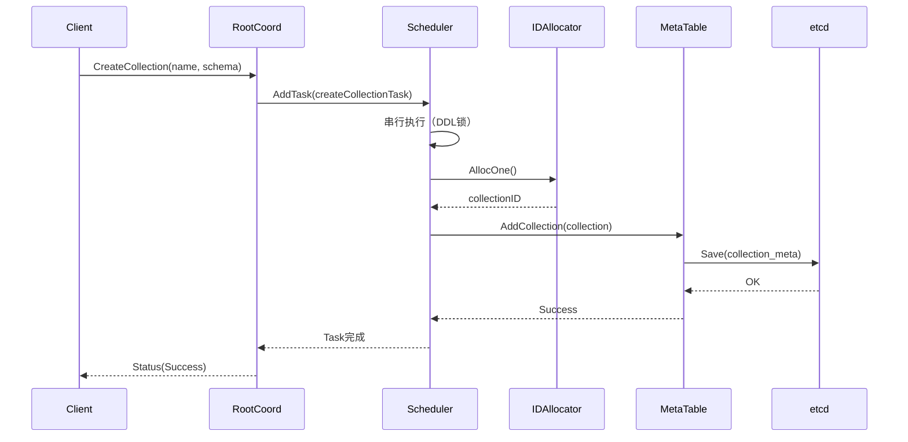

# Milvus-02-RootCoord-API

## 核心API列表

RootCoord作为元数据管理中心，提供以下类别的API：

| 类别 | API数量 | 主要功能 |
|------|---------|----------|
| **Collection管理** | 8个 | CreateCollection、DropCollection、DescribeCollection等 |
| **Partition管理** | 4个 | CreatePartition、DropPartition、ShowPartitions等 |
| **Database管理** | 4个 | CreateDatabase、DropDatabase、ListDatabases等 |
| **资源分配** | 2个 | AllocTimestamp、AllocID |
| **权限管理** | 10+个 | CreateCredential、CreateRole、GrantPrivilege等 |

---

## 1. CreateCollection

### 基本信息
- **功能**：创建Collection及其Schema
- **协议**：gRPC `milvuspb.MilvusService/CreateCollection`
- **幂等性**：否

### 请求参数

```go
type CreateCollectionRequest struct {
    Base              *commonpb.MsgBase
    DbName            string                   // 数据库名
    CollectionName    string                   // 集合名
    Schema            []byte                   // 序列化的Schema
    ShardsNum         int32                    // Shard数量
    ConsistencyLevel  commonpb.ConsistencyLevel
    Properties        []*commonpb.KeyValuePair
    NumPartitions     int64                    // Partition Key分区数
}
```

### 核心执行流程

```go
func (c *Core) CreateCollection(ctx context.Context, in *milvuspb.CreateCollectionRequest) (*commonpb.Status, error) {
    // 1. 健康检查
    if err := merr.CheckHealthy(c.GetStateCode()); err != nil {
        return merr.Status(err), nil
    }
    
    // 2. 创建任务
    t := &createCollectionTask{
        baseTask: newBaseTask(ctx, c),
        Req:      in,
    }
    
    // 3. 加入调度器（串行执行）
    if err := c.scheduler.AddTask(t); err != nil {
        return merr.Status(err), nil
    }
    
    // 4. 等待完成
    if err := t.WaitToFinish(); err != nil {
        return merr.Status(err), nil
    }
    
    return merr.Success(), nil
}

// 任务执行逻辑
func (t *createCollectionTask) Execute(ctx context.Context) error {
    // 1. 解析Schema
    schema := &schemapb.CollectionSchema{}
    proto.Unmarshal(t.Req.Schema, schema)
    
    // 2. 参数校验
    if err := t.validate(ctx); err != nil {
        return err
    }
    
    // 3. 分配CollectionID
    t.collID, err = t.core.idAllocator.AllocOne()
    
    // 4. 创建VirtualChannels
    t.channels = t.core.chanTimeTick.getChannels(t.Req.ShardsNum)
    
    // 5. 持久化元数据
    err = t.core.meta.AddCollection(ctx, &model.Collection{
        CollectionID:     t.collID,
        Name:             t.Req.CollectionName,
        Schema:           schema,
        VirtualChannels:  t.channels.virtualChannels,
        PhysicalChannels: t.channels.physicalChannels,
    })
    
    // 6. 广播失效通知
    t.core.broker.BroadcastAlteredCollection(ctx, &milvuspb.AlterCollectionRequest{
        CollectionID: t.collID,
    })
    
    return nil
}
```

### 时序图



---

## 2. AllocTimestamp

### 基本信息
- **功能**：分配全局时间戳（TSO）
- **调用频率**：极高（每个DML/DQL操作）
- **性能要求**：P99 < 10ms

### 请求参数

```go
type AllocTimestampRequest struct {
    Base           *commonpb.MsgBase
    Count          uint32  // 分配数量
    BlockTimestamp uint64  // 阻塞等待时间戳（可选）
}
```

### 响应参数

```go
type AllocTimestampResponse struct {
    Status    *commonpb.Status
    Timestamp uint64  // 起始时间戳
    Count     uint32  // 分配数量
}
```

### 核心实现

```go
func (c *Core) AllocTimestamp(ctx context.Context, in *rootcoordpb.AllocTimestampRequest) (*rootcoordpb.AllocTimestampResponse, error) {
    // 1. 健康检查
    if err := merr.CheckHealthy(c.GetStateCode()); err != nil {
        return &rootcoordpb.AllocTimestampResponse{
            Status: merr.Status(err),
        }, nil
    }
    
    // 2. BlockTimestamp处理（等待物理时间）
    if in.BlockTimestamp > 0 {
        blockTime, _ := tsoutil.ParseTS(in.BlockTimestamp)
        lastTime := c.tsoAllocator.GetLastSavedTime()
        deltaDuration := blockTime.Sub(lastTime)
        if deltaDuration > 0 {
            time.Sleep(deltaDuration + 200*time.Millisecond)
        }
    }
    
    // 3. 生成TSO
    ts, err := c.tsoAllocator.GenerateTSO(in.GetCount())
    if err != nil {
        return &rootcoordpb.AllocTimestampResponse{
            Status: merr.Status(err),
        }, nil
    }
    
    // 4. 返回第一个可用时间戳
    ts = ts - uint64(in.GetCount()) + 1
    
    return &rootcoordpb.AllocTimestampResponse{
        Status:    merr.Success(),
        Timestamp: ts,
        Count:     in.GetCount(),
    }, nil
}
```

### TSO生成机制

```go
// GlobalTSOAllocator TSO分配器
type GlobalTSOAllocator struct {
    lastPhysical int64   // 上次物理时间（毫秒）
    lastLogical  int64   // 上次逻辑计数器
    maxLogical   int64   // 最大逻辑计数器（262144）
    
    kvBase kv.TxnKV      // etcd/TiKV
}

func (gta *GlobalTSOAllocator) GenerateTSO(count uint32) (uint64, error) {
    gta.mu.Lock()
    defer gta.mu.Unlock()
    
    // 1. 获取当前物理时间
    physical := time.Now().UnixMilli()
    
    // 2. 如果物理时间前进，重置逻辑计数器
    if physical > gta.lastPhysical {
        gta.lastPhysical = physical
        gta.lastLogical = 0
    }
    
    // 3. 检查逻辑计数器是否溢出
    if gta.lastLogical+int64(count) >= gta.maxLogical {
        // 等待下一毫秒
        time.Sleep(time.Millisecond)
        gta.lastPhysical = time.Now().UnixMilli()
        gta.lastLogical = 0
    }
    
    // 4. 生成TSO
    ts := uint64(gta.lastPhysical)<<18 | uint64(gta.lastLogical)
    gta.lastLogical += int64(count)
    
    // 5. 定期持久化到etcd（每3秒）
    if time.Since(gta.lastSaveTime) > 3*time.Second {
        gta.kvBase.Save(tsoKey, gta.lastPhysical)
        gta.lastSaveTime = time.Now()
    }
    
    return ts, nil
}
```

### TSO格式

```
 64 bits TSO
|<----  Physical (46 bits)  ---->|<-- Logical (18 bits) -->|
|   毫秒级物理时间戳              |   逻辑计数器（0-262143） |

示例：
  Physical: 1704067200000 (2024-01-01 00:00:00)
  Logical:  12345
  TSO:      1704067200000 << 18 | 12345 = 446676598505558329
```

---

## 3. DescribeCollection

### 基本信息
- **功能**：查询Collection元信息
- **调用频率**：高
- **性能**：P99 < 10ms（内存缓存）

### 请求参数

```go
type DescribeCollectionRequest struct {
    Base           *commonpb.MsgBase
    DbName         string
    CollectionName string
    CollectionID   int64  // 可选
    TimeStamp      uint64 // 时间旅行
}
```

### 响应参数

```go
type DescribeCollectionResponse struct {
    Status              *commonpb.Status
    Schema              *schemapb.CollectionSchema
    CollectionID        int64
    VirtualChannelNames []string
    PhysicalChannelNames []string
    CreatedTimestamp    uint64
    CreatedUtcTimestamp uint64
    ShardsNum           int32
    ConsistencyLevel    commonpb.ConsistencyLevel
    CollectionName      string
    Properties          []*commonpb.KeyValuePair
    DbName              string
    NumPartitions       int64
}
```

### 核心实现

```go
func (c *Core) describeCollectionImpl(ctx context.Context, in *milvuspb.DescribeCollectionRequest, allowUnavailable bool) (*milvuspb.DescribeCollectionResponse, error) {
    // 1. 健康检查
    if err := merr.CheckHealthy(c.GetStateCode()); err != nil {
        return &milvuspb.DescribeCollectionResponse{
            Status: merr.Status(err),
        }, nil
    }
    
    // 2. 确定查询时间戳
    ts := typeutil.MaxTimestamp
    if in.TimeStamp != 0 {
        ts = in.TimeStamp
    }
    
    // 3. 从MetaTable查询
    var coll *model.Collection
    var err error
    
    if in.CollectionID != 0 {
        coll, err = c.meta.GetCollectionByID(ctx, in.DbName, in.CollectionID, ts, allowUnavailable)
    } else {
        coll, err = c.meta.GetCollectionByName(ctx, in.DbName, in.CollectionName, ts)
    }
    
    if err != nil {
        return &milvuspb.DescribeCollectionResponse{
            Status: merr.Status(err),
        }, nil
    }
    
    // 4. 构造响应
    return &milvuspb.DescribeCollectionResponse{
        Status:               merr.Success(),
        Schema:               coll.Schema,
        CollectionID:         coll.CollectionID,
        VirtualChannelNames:  coll.VirtualChannelNames,
        PhysicalChannelNames: coll.PhysicalChannelNames,
        CreatedTimestamp:     coll.CreateTime,
        ShardsNum:            coll.ShardsNum,
        ConsistencyLevel:     coll.ConsistencyLevel,
        CollectionName:       coll.Name,
        Properties:           coll.Properties,
        DbName:               in.DbName,
        NumPartitions:        coll.NumPartitions,
    }, nil
}
```

---

## 4. CreatePartition

### 基本信息
- **功能**：创建分区
- **幂等性**：否

### 请求参数

```go
type CreatePartitionRequest struct {
    Base           *commonpb.MsgBase
    DbName         string
    CollectionName string
    PartitionName  string
}
```

### 核心流程

```go
func (t *createPartitionTask) Execute(ctx context.Context) error {
    // 1. 获取Collection信息
    coll, err := t.core.meta.GetCollectionByName(ctx, t.Req.DbName, t.Req.CollectionName, typeutil.MaxTimestamp)
    
    // 2. 检查分区数量限制
    if len(coll.Partitions) >= int(Params.RootCoordCfg.MaxPartitionNum.GetAsInt64()) {
        return fmt.Errorf("partition number (%d) exceeds max configuration (%d)", 
            len(coll.Partitions), Params.RootCoordCfg.MaxPartitionNum.GetAsInt64())
    }
    
    // 3. 分配PartitionID
    partID, err := t.core.idAllocator.AllocOne()
    
    // 4. 添加分区
    err = t.core.meta.AddPartition(ctx, coll.CollectionID, &model.Partition{
        PartitionID:   partID,
        PartitionName: t.Req.PartitionName,
        CollectionID:  coll.CollectionID,
    })
    
    return nil
}
```

---

## 5. 其他重要API（简要说明）

### 5.1 DropCollection

**功能**：删除Collection及其所有Partition、Segment

**核心逻辑**：
1. 标记Collection状态为`CollectionDropping`
2. 通知DataCoord/QueryCoord释放资源
3. 删除etcd中的元数据
4. 触发垃圾回收

### 5.2 ShowCollections

**功能**：列出指定Database的所有Collection

**核心逻辑**：
```go
func (t *showCollectionTask) Execute(ctx context.Context) error {
    colls, err := t.core.meta.ListCollections(ctx, t.Req.DbName, t.Req.TimeStamp, true)
    
    t.Rsp.CollectionNames = make([]string, len(colls))
    t.Rsp.CollectionIds = make([]int64, len(colls))
    
    for i, coll := range colls {
        t.Rsp.CollectionNames[i] = coll.Name
        t.Rsp.CollectionIds[i] = coll.CollectionID
    }
    
    return nil
}
```

### 5.3 AllocID

**功能**：分配全局唯一ID（CollectionID、PartitionID、SegmentID等）

**实现**：基于etcd实现的GlobalIDAllocator

```go
func (c *Core) AllocID(ctx context.Context, in *rootcoordpb.AllocIDRequest) (*rootcoordpb.AllocIDResponse, error) {
    start, end, err := c.idAllocator.Alloc(in.Count)
    
    return &rootcoordpb.AllocIDResponse{
        Status: merr.Success(),
        ID:     start,
        Count:  in.Count,
    }, nil
}
```

---

## 6. 性能优化

### 6.1 TSO性能优化

**批量分配**：
- 每次etcd更新预分配50ms的时间戳
- 单个RootCoord支持>100万QPS

**本地缓存**：
```go
type tsoCache struct {
    physical int64
    logical  int64
    maxLogical int64
}

// 避免频繁访问etcd
```

### 6.2 MetaTable缓存

**两级缓存**：
1. RootCoord内存缓存（MetaTable）
2. Proxy缓存（globalMetaCache）

**失效策略**：
- 主动失效：DDL操作后广播`InvalidateCollectionMetaCache`
- 被动失效：Proxy定期刷新（可配置）

---

## 7. 配置参数

```yaml
rootCoord:
  dmlChannelNum: 16              # DML Channel数量
  maxPartitionNum: 4096          # 单Collection最大分区数
  minSegmentSizeToEnableIndex: 1024  # 最小索引大小(MB)
  
  # TSO配置
  tso:
    updateInterval: 50ms         # TSO更新间隔
    saveInterval: 3000ms         # TSO持久化间隔
```

---

**相关文档**：
- [Milvus-02-RootCoord-概览.md](./Milvus-02-RootCoord-概览.md)
- [Milvus-02-RootCoord-数据结构.md](./Milvus-02-RootCoord-数据结构.md)
- [Milvus-02-RootCoord-时序图.md](./Milvus-02-RootCoord-时序图.md)

