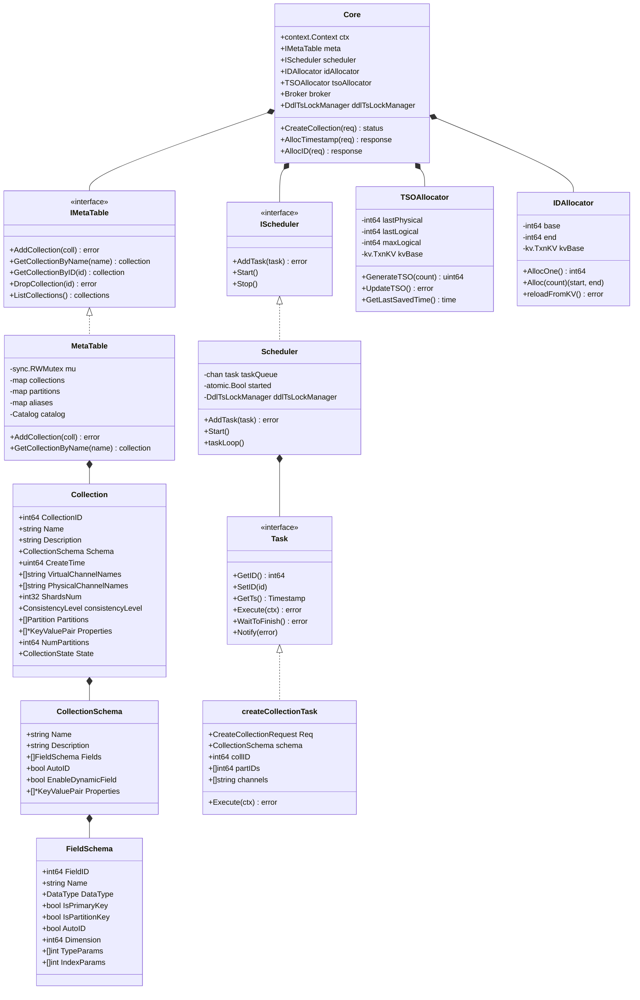

# Milvus-02-RootCoord-数据结构

## 1. 核心数据结构UML图



## 2. Core结构体详解

```go
// Core RootCoord核心结构体
type Core struct {
    // 上下文与生命周期
    ctx    context.Context
    cancel context.CancelFunc
    wg     sync.WaitGroup
    
    // etcd/TiKV客户端
    etcdCli *clientv3.Client
    tikvCli *txnkv.Client
    
    // 地址与Session
    address string
    session sessionutil.SessionInterface
    
    // 元数据管理
    meta IMetaTable  // MetaTable接口
    
    // 任务调度
    scheduler IScheduler  // DDL任务调度器
    
    // Broker（与其他组件通信）
    broker Broker
    
    // DDL时间戳锁管理器
    ddlTsLockManager DdlTsLockManager
    
    // 资源分配器
    idAllocator  allocator.Interface     // ID分配器
    tsoAllocator tso2.Allocator          // TSO分配器
    
    // Coordinator客户端
    mixCoord types.MixCoord
    
    // 配额中心
    quotaCenter *QuotaCenter
    
    // 垃圾回收
    garbageCollector GarbageCollector
    
    // Proxy管理
    proxyCreator       proxyutil.ProxyCreator
    proxyWatcher       *proxyutil.ProxyWatcher
    proxyClientManager proxyutil.ProxyClientManagerInterface
    
    // 时间同步
    chanTimeTick *timetickSync
    
    // 状态码
    stateCode atomic.Int32
}
```

## 3. MetaTable数据结构

### 3.1 MetaTable结构体

```go
// MetaTable Collection元数据管理
type MetaTable struct {
    sync.RWMutex
    
    // Collection缓存：dbID -> collectionID -> Collection
    collID2Meta map[typeutil.UniqueID]*model.Collection
    
    // Collection名称索引：dbID -> collectionName -> collectionID
    collName2ID map[typeutil.UniqueID]map[string]typeutil.UniqueID
    
    // Collection别名：dbID -> alias -> collectionID
    collAlias2ID map[typeutil.UniqueID]map[string]typeutil.UniqueID
    
    // Partition缓存：partitionID -> Partition
    partID2Meta map[typeutil.UniqueID]*model.Partition
    
    // Database缓存：dbName -> Database
    names2DatabaseID map[string]typeutil.UniqueID
    dbID2Meta        map[typeutil.UniqueID]*model.Database
    
    // 持久化层
    catalog metastore.RootCoordCatalog
}
```

### 3.2 Collection模型

```go
// Collection Collection元数据模型
type Collection struct {
    // 基础信息
    CollectionID      int64                      // Collection ID
    DBID              int64                      // Database ID
    Name              string                     // Collection名称
    Description       string                     // 描述
    AutoID            bool                       // 是否自动生成ID
    
    // Schema
    Schema            *schemapb.CollectionSchema // 字段Schema
    
    // 字段映射
    FieldIndexes      []*model.Index             // 字段索引
    
    // 虚拟通道
    VirtualChannelNames  []string                // Virtual Channel名称
    PhysicalChannelNames []string                // Physical Channel名称
    ShardsNum            int32                   // Shard数量
    
    // 分区
    Partitions        []*Partition               // 所有分区
    
    // 时间戳
    CreateTime        uint64                     // 创建时间戳
    StartPositions    []*commonpb.KeyDataPair    // 起始位置
    
    // 一致性
    ConsistencyLevel  commonpb.ConsistencyLevel  // 一致性级别
    
    // 状态
    State             pb.CollectionState         // Collection状态
    
    // 扩展属性
    Properties        []*commonpb.KeyValuePair   // 扩展属性
    
    // Partition Key
    NumPartitions     int64                      // Partition Key分区数
}
```

### 3.3 CollectionSchema

```go
// CollectionSchema Schema定义
type CollectionSchema struct {
    Name              string                     // Schema名称
    Description       string                     // 描述
    AutoID            bool                       // 是否自动生成ID
    Fields            []*FieldSchema             // 字段列表
    EnableDynamicField bool                      // 是否启用动态字段
    Properties        []*commonpb.KeyValuePair   // 扩展属性
}

// FieldSchema 字段Schema
type FieldSchema struct {
    FieldID           int64                      // 字段ID
    Name              string                     // 字段名
    IsPrimaryKey      bool                       // 是否主键
    Description       string                     // 描述
    DataType          schemapb.DataType          // 数据类型
    TypeParams        []*commonpb.KeyValuePair   // 类型参数
    IndexParams       []*commonpb.KeyValuePair   // 索引参数
    AutoID            bool                       // 是否自动生成
    State             schemapb.FieldState        // 字段状态
    ElementType       schemapb.DataType          // 元素类型（Array）
    DefaultValue      *schemapb.ValueField       // 默认值
    IsDynamic         bool                       // 是否动态字段
    IsPartitionKey    bool                       // 是否Partition Key
    IsClusteringKey   bool                       // 是否Clustering Key
    Nullable          bool                       // 是否可空
}
```

### 3.4 CollectionState状态机

```go
// CollectionState Collection状态
type CollectionState int32

const (
    CollectionCreated     CollectionState = 0  // 已创建
    CollectionCreating    CollectionState = 1  // 创建中
    CollectionDropping    CollectionState = 2  // 删除中
    CollectionDropped     CollectionState = 3  // 已删除
)

// 状态转换
// Created → Dropping → Dropped
// Creating → Created
// Creating → Dropping → Dropped (创建失败)
```

## 4. Scheduler调度器

### 4.1 Scheduler结构体

```go
// scheduler DDL任务调度器
type scheduler struct {
    ctx    context.Context
    cancel context.CancelFunc
    wg     sync.WaitGroup
    
    // 任务队列
    taskQueue chan task
    
    // 启动标志
    started atomic.Bool
    
    // 资源分配器
    idAllocator  allocator.Interface
    tsoAllocator tso2.Allocator
    
    // DDL时间戳锁
    ddlTsLockManager DdlTsLockManager
}
```

### 4.2 Task接口

```go
// task DDL任务接口
type task interface {
    GetID() int64
    SetID(id int64)
    GetTs() Timestamp
    SetTs(ts Timestamp)
    GetType() commonpb.MsgType
    Execute(ctx context.Context) error
    WaitToFinish() error
    Notify(err error)
}
```

### 4.3 createCollectionTask

```go
// createCollectionTask 创建Collection任务
type createCollectionTask struct {
    baseTask
    
    // 请求
    Req *milvuspb.CreateCollectionRequest
    
    // 解析后的Schema
    schema *schemapb.CollectionSchema
    
    // 分配的资源
    collID         UniqueID     // Collection ID
    partIDs        []UniqueID   // Partition IDs
    channels       collectionChannels  // Channels
    dbID           UniqueID     // Database ID
    partitionNames []string     // Partition名称
}

func (t *createCollectionTask) Execute(ctx context.Context) error {
    // 1. 解析Schema
    t.schema = &schemapb.CollectionSchema{}
    proto.Unmarshal(t.Req.Schema, t.schema)
    
    // 2. 参数校验
    if err := t.validate(ctx); err != nil {
        return err
    }
    
    // 3. 分配CollectionID
    t.collID, _ = t.core.idAllocator.AllocOne()
    
    // 4. 创建VirtualChannels
    t.channels = t.core.chanTimeTick.getChannels(t.Req.ShardsNum)
    
    // 5. 添加Collection
    coll := &model.Collection{
        CollectionID:         t.collID,
        Name:                 t.Req.CollectionName,
        Schema:               t.schema,
        VirtualChannelNames:  t.channels.virtualChannels,
        PhysicalChannelNames: t.channels.physicalChannels,
        ShardsNum:            t.Req.ShardsNum,
        ConsistencyLevel:     t.Req.ConsistencyLevel,
        CreateTime:           t.GetTs(),
        State:                pb.CollectionState_CollectionCreated,
    }
    
    err := t.core.meta.AddCollection(ctx, coll)
    
    return err
}
```

## 5. TSO与ID分配器

### 5.1 TSOAllocator

```go
// GlobalTSOAllocator 全局TSO分配器
type GlobalTSOAllocator struct {
    mu sync.Mutex
    
    // TSO状态
    lastPhysical int64   // 上次物理时间（毫秒）
    lastLogical  int64   // 上次逻辑计数器
    maxLogical   int64   // 最大逻辑计数器（262144 = 2^18）
    
    // 持久化
    kvBase kv.TxnKV      // etcd/TiKV
    key    string        // TSO存储key
    
    // 更新间隔
    updateInterval time.Duration  // 50ms
    saveInterval   time.Duration  // 3s
    
    lastSaveTime time.Time
}

// GenerateTSO 生成TSO
func (gta *GlobalTSOAllocator) GenerateTSO(count uint32) (uint64, error) {
    gta.mu.Lock()
    defer gta.mu.Unlock()
    
    // 获取当前物理时间
    physical := time.Now().UnixMilli()
    
    // 物理时间前进，重置逻辑计数器
    if physical > gta.lastPhysical {
        gta.lastPhysical = physical
        gta.lastLogical = 0
    }
    
    // 检查逻辑计数器溢出
    if gta.lastLogical+int64(count) >= gta.maxLogical {
        // 等待下一毫秒
        time.Sleep(time.Millisecond)
        gta.lastPhysical = time.Now().UnixMilli()
        gta.lastLogical = 0
    }
    
    // 生成TSO
    ts := uint64(gta.lastPhysical)<<18 | uint64(gta.lastLogical)
    gta.lastLogical += int64(count)
    
    return ts, nil
}
```

### 5.2 IDAllocator

```go
// GlobalIDAllocator 全局ID分配器
type GlobalIDAllocator struct {
    mu sync.Mutex
    
    // ID范围
    base int64   // 当前ID范围起始
    end  int64   // 当前ID范围结束
    
    // 持久化
    kvBase kv.TxnKV
    key    string
    
    // 批量分配大小
    allocSize int64  // 10000
}

// AllocOne 分配单个ID
func (gia *GlobalIDAllocator) AllocOne() (int64, error) {
    gia.mu.Lock()
    defer gia.mu.Unlock()
    
    // 检查是否需要重新加载
    if gia.base >= gia.end {
        if err := gia.reloadFromKV(); err != nil {
            return 0, err
        }
    }
    
    id := gia.base
    gia.base++
    
    return id, nil
}

// reloadFromKV 从etcd重新加载ID范围
func (gia *GlobalIDAllocator) reloadFromKV() error {
    // 1. 获取当前值
    val, err := gia.kvBase.Load(gia.key)
    if err != nil {
        return err
    }
    
    currentEnd := parseInt64(val)
    
    // 2. 更新etcd（CAS操作）
    newEnd := currentEnd + gia.allocSize
    err = gia.kvBase.CompareAndSwap(gia.key, val, toString(newEnd))
    if err != nil {
        return err
    }
    
    // 3. 更新本地范围
    gia.base = currentEnd
    gia.end = newEnd
    
    return nil
}
```

## 6. DdlTsLockManager

```go
// ddlTsLockManager DDL时间戳锁管理器
type ddlTsLockManager struct {
    lastTs        atomic.Uint64   // 最后的DDL时间戳
    inProgressCnt atomic.Int32    // 正在进行的DDL数量
    tsoAllocator  tso.Allocator   // TSO分配器
    mu            sync.Mutex      // 互斥锁
}

// GetMinDdlTs 获取最小DDL时间戳
func (c *ddlTsLockManager) GetMinDdlTs() Timestamp {
    // 如果有正在进行的DDL，返回上次的时间戳
    if c.inProgressCnt.Load() > 0 {
        return c.lastTs.Load()
    }
    
    // 否则分配新的时间戳
    c.Lock()
    defer c.Unlock()
    
    ts, err := c.tsoAllocator.GenerateTSO(1)
    if err != nil {
        return c.lastTs.Load()
    }
    
    c.UpdateLastTs(ts)
    return ts
}

// 用途：保证DDL操作的时间戳顺序性
// - DDL开始：AddRefCnt(1)
// - DDL结束：AddRefCnt(-1)
// - TimeTick：GetMinDdlTs()
```

---

**相关文档**：
- [Milvus-02-RootCoord-概览.md](./Milvus-02-RootCoord-概览.md)
- [Milvus-02-RootCoord-API.md](./Milvus-02-RootCoord-API.md)
- [Milvus-02-RootCoord-时序图.md](./Milvus-02-RootCoord-时序图.md)

