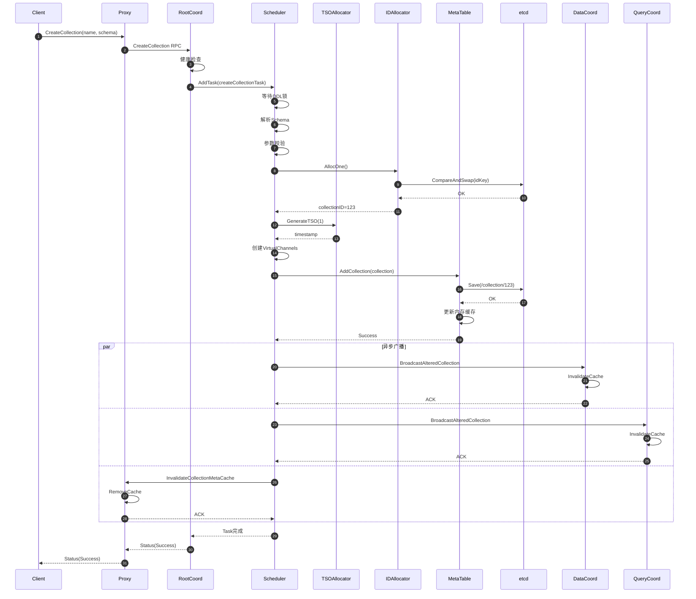
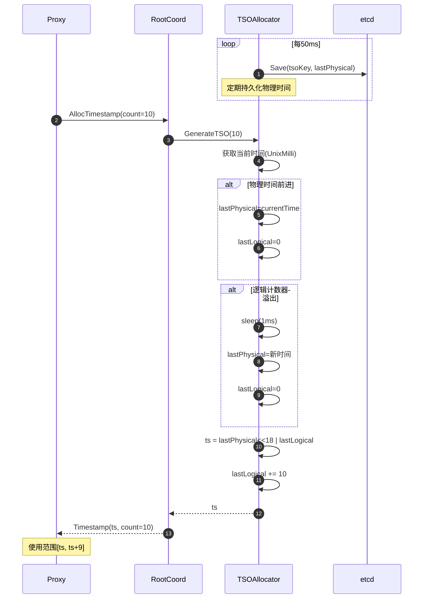
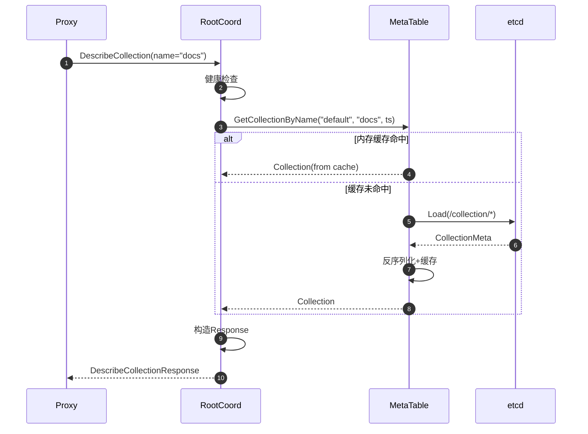
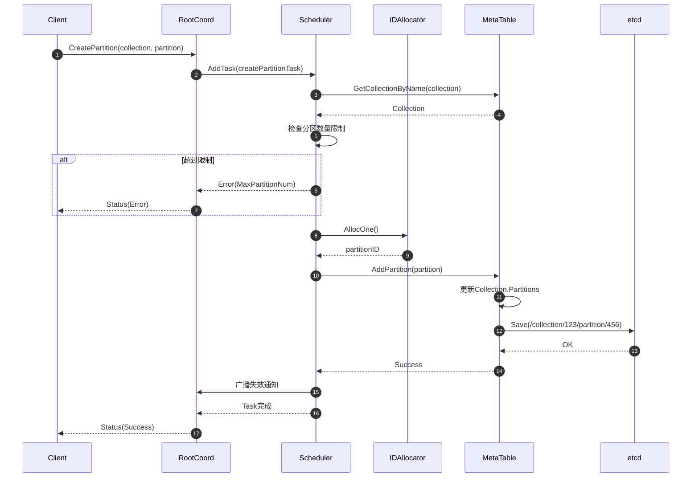
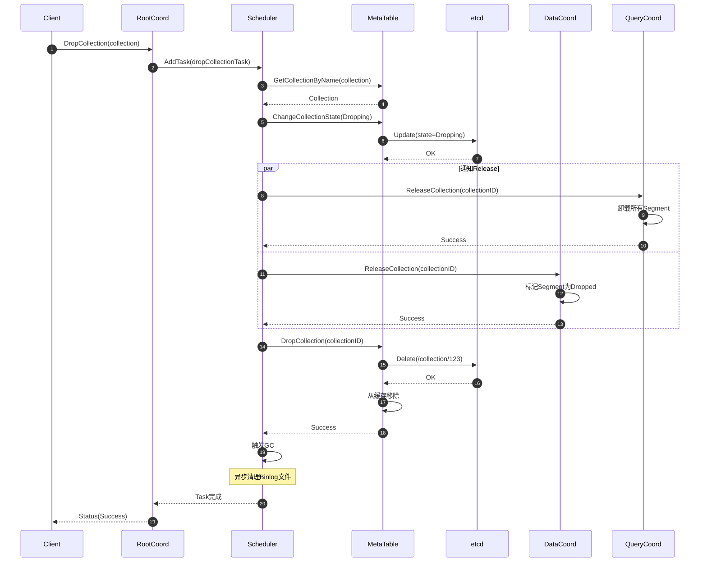
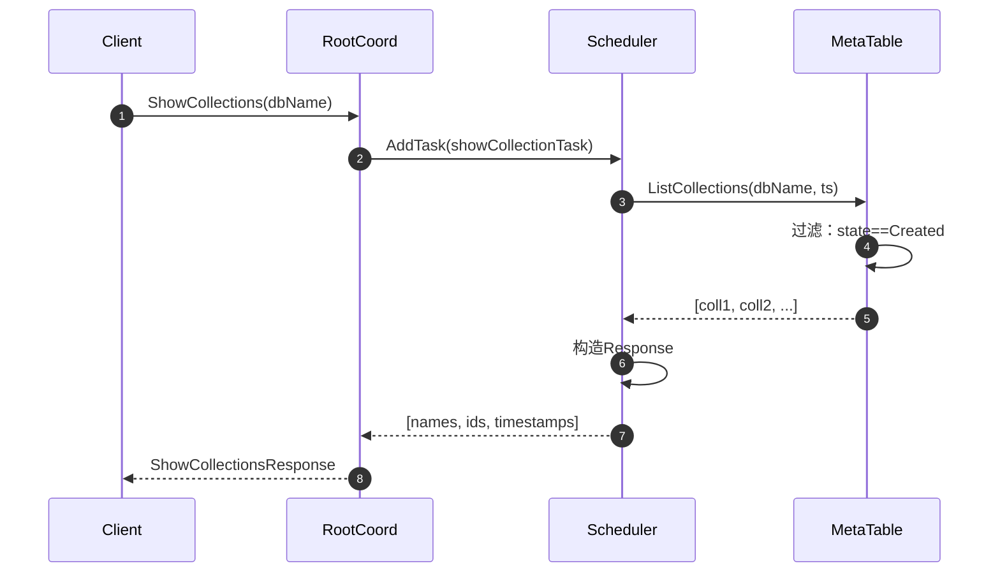
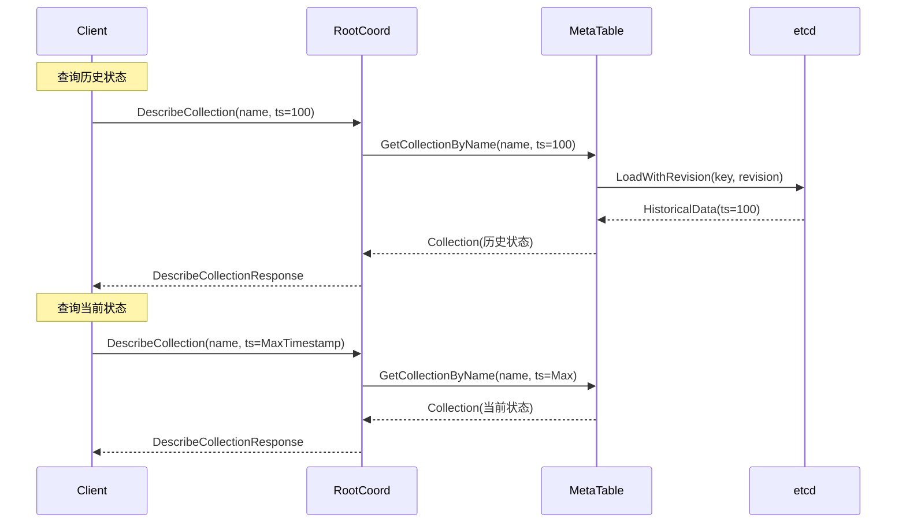
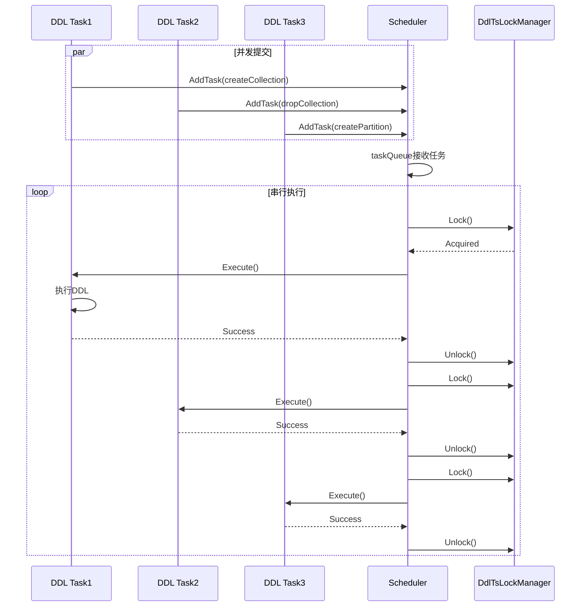

# Milvus-02-RootCoord-时序图

## 1. CreateCollection时序图



**时序图说明**：

1. **步骤1-4**：Client通过Proxy发起CreateCollection请求
2. **步骤5-7**：任务进入DDL Scheduler，等待串行执行
3. **步骤8-11**：分配CollectionID（从etcd批量预分配）
4. **步骤12-13**：分配创建时间戳
5. **步骤14**：创建VirtualChannels（从Channel池分配）
6. **步骤15-19**：持久化元数据到etcd，更新内存缓存
7. **步骤20-29**：并发广播失效通知到所有组件
8. **步骤30-32**：返回成功状态

---

## 2. AllocTimestamp时序图



**TSO生成机制**：

```
时间轴：
  t0: physical=1000, logical=0      → TSO=1000<<18|0   = 262144000
  t1: physical=1000, logical=10     → TSO=1000<<18|10  = 262144010
  t2: physical=1000, logical=262143 → TSO=1000<<18|262143
  t3: physical=1001, logical=0      → TSO=1001<<18|0   = 262406144

特性：
- 单调递增：保证分布式顺序
- 高精度：毫秒+逻辑计数器
- 高性能：本地生成，减少etcd访问
```

---

## 3. DescribeCollection时序图



**缓存策略**：

```
Cache Key: dbID + collectionName
Cache Value: *model.Collection

失效时机：
1. DDL操作（CreateCollection/DropCollection/AlterCollection）
2. 接收到InvalidateCollectionMetaCache通知
3. 查询时发现版本不匹配（etcd比缓存新）

性能：
- Cache Hit: P99 < 5ms
- Cache Miss: P99 < 20ms (包含etcd查询)
```

---

## 4. CreatePartition时序图



---

## 5. DropCollection时序图



**状态转换**：

```
CollectionCreated → CollectionDropping → CollectionDropped

步骤：
1. 标记为Dropping（不可见）
2. 通知QueryCoord/DataCoord释放资源
3. 删除etcd元数据
4. 异步GC清理Object Storage文件
```

---

## 6. ShowCollections时序图



---

## 7. 时间旅行（Time Travel）



**时间旅行用途**：

1. **MVCC查询**：查询历史版本的Collection
2. **一致性保证**：使用特定Timestamp保证读一致性
3. **调试与审计**：回溯DDL操作历史

**实现机制**：

```go
// etcd支持基于Revision的查询
// Timestamp → Revision映射（单调递增）

func (m *MetaTable) GetCollectionByName(dbName, name string, ts Timestamp) (*Collection, error) {
    if ts == MaxTimestamp {
        // 查询最新版本（从缓存）
        return m.cache[dbName][name], nil
    }
    
    // 查询历史版本（从etcd）
    revision := m.timestampToRevision(ts)
    data := m.etcdCli.Get(ctx, collectionKey, clientv3.WithRev(revision))
    
    return parseCollection(data), nil
}
```

---

## 8. DDL串行化机制



**串行化原因**：

1. **元数据一致性**：避免并发修改导致冲突
2. **Timestamp顺序性**：保证DDL操作的全局顺序
3. **简化实现**：无需复杂的并发控制

**性能影响**：

- DDL操作频率低（通常<1/秒）
- 串行化对系统吞吐影响小
- DML/DQL操作不受影响（并发执行）

---

**相关文档**：
- [Milvus-02-RootCoord-概览.md](./Milvus-02-RootCoord-概览.md)
- [Milvus-02-RootCoord-API.md](./Milvus-02-RootCoord-API.md)
- [Milvus-02-RootCoord-数据结构.md](./Milvus-02-RootCoord-数据结构.md)

