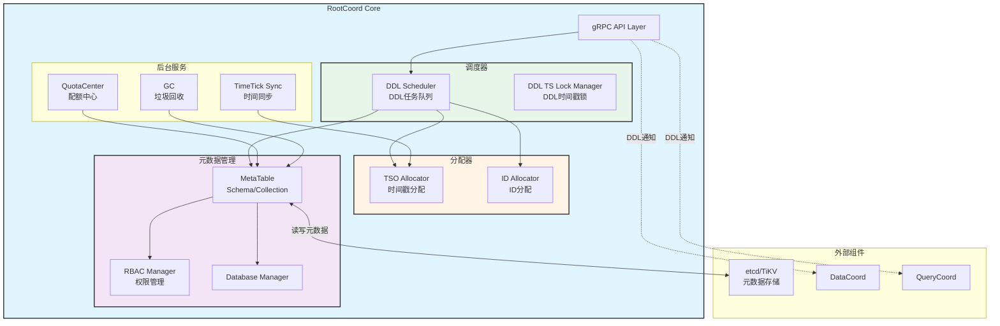
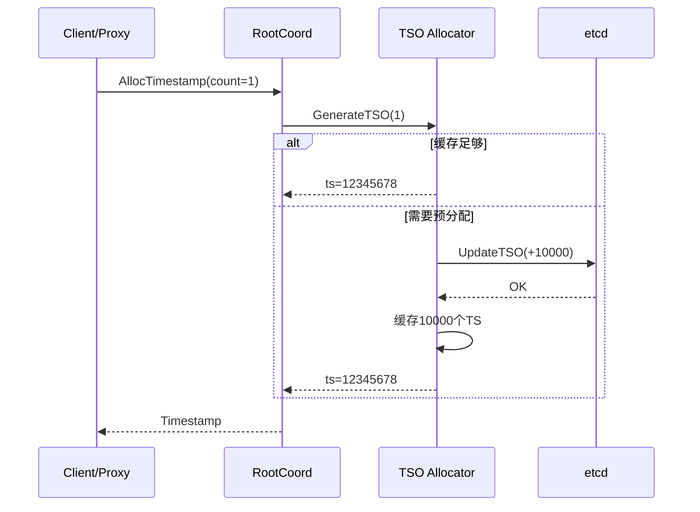
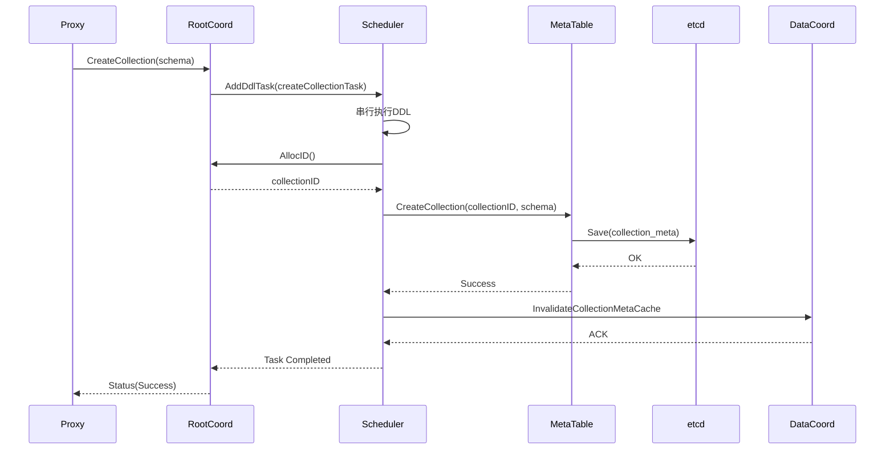
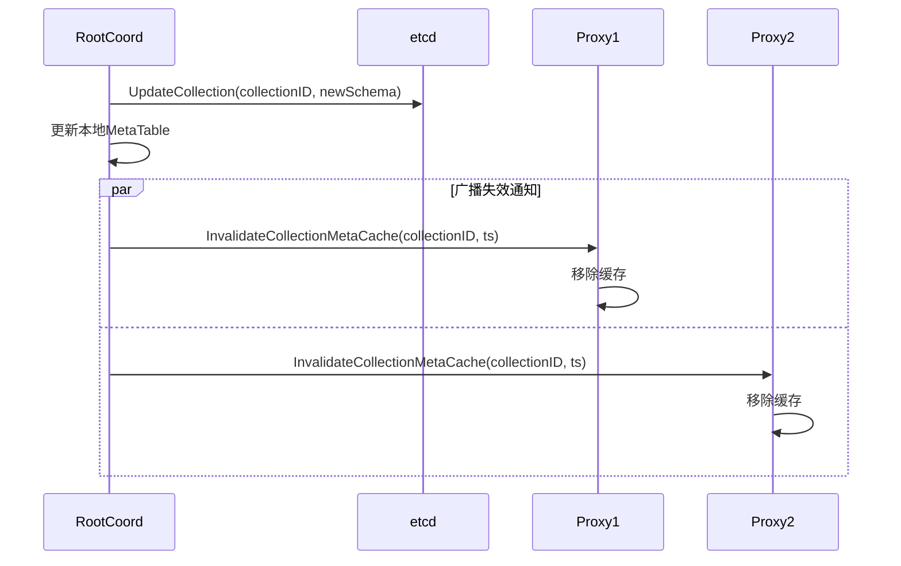

# Milvus-02-RootCoord-概览

## 1. 模块概述

### 1.1 职责定义

RootCoord（根协调器）是Milvus的核心控制平面组件，负责元数据管理、全局ID/时间戳分配和DDL操作协调。

**核心职责**：

1. **DDL操作管理**
   - CreateCollection/DropCollection
   - CreatePartition/DropPartition
   - CreateDatabase/DropDatabase
   - CreateIndex/DropIndex

2. **TSO服务（Timestamp Oracle）**
   - 全局时间戳分配
   - 保证分布式事务顺序
   - MVCC版本控制基础

3. **ID分配服务**
   - CollectionID、PartitionID分配
   - SegmentID、RowID分配（通过GlobalIDAllocator）

4. **元数据管理**
   - Collection Schema维护
   - Database/Partition信息
   - 用户权限（RBAC）

5. **配额与限流**
   - 全局配额管理
   - 集合级别限流策略
   - 资源使用统计

### 1.2 架构图



### 1.3 核心API

| API | 功能 | 调用频率 | 重要性 |
|-----|------|---------|--------|
| **CreateCollection** | 创建集合 | 低 | ⭐⭐⭐⭐⭐ |
| **DropCollection** | 删除集合 | 低 | ⭐⭐⭐⭐ |
| **DescribeCollection** | 查询Collection元信息 | 高 | ⭐⭐⭐⭐⭐ |
| **AllocTimestamp** | 分配时间戳 | 极高 | ⭐⭐⭐⭐⭐ |
| **AllocID** | 分配全局ID | 高 | ⭐⭐⭐⭐ |

### 1.4 TSO机制

**TSO（Timestamp Oracle）原理**：



**TSO格式**（64位）：

```
|<--  Physical Time (46 bits) -->|<-- Logical Counter (18 bits) -->|
|   毫秒级物理时间戳                |   逻辑计数器（单位时间内的序号）    |
```

**特性**：
- **全局单调递增**：保证分布式顺序
- **物理时间关联**：便于调试和时间旅行
- **高吞吐**：批量分配，减少etcd访问

---

## 2. 核心流程

### 2.1 CreateCollection流程



### 2.2 AllocTimestamp高频调用优化

**批量分配策略**：

```go
// TSO Allocator缓存机制
type GlobalTSOAllocator struct {
    lastPhysical int64        // 上次物理时间
    lastLogical  int64        // 上次逻辑计数
    maxLogical   int64        // 最大逻辑计数（262144）
    
    // 批量预分配减少etcd访问
    UpdateTimestampStep = 50ms  // 每50ms更新一次etcd
}

// 性能数据：
// - 单次etcd更新支持：50ms内所有TS请求
// - QPS：>100万/秒（单个RootCoord）
```

---

## 3. 关键设计

### 3.1 DDL串行化

**问题**：并发DDL可能导致元数据不一致

**解决**：DDL Scheduler串行执行

```go
type scheduler struct {
    ddlQueue chan task  // DDL任务队列
    // 串行处理，保证顺序性
}

// DDL执行流程
func (s *scheduler) Start() {
    go func() {
        for task := range s.ddlQueue {
            task.PreExecute()
            task.Execute()   // 持有DDL时间戳锁
            task.PostExecute()
        }
    }()
}
```

### 3.2 MVCC与时间旅行

**机制**：基于TSO实现多版本并发控制

```
写入：Insert(data, ts=100)
查询：Search(ts=100)  → 查询≤100的所有数据
删除：Delete(id, ts=150) → 标记删除
查询：Search(ts=120)  → 仍可见（未删除）
查询：Search(ts=160)  → 不可见（已删除）
```

### 3.3 元数据缓存策略

**两级缓存**：

1. **RootCoord内存缓存**：MetaTable
2. **Proxy缓存**：globalMetaCache

**失效机制**：



---

## 4. 性能与容量

### 4.1 性能指标

| 指标 | 数值 | 说明 |
|------|------|------|
| **AllocTimestamp QPS** | >100万 | 单RootCoord |
| **AllocID QPS** | >10万 | 批量分配 |
| **CreateCollection延迟** | P99: 200ms | 包含etcd写入 |
| **DescribeCollection延迟** | P99: 10ms | 内存缓存 |

### 4.2 容量规划

| 维度 | 容量 | 限制因素 |
|------|------|----------|
| **Database数量** | 1000 | 内存 |
| **Collection数量** | 10000 | 内存+etcd |
| **Field数量/Collection** | 256 | Schema大小 |
| **Partition数量/Collection** | 4096 | 元数据量 |

---

## 5. 配置参数

```yaml
rootCoord:
  dmlChannelNum: 16           # DML Channel数量
  maxPartitionNum: 4096       # 单Collection最大分区数
  minSegmentSizeToEnableIndex: 1024  # 最小索引大小(MB)
  
  # TSO配置
  tso:
    updateInterval: 50ms      # TSO更新间隔
    saveInterval: 3000ms      # TSO持久化间隔
    
  # GC配置
  gc:
    interval: 3600            # GC周期(秒)
    missingTolerance: 86400   # 数据丢失容忍时间
```

---

**相关文档**：
- [Milvus-00-总览.md](./Milvus-00-总览.md)
- [Milvus-01-Proxy-概览.md](./Milvus-01-Proxy-概览.md)
- [Milvus-03-DataCoord-概览.md](./Milvus-03-DataCoord-概览.md)

