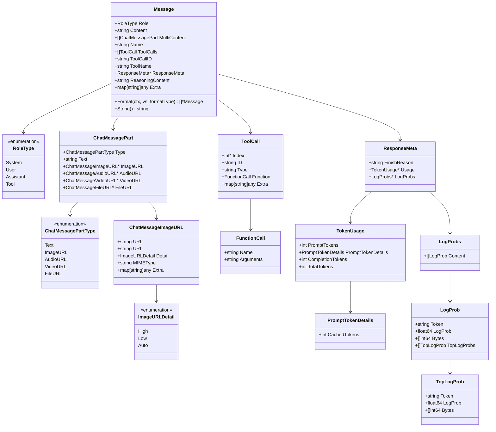

# Eino-01-Schema模块-数据结构

本文档详细描述 Schema 模块的核心数据结构，包括 UML 类图、字段说明、继承关系和使用示例。

---

## 1. Message 数据结构

### 1.1 Message 类图



### 1.2 Message 字段详解

#### 1.2.1 核心字段

| 字段名 | 类型 | 必填 | 说明 | 约束 |
|-------|------|------|------|------|
| Role | RoleType | 是 | 消息角色 | system/user/assistant/tool |
| Content | string | 否 | 文本内容 | 优先级低于 MultiContent |
| MultiContent | []ChatMessagePart | 否 | 多模态内容 | 支持文本、图片、音频等 |
| Name | string | 否 | 消息名称 | 用于区分不同的发送者 |

**字段约束与语义**：
- **Role**: 
  - `system`: 系统消息，设置AI行为规则
  - `user`: 用户消息，表示用户输入
  - `assistant`: 助手消息，表示AI回复
  - `tool`: 工具消息，表示工具执行结果

- **Content vs MultiContent**:
  - 通常只使用一个
  - MultiContent 非空时优先使用 MultiContent
  - MultiContent 支持多模态内容（文本+图片等）

#### 1.2.2 工具调用字段

| 字段名 | 类型 | 必填 | 说明 | 约束 |
|-------|------|------|------|------|
| ToolCalls | []ToolCall | 否 | 工具调用列表 | 仅 assistant 消息使用 |
| ToolCallID | string | 否 | 工具调用ID | 仅 tool 消息使用，关联 ToolCall.ID |
| ToolName | string | 否 | 工具名称 | 仅 tool 消息使用 |

**字段语义**：
- **ToolCalls**: Assistant 消息中包含需要执行的工具调用
- **ToolCallID**: Tool 消息通过此字段关联到对应的 ToolCall
- **ToolName**: 明确标识哪个工具返回了结果

**使用场景**：
```go
// Assistant 消息包含工具调用
assistantMsg := &schema.Message{
    Role: schema.Assistant,
    Content: "让我查询一下天气",
    ToolCalls: []schema.ToolCall{
        {
            ID: "call-123",
            Type: "function",
            Function: schema.FunctionCall{
                Name: "get_weather",
                Arguments: `{"city":"Beijing"}`,
            },
        },
    },
}

// Tool 消息返回工具执行结果
toolMsg := &schema.Message{
    Role: schema.Tool,
    Content: "北京今天晴天，25度",
    ToolCallID: "call-123",  // 关联到 assistantMsg.ToolCalls[0].ID
    ToolName: "get_weather",
}
```

#### 1.2.3 元信息字段

| 字段名 | 类型 | 必填 | 说明 | 约束 |
|-------|------|------|------|------|
| ResponseMeta | *ResponseMeta | 否 | 响应元信息 | 包含 token 使用量、结束原因等 |
| ReasoningContent | string | 否 | 推理过程内容 | 部分模型（如 o1）返回的思考过程 |
| Extra | map[string]any | 否 | 扩展字段 | 存储模型特定的额外信息 |

**ResponseMeta 详解**：
```go
type ResponseMeta struct {
    FinishReason string       // 结束原因：stop/length/tool_calls/content_filter
    Usage        *TokenUsage  // Token 使用量统计
    LogProbs     *LogProbs    // 对数概率信息
}

type TokenUsage struct {
    PromptTokens      int                // 输入 token 数
    PromptTokenDetails PromptTokenDetails // 输入 token 详情
    CompletionTokens  int                // 输出 token 数
    TotalTokens       int                // 总 token 数
}
```

**使用示例**：
```go
// 查看 token 使用量
response, _ := chatModel.Generate(ctx, messages)
if response.ResponseMeta != nil && response.ResponseMeta.Usage != nil {
    fmt.Printf("输入 tokens: %d\n", response.ResponseMeta.Usage.PromptTokens)
    fmt.Printf("输出 tokens: %d\n", response.ResponseMeta.Usage.CompletionTokens)
    fmt.Printf("总计 tokens: %d\n", response.ResponseMeta.Usage.TotalTokens)
}

// 查看结束原因
if response.ResponseMeta != nil {
    switch response.ResponseMeta.FinishReason {
    case "stop":
        // 正常结束
    case "length":
        // 达到最大长度
    case "tool_calls":
        // 需要调用工具
    case "content_filter":
        // 被内容过滤拦截
    }
}
```

### 1.3 Message 方法详解

#### 1.3.1 Format 方法

**功能**: 使用模板变量渲染消息内容

**签名**:
```go
func (m *Message) Format(ctx context.Context, vs map[string]any, formatType FormatType) ([]*Message, error)
```

**实现要点**:
- 支持三种模板格式（FString/GoTemplate/Jinja2）
- 同时渲染 Content 和 MultiContent 中的文本
- 返回新的 Message，不修改原对象

#### 1.3.2 String 方法

**功能**: 返回消息的字符串表示

**签名**:
```go
func (m *Message) String() string
```

**输出格式**:
```
<role>: <content>
reasoning content: <reasoning_content>
tool_calls:
  <tool_call_1>
  <tool_call_2>
tool_call_id: <tool_call_id>
finish_reason: <finish_reason>
usage: <token_usage>
```

---

## 2. StreamReader/StreamWriter 数据结构

### 2.1 Stream 类图

```mermaid
classDiagram
    class StreamReader~T~ {
        -readerType typ
        -stream~T~* st
        -arrayReader~T~* ar
        -multiStreamReader~T~* msr
        -streamReaderWithConvert~T~* srw
        -childStreamReader~T~* csr
        +Recv() (T, error)
        +Close()
        +Copy(n int) []*StreamReader~T~
        +SetAutomaticClose()
    }

    class StreamWriter~T~ {
        -stream~T~* stm
        +Send(chunk T, err error) bool
        +Close()
    }

    class stream~T~ {
        -chan streamItem~T~ items
        -chan struct{} closed
        -bool automaticClose
        -*uint32 closedFlag
        +recv() (T, error)
        +send(chunk T, err error) bool
        +closeSend()
        +closeRecv()
    }

    class streamItem~T~ {
        +T chunk
        +error err
    }

    class arrayReader~T~ {
        -[]T arr
        -int index
        +recv() (T, error)
        +copy(n int) []*arrayReader~T~
    }

    class multiStreamReader~T~ {
        -[]*stream~T~ sts
        -[]reflect.SelectCase itemsCases
        -[]int nonClosed
        -[]string sourceReaderNames
        +recv() (T, error)
        +close()
    }

    class streamReaderWithConvert~T~ {
        -iStreamReader sr
        -func(any)(T, error) convert
        +recv() (T, error)
        +close()
    }

    class childStreamReader~T~ {
        -*parentStreamReader~T~ parent
        -int index
        +recv() (T, error)
        +close()
    }

    class parentStreamReader~T~ {
        -*StreamReader~T~ sr
        -[]*cpStreamElement~T~ subStreamList
        -uint32 closedNum
        +peek(idx int) (T, error)
        +close(idx int)
    }

    class cpStreamElement~T~ {
        -sync.Once once
        -*cpStreamElement~T~ next
        -streamItem~T~ item
    }

    class readerType {
        <<enumeration>>
        readerTypeStream
        readerTypeArray
        readerTypeMultiStream
        readerTypeWithConvert
        readerTypeChild
    }

    StreamReader~T~ --> readerType
    StreamReader~T~ --> stream~T~
    StreamReader~T~ --> arrayReader~T~
    StreamReader~T~ --> multiStreamReader~T~
    StreamReader~T~ --> streamReaderWithConvert~T~
    StreamReader~T~ --> childStreamReader~T~

    StreamWriter~T~ --> stream~T~
    stream~T~ --> streamItem~T~
    
    multiStreamReader~T~ --> stream~T~
    streamReaderWithConvert~T~ --> StreamReader~T~
    childStreamReader~T~ --> parentStreamReader~T~
    parentStreamReader~T~ --> StreamReader~T~
    parentStreamReader~T~ --> cpStreamElement~T~
    cpStreamElement~T~ --> streamItem~T~
```

### 2.2 StreamReader 实现类型

#### 2.2.1 stream (基础流)

**结构**:
```go
type stream[T any] struct {
    items  chan streamItem[T] // 数据通道，带缓冲
    closed chan struct{}      // 关闭信号通道
    
    automaticClose bool     // 是否启用自动关闭
    closedFlag     *uint32  // 关闭标志（仅用于自动关闭）
}

type streamItem[T any] struct {
    chunk T       // 数据块
    err   error   // 错误（可选）
}
```

**特点**:
- 基于 channel 实现
- 1 个发送者，1 个接收者
- 支持缓冲区
- 支持自动关闭（GC 时）

**内存占用**:
```
sizeof(stream[T]) = 
    sizeof(chan streamItem[T]) +  // 约 24 bytes
    sizeof(chan struct{}) +        // 约 24 bytes
    sizeof(bool) +                 // 1 byte
    sizeof(*uint32)                // 8 bytes
    = 约 57 bytes + 缓冲区
    
缓冲区内存 = cap × sizeof(streamItem[T])
           = cap × (sizeof(T) + sizeof(error))
```

#### 2.2.2 arrayReader (数组读取器)

**结构**:
```go
type arrayReader[T any] struct {
    arr   []T    // 源数组
    index int    // 当前索引
}
```

**特点**:
- 无 goroutine 开销
- 内存占用小
- 适合测试和小数据量场景

**内存占用**:
```
sizeof(arrayReader[T]) = 
    sizeof([]T) +   // 24 bytes (slice header)
    sizeof(int)     // 8 bytes
    = 32 bytes
```

#### 2.2.3 multiStreamReader (多流合并)

**结构**:
```go
type multiStreamReader[T any] struct {
    sts               []*stream[T]           // 源流数组
    itemsCases        []reflect.SelectCase   // 用于 reflect.Select
    nonClosed         []int                  // 未关闭的流索引
    sourceReaderNames []string               // 源流名称（可选）
}
```

**特点**:
- 使用 reflect.Select 从多个 channel 读取
- 流数量 ≤ 10 时性能好
- 流数量 > 10 时性能下降

**性能特征**:
| 流数量 | 实现方式 | 性能 |
|-------|---------|------|
| ≤ 10 | 优化的 receiveN | 好 |
| > 10 | reflect.Select | 中等 |

#### 2.2.4 streamReaderWithConvert (转换流)

**结构**:
```go
type streamReaderWithConvert[T any] struct {
    sr      iStreamReader          // 原流
    convert func(any) (T, error)   // 转换函数
}
```

**特点**:
- 懒惰求值（按需转换）
- 支持过滤（返回 ErrNoValue 跳过）
- 无额外 goroutine

#### 2.2.5 childStreamReader (子流)

**结构**:
```go
type childStreamReader[T any] struct {
    parent *parentStreamReader[T]  // 父读取器
    index  int                      // 子流索引
}

type parentStreamReader[T any] struct {
    sr            *StreamReader[T]       // 原流
    subStreamList []*cpStreamElement[T]  // 子流链表
    closedNum     uint32                 // 已关闭的子流数量
}

type cpStreamElement[T any] struct {
    once sync.Once               // 确保只读取一次
    next *cpStreamElement[T]     // 下一个元素
    item streamItem[T]           // 数据
}
```

**特点**:
- Copy 创建时使用
- 共享链表结构，不复制数据
- sync.Once 确保原流只读取一次
- 每个子流独立维护读取位置

**内存模型**:
```
原流: [chunk1] -> [chunk2] -> [chunk3] -> ...
        ↓           ↓           ↓
子流1:  idx=0       idx=1       idx=2
子流2:  idx=0       idx=1       idx=2
子流3:  idx=0       idx=1       idx=2

链表结构:
elem0 -> elem1 -> elem2 -> ...
  ↑        ↑        ↑
读取位置分别由各子流维护
```

---

## 3. ToolInfo 数据结构

### 3.1 ToolInfo 类图


### 3.2 ToolInfo 字段详解

| 字段名 | 类型 | 必填 | 说明 | 约束 |
|-------|------|------|------|------|
| Name | string | 是 | 工具名称 | 唯一标识，建议使用 snake_case |
| Desc | string | 是 | 工具描述 | 清晰描述用途、使用场景、示例 |
| Extra | map[string]any | 否 | 扩展信息 | 存储模型特定的额外信息 |
| ParamsOneOf | *ParamsOneOf | 否 | 参数定义 | nil 表示无参数 |

### 3.3 ParameterInfo 详解

#### 3.3.1 基础类型

**String 类型**:
```go
&ParameterInfo{
    Type:     schema.String,
    Desc:     "城市名称",
    Required: true,
}
```

**Number/Integer 类型**:
```go
&ParameterInfo{
    Type:     schema.Number,
    Desc:     "温度值",
    Required: false,
}
```

**Boolean 类型**:
```go
&ParameterInfo{
    Type:     schema.Boolean,
    Desc:     "是否启用",
    Required: false,
}
```

#### 3.3.2 复合类型

**Array 类型**:
```go
&ParameterInfo{
    Type: schema.Array,
    Desc: "标签列表",
    ElemInfo: &ParameterInfo{
        Type: schema.String,
        Desc: "标签",
    },
    Required: false,
}
```

**Object 类型**:
```go
&ParameterInfo{
    Type: schema.Object,
    Desc: "用户信息",
    SubParams: map[string]*ParameterInfo{
        "name": {
            Type:     schema.String,
            Desc:     "姓名",
            Required: true,
        },
        "age": {
            Type:     schema.Integer,
            Desc:     "年龄",
            Required: false,
        },
    },
    Required: true,
}
```

#### 3.3.3 枚举类型

**Enum 约束** (仅用于 String 类型):
```go
&ParameterInfo{
    Type:     schema.String,
    Desc:     "温度单位",
    Enum:     []string{"celsius", "fahrenheit", "kelvin"},
    Required: false,
}
```

### 3.4 ParamsOneOf 详解

#### 3.4.1 三种定义方式

**方式 1: 使用 ParameterInfo（推荐）**:
```go
params := schema.NewParamsOneOfByParams(map[string]*ParameterInfo{
    "city": {
        Type:     schema.String,
        Desc:     "城市名称",
        Required: true,
    },
    "unit": {
        Type:     schema.String,
        Desc:     "温度单位",
        Enum:     []string{"celsius", "fahrenheit"},
        Required: false,
    },
})
```

**方式 2: 使用 JSONSchema**:
```go
jsonSchema := &jsonschema.Schema{
    Type: "object",
    Properties: orderedmap.New[string, *jsonschema.Schema](),
    Required: []string{"city"},
}
jsonSchema.Properties.Set("city", &jsonschema.Schema{
    Type:        "string",
    Description: "城市名称",
})

params := schema.NewParamsOneOfByJSONSchema(jsonSchema)
```

**方式 3: 使用 OpenAPIV3（已废弃）**:
```go
// 不推荐使用
openAPIV3 := &openapi3.Schema{
    Type: "object",
    Properties: map[string]*openapi3.SchemaRef{
        "city": {
            Value: &openapi3.Schema{
                Type:        "string",
                Description: "城市名称",
            },
        },
    },
    Required: []string{"city"},
}

params := schema.NewParamsOneOfByOpenAPIV3(openAPIV3)
```

#### 3.4.2 转换方法

**转换为 JSONSchema**:
```go
jsonSchema, err := params.ToJSONSchema()
if err != nil {
    // 处理错误
}
```

**转换为 OpenAPIV3（已废弃）**:
```go
openAPIV3, err := params.ToOpenAPIV3()
if err != nil {
    // 处理错误
}
```

---

## 4. Document 数据结构

### 4.1 Document 类图


### 4.2 Document 字段详解

| 字段名 | 类型 | 必填 | 说明 | 约束 |
|-------|------|------|------|------|
| ID | string | 是 | 文档唯一标识 | 唯一 |
| Content | string | 是 | 文档内容 | 通常为文本 |
| MetaData | map[string]any | 否 | 元数据 | 存储任意扩展信息 |

### 4.3 元数据字段

Document 通过 MetaData 存储扩展信息，框架提供了便捷方法访问常用字段：

| 元数据键 | 类型 | 说明 | 设置方法 | 获取方法 |
|---------|------|------|---------|---------|
| _sub_indexes | []string | 子索引列表 | WithSubIndexes | SubIndexes |
| _score | float64 | 相关性评分 | WithScore | Score |
| _extra_info | string | 额外信息 | WithExtraInfo | ExtraInfo |
| _dsl | map[string]any | DSL 查询信息 | WithDSLInfo | DSLInfo |
| _dense_vector | []float64 | 密集向量 | WithDenseVector | DenseVector |
| _sparse_vector | map[int]float64 | 稀疏向量 | WithSparseVector | SparseVector |

### 4.4 Document 使用示例

```go
// 创建文档
doc := &schema.Document{
    ID:      "doc-001",
    Content: "Eino 是一个 Go 语言的 LLM 应用开发框架",
    MetaData: map[string]any{
        "source":      "官方文档",
        "author":      "CloudWeGo",
        "created_at":  time.Now(),
        "category":    "技术文档",
    },
}

// 设置评分（检索时）
doc.WithScore(0.95)

// 设置向量（向量检索时）
doc.WithDenseVector([]float64{0.1, 0.2, 0.3, 0.4, 0.5})

// 设置子索引
doc.WithSubIndexes([]string{"index1", "index2"})

// 读取元数据
score := doc.Score()           // 0.95
vector := doc.DenseVector()    // [0.1, 0.2, 0.3, 0.4, 0.5]
indexes := doc.SubIndexes()    // ["index1", "index2"]
```

---

## 5. 数据结构之间的关系

### 5.1 Message 与 ToolInfo 的关系


**关系说明**:
1. ToolInfo 定义工具的元信息（名称、描述、参数）
2. ChatModel 使用 ToolInfo 生成 ToolCall
3. ToolCall 包含在 AssistantMessage 中
4. ToolMessage 通过 ToolCallID 关联 ToolCall
5. ToolMessage 返回给 ChatModel 继续对话

### 5.2 Message 与 Stream 的关系


**关系说明**:
- StreamReader[*Message] 表示消息流
- 通过 Recv() 逐个接收 Message chunk
- 使用 ConcatMessages 拼接为完整 Message

### 5.3 Document 与 Message 的转换


**关系说明**:
- Document 用于存储检索结果
- 转换为 Context 字符串
- 嵌入到 UserMessage 中
- 传递给 ChatModel

---

## 6. 数据结构版本演进

### 6.1 已废弃的字段/方法

| 结构 | 字段/方法 | 废弃原因 | 替代方案 |
|------|----------|---------|---------|
| ParamsOneOf | ToOpenAPIV3() | 不推荐 OpenAPIV3 | 使用 ToJSONSchema() |
| ParamsOneOf | NewParamsOneOfByOpenAPIV3() | 同上 | 使用 NewParamsOneOfByJSONSchema() |
| ChatModel | BindTools() | 并发不安全 | 使用 WithTools() |

### 6.2 新增的字段

**Message**:
- `ReasoningContent`: 支持推理模型（如 o1）的思考过程
- `PromptTokenDetails.CachedTokens`: 支持 prompt 缓存

**ToolCall**:
- `Extra`: 存储模型特定的扩展信息

**ChatMessagePart**:
- 新增多种多模态类型（AudioURL、VideoURL、FileURL）

### 6.3 兼容性策略

**向后兼容**:
- 新增字段不影响旧代码
- 使用 JSON 序列化时忽略未知字段
- Extra 字段用于扩展，不影响核心逻辑

**迁移建议**:
```go
// 旧代码（使用 BindTools）
model.BindTools(tools)
response, _ := model.Generate(ctx, messages)

// 新代码（使用 WithTools）
modelWithTools, _ := model.WithTools(tools)
response, _ := modelWithTools.Generate(ctx, messages)
```

---

## 7. 数据结构最佳实践

### 7.1 Message 最佳实践

**创建消息**:
```go
// ✅ 推荐：使用工厂函数
msg := schema.UserMessage("Hello")

// ❌ 不推荐：手动构造
msg := &schema.Message{
    Role:    schema.User,
    Content: "Hello",
}
```

**处理多模态**:
```go
// ✅ 推荐：使用 MultiContent
msg := &schema.Message{
    Role: schema.User,
    MultiContent: []schema.ChatMessagePart{
        {Type: schema.ChatMessagePartTypeText, Text: "这是什么？"},
        {
            Type: schema.ChatMessagePartTypeImageURL,
            ImageURL: &schema.ChatMessageImageURL{
                URL: "https://example.com/image.jpg",
            },
        },
    },
}

// ❌ 不推荐：混用 Content 和 MultiContent
msg := &schema.Message{
    Role:    schema.User,
    Content: "这是什么？",  // 会被忽略
    MultiContent: []schema.ChatMessagePart{...},
}
```

### 7.2 StreamReader 最佳实践

**创建和关闭**:
```go
// ✅ 推荐：使用 defer 确保关闭
sr, sw := schema.Pipe[string](10)
defer sr.Close()
defer sw.Close()

// ❌ 不推荐：忘记关闭
sr, sw := schema.Pipe[string](10)
// 资源泄漏！
```

**复制流**:
```go
// ✅ 推荐：明确知道不再使用原流
readers := sr.Copy(3)
// sr 此时已失效

// ❌ 不推荐：Copy 后仍使用原流
readers := sr.Copy(3)
sr.Recv()  // 错误！sr 已失效
```

### 7.3 ToolInfo 最佳实践

**参数定义**:
```go
// ✅ 推荐：使用 ParameterInfo（简单直观）
params := schema.NewParamsOneOfByParams(map[string]*ParameterInfo{
    "city": {
        Type:     schema.String,
        Desc:     "城市名称，如北京、上海",
        Required: true,
    },
})

// ✅ 可选：使用 JSONSchema（复杂场景）
jsonSchema := &jsonschema.Schema{...}
params := schema.NewParamsOneOfByJSONSchema(jsonSchema)

// ❌ 不推荐：使用 OpenAPIV3（已废弃）
openAPIV3 := &openapi3.Schema{...}
params := schema.NewParamsOneOfByOpenAPIV3(openAPIV3)
```

**工具描述**:
```go
// ✅ 推荐：详细的描述和示例
tool := &schema.ToolInfo{
    Name: "get_weather",
    Desc: `获取指定城市的天气信息。

使用场景：
- 用户询问某个城市的天气
- 用户询问是否需要带伞、穿什么衣服等

示例：
- "北京今天天气怎么样？" -> 调用 get_weather(city="北京")
- "上海会下雨吗？" -> 调用 get_weather(city="上海")`,
    ParamsOneOf: params,
}

// ❌ 不推荐：模糊的描述
tool := &schema.ToolInfo{
    Name: "get_weather",
    Desc: "查天气",  // 太简单，模型难以理解
}
```

### 7.4 Document 最佳实践

**元数据管理**:
```go
// ✅ 推荐：使用辅助方法
doc.WithScore(0.95)
doc.WithDenseVector(embedding)

// ❌ 不推荐：直接操作 MetaData
doc.MetaData["_score"] = 0.95  // 容易拼错键名
```

**自定义元数据**:
```go
// ✅ 推荐：使用有意义的键名
doc.MetaData = map[string]any{
    "source":      "官方文档",
    "author":      "CloudWeGo",
    "created_at":  time.Now(),
    "category":    "技术",
    "version":     "v1.0",
}

// ❌ 不推荐：使用模糊的键名
doc.MetaData = map[string]any{
    "data1": "some value",
    "info":  "something",
}
```

---

**文档版本**: v1.0  
**最后更新**: 2024-12-19  
**适用 Eino 版本**: main 分支（最新版本）

